# Агентская разработка как проектирование рабочей среды

Главная мысль этой части: агентская разработка перестаёт быть работой с удачным запросом и становится проектированием среды вокруг модели. В этой среде контекст, [обвязка](#theoretical-synthesis--4-agent-model-obvyazka-poleznaya-no-nepolnaya-formula), память задачи, [проверяемые свидетельства](#theoretical-synthesis--34-agentu-nelzya-verit-na-slovo-no-i-cheloveka-nelzya-prevraschat-v-ruchnoy-lint), права и человеческие решения важны не меньше самой модели.

Дальше текст показывает этот сдвиг по слоям. Сначала объясняется, почему запрос перестаёт быть центральной единицей. Затем разбираются [контекст и намерение](#theoretical-synthesis--6-kontekst-ne-okno-a-rabochee-sostoyanie), [обвязка и проверка](#theoretical-synthesis--4-agent-model-obvyazka-poleznaya-no-nepolnaya-formula), [среда выполнения](#theoretical-synthesis--19-agentu-nuzhen-ne-tolko-chat-no-i-sreda-vypolneniya) и [память задачи](#theoretical-synthesis--24-graf-zadach-kak-vneshnyaya-pamyat-agenta). После этого [Gas Town](#theoretical-synthesis--25-pochemu-gas-town-zasluzhivaet-otdelnogo-razdela) рассматривается как предельный пример агентской организации. В финале текст возвращается к [свидетельствам](#theoretical-synthesis--34-agentu-nelzya-verit-na-slovo-no-i-cheloveka-nelzya-prevraschat-v-ruchnoy-lint), [человеческой ответственности](#theoretical-synthesis--41-human-in-the-loop-slishkom-slabaya-formula), [границам автономии](#theoretical-synthesis--47-pesochnitsa-prava-i-rabochie-derevya-reshayut-raznye-zadachi) и практическому выводу для Handbook.

## 1. Зачем нужна отдельная теоретическая часть

[Истории разработчиков](#story-introduction--developer-workflow-stories) показывают, как люди уже работают с агентами: кто-то начинает с `research.md` и `plan.md`, кто-то держит несколько терминальных сессий, кто-то строит `skills`, кто-то ограничивает агента песочницей, кто-то сопровождает [PR](#handbook--pr-review-loop) через [CI](#handbook--pr-review-loop) и автоматические проверки. Этот корпус нужен как практическая фактура. Но если читать только истории, возникает риск увидеть набор частных приёмов: [рабочие деревья](#handbook--worktrees-parallelism), короткий `AGENTS.md`, [браузер](#handbook--browser-runtime), CI, `skills`, хуки, передача состояния, ревью, [песочница](#handbook--sandbox-permissions).

Теоретическая часть нужна для другого. Она должна объяснить, почему эти приёмы появляются снова и снова у разных людей и в разных инструментах. Почему агентская разработка перестаёт быть работой с одним хорошим запросом. Почему центральным объектом становится среда вокруг модели. Почему код становится дешевле, но намерение, контекст, проверка, память и человеческое решение становятся дороже. Почему сильный процесс строится не только из инструкций, но из датчиков, проверок, прав, наблюдаемости и внешних артефактов.

Источники из сети здесь важнее практических историй. Истории появляются только как короткие якоря: чтобы показать, что идея уже имеет рабочую форму. Теоретическая рамка строится прежде всего из материалов [Fowler / Thoughtworks](https://martinfowler.com/articles/harness-engineering.html), [OpenAI](https://openai.com/index/harness-engineering/), [HumanLayer](https://github.com/humanlayer/12-factor-agents), [Anthropic](https://www.anthropic.com/engineering/building-effective-agents), [Steve Yegge / Beads / Gas Town](https://steve-yegge.medium.com/welcome-to-gas-town-4f25ee16dd04), [Simon Willison](https://simonwillison.net/2025/Sep/30/designing-agentic-loops/), [LangChain](https://www.langchain.com/state-of-agent-engineering), [OpenTelemetry](https://opentelemetry.io/docs/specs/semconv/gen-ai/gen-ai-agent-spans/), [DORA](https://dora.dev/research/2025/dora-report/), исследований об агентских системах, области действия, `skills`, [безопасности MCP](https://modelcontextprotocol.io/docs/tutorials/security/security_best_practices), файлах контекста репозитория и разработке вокруг намерения.

Главная мысль проста, но требует развёртывания: продвинутая агентская разработка — это не ситуация, где человек просто хорошо просит модель написать код. Это проектирование рабочей системы, в которой модель получает выбранный контекст, действует через ограниченные инструменты, оставляет проверяемые артефакты, получает обратную связь, работает с внешней памятью и возвращает человеку решения, требующие человеческой ответственности.

Эта формула не должна превращаться в лозунг. Ниже она раскрывается как система инженерных сдвигов.

---

# Часть I. От удачного запроса к рабочей среде

Эта часть задаёт исходный сдвиг: модель стала достаточно сильной, чтобы простая работа над запросом перестала быть главным узким местом. Внимание переносится к среде, в которой агент действует, получает сигналы, ограничивается правами и возвращает результат человеку.

## 2. Модель стала достаточно сильной, чтобы проблема переместилась наружу

Пока модель плохо писала код, основная работа действительно выглядела как инженерия запроса: как сформулировать задачу, какие файлы вставить, как заставить модель не забыть ограничение, как получить пригодный фрагмент кода. В такой ситуации фокус естественно находился на тексте запроса.

В 2026 году эта картина уже недостаточна. Современные агенты разработки умеют читать репозиторий, вызывать инструменты, запускать команды, менять несколько файлов, писать тесты, исправлять ошибки после вывода компилятора, открывать [браузер](#handbook--browser-runtime), работать с трекером задач, создавать PR и держать многошаговую задачу. Они всё ещё ошибаются, но класс задач, в которых модель способна выполнить значительную часть работы, стал намного шире.

Когда модель становится сильнее, проблема не исчезает. Она перемещается наружу. Главный вопрос смещается: в какой среде модель пишет код и какие сигналы получает. Если агенту дать плохой контекст, он напишет уверенный код не туда. Если дать слишком широкие права, он может тронуть лишнее. Если не дать проверку, он поверит в собственное “готово”. Если все замечания ревьюера считать задачами, агент начнёт механически обслуживать другого агента. Если результат нельзя восстановить после сжатия контекста или закрытия вкладки, длинная работа распадается.

[OpenAI в материале про инженерию обвязки](https://openai.com/index/harness-engineering/) описывает это как переход к разработке, где агент становится основным исполнителем. Там важен не сам факт, что Codex писал код. Важнее, что человеческая работа сместилась: инженеры начали проектировать условия, в которых агент может надёжно двигаться к цели. Когда агент не справлялся, команда не только переписывала запрос. Она меняла приложение, документы, проверки, запуск, среду, [наблюдаемость](https://opentelemetry.io/docs/specs/semconv/gen-ai/gen-ai-agent-spans/) и архитектурные ограничения.

Это меняет смысл инженерной работы. Человек уже не только пишет код и не только проверяет результат. Он делает систему пригодной для агентского исполнения. Кодовая база должна быть читаемой для модели. Приложение должно запускаться в изолированной среде. Знание о проекте лучше хранить в проверяемой структуре, а не только в устной памяти команды. Повторяемые решения должны переводиться в документы, скрипты, тесты, линтеры, `skills` или хуки. Сигналы среды должны быть доступны в форме, которую модель может использовать.

Такой процесс не отменяет человека. Он переносит человеческое усилие с низкого уровня на уровень проектирования среды.

[DORA](https://dora.dev/research/2025/dora-report/) добавляет организационную поправку. Разработка при помощи ИИ усиливает не только сильные стороны команды, но и её слабости. Если у команды плохая тестовая дисциплина, медленный CI, неясные границы владения и неформализованные процессы ревью, агентская скорость не исправляет это автоматически. Она может быстрее производить изменения, но не обязательно быстрее производить надёжность. Поэтому “модель стала сильнее” не означает “организация стала зрелее”.

## 3. Агент как петля, а не одноразовый ответ

[Simon Willison](#story-03-simon-willison--2-agentskie-tsikly-upravlyaemyy-perebor-vmesto-odnorazovogo-otveta) описывает полезность агентов через [агентские петли](https://simonwillison.net/2025/Sep/30/designing-agentic-loops/): модель пишет код, запускает его, читает ошибку, исправляет, снова запускает и иногда строит маленький эксперимент, чтобы проверить путь. Ценность агента появляется в цикле действия и проверки: он читает код, меняет файлы, запускает команду, видит ошибку и уточняет следующий шаг.

[HumanLayer / 12 Factor Agents](https://github.com/humanlayer/12-factor-agents) формулирует похожую картину почти как [архитектуру приложения](#story-07-humanlayer--1-glavnaya-ramka-inzhenerit-nuzhno-ne-tolko-model-no-i-ee-sredu): модель выбирает следующий шаг, детерминированный код выполняет действие, результат возвращается в контекст, и цикл повторяется. Это ещё одна причина, почему запрос перестаёт быть главным объектом: важнее становится петля, в которой запрос живёт.
<figure class="source-figure" id="fig-anthropic-autonomous-agent">
  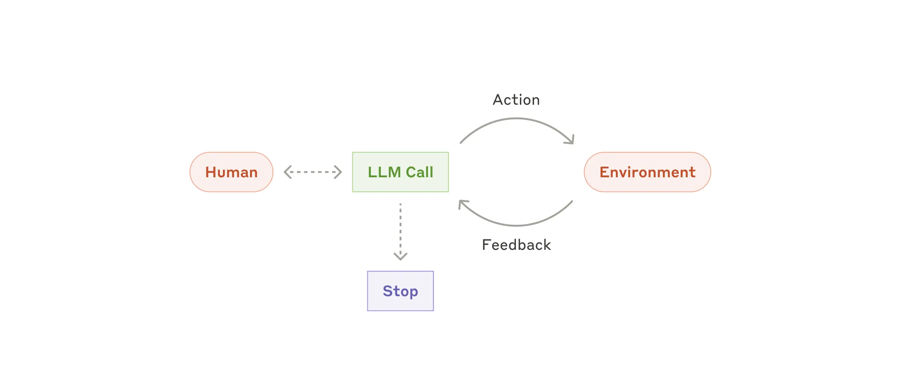
  <figcaption>Схема полезна именно рядом с разговором об агенте как петле: модель не просто отвечает, а выбирает действия, получает результат из среды и продолжает цикл. Источник: <a href="https://www.anthropic.com/engineering/building-effective-agents">Building effective agents</a>. Локальный файл: <code>assets/theory-images/anthropic-autonomous-agent.webp</code>.</figcaption>
</figure>

Но агентская петля не является универсальным способом работы. Она особенно полезна там, где есть ясный критерий успеха, доступные инструменты, дешёвые итерации и задача, которая требует большого числа проб. Если человек заранее чувствует, что придётся перебрать много вариантов, это хороший кандидат для агентской петли. Если же критерий успеха неясен, а ошибка имеет высокий социальный, продуктовый или архитектурный риск, петля без сильного человеческого контроля может только быстрее размножить неверную гипотезу.

Практически это хорошо видно на задачах вроде отладки, оптимизации производительности, обновления зависимости, уменьшения размера контейнера, проверки нескольких вариантов API или поиска рабочей комбинации параметров. В таких задачах агент может много раз выполнить короткий цикл: изменить, запустить, прочитать сигнал, поправить. Если задача требует сначала решить, что считать правильным поведением, петля начинается с уточнения намерения и критериев приёмки. Код появляется после этого.

## 4. “Агент = модель + обвязка” — полезная, но неполная формула

[HumanLayer](https://github.com/humanlayer/12-factor-agents) формулирует простую рамку: агент разработки равен модели плюс [обвязке](#story-07-humanlayer--1-glavnaya-ramka-inzhenerit-nuzhno-ne-tolko-model-no-i-ee-sredu). Это полезная точка входа, потому что она сразу выводит разговор за пределы модели. Агент — это не только языковая модель. Это системный запрос, окно контекста, инструменты, права, формат вызовов, проверки, память, способ сжатия, хуки, MCP, `skills`, подагенты и человеческие подтверждения.

<figure class="source-figure" id="fig-fowler-harness-bounded-contexts">
  
  <figcaption>Эта схема уточняет слишком широкую формулу “модель плюс обвязка”: один и тот же термин <code>harness</code> меняет смысл в разных границах системы. Для нашего текста это полезно именно в месте, где обвязка перестаёт быть лозунгом и становится конкретным уровнем проектирования. Источник: <a href="https://martinfowler.com/articles/harness-engineering.html">Harness engineering for coding agent users</a>. Локальный файл: <code>assets/theory-images/fowler-harness-bounded-contexts.png</code>.</figcaption>
</figure>

<figure class="source-figure" id="fig-fowler-harness-overview">
  
  <figcaption>Схема хорошо показывает, что агентская работа управляется не только моделью, но и направляющими, датчиками, правами, проверками и человеком, который настраивает эту среду. Источник: <a href="https://martinfowler.com/articles/harness-engineering.html">Harness engineering for coding agent users</a>. Локальный файл: <code>assets/theory-images/fowler-harness-overview.png</code>.</figcaption>
</figure>

Anthropic в [`Building Effective AI Agents`](https://www.anthropic.com/engineering/building-effective-agents) даёт важное ограничение к этой рамке: начинать лучше с простых, понятных конструкций и добавлять агентскую сложность только там, где она действительно окупается. Не всякая задача требует полноценного агента, подагентов, сложной маршрутизации и долгой автономии. Иногда [предопределённый рабочий процесс надёжнее](https://www.anthropic.com/engineering/building-effective-agents), дешевле и понятнее, чем “самостоятельный” агент, который выбирает действия на каждом шаге.

[HumanLayer / 12 Factor Agents](https://github.com/humanlayer/12-factor-agents) добавляет [практический урок](#story-07-humanlayer--1-glavnaya-ramka-inzhenerit-nuzhno-ne-tolko-model-no-i-ee-sredu) против чрезмерной зависимости от фреймворков: лучше не пытаться сразу заменить существующую разработку большим агентским фреймворком. Надёжнее брать маленькие модульные идеи и встраивать их в уже существующий продуктовый и инженерный процесс: владеть запросами, явно управлять окном контекста, считать инструменты структурированными выходами, объединять состояние выполнения и состояние задачи, уметь ставить агента на паузу и возобновлять, обращаться к человеку через вызов инструмента, а не через неформальный побочный канал. Это хорошо совпадает с doc-first-подходом: сначала маленькие управляемые элементы среды, потом более сложный процесс.

Особенно важна мысль “инструменты — это структурированные выходы модели”. Вызов инструмента не является магическим действием модели во внешнем мире. Модель выдаёт структурированное намерение действия, а детерминированный код интерпретирует его, проверяет, выполняет и возвращает результат в контекст. Эта граница полезна: вероятностная часть выбирает следующий шаг, программная часть отвечает за исполнение, права, ошибки, повтор, журнал и формат результата. Чем яснее эта граница, тем проще строить безопасный агентский процесс.
<figure class="source-figure" id="fig-humanlayer-context-building">
  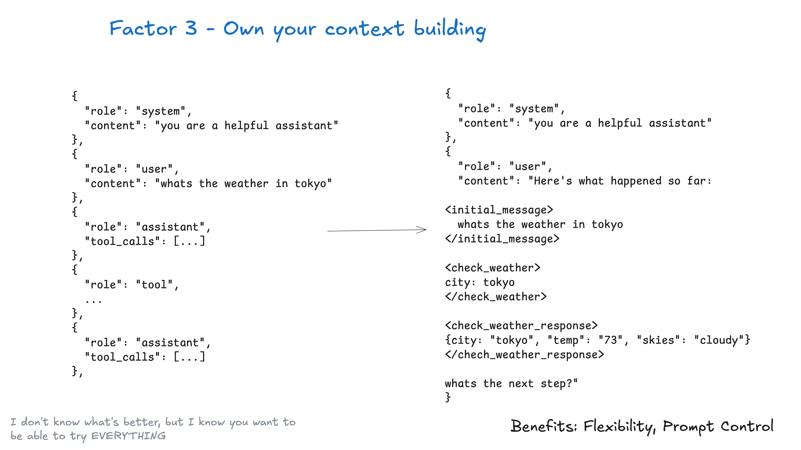
  <figcaption>Эта схема добавляет к формуле “инструменты — структурированные выходы” ещё один слой: контекст для следующего шага не должен случайно накапливаться в чате, его можно собирать приложением как часть обвязки. Источник: <a href="https://github.com/humanlayer/12-factor-agents">12 Factor Agents</a>. Локальный файл: <code>assets/theory-images/humanlayer-context-building.png</code>.</figcaption>
</figure>

Агентская система должна оставаться обычной программной системой: у неё есть входные данные, состояние, поток управления, обработка ошибок, журнал, повторные попытки и точки остановки. Чем яснее эти элементы вынесены в код и артефакты, тем меньше приходится надеяться на то, что модель “сама догадается” правильно продолжить.

## 5. Хороший запрос больше не является единицей управления процессом

Хороший запрос остаётся важным, но он перестаёт быть центральной единицей процесса. У запроса слишком короткая жизнь. Он живёт в одном разговоре, теряется в истории, смешивается с логами и частичными исправлениями, не всегда переносится между сессиями и плохо подходит для повторяемых процедур.

Продвинутая агентская работа поэтому всё чаще выносит смысл в устойчивые формы. Часть этих форм задаёт постоянную рамку проекта: `AGENTS.md`, `CLAUDE.md`, локальные правила и архитектурные документы. Другая часть относится к конкретной задаче: `research.md`, `plan.md`, PRD, ADR, файл прогресса или файл передачи состояния. Повторяемые процедуры постепенно превращаются в `skills`, slash-команды, скрипты и хуки. Проверка оставляет свои артефакты: вывод тестов, снимок экрана, трассировка, прогон CI, классификацию ревью. Для долгой работы появляются формы памяти и среды выполнения: [граф задач](#theoretical-synthesis--24-graf-zadach-kak-vneshnyaya-pamyat-agenta), состояние сессии, поток работы, события, подтверждения, diff и восстановимая задача.

Эти формы отличаются от запроса тем, что могут пережить сессию и стать частью процесса. План можно прочитать и поправить. Навык можно вызвать в другой задаче. Хук может сработать без напоминания. CI может остановить неверный результат. Граф задач может показать, какие задачи готовы, заблокированы или уже взяты другим агентом.

[Статья Fowler / Thoughtworks про инженерию контекста](https://martinfowler.com/articles/exploring-gen-ai/context-engineering-coding-agents.html) прямо показывает, что почти все формы контекстной инженерии в агентах разработки в итоге проходят через markdown-файлы с разными типами запросов. Но важнее различение: одни тексты являются инструкциями для конкретного действия, другие — общими указаниями, правилами и предохранителями, которым агент должен следовать. Эти два типа часто смешиваются, но для процесса полезно их различать.

Инструкция отвечает на вопрос “что сделать сейчас?”. Общие указания отвечают на вопрос “как обычно работать в этом проекте?”. Навык отвечает на вопрос “какую процедуру открыть, если задача относится к этому классу?”. `AGENTS.md` отвечает на вопрос “какие постоянные правила и указатели нужны почти всегда?”. Документ намерения отвечает на вопрос “что именно мы сейчас пытаемся провести через проект и почему?”.

Если всё это смешать в один длинный запрос, процесс быстро становится хрупким. Если разделить, появляется управляемость.

---

## 6. Инструментальные поверхности: что интерфейс делает видимым и что прячет {#tool-surfaces}

Разные агентские инструменты отличаются не только моделью и набором функций. Они задают разную рабочую поверхность: где возникает задача, где хранится состояние, кто видит ход работы, как появляется `diff`, где запускается проверка и в какой момент человек принимает решение. Поэтому при переходе между инструментами лучше переносить механику: где живёт задача, кто видит ход работы, как появляется `diff` и где принимается решение.

Например, [GitHub Copilot cloud agent](https://docs.github.com/en/copilot/concepts/agents/cloud-agent/about-cloud-agent) работает вокруг issue, ветки, GitHub Actions и pull request. Такая поверхность делает видимыми задачу, план, коммиты, журналы работы, CI и состояние PR. IDE-агент, наоборот, обычно ближе к локальному `diff`, быстрому разговору и ручной проверке в рабочем дереве. Веб-агент или облачный агент лучше подходит для фоновой задачи, но может скрывать часть промежуточных решений, если не оставляет достаточно журналов и проверяемых артефактов. Инструменты для быстрой сборки интерфейсов делают видимой продуктовую поверхность, но часто хуже показывают архитектурную границу, эксплуатационные риски и будущую поддержку.

Для Handbook это практическая оговорка. Если инструмент помогает быстро открыть PR, это ещё не значит, что задача готова к ревью. Если инструмент даёт агенту браузер, это ещё не значит, что проверены данные, права и безопасность. Если инструмент хранит журнал сессии, это ещё не значит, что человек получил рабочее состояние задачи. При выборе режима сначала смотрите, какую часть процесса инструмент делает видимой, а какую придётся компенсировать документом, проверкой, песочницей, ручным шлюзом или отдельным разбором.

<figure class="source-figure" id="fig-fowler-sdd-overview">
  
  <figcaption>Схема показывает базовое разделение между постоянной памятью проекта и спецификациями конкретных изменений. Это хорошо поддерживает мысль о разных носителях контекста и намерения. Источник: <a href="https://martinfowler.com/articles/exploring-gen-ai/sdd-3-tools.html">Understanding Spec-Driven-Development: Kiro, spec-kit, and Tessl</a>. Локальный файл: <code>assets/theory-images/fowler-sdd-overview.png</code>.</figcaption>
</figure>

# Часть II. Контекст и намерение

После перехода от запроса к среде первый вопрос — что именно модель видит и как удерживается смысл задачи. Контекст отвечает за рабочее состояние модели, а артефакты намерения помогают не потерять цель, когда работа проходит через планы, код, проверки и новые сессии.

## 7. Контекст — не окно, а рабочее состояние {#6-kontekst-ne-okno-a-rabochee-sostoyanie}

Большое контекстное окно само по себе не решает проблему агентской разработки. Оно позволяет загрузить больше текста, но не гарантирует, что модель увидит нужное, правильно оценит важность, не увязнет в шуме и не продолжит старую ошибочную траекторию.

Контекст лучше понимать как рабочее состояние модели перед следующим действием. Это состояние содержит факты, гипотезы, прошлые ошибки, текущий план, видимые файлы, результаты инструментов, инструкции, следы ревью, выводы тестов, иногда длинные логи и JSON-объекты. Если состояние хорошее, модель может сделать полезный следующий шаг. Если состояние загрязнено, модель может выглядеть уверенно, но двигаться по неверной траектории.
<figure class="source-figure" id="fig-anthropic-context-vs-prompt-engineering">
  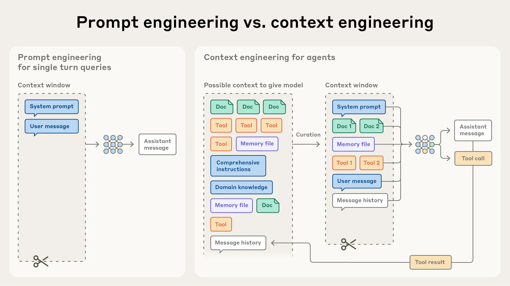
  <figcaption>Схема хорошо усиливает тезис раздела: контекст — это не просто размер окна и не один удачный запрос, а динамическая система выбора, сжатия, изоляции и подачи состояния. Источник: <a href="https://www.anthropic.com/engineering/effective-context-engineering-for-ai-agents">Effective context engineering for AI agents</a>. Локальный файл: <code>assets/theory-images/anthropic-context-vs-prompt-engineering.webp</code>.</figcaption>
</figure>

<figure class="source-figure" id="fig-fowler-coding-context-overview">
  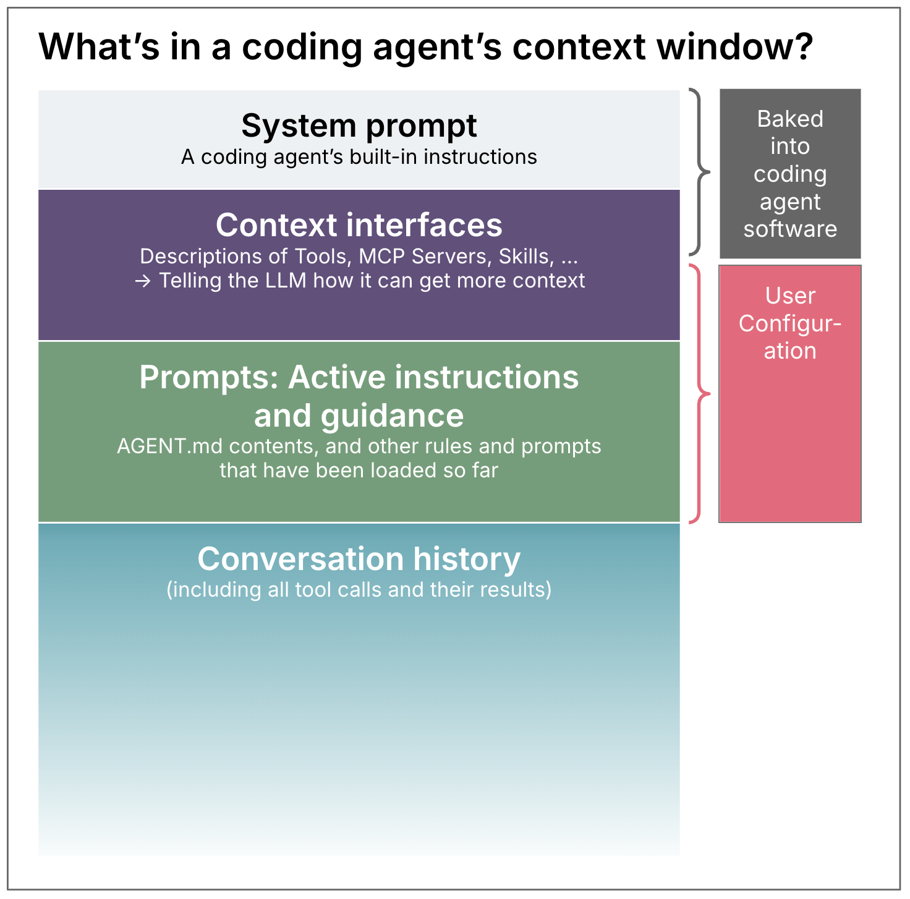
  <figcaption>Эта схема полезна рядом с разделом о контексте: она разделяет встроенные инструкции агента, интерфейсы получения контекста, активные инструкции пользователя и историю разговора. Источник: <a href="https://martinfowler.com/articles/exploring-gen-ai/context-engineering-coding-agents.html">Context Engineering for Coding Agents</a>. Локальный файл: <code>assets/theory-images/fowler-coding-context-overview.png</code>.</figcaption>
</figure>

[HumanLayer в Advanced Context Engineering](https://www.humanlayer.dev/blog/advanced-context-engineering) подчёркивает именно это. Проблема не только в том, что контекст переполняется. Проблема в том, что длинная сессия может превращаться в отрицательную траекторию: модель видит историю ошибок, исправлений, частичных гипотез и неудачных попыток, и продолжает паттерн. Поэтому регулярное сжатие полезно использовать до переполнения окна: оно переводит шумный след выполнения в короткое состояние задачи. Сессию нужно регулярно переводить из шумного следа выполнения в более чистый артефакт состояния.

<figure class="source-figure" id="fig-humanlayer-intentional-compaction">
  
  <figcaption>Схема добавляет к разделу конкретную форму “контекста как рабочего состояния”: сжатие здесь не аварийное уменьшение текста, а намеренное сохранение цели, решений, проверок и следующего шага перед продолжением работы. Источник: <a href="https://www.humanlayer.dev/blog/advanced-context-engineering">Advanced Context Engineering for Coding Agents</a>. Локальный файл: <code>assets/theory-images/humanlayer-intentional-compaction.png</code>.</figcaption>
</figure>

[Anthropic добавляет](https://platform.claude.com/cookbook/tool-use-context-engineering-context-engineering-tools) к этому ещё одну линию: полезность контекста может деградировать не только из-за размера, но и из-за качества содержимого. В контексте накапливаются устаревшие результаты инструментов, длинные логи, частичные ответы, повторяющиеся ошибки и случайные детали. Это иногда называют деградацией полезности контекста. Поэтому управление контекстом включает несколько разных действий: записывать состояние вне окна, выбирать релевантные фрагменты, сжимать длинную историю, изолировать подзадачи и очищать результаты инструментов, которые больше не нужны. Это разные механизмы, а не одно “суммаризуй чат”.

Это меняет смысл сжатия. Плохое сжатие — это потеря информации. Хорошее сжатие — это управление рабочим состоянием. Оно должно оставить цель, решения, открытые вопросы, проверенные факты, артефакты, оставшиеся риски и следующий шаг; при этом убрать длинные логи, неудачные гипотезы, повторяющиеся команды и промежуточный шум.

## 8. Контекстные интерфейсы: кто решает, что загрузить {#7-kontekstnye-interfeysy-kto-reshaet-chto-zagruzit}

[Fowler / Thoughtworks](https://martinfowler.com/articles/exploring-gen-ai/context-engineering-coding-agents.html) вводят полезное понятие контекстных интерфейсов: способов, которыми модель может получить дополнительный контекст при необходимости. Это могут быть обычные инструменты чтения файлов, команды shell, [MCP-серверы](https://developers.openai.com/codex/mcp), `skills`, подагенты, плагины, скрипты, доступ к JIRA или браузеру. Важно не только наличие таких интерфейсов, но и вопрос: кто решает, когда их использовать?

Есть три разных режима.

Первый — решает модель. Она сама выбирает, когда открыть skill, вызвать MCP или прочитать файл. Это нужно для автономной работы, но несёт неопределённость: модель может не вызвать нужный инструмент или вызвать лишний.

Второй — решает человек. Slash command, явно приложенный файл, вручную выбранный контекст, прямой запрос “прочитай этот документ”. Это даёт больше контроля, но снижает автономность и требует внимания.

Третий — решает агентское программное обеспечение. Хук, событие жизненного цикла, детерминированная подача контекста, политика инструментов. Это надёжнее, но требует проектирования системы и может быть слишком жёстким, если событие распознано неверно.

Это различение полезнее, чем общий совет “дайте агенту контекст”. В разных задачах нужен разный режим. Если задача повторяется и хорошо распознаётся, лучше детерминированный триггер. Если задача редкая и сложная, человек может явно вызвать нужный документ или skill. Если задача должна выполняться автономно, модель должна иметь [контекстные интерфейсы](#theoretical-synthesis--7-kontekstnye-interfeysy-kto-reshaet-chto-zagruzit) и инструкцию, когда их искать.

<figure class="source-figure" id="fig-fowler-claude-code-context-command">
  
  <figcaption>Скриншот хорошо подходит к подглаве о контекстных интерфейсах: контекст становится не невидимым фоном, а объектом, который можно посмотреть, оценить и при необходимости изменить. Источник: <a href="https://martinfowler.com/articles/exploring-gen-ai/context-engineering-coding-agents.html">Context Engineering for Coding Agents</a>. Локальный файл: <code>assets/theory-images/fowler-claude-code-context.png</code>.</figcaption>
</figure>

[LangChain описывает](https://www.langchain.com/state-of-agent-engineering) близкую практическую картину через четыре операции над контекстом: записать состояние вне окна, выбрать нужную информацию, сжать лишнее и изолировать работу в отдельном контексте. Эта формула полезна именно своей простотой. Она заставляет смотреть на инжиниринг контекста как на выбор: что сохранить, что выбрать, что сжать, а что вынести в отдельного агента или отдельную сессию.

Этот же слой важен для наблюдаемости: если контекст выбирается, сжимается и изолируется, нужно видеть, какие именно фрагменты были выбраны, что было отброшено, какие инструменты дали данные и где контекст перестал соответствовать задаче. Наблюдаемость агентской работы должна включать не только вызовы инструментов, но и контекстные решения.

## 9. Кодовая база как контекстный интерфейс {#8-kodovaya-baza-kak-kontekstnyy-interfeys}

Самый базовый и мощный контекстный интерфейс — сама кодовая база. Агент читает файлы, ищет определения, запускает `grep`, смотрит тесты, выводит типы, изучает конфиги, сравнивает паттерны. Поэтому вопрос “насколько кодовая база понятна модели?” становится инженерным вопросом.

Хороший код для агента похож на хороший код для человека, но акценты немного меняются. Модели помогают явные границы модулей, последовательные имена, устойчивые паттерны, понятные точки входа, локальные README, явные тесты, небольшие функции, хорошая типизация, предсказуемая структура директорий. Модели вредят скрытые соглашения, хаотические зависимости, много способов сделать одно и то же, устаревшие файлы, сложные побочные эффекты, непроверяемые скрипты и “исторические” исключения, которые знают только люди.

[OpenAI говорит о читаемости приложения для Codex](https://openai.com/index/unlocking-the-codex-harness/). Одной читабельности исходников для этого недостаточно. Агенту нужно уметь запустить приложение, увидеть его состояние, прочитать DOM, получить снимок экрана, найти логи, понять метрики, воспроизвести баг и проверить исправление. Если приложение невозможно поднять локально, если интерфейс не доступен для инструментов, если логи шумные, если тестовая среда не изолирована, агент будет работать по догадке.
<figure class="source-figure" id="fig-openai-limits-of-agent-knowledge">
  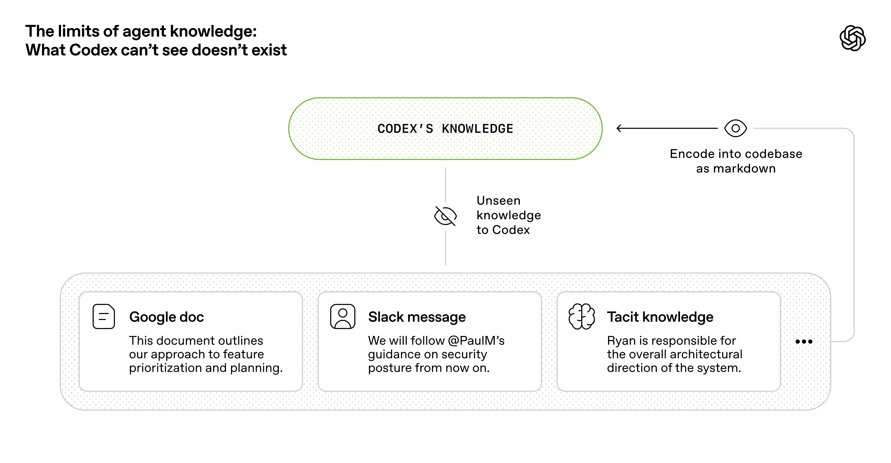
  <figcaption>Схема ставит рядом кодовую базу и недоступные агенту состояния приложения, инфраструктуры и домена. Это поддерживает мысль, что читаемого репозитория недостаточно: агенту нужны запуск, логи, DOM, снимки экрана, метрики и проверяемые сценарии. Источник: <a href="https://openai.com/index/harness-engineering/">Harness engineering</a>. Локальный файл: <code>assets/theory-images/openai-limits-of-agent-knowledge.webp</code>.</figcaption>
</figure>

Здесь возникает важный прогноз: проектирование кодовой базы и платформы будут всё чаще оцениваться не только по удобству для людей, но и по пригодности для агентской работы. Проект с хорошими тестами, типами, локальной средой, явными границами и наблюдаемостью будет получать больше пользы от агентов, чем проект, где каждое изменение требует устной памяти команды и ручного запуска нестандартных сценариев.

Это не значит, что нужно проектировать код “для моделей вместо людей”. Скорее, агентская разработка усиливает старые инженерные добродетели: читаемость, модульность, явные интерфейсы, хорошая тестируемость, локальная воспроизводимость. Разница в том, что раньше плохая структура замедляла человека; теперь она ещё и заставляет агента размножать плохие паттерны быстрее.

## 10. Долговременный контекст, спецификация и передача состояния — разные вещи {#9-dolgovremennyy-kontekst-spetsifikatsiya-i-peredacha-sostoyaniya-raznye-veschi}

Практика быстро показала, что соблазн загрузить весь проектный контекст в один `AGENTS.md` или `CLAUDE.md` опасен. Такой файл кажется удобным: всё важное всегда доступно агенту. Но постоянный контекст дорог. Он вытесняет пространство текущей задачи, может противоречить новым правилам, быстро устаревает и снижает способность модели следовать действительно важным инструкциям.

[OpenAI даёт хорошее решение](https://developers.openai.com/codex/guides/agents-md): `AGENTS.md` как оглавление проекта. Его задача — указывать агенту, где находится актуальное знание и какие правила действительно глобальны. Подробные решения должны жить в `docs/`, рядом с кодом, в проверяемой структуре.

У файлов вроде `AGENTS.md` есть и другая функция. Они постепенно становятся слоем управления поведением агента: фиксируют не только команды запуска, но и ограничения приватности, доступности, безопасности, тона, публичной коммуникации и работы с пользовательскими данными. Это не делает такой файл механизмом гарантии. Модель может не применить правило или применить его не туда. Поэтому управленческие указания должны подкрепляться проверками, правами, примерами и человеческими шлюзами. Но сама тенденция важна: агентская разработка заставляет проект явно записывать то, что раньше жило как неформальная культура команды.

Здесь полезно различать три слоя.

[Долговременная память проекта](#theoretical-synthesis--6-kontekst-ne-okno-a-rabochee-sostoyanie) — это `AGENTS.md`, архитектурные заметки, продуктовый контекст, документы типа memory bank. Она задаёт рамку, релевантную многим задачам.

Спецификация конкретного изменения — это `plan.md`, PRD, spec, issue или ADR. Она держит намерение одной работы.

Передача состояния — это переходное состояние между исполнителями или сессиями: что сделано, что осталось, какие проверки прошли, где нужен человек.

Если эти уровни смешать, постоянный контекст разрастается, а конкретная спецификация начинает притворяться общей истиной проекта. Хороший процесс хранит эти слои отдельно и связывает их ссылками.

## 11. Артефакт намерения: prompt как delivery artifact {#10-artefakt-namereniya-spdd-spetsifikatsiya-i-proverka-samoy-tseli}

[Structured-Prompt-Driven Development](https://martinfowler.com/articles/structured-prompt-driven/) стоит читать не как очередную технику “написать хороший запрос”, а как сильную форму управления намерением в агентской разработке. Его исходный ход простой: когда модель уже может быстро производить код, главная опасность — не медленная реализация, а быстро размноженное недопонимание. SPDD поэтому переносит центр процесса с одноразового чата на сопровождаемый артефакт намерения.

<figure class="source-figure" id="fig-fowler-spdd-overview">
  
  <figcaption>SPDD начинает не с генерации кода, а с превращения prompt в первый класс delivery artifact: его можно версионировать, ревьюить, переиспользовать и синхронизировать с кодом. Источник: <a href="https://martinfowler.com/articles/structured-prompt-driven/">Structured-Prompt-Driven Development</a>. Локальный файл: <code>assets/theory-images/fowler-spdd-overview.svg</code>.</figcaption>
</figure>

В обычном агентском режиме запрос часто живёт слишком коротко. Он попадает в чат, помогает получить `diff`, а затем растворяется в истории, сжатии контекста, последующих правках и локальных объяснениях. Через две недели остаётся код, но теряется исходная модель решения: какие требования были поняты, какие границы приняты, какие варианты отклонены, какие нормы считались обязательными и какие предохранители нельзя было нарушать. SPDD отвечает на это превращением structured prompt в поддерживаемый файл, который лежит рядом с кодом и продолжает быть рабочим объектом после генерации.

Это роднит SPDD с [Boris Tane](#story-01-boris-tane--4-stadiya-planirovaniya-plan-kak-otdelnyy-markdown-dokument), где `research.md` и `plan.md` делают первое понимание агента видимым до кода, с [Jesse Vincent](#story-06-jesse-vincent--5-plan-kak-perenosimyy-nositel-konteksta), где план становится входом для следующей сессии, и с [Mark Erikson](#story-10-mark-erikson--11-dev-plans-vneshnyaya-rabochaya-pamyat-otdelennaya-ot-repozitoriya-koda), где внешняя память защищает ментальную модель человека. Но SPDD идёт дальше минимального plan-first. Он говорит: если артефакт намерения действительно важен, его нужно не только написать до кода, но и сопровождать после кода.

SPDD полезен именно как team-level метод. Fowler / Thoughtworks начинают статью с ограничения индивидуального AI-ускорения: один разработчик может быстрее набрасывать и менять код, но системная скорость упирается в ambiguous requirements, рост review load, inconsistency, integration/testing issues и production risk. SPDD отвечает не на вопрос “как сгенерировать больше кода”, а на вопрос “как сделать AI-generated changes governable, reviewable and reusable”. Поэтому его нельзя свести к улучшенной формулировке prompt. Это попытка перенести prompt в ту же дисциплину, где уже живут код, тесты, review и commit history.

Важно не подменить эту мысль лозунгом “документы важнее кода”. В SPDD код, тесты, runtime-проверки и человеческие решения остаются отдельными слоями истины. Отличие в том, что намерение перестаёт быть расходуемым сообщением. Оно становится версионируемым, ревьюируемым и повторно используемым объектом, который должен эволюционировать вместе с реализацией.

## 12. Что SPDD добавляет к SDD и почему это не просто spec-first {#spdd-adds-to-sdd}

SPDD начинается в той же точке, что и [spec-driven development](https://martinfowler.com/articles/exploring-gen-ai/sdd-3-tools.html): сначала формулируется спецификация, затем модель помогает получить код. Но важная часть SPDD не в факте “spec before code”, а в способе производства, проверки и сопровождения этой спецификации. Thoughtworks в отдельном [обзоре SDD](https://martinfowler.com/articles/exploring-gen-ai/sdd-3-tools.html) различает **spec-first**, **spec-anchored** и **spec-as-source**. SPDD находится ближе всего к spec-anchored: prompt/spec сохраняется после первой реализации и становится якорем дальнейшей эволюции, но не объявляется единственным источником правды.

У SPDD есть четыре добавления к обычному SDD.

Первое — **maintained artifact**. Structured prompt не создаётся один раз и не выбрасывается после генерации. Он проходит workflow, живёт в version control, может ревьюиться, переиспользоваться и улучшаться.

Второе — **переход от требований к engineering spec**. [REASONS Canvas](#theoretical-synthesis--spdd-reasons-canvas-intent-design-execution-governance) не только говорит, что система должна делать. Он фиксирует chosen approach, system structure, engineering norms и safeguards. Модель получает не только цель, но и implementation boundary.

Третье — **[sync, not handoff](#theoretical-synthesis--spdd-prompt-update-sync)**. Prompt и code не расходятся молча. Если меняется business rule, сначала меняется prompt. Если код меняется без изменения поведения, prompt синхронизируется обратно. Следующая итерация стартует от актуального intent asset, а не от исторического документа.

Четвёртое — **repeatable team control**. Цель не в том, чтобы каждый раз писать более длинную спецификацию. Цель в том, чтобы команда могла повторяемо управлять AI output: смотреть на один и тот же тип артефакта, проверять похожие места, переносить доменное знание между итерациями и снижать variance между разработчиками.

Поэтому SPDD занимает промежуточную позицию. Он сильнее обычного [`plan.md`](#story-01-boris-tane--4-stadiya-planirovaniya-plan-kak-otdelnyy-markdown-dokument), потому что план должен быть синхронизируемым delivery artifact. Но он осторожнее spec-as-source, потому что не требует, чтобы человек перестал трогать код. Для этого сайта это важный баланс: doc-first не должен превращаться в “документ вместо системы”. Хороший intent artifact должен быть связан с кодом, тестами, runtime evidence и человеческим решением, а не заменять их.

## 13. Шесть стадий SPDD: распределённое подтверждение намерения {#spdd-six-step-workflow}

SPDD workflow устроен не как один большой “сначала план, потом код”. В Q&A авторы специально объясняют, почему шагов шесть: если подтвердить intent одним большим review после plan generation, когнитивная нагрузка слишком велика. Люди начинают skim, откладывать, одобрять по умолчанию, и drift становится неизбежным даже в аккуратно выглядящем документе. SPDD дробит подтверждение намерения на маленькие решения, которые человек ещё способен реально прочитать.

<figure class="source-figure" id="fig-fowler-spdd-workflow">
  
  <figcaption>SPDD workflow показывает закрытый цикл: бизнес-ввод превращается в анализ, REASONS Canvas, генерацию, проверку, ревью и обратную синхронизацию prompt/code. Источник: <a href="https://martinfowler.com/articles/structured-prompt-driven/">Structured-Prompt-Driven Development</a>. Локальный файл: <code>assets/theory-images/fowler-spdd-workflow.svg</code>.</figcaption>
</figure>

Полная последовательность выглядит так.

1. **Create initial requirements**: raw idea или enhancement превращается в user story. Опциональная команда [`/spdd-story`](https://github.com/gszhangwei/open-spdd/blob/v0.4.9/internal/templates/data/optional/spdd-story.md) разбивает крупное требование на INVEST-like stories размером примерно 1–5 дней, с business-language acceptance criteria.
2. **Review and clarify the story**: человек подтверждает, что story действительно выражает нужный business intent. В walkthrough две generated stories объединяются в simplified story с Background, Business Value, Scope In, Scope Out и Acceptance Criteria.
3. **Generate analysis context**: [`/spdd-analysis`](https://github.com/gszhangwei/open-spdd/blob/v0.4.9/internal/templates/data/core/spdd-analysis.md) извлекает domain keywords, сканирует релевантную часть codebase, выделяет existing/new concepts, business rules, strategic approach, risks и gaps.
4. **Generate and review REASONS Canvas**: [`/spdd-reasons-canvas`](https://github.com/gszhangwei/open-spdd/blob/v0.4.9/internal/templates/data/core/spdd-reasons-canvas.md) превращает analysis context в structured prompt: Requirements, Entities, Approach, Structure, Operations, Norms, Safeguards.
5. **Generate code, validate behavior and review**: [`/spdd-generate`](https://github.com/gszhangwei/open-spdd/blob/v0.4.9/internal/templates/data/core/spdd-generate.md) строит код по Operations, затем [`/spdd-api-test`](https://github.com/gszhangwei/open-spdd/blob/v0.4.9/internal/templates/data/optional/spdd-api-test.md) проверяет system boundary, а review делит изменения на logic corrections и refactorings.
6. **Generate unit tests**: после стабилизации реализации создаётся отдельный testing prompt, сценарии дедуплицируются против существующего test suite, затем генерируются unit tests как regression safety net.

Смысл последовательности не в ceremony. Каждый шаг сужает вопрос для человека. На [story уровне](#theoretical-synthesis--spdd-story-shaping) проверяется правильная business problem. На [analysis уровне](#theoretical-synthesis--spdd-analysis-context) — domain understanding и risks. На [Canvas уровне](#theoretical-synthesis--spdd-reasons-canvas-intent-design-execution-governance) — design, boundaries и executable operations. На code level — behavior, structure, maintainability. На unit-test level — долговременная regression protection. К моменту code review требования, доменная модель и design уже должны быть подтверждены, поэтому человеческое внимание тратится на решения, которые действительно относятся к коду.

Это уточняет обычный [plan-first](#handbook--plan-first). У [Boris Tane](#story-01-boris-tane--4-stadiya-planirovaniya-plan-kak-otdelnyy-markdown-dokument) человек видит план до реализации. В SPDD человек видит не один план, а несколько слоёв намерения, каждый из которых должен быть достаточно малым, чтобы его можно было прочитать без иллюзии контроля.

## 14. Story shaping: сырое требование ещё не является входом для Canvas {#spdd-story-shaping}

Сильная деталь SPDD часто теряется при кратком пересказе: workflow начинается не с REASONS Canvas. До [Canvas](#theoretical-synthesis--spdd-reasons-canvas-intent-design-execution-governance) есть story shaping. Команда [`/spdd-story`](https://github.com/gszhangwei/open-spdd/blob/v0.4.9/internal/templates/data/optional/spdd-story.md) опциональна, но сама стадия принципиальна: raw enhancement нужно превратить в управляемую user story, иначе analysis и Canvas будут уточнять не ту задачу.

В walkthrough исходное enhancement касается billing engine для LLM API platform: существующая система должна поддержать Standard и Premium планы, model-aware pricing, prompt/completion split-rate billing, quota/overage logic и extensible design для будущих pricing models. `/spdd-story` сначала разбивает требование на две deliverable stories: Standard Plan / model-aware pricing и Premium Plan / split-rate billing. Затем авторы для walkthrough сознательно консолидируют их в одну [simplified story](https://martinfowler.com/articles/structured-prompt-driven/#combined-user-story-simplified), чтобы пример был self-contained.

Эта consolidated story сохраняет только пять разделов: **Background**, **Business Value**, **Scope In**, **Scope Out**, **Acceptance Criteria**. Implementation detail сознательно убирается: на story level нужно описать, что система должна делать, а не как. Acceptance Criteria формулируются через Given/When/Then и concrete numeric examples. Например, Standard Plan должен показывать quota-covered tokens, overage и charge в зависимости от `modelId`; Premium Plan должен считать prompt/completion tokens по разным ставкам; response format должен возвращать bill id, customer id, token counts, timestamp, `modelId` и plan-appropriate charge breakdown.

Эта стадия важна для всего метода. Если raw idea плохо сформулирована, REASONS Canvas может сделать её более убедительной, но не более правильной. SPDD поэтому сначала требует согласования business language: что входит в scope, что явно out-of-scope, какие acceptance criteria проверяют реальное поведение, какой Definition of Done будет считаться победой. Только после этого имеет смысл строить analysis context.

В этом месте SPDD близок к [Matt Pocock `/grill-me`](#story-12-matt-pocock-skills--5-grill-me-ostanovit-prezhdevremennoe-ponimanie), но работает в более формализованной delivery-среде. У Pocock skill задаёт вопросы, пока намерение не станет рабочим. В SPDD story shaping делает то же самое, но результат сразу становится входом для следующих команд и будущего versioned artifact.

## 15. Analysis context: strategic clarity до implementation detail {#spdd-analysis-context}

После [story shaping](#theoretical-synthesis--spdd-story-shaping) SPDD не прыгает к Canvas и тем более к коду. [`/spdd-analysis`](https://github.com/gszhangwei/open-spdd/blob/v0.4.9/internal/templates/data/core/spdd-analysis.md) получает business requirements, извлекает domain keywords и сканирует только релевантные части кодовой базы. Это важное ограничение: агент не должен “читать всё” как шумный ритуал, но и не должен строить решение из головы. Он ищет domain concepts, business rules, existing concepts, new concepts, strategic direction, risks, gaps и acceptance-criteria coverage.

<figure class="source-figure" id="fig-fowler-spdd-analysis-review">
  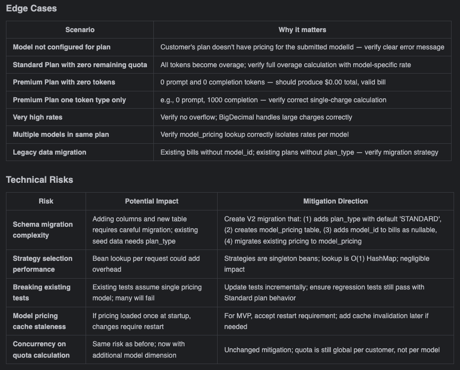
  <figcaption>Фрагмент analysis review показывает, зачем SPDD отделяет стратегический анализ от кода: edge cases и technical risks становятся видимыми до генерации. Источник: <a href="https://martinfowler.com/articles/structured-prompt-driven/">Structured-Prompt-Driven Development</a>. Локальный файл: <code>assets/theory-images/fowler-spdd-analysis-review.png</code>.</figcaption>
</figure>

Analysis context отвечает на “what” и “why”, а не на granular implementation. В billing example он должен распознать существующую billing model, quota logic, plan differentiation, model-aware rate selection, validation behavior, response contract и риски изменения. На этом этапе появляются edge cases и technical risks: отрицательные tokens, unknown customer, missing `modelId`, backward compatibility с historical bills, различие quota/overage и premium split-rate rules.

Review analysis context выполняет две функции. Во-первых, человек проверяет, совпадает ли его понимание требований с интерпретацией AI. Во-вторых, AI может поднять boundary scenarios, которые человек не назвал. Это не “модель знает бизнес лучше”. Это способ дешево расширить список вопросов до того, как они превратились в code paths.

Здесь SPDD особенно хорошо ложится на тезис [HumanLayer](#story-07-humanlayer--4-chelovecheskoe-vnimanie-dolzhno-stoyat-blizhe-k-mestu-gde-rozhdaetsya-delta): человеческое внимание нужно ставить ближе к месту, где рождается delta. Плохая строка в [analysis context](#theoretical-synthesis--spdd-analysis-context) может породить плохой Canvas; плохой Canvas — сотни правдоподобных строк кода. Поэтому analysis review — не подготовительная формальность, а один из самых высокорычажных human gates.

## 16. REASONS Canvas: intent, design, execution, governance {#spdd-reasons-canvas-intent-design-execution-governance}

Центральный инструмент SPDD — [REASONS Canvas](https://martinfowler.com/articles/structured-prompt-driven/#the-reasons-canvas). Он полезен именно тем, что не сводит спецификацию к списку требований или задач. Canvas заставляет удерживать семь измерений: Requirements, Entities, Approach, Structure, Operations, Norms, Safeguards. Эта форма ведёт задачу от intent и design к execution и governance.

<figure class="source-figure" id="fig-fowler-spdd-reasons-canvas">
  
  <figcaption>REASONS Canvas показывает, что структурированный запрос удерживает требования, доменную модель, подход, структуру, операции, нормы и предохранители в одном проверяемом артефакте. Источник: <a href="https://martinfowler.com/articles/structured-prompt-driven/">Structured-Prompt-Driven Development</a>. Локальный файл: <code>assets/theory-images/fowler-spdd-reasons-canvas.svg</code>.</figcaption>
</figure>

Первые четыре элемента работают на уровне абстракции. **Requirements** фиксируют проблему, DoD, acceptance criteria и scope. **Entities** вытаскивают доменные сущности, связи и ключевой vocabulary. **Approach** описывает стратегию решения, trade-offs и выбранные паттерны. **Structure** указывает, где изменение должно лечь в систему: components, dependencies, layers, responsibilities, integration points.

**Operations** переводит абстракцию в исполнимые шаги. В SPDD это не просто TODO-list. Operations должны быть concrete, testable, atomic и acceptance-ready. В Q&A авторы отдельно говорят, что Operations может доходить до method signatures и execution order: reviewers проверяют эти шаги до генерации кода, чтобы generation стала faithful translation of agreed plan, а не импровизацией модели.

Последние два элемента — **Norms** и **Safeguards** — особенно важны для агентской разработки. Norms фиксируют повторяемые инженерные нормы: naming, observability, defensive coding, error handling, layering, logging, team conventions. Safeguards задают non-negotiable boundaries: инварианты, performance limits, security rules, compatibility constraints, запреты на изменение внешнего поведения. Это сближает SPDD с [HumanLayer](#story-07-humanlayer--1-glavnaya-ramka-inzhenerit-nuzhno-ne-tolko-model-no-i-ee-sredu): качество результата задаётся не только моделью, но и тем, какие направляющие, границы и сигналы получает агент.

Сила Canvas в том, что он делает намерение обозримым до `diff`. Человек может проверить не только “что модель собирается сделать”, но и “на каком уровне абстракции она поняла задачу”. Если Requirements выражают не тот продуктовый смысл, если Entities пропускают важный доменный объект, если Approach выбирает плохую архитектурную линию, если Operations разрезают работу по слоям вместо проверяемых [вертикальных срезов](#story-12-matt-pocock-skills--9-to-issues-vertikalnye-zadachi-vmesto-gorizontalnogo-raspila), это нужно увидеть до генерации кода.

Но Canvas не является внешним оракулом истины. Хороший Canvas требует человека, который понимает домен, архитектуру и цену ошибки. Иначе structured prompt может быть просто длинным и уверенным документом, который красиво формализует неверное намерение.

## 17. Три core skills SPDD: Abstraction First, Alignment, Iterative Review {#spdd-three-core-skills}

В статье SPDD отдельно выделены три core skills. Это не side notes, а фактическая модель того, куда смещается ценность разработчика в AI-assisted delivery.

**[Abstraction First](https://martinfowler.com/articles/structured-prompt-driven/abstraction-first.html)** означает design before generation. До кода нужно понять, какие objects существуют, как они взаимодействуют, где проходят boundaries, какие interface responsibilities фиксируются contract-first, какой уровень granularity допустим. В операционных принципах этого skill есть четыре ключа: design before generation, contract first, control granularity, diagram early. Смысл не в любви к диаграммам, а в том, что narrative requirements слишком легко допускают разные интерпретации; lightweight diagrams, ER diagrams, sequence diagrams или flow charts помогают быстро зафиксировать logic model.

**[Alignment](https://martinfowler.com/articles/structured-prompt-driven/alignment.html)** означает lock intent before code. Здесь проверяется domain language, scope, acceptance criteria, dependencies и hidden constraints. Уточняются термины вроде “customer”, “order”, “asset”; устраняются случаи “same word, different meaning” и “same meaning, different words”; happy path, edge cases и Definition of Done становятся testable. Главный operating principle: analysis doc → structured prompt → code. Если ранний артефакт не aligned, нельзя продвигаться дальше.

**[Iterative Review](https://martinfowler.com/articles/structured-prompt-driven/iterative-review.html)** означает turn output into a controlled loop. Агентская работа не должна быть one-shot draft и не должна превращаться в бесконечные patch requests, где решение постепенно drifts. Review loop проверяет prompt/code consistency, architecture and responsibility boundaries, hallucination and correctness. Здесь появляются признаки зрелого процесса: prompt debugging, functional validation, deep code review и asset integrity.

Эти skills важны как сопротивление поверхностному “AI пишет код”. SPDD требует от разработчика не меньше, а больше работы на уровне абстракции. Нужно уметь моделировать домен, принимать архитектурные trade-offs, проектировать atomic tasks, задавать testable acceptance criteria, различать business mismatch и code smell. В этом смысле SPDD не отменяет senior judgement. Он делает места применения этого judgement более явными.

## 18. Generate code: модель реализует locked intent, а не ищет решение заново {#spdd-generate-locked-intent}

Только после [story](#theoretical-synthesis--spdd-story-shaping), [analysis](#theoretical-synthesis--spdd-analysis-context) и [Canvas](#theoretical-synthesis--spdd-reasons-canvas-intent-design-execution-governance) SPDD переходит к [`/spdd-generate`](https://github.com/gszhangwei/open-spdd/blob/v0.4.9/internal/templates/data/core/spdd-generate.md). Эта команда читает REASONS Canvas и генерирует код task by task, следуя порядку [Operations](#theoretical-synthesis--spdd-reasons-canvas-intent-design-execution-governance). Она должна придерживаться Norms и Safeguards: no improvisation, no features beyond the spec. В источнике это сформулировано как соответствие один-к-одному: prompt captures the intent, code implements that intent.

Это меняет роль генерации. Модель на этом шаге не должна заново решать, что строить. Она должна выполнить уже согласованный blueprint. Если она обнаруживает contradiction, missing dependency или невозможность выполнить Operations, правильный ход — вернуться к [артефакту намерения](#theoretical-synthesis--10-artefakt-namereniya-spdd-spetsifikatsiya-i-proverka-samoy-tseli), а не тихо выдумать обход.

Для billing example generated code включает product code, tests and reviews. Но review после генерации уже не должен начинаться с полного восстановления смысла из `diff`: смысл был вытащен раньше. Благодаря предыдущим rounds of logical deduction code review получает ясный фокус: проверить, правильно ли реализация перевела locked intent в код, не нарушила ли responsibilities, не добавила ли лишнюю сложность, не галлюцинировала ли imports/dependencies/API.

Здесь SPDD резко отличается от режима, где agent сначала пишет код, а человек потом пытается понять, что произошло. Он ближе к [Mark Erikson](#story-10-mark-erikson--1-ishodnaya-problema-kod-poyavlyaetsya-bystree-chem-vosstanavlivaetsya-smysl): агентская скорость допустима только тогда, когда человек может восстановить смысл результата. SPDD переносит часть восстановления смысла до генерации, чтобы code review не начинался с нуля.

## 19. Проверяемые свидетельства: API tests до глубокого code review {#spdd-validation-review-evidence}

Один из самых полезных для этого сайта ходов SPDD — порядок проверки. В Q&A авторы прямо обсуждают, почему `/spdd-api-test` идёт до глубокого code review, а unit tests — позже. Логика сознательно отличается от TDD. Generated code дешёв; нет смысла глубоко ревьюить код, который ещё не доказал соответствие intended business behavior. Поэтому first gate — поведение на system boundary.

<figure class="source-figure" id="fig-fowler-spdd-api-test-script">
  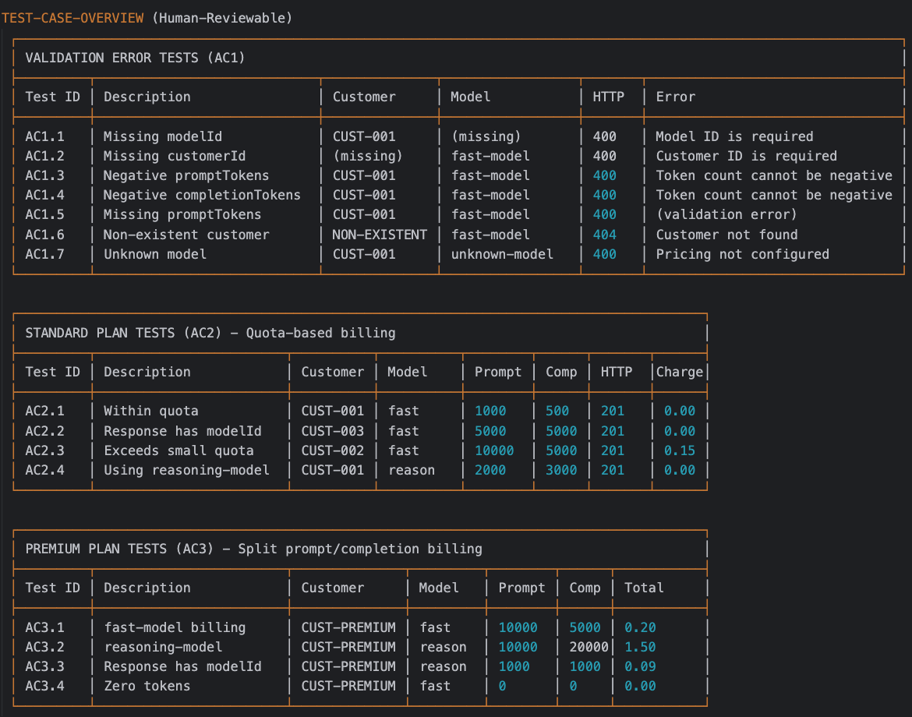
  <figcaption>Human-reviewable test-case overview показывает, что свидетельство в SPDD должно быть пригодно для чтения человеком: normal, boundary и error scenarios видны до запуска скрипта. Источник: <a href="https://martinfowler.com/articles/structured-prompt-driven/">Structured-Prompt-Driven Development</a>. Локальный файл: <code>assets/theory-images/fowler-spdd-api-test-script.png</code>.</figcaption>
</figure>

[`/spdd-api-test`](https://github.com/gszhangwei/open-spdd/blob/v0.4.9/internal/templates/data/optional/spdd-api-test.md) извлекает API endpoint information из implementation или acceptance criteria и генерирует cURL-based test script. Скрипт содержит test-case table по normal scenarios, boundary conditions и error scenarios. При выполнении он выводит expected-vs-actual comparison results. Важна именно двойная форма: сначала человек может прочитать TEST CASE OVERVIEW, затем увидеть фактический результат выполнения.

<figure class="source-figure" id="fig-fowler-spdd-api-test-results">
  
  <figcaption>API test results показывают вторую половину свидетельства: expected, actual и result превращают “модель говорит, что работает” в проверяемый сигнал. Источник: <a href="https://martinfowler.com/articles/structured-prompt-driven/">Structured-Prompt-Driven Development</a>. Локальный файл: <code>assets/theory-images/fowler-spdd-api-test-results.png</code>.</figcaption>
</figure>

После API validation code review фокусируется на том, что только человек или сильный review-agent может оценить: architecture, trade-offs, non-functional concerns, maintainability, layering, exception handling, encapsulation, magic numbers, long methods, imports/dependencies, syntax/compilation, hallucinated APIs, adherence to Norms and Safeguards. Базовое “what” должно быть уже проверено на boundary, иначе reviewer тратит внимание на код, который может не решать задачу.

Такой порядок хорошо связывает SPDD с разделом о [проверяемых свидетельствах](#theoretical-synthesis--39-svidetelstva-dolzhny-byt-prigodny-dlya-sleduyuschego-shaga). “Готово” не является свидетельством. Свидетельство должно быть пригодно для следующего шага: test overview пригоден для human review, expected/actual results пригодны для acceptance decision, code review пригоден для maintainability judgement, unit tests пригодны для будущей regression protection.

## 20. Logic correction, prompt-update и sync: два направления обратной связи {#spdd-prompt-update-sync}

В SPDD важно различать два направления синхронизации. [`/spdd-prompt-update`](https://github.com/gszhangwei/open-spdd/blob/v0.4.9/internal/templates/data/core/spdd-prompt-update.md) работает, когда изменилось намерение: business rule, constraint, architectural adjustment, accepted behavior. [`/spdd-sync`](https://github.com/gszhangwei/open-spdd/blob/v0.4.9/internal/templates/data/core/spdd-sync.md) работает, когда изменился код без изменения намерения: refactoring, cleanup, decomposition, new component, implementation detail. В обоих случаях цель одна — Canvas не должен стать historical snapshot.

<figure class="source-figure" id="fig-fowler-spdd-code-review">
  
  <figcaption>Схема из SPDD показывает развилку review: если замечание меняет observable behavior, сначала обновляется structured prompt; если это refactoring без изменения поведения, код меняется и синхронизируется обратно. Источник: <a href="https://martinfowler.com/articles/structured-prompt-driven/">Structured-Prompt-Driven Development</a>. Локальный файл: <code>assets/theory-images/fowler-spdd-code-review.svg</code>.</figcaption>
</figure>

В billing example logic correction появляется вокруг `modelId`. Первоначальная реализация допускает nullable field ради backward compatibility с historical data. После business confirmation команда решает, что для historical bills default value должен быть `fast-model`. Это уже не cosmetic refactoring. Это изменение observable business behavior. Поэтому сначала выполняется [`/spdd-prompt-update`](https://github.com/gszhangwei/open-spdd/blob/v0.4.9/internal/templates/data/core/spdd-prompt-update.md): structured prompt уточняет required field, default value и соответствующие части REASONS Canvas. Только после этого обновляется код.

<figure class="source-figure" id="fig-fowler-spdd-prompt-update">
  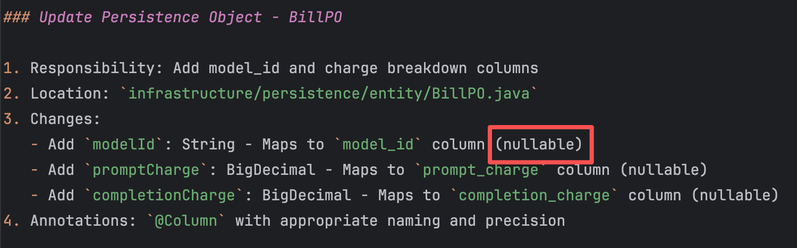
  <figcaption>Prompt update показывает, что business-rule correction не должен растворяться в локальном кодовом патче: сначала фиксируется новое намерение, затем реализация приводится к нему. Источник: <a href="https://martinfowler.com/articles/structured-prompt-driven/">Structured-Prompt-Driven Development</a>. Локальный файл: <code>assets/theory-images/fowler-spdd-prompt-update.png</code>.</figcaption>
</figure>

Напротив, если code review находит magic numbers в `calculateRemainingQuota`, это может быть ordinary refactoring. Observable behavior не меняется. Агент делает small incremental refactor, затем [`/spdd-sync`](https://github.com/gszhangwei/open-spdd/blob/v0.4.9/internal/templates/data/core/spdd-sync.md) сравнивает current code against Canvas и записывает соответствующие implementation updates обратно в REASONS sections. В источнике это называется golden rule: keep the structured prompt synchronized with your latest codebase.

Это различение полезно за пределами SPDD. В обычном agentic workflow легко смешать logic correction и refactoring. Если bugfix меняет business meaning, но человек правит только код, intent asset начинает врать. Если refactoring заставляют проходить через полноценный business prompt update, процесс становится тяжелее задачи. SPDD даёт язык для этого разведения: requirement → prompt → code и code → prompt — разные направления, и их нельзя путать.

## 21. Unit tests: последний safety net, а не первый источник смысла {#spdd-unit-tests-after-stabilization}

Unit tests в SPDD не исчезают и не становятся второстепенными. Но они появляются после того, как implementation стабилизирована через structured prompt, API validation и review. Причина практическая: если unit tests написать слишком рано, их придётся переписывать после крупных review-driven changes. SPDD поэтому использует API tests для быстрого behavior gate, code review для архитектуры и maintainability, а unit tests — как final regression safety net для core logic.

В walkthrough dedicated testing commands ещё не finalized. Поэтому используется interim template-driven approach. Сначала implementation details prompt комбинируется с testing template вроде [`TEST-SCENARIOS-TEMPLATE.md`](https://github.com/gszhangwei/token-billing/blob/after-enhancement/spdd/template/TEST-SCENARIOS-TEMPLATE.md), чтобы создать baseline test prompt. Затем AI-generated scenarios дедуплицируются и уточняются: агент должен сверить предложенные сценарии с existing test suite, убрать повторы и оставить genuinely new coverage. Только после этого генерируется unit-test code.

Это важная деталь, потому что она удерживает SPDD от слишком гладкого образа “всё автоматизировано командами”. На момент статьи testing stage ещё частично ручной и template-driven. Он показывает не завершённую платформу, а зрелую инженерную осторожность: если команда ещё не имеет dedicated testing command, она всё равно не перескакивает через test design. Она делает test prompt отдельным артефактом, проверяет coverage и только потом генерирует тесты.

Такой порядок не является анти-TDD. В Q&A авторы прямо говорят, что SPDD сохраняет цели TDD — clarify behavior, protect regressions, shape design — но распределяет их иначе. Behavior уточняется раньше через story, Canvas и API tests; design shape возникает через Abstraction First и Operations; regression protection закрепляется unit tests после стабилизации implementation. Это спорный, но осмысленный порядок для AI-generated code, где initial implementation дешёв, а человеческое review attention дорого.

## 22. Asset integrity: prompt version должен соответствовать code commit {#spdd-asset-integrity}

В [Iterative Review](https://martinfowler.com/articles/structured-prompt-driven/iterative-review.html) есть отдельный пункт, который легко недооценить: **asset integrity**. Код, который попадает в commit, должен cleanly map to the exact prompt version. Иначе теряется traceability: future maintainer видит prompt, видит code, но не знает, какая версия намерения породила какую версию реализации и где начался drift.

Asset integrity превращает SPDD из “хорошо написанной спецификации” в governance mechanism. Если prompt изменился, но код не обновлён, artifact врёт. Если код refactored, но prompt не synced, artifact превращается в historical record. Если code review принял business correction без prompt-update, future evolution стартует от устаревшего intent. Поэтому SPDD требует, чтобы prompt, code, review evidence и tests сохраняли связность во времени.

Практически это означает несколько вещей.

- Prompt assets должны лежать в version control рядом с codebase, а не в chat history.
- Изменения бизнес-логики должны попадать в prompt before code.
- Refactoring без изменения поведения должен возвращаться в prompt через `/spdd-sync`.
- Code review должен проверять not only code quality, but also prompt/code consistency.
- Следующая итерация должна начинаться от accumulated prompt assets: domain model, decisions, norms, safeguards, accepted patterns.

Это сильный мост к теме [внешней рабочей памяти](#cross-story-synthesis--3-8-vneshnyaya-pamyat-kak-zaschita-ne-tolko-agenta-no-i-cheloveka). SPDD делает память не только удобной для агента, но и проверяемой для человека. Не “мы где-то это обсуждали”, а “вот artifact, commit history, review trail и behavior evidence”.

## 23. Где SPDD окупается: ROI, upfront cost и fit table {#spdd-fit-and-roi}

SPDD хорошо подходит не для любой задачи. Его сильная зона — logic-heavy и rules-heavy изменения: биллинг, налоги, отчётность, compliance, права доступа, pricing, business workflows, cross-cutting consistency, migration-sensitive work. Там ошибка часто дорогая, а intent artifact действительно окупается: он снижает hallucination, делает traceability видимой, помогает ревью, удерживает границы и позволяет следующей итерации стартовать с накопленного контекста.

В источнике fit assessment фактически задаёт экономическую модель. На верхнем уровне — scaled, standardized delivery; high compliance and hard constraints; team collaboration and auditability; cross-cutting consistency work. На нижнем уровне — firefighting hotfixes, exploratory spikes, one-off scripts, context black holes, pure creative / visual work. Это не вкусовая классификация. Это вопрос отношения стоимости артефакта к стоимости ошибки и будущей эволюции.

ROI SPDD складывается из нескольких выгод.

| Выгода | Что реально покупается процессом |
| --- | --- |
| Determinism | Логика кодируется в precise spec, поэтому модель меньше “творит” там, где нужна предсказуемость. |
| Traceability | Meaningful change можно проследить к structured prompt, closing the audit loop. |
| Faster reviews | Code приходит ближе к team standards; review меньше тратится на cleanup и больше — на logic/design. |
| Explainability | Intent and behavior видны на natural-language level; maintenance дешевле. |
| Safer evolution | Boundaries and stepwise implementation снижают риск targeted changes. |

Но upfront investment тоже реален.

| Барьер | Что требуется |
| --- | --- |
| Mindset shift | Команде нужно привыкнуть к design-first вместо code-first. |
| Senior expertise up front | Нужны люди, способные переводить business rules в clean abstractions and constraints. |
| Automation tooling | Без CLI/workflow automation SPDD упирается в throughput ceiling и consistency problems. |

Практический критерий такой: SPDD окупается, когда цена неверного намерения выше цены поддержки артефакта. Если задача маленькая, обратимая и близко проверяется браузером или одним тестом, SPDD может стать тяжёлым ритуалом. Если задача проходит через данные, API, business rules, compliance, архитектурные границы или командную передачу знания, отсутствие maintained intent asset может быть дороже.

Это уточняет [лестницу усложнения Handbook](#handbook--choice-map). SPDD не должен стать default-режимом. Он должен стать одной из верхних ступеней: когда обычного `plan.md`, issue, handoff или PRD уже недостаточно, потому что намерение должно сопровождаться вместе с кодом.

## 24. Hotfixes и production signal: governance можно отложить, но нельзя выбросить {#spdd-hotfix-production-signal}

Fit table помечает firefighting hotfixes как слабый fit для SPDD. Это легко понять неверно: будто production bugs, edge cases и failure modes проходят мимо methodology. Q&A уточняет: во время live incident system recovery comes first. Писать Canvas в момент “stop the bleeding” — неправильный выбор. Но governance не отменяется, а переносится на следующий шаг.

Есть два сценария.

**Scenario A — context exists.** Если bug falls inside [область](#theoretical-synthesis--spdd-fit-and-roi), уже покрытую structured prompt, команда может использовать AI для анализа failure, root cause и затем применить compressed SPDD loop: update prompt first, then update code. Так fix становится постоянной частью governed asset, а не локальным emergency patch.

**Scenario B — legacy or no prior context.** Если код не был brought under SPDD, прагматический ход — позволить AI проанализировать logs и исправить issue напрямую. Но closing step должен быть deliberate post-mortem: синтезировать fix, failure mode и relevant context в новые documented assets. Так SPDD coverage органически растёт по codebase.

Это важный пример умеренности. SPDD не должен мешать восстановлению production. Но если production signal не возвращается в intent layer после инцидента, возникает spec/code delta. Код знает о failure mode, а артефакт намерения — нет. Следующая итерация снова начнётся без памяти о реальном сбое.

## 25. Roadmap SPDD: от expert craft к organization-level asset system {#spdd-roadmap-decision-memory}

Авторы честно признают: в нынешнем виде SPDD может выглядеть как метод для senior architects, потому что требует strong abstraction, modelling, systematic analysis и deep business understanding. Их целевое направление другое: framework должен не зависеть полностью от personal craftsmanship, а постепенно переносить часть веса в organization-level asset system.

Roadmap состоит из четырёх направлений.

Первое — **recurring workflows as commands**. Паттерн [`/spdd-analysis`](https://github.com/gszhangwei/open-spdd/blob/v0.4.9/internal/templates/data/core/spdd-analysis.md), [`/spdd-reasons-canvas`](https://github.com/gszhangwei/open-spdd/blob/v0.4.9/internal/templates/data/core/spdd-reasons-canvas.md), [`/spdd-generate`](https://github.com/gszhangwei/open-spdd/blob/v0.4.9/internal/templates/data/core/spdd-generate.md), [`/spdd-sync`](https://github.com/gszhangwei/open-spdd/blob/v0.4.9/internal/templates/data/core/spdd-sync.md) не закончен. По мере появления повторяемых ситуаций successful workflow извлекается в command, а не остаётся знанием отдельных людей.

Второе — **automated verification at the asset layer**. Проверять нужно не только code level. Будущий слой должен проверять analysis, Canvas и prompt artifacts: gaps, inconsistencies, under-specification, routine calls, structural completeness vs substantive adequacy.

Третье — **raising the automation ratio**. SPDD уже является harness, но semi-automated. Автоматизация должна расти постепенно, только там, где AI надёжно справляется с конкретным type of task. Это не “убрать человека”, а пошагово переносить hand-holding в проверяемые commands and asset checks.

Четвёртое — **decision memory**. Past canvases, trade-offs, accepted patterns and historical decisions должны стать persistent context, который agent может извлекать в новой ситуации. Это особенно близко к теме Noveia и active memory: ценность не только в сохранении документа, но в возможности поднимать правильное предыдущее reasoning именно тогда, когда оно нужно.

В этом смысле SPDD сам движется от методики к экзоскелету. Сначала skilled practitioners вручную строят хорошие artifacts. Потом recurring thinking strategies становятся commands. Затем asset-layer verification и decision memory должны сделать качество менее зависимым от отдельного человека. Это ещё не решённый механизм, но направление важно: SPDD понимает свою текущую слабость и пытается вынести её в инфраструктуру.

## 26. Сопротивление SPDD: variance, model drift, spec-as-source и предел человеческого суждения {#spdd-resistance-boundaries-and-spec-as-source}

Критика SPDD должна быть встроена в сам раздел, иначе метод легко станет слишком гладким. Первая проблема: SPDD не устраняет variance, а частично переносит его на уровень Canvas. В Q&A авторы честно признают, что два разработчика могут написать разные Canvas по одному требованию, а один и тот же человек может в разные дни сделать более сильный или более тонкий artifact. Команды OpenSPDD поднимают нижнюю границу, задавая structure, granularity, abstraction level и task breakdown, но не дают полностью объективного стандарта “хорошего Canvas”.

Вторая проблема: SPDD остаётся human-led. Это сила и ограничение одновременно. Человек проверяет business intent, abstraction, boundaries, trade-offs и пригодность Canvas к реальной задаче. Если человек слаб в домене или поверхностно ревьюит документ, SPDD может не защитить. Он создаёт место для правильного решения, но не гарантирует, что решение будет принято.

Третья проблема — relation to spec-as-source. Thoughtworks различает spec-first, spec-anchored и spec-as-source. SPDD ближе к spec-anchored: spec/prompt сохраняется и сопровождает дальнейшую эволюцию. Но из этого не следует, что спецификация должна стать единственным источником правды. Spec-as-source наследует старые проблемы model-driven development: overhead, ограничения выразительности, трудность синхронизации, опасность того, что формально красивый документ хуже отражает реальную систему, чем код, тесты и эксплуатационные сигналы.

Четвёртая проблема — model and configuration drift. SPDD intended as model-agnostic, но raw capability имеет значение, особенно для analysis и REASONS Canvas. После того как intent зафиксирован, менее сильная модель может быть приемлемым executor, но risk of intent drift остаётся. В некоторых средах реальным артефактом становится не только prompt-as-spec, а prompt + model configuration + command semantics + review protocol. Стратегический выбор зависит от cost, compute and compliance constraints.

Пятая проблема — ceiling на стороне самой задачи. Если область слишком широкая, multi-project, multi-discipline, multi-domain, плохо ограниченная или требует portfolio-scale decisions, модельная сила не спасает. Нужна decomposition, накопленные decision assets и human gates. В context black holes, где business rules unclear и boundaries weak, stronger AI just fails more confidently.

Шестая проблема — риск ухудшения человеческой компетенции при полном agent-driven review. `/spdd-code-review` уже может читать Canvas and code diff together and flag drift. Но авторы считают, что человек всё ещё нужен для двух вещей: catching intent drift, когда сам Canvas уже не соответствует real business intent, и learning from AI choices. Если review полностью отдать агенту, можно ускорить процесс, но потерять long-term skill growth, ради которого SPDD и строит human-led loop.

Итоговая позиция поэтому должна быть двойной. SPDD — один из лучших примеров того, как agentic/doc-first разработка может сделать намерение сопровождаемым инженерным объектом. Но его нельзя превращать в универсальную норму. Он полезен там, где нужно удерживать сложное, проверяемое, дорогое намерение; вреден там, где задача мала, плохо определена или требует быстрой разведки без тяжёлого governance. Для этого сайта SPDD важен именно как сильная форма артефакта намерения и управляемого delivery loop, а не как новая догма.

---

# Часть III. Обвязка и проверка

Если контекст отвечает за то, что модель видит, обвязка отвечает за то, какие действия становятся вероятными, какие ошибки ловятся автоматически, а где требуется человеческое решение. Здесь агентская разработка ближе всего подходит к обычной инженерии: правила, датчики, ограничения и [обратная связь](#theoretical-synthesis--12-napravlyayuschie-i-datchiki) становятся частью рабочей среды.

## 27. Обвязка регулирует не “модель вообще”, а конкретное состояние кодовой базы {#11-obvyazka-reguliruet-ne-model-voobsche-a-konkretnoe-sostoyanie-kodovoy-bazy}

Слово “обвязка” легко расплывается. Если считать обвязкой всё вокруг модели, термин почти ничего не объясняет. [Fowler / Thoughtworks предлагают](https://martinfowler.com/articles/harness-engineering.html) более полезный ход: рассматривать обвязку как систему регулирования, которая удерживает кодовую базу и рабочий процесс в желаемом состоянии.

Такой взгляд сразу меняет вопрос. Сначала стоит спросить, какое состояние мы пытаемся поддерживать, а уже затем выбирать инструменты. Это может быть поддерживаемость кода, архитектурная пригодность, функциональное поведение, наблюдаемость, безопасность, качество тестов, соответствие стилю, отсутствие дрейфа зависимостей или ограничение области действия.

У каждого такого состояния есть разные способы регулирования. Одни элементы предупреждают плохой ход до действия. Другие наблюдают результат после действия. Одни работают детерминированно и быстро. Другие требуют интерпретации и стоят дороже. Одни можно запускать на каждом изменении. Другие нужно запускать только на важных границах: перед слиянием, перед релизом, после интеграции, по расписанию или при обнаружении дрейфа.

Это превращает агентскую обвязку в систему управления: она сужает пространство неправильных ходов и возвращает проверочные сигналы. Агент может порождать разнообразные изменения. Обвязка должна уменьшать пространство неправильных ходов и возвращать сигналы, которые позволяют агенту или человеку скорректировать траекторию.

## 28. Направляющие и датчики {#12-napravlyayuschie-i-datchiki}

[Fowler / Thoughtworks различают два слоя обвязки](https://martinfowler.com/articles/harness-engineering.html): предварительное направление и обратную связь.

[Предварительное направление действует](#theoretical-synthesis--12-napravlyayuschie-i-datchiki) до того, как агент что-то сделал. Это `AGENTS.md`, skills, справочные документы, архитектурные принципы, правила кодирования, инструкции по запуску проекта, образцы реализации, API-документация, доменный словарь. Их задача — увеличить вероятность, что агент выберет правильный путь с первой попытки.

Обратная связь действует после действия. Это тесты, проверка типов, линтеры, статический анализ, структурные тесты, браузерные проверки, логи, трассировки, покрытие, mutation testing, ревью другого агента, человеческое ревью, CI, сигналы из среды выполнения. Их задача — дать агенту возможность исправиться до того, как результат станет чужой проблемой.

Оба слоя нужны. Если есть только предварительное направление, агент может кодировать правила, но не узнавать, сработали ли они. Если есть только обратная связь, агент может снова и снова повторять один и тот же плохой ход, потому что не получил хорошей карты до действия. Хорошая обвязка соединяет оба слоя: направляет до действия и даёт сигнал после него.

Вторая важная ось — различие между вычислительными и интерпретационными механизмами. Вычислительные датчики работают детерминированно: они ловят ошибки тестов и типов, нарушения линтера, запрещённые зависимости, снижение покрытия или поломку структурной границы. Интерпретационные датчики требуют суждения: здесь другой агент или человек оценивает архитектурный смысл, качество логов, продуктовую пригодность и соответствие намерению.

Для агентского процесса это различие критично. Нельзя использовать сильную модель как дорогой линтер там, где обычный линтер справится лучше. И наоборот, нельзя ждать от линтера продуктового суждения. Хорошая система сначала выносит всё, что можно проверить вычислительно, в дешёвые датчики; затем использует интерпретационные проверки для того, где нужна семантика.

Когда агент ошибается, полезнее искать недостающий слой: пример, тест, CLI-обёртку, запрет правами или короткий датчик. Может быть, нужно дать пример. Может быть, лучше добавить тест. Может быть, стоит сделать CLI-обёртку с компактным выводом. Может быть, нужно запретить действие правами. Иногда лучше добавить короткий датчик, который ловит ошибку автоматически, чем расширять документ.

## 29. Качество надо держать левее {#13-kachestvo-nado-derzhat-levee}

В классической инженерии давно известно: чем раньше найден дефект, тем дешевле его исправить. В агентской разработке это становится ещё важнее, потому что агент может быстро размножить ошибочную предпосылку по многим файлам.

[Fowler / Thoughtworks называют это `keep quality left`](https://www.thoughtworks.com/insights/blog/generative-ai/harness-engineering-agent-feedback-exploring-ai-coding-sensors): размещать датчики настолько рано, насколько это разумно по стоимости, скорости и критичности. Быстрые проверки должны запускаться до коммита или даже внутри сессии агента. Более дорогие проверки можно запускать после интеграции или перед релизом. Постоянные проверки дрейфа могут работать вне конкретного изменения.

Полезно различать несколько уровней. Во время работы агента должны срабатывать самые дешёвые проверки: типы, быстрые тесты, линтеры, форматирование, структурные правила и локальные браузерные сценарии. Перед интеграцией можно запускать более широкий набор тестов, ревью агента, проверки безопасности, зависимостей, покрытия и архитектурных ограничений. После интеграции появляются более дорогие проверки: mutation testing, архитектурное ревью, выборочная проверка поведения, производительность, трассы, похожие на производственные, и SLO. Отдельно нужны непрерывные датчики дрейфа: устаревшая документация, деградация тестового покрытия, зависимостной и архитектурный дрейф, ухудшение логирования, мёртвый код и накопление сгенерированного мусора.

<figure class="source-figure" id="fig-fowler-harness-change-lifecycle">
  
  <figcaption>Схема помогает разместить проверки по времени: быстрые датчики рядом с агентом, человеческое ревью перед слиянием, более дорогие проверки после интеграции. Источник: <a href="https://martinfowler.com/articles/harness-engineering.html">Harness engineering for coding agent users</a>. Локальный файл: <code>assets/theory-images/fowler-harness-change-lifecycle.png</code>.</figcaption>
</figure>

Эта многоуровневая картина важна, потому что “проверяйте результат” слишком грубая рекомендация. Разные проверки стоят по-разному и работают на разных стадиях. Агентский процесс должен поднимать дешёвые проверки как можно раньше, но не пытаться запускать всё всегда.

## 30. Поддерживаемость, архитектура и поведение проверяются по-разному {#14-podderzhivaemost-arhitektura-i-povedenie-proveryayutsya-po-raznomu}

[Одна из самых сильных частей Fowler / Thoughtworks](https://martinfowler.com/articles/harness-engineering.html) — разделение обвязки по тому, что именно она регулирует.

Первая категория — поддерживаемость. Это самый доступный слой, потому что для него уже есть много готовых датчиков: линтеры, статический анализ, проверка типов, покрытие, поиск дублирования, метрики сложности, поиск мёртвого кода, структурные тесты и правила зависимостей. Если агент добавил дублирование, нарушил стиль, создал слишком сложную функцию или сломал границу модулей, это часто можно поймать автоматически.

Вторая категория — архитектурная пригодность. Здесь речь идёт о свойствах системы: производительности, наблюдаемости, модульных границах, допустимых зависимостях, качестве API, устойчивости и безопасности. Часть этого можно проверять вычислительно — структурными тестами, функциями пригодности, проверками производительности и правилами зависимостей. Но часть требует интерпретации: соответствует ли решение принятой архитектурной линии, не создаёт ли оно новый неявный слой, не нарушает ли будущую масштабируемость.

Третья категория — поведение продукта. Это самая трудная область. Как проверить, что приложение функционально ведёт себя так, как нужно? Можно написать тесты, но тесты могут проверять не тот сценарий. Можно дать агенту написать тесты, но он может написать их под собственную реализацию. Можно измерить покрытие, но покрытие не гарантирует смысл. Можно использовать mutation testing, но оно тоже не заменяет продуктового понимания. Можно провести ручное тестирование, но оно дорого и плохо масштабируется.

Возможные ответы появляются, но они пока частичные. Утверждённые фикстуры помогают там, где есть стабильные примеры поведения. Браузерные свидетельства помогают UI-задачам. Трассы, похожие на производственные, помогают с наблюдаемостью и отладкой. Продуктовые сценарии помогают удерживать намерение. Человеческая проверка остаётся важным датчиком для поведения, потому что она соединяет требование, продуктовый смысл и пользовательское восприятие.

Из этого следует практическое различие: не все задачи можно автоматизировать одинаково. Изменение внутренней структуры, которое хорошо покрывается типами и тестами, можно отдавать агенту дальше. Изменение поведения продукта, особенно там, где важны UX, бизнес-правила, данные пользователей или социальные последствия, требует более сильного человеческого участия и артефактов поведения: сценариев, скриншотов, видео, фикстур, ручного принятия.
<figure class="source-figure" id="fig-fowler-harness-types">
  
  <figcaption>Эта схема прямо визуализирует различие, на котором держится раздел: разные классы качества требуют разных направляющих и датчиков, поэтому нельзя проверять поддерживаемость, архитектуру и поведение одним и тем же способом. Источник: <a href="https://martinfowler.com/articles/harness-engineering.html">Harness engineering for coding agent users</a>. Локальный файл: <code>assets/theory-images/fowler-harness-types.png</code>.</figcaption>
</figure>

## 31. Пригодность проекта к обвязке {#15-prigodnost-proekta-k-obvyazke}

Не всякая кодовая база одинаково хорошо поддаётся агентской обвязке. [Fowler / Thoughtworks называют это](https://martinfowler.com/articles/harness-engineering.html) `harnessability`, то есть пригодностью проекта к обвязке. Это одно из самых важных, но часто пропускаемых понятий.

Некоторые свойства проекта делают агентскую работу управляемее. Сильно типизированный язык даёт проверку типов как датчик. Явные границы модулей позволяют написать структурные правила. Фреймворки и шаблоны уменьшают пространство возможных решений. Хорошие локальные тесты дают агенту быстрый сигнал. Простая команда запуска снижает стоимость проверки. Понятная структура директорий помогает модели находить правильные файлы. Наблюдаемость даёт агенту фактический сигнал о поведении.

Другие свойства делают агентскую работу хрупкой. Старый проект с техническим долгом, скрытыми соглашениями, неявными побочными эффектами, плохой тестируемостью, процедурами staging-среды, непонятным графом зависимостей и устной памятью команды будет хуже поддаваться агентской автоматизации. Парадокс в том, что именно таким проектам сильнее всего нужна помощь, но именно в них обвязку труднее построить.

Это меняет стратегию внедрения. В проекте с высокой пригодностью к обвязке можно быстрее давать агенту автономию: он получает хорошие датчики и понятные границы. В проекте с низкой пригодностью сначала нужно улучшать среду: локальный запуск, тесты, типы, документацию, структурные границы, скрипты, наблюдаемость, данные для воспроизведения. Иначе агент будет ускорять хаос.
<figure class="source-figure" id="fig-openai-layered-domain-architecture">
  
  <figcaption>Схема полезна рядом с `harnessability`: агенту легче работать там, где доменная архитектура, границы слоёв и пересекающие правила выражены явно, а не живут только в памяти команды. Источник: <a href="https://openai.com/index/harness-engineering/">Harness engineering</a>. Локальный файл: <code>assets/theory-images/openai-layered-domain-architecture.webp</code>.</figcaption>
</figure>

## 32. Среда сама подталкивает агента к правильному {#16-sreda-sama-podtalkivaet-agenta-k-pravilnomu}

[Thoughtworks использует понятие средовых возможностей](https://martinfowler.com/articles/harness-engineering.html) — свойств среды, которые делают её читаемой, навигируемой и управляемой для агента. Это полезно, потому что часть обвязки не выглядит как отдельный инструмент. Она встроена в саму форму проекта.

Например, агенту проще продолжать один понятный способ доступа к данным, чем выбирать между шестью исторически сложившимися вариантами. Он лучше найдёт команды проверки, если они очевидны в `package.json`, а не спрятаны в устной памяти команды. Он сможет воспроизвести баг, если тестовые данные легко поднять. И наоборот: если проверка требует ручного доступа к среде, похожей на production, автономия резко падает.

[OpenAI-пример с читаемостью приложения](https://openai.com/index/unlocking-the-codex-harness/) — частный случай. Если интерфейс можно инспектировать через DOM, снимки экрана и логи, агент может проверять UI. Если каждое рабочее дерево может иметь отдельный dev server, агент может воспроизводить и проверять изменения параллельно. Если репозиторий имеет понятный source of truth, агент может не спрашивать человека каждый раз.

Для ближайшего года это означает, что команды будут всё чаще оценивать инфраструктурные решения по вопросу: помогает ли это агенту безопасно и проверяемо работать? Хороший фреймворк, шаблон сервиса, design system или тестовая обвязка будут ценны не только для людей, но и как средовые возможности для агентов.

## 33. Шаблоны и топологии: уменьшение разнообразия как способ контроля {#17-shablony-i-topologii-umenshenie-raznoobraziya-kak-sposob-kontrolya}

[Fowler / Thoughtworks связывают шаблоны обвязки](https://martinfowler.com/articles/harness-engineering.html) с Ashby’s Law: регулятор должен иметь модель разнообразия системы, которую регулирует. Если агент может породить почти любое решение, построить обвязку для всех вариантов трудно. Если команда заранее выбирает ограниченные топологии сервисов, пространство решений сужается, а обвязка становится достижимее.

Большие организации уже часто используют шаблоны сервисов: CRUD-сервис, обработчик событий, панель данных, API-сервис, пакетная задача. В агентскую эпоху такие шаблоны могут стать шаблонами обвязки: стартовый код дополняется пакетом направляющих и датчиков. Например, для шаблона панели данных можно заранее иметь правила структуры, команды проверки, линтеры, проверки производительности, браузерные проверки, стандарты наблюдаемости, примеры и ожидания по развёртыванию.
<figure class="source-figure" id="fig-fowler-harness-templates">
  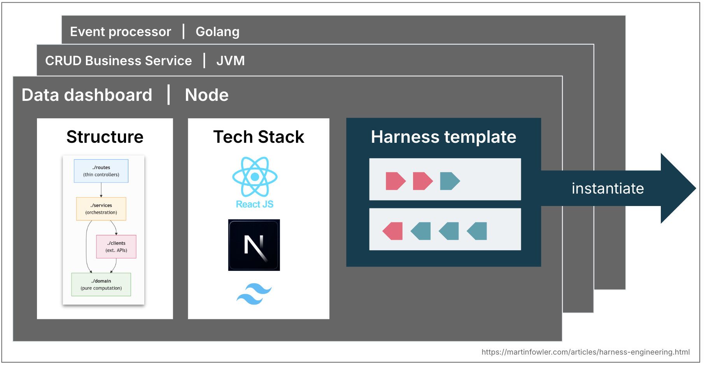
  <figcaption>Схема показывает практический смысл топологий: если тип приложения повторяется, вместе со стартовым кодом можно инстанцировать не только структуру и стек, но и шаблон обвязки — направляющие, датчики и проверки. Источник: <a href="https://martinfowler.com/articles/harness-engineering.html">Harness engineering for coding agent users</a>. Локальный файл: <code>assets/theory-images/fowler-harness-templates.png</code>.</figcaption>
</figure>

Это важное направление. Команды могут начать выбирать технологии и архитектурные формы не только по привычным критериям, но и по наличию хорошей обвязки. Если для одной топологии уже есть зрелые датчики и направляющие, она становится дешевле для агентской разработки. Если для другой всё нужно строить вручную, автономия агента будет ниже.

Но здесь есть и риск. Шаблоны дрейфуют. Команды создают сервис из шаблона, затем меняют его, отстают от upstream, добавляют исключения. Шаблоны обвязки будут иметь ту же проблему, только сложнее: [направляющие и датчики](#theoretical-synthesis--12-napravlyayuschie-i-datchiki) могут быть недетерминированными, сложнее тестируемыми и зависящими от моделей. Значит, нужна не только публикация шаблона, но и механизм обновления, совместимости, правок и версионирования.

Эту идею нужно применять осторожно. Один человек не обязан сразу строить шаблоны обвязки. Но сама мысль полезна: чем стабильнее топология задачи, тем легче дать агенту обвязку. Поэтому первые агентские ритуалы лучше строить вокруг повторяемых форм: исправление бага, UI-изменение, обновление зависимости, сопровождение PR, миграция, исследовательский проход. У каждой формы можно постепенно накапливать свои направляющие и датчики.

## 34. Навыки, хуки и подагенты {#18-navyki-huki-i-podagenty}

Навыки, хуки и подагенты — три разные формы вынесения работы из текущего чата.

Навык нужен, когда повторяемая процедура уже достаточно понятна, чтобы её можно было оформить отдельно. Хороший навык содержит условия применения, последовательность действий, ограничения, примеры, иногда скрипты и проверочные команды. Он помогает не переписывать один и тот же процесс вручную и делает процедуру ремонтопригодной: её можно улучшить, сократить, удалить или перенести между проектами.

Хук решает другую задачу. Он срабатывает по событию и не зависит от того, вспомнила ли модель правило. Если агент пытается выполнить опасную git-команду, остановиться без проверки типов или перейти к следующему шагу без нужного артефакта, хук может заблокировать действие или вернуть сигнал. Поэтому хук ближе к датчику или предохранителю, чем к инструкции.

Подагент нужен там, где часть работы можно изолировать в отдельном контексте: исследование, поиск, ревью, проверка гипотезы, анализ логов, подготовка отчёта. Он уменьшает загрязнение основного контекста, но добавляет координационную стоимость. Подагент не должен быть “персонажем ради персонажа”; он оправдан, когда изоляция контекста и сжатый результат полезнее, чем держать всё в одной сессии.
<figure class="source-figure" id="fig-anthropic-multi-agent-research-architecture">
  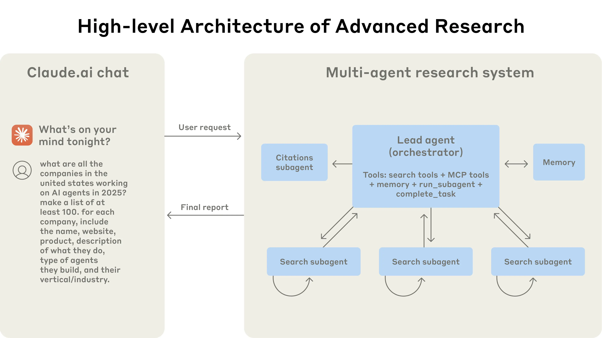
  <figcaption>Схема хорошо поддерживает ограниченное понимание подагентов: они нужны не как персонажи, а как способ изолировать часть работы, вернуть сжатый результат и не загрязнять главный контекст. Источник: <a href="https://www.anthropic.com/engineering/multi-agent-research-system">How we built our multi-agent research system</a>. Локальный файл: <code>assets/theory-images/anthropic-multi-agent-research-architecture.webp</code>.</figcaption>
</figure>

<figure class="source-figure" id="fig-humanlayer-context-firewall">
  
  <figcaption>Эта source-схема делает видимым главный выигрыш подагентов: промежуточные чтения, команды и шум остаются в отдельном окне, а основной контекст получает только сжатый результат. Источник: <a href="https://www.humanlayer.dev/blog/skill-issue-harness-engineering-for-coding-agents">Skill Issue: Harness Engineering for Coding Agents</a>. Локальный файл: <code>assets/theory-images/humanlayer-context-firewall.png</code>.</figcaption>
</figure>

У этих механизмов есть риск. Навыки могут стать новой поверхностью цепочки поставки: они содержат инструкции, иногда код и команды. Реестр навыков требует доверия и маркировки риска. Слишком много навыков ухудшает обнаружение нужного. Исследования публичных наборов навыков показывают ещё одну проблему: навыки быстро дублируются, распределяются неравномерно, часто плохо совпадают с реальным спросом и могут содержать действия, меняющие состояние системы. Значит, зрелой экосистеме навыков нужны не только публикация и установка, но и поиск, проверка происхождения, пометка риска, удаление устаревшего и контроль дублирования.

Практически это даёт простой критерий. Если человек третий раз вставляет один и тот же запрос — возможно, нужен навык. Если агент третий раз нарушает одно и то же событийное правило — возможно, нужен хук. Если основной контекст загрязняется большим исследованием — возможно, нужен подагент. Если механизм не помогает, его нужно упростить или удалить.

---

# Часть IV. Среда выполнения и память задачи

Длинная агентская работа не помещается в модель “чат плюс diff”. Ей нужны устойчивое состояние, события, подтверждения, восстановление и память задачи, которые переживают отдельную сессию и позволяют человеку или следующему агенту понять, где находится работа.

## 35. Агенту нужен не только чат, но и среда выполнения {#19-agentu-nuzhen-ne-tolko-chat-no-i-sreda-vypolneniya}

Когда агент работает только как чат, его состояние хрупко. Вкладка может закрыться. Соединение может оборваться. Контекст может сжаться. Команды и результаты смешиваются с рассуждениями. Diff живёт отдельно от обсуждения. Запрос подтверждения превращается в событие интерфейса, а не в часть устойчивого протокола. Для маленькой задачи это терпимо. Для долгой работы, фонового выполнения или нескольких клиентских поверхностей этого мало.

[OpenAI App Server](https://openai.com/index/unlocking-the-codex-harness/) показывает другой уровень: агентский процесс становится не просто интерфейсом вокруг модели, а средой выполнения. Codex может работать в CLI, IDE, веб-интерфейсе и desktop-приложении, но под ними находится общая обвязка. У него есть жизненный цикл рабочего потока, сохранение состояния, поток событий, выполнение инструментов, подтверждения, diff, возможность переподключения и общий протокол для клиентов.
<figure class="source-figure" id="fig-anthropic-coding-agent-flow">
  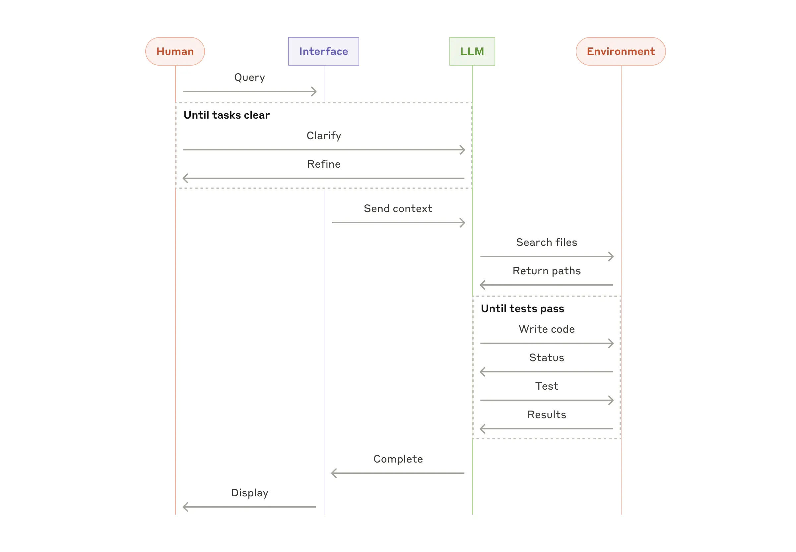
  <figcaption>Схема переносит разговор о среде выполнения из абстракции в рабочий поток: задача проходит через модель, инструменты, среду, обратную связь и возврат результата. Источник: <a href="https://www.anthropic.com/engineering/building-effective-agents">Building effective agents</a>. Локальный файл: <code>assets/theory-images/anthropic-coding-agent-flow.webp</code>.</figcaption>
</figure>

Это важный теоретический сдвиг. Агентская разработка начинает нуждаться в тех же вещах, что и любые долгоживущие вычислительные процессы: устойчивое состояние, события, восстановление, права, логирование, понятные границы клиента и сервера. Чат остаётся одной поверхностью взаимодействия, но уже не является достаточной моделью системы.

Такой слой особенно важен для фоновых и асинхронных задач. Если агент запускается на ночь, человек утром должен увидеть не только “я сделал”. Он должен увидеть, какой поток работы был создан, какие шаги прошли, где агент остановился, какие подтверждения требовались, какие файлы изменились, какие проверки упали, какие решения вынесены человеку. Без этого фоновая автономия превращается в набор вкладок, которые нужно вручную раскапывать.

## 36. Поток работы как объект {#20-potok-raboty-kak-obekt}

В обычном чате задача выглядит как последовательность сообщений. В агентской среде она всё больше становится объектом: поток работы с состоянием, историей, событиями, изменениями и подтверждениями.

У такого объекта есть устойчивое состояние, поток событий, подтверждения, diff и несколько клиентских поверхностей. Состояние должно переживать отключение клиента, перезапуск интерфейса, переключение между IDE и вебом, закрытие ноутбука. Поток событий должен фиксировать не только сообщения, но и вызовы инструментов, изменения файлов, запросы разрешений, ошибки, сжатия контекста и сигналы ревью. Подтверждения должны быть частью протокола: если агент хочет выполнить опасное действие, открыть внешний доступ или изменить файл вне области задачи, это должно логироваться, связываться с действием и сохраняться для будущего разбора. Diff остаётся первичным артефактом человеческого решения, поэтому хорошая среда связывает его с задачей, планом, проверками, комментариями и подтверждениями. Если же одна работа начинается в CLI, продолжается в IDE и закрывается в вебе или desktop-приложении, все клиенты должны видеть одно состояние, а не создавать конкурирующие версии задачи.

Практически это означает: фоновые и долгие задачи нельзя оценивать только по финальному ответу. Нужна структура рабочего потока. Если инструмент её не даёт, её приходится создавать вручную: progress-файл, файл передачи состояния, ветка, issue, PR, log, checkpoint. Чем слабее среда выполнения, тем важнее внешние артефакты.

<figure class="source-figure" id="fig-openai-codex-dashboard-workflow">
  
  <figcaption>Скриншот показывает поток работы как объект интерфейса: задача имеет репозиторий, ветку, статус и историю, а не живёт только как сообщение в чате. Источник: <a href="https://openai.com/index/introducing-codex/">Introducing Codex</a>. Локальный файл: <code>assets/theory-images/openai-codex-dashboard-workflow.webp</code>.</figcaption>
</figure>

## 37. Подтверждение как граница ответственности {#21-podtverzhdenie-kak-granitsa-otvetstvennosti}

Подтверждение часто воспринимается как трение. Агент просит разрешение, человек даёт одобрение, работа продолжается. В развитом процессе подтверждение фиксирует границу ответственности. Это место, где система фиксирует границу ответственности.

Если подтверждение нужно слишком часто и для безопасных действий, человек устаёт и начинает соглашаться механически. Тогда подтверждение превращается в ритуал без смысла. Если подтверждений слишком мало, агент может перейти границу ущерба: тронуть чужие файлы, удалить данные, отправить изменение наружу, использовать реальные учётные данные, сделать действие, которое требует человеческого решения.

Хорошая система подтверждений должна различать классы действий. Безопасную рутину лучше заранее разрешить внутри ограниченной среды: чтение файлов проекта, локальные тесты, запись в рабочем дереве, запуск локального приложения, временные артефакты. Опасные действия должны требовать явного подтверждения: массовое удаление файлов, изменение секретов, отправка в удалённый репозиторий, работа с производственными данными, расширение области задачи, команды вне песочницы, публикация PR или слияние. Для сомнительных действий недостаточно кнопки “да/нет”; система должна объяснить, зачем действие нужно, каков риск, что будет изменено и как это откатить.

<figure class="source-figure" id="fig-openai-codex-permission-prompt">
  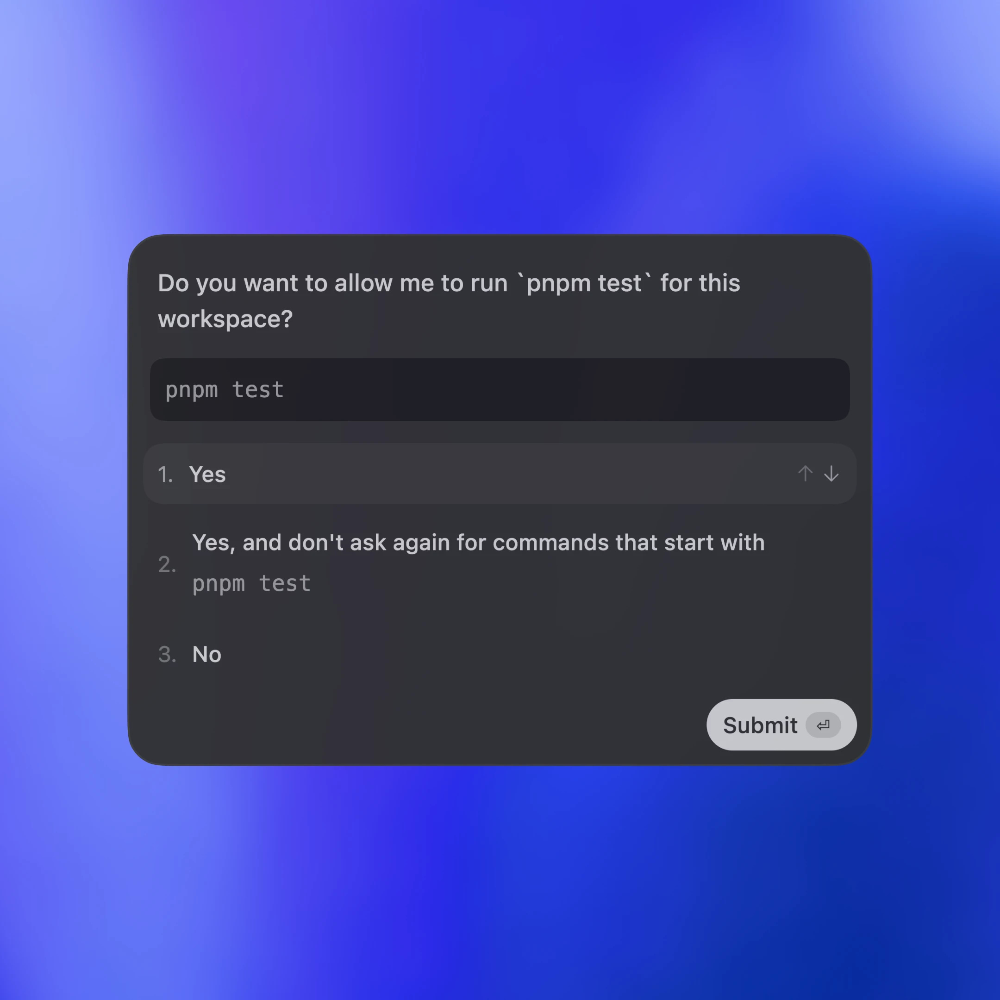
  <figcaption>Скриншот показывает, почему подтверждение нельзя понимать как простую кнопку “да”: интерфейс должен показывать действие, класс риска и границу, где ответственность возвращается человеку. Источник: <a href="https://openai.com/index/unlocking-the-codex-harness/">Unlocking the Codex harness</a>. Локальный файл: <code>assets/theory-images/openai-codex-permission-prompt.webp</code>.</figcaption>
</figure>

Практические примеры различаются. [Arvid Kahl](#story-04-arvid-kahl--13-allow-dlya-bezopasnoy-rutiny) настраивает `allow` для безопасной рутины и `deny` для опасных команд. [Mike McQuaid](#story-08-mike-mcquaid--5-sandvault-otdelnyy-polzovatel-macos-plyus-sandbox-exec) уменьшает нужду в постоянных подтверждениях через [Sandvault](#story-08-mike-mcquaid--5-sandvault-otdelnyy-polzovatel-macos-plyus-sandbox-exec): если агент заперт в отдельном пользователе и песочнице, часть действий становится допустимой без ручного сопровождения. [Calvin French-Owen](#story-09-calvin-french-owen--1-tsentralnaya-os-raspredelit-chelovecheskoe-vremya-kontekst-i-proverku), наоборот, показывает проблему, когда модель разрешений слишком грубая: автономия ночью упирается в подтверждения, а не в способность модели.

## 38. Долгоживущая задача требует восстановления, а не только памяти {#22-dolgozhivuschaya-zadacha-trebuet-vosstanovleniya-a-ne-tolko-pamyati}

Память часто понимается как “агент помнит прошлые разговоры”. Для разработки этого мало. Долгоживущая задача требует восстановления рабочего состояния: что было целью, какие шаги выполнены, какие проверки прошли, где агент остановился, что изменилось, какие решения приняты, что нужно человеку.

Восстановление состояния отличается от общего воспоминания. Если агент помнит, что проект использует React, это полезно. Но если он не знает, что в задаче уже был отклонён один подход, что тест упал из-за фикстуры, что ветка содержит незакоммиченный diff, что следующий шаг — проверить миграцию, память слишком общая.

Поэтому для долгих задач нужны артефакты восстановления: progress-файл, файл передачи состояния, состояние issue, ветки или рабочего дерева, состояние ревью, состояние проверок, сжатое резюме контекста. App Server-подобная среда выполнения может часть этого хранить автоматически. Но пока такие среды не стали повсеместными, разработчики создают эти формы вручную. Это не бюрократия. Это компенсация слабости чата как среды долгоживущей работы.

Сильная агентская среда будущего будет объединять оба подхода: среда выполнения хранит события, состояния, diff и подтверждения; человеко- и модельно-читаемые артефакты сохраняют смысл, решения и следующий шаг. Одно без другого недостаточно: голый журнал событий трудно читать, а свободная передача состояния без событий может быть неточной.

<figure class="source-figure" id="fig-anthropic-multi-agent-process-diagram">
  
  <figcaption>Схема полезна здесь не как пример именно исследовательского продукта Anthropic, а как источник формы: долгоживущая задача восстанавливается через роли, подзадачи, память, возврат контекста и финальный отчёт, а не через одну длинную сессию чата. Источник: <a href="https://www.anthropic.com/engineering/multi-agent-research-system">How we built our multi-agent research system</a>. Локальный файл: <code>assets/theory-images/anthropic-multi-agent-process-diagram.webp</code>.</figcaption>
</figure>

## 39. Большая часть сложности агентской системы находится не в модели {#23-bolshaya-chast-slozhnosti-agentskoy-sistemy-nahoditsya-ne-v-modeli}

Слой среды выполнения показывает более общий принцип: агентскую систему нельзя оценивать только по модели. Хорошая модель в плохой среде может быть бесполезной или опасной. Более слабая модель в хорошей среде может надёжно выполнять узкий класс задач, потому что получает правильный контекст, ограниченные инструменты, быстрые проверки и понятные границы.

Разборы [Claude Code](https://docs.anthropic.com/en/docs/claude-code/overview) и исследования AI Harness Engineering показывают одну и ту же тенденцию: значительная часть сложности находится в инфраструктуре вокруг модели. Это шлюзы разрешений, управление контекстом, маршрутизация инструментов, восстановление после ошибок, сжатие сессии, хранилище состояния, телеметрия, подагенты, `skills`, хуки и политики. Собственно модельный шаг — только часть цикла.

Для практики это означает: при выборе инструмента или процесса нужно спрашивать не только “какая модель умнее?”. Нужно спрашивать, как устроены контекст, права, события, diff, восстановление, песочница, наблюдаемость, интеграция с репозиторием и человеческие подтверждения. Агентская разработка конкурирует уже не только моделями, но и качеством среды.

Исследования об AI Harness Engineering формулируют это как runtime substrate: обвязка становится средой выполнения, которая определяет, как агент наблюдает проект, действует, получает обратную связь и устанавливает завершение. Это полезное обобщение для всего документа. Модельный вызов — только один шаг внутри более широкой системы, где важно, что считается задачей, как выбирается контекст, как вызываются инструменты, как фиксируются разрешения, как проверяется результат и как атрибутируется сбой.

<figure class="source-figure" id="fig-humanlayer-backwards-harness">
  
  <figcaption>Схема хорошо поддерживает тезис раздела: сложность находится не в “умности модели” отдельно, а в добавленных возможностях среды — файловой системе, Git, sandbox, памяти, MCP, compaction, навыках, planning и verification. Источник: <a href="https://www.humanlayer.dev/blog/skill-issue-harness-engineering-for-coding-agents">Skill Issue: Harness Engineering for Coding Agents</a>. Локальный файл: <code>assets/theory-images/humanlayer-backwards-harness.png</code>.</figcaption>
</figure>

## 40. Граф задач как внешняя память агента {#24-graf-zadach-kak-vneshnyaya-pamyat-agenta}

Markdown-план удобен, пока задача одна, исполнитель один, а горизонт короткий. Он хорошо фиксирует намерение, порядок шагов, открытые вопросы и проверки. Но когда появляется несколько агентов, несколько веток, долгие задачи и фоновая работа, простой план начинает перегружаться.

У плана нет нативного понятия блокера, атомарного закрепления, графа зависимостей, истории статуса, почтового ящика для передачи сообщений между агентами и простого ответа на вопрос “какие задачи готовы сейчас?”. Всё это можно писать руками, но тогда markdown превращается в слабый трекер задач.

Граф задач даёт другую форму. В нём задачи, решения, открытые вопросы, блокеры, PR, проверки и передача состояния связаны зависимостями, конфликтами, принадлежностью к более крупной работе и происхождением. У каждой рабочей единицы появляется состояние: готова ли она к выполнению, взята ли кем-то, заблокирована ли, требует ли ревью или человеческого решения.

Такой граф полезен не потому, что он красивее списка. Он отвечает на вопросы, которые становятся критичными при работе с несколькими агентами: что можно делать прямо сейчас, что заблокировано, кто уже работает над задачей, какие изменения зависят друг от друга, где нужен человек, какие решения были приняты раньше, что агент должен вспомнить перед продолжением, какие результаты конфликтуют.

[Beads даёт конкретную механику](https://steve-yegge.medium.com/introducing-beads-a-coding-agent-memory-system-637d7d92514a): `bd ready` показывает задачи без открытых блокеров, `bd update --claim` закрепляет задачу за исполнителем, `bd dep add` связывает задачи, `bd remember` сохраняет проектную память. Эти команды важны не сами по себе. Они показывают, что память агента становится инструментом управления работой, а не пассивной базой заметок.

[У Beads есть ещё одна важная сторона](https://steve-yegge.medium.com/introducing-beads-a-coding-agent-memory-system-637d7d92514a): память должна не только храниться, но и подаваться агенту в момент входа в работу. Команды вроде `bd prime` и `bd remember` показывают этот слой. `bd remember` сохраняет проектную память, а `bd prime` выдаёт агенту рабочий контекст и устойчивые воспоминания при входе в задачу. Это почти формальный ритуал входа агента в проект: не “поищи сам, что важно”, а “получи актуальную карту работы и памяти”. Для dev-process это принципиально: внешняя память полезна только тогда, когда есть ритуал входа в задачу, который делает её доступной в нужный момент.
<figure class="source-figure" id="fig-beads-task-graph-memory">
  
  <figcaption>Локально отрисованная схема по README Beads. Она показывает не интерфейс конкретной команды, а переносимый смысл: память агента становится графом задач, зависимостей, блокеров, claim-состояний и устойчивых заметок. Источник: <a href="https://github.com/gastownhall/beads">Beads</a>. Локальный файл: <code>assets/theory-images/beads-task-graph-memory.svg</code>.</figcaption>
</figure>

---

# Часть V. Gas Town как отдельный разбор агентской организации

Граф задач показывает минимальную форму внешней памяти работы. [Gas Town показывает, что происходит](https://steve-yegge.medium.com/welcome-to-gas-town-4f25ee16dd04), когда этот слой разрастается до многоагентной рабочей среды: появляются роли, очередь слияния, наблюдатели, обслуживающие агенты и человеческий интерфейс к шуму агентской работы.

[Gas Town в этом тексте](https://steve-yegge.medium.com/welcome-to-gas-town-4f25ee16dd04) — не рекомендация к немедленному копированию, а предельный пример. Он показывает будущие примитивы агентской организации, но не задаёт норму для обычного разработчика.

## 41. Почему Gas Town заслуживает отдельного раздела {#25-pochemu-gas-town-zasluzhivaet-otdelnogo-razdela}

[Gas Town важен не потому](https://steve-yegge.medium.com/welcome-to-gas-town-4f25ee16dd04), что его терминологию нужно копировать. Он важен как прототип того, во что превращается агентская разработка, когда человек пытается управлять не одним агентом, а десятками агентских исполнителей.

Это уже не “несколько Claude Code в разных терминалах”. Это маленькая операционная модель: координатор, исполнители, долгоживущие консультанты, наблюдатель, очередь слияния, служебные патрули, почта, роли, проекты, рабочие единицы, состояние и обслуживающие агенты.
<figure class="source-figure" id="fig-gastown-architecture">
  
  <figcaption>Локально отрисованная схема по mermaid-диаграмме из README Gas Town. Она помогает увидеть, почему Gas Town важен для теории: это не один чат с агентом, а организация рабочих областей, ролей, hooks, worker agents и Git-границ. Источник: <a href="https://github.com/gastownhall/gastown">Gas Town</a>. Локальный файл: <code>assets/theory-images/gastown-architecture.svg</code>.</figcaption>
</figure>

[Для будущих систем активной памяти](https://steve-yegge.medium.com/welcome-to-gas-town-4f25ee16dd04) и агентской разработки здесь важен сам тип хода. Gas Town не пытается сделать одну сессию бесконечно умной. Он признаёт, что сессии расходуемы. Устойчивыми должны быть не сессии, а работа, роли, память, события и [граф задач](#theoretical-synthesis--24-graf-zadach-kak-vneshnyaya-pamyat-agenta).

## 42. Роли: не персонажи, а организационные функции {#26-roli-ne-personazhi-a-organizatsionnye-funktsii}

[В Gas Town есть Town](https://steve-yegge.medium.com/welcome-to-gas-town-4f25ee16dd04) — управляющее пространство. Есть Rigs — проекты, то есть репозитории под управлением Gas Town. Есть Overseer — человек с собственной идентичностью и почтой. Есть Mayor — главный интерфейс к системе, агент-координатор и помощник руководителя. Есть Crew — долгоживущие агенты, с которыми человек ведёт дизайн и обсуждение. Есть Polecats — одноразовые исполнители, которые создаются под работу и после выполнения исчезают. Есть Refinery — агент, который обрабатывает очередь слияния. Есть Witness — наблюдатель за рабочими агентами, помогающий им не застревать. Есть Deacon and Dogs — служебный слой, который регулярно патрулирует систему, поддерживает движение и выполняет обслуживание.

За игровой терминологией скрывается серьёзная структура. Когда агентов много, нужны устойчивые функции: принять задание от человека, создать исполнителей, проследить за зависшими задачами, слить изменения, обслужить систему и удержать долгий дизайн-разговор. Эти функции не обязаны быть отдельными агентами в малом процессе. В личном dev-process они могут быть ритуалами, скриптами или ручными чек-поинтами.

## 43. Mayor: видимость без чтения {#27-mayor-vidimost-bez-chteniya}

Особенно важен Mayor как человеческая поверхность системы. Когда агентов много, человек не может читать весь поток вывода. Ему нужен интерфейс, который сам читает шум, вытаскивает важное, показывает состояние, предлагает следующий вопрос и помогает управлять рабочей силой агентов без постоянного погружения в каждый терминал.

Это почти “видимость без чтения”: человек остаётся владельцем решения, но не обязан потреблять весь низкоуровневый поток. Для систем активной памяти это важный аналог. Такая память должна не только хранить состояние, но и возвращать человеку управляемую картину: что важно, что изменилось, где блокер, где нужен выбор, какие линии работы связаны между собой.

Если перевести этот принцип в будущий dev-process, то интерфейс к агентской работе должен показывать больше, чем логи. Он должен собирать состояние, выделять решения, группировать изменения, предупреждать о конфликте, показывать очередь, возвращать человека в нужную точку и не требовать чтения всех деталей исполнения.

<figure class="source-figure" id="fig-gastown-mayor-hub">
  
  <figcaption>Это не техническая схема архитектуры, но она взята из официальных документов Gas Town и хорошо поддерживает именно этот пункт текста: Mayor нужен как поверхность управляемой видимости, а не как ещё один поток логов, который человек должен читать целиком. Источник: <a href="https://docs.gastownhall.ai/">Gas Town Docs</a>. Локальный файл: <code>assets/theory-images/gastown-mayor-hub.webp</code>.</figcaption>
</figure>

## 44. Агент — не сессия {#28-agent-ne-sessiya}

Одна из самых сильных идей Gas Town: агент не равен конкретной Claude Code-сессии. Сессия может оборваться, исчерпать контекст, быть перезапущена, заменена другой сессией. Работа не должна исчезать вместе с ней.

[В Gas Town устойчивость переносится в Beads](https://steve-yegge.medium.com/introducing-beads-a-coding-agent-memory-system-637d7d92514a). Агент имеет устойчивую идентичность. Роль агента описывается отдельным Role Bead. Конкретный агент имеет Agent Bead. У него есть почта, хук, административное состояние, история и связь с работой. Сессии моделей становятся расходуемыми исполнителями, которых можно бросать на устойчивую работу. Это близко к Kubernetes-логике “не держаться за конкретный pod”, но в применении к агентским сессиям.

В обычном агентском процессе человек часто привязывается к конкретному чату: “в этой сессии агент всё знает”. Gas Town показывает противоположную архитектуру: знания и работа должны жить в персистентном слое, а сессия — только временный носитель выполнения. Если сессия умерла, новая должна получить роль, хук, рабочую единицу, передачу состояния и контекст из системы.

Для систем активной памяти это особенно близко: рабочая память должна переживать отдельный чат. Чат — поверхность выполнения и обсуждения. Рабочий объект, состояние задачи, решения, открытые вопросы, отклонённые пути и связи должны жить в отдельной среде.

## 45. Beads как слой данных, слой управления и слой “почему” {#29-beads-kak-sloy-dannyh-sloy-upravleniya-i-sloy-pochemu}

Gas Town построен на Beads. [Yegge описывает Beads](https://steve-yegge.medium.com/introducing-beads-a-coding-agent-memory-system-637d7d92514a) как универсальный Git-backed data plane, а затем фактически и как control plane для Gas Town. Beads хранит не только задачи. Через него проходят рабочие единицы, идентичности, почта, события, хуки, role beads, agent beads, работа уровня rig и town.

Обычный трекер задач хранит то, что человек должен сделать или проверить. Beads в Gas Town хранит машинно-исполняемую рабочую ткань: кто существует, кому что назначено, какой хук активен, где находится molecule, какие задачи относятся к проекту, какие — к самому town-level orchestration, где есть сообщение, где блокер, где готовая работа.

У Beads есть ещё одна важная функция: он добавляет слой “почему”. Git хорошо хранит, что изменилось, где изменилось, кто изменил и как выглядит история коммитов. Но Git плохо хранит жизненный цикл причины: почему эта задача появилась, какие варианты обсуждались, что было отклонено, какой агент взял работу, где был блокер, почему решение передали дальше, как оно связано с другими задачами. Beads связывает изменение с причиной, блокерами, зависимостями, обсуждением, памятью и дальнейшим состоянием. Для doc-first-разработки это почти прямой аналог слоя происхождения: код хранит результат, а граф задач хранит смысловую и операционную историю появления результата.

Здесь есть сильная аналогия с системами активной памяти для долгих разговоров и рабочих процессов. Такая система не должна быть только архивом смыслов. В разработческом процессе ей потребуется слой, который хранит операционное состояние: текущие задачи, связи, блокеры, роли, материалы, решения, переходы между сессиями и следы выполнения. Gas Town показывает грубый, инженерный вариант такого слоя для агентов разработки.

Но стоит сохранить осторожность. Beads — система, жёстко задающая свою модель использования. Это JSONL/Dolt-like task-oriented system, заточенная под рабочие процессы coding agents. Система активной памяти шире и не должна копировать Beads. Полезен не формат, а принцип: рабочее состояние должно быть внешним, адресуемым, связным, пригодным для человека и модели и достаточно устойчивым, чтобы переживать сессии.

## 46. GUPP, хуки, molecules и wisps: работа как цепочка устойчивых действий {#30-gupp-huki-molecules-i-wisps-rabota-kak-tsepochka-ustoychivyh-deystviy}

Gas Town вводит GUPP — принцип, по которому агент должен запускать работу, если она лежит на его hook. За этим смешным названием стоит важный механизм: работа не “просится” в свободном тексте, а подвешивается на устойчивый hook агента.

Hook в Gas Town — не просто событие оболочки. Это pinned bead, то есть устойчивый объект в Beads data plane. На hook помещаются molecules — цепочки рабочих шагов. Для более эфемерной оркестрации используются wisps: они позволяют выполнять временные рабочие процессы без засорения Git постоянным шумом. Патрульные агенты — например Refinery, Witness and Deacon — выполняют свои патрули как повторяющиеся цепочки действий, постепенно засыпая через backoff, если работы нет.

Смысл этой механики в том, что работа становится внешней по отношению к сессии. Агент может завершить сессию, очистить контекст, перезапуститься, получить подталкивание и продолжить с hook. Даже если модель “слишком вежлива” и ждёт ввода, система может подталкивать её к чтению hook и почты. Это не идеальная автономия; Yegge прямо описывает необходимость подталкивания и патрулей. Но именно поэтому пример ценен: он показывает реальные механизмы, которыми приходится компенсировать хрупкость агентских сессий.

Для практического dev-процесса здесь важна не терминология molecules/wisps, а форма: долгую работу нужно представить как цепочку устойчивых шагов, связанных с исполнителем, состоянием и механизмом продолжения. Если этого нет, передача состояния остаётся ручной заметкой. Если есть, следующий агент может продолжить не “по памяти чата”, а по внешней структуре работы.
<figure class="source-figure" id="fig-gastown-basic-workflow">
  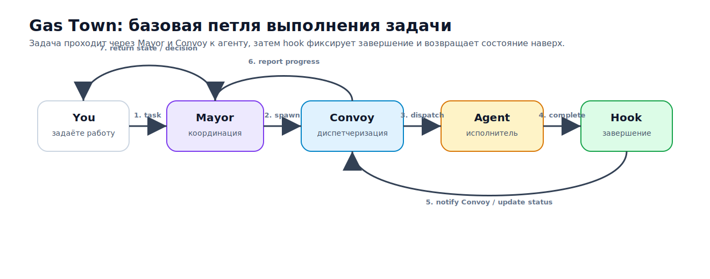
  <figcaption>Локально отрисованная схема по workflow из README Gas Town. Она показывает, как задача перестаёт быть сообщением в чате и становится цепочкой действий с диспетчеризацией, исполнителем, hook и возвратом состояния. Источник: <a href="https://github.com/gastownhall/gastown">Gas Town</a>. Локальный файл: <code>assets/theory-images/gastown-basic-workflow.svg</code>.</figcaption>
</figure>

## 47. Refinery, Witness, Deacon: обслуживающие агенты {#31-refinery-witness-deacon-obsluzhivayuschie-agenty}

Когда появляется много исполнителей, часть агентов должна заниматься не продуктовой работой, а обслуживанием самого процесса.

Refinery решает проблему очереди слияния. Если много Polecats создают изменения параллельно, они начинают конфликтовать с изменяющейся базой. Поздний исполнитель может пытаться слиться в main, который уже сильно изменился. Значит, нужен агент, который по одному обрабатывает изменения, перебазирует, пересобирает, иногда заставляет переосмыслить подход и эскалирует, если нельзя безопасно продолжать.

Witness решает проблему застревания рабочих агентов. Когда Polecats много, часть из них зависает, не отправляет MR, ждёт, теряет контекст или требует пинка. Witness следит за ними и помогает удерживать поток работы.

Deacon and Dogs решают проблему регулярного обслуживания. Deacon запускает patrol в цикле, Dogs разгружают его от грязной работы: устаревшие ветки, плагины, служебная уборка, вспомогательные задачи. Это показывает важную закономерность: когда агентская система растёт, часть работы становится не работой над фичами, а сопровождением агентской организации.

Для будущего dev-процесса это почти прямой урок. Если агентская разработка станет ежедневной практикой, понадобятся процедуры, которые не пишут фичи, а поддерживают сам процесс: чистят рабочие деревья, проверяют зависшие задачи, обновляют передачу состояния, закрывают старые ветки, находят устаревшие инструкции, смотрят повторяющиеся сбои, предлагают удаление лишних skills, проверяют очереди CI и ревью.

В малом личном процессе это могут быть не агенты, а ритуалы или скрипты. Но смысл тот же: система должна не только выполнять задачи, но и обслуживать собственное рабочее состояние.

## 48. Цена Gas Town: пропускная способность против понимания {#32-tsena-gas-town-propusknaya-sposobnost-protiv-ponimaniya}

Gas Town не нужно романтизировать. Сам Yegge подчёркивает, что система дорогая, хаотичная, требует большого опыта, tmux-дисциплины, постоянного человеческого управления и готовности мириться с потерями. Некоторые исправления будут сделаны дважды, часть работы потеряется, часть придётся выбирать вручную, часть агентов застрянет.

Это не делает Gas Town бесполезным. Наоборот, это делает его хорошим источником теории. Он показывает цену перехода от “один агент помогает мне” к “я управляю агентской рабочей силой”. Вместе с ростом пропускной способности растут шум, потребность в очереди слияния, наблюдателях, восстановлении сессий, почте, событиях, устойчивых идентичностях, обслуживании самой системы и защите человеческого понимания.

Это не должно превращаться в совет “используйте Gas Town”. Правильнее так: Gas Town показывает дальний край пространства. Он нужен как предупреждение и как карта будущих примитивов. Большинству разработчиков не нужна полная версия, но почти всем, кто будет углубляться в агентскую разработку, постепенно понадобятся её малые элементы: привязка задач к рабочим деревьям, состояние задач, передача состояния, очередь, эскалация, обслуживающий проход, восстановление сессии и наблюдаемость агентской работы.

## 49. От Gas Town к платформенным примитивам {#33-ot-gas-town-k-platformennym-primitivam}

Ещё один важный урок Gas Town — переход от одного оркестратора к набору примитивов, из которых можно собирать разные оркестраторы. Yegge фактически движется от “у меня есть система для управления агентами” к более общей платформе: идентичности, роли, почта, сессии, стоимость, маршрутизация между моделями, skills, priming, hooks, GUPP, molecules, beads, epics, convoys, orders, patrols, plugins, tmux, восстановление старых сессий.

Это близко к тому, как стоит думать о будущем dev-процессе. Нужен не один идеальный рабочий процесс, а набор устойчивых примитивов: рабочая единица, роль, состояние, очередь, передача состояния, проверка, эскалация, обслуживающий проход, восстановление, журнал решений, область действия. Из этих примитивов можно строить разные ритуалы под разные проекты и этапы зрелости.

Для систем активной памяти и долгих разработческих процессов это особенно важно. Такая среда не должна заранее навязывать один “правильный” процесс. Более сильная архитектура — дать устойчивые примитивы, а затем позволить человеку и агенту собирать из них подходящий экзоскелет: для одиночной задачи, для долгого исследования, для серии изменений, для командной работы, для ремонта процесса.

---

# Часть VI. Проверка и свидетельства

В части III проверка рассматривалась как часть обвязки: датчики, которые направляют, останавливают или корректируют агента. Здесь речь о другой стороне проверки — о свидетельствах, по которым человек или следующий исполнитель принимает результат. Датчик помогает агенту сделать следующий шаг. Свидетельство помогает принять состояние работы.

## 50. Агенту нельзя верить на слово, но и человека нельзя превращать в ручной линтер {#34-agentu-nelzya-verit-na-slovo-no-i-cheloveka-nelzya-prevraschat-v-ruchnoy-lint}

В агентской разработке слово “готово” почти ничего не значит. Агент может написать убедительное резюме, но не запустить тесты. Может запустить тесты, но не те. Может пройти тесты, но снизить покрытие поведения. Может исправить замечания ревьюера и одновременно увести решение от исходного намерения. Может честно считать задачу завершённой, потому что локальная петля модели не видит того, что увидит пользователь, CI, лог или владелец продукта.

Поэтому продвинутый процесс требует не доверия к словам, а свидетельств. Свидетельство — это артефакт, который можно посмотреть, сравнить, передать другому участнику, использовать для восстановления состояния и положить в историю задачи. Это может быть diff, вывод тестов, результат проверки типов, снимок экрана, видео, трассировка, лог, прогон CI, классификация замечаний, ссылка на [предварительное развёртывание](#handbook--browser-runtime), резюме PR, передача состояния или обновление issue.

Но другая крайность тоже опасна. Если человек вручную проверяет всё, что мог бы проверить линтер, проверка типов, тест или скрипт, агентская разработка не масштабируется. Человек превращается в дорогой ручной датчик. Его внимание нужно сохранять для того, что плохо формализуется: намерение, продуктовый смысл, архитектурный компромисс, область действия, социальный риск, принятие состояния.

Теоретически сильная проверочная система должна отвечать на два вопроса: что можно проверить детерминированно и что требует интерпретации и человеческого решения. Если не различать эти два слоя, процесс становится либо наивно автономным, либо чрезмерно ручным.

## 51. Надёжность вывода: почему уверенность агента не равна правоте {#output-reliability}

Агентская разработка требует различать уверенность агента и надёжность вывода. Агент может говорить последовательно, ссылаться на файлы, объяснять ход работы и при этом ошибаться: неверно понять требование, проверить не то поведение, написать тест под свою реализацию или принять чужой внешний текст как инструкцию. В таких случаях проблема не в том, что агент “галлюцинирует” в узком смысле. Проблема в том, что человек принимает вывод без достаточного основания.

Надёжность вывода лучше рассматривать как несколько уровней доказанности. Самый слабый уровень — утверждение агента: “готово”, “причина найдена”, “тесты проходят”. Следующий уровень — объяснение: агент показывает, почему он считает вывод правильным. Это уже полезно, но всё ещё остаётся текстом. Сильнее работает `diff`, потому что он показывает реальное изменение. Ещё сильнее — запуск проверки: тест, типизация, сборка, браузерный сценарий, лог, трассировка, CI, предварительное развёртывание. Но и это не всегда достаточно. Проверка должна покрывать именно то поведение, ради которого задача выполнялась. Зелёный тест слаб, если он проверяет форму новой реализации, а не исходный сбой или требование.

[OpenAI Evals](https://evals.openai.com/) и [документация OpenAI по evals](https://developers.openai.com/api/docs/guides/evals) полезны здесь как общий инженерный ориентир: качество вывода нужно проверять на задачах и критериях, которые отражают реальную работу, а не только на ощущении, что ответ выглядит правильным. [Anthropic в Building Effective AI Agents](https://www.anthropic.com/research/building-effective-agents) делает близкое практическое различение между простыми предопределёнными workflows и более автономными агентами: чем больше автономии, тем важнее ограничить область действия и иметь понятные точки проверки. Для coding agents это означает, что “агент уверен” не является рабочим свидетельством; свидетельством становится проверяемый след в коде, среде выполнения или процессе ревью.

### Что доказывают зелёные тесты

Зелёные тесты доказывают только то, что проверяет тестовый набор. Если тест был написан до исправления и воспроизводил исходный сбой, он даёт сильный сигнал. Если агент сначала изменил код, затем написал тест под новый код и объявил результат готовым, сигнал слабее. Такой тест может закрепить выбранную реализацию, но не доказать, что реализовано нужное поведение.

Для багфикса лучше просить агента сначала воспроизвести сбой: минимальный тест, лог, сценарий в браузере или команда, которая падает до исправления. После этого исправление можно оценивать по изменению статуса: было красным — стало зелёным. Для новой функциональности нужно отдельно проверить, что тест описывает требование, а не внутреннее устройство решения. В задачах с большим радиусом ошибки могут быть полезны property-based тесты, мутационное тестирование или более формальные проверки. Их не нужно превращать в вариант по умолчанию, но они показывают важное различие: тестовый набор тоже нуждается в проверке. Mutation testing именно поэтому используется как способ оценить, способен ли набор тестов обнаруживать искусственно внесённые дефекты, а не просто проходить на текущей реализации.

### Как отличать найденный баг от бага, созданного тестом

Агент может “найти баг”, потому что он построил тест, который не соответствует реальному требованию. Это особенно вероятно в незнакомой кодовой базе, при слабом доменном контексте или при работе с библиотеками, где поведение задаётся внешним контрактом. В такой ситуации новый тест является гипотезой, а не доказательством.

Надёжнее просить агента показать независимое основание: документацию, issue, старый тест, лог production-сценария, пользовательский сценарий, аналогичную реализацию в проекте или минимальное воспроизведение до изменения. Если такого основания нет, человек должен принять решение явно: это действительно баг, новая продуктовая норма или спорное изменение контракта. Здесь вывод агента становится входом для инженерного решения, а не самим решением.

### Надёжность вывода и внешний контекст

Когда агент читает внешний текст через браузер, MCP, issue tracker, логи, [Figma](#story-11-mae-capozzi--5-ui-kod-model-stala-luchshe-no-reshayuschimi-okazalis-figma-claude-md-i-gotovye), [Honeycomb](#story-11-mae-capozzi--18-nablyudaemost-agent-pishet-telemetry-boilerplate-no-formu-trace-zadaet-chelov), Replay или документацию, надёжность вывода зависит ещё и от границы между данными и инструкциями. [OWASP Top 10 for Large Language Model Applications](https://owasp.org/www-project-top-10-for-large-language-model-applications/) выделяет prompt injection, insecure output handling и supply chain risks как отдельные классы риска. Для агентской разработки это практическая проблема: внешний текст может быть полезным свидетельством, но не должен автоматически становиться командой для агента.

Если агент использует внешний источник, итог должен разделять три вещи: что было прочитано, какое поведение или факт это подтверждает, и какие инструкции из внешнего источника не должны исполняться. Это особенно важно там, где агент не только читает, но и может действовать: создавать PR, писать комментарии, менять файлы, ходить в сеть или обращаться к внешнему API. Связанный практический режим описан в [Handbook, раздел “MCP и внешние системы”](#handbook--mcp).

### Когда выводу можно доверять достаточно

Доверие к выводу не бинарно. Для маленькой обратимой правки достаточно читаемого `diff`, локальной проверки и возможности быстро откатить изменение. Для исправления бага нужен воспроизводимый сбой и проверка, что он исчез. Для интерфейса нужен работающий сценарий в браузере и отсутствие явных ошибок в консоли. Для PR нужен статус CI, классификация замечаний и человек, который понимает изменение. Для архитектурного решения нужна причинная картина: почему выбран этот путь, какие альтернативы отклонены, какие границы затронуты и где риск остаётся.

Эта рамка связывает теорию с практическими разделами: [проверяемые свидетельства](#handbook--verification) отделяют уверенный текст агента от рабочего знания; [разбор PR-сигналов](#handbook--review-comments-as-signals) нужен потому, что замечание другого агента тоже не является фактом; [наблюдаемость](#theoretical-synthesis--37-logirovanie-i-nablyudaemost-nelzya-ostavlyat-tekstovoy-prosbe) нужна потому, что часть истины появляется только в среде выполнения.

## 52. Доказательство работы зависит от типа задачи {#35-dokazatelstvo-raboty-zavisit-ot-tipa-zadachi}

Один и тот же артефакт не подходит для всех задач.

Для внутреннего рефакторинга сильнее всего работают типы, тесты, структурные правила, отсутствие изменения публичного поведения и небольшой diff. Если поведение должно остаться прежним, сильным проверочным сигналом будет подтверждение неизменного публичного контракта, а не новая демонстрация фичи.

Для багфикса главное свидетельство — воспроизведение. Нужно сначала показать, что баг действительно проявляется, затем показать, что после исправления он исчез. Если агент не воспроизвёл баг до исправления, он может написать правдоподобную правку к не той причине.

Для UI-задачи важны браузерные свидетельства: маршрут, действие пользователя, снимок экрана, DOM-узел, консоль, повторный проход после правки. Простое “тесты зелёные” почти ничего не говорит о визуальной плотности, пустом состоянии, перекрытии элементов или фактическом пользовательском сценарии.
<figure class="source-figure" id="fig-openai-codex-chrome-devtools-validation">
  
  <figcaption>Схема усиливает раздел о свидетельствах UI-задач: агенту недостаточно прочитать файлы, ему нужен канал наблюдения за работающим приложением — DOM, браузер, логи, снимки и проверочный сценарий. Источник: <a href="https://openai.com/index/harness-engineering/">Harness engineering</a>. Локальный файл: <code>assets/theory-images/openai-codex-chrome-devtools-validation.webp</code>.</figcaption>
</figure>

Для PR-сопровождения важна история сигналов: CI, автоматическое ревью, человеческие комментарии, классификация [Fix / Dismiss / Escalate](#story-05-jokull-solberg--7-fix-dismiss-escalate-zaschita-ot-mehanicheskogo-poslushaniya), повторный прогон, итоговое состояние. Здесь результатом является не только код, но и разобранная очередь замечаний.

Для миграции или обновления зависимости важны фронт воздействия, новые ошибки, совместимость, откат, наблюдаемость и решение о принятии риска. Агент может сделать механический проход, но человек должен понимать, что изменилось в гарантиях системы.

Для долгой фоновой задачи важна передача состояния: что было целью, какие шаги выполнены, где агент остановился, какие проверки прошли, что осталось сделать, какие решения требуют человека.

[Simon Willison хорошо формулирует отдельный класс свидетельств](https://simonwillison.net/2025/Nov/6/async-code-research/) через `code research`: агент может создать маленький эксперимент, поставить зависимости, проверить библиотеку, построить proof-of-concept и оставить README или репозиторий с воспроизводимым результатом. Важная оговорка: успешный эксперимент доказывает, что путь существует; неудачный эксперимент не доказывает, что пути нет. Это полезно для Handbook: агентское исследование хорошо подтверждает возможность, но плохо доказывает невозможность.

## 53. Поведенческая проверка остаётся слабым местом {#36-povedencheskaya-proverka-ostaetsya-slabym-mestom}

Поддерживаемость и часть архитектуры хорошо проверяются вычислительно. Поведение продукта — гораздо сложнее.

Можно написать тесты, но тесты могут проверять не тот сценарий. Можно дать агенту написать тесты, но агент может написать их под собственную реализацию. Можно измерить покрытие, но покрытие не гарантирует смысл. Можно использовать mutation testing, но оно не заменяет продуктового понимания. Можно провести ручное тестирование, но оно дорого и плохо масштабируется.

Эта проблема усиливается агентами. Если человек пишет код вручную, он часто держит в голове пользовательский сценарий, ради которого делает изменение. Агент может держать сценарий только через контекст, тесты, примеры, браузер, данные и указания. Если эти элементы слабы, агент может создать рабочий код, который не проводит исходное намерение.

Исследования про тесты, созданные агентами, добавляют эмпирическое предупреждение: агенты могут чаще менять тесты и добавлять моки, чем обычные разработчики. Такие тесты могут быть удобны для прохождения локальной проверки, но слабее подтверждать реальное поведение системы. Это усиливает тезис о независимом источнике поведения: тест не должен быть только отражением того, что агент уже реализовал.

Отсюда следует практическое правило: для поведенческих изменений тесты должны опираться на независимый источник поведения. Это может быть существующая фикстура, пользовательский сценарий, браузерный проход, производственная трасса, эталонный пример, контрактный тест, ручная проверка, продуктовая спецификация или отдельное ревью намерения. Если тест рождается только из кода, который агент только что написал, он слабее.

## 54. Логирование и наблюдаемость нельзя оставлять текстовой просьбе {#37-logirovanie-i-nablyudaemost-nelzya-ostavlyat-tekstovoy-prosbe}

Логи, метрики и трассировки часто кажутся второстепенными по сравнению с фичей. Агент легко пишет код, который проходит тесты, но плохо наблюдается. Потом человек чинит логирование, сообщения об ошибках, телеметрию и эксплуатационный контекст вручную.

Исследование про логирование у агентов разработки показывает похожий паттерн: явные инструкции по логированию встречаются редко и плохо исполняются; люди после генерации часто выступают “тихими уборщиками”, исправляя наблюдаемость без явной обратной связи ревью. Это важный сигнал: нефункциональные требования плохо удерживаются одной текстовой просьбой.

Для продвинутого процесса это означает: наблюдаемость должна быть частью обвязки, а не финальным “не забудь добавить логи”. Нужны шаблоны логирования, структурированные события, обёртки, линтеры, проверка наличия важных полей, тесты на пути ошибок, чек-листы ревью, трассы в staging-среде и сценариях, похожих на production. Агенту нужно давать не только команду “логируй хорошо”, а готовую форму хорошего логирования.

<figure class="source-figure" id="fig-fowler-harness-continuous-feedback">
  
  <figcaption>Схема хорошо подходит к разделу о наблюдаемости: часть сигналов возникает не в момент написания кода, а в постоянном мониторинге кодовой базы и среды выполнения. Источник: <a href="https://martinfowler.com/articles/harness-engineering.html">Harness engineering for coding agent users</a>. Локальный файл: <code>assets/theory-images/fowler-harness-continuous-feedback.png</code>.</figcaption>
</figure>

<figure class="source-figure" id="fig-mae-honeycomb-trace-observability">
  
  <figcaption>Этот source-скриншот показывает более прикладной слой наблюдаемости: агентская работа тоже может оставлять трассу с фазами, worker spans, ошибками и длительностью, а не только финальный ответ. Источник: <a href="https://maecapozzi.com/blog/building-a-multi-agent-orchestrator">Claude Orchestrator: Building a Multi-Agent AI System with Claude Code</a>. Локальный файл: <code>assets/theory-images/mae-honeycomb-trace-observability.png</code>.</figcaption>
</figure>

[Mae Capozzi](#story-11-mae-capozzi--18-nablyudaemost-agent-pishet-telemetry-boilerplate-no-formu-trace-zadaet-chelov) хорошо показывает этот слой на практике: агент может подготовить черновик телеметрии, но человек и платформа должны проверять, что события действительно пригодны для расследования и принятия решений. AgentTrace и похожие исследовательские рамки идут ещё дальше: агентская система сама должна оставлять структурированный след своих действий, состояния и контекста.

В этом месте полезно различать четыре вида наблюдаемости. Первая — наблюдаемость продукта: логи, метрики, трассировки и пользовательские сценарии. Вторая — наблюдаемость агентской работы: какие инструменты вызваны, какие проверки запущены, где агент остановился, какие действия были отклонены. Третья — наблюдаемость контекстных решений: какие инструкции были загружены, какие документы выбраны, что было сжато или отброшено. Четвёртая — наблюдаемость процесса как объекта ремонта: какие сбои повторяются, какие навыки не срабатывают, где хук блокирует лишнее или, наоборот, пропускает опасное действие. Если эти уровни смешать, команда видит много данных, но плохо понимает, что именно надо менять.

## 55. Комментарии ревью — это сигналы, а не команды {#38-kommentarii-revyu-eto-signaly-a-ne-komandy}

Одна из типичных ошибок агентской разработки — передать агенту список замечаний и сказать “исправь всё”. Это кажется естественным: есть ревью, значит нужно применить. Но комментарий ревьюера не всегда является задачей.

Автоматический ревьюер может неправильно понять контекст. Другой агент может предложить локально логичное, но архитектурно неверное исправление. Человеческий ревьюер может оставить вопрос, а не требование. CI может упасть из-за flaky-теста. Static analysis может указать на реальную проблему, но предложить не тот путь исправления.

Поэтому между сигналом и действием нужен разбор. [Jökull Sólberg](#story-05-jokull-solberg--7-fix-dismiss-escalate-zaschita-ot-mehanicheskogo-poslushaniya) формализует это как [Fix / Dismiss / Escalate](#handbook--review-comments-as-signals). [Jesse Vincent](#story-06-jesse-vincent--9-zamechaniya-proverki-ne-dolzhny-avtomaticheski-stanovitsya-zadachami) просит агента оценивать не только замечание, но и самого внешнего проверяющего: понимает ли он контекст, какие предложенные исправления правильны, какие стоит отклонить, что нужно вынести человеку.

Это маленькое различение имеет большой теоретический смысл. Агентская система должна не просто принимать сигналы, а классифицировать их. Иначе один агент начинает обслуживать другого агента, а человек видит только растущий список “исправлений”. В зрелом процессе сигнал должен иметь статус: принят, отклонён, требует человека, требует новой проверки, требует изменения плана, является шумом.

## 56. Свидетельства должны быть пригодны для следующего шага {#39-svidetelstva-dolzhny-byt-prigodny-dlya-sleduyuschego-shaga}

Проверяемый артефакт полезен только тогда, когда он помогает следующему участнику процесса.

Плохое свидетельство: “тесты прошли”.

Лучше: “запущены `npm test -- --runInBand tests/foo.test.ts`, 18 тестов прошли; до исправления тест `should preserve republish state` падал; после исправления проходит”.

Плохое свидетельство: “проверил в браузере”.

Лучше: “открыл `/admin/tours/123`, нажал Publish, затем Unpublish, затем Publish; screenshot до и после лежит там-то; консоль без ошибок; статус в API изменился с false на true”.

Плохое свидетельство: “обработал review”.

Лучше: “[Greptile](#story-05-jokull-solberg--8-tri-istochnika-proverki-ci-greptile-i-codex): 2 пункта, один Fix, один Dismiss с причиной; Codex review: 1 пункт Fix; CI зелёный после повторного прогона”.

<figure class="source-figure" id="fig-openai-codex-citations-evidence">
  
  <figcaption>Скриншот добавляет к разделу конкретный интерфейсный пример: свидетельство пригодно для следующего шага, когда summary, testing, файлы и цитируемые строки связаны с задачей и diff. Источник: <a href="https://openai.com/index/introducing-codex/">Introducing Codex</a>. Локальный файл: <code>assets/theory-images/openai-codex-citations-evidence.webp</code>.</figcaption>
</figure>

Такое свидетельство работает как передача состояния. Оно помогает человеку принять решение, другому агенту продолжить работу, будущему ревью восстановить причину. Поэтому качество свидетельства определяется не только точностью, но и пригодностью для следующего шага.

## 57. Эмпирические предупреждения: скорость генерации не равна качеству {#40-empiricheskie-preduprezhdeniya-skorost-generatsii-ne-ravna-kachestvu}

Теоретические рамки полезны, но их нужно проверять эмпирическими предупреждениями. Несколько свежих исследований указывают на одну и ту же границу: агентская скорость сама по себе не превращается в доверие, качество и принятие результата.

Исследования агентских PR показывают прежде всего масштаб явления: изменения, написанные агентами, уже можно изучать как большой поток изменений в реальных репозиториях. AIDev агрегирует сотни тысяч агентских PR из десятков тысяч репозиториев, поэтому речь уже не об отдельных демо. Это важный эмпирический сдвиг само по себе. Но из одного факта масштаба не следует автоматически, что такие PR принимаются с той же вероятностью, что и человеческие, или требуют меньше ревью. Поэтому точная формулировка должна быть осторожной: агентская разработка резко увеличивает поток кандидатов на изменение, а доверие, принятие и стоимость проверки остаются отдельной проблемой.

Исследования тестов показывают другой риск: агенты могут менять тесты и чаще добавлять моки. Такие тесты могут быть удобны для прохождения локальной проверки, но слабее подтверждать реальное поведение системы. Это усиливает тезис о независимом источнике поведения: тест не должен быть только отражением того, что агент уже реализовал.

Исследования логирования показывают похожую проблему с нефункциональными требованиями. Инструкции “пиши хорошие логи” или “добавь observability” недостаточно надёжны. Людям потом часто приходится вручную исправлять сообщения, уровни логирования, поля событий и контекст ошибок. Значит, требования к наблюдаемости нужно поддерживать шаблонами, чек-листами ревью, структурированными событиями и проверками, а не только просьбой в запросе.

Эти предупреждения не говорят, что агенты плохи. Они говорят, что результат агента должен входить в систему свидетельств. Скорость генерации — только один параметр. Важны принятие, проверяемость, поведенческая сила тестов, качество логирования и способность человека понять, что произошло.

---

# Часть VII. Ответственность, человек и границы автономии

Чем больше агент может делать сам, тем важнее понимать, где остаётся человеческая ответственность. Эта часть связывает роль человека, область действия, песочницу, права и социальные последствия в одну тему: автономия полезна только тогда, когда она имеет границы.

## 58. `Human in the loop` слишком слабая формула {#41-human-in-the-loop-slishkom-slabaya-formula}

Фраза `human in the loop` часто звучит как ответ на все риски: пусть человек проверит. Но она мало что говорит о реальном процессе. Где именно человек? Что он проверяет? До какого действия? На каком уровне абстракции? Что происходит, если человек не успевает? Какие решения он не должен делегировать?

[Fowler / Thoughtworks полезно различают человека](https://martinfowler.com/articles/harness-engineering.html) “в петле” и человека “на петле”. Человек “в петле” участвует в каждом внутреннем цикле: смотрит предложения, исправляет код, одобряет действия, отвечает на вопросы. Такой режим нужен для высокой неопределённости, опасных действий и обучения процесса. Но он плохо масштабируется.

Человек “на петле” проектирует саму петлю: какие артефакты возникают, какие датчики срабатывают, где агент может сам исправиться, где нужен ручной шлюз, какие ошибки должны менять обвязку. Это более зрелая роль. Человек не обязан исправлять каждую строку; он должен сделать так, чтобы многие плохие строки либо не возникали, либо ловились раньше.

<figure class="source-figure" id="fig-fowler-humans-on-loop">
  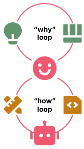
  <figcaption>Схема поддерживает различие между ручным чтением каждой строки и управлением петлёй: человек задаёт форму работы, проверки и точки решения, а агент выполняет часть нижнего цикла. Источник: <a href="https://martinfowler.com/articles/exploring-gen-ai/humans-and-agents.html">Humans and Agents in Software Engineering Loops</a>. Локальный файл: <code>assets/theory-images/fowler-humans-on-loop.png</code>.</figcaption>
</figure>

Это не означает, что человек становится менеджером в корпоративном смысле. Скорее, он становится владельцем намерения и среды. Его работа — не просто писать код и не просто одобрять изменения, а удерживать связь между целью, ограничениями, проверками, риском и итоговым состоянием.

## 59. Человеческое внимание нужно ставить в точки максимального рычага {#42-chelovecheskoe-vnimanie-nuzhno-stavit-v-tochki-maksimalnogo-rychaga}

Агентская разработка создаёт новую проблему внимания. Агент может произвести больше артефактов, чем человек успевает внимательно читать. Если человек пытается читать всё, он становится узким местом. Если не читает ничего, он теряет контроль.

Поэтому внимание нужно ставить в точки максимального рычага. Исследование до кода часто важнее финального ревью кода: если агент неправильно понял систему, всё последующее будет построено на неверной карте. План до реализации часто важнее чтения большого diff: исправить область действия в плане дешевле, чем выпиливать лишнюю реализацию. Классификация риска перед слиянием важнее чтения всех строк одинаково: человек должен понять, что может сломаться, где нет проверки, какие данные затронуты и можно ли откатить. Ремонт процесса после сбоя важнее однократной правки: если агент удалил тест, принял плохой комментарий ревьюера или вышел за область задачи, нужно не только починить конкретное изменение, но и решить, нужен ли новый датчик, skill, hook, документ, wrapper или граница разрешений.

Так возникает другая модель человеческой работы: меньше ручного исполнения, больше выбора правильной точки вмешательства.

## 60. Человек остаётся владельцем того, что нельзя свести к датчику {#43-chelovek-ostaetsya-vladeltsem-togo-chto-nelzya-svesti-k-datchiku}

Некоторые вещи можно автоматизировать. Проверка типов, форматирование, граница зависимостей, часть тестов, часть архитектурных функций пригодности, часть логирования. Другие вещи нельзя надёжно свести к датчику.

Человек остаётся владельцем цели. Модель может уточнить формулировку, но не решает, какая задача стоит времени.

Человек остаётся владельцем продуктового смысла. Модель может предложить UI, но не знает, какой компромисс соответствует бизнесу, пользователям, бренду, юридическим ожиданиям и стратегии.

Человек остаётся владельцем архитектурного риска. Модель может видеть локальную правильность, но не всегда понимает долгосрочную цену нового слоя, зависимости или исключения.

Человек остаётся владельцем социальных последствий. PR в чужой проект, изменение публичного API, удаление старого поведения, работа с данными пользователей, генерация документации, коммуникация с мейнтейнерами — всё это имеет стоимость за пределами кода.

Человек остаётся владельцем принятия состояния. “Сейчас достаточно хорошо” — это не только технический факт. Это решение о риске, времени, качестве, обратимости и цели.

## 61. Агентский маховик: агент помогает улучшать среду, но не должен владеть ею {#44-agentskiy-mahovik-agent-pomogaet-uluchshat-sredu-no-ne-dolzhen-vladet-eyu}

Когда человек переходит “на петлю”, появляется следующий естественный шаг: агент может помогать улучшать саму петлю. Он может анализировать повторяющиеся сбои, предлагать новый skill, указывать на слабый датчик, замечать шумный MCP, [сокращать `AGENTS.md`](https://developers.openai.com/codex/guides/agents-md), находить устаревшую документацию, предлагать проверку для повторяющегося сбоя.

Это можно назвать агентским маховиком. Агент выполняет задачи, задачи оставляют следы, следы показывают слабости процесса, агент помогает предложить изменения процесса, человек принимает или отклоняет их, среда становится лучше.

Но здесь легко ошибиться. Если агент начнёт автоматически добавлять новые правила после каждого сбоя, процесс быстро станет тяжелее самой работы. Если он будет чинить только локальный симптом, обвязка разрастётся без ясного принципа. Если человек не контролирует изменения процесса, модель может оптимизировать его под собственную лёгкость, а не под качество проекта.

Поэтому агент может быть помощником в ремонте процесса, но не владельцем процесса. Он может предложить. Он может собрать свидетельства. Он может показать повторяемость. Он может написать черновик навыка или хука. Но человек решает, стоит ли этот сбой новой процедуры, можно ли заменить инструкцию вычислительным датчиком, не лучше ли удалить старое правило, не создаст ли новый слой больше шума.

[Jesse Vincent](#story-06-jesse-vincent--11-superpowers-ruchnye-priemy-stanovyatsya-dostupnymi-agentu), [Matt Pocock](#story-12-matt-pocock-skills--5-grill-me-ostanovit-prezhdevremennoe-ponimanie) и [HumanLayer показывают](#story-07-humanlayer--1-glavnaya-ramka-inzhenerit-nuzhno-ne-tolko-model-no-i-ee-sredu) разные формы такого ремонта. Это важная линия ближайшего года, но ещё не зрелая автоматизация.

## 62. Автономия — не свойство модели, а договор с окружением {#45-avtonomiya-ne-svoystvo-modeli-a-dogovor-s-okruzheniem}

Когда говорят “дать агенту больше автономии”, часто имеют в виду способность модели дольше работать без человека. Но автономия в разработке не является свойством модели отдельно. Она является договором между задачей, средой, правами, проверками, памятью, возможностью отката и человеческими шлюзами.

Один и тот же агент может быть достаточно автономен для локального рефакторинга в рабочем дереве и совершенно не автономен для миграции производственных данных. Может сам запускать тесты, но не сам делать слияние. Может создать PR, но не публиковать релиз. Может исправлять CI, но не принимать архитектурный компромисс.

Поэтому зрелая автономия всегда ограничена областью действия. Она отвечает на вопросы: что агент может читать, что агент может менять, какие команды можно выполнять без подтверждения, какие действия требуют человека, какие данные недоступны, где находится откат, какие проверки обязательны, где агент должен остановиться.

Если этих границ нет, автономия превращается в отсутствие контроля.

## 63. Область действия и чрезмерная инициативность {#46-oblast-deystviya-i-chrezmernaya-initsiativnost}

Исследование Overeager Coding Agents полезно тем, что отделяет особый класс ошибок. Агент может не быть злонамеренным, не попасть под инъекцию запроса, не обходить песочницу и не быть неспособным решить задачу. Он может выполнить безопасный запрос и всё равно сделать лишнее: удалить несвязанные файлы, тронуть резервные учётные данные, переписать конфигурацию, которую пользователь не упоминал.

Проблема здесь находится в области действия. Агент делает вывод, что “заодно” можно улучшить, почистить, обновить или привести к порядку соседние вещи. Для человека это может выглядеть как полезная инициативность. Для проекта — как нарушение авторизации.

Важная деталь исследования: явное указание разрешённой области действия заметно снижает чрезмерную инициативность. В парных сценариях с Claude Code удаление такого указания повышало долю выходов за область задачи с нуля до заметной величины, а в сравнении разных моделей и фреймворков различие было двузначным в процентных пунктах. Точные числа зависят от модели и режима работы, но направление важно: область действия становится рабочим механизмом контроля, а не стилистической подробностью запроса.

Это должно стать базовым рабочим понятием. У каждой нетривиальной задачи должно быть не только намерение, но и область действия. Особенно если агент работает автономно, ночью, в фоне, в рабочем дереве или с правами на запись.

## 64. Песочница, права и рабочие деревья решают разные задачи {#47-pesochnitsa-prava-i-rabochie-derevya-reshayut-raznye-zadachi}

Песочница, права и рабочие деревья часто смешиваются, но это разные механизмы.

Рабочее дерево Git отделяет изменения. Оно помогает не смешивать diff, запускать несколько попыток, выбросить неудачный вариант, сравнить подходы. Но рабочее дерево не защищает секреты и не ограничивает доступ к домашней директории.

Песочница ограничивает среду исполнения. Она может запретить чтение файлов, сетевой доступ, запись в системные директории, запуск опасных команд. Но песочница не знает намерение задачи и не решает, хороший ли код написан.

Модель разрешений регулирует действия: какую команду можно выполнить, когда нужно подтверждение, что запрещено. Но если подтверждений слишком много, человек устаёт. Если слишком мало, агент получает опасную свободу.

Ограниченные учётные данные ограничивают внешний ущерб: агент может работать с тестовым токеном, данными staging-среды, API только для чтения, ограниченными правами GitHub. Но учётные данные не заменяют проверку кода.

Эти механизмы нужно комбинировать. [Mike McQuaid](#story-08-mike-mcquaid--5-sandvault-otdelnyy-polzovatel-macos-plyus-sandbox-exec) показывает жёсткий инфраструктурный вариант через [Sandvault](#story-08-mike-mcquaid--5-sandvault-otdelnyy-polzovatel-macos-plyus-sandbox-exec) и рабочие деревья. [Arvid Kahl](#story-04-arvid-kahl--13-allow-dlya-bezopasnoy-rutiny) показывает прикладной режим через `allow` / `deny`, тестовую среду и браузер. [Jökull Sólberg](#story-05-jokull-solberg--17-bezopasnost-i-izolyatsiya-devcontainer-rabochee-derevo-yolo-mode) использует devcontainer и PR-процедуры. Ни один из этих механизмов не является универсальным. Каждый закрывает свой класс риска.

<figure class="source-figure" id="fig-mike-superset-worktrees">
  
  <figcaption>Скриншот показывает практическое соединение рабочих деревьев и агентских поверхностей: Git-разделение даёт несколько независимых направлений работы, но человеку всё равно нужна видимая карта этих направлений. Источник: <a href="https://mikemcquaid.com/sandboxed-agent-worktrees-my-coding-and-ai-setup-in-2026/">Sandboxed agent worktrees: my coding and AI setup in 2026</a>. Локальный файл: <code>assets/theory-images/mike-superset-worktrees.png</code>.</figcaption>
</figure>

## 65. MCP как расширение границы доверия {#48-mcp-kak-rasshirenie-granitsy-doveriya}

[Simon Willison формулирует риск агентской автономии](https://simonwillison.net/2025/Jun/16/the-lethal-trifecta/) через `lethal trifecta`: приватные данные, недоверенное содержимое и канал вывода наружу. Если все три элемента доступны агенту одновременно, модель может стать каналом утечки даже без явной злонамеренности.

[MCP](https://modelcontextprotocol.io/docs/tutorials/security/security_best_practices) усиливает эту проблему, потому что описание инструмента само попадает в контекст модели и может быть отравлено инструкциями. Поэтому широкие недоверенные MCP-поверхности нельзя считать безопасным вариантом по умолчанию.

MCP нужно рассматривать как расширение границы доверия, а не просто удобный способ дать агенту инструменты. В официальных рекомендациях по безопасности MCP важны не только инъекции запросов, но и confused deputy, token passthrough, SSRF, hijacking сессии, локальные серверы с широкими правами, точная проверка redirect URI, проверка аудитории токена, согласие на уровне клиента, аудит действий и минимизация областей доступа.

Для практического процесса это означает: MCP-сервер должен иметь узкую задачу, понятные права, проверенное происхождение, журнал действий и явную область доверия. Универсальный MCP-доступ ко всему проекту и внутренним сервисам — плохой вариант по умолчанию.

<figure class="source-figure" id="fig-humanlayer-too-many-mcp-tools">
  
  <figcaption>Схема хорошо подходит к разделу про MCP: проблема не только в безопасности внешнего инструмента, но и в том, что описания лишних tools сами занимают контекст, становятся инструкциями и ухудшают рабочее состояние агента. Источник: <a href="https://www.humanlayer.dev/blog/skill-issue-harness-engineering-for-coding-agents">Skill Issue: Harness Engineering for Coding Agents</a>. Локальный файл: <code>assets/theory-images/humanlayer-too-many-mcp-tools.png</code>.</figcaption>
</figure>

## 66. Риск не только технический {#49-risk-ne-tolko-tehnicheskiy}

В агентской разработке легко фокусироваться на техническом риске: удалить файл, сломать тест, утечь секрет, переписать конфиг. Но часть риска социальная.

PR в проект с открытым кодом может переложить работу на мейнтейнеров. Автоматический комментарий может выглядеть как человеческое обещание. Непроверенная документация может ввести пользователя в заблуждение. Агент может закрыть issue, изменить тон коммуникации, отправить письмо, создать публичный артефакт, который человек потом будет защищать своей репутацией.

Поэтому границы автономии должны учитывать не только файлы и команды, но и социальные поверхности: публикация, коммуникация, внешний PR, комментарии в задачах, заметки к релизу, документация, видимая пользователю. На этих границах человеку нужно оставаться ближе к решению.

[Mike McQuaid](#story-08-mike-mcquaid--20-pr-podgotovlennye-s-ii-kak-sotsialnaya-nagruzka-na-meynteynerov) формулирует это через правила Homebrew для изменений, сделанных при помощи ИИ. [Jökull Sólberg](#story-05-jokull-solberg--7-fix-dismiss-escalate-zaschita-ot-mehanicheskogo-poslushaniya) держит Escalate для решений, где нужен человек. [Matt Pocock](#story-12-matt-pocock-skills--20-git-guardrails-claude-code-sandbox-ne-zaschischaet-istoriyu-git) делает предохранители для PR и git-команд. Это часть инженерии риска.

---

# Часть VIII. Ближайший год и вывод для Handbook

Последняя часть собирает теоретические линии в прогноз и в практический вывод. Здесь нужно отделить элементы агентской среды, которые уже становятся нормой, от практик, которые только оформляются и пока плохо подходят как рекомендации по умолчанию.

## 67. Ближайший год будет не про исчезновение разработчика {#50-blizhayshiy-god-budet-ne-pro-ischeznovenie-razrabotchika}

После всех предыдущих слоёв прогноз становится более приземлённым. В ближайший год, скорее всего, будут оформляться элементы среды, которые сейчас собираются вручную: рабочие пространства, права, память задачи, проверочные сигналы и командная наблюдаемость.

Самый вероятный сдвиг ближайшего года связан не с мгновенным переходом к автономным командам агентов, а с закреплением рабочих примитивов вокруг них. Более реалистичная траектория выглядит иначе: агентская разработка будет всё сильнее оформляться как отдельная рабочая среда. В этой среде появятся более устойчивые формы контекста, памяти задач, подтверждений, наблюдаемости, песочниц, ролей и проверочных артефактов.

Это важное различение. Футуристическая формула “агенты всё сделают сами” слишком груба. Она не объясняет ни текущих сбоев, ни стоимости проверки, ни проблемы области действия, ни роль человеческого решения. Гораздо точнее сказать: агенты будут выполнять всё больше механической и локально-сложной работы, но вокруг них будет расти слой управления этой работой.

Ближайший год, вероятно, будет годом оформления агентской среды: меньше разговора о “магии модели” и больше работы над тем, как модель встроена в проект, инструменты, права, память и решения людей.

## 68. Эмпирическая оговорка: агент ускоряет не любую систему {#ai-does-not-accelerate-every-system}

Агентская разработка легко создаёт ощущение ускорения: код появляется быстрее, черновики становятся дешевле, одноразовые эксперименты запускаются чаще. Но из этого не следует, что любая задача или команда автоматически становится быстрее. Ускорение генерации может перенести работу в другое место: ревью, проверку, восстановление контекста, исправление скрытых дефектов, сопровождение CI или объяснение PR другому человеку.

[DORA 2025](https://dora.dev/research/2025/dora-report/) формулирует это как организационную оговорку: AI усиливает уже существующие сильные и слабые стороны системы, а наибольшая отдача приходит не от самого инструмента, а от работы с базовой организационной средой. Для этого сайта это важная проверка рамки. Агентская обвязка, наблюдаемость, быстрый CI, понятные границы задач и культура ревью не являются украшением вокруг модели. Они определяют, станет ли агент ускорением или новым источником разборов.

Похожую оговорку даёт рандомизированное исследование [Measuring the Impact of Early-2025 AI on Experienced Open-Source Developer Productivity](https://arxiv.org/abs/2507.09089). В нём опытные разработчики работали над зрелыми open-source проектами, которые хорошо знали. Участники ожидали ускорения, но в этом сеттинге разрешение использовать AI увеличило время выполнения задач на 19%. Этот результат не доказывает, что AI замедляет разработку вообще. Он показывает более полезную вещь: эффект зависит от задачи, зрелости проекта, качества стандартов, привычек разработчика, доступных проверок и стоимости ревью результата.

Поэтому вопрос для будущего процесса должен звучать не “использовать агента или нет”, а “где именно агент уменьшает общую стоимость работы”. Если агент экономит время на наборе кода, но увеличивает время ревью и восстановления смысла, выигрыш может исчезнуть. Если агент создаёт проверяемый эксперимент, сокращает поиск по репозиторию, оставляет хороший `handoff` или закрывает повторяемый сбой через маленький навык, выигрыш становится реальным. Агент ускоряет систему только тогда, когда результат легче понять, проверить и принять.

## 69. Что уже работает, что вероятно усилится, а что пока рано нормировать {#51-chto-uzhe-rabotaet-chto-veroyatno-usilitsya-a-chto-poka-rano-normirovat}

Из этого прогноза следует необходимость разделять зрелые практики и ранние гипотезы. Без такого различения теория легко превращается либо в осторожный пересказ текущего состояния, либо в манифест о полном исчезновении разработчика.

Уже работающими выглядят [инженерия контекста](https://martinfowler.com/articles/exploring-gen-ai/context-engineering-coding-agents.html) и обвязки, короткие проектные инструкции, `skills`, хуки, MCP, подагенты, рабочие деревья, сжатие контекста, CI, браузерные проверки, автоматические ревью и ограниченная автономия через песочницы и разрешения. Эти вещи уже есть в инструментах и практиках, хотя качество реализации сильно различается.

Вероятно усилятся память задачи, наблюдаемость агентской работы, структурированные графы задач, более строгие границы прав, узкие инструментальные поверхности, контуры ремонта процесса, разделение человеческих и модельных артефактов, а также роль платформенных команд. Это уже видно в [Beads](#theoretical-synthesis--24-graf-zadach-kak-vneshnyaya-pamyat-agenta), [Gas Town](#theoretical-synthesis--25-pochemu-gas-town-zasluzhivaet-otdelnogo-razdela), OpenAI App Server, [наблюдаемости LangChain](https://www.langchain.com/articles/agent-observability), [HumanLayer](#story-07-humanlayer--1-glavnaya-ramka-inzhenerit-nuzhno-ne-tolko-model-no-i-ee-sredu) и практических историях, но ещё не стало общей нормой.

Пока слишком рано нормировать полностью автономные многоагентные фабрики, широкие недоверенные MCP-поверхности, модельное ревью как финальный шлюз, автоматическое самоизменение процесса без человека и спецификацию как единый источник истины для всех изменений. Эти направления важны как эксперименты, но в практическом Handbook их нужно показывать как возможные линии развития, а не как рекомендации по умолчанию.

## 70. Практический Handbook должен стать картой выбора режима {#52-prakticheskiy-handbook-dolzhen-stat-kartoy-vybora-rezhima}

После разделения зрелых и незрелых практик становится ясно, как теория должна переходить в Handbook. Она не должна превращаться в большую методологию на все случаи. Её задача — дать причинность: почему нужны контекст, обвязка, память, проверки, границы автономии и человек. Практический Handbook должен использовать эту причинность для выбора режима.

Если задача маленькая и обратимая, достаточно короткой инструкции, чистого рабочего дерева, быстрого diff и локальной проверки.

Если задача исследовательская, нужен проход только на чтение, артефакт исследования, проверка гипотезы и только потом код. Если задача многофайловая, нужен план как поверхность человеческого решения. Если задача меняет поведение, нужны свидетельства поведения: сценарий, браузер, тест, fixture, trace и ручное суждение. Если задача идёт в PR, нужны классификация сигналов и готовность к повторным проверкам. Если задача автономная или фоновая, нужны область действия, рабочее дерево, передача состояния и восстановление состояния. Если задача командная, нужны состояние, владение, наблюдаемость и эскалация.

Именно так теория должна войти в Handbook: не как отдельная глава с лозунгами, а как объяснение, почему в одной ситуации достаточно лёгкого режима, а в другой нужен тяжёлый экзоскелет.

## 71. Итоговая рамка {#53-itogovaya-ramka}

Агентская разработка развивается не как одна новая техника, а как перестройка рабочего процесса вокруг модели. Запрос остаётся важным, но перестаёт быть центральной единицей: его дополняют [контекстные интерфейсы](#theoretical-synthesis--7-kontekstnye-interfeysy-kto-reshaet-chto-zagruzit), внешние артефакты намерения, проверочные свидетельства и долговременная память задачи. Модель всё ещё выполняет работу, но качество этой работы всё сильнее зависит от того, что она видит, какие инструменты ей доступны, какие права ограничивают действие и какие сигналы возвращает среда.

Главный сдвиг состоит в том, что рабочая среда становится самостоятельным инженерным объектом. Контекст превращается в управляемое состояние, обвязка — в систему направляющих и датчиков, а среда выполнения — в устойчивый слой событий, подтверждений, diff и восстановления. Память задачи становится важнее общей памяти агента, потому что долгой работе нужно сохранять не только сведения о проекте, но и текущее состояние решения: что сделано, что заблокировано, какие подходы отклонены, где требуется человек и чем подтверждён результат.

Человек при этом не исчезает из разработки. Его роль смещается: меньше ручного исполнения, больше владения целью, риском, областью действия и принятием состояния. Проверяемые свидетельства становятся сильнее слов “готово”, потому что позволяют человеку или следующему агенту понять, что действительно произошло. Автономия становится не свойством модели, а договором с окружением: она зависит от песочницы, прав, области действия, отката, наблюдаемости и человеческих шлюзов.

Ближайший год, вероятно, будет оформлять эти элементы в более явные продукты, протоколы, рабочие пространства и командные практики. Центральная инженерная задача уже видна: строить рабочую среду, в которой агент безопасно, проверяемо и осмысленно выполняет часть разработки.

## Карта источников {#54-karta-istochnikov}

### Основные теоретические источники

- Martin Fowler / Thoughtworks — Harness engineering for coding agent users: [https://martinfowler.com/articles/harness-engineering.html](https://martinfowler.com/articles/harness-engineering.html)
- Martin Fowler / Thoughtworks — Context Engineering for Coding Agents: [https://martinfowler.com/articles/exploring-gen-ai/context-engineering-coding-agents.html](https://martinfowler.com/articles/exploring-gen-ai/context-engineering-coding-agents.html)
- Martin Fowler / Thoughtworks — Structured-Prompt-Driven Development: [https://martinfowler.com/articles/structured-prompt-driven/](https://martinfowler.com/articles/structured-prompt-driven/)
- Martin Fowler / Thoughtworks — SPDD / Abstraction first: [https://martinfowler.com/articles/structured-prompt-driven/abstraction-first.html](https://martinfowler.com/articles/structured-prompt-driven/abstraction-first.html)
- Martin Fowler / Thoughtworks — SPDD / Alignment: [https://martinfowler.com/articles/structured-prompt-driven/alignment.html](https://martinfowler.com/articles/structured-prompt-driven/alignment.html)
- Martin Fowler / Thoughtworks — SPDD / Iterative Review: [https://martinfowler.com/articles/structured-prompt-driven/iterative-review.html](https://martinfowler.com/articles/structured-prompt-driven/iterative-review.html)
- OpenSPDD — command templates and CLI: [https://github.com/gszhangwei/open-spdd](https://github.com/gszhangwei/open-spdd)
- Martin Fowler / Thoughtworks — Humans and Agents in Software Engineering Loops: [https://martinfowler.com/articles/exploring-gen-ai/humans-and-agents.html](https://martinfowler.com/articles/exploring-gen-ai/humans-and-agents.html)
- Martin Fowler / Thoughtworks — Understanding Spec-Driven-Development: Kiro, spec-kit, and Tessl: [https://martinfowler.com/articles/exploring-gen-ai/sdd-3-tools.html](https://martinfowler.com/articles/exploring-gen-ai/sdd-3-tools.html)
- Thoughtworks — Harness engineering and agent feedback: Exploring AI coding sensors: [https://www.thoughtworks.com/insights/blog/generative-ai/harness-engineering-agent-feedback-exploring-ai-coding-sensors](https://www.thoughtworks.com/insights/blog/generative-ai/harness-engineering-agent-feedback-exploring-ai-coding-sensors)
- From Code-Centric to Intent-Centric Software Engineering: [https://arxiv.org/abs/2605.11027](https://arxiv.org/abs/2605.11027)
- Intent Formalization: A Grand Challenge for Reliable Coding in the Age of AI Agents: [https://arxiv.org/abs/2603.17150](https://arxiv.org/abs/2603.17150)

### Agent-first / agent-loop / context engineering

- OpenAI — Harness engineering: leveraging Codex in an agent-first world: [https://openai.com/index/harness-engineering/](https://openai.com/index/harness-engineering/)
- OpenAI — Unlocking the Codex harness: how we built the App Server: [https://openai.com/index/unlocking-the-codex-harness/](https://openai.com/index/unlocking-the-codex-harness/)
- OpenAI Codex — Sandbox: [https://developers.openai.com/codex/concepts/sandboxing](https://developers.openai.com/codex/concepts/sandboxing)
- OpenAI [Codex](https://developers.openai.com/codex) — Custom instructions with AGENTS.md: [https://developers.openai.com/codex/guides/agents-md](https://developers.openai.com/codex/guides/agents-md)
- OpenAI Codex — Agent Skills: [https://developers.openai.com/codex/skills](https://developers.openai.com/codex/skills)
- OpenAI Cookbook — Build an Agent Improvement Loop with Traces, Evals, and Codex: [https://developers.openai.com/cookbook/examples/agents_sdk/agent_improvement_loop](https://developers.openai.com/cookbook/examples/agents_sdk/agent_improvement_loop)
- HumanLayer — 12 Factor Agents: [https://github.com/humanlayer/12-factor-agents](https://github.com/humanlayer/12-factor-agents)
- HumanLayer — Advanced Context Engineering for Coding Agents: [https://www.humanlayer.dev/blog/advanced-context-engineering](https://www.humanlayer.dev/blog/advanced-context-engineering)
- Anthropic — Building Effective AI Agents: [https://www.anthropic.com/engineering/building-effective-agents](https://www.anthropic.com/engineering/building-effective-agents)
- Anthropic — Effective context engineering for AI agents: [https://www.anthropic.com/engineering/effective-context-engineering-for-ai-agents](https://www.anthropic.com/engineering/effective-context-engineering-for-ai-agents)
- Anthropic — Context engineering: memory, compaction, and tool clearing: [https://platform.claude.com/cookbook/tool-use-context-engineering-context-engineering-tools](https://platform.claude.com/cookbook/tool-use-context-engineering-context-engineering-tools)
- Simon Willison — Designing agentic loops: [https://simonwillison.net/2025/Sep/30/designing-agentic-loops/](https://simonwillison.net/2025/Sep/30/designing-agentic-loops/)
- Simon Willison — Code research projects with async coding agents like Claude Code and Codex: [https://simonwillison.net/2025/Nov/6/async-code-research/](https://simonwillison.net/2025/Nov/6/async-code-research/)

### Skills, subagents and agent system architecture

- Anthropic Claude Code — Extend Claude with skills: [https://code.claude.com/docs/en/skills](https://code.claude.com/docs/en/skills)
- Anthropic Claude Code — Create custom subagents: [https://code.claude.com/docs/en/sub-agents](https://code.claude.com/docs/en/sub-agents)
- Anthropic — How we built our multi-agent research system: [https://www.anthropic.com/engineering/built-multi-agent-research-system](https://www.anthropic.com/engineering/built-multi-agent-research-system)
- Agent Skills: A Data-Driven Analysis of Claude Skills for Extending Large Language Model Functionality: [https://arxiv.org/abs/2602.08004](https://arxiv.org/abs/2602.08004)
- Dive into Claude Code: The Design Space of Today’s and Future AI Agent Systems: [https://arxiv.org/abs/2604.14228](https://arxiv.org/abs/2604.14228)
- AI Harness Engineering: A Runtime Substrate for Foundation-Model Software Agents: [https://arxiv.org/abs/2605.13357](https://arxiv.org/abs/2605.13357)

### Gas Town / Beads / многоагентная рабочая среда

- Steve Yegge — Welcome to Gas Town: [https://steve-yegge.medium.com/welcome-to-gas-town-4f25ee16dd04](https://steve-yegge.medium.com/welcome-to-gas-town-4f25ee16dd04)
- Steve Yegge — Gas Town: from Clown Show to v1.0: [https://steve-yegge.medium.com/gas-town-from-clown-show-to-v1-0-c239d9a407ec](https://steve-yegge.medium.com/gas-town-from-clown-show-to-v1-0-c239d9a407ec)
- Steve Yegge — Introducing Beads: [https://steve-yegge.medium.com/introducing-beads-a-coding-agent-memory-system-637d7d92514a](https://steve-yegge.medium.com/introducing-beads-a-coding-agent-memory-system-637d7d92514a)
- DoltHub — A Day in Gas Town: [https://www.dolthub.com/blog/2026-01-15-a-day-in-gas-town/](https://www.dolthub.com/blog/2026-01-15-a-day-in-gas-town/)
- gastownhall/beads: [https://github.com/gastownhall/beads](https://github.com/gastownhall/beads)
- gastownhall/gastown: [https://github.com/gastownhall/gastown](https://github.com/gastownhall/gastown)

### Безопасность, область действия и наблюдаемость

- Overeager Coding Agents: Measuring Out-of-Scope Actions on Benign Tasks: [https://arxiv.org/abs/2605.18583](https://arxiv.org/abs/2605.18583)
- Simon Willison — The lethal trifecta for AI agents: [https://simonwillison.net/2025/Jun/16/the-lethal-trifecta/](https://simonwillison.net/2025/Jun/16/the-lethal-trifecta/)
- Model Context Protocol — Security Best Practices: [https://modelcontextprotocol.io/docs/tutorials/security/security_best_practices](https://modelcontextprotocol.io/docs/tutorials/security/security_best_practices)
- [Model Context Protocol Threat Modeling](https://arxiv.org/abs/2603.22489) and Analyzing Vulnerabilities to Prompt Injection with Tool Poisoning: [https://arxiv.org/abs/2603.22489](https://arxiv.org/abs/2603.22489)
- OpenTelemetry — Semantic Conventions for GenAI agent and framework spans: [https://opentelemetry.io/docs/specs/semconv/gen-ai/gen-ai-agent-spans/](https://opentelemetry.io/docs/specs/semconv/gen-ai/gen-ai-agent-spans/)
- LangChain — State of Agent Engineering: [https://www.langchain.com/state-of-agent-engineering](https://www.langchain.com/state-of-agent-engineering)
- LangChain — AI Agent Observability: Tracing, Testing, and Improving Agents: [https://www.langchain.com/articles/agent-observability](https://www.langchain.com/articles/agent-observability)
- AgentTrace: A Structured Logging Framework for Agent System Observability: [https://arxiv.org/abs/2602.10133](https://arxiv.org/abs/2602.10133)

### Эмпирические предупреждения и организационный слой

- DORA — State of AI-assisted Software Development 2025: [https://dora.dev/research/2025/dora-report/](https://dora.dev/research/2025/dora-report/)
- AIDev: Studying AI Coding Agents on GitHub: [https://arxiv.org/abs/2602.09185](https://arxiv.org/abs/2602.09185)
- Do AI Coding Agents Log Like Humans?: [https://arxiv.org/abs/2604.09409](https://arxiv.org/abs/2604.09409)
- Are Coding Agents Generating Over-Mocked Tests? An Empirical Study: [https://arxiv.org/abs/2602.00409](https://arxiv.org/abs/2602.00409)
- Testing with AI Agents: An Empirical Study of Test Generation Frequency, Quality, and Coverage: [https://arxiv.org/abs/2603.13724](https://arxiv.org/abs/2603.13724)

