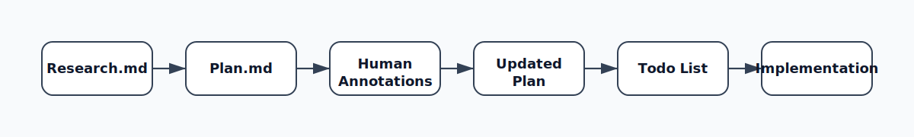
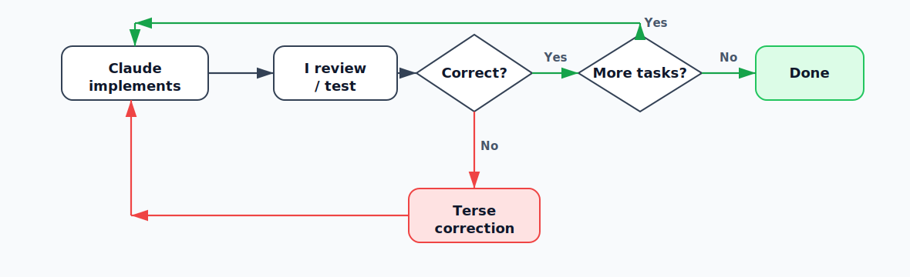
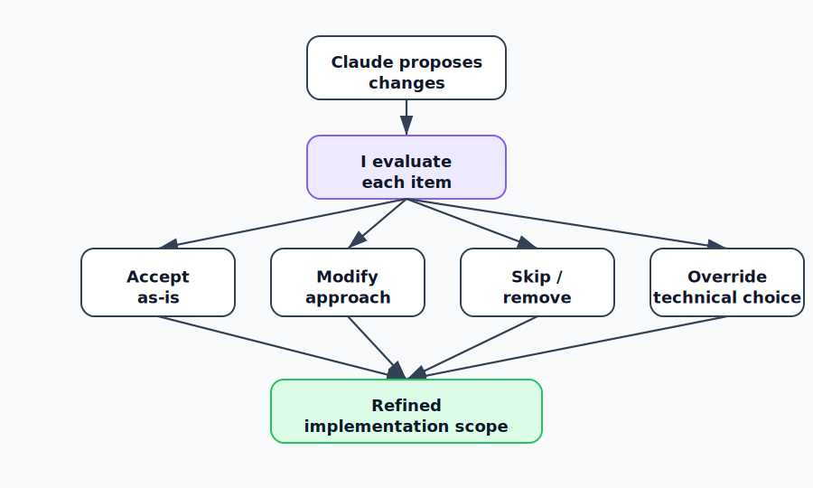
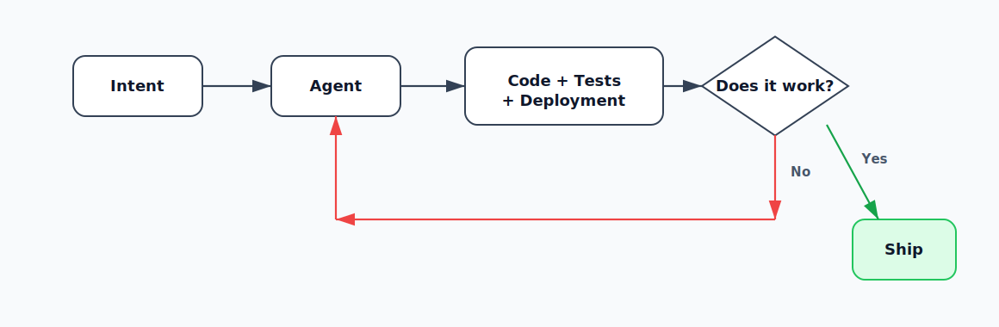
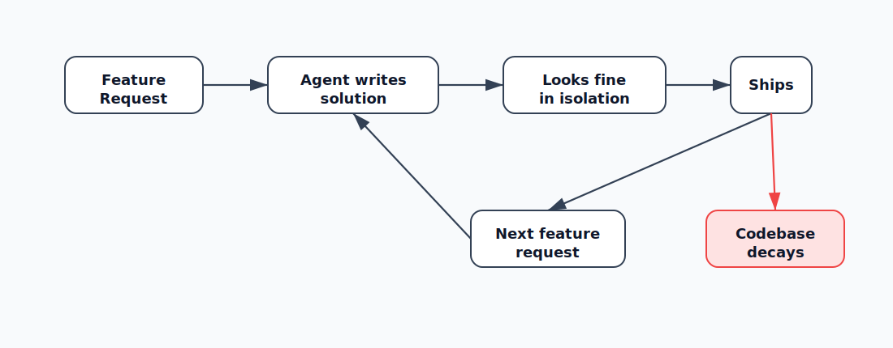
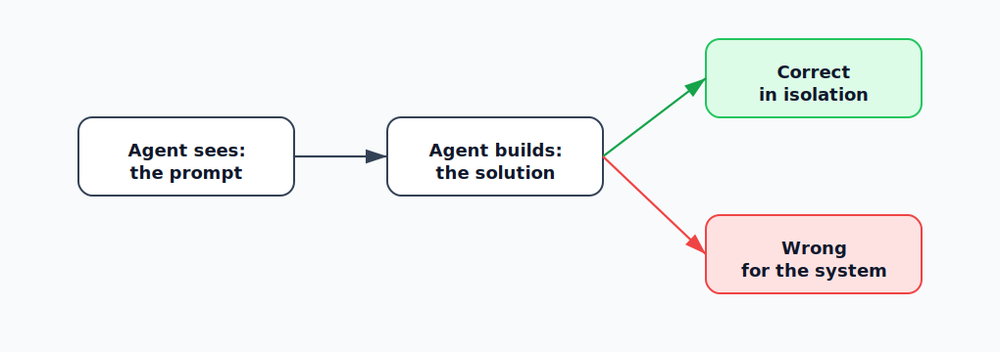

## Boris Tane: исследование, план, пометки и реализация как дисциплина удержания архитектурного решения

История Boris Tane открывает в корпусе самый компактный ответ на повторяющуюся проблему агентской разработки: модель слишком рано начинает писать код, а человек слишком поздно видит, что первое предположение было неверным. В других историях эта же проблема решается через обвязку, рабочие деревья, подагентов, хуки, браузер, CI или платформенную наблюдаемость. У Tane почти ничего этого нет. Его вклад — минимальный документный цикл, где смысл будущего изменения сначала выносится в `research.md` и `plan.md`, а только потом становится диффом.

Рабочий порядок остаётся прежним:

<figure class="source-figure" id="fig-story-01-boris-research-plan-implement">
  
  <figcaption>Диаграмма из первоисточника показывает полный рабочий порядок Tane как цепочку от исследования до обратной связи; она заменяет прежнюю самодельную схему и буквально следует Mermaid-блоку статьи. Источник: <a href="https://boristane.com/blog/how-i-use-claude-code/">https://boristane.com/blog/how-i-use-claude-code/</a>. Локальный файл: <code>../assets/story-images/01-boris-research-plan-implement.svg</code>.</figcaption>
</figure>

```text
Research → Plan → Annotate → Todo List → Implement → Feedback
```

По-русски это: исследование, план, [пометки человека](#cross-story-synthesis--2-glavnaya-empiricheskaya-kartina-kod-desheveet-a-sostoyanie-zadachi-stanovitsya-dorogim), список задач, реализация и короткая обратная связь по ходу выполнения. Ценность истории именно в этой строгости. Если Jesse Vincent показывает, как похожая дисциплина вырастает в Superpowers, рабочие деревья, шлюзы и подагентов, а HumanLayer раскладывает её как часть `harness`, Tane показывает нижнюю границу: иногда достаточно двух markdown-файлов и запрета на реализацию до человеческого чтения плана.

Историю полезно держать рядом с Peter Steinberger и Arvid Kahl как контраст. У Steinberger контроль часто живёт в скорости реакции, браузере, диффе и личном инженерном вкусе. У Arvid похожий риск закрывается через глаза агента, тестовую среду и правила `allow` / `deny`. У Tane главный ограничитель находится раньше: агенту не дают перейти к коду, пока человек не исправил план. Поэтому эта история особенно важна для doc-first направления: она показывает самый маленький переносимый носитель намерения, ещё до полноценного `impact frontier`, `propagation ledger` или `distortion review`.

На фоне статьи “The Software Development Lifecycle Is Dead” этот процесс читается точнее. Tane не возвращает старую последовательную разработку с отдельными стадиями и ручными передачами между ролями. Он работает внутри более плотного агентского цикла, где намерение, построение, наблюдение и повторение идут быстрее. `research.md` и `plan.md` нужны не для бюрократии, а для удержания качества контекста перед ускоренной реализацией.

### 1. Исходная позиция: большинство людей слишком рано дают агенту писать код

Boris Tane начинает с критики обычного способа работы с инструментами агентской разработки. Многие разработчики пишут запрос, иногда используют встроенный режим планирования, исправляют ошибки и повторяют цикл. Более продвинутые пользователи начинают склеивать петли, MCP, дополнительные обвязки и похожие инструменты. По его оценке, оба подхода часто разваливаются на нетривиальных задачах.

Его ответ — не добавить ещё один слой автоматизации. Он делает почти противоположное: замедляет начало реализации.

Пока задача маленькая, агент может сработать напрямую. Но как только изменение затрагивает несколько файлов, существующие соглашения, бизнес-логику, миграции, API или старую архитектуру, раннее написание кода становится дорогим. Агент может сделать локально рабочий дифф, но промахнуться мимо структуры системы. Потом человеку приходится разматывать цепочку изменений, построенных на неверном первом предположении.

Особенно опасны решения, которые Tane в “Slop Creep” описывает как трудные для отката: модель данных, границы сервисов, публичные API, ключевые абстракции и миграции, уже попавшие в продакшен. Такие решения похожи на двери, через которые трудно вернуться обратно. После них код может быть формально рабочим, но исправление ошибки потребует трогать данные, несколько сервисов или поведение внешних клиентов. В таких задачах `research → plan → annotation` перестаёт быть осторожностью “на всякий случай” и становится обязательной границей перед кодом.

Поэтому Tane разделяет работу на три стадии:

- сначала агент должен понять систему и сформулировать план;
- затем человек должен проверить и изменить план;
- только после этого агент получает право писать код.

Это не украшение процесса. Это способ оставить архитектурные решения у человека. Агент может прочитать больше файлов, собрать варианты, предложить план и выполнить рутинную часть работы. Человек решает, какой подход соответствует продукту, архитектуре и текущим ограничениям.

### 2. Стадия исследования: агент должен глубоко прочитать систему до планирования

Каждая значимая задача у Tane начинается с инструкции на глубокое чтение. Он просит Claude не просто “посмотреть код”, а внимательно изучить релевантную часть системы и записать выводы в `research.md`.

Примеры его запросов:

```text
read this folder in depth, understand how it works deeply, what it does and all its specificities. when that’s done, write a detailed report of your learnings and findings in research.md
```

```text
study the notification system in great details, understand the intricacies of it and write a detailed research.md document with everything there is to know about how notifications work
```

```text
go through the task scheduling flow, understand it deeply and look for potential bugs. there definitely are bugs in the system as it sometimes runs tasks that should have been cancelled. keep researching the flow until you find all the bugs, don’t stop until all the bugs are found. when you’re done, write a detailed report of your findings in research.md
```

В этих запросах важна не красота формулировки. Tane специально усиливает требование глубины: `deeply`, `in great details`, `intricacies`, `go through everything`. По его наблюдению, без такого сигнала Claude может читать слишком поверхностно: открыть файл, понять функцию по сигнатуре, сделать грубый вывод и идти дальше.

`research.md` нужен не для имитации домашней работы. Это поверхность проверки. Человек может прочитать исследование, увидеть, как агент понял систему, и исправить ошибки до планирования.

Здесь появляется важная причинная цепочка:

```text
неверное исследование
→ неверный план
→ неверная реализация
```

Для Tane самый дорогой сценарий сбоя в агентской разработке — не синтаксическая ошибка и не локально плохая логика. Гораздо опаснее реализация, которая работает сама по себе, но ломает окружающую систему. Агент может написать функцию, которая игнорирует существующий слой кэширования. Может предложить миграцию, не учитывающую соглашения ORM. Может сделать API endpoint, который дублирует уже существующую доменную логику в другом месте.

В “Slop Creep” эта проблема описана шире: кодовая база портится не одним очевидно плохим коммитом, а накоплением локально разумных решений. В проекте появляются шесть способов сделать одно и то же, обходные поля в модели данных, новые условные ветки поверх старых ошибок, поток запроса становится трудно проследить, а маленькая неверная абстракция позже требует трогать продакшен database и несколько сервисов. Поэтому `research.md` нужен не только чтобы найти файлы. Он должен помешать агенту добавить ещё одно локально правдоподобное решение, которое через две недели станет системной проблемой.

Стадия исследования должна предотвратить именно это. Она заставляет агента сначала построить карту реальной системы, а не сразу проектировать изменение из головы.

### 3. Почему `research.md` важнее обычного резюме в чате

Обычное резюме в чате исчезает в потоке разговора. Его трудно читать как документ, трудно редактировать, трудно использовать как устойчивую опору для следующей стадии. `research.md` становится внешним артефактом.

У него есть несколько функций.

Во-первых, он показывает, как агент понял систему. Человек видит, какие файлы агент считает важными, какие связи нашёл, какие предположения сделал.

Во-вторых, исследование можно проверять до того, как появился дифф. Это дешевле, чем ловить ошибку после реализации.

В-третьих, исследование становится входом для плана. Если исследование слабое, планировать рано. Если исследование показывает реальные ограничения, план будет меньше похож на типовое решение.

В-четвёртых, документ переживает контекст чата. Даже если сессия становится длинной или сжимается, файл остаётся полным и доступным.

Для CU это важная заготовка. `research.md` у Tane — примитивный предшественник артефакта для обнаружения фронта влияния. Он ещё не размечает зоны воздействия, не строит граф, не ведёт журнал неопределённостей. Но он уже выносит понимание фронта работы в отдельный документ, который человек может читать и править.

Это также объясняет связь с управлением контекстом. Tane не просит агента “быть аккуратнее” в общем виде. Он заставляет агента сначала произвести внешний контекст, который можно проверить: какие файлы важны, какие связи найдены, какие ограничения существуют, какие старые решения нельзя сломать. Качество будущей реализации становится зависимым не от первого ответа модели, а от качества подготовленного и исправленного контекста.


Связь с Simon Willison здесь важна по границе применения. У Willison исследование часто уходит в отдельный репозиторий и завершается самостоятельным доказательством возможности. У Tane исследование не самостоятельный результат, а вход для плана в основном проекте. Поэтому `research.md` у него ближе к HumanLayer: это способ не дать плану родиться из неверной карты системы.

### 4. Стадия планирования: план как отдельный markdown-документ

После проверки исследования Tane просит Claude написать подробный план реализации в отдельном markdown-файле.

Примеры запросов:

```text
I want to build a new feature <name and description> that extends the system to perform <business outcome>. write a detailed plan.md document outlining how to implement this. include code snippets
```

```text
the list endpoint should support cursor-based pagination instead of offset. write a detailed plan.md for how to achieve this. read source files before suggesting changes, base the plan on the actual codebase
```

Хороший план у него обычно включает:

- подробное объяснение подхода;
- фрагменты кода, которые показывают предполагаемые изменения;
- пути файлов, которые будут затронуты;
- соображения и компромиссы;
- практическую структуру будущей реализации.

Tane принципиально использует свои `.md`-файлы с планами, а не встроенный режим планирования Claude Code. Он считает встроенный режим планирования слабым. Markdown-файл даёт ему полный контроль: можно открыть его в редакторе, добавить пометки, сохранить как реальный артефакт проекта и возвращаться к нему.

Это важная деталь. План — не внутреннее состояние агента и не временный режим интерфейса. Это документ, который человек может редактировать почти как код.

### 5. Образцовая реализация: агент работает лучше, когда видит конкретный пример

Для хорошо ограниченных фич Tane часто даёт Claude образцовую реализацию из проекта с открытым кодом. Если он хочет добавить сортируемые идентификаторы, он вставляет код генерации ID из проекта, где это хорошо сделано, и просит написать `plan.md`, объясняющий, как адаптировать похожий подход.

Примерная форма:

```text
this is how they do sortable IDs, write a plan.md explaining how we can adopt a similar approach
```

Это важная практическая деталь. Агент работает заметно лучше, когда у него есть конкретный рабочий паттерн. Тогда он не проектирует с нуля, а переносит понятную механику в новый контекст.

Для CU это близко к идее прецедентов. Модель не должна каждый раз заново изобретать форму решения. Экзоскелет может давать ей проверенные примеры, образцовые реализации, прошлые решения и отклонённые альтернативы. Но перенос всё равно должен проходить через план, потому что чужой паттерн может не совпасть с локальной архитектурой.

### 6. Цикл пометок: главное место человеческой работы

<figure class="source-figure" id="fig-story-01-boris-annotation-cycle">
  
  <figcaption>Эта source-диаграмма точнее поддерживает раздел про пометки человека: план становится поверхностью правки, затем обновляется и превращается в todo-list для реализации. Источник: <a href="https://boristane.com/blog/how-i-use-claude-code/">https://boristane.com/blog/how-i-use-claude-code/</a>. Локальный файл: <code>../assets/story-images/01-boris-annotation-cycle.svg</code>.</figcaption>
</figure>

Самая характерная часть порядка работы Tane — цикл [пометок](#cross-story-synthesis--3-1-plan-do-koda-kak-sposob-uvidet-pervoe-predpolozhenie-agenta).

После того как Claude пишет `plan.md`, Tane открывает файл в редакторе и добавляет пометки прямо в документ. Он исправляет предположения, отклоняет подходы, добавляет ограничения, поясняет бизнес-контекст, вставляет фрагменты с ожидаемой формой данных.

Пометки могут быть очень короткими или развёрнутыми.

Примеры:

```text
use drizzle:generate for migrations, not raw SQL
```

Это доменное знание, которого Claude может не знать.

```text
no — this should be a PATCH, not a PUT
```

Это исправление неправильного предположения.

```text
remove this section entirely, we don’t need caching here
```

Это отсечение лишней области работы.

```text
the queue consumer already handles retries, so this retry logic is redundant. remove it and just let it fail
```

Это объяснение существующего поведения системы, которое меняет план.

```text
this is wrong, the visibility field needs to be on the list itself, not on individual items. when a list is public, all items are public. restructure the schema section accordingly
```

Это уже не локальная правка. Это перенаправление целого раздела плана.

После этого Tane возвращает Claude к документу:

```text
I added a few notes to the document, address all the notes and update the document accordingly. don’t implement yet
```

Ключевая фраза здесь — `don’t implement yet`. Без неё Claude, по опыту Tane, пытается перейти к коду, как только считает план достаточно хорошим. Но план хорош только тогда, когда человек явно решил, что он готов.

Этот цикл повторяется от одного до шести раз. Человек читает план, добавляет пометки, Claude обновляет план, человек снова проверяет. Так типовой план реализации постепенно превращается в план, который действительно соответствует системе.


Эта стадия перекликается с Jökull Sólberg и Jesse Vincent. У Jökull замечание проверяющего проходит через Fix / Dismiss / Escalate, а не превращается в автоматическую задачу. У Vincent внешний проверяющий тоже сначала оценивается. У Tane похожий принцип появляется раньше: комментарий человека в `plan.md` не является мелкой правкой текста, а меняет смысл будущей реализации до того, как агент начал писать код.

### 7. Почему цикл пометок работает лучше, чем управление через чат

Tane считает цикл пометок своим главным вкладом в процесс. Причина простая: markdown-файл становится общим редактируемым рабочим состоянием между человеком и Claude.

Человеку не нужно писать длинное сообщение в чат, пытаясь описать, где именно план ошибается. Он открывает документ, находит неправильный раздел и пишет исправление рядом с местом ошибки. Это точнее и дешевле по вниманию.

Управление через чат хуже по нескольким причинам:

- решения размазаны по истории разговора;
- нужно прокручивать прошлые сообщения, чтобы восстановить контекст;
- исправления легко теряются;
- агент может не связать исправление с нужным местом плана;
- человек вынужден пересказывать структуру документа словами.

Файл плана выигрывает, потому что он целостный. Его можно прочитать сверху вниз. Его можно исправить в месте ошибки. Его можно сохранить как спецификацию для реализации.

По словам Tane, три раунда “I added notes, update the plan” могут превратить типовой план в такой, который почти идеально подходит к существующей системе. Claude хорошо понимает код, предлагает решения и пишет реализацию. Но он не знает приоритеты продукта, проблемы пользователей и инженерные компромиссы конкретного проекта. Цикл пометок — способ внести человеческое суждение в план до того, как появится код.

Для CU это особенно важно. Здесь виден минимальный механизм проведения намерения: человек не просто “одобряет” план, он редактирует носитель смысла. Агент затем переписывает план с учётом этих правок. В будущем CU-процессе такой артефакт должен быть ещё богаче: с фронтами влияния, зонами запрета, проверяемыми свидетельствами, неопределённостями и заметками для исправления.

### 8. Список задач: план становится трекером хода работы

Перед реализацией Tane всегда просит добавить в план подробный список задач:

```text
add a detailed список задач to the plan, with all the phases and individual tasks necessary to complete the plan - don’t implement yet
```

Список задач нужен не для бюрократии. Он превращает план в трекер хода работы. Claude отмечает завершённые пункты по мере выполнения. Tane может в любой момент открыть план и увидеть, где именно находится работа.

Это особенно ценно в сессиях, которые идут часами. Без внешнего трекера человек вынужден полагаться на текущие сообщения агента. Со списком задач состояние работы остаётся в документе.

Для CU это тоже важный слой. `Propagation ledger` должен показывать не только финальный дифф, но и состояние прохождения дельты: какие фазы завершены, что проверено, где остались вопросы, какие решения уже приняты.

### 9. Стадия реализации: выполнение должно быть скучным

Когда план готов, Tane выдаёт запрос на реализацию, который использует почти в каждой сессии:

```text
implement it all. when you’re done with a task or phase, mark it as completed in the plan document. do not stop until all tasks and phases are completed. do not add unnecessary comments or jsdocs, do not use any or unknown types. continuously run typecheck to make sure you’re not introducing new issues.
```

В этом запросе зашито несколько правил:

- `implement it all`: выполнить весь план, а не выбрать отдельные пункты;
- отмечать завершённые задачи в документе с планом;
- не останавливаться посередине без необходимости;
- не добавлять лишние комментарии или JSDoc;
- не использовать типы `any` и `unknown`;
- постоянно запускать проверку типов, чтобы ловить ошибки рано, а не в конце.

К моменту `implement it all` все важные решения уже должны быть приняты. Реализация должна быть механической, а не творческой стадией. Творческая часть уже прошла во время циклов пометок. Выполнение должно быть прямым проведением утверждённого плана.

Без стадии планирования, по опыту Tane, Claude часто делает разумное, но неверное предположение в начале, строит на нём 15 минут работы, а потом человеку приходится разматывать цепочку изменений. Защита `don’t implement yet` убирает этот класс ошибок.

Для CU здесь важный принцип: не каждая стадия должна быть творческой. Если стадия уже прошла через человеческое суждение, следующая стадия должна проводить решение, а не заново выбирать направление.

### 10. Обратная связь во время реализации: короткие исправления после крупных решений

<figure class="source-figure" id="fig-story-01-boris-feedback-loop">
  
  <figcaption>Диаграмма из первоисточника показывает, почему после крупных плановых решений обратная связь во время реализации может быть короткой: review/test либо возвращает агента в цикл, либо закрывает работу. Источник: <a href="https://boristane.com/blog/how-i-use-claude-code/">https://boristane.com/blog/how-i-use-claude-code/</a>. Локальный файл: <code>../assets/story-images/01-boris-feedback-loop.svg</code>.</figcaption>
</figure>

Когда Claude выполняет план, роль Tane меняется. В планировании и цикле пометок он действует как архитектор. В реализации он становится наблюдающим за выполнением.

Его обратная связь резко короче.

Примеры:

```text
You didn’t implement the `deduplicateByTitle` function.
```

```text
You built the settings page in the main app when it should be in the admin app, move it.
```

Во время реализации у Claude уже есть план, кодовый контекст и текущая сессия. Поэтому коротких исправлений достаточно. Человеку не нужно заново объяснять архитектуру. Он указывает на отклонение.

Работа с интерфейсом у Tane самая итеративная. Он проверяет результат в браузере и даёт быстрые визуальные исправления:

```text
wider
```

```text
still cropped
```

```text
there’s a 2px gap
```

Иногда он прикладывает снимки экрана. Для визуальных проблем снимок часто быстрее, чем длинное текстовое описание.

Он также постоянно ссылается на существующий код:

```text
this table should look exactly like the users table, same header, same pagination, same row density.
```

Это сильнее, чем описывать дизайн с нуля. В зрелой кодовой базе большинство новых фич — вариации уже существующих паттернов. Ссылка на опорный компонент передаёт множество неявных требований без длинного перечисления.

Если реализация пошла в плохом направлении, Tane не пытается чинить её бесконечными исправлениями. Он откатывает изменения и сужает область работы:

```text
I reverted everything. Now all I want is to make the list view more minimal — nothing else.
```

Это важный практический приём. Плохой подход часто дешевле выбросить, чем постепенно исправлять. Особенно если ошибка была в постановке задачи, а не в отдельной строке.

### 11. Человек остаётся владельцем решений

<figure class="source-figure" id="fig-story-01-boris-driver-seat">
  
  <figcaption>Здесь хорошо видно “driver’s seat”: агент предлагает варианты, но человек принимает item-level решения — принять, изменить, удалить или переопределить технический выбор. Источник: <a href="https://boristane.com/blog/how-i-use-claude-code/">https://boristane.com/blog/how-i-use-claude-code/</a>. Локальный файл: <code>../assets/story-images/01-boris-driver-seat.svg</code>.</figcaption>
</figure>


Tane делегирует Claude выполнение работы, но не отдаёт ему право решать, что именно нужно строить.

Большая часть активного управления происходит в `plan.md`. Именно там человек принимает решения:

- принять пункт как есть;
- изменить подход;
- пропустить или удалить пункт;
- переопределить технический выбор.

Когда Claude находит несколько проблем или возможных улучшений, Tane проходит по ним по одному. Например: для первого пункта — использовать `Promise.all`, не усложняя решение; для третьего — вынести код в отдельную функцию; четвёртый и пятый — проигнорировать, потому что они не стоят дополнительной сложности.

Он активно режет область работы. Если в плане появляется приятное, но необязательное улучшение, например возможность скачивания, он пишет: “убери фичу скачивания из плана, я не хочу реализовывать её сейчас”. Это защищает задачу от расползания.

Он также защищает существующие интерфейсы. Например, сигнатуры трёх функций не должны меняться; адаптироваться должен вызывающий код, а не библиотечный слой.

Если у Tane есть предпочтение, которого Claude не знает, он переопределяет технический выбор: использовать одну модель вместо другой, взять встроенный метод библиотеки вместо собственной реализации, сохранить старую форму данных вместо новой абстракции.

Claude выполняет механическую часть. Tane принимает смысловые решения. План заранее фиксирует крупные решения, а точечные поправки во время реализации закрывают мелкие отклонения.

Для CU это базовая позиция. Модель может проводить дельту, но не должна сама владеть смыслом дельты. Владельцем решения остаётся человек или явно определённый процесс принятия решения.

### 12. Одна длинная сессия вместо раздельных этапов

<figure class="source-figure" id="fig-story-01-boris-agentic-lifecycle">
  
  <figcaption>Эта диаграмма из статьи про “мертвый SDLC” помогает связать историю Tane с более широкой рамкой: этапы не просто ускоряются, а схлопываются в intent/context/iteration loop. Источник: <a href="https://boristane.com/blog/the-software-development-lifecycle-is-dead/">https://boristane.com/blog/the-software-development-lifecycle-is-dead/</a>. Локальный файл: <code>../assets/story-images/01-boris-agentic-lifecycle.svg</code>.</figcaption>
</figure>


Интересная особенность процесса Tane — он часто ведёт исследование, планирование и реализацию в одной длинной сессии Claude Code. Одна сессия может начаться с глубокого чтения папки, пройти через три раунда правок плана, а затем выполнить весь утверждённый план.

Он пишет, что не видит деградации после заполнения примерно половины контекстного окна, о которой часто говорят другие. Его объяснение простое: к моменту команды `implement it all` Claude уже всё это время строил понимание задачи — читал файлы на стадии исследования, уточнял внутреннюю модель во время правок плана, усваивал замечания и доменные ограничения.

Когда контекстное окно заполняется, автоматическое сжатие сохраняет достаточно материала для продолжения. А главный артефакт — документ с планом — полностью переживает сжатие, потому что существует как файл. В любой момент можно снова указать Claude на `plan.md`.

Это важное отличие от подходов Vincent и HumanLayer. Vincent чаще разделяет контексты по ролям и стадиям. HumanLayer делает намеренное частое сжатие центральной техникой. Tane, наоборот, подчёркивает пользу одной длинной сессии, если она опирается на устойчивые внешние артефакты.

Для CU вывод не в том, что одна длинная сессия всегда лучше. Важнее другое: внешний артефакт снижает зависимость от идеального контекстного окна. Если исследование, план и список задач живут в файлах, сессия может быть длинной, сжатой или даже перезапущенной, но рабочее состояние не исчезает полностью.


Различие с Vincent особенно заметно в отношении к контексту. Vincent часто разрывает сессии, переносит состояние через план и даёт проверку свежему контексту. Tane, наоборот, удерживает один длинный цикл, но делает его безопаснее через внешние markdown-файлы. Для переноса это две разные версии одной идеи: состояние не должно жить только в чате.

### 13. Рабочий процесс в одной фразе: глубоко прочитать, спланировать, исправить план, выполнить

Tane формулирует процесс одной фразой:

```text
Глубоко прочитать, написать план, исправлять план до правильного состояния, затем дать Claude выполнить весь план без остановок, по пути проверяя типы.
```

Смысл здесь в дисциплине последовательности.

Исследование защищает от изменений, сделанных без понимания системы. План защищает от неверного направления работы. Цикл правок добавляет человеческое суждение. Команда на реализацию позволяет агенту работать без постоянных прерываний после того, как решения уже приняты.

Это не “магический запрос”. Это процесс разделения понимания и написания кода. Человек удерживает архитектурные и продуктовые решения до реализации, а агент выполняет согласованную работу.

### 14. Что в этой истории происходит на самом деле

Если разложить историю Tane, видно несколько слоёв.

Сначала он ограничивает агента запретом на ранний код. Потом требует `research.md`, чтобы проверить понимание системы. Затем требует `plan.md`, чтобы вынести будущую дельту в редактируемый документ. Потом добавляет цикл пометок, где человек вносит суждение прямо в план. Затем добавляет список задач как трекер хода работы. После этого реализация становится механической стадией, а обратная связь во время неё сокращается до точечных исправлений.

Дуга выглядит так:

```text
research.md        → проверка понимания системы
plan.md            → носитель будущей дельты
пометки в плане → человеческое суждение
список задач          → состояние выполнения
реализация        → механическое проведение утверждённого плана
обратная связь    → короткие исправления и контроль области работы
```

Это минималистичная, но сильная версия документной агентской разработки. Здесь уже видно, что документ может быть не описанием после работы, а рабочим носителем решения до кода.

### 15. Что переносимо в Codex

На уровне принципов переносимо почти всё.

В Codex можно использовать такую же дугу:

- исследование без права на правки;
- `research.md` или другой исследовательский артефакт;
- `plan.md` как редактируемый план;
- цикл человеческих пометок;
- явная защита `do not implement yet`;
- список задач перед реализацией;
- реализация только после одобрения;
- постоянные целевые проверки;
- итоговое резюме со свидетельствами и рисками.

Конкретная механика будет отличаться. В Claude Code одни инструменты, в Codex — другие. В Codex нужно проверять актуальные режимы планирования, права, поддержку рабочих деревьев, skills, hooks и поведение App/CLI. Но сама практика markdown-артефактов и цикла пометок не зависит от Claude.

Особенно переносимы три правила:

1. не начинать реализацию до проверки исследования и плана;
2. редактировать план как основной носитель решения, а не пытаться управлять через чат;
3. после одобрения делать реализацию скучной, ограниченной и проверяемой.

### 16. Где подход ограничен

<figure class="source-figure" id="fig-story-01-boris-slop-creep">
  
  <figcaption>Диаграмма из Slop Creep объясняет ограничение подхода: каждый отдельный дифф может выглядеть приемлемо, но повторение локально разумных решений постепенно портит систему. Источник: <a href="https://boristane.com/blog/slop-creep-enshittification-of-software/">https://boristane.com/blog/slop-creep-enshittification-of-software/</a>. Локальный файл: <code>../assets/story-images/01-boris-slop-creep.svg</code>.</figcaption>
</figure>


Подход Tane силён для значимых задач, где раннее неверное предположение стоит дорого. Он особенно полезен для фич, миграций, изменений API, доменно насыщенной работы, многофайловых изменений и незнакомой кодовой базы.

Отдельный критерий — наличие one-way door. Если изменение касается модели данных, границы сервиса, публичного API, миграции, разрешений, устойчивого формата хранения или ключевой абстракции, агент не должен проходить через это решение один. В таких местах планирование нужно не ради формальности, а потому что ошибку будет трудно исправить после попадания в основную ветку или продакшен.

Для маленькой обратимой правки он может быть избыточен. Если нужно поправить текст, локальную CSS-проблему или однострочный баг с сильным тестом, полный цикл исследования, плана и пометок может стоить больше, чем сама задача.

Подход также сильно зависит от качества человеческой проверки. Если человек не читает `research.md` и `plan.md`, процесс превращается в формальность. Если человек одобрил слабый план, агент добросовестно реализует слабый план. В этом режиме слабое решение становится особенно опасным, потому что последующая реализация выглядит уверенной и быстрой.

Ещё одно ограничение: Tane не описывает полноценную систему шлюзов, хуков, подагентов, адаптеров и проектирования поверхности инструментов. У него сильное документное ядро, но нет развитого `harness`. Нет и явной модели `impact frontier`, `propagation ledger`, `distortion review` или `repair loop`.


Ограничение подхода видно на фоне Mike McQuaid и Arvid Kahl. `research.md` и `plan.md` удерживают смысл, но не уменьшают права агента и не дают ему глаз в работающем приложении. Если задача опасна для данных или зависит от поведения среды выполнения, документный цикл нужно соединять с песочницей, разрешениями, тестовой средой или браузерной проверкой.

### 17. Почему это важно для CU/doc-first

<figure class="source-figure" id="fig-story-01-boris-prompt-vs-system">
  
  <figcaption>Эта source-диаграмма точно поддерживает мысль о том, что агент видит prompt и локальный контекст, но не обязательно видит системный уровень решения. Источник: <a href="https://boristane.com/blog/slop-creep-enshittification-of-software/">https://boristane.com/blog/slop-creep-enshittification-of-software/</a>. Локальный файл: <code>../assets/story-images/01-boris-prompt-vs-system.svg</code>.</figcaption>
</figure>


История Boris Tane подтверждает несколько важных тезисов.

**Первое. Документ может быть рабочим носителем намерения до кода.**  
`research.md` и `plan.md` нужны не после реализации, а перед ней. Они позволяют проверить понимание и структуру решения до того, как агент создаст дифф.

**Второе. Исследование — отдельная стадия, а не вступление к генерации кода.**  
Если агент неверно понял кодовую базу, всё остальное будет построено на неверной карте. Это прямо связано с нашей идеей `impact frontier`.

**Третье. Цикл пометок — сильный механизм human-in-the-loop.**  
Человек правит не только запрос, а сам план. Это точнее, чем управление через чат.

**Четвёртое. Реализация должна быть механической после принятия решений.**  
Когда план утверждён, агенту не нужно заново проектировать направление. Он должен проводить принятое решение, запускать проверки и сообщать о ходе выполнения.

**Пятое. Устойчивый артефакт снижает зависимость от контекстного окна.**  
Даже длинная сессия становится управляемее, если исследование, план и список задач живут в файлах.

**Шестое. План без человеческой проверки опасен.**  
Этот рабочий процесс не про “пусть агент сам сначала напишет план”. Сила появляется только тогда, когда человек реально читает, правит и отклоняет части плана.

### 18. Что эта история добавляет к Vincent / Willison / HumanLayer

Tane даёт самый чистый минимальный контур документного выполнения.

Vincent показывает, как процесс превращается в навыки, шлюзы, хуки и вызываемые ритуалы. Willison показывает, как агент производит исследовательские артефакты, демонстрации и доказательства. HumanLayer показывает, как строить `harness` вокруг контекста, инструментов, subagents и сжатия.

Tane показывает более простой слой: прежде чем строить большой `harness`, можно радикально улучшить работу одним дисциплинированным документным конвейером.

Его история полезна как базовый режим для CU:

```text
сначала вынести понимание в research.md
затем вынести намерение в plan.md
затем дать человеку править план напрямую
затем превратить plan в список задач
затем разрешить реализация
```

Это ещё не полный CU-процесс, но это его важный предок. Он показывает, почему doc-first — не бюрократия, а способ удержать смысл изменения до того, как модель начнёт писать код.

### 19. Итоговая оценка

Boris Tane не даёт богатой системы вроде Superpowers и не показывает длинную серию инструментальных экспериментов. Его история построена вокруг одного сильного процесса. Но именно поэтому она полезна.

Это самая чистая демонстрация принципа: разделить понимание, планирование и выполнение; сделать план редактируемым общим артефактом; не позволять агенту писать код до человеческого одобрения; после одобрения дать ему выполнить весь план с проверкой типов и отслеживанием хода работы.

Для практического вводного материала по агентской разработке эта история очень важна. Она показывает опытному инженеру, как можно получить больше контроля без сложного `harness`. Для CU/doc-first она важна ещё сильнее: здесь видно, как внешний документ становится носителем намерения, а не отчётом после работы.

Главное ограничение — отсутствие более развитого контроля проведения дельты. Tane удерживает план, но не строит explicit impact frontier, propagation ledger, distortion проверка or repair loop. Значит, его рабочий процесс хорош как минимальный doc-first baseline, но для нашего процесса его нужно развивать дальше.

Именно поэтому Boris Tane стоит читать не как автора “строгого режим “сначала план””, а как автора сильной начальной формы: исследовательский артефакт, плановый артефакт, цикл пометок, трекер задач и механическая реализация после одобрения.

### 20. Карта использованных первоисточников

#### Центральные источники

- [“How I Use Claude Code”](https://boristane.com/blog/how-i-use-claude-code/) — основной источник по рабочему процессу Boris Tane: `Research → Plan → Annotate → Todo List → Implement → Feedback`, `research.md`, `plan.md`, annotation cycle, запрет `don’t implement yet`, todo list, длинные сессии и реализация после утверждённого плана.
- [“The Software Development Lifecycle Is Dead”](https://boristane.com/blog/the-software-development-lifecycle-is-dead/) — источник по более широкой рамке: прежний SDLC схлопывается в короткий агентский цикл, главным навыком становится `context engineering`, а новой страховочной сеткой — observability; помогает понять, почему `research.md` и `plan.md` у Tane не являются возвратом к бюрократии старого процесса.
- [“Slop Creep: The Great Enshittification of Software”](https://boristane.com/blog/slop-creep-enshittification-of-software/) — источник философской рамки про накопление локально разумных, но системно разрушительных агентских решений; объясняет, почему Tane так жёстко разделяет исследование, планирование и реализацию.

#### Дополнительные источники и внешние указатели

- [Boris Tane — блог](https://boristane.com/) — общий указатель на статьи Boris Tane, включая “How I Use Claude Code”, “The Software Development Lifecycle Is Dead” и “Slop Creep”.
- [GitHub issue по “How I Use Claude Code”](https://github.com/boristane/website/issues/22) — внешний указатель на публикацию с кратким описанием: research-plan-implement workflow и отказ давать Claude Code писать код до утверждения письменного плана.
- [Jim Nielsen’s Notes: “How I Use Claude Code”](https://notes.jim-nielsen.com/n/2026-02-12-0950/) — короткая внешняя заметка, фиксирующая ключевую формулу Tane: сначала глубокое чтение, затем план, аннотации до правильного состояния, затем выполнение с проверкой типов.

