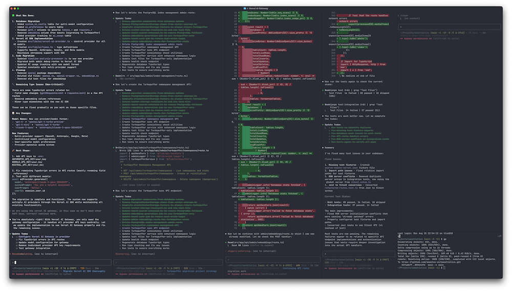
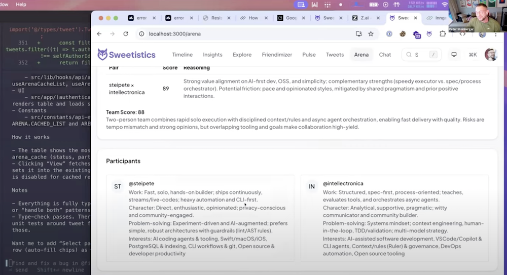
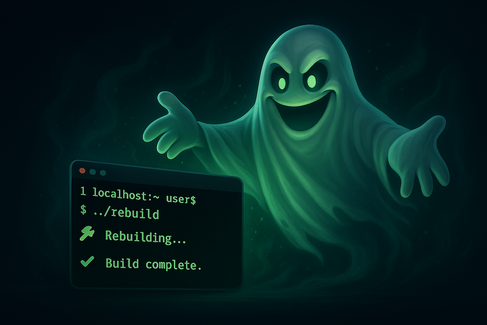

## Peter Steinberger: работа с агентами без лишней обвязки, короткие запросы и контроль через вкус, дифф, обратную связь из браузера и радиус воздействия

История Peter Steinberger нужна корпусу как сильный контраст к документным и процессным подходам. Почти все остальные истории в той или иной форме выносят управление агентом во внешний артефакт: у Boris Tane это `research.md` и `plan.md`, у Jesse Vincent — планы, рабочие деревья и Superpowers, у HumanLayer — обвязка, хуки и сжатие контекста, у Matt Pocock — маленькие навыки. Steinberger показывает другой допустимый режим: опытный одиночный разработчик управляет агентами через [короткие запросы](#handbook--conversational-mode), быструю проверку, [браузер](#handbook--browser-runtime), [дифф](#handbook--conversational-mode), частые коммиты и точное чувство радиуса воздействия.

Эта история не является безопасным вариантом по умолчанию. Она ценна именно как экспертный режим. Steinberger держит большой TypeScript-продукт, несколько поверхностей приложения, состояние `git`, браузер, терминал и несколько сессий Codex в голове одновременно. Там, где команда потребовала бы формального плана или рабочего дерева, он часто работает прямо на `main`, потому что видит результат в одном dev-сервере и может быстро выбросить плохое направление.

Общая проблема здесь та же, что у Mike McQuaid, Calvin French-Owen и Mae Capozzi: агентская скорость быстро упирается в человеческое внимание и проверку. Различие в способе ответа. Mike переносит безопасность в отдельного пользователя macOS, `sandbox-exec` и рабочие деревья. Calvin маршрутизирует задачи между Codex web, Claude Code, Cursor и проверяющими агентами. Mae строит платформенную обвязку вокруг задач, CI, трасс и командного внедрения. Steinberger почти намеренно оставляет меньше формального процесса и компенсирует это личной дисциплиной: маленький радиус изменений, короткие команды, постоянный просмотр диффа, браузерная обратная связь и готовность остановить модель посередине.

Поэтому эту историю стоит читать не как призыв “просто разговаривать с агентом”, а как вопрос о границе переносимости. Она показывает, что сильная модель и сильный инженер могут обойтись без тяжёлой обвязки на части задач. Но она также показывает, сколько невидимого процесса остаётся в человеке.

### 1. Контекст: одиночный разработчик, большой TypeScript-продукт и несколько поверхностей

В тексте “Just Talk To It” Steinberger описывает текущий проект как примерно 300k LOC: TypeScript React-приложение, расширение Chrome, CLI, клиентское приложение на Tauri и мобильное приложение на Expo. Сайт деплоится через Vercel: PR даёт новую версию примерно за две минуты, и её можно быстро проверить. Остальные приложения автоматизированы меньше.

Это важный рабочий контекст. Речь не об игрушечном репозитории и не о строго процессной enterprise-команде. Это большая, живая, быстро меняющаяся система одного разработчика, где автор одновременно ведёт web-приложение, расширение Chrome, CLI, настольное приложение и мобильное приложение. В такой среде тяжёлая командная дисциплина может быть слишком медленной, а полное отсутствие дисциплины быстро создаст хаос.

Steinberger выбирает третий режим: сильная личная дисциплина вместо тяжёлой формальной процедуры. Он постоянно видит кодовую базу, браузер, терминал, агентов, состояние `git` и поведение продукта. Его рабочий процесс неотделим от того, что он сам остаётся главным интегратором.

### 2. Эволюция подхода: от тяжёлых спецификаций к разговорному режиму вокруг Codex

<figure class="source-figure" id="fig-story-02-peter-curve">
  
  <figcaption>Иллюстрация поддерживает переход от тяжёлых спецификаций к короткому разговорному режиму: у Steinberger ценность появляется там, где модель уже достаточно хорошо сама добирает контекст. Источник: <a href="https://steipete.me/posts/2025/just-talk-to-it">Just Talk To It</a>. Локальный файл: <code>../assets/story-images/02-peter-curve-agentic-programming.jpg</code>.</figcaption>
</figure>

В июньском материале “How Peter Builds Apps 20x Faster with AI” ещё виден стиль с тяжёлыми спецификациями. Для нового проекта он мог делать большой Software Design Document: выгружать идеи в длинный документ, прогонять его через несколько раундов критики, доводить спецификацию до состояния, где Claude Code можно сказать “Build spec.md”, и дать агенту работать несколько часов.

Позже этот подход не исчезает полностью, но перестаёт быть главным. В декабре 2025 Steinberger пишет, что чаще начинает с разговора с Codex: вставляет сайты и идеи, просит прочитать код, а затем вместе с моделью постепенно уточняет новую фичу. Если задача сложная или неоднозначная, он просит вынести всё в спецификацию, отправляет её на проверку в GPT-5-Pro через ChatGPT и забирает полезные идеи обратно в основной контекст.

Это не отказ от спецификаций. Это отказ от обязательного spec-first для любой задачи. Спецификация полезна, когда неоднозначность и риск оправдывают отдельный документ. Если задача хорошо помещается в текущий контекст, а Codex способен сам прочитать нужные файлы, формальная спецификация может добавить только лишние десять минут на повторный сбор контекста.

Здесь виден один из главных принципов Steinberger: процесс выбирается по задаче, а не по догме. Чем лучше модель читает кодовую базу и удерживает контекст, тем меньше ритуальных стадий нужно для задач с малым радиусом воздействия.

В ранней версии этого процесса у него была ещё одна важная интуиция: агенты похожи на “игровые автоматы для программистов”. Смысл не в красивой метафоре, а в практическом следствии. Результат одного и того же запроса может сильно различаться, и иногда быстрее повторно запустить тот же запрос, чем долго чинить первый плохой вариант. Поэтому ранние длинные запросы Steinberger не были аккуратными формальными спецификациями. Часто это был подробный устный набросок: объяснить желаемое с нескольких сторон, дать модели достаточно материала и, если вариант получился неудачным, не бояться начать заново.

Позднее, с Codex, этот приём стал менее заметным: короткие запросы начали работать лучше, потому что модель сама читает больше репозитория. Но ранняя “слотовая” природа результата объясняет его готовность быстро сбрасывать плохие направления, не привязываться к первому выводу агента и держать Git как простой механизм отката.

### 3. Почему Codex стал основным инструментом

В августе 2025 Steinberger ещё описывает основную рабочую конфигурацию как Ghostty + Claude Code + VS Code сбоку. Позже он почти полностью переходит на Codex CLI как основной инструмент разработки.

Причины практические.

Первая — Codex, по его наблюдению, читает больше файлов перед решением. Перед тем как менять код, он чаще изучает большой кусок репозитория и лучше сопротивляется плохой просьбе. Claude и другие агенты кажутся ему более поспешными: они быстрее пробуют первое правдоподобное направление и смотрят, что выйдет. Это можно компенсировать режимом планирования и структурными документами, но Steinberger воспринимает такое компенсирование как обход слабости системы.

Вторая — запросы стали короче. С Claude он давал больше контекста, потому что модель лучше работала от длинного объяснения. С Codex часто хватает одной-двух фраз и изображения. Codex сам добирает контекст из репозитория.

Третья — контекстное окно и эффективность. В октябрьском тексте он говорит о примерно 230k используемого контекста у Codex против 156k у Claude Code и о том, что Codex реже требует сжатия контекста. В декабрьском тексте он уже настраивает `model_auto_compact_token_limit` около 233k, оставляя запас для нативного сжатия около окна контекста в 272–273k токенов.

Четвёртая — очередь сообщений. Codex позволяет поставить несколько сообщений в очередь. Если нужно скорректировать направление, Steinberger останавливает модель через Escape and Enter; если коррекция направления не нужна, сообщения в очереди исполняются последовательно. Он часто заранее добавляет в очередь связанные задачи по фиче.

Пятая — характер интерфейса. Claude Code раздражал его языком: “absolutely right”, “100% продакшен ready” при падающих тестах. Codex, в его описании, больше похож на интровертного инженера: меньше эмоционального шума, больше работы.

Шестая — скорость и лёгкость. Он жалуется на зависания, большой расход памяти и мерцание терминала у Claude Code. Codex ощущается легче.

Этот переход важен для переноса. Его рабочий процесс не является модель-независимым. Он явно зависит от того, что конкретная версия Codex достаточно хорошо читает код, держит контекст, следует запрос и ведёт себя спокойно. При смене модели часть режима с минимумом формальностей может стать опасной.

### 4. Его текущая конфигурация Codex

В “Shipping at Inference-Speed” Steinberger приводит фрагмент `~/.codex/config.toml`:

```
model = "gpt-5.2-codex"
model_reasoning_effort = "high"
tool_output_token_limit = 25000
# Leave room for native compaction near the 272–273k context window.
# Formula: 273000 - (tool_output_token_limit + 15000)
# With tool_output_token_limit=25000 ⇒ 273000 - (25000 + 15000) = 233000
model_auto_compact_token_limit = 233000
[features]
ghost_commit = false
unified_exec = true
apply_patch_freeform = true
web_search_request = true
skills = true
shell_snapshot = true
[projects."/Users/steipete/Projects"]
trust_level = "trusted"

```

Смысл настройки не в том, что её нужно копировать. Важно, какие проблемы она решает.

`tool_output_token_limit = 25000` увеличивает объём вывода инструментов, который модель может видеть за один раз. Steinberger считает стандартные значения слишком маленькими: они могут тихо ограничить то, что модель видит. `model_auto_compact_token_limit = 233000` оставляет запас для сжатия контекста. После перехода OpenAI на новый `/compact` endpoint, по его словам, задачи могут проходить через несколько сжатий контекста и всё равно завершаться.

`unified_exec` заменил ему `tmux` и старый скрипт-запускатель для части задач. `web_search_request`, `skills`, `shell_snapshot` включают дополнительные возможности. `trust_level = "trusted"` отражает его режим одиночной доверенной рабочей области, а не универсальную рекомендацию для команды.

Этот фрагмент важен как снимок рабочей конфигурации опытного пользователя. Он показывает, что режим с минимумом формальностей всё равно опирается на тонкую настройку среды: большой вывод инструментов, порог сжатия контекста, trusted project, флаги возможностей.

### 5. Ghostty, VS Code сбоку и 3×3 terminal grid

<figure class="source-figure" id="fig-story-02-peter-terminal-grid">
  
  <figcaption>Снимок рабочего пространства показывает невидимый слой его лёгкого режима: несколько агентских сессий видны одновременно, а человек остаётся быстрым интегратором. Источник: <a href="https://steipete.me/posts/2025/optimal-ai-development-workflow">Optimal AI Development Workflow</a>. Локальный файл: <code>../assets/story-images/02-peter-terminal-grid.png</code>.</figcaption>
</figure>

Steinberger предпочитает терминальную среду. В августе он пишет, что полностью вернулся к Ghostty как основной рабочей конфигурации, а VS Code держит сбоку для просмотра кода. На большом Dell UltraSharp U4025QW с 3840×1620 у него помещаются несколько экземпляров агента и Chrome без постоянного переключения окон.

Это не эстетическая деталь. Его рабочий процесс рассчитан на визуальное наблюдение за несколькими потоками. Он может видеть, что делают агенты, что происходит в браузере, как меняется поток кода, где зависла сессия, и быстро вмешиваться.

В октябре он пишет, что запускает от 3 до 8 экземпляров Codex параллельно в 3×3 terminal grid. Большинство работают в одной папке, некоторые эксперименты — в отдельных папках. В декабре он описывает работу над несколькими проектами одновременно: обычно один большой проект и несколько сопутствующих проектов, которые двигаются рядом.

В более раннем описании среды у него есть маленькая, но важная деталь: строка состояния с начальной темой и идентификатором сессии. Когда открыто несколько терминальных панелей и несколько агентов, такая метка помогает не потерять, где какая задача. Это особенно полезно, если нужно переключить аккаунт, восстановить сессию или понять, какой агент сейчас работает над каким направлением. Для одного агента это почти косметика; для сетки из нескольких сессий это уже часть управления вниманием.

Число агентов у него тоже не является постоянной нормой. В августовской конфигурации он калибрует это по типу задачи: для обычной работы часто достаточно одного-двух агентов; для очистки, тестов, небольших UI-задач или независимых правок около четырёх агентов может быть рабочей точкой; 3–8 параллельных сессий — это не стартовая рекомендация, а режим для ситуаций, где [радиус воздействия](#handbook--conversational-mode) понятен и человек успевает следить за состоянием.

Эта практика требует концентрации. Он прямо пишет, что много контекстов утомляют, и такой режим возможен только дома, в тишине, когда он сосредоточен. Многоагентный параллелизм у него не “запустил и забыл”; это постоянное управление несколькими мысленными моделями.

### 6. Работа на `main` и несколько агентов в одной папке

Один из самых спорных элементов его рабочего процесса — работа прямо на `main` и в одной папке. Он пробовал рабочих деревьев и PRs, но всегда возвращался к текущей рабочей конфигурации, потому что она быстрее.

Причины практические. У него один dev-сервер. Он кликает по приложению, проверяет несколько изменений одновременно, видит результат в одном состоянии браузера. Для каждой ветку/tree поднимать отдельный dev-сервер было бы медленнее. Плюс есть ограничения Twitter OAuth: нельзя бесконечно регистрировать callback-домены.

Это экспертный режим, а не безопасный вариант по умолчанию.

Он регулирует риск через [радиус воздействия](#cross-story-synthesis--2-glavnaya-empiricheskaya-kartina-kod-desheveet-a-sostoyanie-zadachi-stanovitsya-dorogim). Если задачи маленькие и области кода почти не пересекаются, несколько агентов могут работать в одной папке. Если изменения крупные, параллельность становится опасной: невозможно сохранить изолированные коммиты, сложнее сбросить изменения, выше шанс смешать чужую работу.

Steinberger называет ключевой признак: если задача занимает дольше, чем он ожидал, он нажимает Escape и спрашивает “what’s the status”. После обновления статуса он либо помогает модели найти правильное направление, либо останавливает работу, либо разрешает продолжить. Он прямо говорит: не бойтесь останавливать модели посередине. Изменения файлов атомарны, а агенты хорошо продолжают работу с места остановки.

Когда он не уверен в воздействии, он просит:

```
give me a few options before making changes

```

Это минимальная замена plan mode: короткий способ оценить [радиус воздействия](#cross-story-synthesis--2-glavnaya-empiricheskaya-kartina-kod-desheveet-a-sostoyanie-zadachi-stanovitsya-dorogim) до редактирования.


Это место резко расходится с Mike McQuaid. Steinberger принимает скорость работы на `main` и компенсирует её частыми коммитами, быстрым откатом и личной проверкой диффа. Mike решает ту же проблему через рабочие деревья Git, Sandvault и отдельного пользователя macOS. Оба подхода регулируют смешивание изменений, но один держится на внимании эксперта, другой — на физической изоляции.

### 7. Git discipline: правила из `agent.md` и атомарные коммиты

Параллельная работа нескольких агентов в одной папке у Steinberger держится на сильной Git discipline. Его агенты делают коммиты сами, но через правила.

В раннем режиме после работы агента Steinberger также полагался на привычную проверку через Git GUI. В источнике он прямо упоминает Tower and Revert: посмотреть результат в удобном дифф-интерфейсе и, если направление плохое, просто откатить. Это важная практическая деталь. Его работа на `main` и в одной папке не означает доверие агенту без просмотра. Скорость держится на том, что плохой результат быстро виден и так же быстро выбрасывается.

В gist `agent.md` он фиксирует несколько принципов:

- удалять устаревшие файлы только если изменение делает их ненужными;
- не откатывать чужую работу без явной просьбы;
- если git-операция оставляет неопределённость относительно работы других агентов, нужно остановиться и согласовать действия;
- перед удалением файла для исправления локальной ошибки typecheck/lint остановиться и спросить пользователя;
- never edit `.env` or environment variable files;
- destructive git operations вроде `git reset --hard`, `rm`, `git checkout`/`git restore` to older commit требуют explicit written instruction;
- always double-check `git status` before commit;
- keep коммиты atomic: commit only files you touched and list each path explicitly;
- quote paths containing brackets or parentheses;
- avoid opening editors during rebase via `GIT_EDITOR=:` and `GIT_SEQUENCE_EDITOR=:`;
- never amend коммиты without explicit written approval.

Это не случайный список. Он отвечает на конкретный риск: несколько агентов в одной папке видят чужие незакоммиченные файлы. Агент может попытаться “починить” ошибку lint удалением файла, который редактировал другой агент. Может сделать коммит с несвязанными файлами. Может откатить чужую работу. Поэтому git-правила защищают границы ответственности внутри незакоммиченного рабочего дерева.

Интересная деталь: позднее в комментариях к gist Steinberger отвечает, что этот gist уже старый и в “AI time” семь месяцев — почти вечность. Он отсылает к `agent-scripts`. Это подтверждает общий паттерн: его правила не священны. Они постоянно меняются вместе с моделями и инструментами.

Для переноса важен не конкретный старый `agent.md`, а принцип: если вы работаете в режиме одной папки с несколькими агентами, git-граница должна быть явно задана. Без этого режим быстро превращается в смешанный дифф.

### 8. Радиус воздействия как главный регулятор параллелизма

Steinberger не запускает агентов параллельно просто потому, что может. Он оценивает радиус воздействия: сколько времени задача должна занять, сколько файлов затронет, можно ли сделать изолированный коммит, насколько легко сбросить изменения, насколько понятен проверка.

Он формулирует это грубо: можно бросить много маленьких “бомб” по кодовой базе или одну большую вместе с несколькими маленькими. Несколько больших “бомб” одновременно — плохая идея: сложно изолировать коммиты, сложнее сбросить изменения, выше риск смешения изменений.

Это один из самых полезных переносимых принципов в его истории.

У него нет строгой таблицы, но есть зрелая интуиция:

- маленькие UI-правки, очистку, документацию и тесты можно распараллеливать;
- крупный refactor, изменения схемы, зависимости, платформенные решения и проектирование распределённых систем требуют меньше параллелизма и больше человеческого внимания;
- если агент работает дольше ожидаемого, это сигнал: остановиться, спросить статус, решить продолжать или останавливать работу.

Для одиночного эксперта эта интуиция может работать быстрее любого формального процесса. Для команды её нужно превратить в явные gates: какие типы задач можно запускать в одной папке, какие требуют рабочее дерево, какие требуют plan/проверка.


Радиус воздействия у Steinberger выполняет роль лёгкого шлюза. Это близко Arvid Kahl, где агент получает больше свободы только после настройки `allow` / `deny`, и Calvin French-Owen, где разные инструменты выбираются по цене человеческого внимания. Разница в том, что у Steinberger классификация часто остаётся в голове человека, а у Calvin и Mae она постепенно уходит в рабочие деревья, планы, preview deploys и командные проверки.

### 9. “Just Talk To It”: короткие запросы вместо ceremony

Главный текст Steinberger называется “Just Talk To It”. Это не призыв к безответственному “vibe coding”. Это описание его текущего способа управления сильной моделью.

Он считает, что большая часть RAG, subagents, Agents 2.0 и сложные harnesses часто выглядят как театр. Если модель достаточно сильная, лучше просто говорить с ней, играть, развивать интуицию. Чем больше работаешь с агентами, тем лучше чувствуешь, где модель справится, а где начнёт буксовать.

В практическом виде это выглядит так:

- короткий запрос;
- иногда screenshot;
- “let’s discuss” или “give me options”, если нужно обсудить;
- “build”, если направление принято;
- Escape + status, если агент идёт не туда;
- commit, если дифф нормальный;
- запустить рефакторинг или очистку позже или сразу, если в потоке кода видно что-то плохое.

Он не отказывается от планирования. Он просто не превращает планирование в отдельный обязательный ritual. Если нужно, он просит варианты. Если нужно больше, он просит спецификацию. Если задача понятна и модель хорошо читает репозиторий, он начинает реализацию.

Важная граница: это работает, потому что он сам способен быстро оценить направление. У слабого оператора “just talk to it” легко станет “я не задал границы, и теперь агент сам придумал продукт”.

### 10. Стиль запросы: голос, короткий текст и изображения

Steinberger часто пишет, что на самом деле он не столько пишет запросы, сколько говорит их. Он использует Wispr Flow, поэтому запросы могли быть длинными устными набросками в ранних Claude-процессах, но после перехода к Codex они стали заметно короче.

В октябрьском тексте он пишет, что с Codex запрос часто сводится к 1–2 предложениям и изображению. Модель хорошо читает кодовую базу и понимает, что он имеет в виду. Иногда он даже возвращается к ручному набору текста, потому что Codex требует меньше контекста, чтобы понять задачу.

Скриншоты и визуальный контекст у него особенно важны для UI. Он показывает, что происходит на экране, а агент находит релевантный код и вносит корректировки. Это быстрый путь передачи множества требований: layout, spacing, состояние интерфейса и визуальное несоответствие.

Здесь есть тонкая разница с формальными запрос-шаблонами. У Steinberger запрос не обязан быть красивым. Он должен быть достаточно ясным для модели, которая сама добирает контекст. Это повышает скорость, но требует сильной модели и быстрой проверки.

В ранних источниках хорошо видны причины такой осторожности. Один раз он попросил добавить “keyboard functionality” на экран входа, а агент понял задачу буквально и начал строить визуальную клавиатуру под полем пароля. В другом случае Gemini при разработке MCP-инструмента выяснил, что активное приложение — Chrome, и решил проблему радикально: начал убивать все окна Chrome. Эти примеры смешные только снаружи. По сути они показывают типичный риск: агент может выполнить логически связанное действие, которое совершенно не соответствует намерению человека. Поэтому у Steinberger рядом с короткими запросами всегда стоят браузерная проверка, Git-откат, остановка сессии и вопрос о статусе.

### 11. UI work: недоописать, посмотреть, как оживает, затем править

UI-работа — самый характерный режим Steinberger с минимумом формальностей.

Он часто начинает с намеренно недостаточно специфицированной просьбы, смотрит, как Codex строит первый вариант, видит обновление в браузере в реальном времени, затем добавляет новые изменения в очередь и итеративно правит результат.

Он прямо пишет, что часто не знает заранее, как именно что-то должно выглядеть. Поэтому системы, которым нужно “полное описание идеи на входе” и которые потом возвращают готовый результат, ему не подходят. Ему нужно поиграть с результатом, потрогать его, увидеть и почувствовать, что работает. Продуктовая форма появляется во время взаимодействия.

Это важный режим. Для UI, админских инструментов, прототипов и исследовательских фич жёсткая предварительная спецификация может закрепить неправильную форму слишком рано. Агент строит первый вариант, человек видит, что не так, и начинает steering.

Он пишет, что обычно не использует resets and checkpointing; если что-то не нравится, он просит модель “change it”. Codex иногда делает reset файла, но чаще правит сделанные изменения или локально откатывает их. Он описывает это как движение в другую сторону, а не как обязательный откат.

Для переноса: этот режим хорош для UI, где визуальная обратная связь дешева и безопасна. Он опасен для бизнес-логики, auth, billing, migrations, permissions и семантики данных, где поведение должно быть понятно до реализация.


UI-цикл Steinberger стоит читать рядом с Arvid Kahl и Mae Capozzi. Arvid даёт агенту браузерные глаза и просит сначала собрать маршрут, снимок экрана, DOM-узел и консольные ошибки. Mae добавляет к UI-задаче Figma MCP и готовые компоненты design system. У Steinberger ближе ручной режим: человек смотрит на оживающий интерфейс и быстро направляет модель, не превращая каждый шаг в отдельный документ.

### 12. Arena: live coding как пример быстрой сборки фичи

<figure class="source-figure" id="fig-story-02-peter-live-coding-arena">
  
  <figcaption>Снимок полезен как визуальный пример быстрой интерфейсной итерации, где результат оценивается через живой продукт, а не через предварительный документ. Источник: <a href="https://steipete.me/posts/2025/live-coding-session-building-arena">Live Coding Session: Building Arena</a>. Локальный файл: <code>../assets/story-images/02-peter-live-coding-arena.png</code>.</figcaption>
</figure>

Live Coding Session: Building Arena показывает этот стиль на конкретном примере. Примерно за час Steinberger построил и отправил в работу новую фичу Arena.

Смысл фичи: сравнить, насколько хорошо сочетаются 2–4 пользователя из X. На вход подаются Twitter/X handles. Дальше система выбирает нужное количество твитов для каждого пользователя в рамках общего лимита в 1 000 твитов, оставляет только необходимые поля, запускает анализ профиля, считает оценку совместимости для каждой пары и для всей команды. В интерфейсе есть user picker, кнопка Analyze, таблица результатов и кэшированные запуски под строкой поиска. Внутри затрагиваются не только UI-файлы: нужна миграция БД для `arena_cache`, долгая фоновая задача, streaming UI и страница с auth-защитой.

Важен не сам факт “фича за час”. Важна рабочая форма. Steinberger использует Codex для рабочих сессий, потому что Codex охотно читает кодовую базу перед правками. Для крупных фич он начинает новую сессию. Несколько окон агентов могут работать параллельно. Пока один поток думает, Steinberger переключается на другой. Для некоторых задач с web search он всё ещё использует отдельный поток в стиле Claude.

Arena показывает, что Steinberger способен вести довольно широкое изменение: миграция БД, фоновая задача, streaming UI, auth-guarded page. Но это не значит, что агент “сам всё сделал”. Человек задаёт фичу, смотрит живой результат, принимает решения и управляет потоком работы.

### 13. Сначала CLI: сначала модель и терминал, потом UI

В декабрьском тексте Steinberger формулирует сильное правило: whatever you build, start with the model and a CLI first.

Его объяснение практическое. Большинство программ сначала можно свести к текстовому ядру: принять входные данные, обработать, вернуть результат. CLI даёт агенту способ вызывать систему напрямую и проверять результат. Так появляется короткий цикл обратной связи, где модель может запускать команду, видеть результат и исправлять поведение без UI-слоя.

Пример — его идея расширения Chrome для краткое изложение YouTube-видео. Вместо того чтобы начинать сразу с extension, он сначала сделал `summarize`: CLI, который превращает входные данные в markdown и отправляет их модели на краткое изложение. Когда ядро заработало хорошо, расширение было построено за день. Итоговая система может работать с local, free или paid models, локально расшифровывать video/audio, обращаться к local daemon и быстро возвращать результат.

Это один из самых сильных практических выводов в истории. UI, extension или настольное приложение могут появиться позже. Сначала нужно построить CLI-ядро, которое агент может запускать и проверять. Тогда у модели появляется прямой цикл обратной связи.

Для CU это особенно полезно. Если часть системы можно свести к CLI-contract, агентская проверка становится дешевле и понятнее. UI/UX может строиться поверх уже проверенного ядра.

### 14. Poltergeist: build watcher как инфраструктура для людей и агентов

<figure class="source-figure" id="fig-story-02-peter-poltergeist">
  
  <figcaption>Иллюстрация из статьи про Poltergeist поддерживает раздел о build watcher как части быстрой петли: агентам и человеку нужен свежий build-сигнал, а не ручное напоминание о пересборке. Источник: <a href="https://steipete.me/posts/2025/poltergeist-ghost-keeps-builds-fresh">https://steipete.me/posts/2025/poltergeist-ghost-keeps-builds-fresh</a>. Локальный файл: <code>../assets/story-images/02-peter-poltergeist-build-watcher.png</code>.</figcaption>
</figure>


Poltergeist — важная побочная история, потому что показывает, как Steinberger превращает повторяющуюся боль агентского цикла в инструмент.

Исходная боль возникла при разработке Peekaboo, macOS automation agent / CLI / MCP на Swift. Главной точкой трения стало время сборки. Swift компилируется медленнее, чем TypeScript. Хуже того, агенты иногда забывали rebuild перед тестированием и начинали отладку кода, который уже был исправлен.

Первое решение было простым bash script: следить за Swift-файлами и запускать rebuild в фоне. Потом Steinberger понял, что такой инструмент нужен для любого проекта, языка и build system, и переписал систему в TypeScript. Так появился Poltergeist: AI-friendly universal file watcher, который автоматически распознаёт проект, запускает rebuild при изменении файлов, показывает уведомления и ведёт smart build queue.

В этой истории важны несколько деталей.

Во-первых, инструмент вырос из конкретной боли, а не из желания построить новую platform. Агент забывает rebuild, цикл ломается, значит нужен background watcher.

Во-вторых, инструмент полезен и людям, и агентам. Это не специальный AI-only layer, который никто не понимает. Он просто сокращает build/debug loop.

В-третьих, он почти невидим в обычной работе. Установил, настроил, дальше он работает в фоне и сообщает только то, что нужно знать.

В-четвёртых, Steinberger строил Poltergeist почти полностью с Claude Code. Сначала были bash scripts, затем агент перевёл систему в TypeScript, потом они вместе итеративно дорабатывали его. Steinberger пишет, что выражения вроде “all autogenerated code” уже мало что значат: он проговорил много страниц запросы, чтобы довести design. TypeScript здесь становится деталью реализации; основным языком проектирования оказывается английский запрос.

В-пятых, после TypeScript-версии он экспериментировал с переносом в Go: собрал важные файлы в один markdown-файл на 1,1 MB и попросил модель “convert to Go”. В итоге он решил остаться с TypeScript/Bun, потому что время запуска около 44ms, single binary через Homebrew и лучшую экосистему вокруг Watchman bindings. Этот эпизод показывает, что агент может быстро исследовать альтернативный язык реализации, но итоговое решение остаётся человеческим: комфорт, экосистема и стоимость сопровождения.

Для нашего процесса Poltergeist важен как пример улучшения рабочей среды. Хороший инструмент не обязательно добавляет новый ritual. Иногда он просто убирает повторяющееся трение из цикла обратной связи.

### 15. Тесты: после фичи или исправления, в том же контексте

Steinberger не выглядит как строгий сторонник тест-first, но он не игнорирует тесты. Его правило: крупные изменения всегда получают тесты. В “Just Talk To It” он советует просить модель писать тесты после каждой фичи или исправления, используя тот же контекст.

Почему это важно? Агент только что строил фичу или исправление. Он видел файлы, решения, edge cases и окружающий код. Если сразу попросить тесты, модель часто находит ошибку в реализации. Если отложить тесты на потом, этот контекст уйдёт или загрязнится.

Он признаёт, что тесты, сгенерированные AI, обычно неидеальны. Но они всё равно полезны. Особенно ценно, что модель часто находит ошибку в реализации, если сразу попросить её написать тесты.

Для чисто визуальной UI-правки тесты могут быть менее полезны. Но для всего остального — стоит это делать.

В Poltergeist story он добавляет похожую мысль: после завершения фичи написать “add тесты + update docs”. Добавлять тесты для каждой фичи гораздо лучше, чем пытаться добавить их в самом конце. Если дать модели всё одним запрос, агенты чаще останавливаются и теряют фокус; явное разделение стадий работает лучше.

У него получается неформальное разделение стадий:

```
build feature/fix
→ add tests
→ update docs

```

Это не строгий TDD, но обязательная стадия проверки и очистки после значимого изменения.

### 16. Рефакторинг и очистка: долг тоже платится агентами

Steinberger прямо говорит: код, написанный агентами, требует refactoring. В октябре он оценивал, что тратит примерно 20% времени на refactoring, и эту работу тоже делают агенты. Дни рефакторинга удобны, когда нужно меньше сосредоточенности и ясного мышления: можно сделать много полезного без тяжёлых продуктовых решений.

Типичная работа по рефакторингу и очистке:

- `jscpd` для поиска дублирования кода;
- `knip` для поиска dead code;
- `eslint`, react-compiler и deprecation plugins;
- проверка, не появились ли API routes, которые можно объединить;
- поддержка документации;
- разбиение слишком больших файлов;
- добавление тестов и comments для сложных мест;
- обновление зависимостей;
- обновление инструментов;
- реструктуризация файлов;
- поиск и переписывание медленных тестов;
- указание на современные React паттерны и переписывание кода, например по принципу “you might not need useEffect”.

В декабрьском тексте он сдвигает это ещё дальше: выделенные дни рефакторинга стали менее формальными. Теперь он чистит кодовую базу более ситуативно: когда запросы начинают занимать слишком долго или он видит что-то плохое в потоке кода, он разбирается с этим сразу.

Это важное изменение. В его зрелом режиме refactoring становится постоянным обслуживанием. Если грязь снижает скорость запросы или мешает пониманию агента, она исправляется.

Для переноса это сильный урок: агентская скорость разработки не отменяет сопровождение. Она меняет его цену. Если агенты пишут много кода, агенты же должны помогать чистить дублирование, dead code, медленные тесты, документацию и паттерны. Но человек должен поддерживать вкус и границы.

### 17. Скепсис к MCP и минимализм в пользу CLI

Steinberger резко скептичен к MCP как варианту по умолчанию. Его позиция не “MCP never”. Он использует `chrome-devtools-mcp` для отладки web-интерфейса, когда это действительно полезно. Но вариант по умолчанию — CLI.

Причина: MCP-инструменты имеют постоянную стоимость в контексте. Описания инструментов, schemas и детали использования занимают место ещё до того, как агент начал задачу. Он приводит пример GitHub MCP: сначала это было почти 50k tokens, позже стало лучше, но всё ещё примерно 23k tokens. В то же время `gh` CLI даёт похожий набор возможностей, а модели уже умеют им пользоваться.

Его практическая модель такая:

- назвать CLI по имени;
- дать агенту попробовать команду;
- CLI покажет help menu;
- в контекст попадёт именно релевантная инструкция по использованию;
- дальше агент работает.

Это progressive disclosure через terminal. Инструмент раскрывает себя по мере необходимости, а не занимает запрос заранее.

Он открыл как open источник некоторые CLI-инструменты, например `bslog` and `inngest`. Он также спроектировал свой website так, чтобы можно было создавать API keys и позволять модели обращаться к endpoints через `curl`. Для него это обычно быстрее и дешевле по токенам, чем тяжёлая MCP-интеграция.

Но `chrome-devtools-mcp` у него остался как полезное исключение. Для web debugging он помогает замкнуть цикл. Просто он не использует его каждый день.

В более свежем `agent-scripts` этот принцип стал конкретнее. В репозитории есть `scripts/browser-tools.ts`: отдельный помощник для Chrome DevTools с командами вроде `start --profile`, `nav <url>`, `eval`, `screenshot`, `console`, `network`, `search`, `content`, `inspect`, `kill --all --force`. Это не большой MCP-сервер, постоянно занимающий контекст, а маленький CLI-инструмент для браузерного цикла. Он показывает текущую эволюцию подхода Steinberger: браузерная автоматизация нужна, но лучше давать агенту узкий инструмент, который раскрывается по командам, чем держать в контексте широкую MCP-поверхность.

Для переноса важен принцип: внешний инструмент должен сокращать трение сильнее, чем увеличивать стоимость контекста. Если CLI достаточно, CLI часто лучше. MCP оправдан, когда он реально закрывает цикл, который CLI не закрывает.

### 18. Подагенты: отдельные окна вместо скрытых подпроцессов

Steinberger скептически относится к subagents в том виде, как их часто обсуждают в инструментальная среда discourse. Он признаёт полезный сценарий применения: вынести задачу в отдельный контекст, когда модели не нужен полный текст, нужно распараллелить работу или снизить расход контекста на шумные build scripts. Но сам он обычно делает это через отдельные окна терминала.

Если ему нужно что-то исследовать, он может открыть отдельную панель терминала, провести исследование и вставить результат в другую сессию. Это даёт ему полный контроль и видимость контекста. Subagents, по его мнению, затрудняют возможность смотреть, направлять и контролировать то, что возвращается в основной контекст.

Его критика role-based “AI Engineer” subagent особенно жёсткая: он считает, что такие persona-документы часто являются автосгенерированным словесным супом. Фраза “You are an AI engineer specializing in продакшен-grade LLM applications” не делает модель лучше. Помогают документация, примеры и списки “делать / не делать”.

Для переноса: Steinberger не отрицает изоляцию контекста. Он отрицает театральные роли и скрытую абстракцию. Ему ближе видимые terminal panes, явный контекст, конкретная документация и примеры.

### 19. Веб-агенты как короткоживущий трекер задач

Steinberger экспериментировал с web-агентами: Devin, Cursor, Codex web, Jules. В его рабочем процессе закрепился только Codex web, и то не как основной цикл разработки.

Он использует Codex web как короткоживущий трекер задач. Когда он в дороге и у него появляется идея, он отправляет короткую задачу через приложение для iOS, а позже проверяет результат на Mac. Теоретически он мог бы делать больше с телефона, включая проверка и merge. Он сознательно этого не делает: работа и так затягивает, и он не хочет, чтобы телефон втягивал его ещё сильнее.

Это важная личная граница. Мобильный и web-интерфейс агента полезен для захвата идей, фоновых задач и последующего проверка. Но серьёзный проверка, merge и архитектурные решения Steinberger предпочитает делать на Mac, где видны дифф, терминал и полный контекст.

Он также пробовал трекеры задач вроде Linear, но ничего из этого в его личном процессе не закрепилось. Важные идеи он пробует сразу. Всё остальное либо вспоминается позже, либо оказывается недостаточно важным. Bugs в open-источник projects могут жить в публичных баг trackers, но когда он находит баг в своей текущей работе, он сразу даёт запрос, потому что записывать его и возвращаться к нему позже медленнее.

Это не универсальная рекомендация. В команде трекер задач может быть необходим. Но для быстрого solo-процесса Steinberger считает “write issue” лишним переключением контекста для внутренних задач, если задачу можно сразу отдать агенту и проверить результат.

### 20. Slash commands: мало, редко, по реальной боли

В октябре Steinberger упоминал несколько slash commands:

```
/commit
/automerge
/massageprs
/review

```

`/commit` содержит специальный текст: несколько агентов работают в одной папке, поэтому нужно коммитить только собственные изменения. Это защищает от смешанного грязного рабочего дерева, где агент может случайно захватить чужие незакоммиченные файлы.

`/automerge` обрабатывает один PR за раз: реагирует на комментарии ботов, отвечает, доводит CI до зелёного состояния и делает squash, когда проверки зелёные.

`/massageprs` похож на `/automerge`, но без squash. Он нужен, когда PR много и их нужно параллельно довести до приемлемого состояния, не завершая merge автоматически.

`/review` встроенный, но Steinberger использует его только иногда, потому что у него уже есть проверка-боты на GitHub.

К декабрю его отношение к slash commands становится ещё более минималистским. Он пишет, что раньше экспериментировал с ними, но не нашёл их особенно полезными. Часть задач теперь закрывают skills, а для остального он просто пишет “commit/push”: это занимает столько же времени, сколько `/commit`, и обычно работает.

Это зрелый сдвиг. Команда нужна только там, где обычная фраза недостаточно точна. Если “commit/push” работает, отдельный slash command превращается в лишнюю обвязку.

### 21. `AGENTS.md` как накопленная рабочая память

Steinberger использует `AGENTS.md` с symlink на `claude.md`, потому что Anthropic не стандартизировала один и тот же файл. Он признаёт, что это неидеально: GPT-5 и Claude по-разному реагируют на инструкции.

Он пишет, что Claude иногда лучше реагирует на инструкции капсом и драматические предупреждения, а GPT-5 от этого начинает вести себя хуже. Поэтому для Codex он предпочитает обычный человеческий язык: без театральных угроз, без магических фраз, без чрезмерного давления.

Его `AGENTS.md` был около 800 строк и ощущался как накопленная рабочая память с рабочими шрамами. Он не писал его вручную как идеальный документ. Когда что-то происходит, Codex добавляет короткие заметки. Steinberger понимает, что файл стоит почистить, но при этом говорит, что даже при таком размере файл работает хорошо, и GPT в основном соблюдает его записи.

В файле накоплены разные слои:

- git-инструкции;
- описание продукта;
- устойчивые правила именования и API паттерны;
- заметки про React Compiler;
- управление database migrations;
- тестирование;
- правила использования и написания `ast-grep` rules;
- новые детали стека, которых может ещё не быть в базовых знаниях модели.

Интересно, что он ожидает сокращения такого файла по мере улучшения моделей. Например, Sonnet 4.0 нуждался в подсказках про Tailwind 4, но Sonnet 4.5 и GPT-5 уже знают это, поэтому он удалил лишний текст.

Более свежий `agent-scripts` показывает следующую стадию после большого накопительного `AGENTS.md`. Общие правила вынесены в отдельный репозиторий; `AGENTS.MD` хранит shared hard rules; `skills/`, `scripts/` и `hooks/` становятся отдельными слоями. Локальные репозитории не должны копировать весь общий файл. Они могут указывать агенту прочитать общий `AGENTS.MD` из `agent-scripts` и держать локально только проектные отличия. Это снижает дублирование и уменьшает риск, что старые правила разъедутся в нескольких местах.

В этой версии skills становятся основным способом маршрутизации повторяющихся задач. Их описания должны быть короткими и достаточно общими, чтобы агент выбрал нужный skill в правильный момент. Вспомогательные скрипты вроде `scripts/committer`, `scripts/validate-skills`, `scripts/docs-list.ts`, `scripts/browser-tools.ts` закрывают конкретные рабочие циклы. Это всё ещё минимализм, но уже более структурированный: не один огромный файл, а общий набор правил, skills и маленьких переносимых инструментов.

Для переноса важен принцип: большой `AGENTS.md` может работать в личном процессе с большим контекстом, но его нужно воспринимать как накопленную рабочую память, а не как идеальный документ. Он появляется из повторяющихся инцидентов. Его нужно чистить, когда меняются модели и проект. И он должен быть написан под модель, которую вы реально используете: драматические инструкции в стиле Claude могут ухудшать поведение GPT-style модели.


То, что Steinberger дописывает `AGENTS.md` после реальной проблемы, роднит его с HumanLayer и Matt Pocock. Все трое сопротивляются энциклопедическому стартовому файлу. Разница в масштабе: HumanLayer говорит о коротком постоянном контексте и постепенном раскрытии, Pocock превращает повторяемые сбои в маленькие навыки, а Steinberger чаще оставляет только те правила, за которые уже заплатил болью в реальной работе.

### 22. Правила для Git: старый, но показательный artifact

Старый `agent.md` gist показывает, какие проблемы возникали при работе нескольких агентов в одной папке.

В нём есть правила:

```
Always double-check git status before any commit

```

```
Keep коммиты atomic: commit only the files you touched and list each path explicitly.

```

```
NEVER edit `.env` or any environment variable files—only the user may change them.

```

```
Never use `git restore` (or similar commands) to revert files you didn't author—coordinate with other agents instead so their in-progress work stays intact.

```

```
Before attempting to delete a file to resolve a local type/lint failure, stop and ask the user.

```

Логика этих правил практическая. Они не про “идеальный git-стиль”. Они про конкретную опасность: несколько агентов в одной папке видят изменения друг друга. Агент может решить удалить файл, чтобы убрать ошибку lint, но этот файл может быть незавершённой работой другого агента. Агент может сделать commit с несвязанными файлами. Агент может запустить разрушительную git-команду и стереть работу человека или другого агента.

Даже если сам gist устарел, его содержание хорошо показывает скрытую инфраструктуру режима с минимумом формальностей. Внешне Steinberger просто говорит “работаю на main и в одной папке”. На деле у него есть правила, которые закрывают самые очевидные катастрофические сценарии.

### 23. Фоновые задачи, `tmux` и `unified_exec`

Steinberger признаёт, что в какой-то момент Codex уступал Claude Code в управлении фоновыми задачами. Особенно болезненны CLI-задачи, которые не завершаются сами: dev servers, зависающие тесты и похожие процессы.

На раннем этапе он использует `tmux`: старый, скучный, хорошо известный инструмент. Модель знает о нём достаточно. Можно сказать “run via tmux”, и агент сможет использовать постоянную терминальную сессию.

Позже в конфигурации появляется `unified_exec`, который заменил ему `tmux` и старый скрипт-запускатель. Это показывает важный паттерн: временный workaround может исчезнуть, когда платформа добавляет нативный примитив.

Для процесса вывод простой. Не стоит превращать workaround в вечную архитектуру. Пока платформе не хватает поддержки фоновых задач, можно использовать `tmux` или маленький script. Когда платформа добавляет `unified_exec`, старую обвязку нужно удалить.

### 24. `oracle`: маленький инструмент для повторяющегося цикла с сильной моделью

В “Shipping at Inference-Speed” Steinberger описывает `oracle` — CLI для обращения к GPT-5-Pro из агентского рабочий процесс. Он сделал его потому, что часто вручную повторял одну и ту же операцию: просил агента собрать контекст в markdown, сам вставлял вопрос в ChatGPT, ждал более сильного reasoning, затем вставлял полезные части обратно.

`oracle` закрывает этот цикл. Агент может вызвать более сильную модель, когда застрял. Инструкции находятся в глобальном `AGENTS.MD`, и Steinberger использовал это несколько раз в день.

Это не большой оркестратор. Это маленький инструмент для реально повторяющегося трения. Его задача: собрать контекст, отправить его в сильную модель, вернуть результат. Он совпадает с общей философией Steinberger: строить маленькие инструменты под реальные циклы, а не платформу до появления боли.

Для CU это полезный паттерн. В экзоскелете могут быть редкие дорогие обращения к более сильным моделям, но они должны закрывать конкретное когнитивное узкое место, а не становиться автоматическим вариантом по умолчанию.

### 25. “Shipping at inference speed”: что реально стало ограничителем

В “Shipping at Inference-Speed” Steinberger пишет, что объём software, который он может создать, теперь в основном ограничен двумя вещами: временем inference и задачами, где действительно нужно тяжёлое мышление. Это звучит резко, но он сам сразу ограничивает тезис. По его наблюдению, большая часть обычного software не требует постоянных архитектурных озарений. Во многих приложениях данные проходят довольно простой путь: form → storage → display. В таких местах агенты могут взять на себя значительную часть работы.

Он также спорит с аргументом, что человек теряет архитектурное чувство, если перестаёт писать код руками. Его позиция другая: если достаточно долго работать с агентами, появляется новое чувство сложности. Человек начинает понимать, сколько задача должна занимать. Если Codex не решает ожидаемо простую задачу с первого захода, это становится сигналом: возможно, задача скрыто сложнее, модель не поняла структуру, или в коде есть признак плохого проектирования.

В этом режиме он признаёт, что сейчас читает меньше кода, чем раньше. Он смотрит поток, иногда проверяет ключевые места, знает, где находятся components, как они связаны и как устроена система в целом. Для него этого часто достаточно.

Это спорный и важный слой. Модель доверия смещается: вместо чтения каждой строки человек смотрит на поведение агентской работы, форму дифф, скорость движения, ключевые участки, тесты и состояние продукта. Это может быть разумно для одиночного эксперта, который глубоко знает систему. Для команды такой режим опасен, если нет разделённой ответственности, следа проверка и понятных границ ответственности.

### 26. Выбор языка и экосистемы: TypeScript, Go, Swift

В “Shipping at Inference-Speed” Steinberger пишет, что важными решениями становятся выбор языка, экосистема и зависимости. Его обычный набор языков: TypeScript для web, Go для CLI, Swift для macOS или UI, где нужна native-интеграция.

Там же он уточняет, какие решения остаются трудными даже при сильных агентах: проектирование распределённых систем, выбор зависимостей, выбор платформ и продумывание схемы базы данных с учётом будущего развития. Это важная граница его оптимизма. Агент может резко удешевить реализацию многих участков, но плохой выбор платформы, зависимости или схемы данных создаёт долг, который нельзя исправить простым коротким запросом.

Go стал для него интересен не из старой личной привязанности, а потому что агенты хорошо его пишут, type system простая, а linting быстрый. Для Mac/iOS он считает, что Xcode нужен меньше, чем раньше: Swift build infrastructure достаточно хороша, Codex умеет запускать iOS apps и работать с Simulator, отдельный MCP для этого не обязателен.

Это важная реальность агентской разработки. Выбор языка меняется, когда меняется компетентность агента и скорость цикла обратной связи. TypeScript и Go становятся привлекательнее, потому что модели достаточно хорошо пишут на них, а инструментальная среда быстро закрывает цикл “изменение → проверка → исправление”. Swift остаётся необходимым для macOS integration, но трение из-за скорости компиляции создаёт потребность в инструменты вроде Poltergeist.

Для CU это означает, что process design не может игнорировать язык и инструментальная среда. Агентский рабочий процесс лучше работает там, где build/тест/run loop быстрый, а у модели есть сильный prior на выбранный stack.

### 27. Конфигурация и сжатие контекста: длинные задачи требуют настроенной среды

Steinberger настраивает auto-compaction и большой лимит вывода инструментов. Он пишет, что задачи могут проходить через несколько сжатий контекста и всё равно завершаться. Это отличается от подхода, где любое сжатие контекста воспринимается как потеря контекста.

Но он не просто “доверяет длинному контексту”. Он увеличивает вывод инструментов, оставляет запас для сжатия контекста, использует конфигурацию trusted project и рассчитывает на то, что Codex умеет читать код и поддерживать состояние. Это настроенная среда, а не наивное “контекст большой, всё хорошо”.

В более раннем рабочем процессе он жаловался на сжатие контекста Claude и разрастание контекста. В Codex он видит меньше боли от контекста. Поэтому его текущий режим с минимумом формальностей связан с конкретной способностью Codex управлять контекстом.

Для переноса: если модель или обвязка хуже сжимает контекст, меньше читает репозиторий или хуже восстанавливает состояние после сжатия, режим с минимумом формальностей становится опаснее. Тогда нужны дополнительные артефакты, планы и явный контекст.

### 28. Что с обвязками: скепсис к компаниям-обёрткам

Steinberger скептичен к промежуточным компаниям-обвязкам и продуктам-обёрткам. Он считает, что между конечным пользователем и компанией-разработчиком модели остаётся мало места. Его аргумент практический: подписка даёт огромный доступ к токенам, а API для такого же объёма работы стоил бы существенно дороже. Инструменты вроде amp, Factory и Cursor могут иметь временное преимущество, но большие компании-разработчики моделей быстро подтягивают похожие фичи.

Он не отрицает ценность отдельных идей. Он отдаёт должное amp за совместный доступ к сессиям, а Cursor — за автодополнение, автоматизацию браузера и режим планирования. Но в качестве основного ежедневного инструмента предпочитает прямой Codex.

Это важное наблюдение о рынке и процессе. Если компания-разработчик модели быстро улучшает собственную обвязку, сторонняя обвязка должна давать очень ясную дополнительную ценность. Иначе пользователь выигрывает от ближайшей интеграции с моделью.

Для CU это предупреждение. Если строить инструментальную среду для dev-process, нельзя просто обернуть модель в универсальный “улучшенный агентский рабочий процесс”. Нужно давать то, чего обвязка компании-разработчика модели сама не даёт: активную память проекта, отслеживание смысловой дельты, граф влияния, цикл ремонта или другой слой, который трудно поглотить простой интеграцией в Codex/Claude.

### 29. Claude Code Anonymous: социальная среда для разработчиков

Steinberger соорганизует Claude Code Anonymous. Несмотря на название, встреча открыта для любой агентской работы: Codex, opencode, Cursor и другие инструменты. Он выбрал “Claude Code” как узнаваемое имя категории, потому что Claude Code, по его ощущению, запустил эту волну и привлекает строителей, а не маркетинговую или HR-аудиторию.

Формат довольно показательный:

- вступление и доклады ровно один час;
- затем два-три часа общения;
- lightning talks по пять минут;
- доклады начинаются с формы “I was X when Claude Code Y”;
- цель — познакомиться с похожими разработчиками, а не смотреть длинные talks;
- участники подаются с ответом на “what are you building” и социальный профиль;
- доклады должны показывать, чему человек научился, а не что он продаёт;
- кодекс поведения можно свести к “не веди себя как придурок”.

Это важно, потому что агентская разработка — социальная практика, а не только технический рабочий процесс. Людям нужно место, где можно честно обсуждать реальные сбои и удачные случаи без маркетингового слоя. Некоторые эпизоды стыдные, странные, затягивающие или трудные для объяснения вне этой среды.

Для нашей цели это напоминает, почему Developer Workflow Stories важны. Они раскрывают живую практику: реальные привычки, сбои, ограничения, стыд, азарт, странные обходы, а не только формальные официальные обзоры.

### 30. Зависимость и границы: “Just One More Prompt”

“Just One More Prompt” — важная часть истории. Steinberger прямо пишет о зависимости от агентской инженерии. ИИ должен был экономить время, но в итоге он работает больше, чем раньше. Он получает больше страх упустить важное, работает почти всё время бодрствования, и неделя в AI ощущается как месяц в обычной жизни.

Причина не только в трудоголизме. После выгорания и нескольких лет в стороне от компьютера к нему снова вернулся интерес. Агенты сделали старые идеи реализуемыми. Чем больше он строит, тем больше появляется идей. Каждая идея становится пригодной к немедленному действию, поэтому очередь идей растёт быстрее доступного времени.

Это важная характеристика агентского рабочий процесс. Падение цены реализации не обязательно освобождает время. Оно может увеличить амбиции, расширить очередь идей и глубже втянуть человека в работу.

Здесь становится понятна его граница с Codex web на телефоне. Он мог бы делать проверку и слияние с телефона, но сознательно этого не делает. Работа и так затягивает. Доступ к агенту с телефона мог бы ещё сильнее втянуть его в работу, когда он вне дома или с друзьями.

Для CU/doc-first это важно. Система, которая делает каждую идею пригодной к немедленному действию, может помогать, а может вредить. Дизайн процесса должен включать очереди, приоритизацию, точки остановки и, возможно, явные границы отдыха. Иначе более сильный агентский рабочий процесс может стать ловушкой внимания.

### 31. Недостатки: Codex тоже ведёт себя странно

Steinberger не романтизирует Codex. Он перечисляет сбои, которые его раздражают:

- иногда Codex полчаса делает refactor, затем паникует и откатывает всё;
- иногда забывает, что может запускать bash-команды;
- иногда отвечает на русском или корейском;
- иногда отправляет сырой ход рассуждения в bash;
- самая неприятная проблема: Codex “теряет” строки; если он быстро прокручивает текст, его части исчезают.

Его вывод не в том, что эти сбои не важны. Скорее они достаточно редки по сравнению с получаемой пользой. Он готов их терпеть, потому что в остальной работе Codex даёт сильный результат.

Для переноса это важно. Режим с малым количеством церемоний должен быть устойчивым к странным сбоям. Оператор должен замечать, когда модель паникует, забывает инструменты, меняет язык или теряет строки в UI. Если человек не наблюдает за работой, такие странные сбои становятся опасными.

### 32. Что в этой истории происходит на самом деле

Если убрать провокационный тон, рабочий процесс Steinberger — это не отсутствие процесса. Это процесс, сжатый под сильного одиночного оператора.

Основная последовательность выглядит так:

```
короткий запрос или изображение
→ Codex глубоко читает репозиторий
→ человек смотрит поток, браузер и дифф
→ если время или объём задачи выглядят подозрительно, человек останавливает агента и просит статус
→ продолжить / перенаправить / остановить
→ тесты после фичи или исправления
→ коммит только собственных изменений агента
→ постоянный рефакторинг и очистка
→ маленькие инструменты для повторяющегося трения

```

Он отказывается от многих формальных слоёв, потому что они снижают скорость и видимость. Он предпочитает видимые терминальные панели вместо скрытых подагентов, CLI вместо широкого MCP, прямой Codex вместо компаний-обёрток, очередь сообщений вместо внешних менеджеров задач, работу в одной папке вместо рабочих деревьев, когда радиус воздействия мал.

Но скрытая поддержка у этого режима реальная:

- большой монитор и несколько видимых терминалов;
- `AGENTS.md` с накопленными правилами;
- Git-дисциплина atomic коммиты;
- custom slash commands там, где они действительно нужны;
- Codex config, настроенный под контекст and execution;
- CLI инструменты вокруг реальных loops;
- рутинный рефакторинг и очистка;
- человеческий вкус и быстрое вмешательство.

Иначе говоря, история не про “agents now need no process”. Она про то, что для некоторых задач, при сильной модели и сильном операторе, process может быть сжат в привычки, среду и быстрый цикл обратной связи.

### 33. Что переносимо в Codex

Эта история почти Codex-native, но переносить её нужно осторожно.

Переносимые практики:

- использовать короткие запросы, если модель действительно хорошо читает repo;
- использовать изображения и скриншоты для UI tasks;
- просить “give me a few options before making changes”, если воздействие неясно;
- останавливать агентов посередине и просить status, если время или объём задачи выглядят подозрительно;
- регулировать параллелизм через радиус воздействия;
- держать коммиты атомарными и принадлежащими конкретному агенту;
- просить тесты после фичи или исправления в том же контексте;
- считать рефакторинг и очистка явной сопровождение activity;
- выбирать CLI first, если CLI закрывает цикл;
- использовать MCP только там, где он действительно даёт обратную связь или видимость;
- начинать с CLI-ядра before extension/UI, если это возможно;
- использовать старые boring инструменты вроде `tmux`, если они решают задачу;
- строить маленькие инструменты для повторяющихся ручных loops;
- держать `AGENTS.md` полезным, но воспринимать его как накопленную рабочую память с рабочими шрамами;
- использовать web/mobile agents для захвата идей, а не обязательно для проверку и слияние;
- принимать снижение ceremony только после проверки, что текущая модель действительно справляется.

Что не стоит переносить как вариант по умолчанию:

- 3–8 agents in same folder для командной работы;
- работа на `main` без сильной Git-дисциплины;
- отказ от рабочих деревьев для рискованных write-heavy tasks;
- недоописывание business logic;
- approvals с телефона для важных diffs;
- huge `AGENTS.md` без pruning;
- опора на личный taste там, где команде нужен shared проверка trail;
- предположение, что другая модель будет читать repo так же аккуратно, как Codex в его настройка.

### 34. Где подход ограничен

Подход Steinberger силён для UI, admin pages, CLIs, инструменты разработчика, внутренних рабочих процессов, рефакторинга, очистки, маленьких продуктовых экспериментов и быстрой solo-итерации.

Он слабее для:

- regulated teams;
- compliance-heavy repositories;
- shared ownership;
- large migrations;
- security-sensitive changes;
- billing/auth/data integrity;
- product decisions requiring stakeholders;
- onboarding weaker engineers;
- codebases, где тесты/CI медленные или flaky;
- teams, которым нужен explicit audit trail.

Метод также сильно зависит от личной expertise. Steinberger знает систему, видит architecture, понимает, когда задача должна занять пять минут, а когда час. Без этого чувства “just talk to it” легко превращается в “let the model decide”. Это уже другая практика.

### 35. Почему это важно для CU / doc-first

Steinberger важен именно потому, что он не doc-first по умолчанию. Он представляет противовес чрезмерной формализации каждой задачи.

Для CU это предупреждение: сильный экзоскелет не должен загонять каждое изменение в самый тяжёлый process. Некоторые задачи лучше проходят через лёгкий разговорный loop, особенно если:

- радиус воздействия мал;
- обратная связь быстрая;
- модель хорошо читает repo;
- человек наблюдает за работой;
- дифф легко проверка’ить;
- rollback дешёвый.

В то же время его история показывает скрытые требования такой лёгкости. Режим с минимумом формальностей работает только потому, что есть другие опоры: Git discipline, AGENTS rules, обратная связь из браузера, тесты, refactor routines, CLI инструменты, Codex config и человек, который понимает, когда нужно вмешаться.

Для doc-first процесса правильный урок не “skip documents”. Правильный урок: выбирай минимальную внешнюю структуру, которая сохраняет задачу reviewable. Иногда это `research.md` and `plan.md`. Иногда — screenshot and tight дифф. Иногда — CLI core. Иногда — hook or инструмент wrapper. Process должен адаптироваться к риску задачи, а не навязывать один и тот же ritual на всё.

### 36. Итоговая оценка

Peter Steinberger даёт самый сильный пример expert low-ceremony агентской разработки.

Его основная идея практична: если модель достаточно сильна, а оператор достаточно опытен, не нужно закапывать работу в ceremony. Можно говорить с агентом, дать ему читать repo, смотреть поток работы, рано вмешиваться, держать радиус воздействия малым, использовать обратную связь из [browser](#handbook--browser-runtime)/тест/дифф, аккуратно коммитить и постоянно чистить кодовую базу.

Это не beginner-safe. Это не team-safe по умолчанию. Это не замена режим “сначала план” для high-risk areas. Но эта история нужна, потому что защищает от противоположного сбоя: превращения агентской разработки в process theatre.

Steinberger показывает, что зрелый процесс не всегда означает больше видимого процесса. Иногда зрелость — это умение не добавлять новый слой, если task, model and operator уже позволяют работать проще.

Для CU это означает: экзоскелет должен быть selective. Он должен давать сильные rituals для опасных semantic deltas, но также разрешать лёгкий разговорный режим там, где task мал, обратная связь немедленная, а человек видит дифф. Будущий процесс не должен поклоняться ни discipline, ни speed. Он должен выбирать самую лёгкую структуру, которая сохраняет meaning, свидетельства и human control.


### 37. Карта использованных первоисточников

#### Центральные источники

- [“Just Talk To It - the no-bs Way of Agentic Engineering”](https://steipete.me/posts/just-talk-to-it) — основной источник по зрелому рабочему режиму Steinberger: короткие prompts, работа с Codex, параллельные сессии, 3×3 terminal grid, работа на `main`, same-folder parallelism, stop/status loop, радиус воздействия, скепсис к MCP и subagents, `AGENTS.md`, slash commands, тесты после фичи или исправления.
- [“Shipping at Inference-Speed”](https://steipete.me/posts/2025/shipping-at-inference-speed) — источник по декабрьской конфигурации Codex: `~/.codex/config.toml`, `gpt-5.2-codex`, `tool_output_token_limit`, `model_auto_compact_token_limit`, `unified_exec`, `oracle`, переход к direct Codex, ограничения чтения кода, выбор языков, зависимость от скорости вывода модели и спорный тезис про работу на скорости вывода.
- [“How Peter Builds Apps 20x Faster with AI”](https://steipete.me/posts/2025/when-ai-meets-madness-peters-16-hour-days) — источник по более раннему режиму с тяжёлыми спецификациями, длинными prompt, `Build spec.md`, Claude Code, несколькими часами работы агента и переходом от specification-heavy подхода к более разговорному режиму.
- [“My Current AI Dev Workflow”](https://steipete.me/posts/2025/optimal-ai-development-workflow) — источник по августовской рабочей конфигурации: Ghostty, VS Code сбоку, Claude Code как основной инструмент того периода, экранная компоновка и ранняя форма повседневного агентского процесса.

#### Рабочие примеры и побочные инструменты

- [“Live Coding Session: Building Arena”](https://steipete.me/posts/2025/live-coding-session-building-arena) — пример быстрой сборки реальной фичи Arena: сравнение пользователей X, выбор твитов в общем лимите, анализ профилей, `arena_cache`, долгий фоновый job, streaming UI, auth-guarded page и live coding примерно за час.
- [“Poltergeist: The Ghost That Keeps Your Builds Fresh”](https://steipete.me/posts/2025/poltergeist-ghost-keeps-builds-fresh) — источник по Poltergeist: build watcher, выросший из проблем с медленной Swift-сборкой, забытым rebuild у агентов, background watcher, переходом от bash-скрипта к TypeScript, экспериментом с Go и выбором TypeScript/Bun из-за скорости запуска и экосистемы.
- [“Just One More Prompt”](https://steipete.me/posts/just-one-more-prompt) — источник по зависимости от агентской инженерии, FOMO, расширению backlog, возвращению интереса после burnout и сознательной границе: не превращать Codex web на телефоне в постоянный канал review/merge.
- [“Claude Code Anonymous”](https://steipete.me/posts/2025/claude-code-anonymous) — источник по социальной среде агентской разработки: meetup-формат, lightning talks, фокус на реальных практиках, сбоях и опыте разработчиков без маркетингового слоя.

#### Правила, конфигурация и связанные репозитории

- [Gist “Agent rules for git”](https://gist.github.com/steipete/d3b9db3fa8eb1d1a692b7656217d8655) — источник по старым правилам для нескольких агентов в одной папке: atomic commits, `git status` перед commit, запрет редактировать `.env`, запрет откатывать чужую работу, остановка перед удалением файла ради исправления lint/typecheck, осторожность с destructive git commands.
- [Комментарий к gist “Agent rules for git”](https://gist.github.com/steipete/d3b9db3fa8eb1d1a692b7656217d8655?permalink_comment_id=5865046) — дополнительная фиксация тех же Git-правил и обсуждение coordination между агентами; полезен для понимания, почему Steinberger позднее считает старый gist устаревшим в “AI time”.
- [Репозиторий `steipete/agent-scripts`](https://github.com/steipete/agent-scripts) — текущий публичный набор инструкций, skills, scripts и hooks для локальных рабочих пространств Steinberger; важен как более свежий преемник старых разрозненных правил.
- [`agent-scripts/AGENTS.MD`](https://github.com/steipete/agent-scripts/blob/main/AGENTS.MD) — источник по текущим shared hard rules для Codex/Claude-style agents.
- [`agent-scripts/README.md`](https://github.com/steipete/agent-scripts/blob/main/README.md) — источник по структуре `agent-scripts`: `AGENTS.MD`, `skills/`, `scripts/`, `hooks/` и маленькие portable helpers.
- [`agent-scripts/tools.md`](https://github.com/steipete/agent-scripts/blob/main/tools.md) — источник по локальным CLI-инструментам Steinberger, которые агенты могут использовать вместо тяжёлой MCP-поверхности.
- [`agent-scripts/docs/subagent.md`](https://github.com/steipete/agent-scripts/blob/main/docs%2Fsubagent.md) — источник по subagent / tmux-style координации и тому, как Steinberger документирует multi-agent работу, когда всё же нужен отдельный контекст.

#### Фоновые материалы

- [Steinberger — главная страница / индекс постов](https://steipete.me/) — общий указатель на блог Peter Steinberger; полезен для проверки хронологии перехода от Claude Code к Codex и появления связанных материалов.
- [“Essential Reading for Agentic Engineers - August 2025”](https://steipete.me/posts/2025/essential-reading-august-2025) — контекстный источник по его взгляду на agentic engineering, MCP, productivity и tooling; не является центральным для истории, но помогает понять фон его скепсиса к обвязке и wrapper-инструментам.

