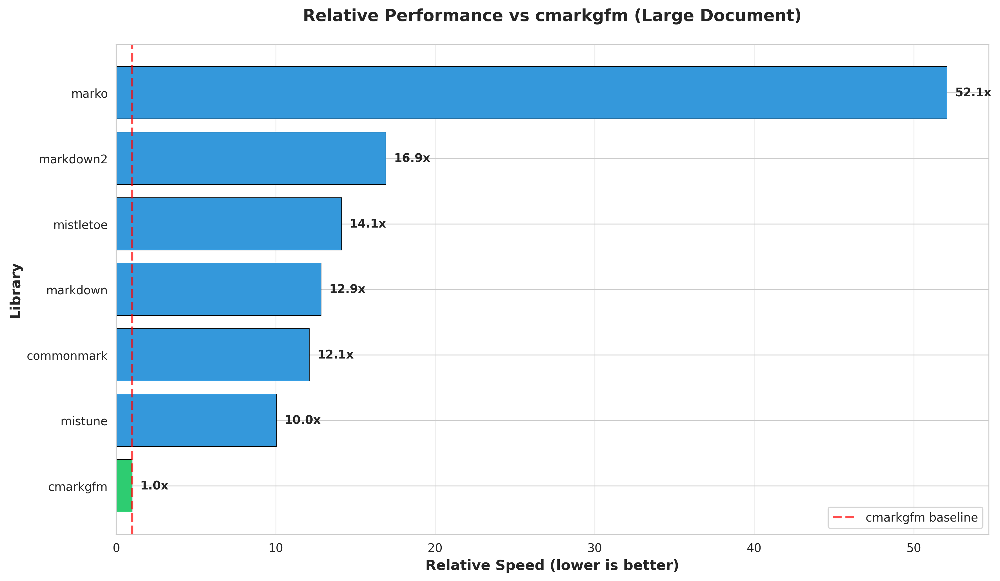
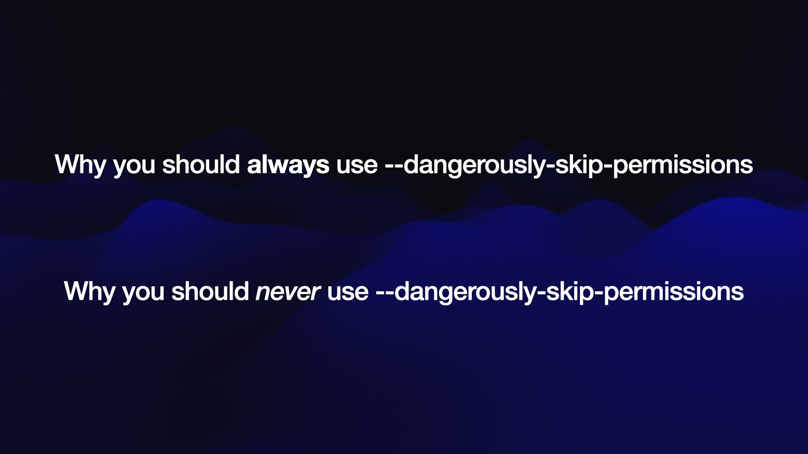
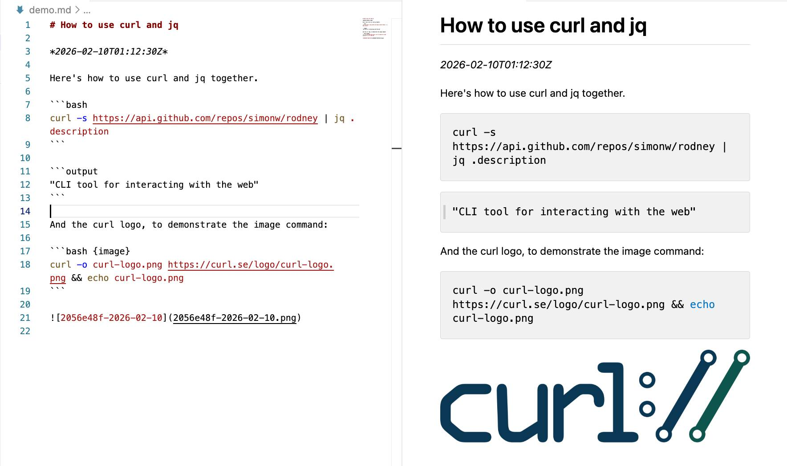

## Simon Willison: агент как исследователь, экспериментатор и производитель проверяемых свидетельств

История Simon Willison добавляет к корпусу отдельный режим агентской разработки: агент как исследователь и производитель проверяемых свидетельств. У Boris Tane и HumanLayer исследование нужно, чтобы потом безопаснее провести изменение через кодовую базу. У Willison исследование часто само является результатом: маленький репозиторий, эксперимент, benchmark, график, демонстрация, README или proof-of-concept, к которому можно вернуться позже.

Это отвечает на повторяющееся напряжение корпуса: код стало дёшево писать, но инженерное решение всё ещё нужно проверять. Willison снижает цену предварительной проверки гипотезы. Он не просит агента просто рассуждать, подойдёт ли библиотека, среда выполнения или архитектурный ход. Он заставляет агента поставить зависимости, написать код, запустить его, собрать результаты и оставить артефакт, который можно оценить независимо от уверенности модели.

От Peter Steinberger эта история отличается тем, что фокус смещён с быстрой продуктовой итерации на инженерное любопытство и накопление проверенных возможностей. От Arvid Kahl — тем, что свидетельства часто собираются не в живом SaaS, а в отдельной исследовательской зоне. От Mike McQuaid — тем, что изоляция достигается не столько отдельным пользователем и песочницей, сколько отдельным `research`-репозиторием без секретов и приватного кода. От Jökull Sólberg — тем, что проверяемый объект не PR, а исследовательский результат.

Для CU / doc-first процесса эта история важна как разведка перед дельтой. Перед тем как проводить намерение через проект, агент может проверить, существует ли рабочий путь, где лежит возможный фронт влияния и какие предположения стоит считать рискованными. При этом Willison сохраняет важную границу: рабочий proof-of-concept доказывает возможность, но неудачная попытка агента не доказывает невозможность.

### 1. Исходный принцип: вопросы о коде часто можно решать кодом

Willison называет один из своих рабочих режимов `code research`. В программировании многие вопросы плохо решаются рассуждением в общем виде. Например, можно долго обсуждать, подойдёт ли Redis для ленты уведомлений, но настоящий ответ зависит от структуры данных, нагрузки, паттернов чтения и записи. Инженер может построить маленький proof-of-concept, симулировать ожидаемую нагрузку и посмотреть, что получится.

Willison давно практиковал такой подход. Многие его проекты начинались с нескольких десятков строк экспериментального кода, чтобы проверить, существует ли рабочий путь. Он годами собирал маленькие технические доказательства: blog posts, TIL notes, GitHub repositories, HTML-инструменты, WebAssembly-эксперименты, CLI-утилиты. Для него профессиональный опыт включает не только знание библиотек и языков, но и накопленную память о том, что уже было проверено.

Coding agents усиливают этот режим. Если агент может написать и выполнить код, он способен провести маленькое исследование почти самостоятельно. Он не просто сообщает, что решение “должно работать”; он запускает код и возвращает результат.

Здесь есть важное ограничение. Агент может доказать возможность: если он написал код, запустил его и получил нужное поведение, он показал, что путь существует. Но он не может так же надёжно доказать невозможность. Если агент не нашёл способа, это ещё не значит, что способа нет. Для проектных решений это различие критично: рабочий proof-of-concept — сильный сигнал, неудачная попытка — только ограниченное свидетельство.

### 2. Агентские циклы: управляемый перебор вместо одноразового ответа

В сентябре 2025 Willison формулирует идею `agentic loops`. Coding agents вроде Claude Code и Codex CLI стали полезнее обычных LLM-ответов, потому что умеют выполнять цикл: написать код, запустить его, прочитать ошибку, исправить, снова запустить. Агент в этой рамке — система, которая использует инструменты в цикле ради цели.

Willison отдельно демистифицирует этот механизм. Coding agent — это не магическая сущность, а LLM, системный запрос, набор инструментов и цикл вызовов: модель предлагает действие, инструмент выполняет его, результат возвращается в контекст, модель делает следующий шаг. Поэтому качество зависит не только от модели, но и от того, какие инструменты доступны, что попадает в контекст, как устроены права и насколько дешёво повторять цикл. В этой рамке token caching, системные инструкции и формат вывода инструментов становятся не внутренними деталями продукта, а частью инженерной среды.

Сильная сторона такого агента — способность перебирать небольшие технические пространства. Если задачу можно свести к ясной цели, набору инструментов и циклу обратной связи, агент часто найдёт рабочее решение.

Из этого сразу следуют две инженерные проблемы.

Первая — безопасность. Самый мощный инструмент coding agent — shell. Если агент может запускать команды, он может сделать почти всё, что сделал бы человек за терминалом: удалить файлы, испортить окружение, отправить данные наружу, использовать машину как proxy. Поэтому Willison рассматривает `YOLO mode` одновременно как источник продуктивности и как источник риска. Полезная автономия требует окружения, где последствия ограничены: sandbox, контейнер, отдельная машина, ограниченный доступ к файлам и сети.

Вторая проблема — выбор инструментов. Willison часто предпочитает shell-команды вместо MCP. Его довод близок к HumanLayer: coding agents уже хорошо умеют пользоваться командами. Если агенту нужно сделать screenshot, можно поставить `shot-scraper` и положить один пример в `AGENTS.md`. Одного примера часто достаточно, чтобы модель поняла, как менять URL, размер окна и имя файла:

```
To take a screenshot, run:
shot-scraper http://www.example.com/ -w 800 -o example.jpg

```

Willison также подчёркивает тему ограниченных credentials. Если задаче нужны реальные API keys или доступ к deployment, лучше выдавать их в тестовую или staging-среду, с жёстким бюджетом и малой областью ущерба. В примере с Fly.io он создал отдельную организацию, поставил лимит бюджета, выдал агенту ключ только туда и позволил исследовать cold start times. Это не “доверить агенту prod”. Это дать ему достаточную автономию внутри заранее ограниченной зоны.

Для CU-процесса здесь важен общий принцип: автономия модели появляется после проектирования контура, где она может безопасно искать решение. Агентский цикл — это не просто запрос. Это цель, инструменты, права, обратная связь и граница ущерба.

### 3. Асинхронное исследование кода: агент как фоновый исследователь

В ноябре 2025 Willison описывает режим `asynchronous code research`. Схема проста:

1. выбрать исследовательский вопрос;
2. превратить его в несколько абзацев задания;
3. запустить асинхронного coding agent;
4. вернуться через несколько минут и посмотреть результат.

Он использует Claude Code for web, Codex Cloud, Google Jules, GitHub Copilot coding agent и похожие инструменты. Их общая форма: агент работает на сервере, получает задачу, запускает код в контейнере или управляемом окружении, затем возвращает ветку, PR, отчёт или набор файлов.

Для исследовательских задач это особенно удобно. Человек не обязан сидеть рядом и вести агента по шагам. Агент может сам поставить зависимости, написать benchmark, построить графики, обновить README, собрать короткое исследование. Willison пишет, что запускал по два-три таких [code research](#handbook--code-research) проекта в день. Его собственное участие было небольшим, а результаты часто были полезными или хотя бы интересными.

Это не означает, что агенту можно доверять любые выводы. Это означает, что резко упала стоимость предварительной проверки гипотезы.

### 4. Отдельный исследовательский репозиторий: свобода через изоляцию


Для таких задач Willison создаёт отдельный репозиторий `simonw/research`. Каждый эксперимент живёт в отдельной папке. Есть публичный репозиторий для несекретных экспериментов и приватный для того, что пока не нужно публиковать.

Это важное архитектурное решение. Он не запускает все исследования внутри основного продакшен репозиторий. Он создаёт песочницу, где агенту можно дать больше свободы.

В свежем несекретном репозитории агенту можно разрешить network access: ставить зависимости, скачивать данные, читать документацию, вытягивать GitHub repositories, экспериментировать с пакетами. В чувствительном репозитории такая свобода опасна: запрос injection плюс secrets плюс network access образуют известную `lethal trifecta`. В отдельном research repo риск ниже, потому что там нет приватного кода и секретов.

У `simonw/research` есть ещё одна деталь: README обновляется автоматически через GitHub Workflow. Workflow использует GitHub Models, `Cog`, `LLM`, `llm-github-models` и Python snippet, чтобы добавлять краткое изложение новых проектов. То есть research репозиторий сам становится индексируемой коллекцией результатов.

Для CU-процесса это сильный паттерн. Не всякая работа модели должна идти внутри основного проекта. Иногда правильнее вынести вопрос в отдельную зону, дать агенту больше свободы, получить свидетельства, а затем уже решать, что переносить в основной контур.


Отдельный `research`-репозиторий — это не просто удобное место для экспериментов. В корпусе он выполняет похожую функцию, что Sandvault у Mike McQuaid и тестовая среда у Arvid Kahl: даёт агенту больше свободы, потому что область ущерба заранее уменьшена. Разница в том, что Willison изолирует не пользователя операционной системы, а сам предмет работы: несекретное исследование отделено от производственного проекта.

### 5. Пример: сравнение Markdown-библиотек

<figure class="source-figure" id="fig-story-03-simon-markdown-performance">
  
  <figcaption>График — хороший пример того, что у Willison исследование агента заканчивается не уверенным текстом, а проверяемым артефактом. Источник: <a href="https://simonwillison.net/2025/Nov/18/automating-large-scale-coding-changes/">Asynchronous code research with Claude Code</a>. Локальный файл: <code>../assets/story-images/03-simon-markdown-performance.png</code>.</figcaption>
</figure>

Один из ясных примеров — сравнение `cmarkgfm` с другими Python Markdown libraries.

Willison нашёл Python-binding к C-реализации GitHub Markdown и захотел понять, как он выглядит по сравнению с другими библиотеками. Задание было конкретным:

```
Create a performance benchmark and feature comparison report on PyPI cmarkgfm compared to other popular Python markdown libraries.
Check all of them out from GitHub and read the source to get an idea for features.
Design and run a benchmark including generating some charts.
Create a report in a new python-markdown-comparison folder.
Do not create a _summary.md file or edit anywhere outside of that folder.
Make sure the performance chart images are directly displayed in the README.md in the folder.

```

Здесь важны несколько деталей.

Агент сам нашёл другие библиотеки. Willison не перечислял весь список. Это уже исследовательская автономия: агент не просто выполняет список, а собирает набор кандидатов.

Задание ограничивает место работы: новая папка, не редактировать за её пределами. Это маленькая зона `do-not-touch`, заданная прямо в запрос.

Результат должен быть отчётом, а не только кодом. Нужны benchmark, charts, README и визуальное отображение графиков. Агент должен показать результат в форме, которую человек может оценить.

По итогам `cmarkgfm` оказался существенно быстрее: в исследовательском README сравнение показывало большое преимущество, особенно на крупных документах. Но важнее сам процесс: то, что человек мог отложить как “интересно, но некогда”, агент превратил в исследовательский артефакт.

### 6. Пример: `cmarkgfm` внутри Pyodide

Следующий эксперимент строится поверх предыдущего. Это важная особенность research репозиторий: новые проекты могут опираться на старые.

После сравнения Markdown-библиотек Willison решил проверить, можно ли запустить `cmarkgfm`, у которого есть C extension, внутри Pyodide in Node.js. Агент должен был разобраться с WebAssembly, Python-пакетом, C-расширением и целевой сборкой.

В результате удалось перейти в binding-коде от CFFI к Python C API, собрать wheel для Emscripten / WebAssembly и загрузить его в Pyodide. Исследовательский README фиксирует, что возможности GitHub Flavored Markdown работали, а тесты проходили. Это уже не просто benchmark. Это proof-of-possibility для переноса Python-пакета с C-расширением в Python среда выполнения на WebAssembly.

Для Willison это типичный “технический камень в коллекции”: теперь он знает, что такой путь возможен, и в будущем может использовать этот результат для другой задачи.

### 7. Пример: Python внутри WebAssembly и SLOCCount

В “Living dangerously with Claude” Willison описывает ещё более характерный случай. Он давно интересуется запуском серверного Python внутри WebAssembly-sandbox. Он дал Claude Code for web с iPhone задачу проверить Pyodide внутри Node.js, и агент построил работающий demo script.

Затем появился side quest с SLOCCount — старым Perl-инструментом начала 2000-х для подсчёта строк кода и оценки стоимости разработки. Willison хотел браузерную версию, но не хотел сам запускать Perl. Он поручил Claude Code разобраться, как запускать Perl-скрипты в WebAssembly. Оказалось, что SLOCCount включает не только Perl, но и C-утилиты; агенту пришлось собирать эти C-компоненты через Emscripten.

Результатом стало браузерное приложение: можно вставить код, указать GitHub репозиторий или загрузить ZIP, а Perl+C-инструменты запускаются через WebAssembly прямо в браузере.

Это хороший пример того, что Willison называет side quest. Агент делает техническую экспедицию, которая раньше была бы слишком дорогой. Результат может быть не продакшен-ready, но он превращает “интересно, можно ли?” в рабочий артефакт.

### 8. Claude Code for web: асинхронный контейнер и мобильный запуск

Когда Anthropic запускает Claude Code for web, Willison быстро видит в нём аналог Codex Cloud and Google Jules. Это асинхронный coding agent в управляемой облачной среде: выбираешь GitHub репозиторий, окружение и запрос; агент работает в контейнере, потом создаёт ветку или PR.

Ценность web/cloud версии не в том, что она умнее локального Claude Code CLI. Ценность в другом: можно поставить задачу через web-, desktop- или mobile-интерфейс, уйти, затем вернуться к результату. Среда управляемая, контейнерная, с настройками сетевого доступа и окружения.

Пример с MiniJinja/Jinja2 benchmark показывает этот режим. Willison увидел новость о Python-bindings для MiniJinja и поддержку free-threading в Python 3.14. С телефона он сформулировал задачу: сравнить MiniJinja and Jinja2, взять последний checkout main-ветки MiniJinja и последнюю стабильную версию Jinja2, прогнать Python 3.14 and 3.14t, построить четыре сценария, использовать достаточно сложный template, создать shell script, benchmark, Markdown-отчёт и графики.

Через несколько минут агент вернул benchmark, графики и отчёт. Willison удивился конкретному результату — Jinja2 оказался быстрее, — но главный урок был в способе работы: исследовательский вопрос появился в моменте, был отправлен с телефона, вернулся как оформленный эксперимент.


Эта форма асинхронного исследования близка Calvin French-Owen и Mae Capozzi. Calvin описывает Codex web как длинный поводок с проверяемыми следами, а Mae показывает, как фоновый агентский проход снижает порог для миграций вроде `tsc` → `tsgo`. У Willison такая работа ещё менее привязана к продуктовой очереди: агент проверяет вопрос, который раньше мог бы остаться “интересно, но некогда”.

### 9. Свобода и риск: “living dangerously”

<figure class="source-figure" id="fig-story-03-simon-living-dangerously">
  
  <figcaption>Слайд из первоисточника усиливает раздел про свободу и риск: Willison прямо ставит продуктивность YOLO-mode рядом с опасностью неограниченных прав. Источник: <a href="https://simonwillison.net/2025/Oct/22/living-dangerously-with-claude/">https://simonwillison.net/2025/Oct/22/living-dangerously-with-claude/</a>. Локальный файл: <code>../assets/story-images/03-simon-living-dangerously-yolo-tradeoff.jpeg</code>.</figcaption>
</figure>


Willison прямо говорит о двойственности свободы. С одной стороны, он получает огромную ценность, когда агенты работают с минимумом ограничений. С другой стороны, такая свобода опасна.

Для research репозиторий он часто даёт агенту полный сетевой доступ. Это нужно, чтобы агент мог ставить зависимости, скачивать код, читать документацию, собирать примеры, устанавливать пакеты. В свежем несекретном репозитории риск невелик.

В чувствительном репозитории ситуация другая. Если агент читает недоверенный контент, видит secrets и имеет исходящий сетевой доступ, возникает lethal trifecta: запрос injection может заставить модель отправить наружу приватный код или переменные окружения.

Поэтому у Willison появляется разделение:

- свободный режим — только для несекретных исследовательских зон;
- чувствительные репозитории — с ограничениями на файлы, secrets и сеть;
- sandbox и сетевая изоляция — практические инструменты, а не необязательная теория.

Это важный слой зрелости. Он не использует “YOLO mode” как универсальное состояние. Он выбирает степень свободы под область ущерба.

### 10. Параллельная работа с агентами: параллелизм как новая привычка

В октябре 2025 Willison пишет, что сначала был скептически настроен к запуску нескольких агентов одновременно. Если всё равно нужно проверка, параллельные агенты могут только создать очередь результатов, которую человек не успеет разобрать.

Потом он начал находить категории задач, где параллель работает.

**Исследование для проверочных прототипов.** Агент проверяет, можно ли связать библиотеки, сделать маленький prototype и доказать, что выбранный подход работает. Код можно вообще не принимать.

**Как это было устроено?** Агент исследует существующую систему: где ставятся signed cookies, как используются subprocesses и threads, какие API не покрыты документацией. Результат можно сохранить как контекст для будущей работы.

**Небольшие задачи сопровождения.** Агент чинит warnings, deprecated APIs и мелкие раздражающие вещи, на которые человеку не хочется переключаться.

**Реальная работа с хорошо заданной спецификацией.** Если человек заранее решил подход и задал спецификацию, агент может реализовать задачу, а проверка становится проще.

У Willison есть трезвое ограничение: он способен осмысленно делать проверка только для ограниченного количества результатов. Поэтому параллелизм работает не потому, что “больше агентов лучше”. Он работает там, где результаты либо исследовательские, либо низкорисковые, либо заранее сильно специфицированные.

Для CU это важный момент. Нужна не только модель параллельной генерации, но и модель человеческой пропускной способности. Агентский процесс должен учитывать, сколько результатов человек способен действительно принять.

### 11. Разведочные агенты: агент как разведчик фронта

В тексте про parallel agents Willison выделяет паттерн “send out a scout”. Идея: дать агенту трудную задачу в большой кодовой базе без намерения принять его код. Цель — увидеть, куда он полезет, какие файлы тронет, где найдёт sticky bits, как вообще подойдёт к проблеме.

Это не режим исполнения, а режим разведки. Агент может создать плохой дифф, но его траектория всё равно полезна. Она показывает:

- какие файлы кажутся релевантными;
- где кодовая база сопротивляется;
- какие тесты или ошибки всплывают;
- какие недосказанности есть в спецификации;
- какие решения агент попробует первым.

Для CU-процесса это почти прямой прообраз `impact frontier discovery`. Перед проведением дельты можно отправить разведчика: не менять основной проект, а исследовать фронт влияния. Потом человек или основной агент решает, что из этого войдёт в настоящий propagation plan.

В Agentic Engineering Patterns рядом с этим стоит отдельная тема subagents. Willison использует их не как театральные роли, а как способ защитить главный контекст. Subagent получает свежий контекст, выполняет узкую задачу и возвращает сжатый результат. Это полезно для шумной работы: запуск больших тестов, отладка, поиск по репозиторию, локальный проверка, проверка конкретной гипотезы. Главный агент или человек получает итог: какие файлы важны, что было запущено, где ошибка, какие вопросы остались. Полные логи, тупики и промежуточные поиски не обязаны попадать в основной разговор.

Это делает subagents естественным мостом между scout agents и HumanLayer. Scout agent ищет фронт задачи, а subagent может быть более узким исполнителем: проверить один слой, запустить один набор тестов, сделать маленький проверка, объяснить один файл. Для Codex/CU важна не сама метка “subagent”, а контракт результата: узкий вопрос, отсутствие лишних правок, компактный ответ с файлами, строками и степенью уверенности.

### 12. Git как память, механизм восстановления и осознанная история

В Agentic Engineering Patterns Willison подробно пишет про Git. Его позиция: coding agents хорошо понимают Git, поэтому Git становится ещё более полезным.

Git даёт:

- историю изменений;
- веткуes;
- коммиты;
- откат;
- `reflog`;
- `git bisect`;
- механику merge и rebase;
- возможность восстановить потерянный код;
- возможность объяснить свежей сессии, что недавно изменилось.

Один простой запрос:

```
Review recent changes

```

Агент смотрит `git log`, последние коммиты и изменённый код. Это помогает свежей сессии понять текущее состояние проекта.

Другой запрос:

```
Sort out this git mess for me

```

Willison использует его при merge conflicts, failed cherry-picks, неправильном staging state and other Git-беспорядок. Раньше это была неприятная ручная работа. Теперь агент может прочитать конфликт, понять намерение кода, восстановить merge and run тесты.

Ещё один сильный пример — `git bisect`. Это мощный инструмент, которым люди пользуются редко из-за механической сложности. Агент может написать условие проверки, запустить bisect и найти коммит, где появился баг. Это снижает стоимость исторического расследования.

Willison делает ещё один нетривиальный вывод: история Git не обязана быть стенограммой всего, что происходило. Её можно сознательно оформить как историю, которая помогает будущей разработке. Coding agents могут переписывать коммиты, удалять случайно попавшие файлы, объединять коммиты, улучшать сообщения коммитов, выносить библиотеку в новый репозиторий и при этом сохранять полезную историю. Это не просто cleanup. Это работа с проектной памятью.

Для CU это особенно важно. Git становится не только VCS, но и внешней памятью процесса. Агент может читать её, переписывать её и использовать как контекст. Значит, история проекта тоже входит в экзоскелет.

### 13. Код стало дёшево писать: изменилась цена проверки инженерных решений

Willison формулирует один из базовых принципов Agentic Engineering Patterns: writing code is cheap now. Это не значит, что good code стало бесплатным. Дешёвым стало набрать код, сгенерировать его и быстро пройти несколько итераций.

Хороший код всё ещё требует:

- чтобы оно работало;
- чтобы мы знали, что оно работает;
- чтобы оно решало правильную проблему;
- чтобы ошибки обрабатывались предсказуемо;
- чтобы код был простым и минимальным;
- чтобы были тесты;
- чтобы документация соответствовала поведению;
- чтобы дизайн позволял будущие изменения;
- чтобы учитывались accessibility, reliability, security, maintainability, observability, scalability, usability и похожие свойства.

Снижение стоимости набора кода ломает старые интуиции. Раньше инженер часто думал: “это не стоит времени”. Теперь можно запустить асинхронного агента и проверить идею за десять минут. В худшем случае идея окажется не стоящей потраченных tokens. В лучшем — появится доказательство, prototype или более точное понимание проблемы.

Для CU это означает, что экзоскелет должен различать типы агентского вывода. Дешевле стало получать кандидатные решения, эксперименты, разведочные проходы, черновики и proof-of-concepts. Принятие правильных проектных изменений от этого не стало дешёвым. Если всё, что агент создал, считать изменение, готовое к внесению в основной проект, будет хаос. Если часть результатов пометить как исследовательские артефакты, появляется новое пространство работы.

У Willison рядом с этим стоит ещё одно ограничение: ИИ должен помогать производить лучший код, а не просто больше кода. Если цена набора кода упала, это не повод снижать стандарт. Это повод рассматривать больше вариантов, делать больше маленьких экспериментов, быстрее находить edge cases, проверять альтернативные реализации и создавать более сильный compound engineering loop. Плохой вывод из “writing code is cheap now” — завалить проект большим количеством слабого кода. Хороший вывод — дешевле покупать проверку идей, сравнение подходов и дополнительные свидетельства качества.

### 14. Vibe engineering: ответственность не исчезает

Willison вводит “vibe engineering” как противоположность безответственному vibe coding. Vibe coding в его понимании — это когда человек просит модель сделать что-то, не особенно понимает код и принимает результат, если тот внешне работает. Для личных low-risk инструменты это допустимо. Для программного обеспечения, которым пользуются другие люди, это уже безответственно.

Vibe engineering — попытка назвать другой режим: опытный инженер использует ИИ для ускорения работы, но остаётся ответственным за результат. По Willison, такой человек делает не меньше инженерной работы, а часто больше:

- исследует подходы;
- принимает архитектурные решения;
- пишет спецификации;
- определяет критерии успеха;
- проектирует agentic loops;
- планирует QA;
- управляет несколькими странными цифровыми стажёрами;
- тратит много времени на проверка.

Это важная формулировка. Willison видит, что агентское программирование не отменяет senior engineering. Оно сдвигает работу вверх: от набора кода к постановке задачи, проверке, архитектуре, контексту и ответственности.

Для CU-процесса это прямой сигнал. Если модель проводит дельту через проект, человек не обязан читать каждую строку, но обязан держать намерение, границы, свидетельства, архитектуру и риск.

### 15. Datasette plugin: когда агент уже пишет маленькую фичу целиком

В октябре 2025 Willison пишет, что Claude Sonnet 4.5 смог полностью написать Datasette plugin. Плагин `datasette-os-info` добавляет JSON endpoint `/-/os`, который выводит сведения об операционной системе. Сам плагин простой, но важен контекст: он был нужен для экспериментов с базовым Docker-контейнером для Datasette и Python 3.14.

Работа начиналась с cookiecutter template:

```
uvx cookiecutter gh:simonw/datasette-plugin

```

Затем он создал виртуальное окружение, установил тестовые зависимости и запустил тесты:

```
cd datasette-os-info
uv venv
uv sync --extra test
uv run pytest

```

После этого он запустил Claude Code в YOLO mode:

```
claude --dangerously-skip-permissions

```

Сначала сказал агенту, как запускать тесты:

```
Run uv run pytest

```

Затем дал задачу реализовать plugin: добавить `/-/os`, вернуть отформатированный JSON с максимально подробной информацией об операционной системе, включая сведения о базовом Docker-образе, имени релиза Debian и похожие данные.

Claude использовал Datasette plugin hook `register_routes()`, сам написал базовый тест, запустил его, нашёл ошибку в собственном предположении о несуществующем параметре `Response(..., default_repr=)`, исправил её и объявил задачу завершённой. Затем Willison сам собрал wheel и развернул его для проверки. Endpoint вернул нужные данные об операционной системе.

Эта история показывает не “магическое создание большого продукта”, а важный класс задачи: хорошо ограниченная фича внутри зрелого фреймворка с templates, hooks, тесты и примерами, которые уже хорошо представлены в обучающих данных модели. Здесь агент может написать весь код и тесты с минимальным управлением. Именно поэтому такой успех не переносится автоматически на сложные архитектурные изменения.

Для CU это полезное различие: есть задачи, где baseline agentic рабочий процесс уже достаточно силён. Экзоскелет не должен усложнять такие случаи.

### 16. Hoard things you know how to do: копилка проверенных возможностей

Willison любит собирать маленькие доказательства возможностей. Он считает, что в программировании важно знать не только правила, но и множество конкретных “я видел, что это работает”. Чем больше у инженера таких проверенных pieces, тем больше неожиданных комбинаций он может собрать.

Coding agents усиливают этот подход. У Willison есть:

- blog posts;
- TIL notes;
- GitHub repositories;
- small proof-of-concepts;
- `tools.simonwillison.net`;
- `simonw/research`;
- HTML-инструменты, часто сделанные с помощью LLM;
- transcripts и запросы для сгенерированных инструментов.

Один из его любимых паттернов — попросить агента собрать новую вещь из двух уже работающих примеров.

Например, браузерный OCR-инструмент для отсканированных PDF. У него уже был код, который превращает страницы PDF в изображения через PDF.js, и код, который делает OCR изображения через Tesseract.js. Он дал агенту оба примера и попросил объединить их в одну HTML-страницу: пользователь загружает PDF, страницы превращаются в JPEG, запускается OCR, а результаты появляются в текстовых полях.

Модель в таком режиме не придумывает всё из воздуха. Она комбинирует готовые прецеденты. Это снижает риск и ускоряет результат.

Для CU это важно: экзоскелет должен хранить не только правила, но и проверенные примеры. Examples, prior solutions, experiments, proof-of-concepts и transcripts могут быть частью активной памяти процесса.

### 17. Агентское ручное тестирование: агент должен показать, что результат работает

Willison подчёркивает: определяющая особенность coding agent — он может выполнить код, который написал. Поэтому нельзя считать LLM-generated code рабочим, пока он не был выполнен.

Один из его простых стартовых ритуалов — сначала запустить тесты. В существующем проекте он может начать новую сессию с короткого запроса вроде `First run the tests` или, для Python-проекта, `Run "uv run pytest"`. Это не только проверка исходного состояния. Агент сразу узнаёт, как в проекте запускаются тесты, видит состояние окружения и получает первый контакт с рабочей системой до того, как начнёт править файлы. Если тесты уже красные, это нужно знать до изменения кода, иначе агент начнёт чинить чужой сбой или примет старую поломку за собственную.

Автоматические тесты важны, особенно red/green TDD. Но тесты не закрывают всё. Код может пройти тест suite и всё равно падать в очевидных местах: сервер не стартует, нужный UI-элемент не появляется, edge case не покрыт, поведение в браузере не соответствует ожиданию.

Поэтому он использует agentic manual testing. Для Python library можно попросить:

```
Try that new function on edge cases using python -c

```

Для JSON API:

```
Run a dev server and explore that new JSON API using curl

```

Для web UI — Playwright, browser automation, dedicated browser CLIs. Если агент во время manual testing находит проблему, Willison предпочитает превратить её в red/green TDD: сначала failing тест, затем исправление, чтобы случай стал постоянным regression тест.

Это важный мост между research и продакшен. Агент должен не только написать код, но и показать поведение.


Проверяемое свидетельство у Willison стоит рядом с браузерным циклом Arvid Kahl и видеоартефактами Jesse Vincent. Во всех трёх случаях агент не просто сообщает, что всё работает. Он оставляет след: демонстрацию, снимок экрана, видео, отчёт или команду воспроизведения. Это важный противовес чистому модельному суждению.

### 18. Showboat и Rodney: демонстрация как проверяемый артефакт

<figure class="source-figure" id="fig-story-03-simon-showboat-demo">
  
  <figcaption>Снимок демонстрации поддерживает раздел о demo как форме свидетельства: агент должен не только написать код, но и показать воспроизводимое поведение. Источник: <a href="https://simonwillison.net/2026/Jan/26/showboat-and-rodney/">Showboat and Rodney</a>. Локальный файл: <code>../assets/story-images/03-simon-showboat-curl-demo.jpg</code>.</figcaption>
</figure>

В феврале 2026 года Willison выпускает [Showboat](#story-03-simon-willison--18-showboat-i-rodney-demonstratsiya-kak-proveryaemyy-artefakt) и [Rodney](#story-03-simon-willison--18-showboat-i-rodney-demonstratsiya-kak-proveryaemyy-artefakt). Это развитие той же линии: агент должен не только писать и тестировать код, но и показывать человеку, что именно было построено и как это проверялось.

Showboat — CLI-инструмент для создания Markdown-документов, в которых рядом находятся пояснения, исполняемые блоки кода и сохранённый вывод команд. Такой документ становится одновременно читаемой документацией и воспроизводимым подтверждением работы. Его можно перепроверить: `showboat verify` заново выполняет блоки кода и сравнивает полученный вывод с сохранённым.

Пример команд:

```
showboat init demo.md 'How to use curl and jq'
showboat note demo.md "Here's how to use curl and jq together."
showboat exec demo.md bash 'curl -s https://api.github.com/repos/simonw/rodney | jq .description'
showboat image demo.md 'curl -o curl-logo.png https://curl.se/logo/curl-logo.png && echo curl-logo.png'

```

Основные команды:

- `init` — создать демонстрационный документ;
- `note` — добавить пояснение;
- `exec` — выполнить команду и записать её вывод;
- `image` — добавить изображение;
- `pop` — убрать последний блок;
- `verify` — заново выполнить блоки кода и сравнить вывод;
- `extract` — восстановить команды из документа.

Willison прямо отмечает риск обмана: агент может отредактировать Markdown напрямую, вместо того чтобы пользоваться Showboat. Тогда документ перестаёт доказывать, что команды действительно выполнялись. Значит, даже инструмент для доказательства работы нуждается в ограничителе: важно не только содержание документа, но и путь, которым он был создан.

Rodney дополняет Showboat. Это CLI-инструмент для автоматизации браузера: постоянный headless Chrome и команды вроде `rodney start`, `rodney open`, `rodney js`, `rodney click`, `rodney screenshot`. Агент может открыть страницу, кликнуть по элементу, прочитать DOM, сделать screenshot и поместить его в демонстрационный артефакт.

Пример:

```
rodney start
rodney open https://datasette.io/
rodney js 'Array.from(document.links).map(el => el.href).slice(0, 5)'
rodney click 'a[href="/for"]'
rodney js location.href
rodney js document.title
rodney screenshot datasette-for-page.png
rodney stop

```

Для CU это особенно ценно. Showboat и Rodney дают почти готовый тип журнала свидетельств: не просто “я сделал”, а “вот команда, вот вывод, вот скриншот, вот проверяемая демонстрация”. Такой журнал можно использовать при проверке проведения дельты и в последующем исправительном проходе.

### 19. `claude-code-transcripts`: transcript как артефакт процесса

Willison также сделал `claude-code-transcripts`: инструмент, который превращает session files Claude Code в формате JSON/JSONL в чистые HTML-страницы. Он умеет работать с локальными сессиями из `~/.claude/projects`, web sessions, raw JSON/JSONL files, вывод directories и публикацией в Gist.

На первый взгляд это второстепенная утилита, но для нашего направления она важна. Агентская работа производит не только код. Она оставляет траектории: запросы, инструмент calls, коммиты, промежуточные артефакты, похожие на следы рассуждения, и сами изменения. Если эту траекторию можно превратить в читаемый HTML, её можно проверить, сохранить, привязать к PR или использовать как материал для postmortem.

В CU-процессе это соответствует слою происхождения и проверяемых следов. Не всегда нужно читать весь transcript, но иногда важно иметь его как восстанавливаемое свидетельство: почему агент решил именно так, какие команды запускал, где мог ошибиться.

Сюда же относится практический жанр linear walkthrough. В одном из примеров Willison vibe-coded SwiftUI presentation app и понял, что почти не понимает, как устроен получившийся код. Вместо того чтобы читать всё вручную, он попросил Claude Code пройти по репозиторию и создать walkthrough-документ через Showboat. Важная деталь: агент должен был использовать `showboat exec` с `sed`, `grep`, `cat` и похожими командами, чтобы фрагменты кода попадали в документ из реальных файлов, а не пересказывались моделью по памяти. Такой walkthrough восстанавливает понимание человека после агентской работы и превращает “код вроде работает, но я его не понимаю” в отдельную задачу.

Willison также использует annotated запросы как обучающий артефакт. Это не полный transcript и не финальный пост о результате, а разобранный рабочий запрос с последующими уточнениями: что было сказано агенту, какие ограничения заданы, где потребовался follow-up, почему задача была сформулирована именно так. Такие annotated запросы занимают промежуточное место между Showboat-документом и полным transcript. Они помогают повторять рабочие приёмы, не заставляя читателя читать всю сессию.

### 20. Vibe coding, vibe engineering и ответственность

Willison давно различает безответственное vibe coding и ответственную AI-assisted engineering. Vibe coding — это когда человек просит модель построить что-то, плохо понимает код и принимает результат, потому что тот внешне работает. Для личных low-risk инструменты это допустимо. Для программного обеспечения, которым пользуются другие люди, такой подход уже опасен.

В 2025 году он предлагает термин “vibe engineering” для другой практики: опытный инженер использует LLM для ускорения работы, но остаётся ответственным за итоговый software. В этом режиме человек не просто “даёт запрос”. Он делает работу senior-инженера:

- исследует подходы;
- принимает архитектурные решения;
- пишет спецификации;
- определяет критерии успеха;
- проектирует agentic loops;
- планирует QA;
- управляет несколькими странными цифровыми стажёрами;
- тратит много времени на проверка.

Это важная формулировка. Willison видит, что агентское программирование не отменяет senior engineering. Оно сдвигает работу вверх: от набора кода к постановке задачи, проверке, архитектуре, контексту и ответственности.

Позднее, в 2026 году, граница становится сложнее. Coding agents уже достаточно хороши для простых задач, близких к продакшен-работе: JSON API endpoint, SQL query, тесты, docs. Willison может не читать каждую строку такого кода, потому что агент много раз доказал способность делать такие вещи правильно. Возникает вопрос: если он не читал каждую строку, остаётся ли работа ответственной?

Он сравнивает это с большими организациями: инженер не читает каждую строку кода другого отдела, но смотрит контракт, поведение, тесты, [проверяемые свидетельства](#theoretical-synthesis--34-agentu-nelzya-verit-na-slovo-no-i-cheloveka-nelzya-prevraschat-v-ruchnoy-lint) и операционную уверенность. Возможно, работа с агентом будет двигаться туда же: не построчное проверка всего, а проверка свидетельств, границ, тестов, демонстраций и архитектуры.

Для CU это один из центральных вопросов. Если модель проводит дельту через проект, человек физически не сможет проверять каждую строку. Значит, нужны другие формы ответственности: фронты влияния, журнал свидетельств, gates, проверка смысла и выборочные углублённые проверки.


Git-память Willison можно сопоставить с `dev-plans` Mark Erikson и планами Calvin French-Owen. У Mark внешняя память удерживает состояние долгой реализации, у Calvin — текущий ход задачи и TODO, а у Willison — проверенные возможности и исследовательские результаты. Во всех случаях устойчивый артефакт важнее стенограммы чата.

### 21. Разработка через соответствие: агент строит стандарт из нескольких реализаций

В беседе об agentic engineering Willison приводит сильный пример: он хотел добавить загрузку файлов в Datasette. Вместо того чтобы сразу писать реализация, он попросил Claude построить набор тестов для multipart file uploads, который проходит на нескольких существующих web-фреймворках: Go, Node.js, Django, Starlette и других. После этого он использовал получившийся набор тестов как conformance target для реализации в Datasette.

Смысл в том, что агент может извлечь поведение из нескольких реализаций и превратить его в набор тестов, похожий на стандарт. Затем новая реализация строится уже под этот набор.

Это очень важный режим. Агент не только пишет код. Он помогает извлечь поведение из существующих систем и превратить его в проверяемый контракт. Для CU-процесса это близко к извлечению инвариантов: перед проведением изменения можно собрать поведенческий контракт из примеров, а затем использовать его как gate.

### 22. Что такое agentic engineering: попытка назвать новую практику

В своём guide Willison использует термин `agentic engineering` для разработки с coding agents. В его определении coding agent — это агент, который может не только писать код, но и исполнять его. Именно это отличает его от LLM, который просто печатает текст.

Он не пытается построить строгую теорию. Guide устроен как набор практических паттернов:

- `writing code is cheap now`;
- `hoard things you know how to do`;
- `AI should help us produce better code`;
- anti-паттерны;
- Git with agents;
- subagents;
- red/green TDD;
- first run the тесты;
- manual testing;
- walkthroughs;
- annotated запросы.

Это полезно как карта нижнего слоя. У Willison хорошо видна практическая ось: агентская разработка требует новых привычек. Но она всё ещё в основном описывает работу с задачами, proof-of-concepts и демонстрациями, а не общий механизм проведения намерения через проект.

### 23. Anti-паттерны: не перекладывать плохой код на других

В anti-паттерны Willison формулирует важный этический момент: агентская разработка легко создаёт ситуацию, где человек перекладывает на других непроверенный код. Если агент помог создать изменение, человек должен показать, что сам проделал дополнительную работу. Это могут быть заметки о manual testing, комментарии к реализация choices, скриншоты, видео или другое свидетельство того, что фича действительно работает.

Это важно для нашего понятия журнала проведения. В агентской разработке доказательство работы становится частью социальной ответственности. Если ты отдаёшь кому-то PR, ты должен показать не только дифф, но и почему время reviewer’а не будет потрачено впустую.

### 24. Что в этой истории происходит на самом деле

История Willison не строится вокруг одного инструмента. Она строится вокруг того, что проверка инженерных гипотез стала значительно дешевле.

Сначала есть старая практика: собирать маленькие proof-of-concepts и заметки о том, что вообще возможно. Затем появляются coding agents, которые могут писать и выполнять код. Proof-of-concept становится дешёвой фоновой активностью. Затем появляются async agents и research repositories, которые позволяют запускать несколько экспериментов параллельно. После этого возникает потребность в проверяемых свидетельствах: benchmark, графики, README-отчёты, Showboat-документы, браузерные скриншоты, transcripts. Затем появляется вопрос ответственности: если агент пишет больше кода, чем человек может построчно проверить, какие формы свидетельств и проверка достаточно сильны?

Дуга выглядит так:

1. инженер копит проверенные примеры;
2. агент удешевляет эксперименты;
3. отдельный [исследовательский репозиторий](#cross-story-synthesis--4-3-kogda-issledovanie-yavlyaetsya-podgotovkoy-a-kogda-samostoyatelnym-rezultatom) снижает риск;
4. сетевой доступ даёт свободу, если нет секретов;
5. асинхронные агенты превращают исследование в фоновый конвейер;
6. параллельные агенты расширяют количество проверяемых гипотез;
7. разведочные агенты помогают найти фронт сложной задачи;
8. Git становится памятью и механизмом восстановления;
9. ручное тестирование и red/green TDD производят проверяемые свидетельства;
10. Showboat и Rodney превращают выполнение в демонстрацию;
11. стенограммы сохраняют траекторию;
12. agentic engineering отделяет ответственную продакшен-работу от низкорискового vibe coding;
13. человеческая ответственность смещается от набора кода к спецификации, проверке свидетельств, выбору архитектуры и решению о том, что безопасно отправлять дальше.

Это не экзоскелет Vincent и не обвязка HumanLayer. Это другой слой: агент как дешёвый исследователь возможного.

### 25. Что переносимо в Codex

На уровне принципов переносимо почти всё:

- отдельные [исследовательские репозитории](#handbook--code-research) для низкорисковых экспериментов;
- асинхронное [исследование кода](#cross-story-synthesis--3-3-issledovanie-kodom-kak-otdelnyy-rezultat) через Codex Cloud / Codex web;
- полный сетевой доступ только в несекретных окружениях;
- research запрос с явно заданным выходным артефактом;
- требование вернуть report, charts, README, benchmark и demo;
- агенты для вопросов вида “можно ли это сделать?”;
- неудачное исследование как свидетельство, но не как доказательство невозможности;
- scout agents до принятия решения об изменении;
- сохранённые объяснения и заметки для будущих запросы;
- история Git, `reflog`, `bisect` и исправление merge-ситуаций через агентов;
- agentic manual testing через `python -c`, `curl` и браузерные инструменты;
- демонстрационные артефакты через механизмы вроде Showboat;
- сохранение transcripts как provenance;
- маленькие инструменты из работающих примеров;
- разделение между личными low-risk инструментами и software, за который нужно отвечать.

Конкретная механика Codex будет отличаться. Codex Cloud естественно подходит для асинхронного исследования. Codex CLI естественно подходит для локального интерактивного исследования. Codex App может быть полезен для проверка, рабочих деревьев и интеграции браузера с терминалом. Точные детали должны жить в Reference, но сам рабочий принцип переносим.

### 26. Где подход Willison ограничен

Подход Willison силён в исследовании, proof-of-concept и проверяемых свидетельствах. Он слабее там, где нужно строго провести намерение через живой проект.

Research репозиторий может показать, что идея возможна. Но сам по себе он не решает:

- как перенести результат в основной проект;
- какие документы обновить;
- какие последствия ниже по цепочке затронуть;
- как не исказить архитектурное намерение;
- где поставить зоны `watch-only` и `do-not-touch`;
- как провести repair после частичного переноса.

Scout agent может показать вероятный фронт. Но этот фронт ещё нужно формализовать. Showboat-документ может показать поведение, но сам по себе не доказывает сопровождаемость, архитектурную пригодность или смысловое соответствие.

Willison хорошо улавливает снижение цены эксперимента. Он слабее раскрывает процесс проведения изменений через живую систему. Это именно место, где CU может строить следующий слой.

### 27. Почему это важно для CU/doc-first

Willison подтверждает несколько важных тезисов.

**Первое. Дешевеют не только изменения, но и проверки гипотез.**\
CU-процесс должен использовать агентов не только для выполнения дельты, но и для разведки: проверить возможность, найти фронт, собрать варианты, построить proof-of-concept.

**Второе. Исследование должно быть изолировано.**\
Research repo с другими правилами безопасности — сильный паттерн. Не всякая работа должна проходить внутри основного проекта.

**Третье. Агент должен производить свидетельства, а не только код.**\
Reports, charts, screenshots, command outputs, demos, transcripts и README-артефакты становятся частью инженерной работы. Для CU это прямо соответствует propagation ledger и свидетельства trails.

**Четвёртое. Нельзя путать “возможно” и “невозможно”.**\
Если агент нашёл рабочее решение, он доказал возможность. Если не нашёл, это не доказательство невозможности. Это различие критично для проектных решений.

**Пятое. Ответственность человека не исчезает, а меняет форму.**\
Человек не всегда будет читать каждую строку. Но он должен проверять свидетельства, contracts, scope, risks, тесты, deployment boundary и архитектурную пригодность.

**Шестое. Копилка работающих примеров — это память для будущих агентов.**\
Копилка Willison — инструменты, repos and TILs — работает как примитивная внешняя память. CU должен формализовать этот слой: examples, precedents и proof-of-concepts должны стать поисковыми проектными активами.

**Седьмое. Перед исполнением нужна разведка.**\
Scout agents и async research могут обнаруживать вероятные impact frontiers ещё до начала продакшен-изменений. Это особенно важно для semantic deltas.

### 28. Итоговая оценка

История Simon Willison менее “процессная”, чем история Vincent, и менее “инфраструктурная”, чем история HumanLayer. Но она добавляет третий важный слой.

Vincent показывает, как ручной агентский рабочий процесс превращается в навыки, шлюзы и хуки. HumanLayer показывает, что главным объектом инженерии становится обвязка. Willison показывает, что агенты резко снижают цену инженерного исследования.

Его главный вклад в нашу картину: агент не только пишет код. Агент может быстро и параллельно исследовать пространство возможностей. Он может проверять гипотезы, строить маленькие доказательства, запускать benchmark’и, делать демонстрации, собирать отчёты, показывать работающие артефакты и сохранять стенограммы.

Для CU это значит: экзоскелет должен включать не только проведение дельты, но и разведку перед дельтой. Перед тем как менять проект, модель может отправлять scout agents, строить research artifacts, собирать свидетельства и намечать вероятный impact frontier.

Если Vincent даёт нам ритуалы исполнения, а HumanLayer — среду исполнения, то Willison даёт нам ритуалы исследования.


### 29. Карта использованных первоисточников

#### Центральные источники

- [“Code research projects with async coding agents like Claude Code and Codex”](https://simonwillison.net/2025/Nov/6/async-code-research/) — основной источник по `asynchronous code research`, отдельному репозиторию `simonw/research`, экспериментам с Markdown-библиотеками, `cmarkgfm`, Pyodide/WebAssembly, агентам Claude Code, Codex Cloud, Jules и другим асинхронным coding agents.
- [“Agentic Engineering Patterns”](https://simonwillison.net/guides/agentic-engineering-patterns/) — основная карта практик Willison по агентской разработке: writing code is cheap now, hoard things you know how to do, Git with agents, red/green TDD, manual testing, walkthroughs, annotated prompts, subagents and related practices.
- [“What is agentic engineering?”](https://simonwillison.net/guides/agentic-engineering-patterns/what-is-agentic-engineering/) — источник по определению agentic engineering и coding agents как систем, которые не только пишут код, но и исполняют его.
- [“Embracing the parallel coding agent lifestyle”](https://simonwillison.net/2025/Oct/5/parallel-coding-agents/) — источник по parallel coding agent lifestyle, scout agents, категориям задач для параллельной работы, ограничениям review capacity и различию между исследовательским выводом и кодом, который можно принимать в основной проект.
- [“Living dangerously with Claude”](https://simonwillison.net/2025/Oct/22/living-dangerously-with-claude/) — источник по свободе и рискам coding agents: YOLO mode, prompt injection, lethal trifecta, WebAssembly/Pyodide experiments, SLOCCount в браузере и необходимости отделять свободные исследовательские зоны от чувствительных репозиториев.

#### Исследовательские примеры и демонстрационные артефакты

- [`simonw/research`](https://github.com/simonw/research) — публичный репозиторий для code research projects; используется как изолированная зона для асинхронных исследовательских задач, benchmark’ов, proof-of-concepts, README-отчётов и графиков.
- [“Claude can write complete Datasette plugins now”](https://simonwillison.net/2025/Oct/8/claude-datasette-plugins/) — источник по `datasette-os-info`: простому Datasette plugin с endpoint `/-/os`, написанному Claude Sonnet 4.5 вместе с тестами и минимальным управлением со стороны Willison.
- [“My fireside chat about agentic engineering at the Pragmatic Summit”](https://simonwillison.net/2026/Mar/14/pragmatic-summit/) — источник по conformance-driven development: пример с multipart file uploads для Datasette, где агент сначала строит тесты, проходящие на нескольких существующих web frameworks, а затем реализация Datasette строится под этот поведенческий контракт.
- [“Introducing Showboat and Rodney, so agents can demo what they’ve built”](https://simonwillison.net/2026/Feb/10/showboat-and-rodney/) — основной источник по Showboat и Rodney: демонстрационным артефактам, исполняемым блокам, сохранённому выводу команд, browser automation и требованию показывать, что агент действительно построил.
- [“Two new Showboat tools: Chartroom and datasette-showboat”](https://simonwillison.net/2026/Feb/17/chartroom-and-datasette-showboat/) — дополнительный источник по развитию Showboat, Chartroom и использованию Rodney для загрузки страниц, кликов, JavaScript-инъекций и сохранения screenshots внутри демонстрационного документа.
- [“Rodney v0.4.0”](https://simonwillison.net/2026/Feb/17/rodney/) — источник по Rodney как CLI-инструменту браузерной автоматизации, включая новые команды и использование Rodney вместе с Showboat.

#### Инструменты и репозитории

- [`simonw/showboat`](https://github.com/simonw/showboat) — репозиторий Showboat: CLI для создания Markdown-документов с пояснениями, исполняемыми командами, сохранённым выводом и повторной проверкой через `showboat verify`.
- [`simonw/rodney`](https://github.com/simonw/rodney) — репозиторий Rodney: CLI для управления headless Chrome, открытия страниц, выполнения JavaScript, кликов и создания screenshots.
- [“A new way to extract detailed transcripts from Claude Code”](https://simonwillison.net/2025/dec/25/claude-code-transcripts/) — источник по `claude-code-transcripts`: инструменту для превращения Claude Code session files в читаемые HTML-страницы, пригодные для анализа и публикации.
- [`simonw/claude-code-transcripts`](https://github.com/simonw/claude-code-transcripts) — репозиторий инструмента `claude-code-transcripts`.
- [Release: `claude-code-transcripts` 0.5](https://simonwillison.net/2025/Dec/31/claude-code-transcripts/) и [Release: `claude-code-transcripts` 0.6](https://simonwillison.net/2026/Jan/25/claude-code-transcripts/) — дополнительные источники по развитию инструмента и его возможностям публикации сессий Claude Code.
- [tools.simonwillison.net](https://tools.simonwillison.net/) — коллекция LLM-assisted HTML tools и небольших проверенных прототипов; важна как пример “копилки возможностей”, которую Willison затем может комбинировать в новых задачах.

#### Дополнительные материалы Agentic Engineering Patterns

- [“Hoard things you know how to do”](https://simonwillison.net/guides/agentic-engineering-patterns/hoard-things-you-know-how-to-do/) — источник по идее копить проверенные примеры, HTML-инструменты, proof-of-concepts и research projects как будущую память для новых агентских задач.
- [“Agentic manual testing”](https://simonwillison.net/tags/showboat/) — источник по требованию не считать код, написанный LLM, рабочим, пока он не был выполнен; связан с практиками `python -c`, `curl`, browser automation, Showboat и Rodney.
- [“Vibe engineering”](https://simonwillison.net/2025/Oct/7/vibe-engineering/) — источник по различию между безответственным vibe coding и ответственной agentic engineering, где опытный инженер остаётся владельцем архитектуры, проверки, критериев успеха и review.
- [“Interactive explanations”](https://simonwillison.net/guides/agentic-engineering-patterns/interactive-explanations/) — дополнительный источник по когнитивному долгу, возникающему, когда человек перестаёт понимать код, написанный агентом, и по практикам восстановления понимания через объяснения и walkthroughs.

#### Фоновые и архивные указатели

- [Simon Willison — главная страница](https://simonwillison.net/) — общий указатель на блог и архив материалов по LLM, coding agents, Datasette, Claude Code, Codex and related tools.
- [Тег `claude-code`](https://simonwillison.net/tags/claude-code/) — архив материалов Willison по Claude Code, включая проекты, transcripts, experiments and side quests.
- [Тег `parallel-agents`](https://simonwillison.net/tags/parallel-agents/) — архив материалов по параллельным агентам и related coding-agent workflow.
- [Тег `showboat`](https://simonwillison.net/tags/showboat/) и [тег `rodney`](https://simonwillison.net/tags/rodney/) — указатели на материалы по демонстрационным артефактам и браузерной автоматизации.

