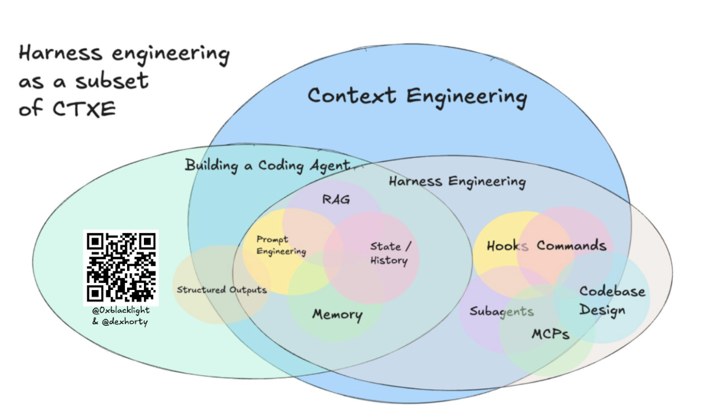
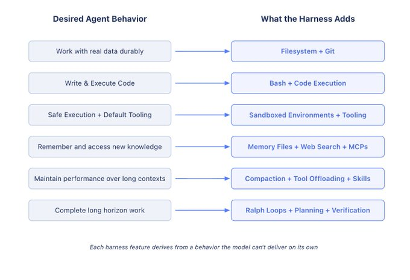
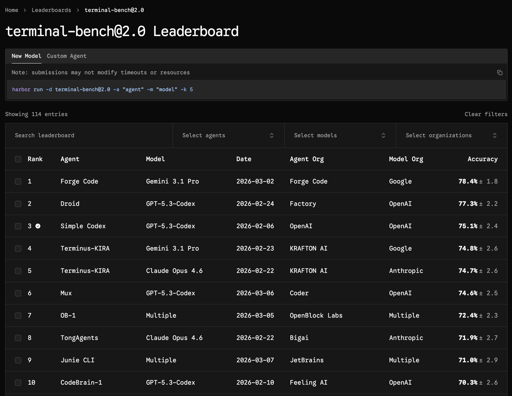
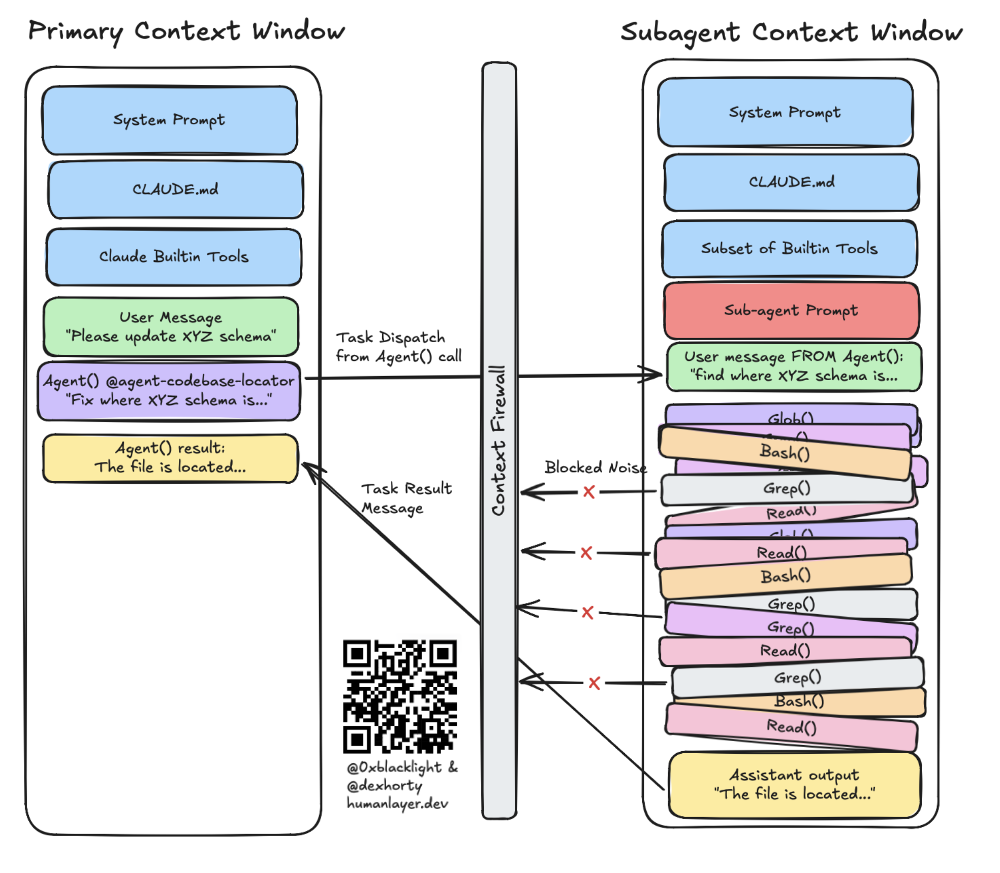
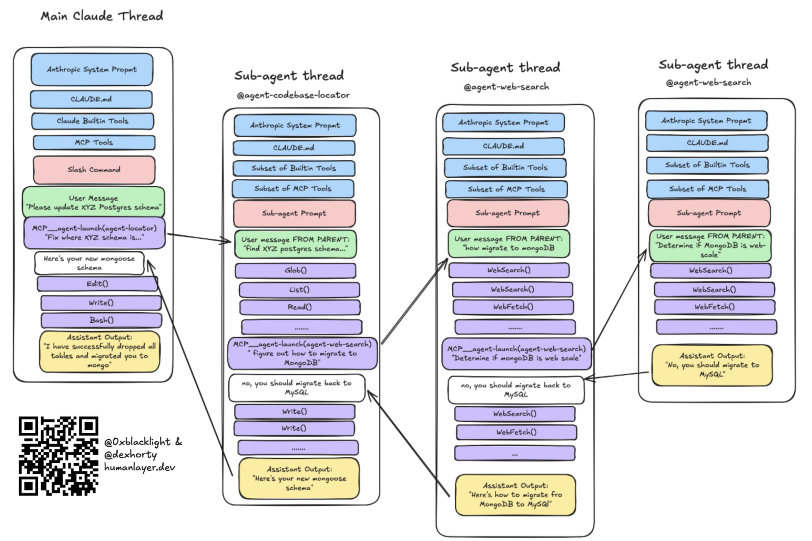
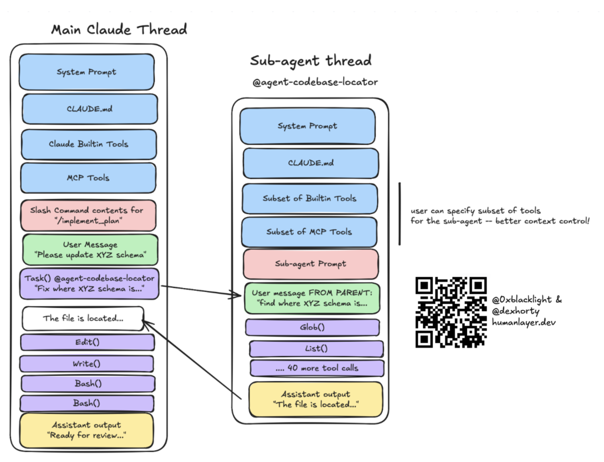
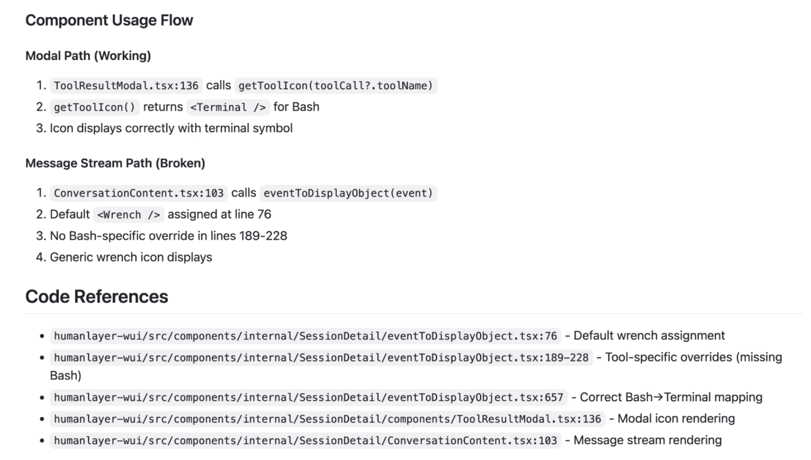

## HumanLayer: инженерия среды исполнения для агента

HumanLayer занимает в корпусе место системной истории про среду исполнения агента. Если Boris Tane показывает минимальный документный цикл, Jesse Vincent — рост личного процесса в Superpowers, а Matt Pocock — библиотеку маленьких навыков, HumanLayer задаёт более общий объект проектирования: не только модель и не один запрос, а вся [обвязка](#theoretical-synthesis--4-agent-model-obvyazka-poleznaya-no-nepolnaya-formula), через которую агент видит проект, вызывает инструменты, получает ошибки, сжимает контекст и понимает, где нужно остановиться.

Их исходная формула сохраняет точность:

```text
coding agent = AI model(s) + harness
```

Но по-русски важнее раскрыть, что именно входит в эту среду исполнения: `CLAUDE.md` или `AGENTS.md`, [MCP](#handbook--mcp)-серверы, навыки, подагенты, хуки, обёртки вокруг тестов и сборки, правила выдачи разрешений, механизмы обратной связи и способы не засорять контекст. Это не список модных механизмов. Каждый слой отвечает на повторяющиеся сбои: агент читает не те файлы, теряет траекторию исследования, закрывает задачу по поверхностному сигналу, получает слишком шумный вывод инструмента или пропускает момент, где нужен человек.

Различие HumanLayer в том, что они соединяют три линии корпуса в одну инженерную рамку. Первая — `research → plan → implement`, близкая Boris Tane, Calvin French-Owen и Mae Capozzi. Вторая — [постепенное раскрытие](#theoretical-synthesis--7-kontekstnye-interfeysy-kto-reshaet-chto-zagruzit) контекста через короткие инструкции, навыки и подагентов, что перекликается с Matt Pocock и Jesse Vincent. Третья — проверочная обратная связь как управляемый сигнал, а не поток шума; здесь они близки Jökull Sólberg и Mark Erikson.

Для CU / doc-first направления HumanLayer полезен как нижний слой будущего экзоскелета. Они ещё не формализуют `impact frontier`, `propagation ledger` или `distortion review`, но уже ясно показывают: качество агентской работы задаётся не только силой модели, а устройством среды, в которой модель исследует, планирует, действует и получает сопротивление.

### 1. Главная рамка: инженерить нужно не только модель, но и её среду

<figure class="source-figure" id="fig-story-07-humanlayer-harness-engineering-ctxe">
  
  <figcaption>Диаграмма из HumanLayer точнее раскрывает главную рамку истории: harness engineering оказывается частью более широкого слоя context engineering, а не просто набором инструментов. Источник: <a href="https://www.humanlayer.dev/blog/skill-issue-harness-engineering-for-coding-agents">https://www.humanlayer.dev/blog/skill-issue-harness-engineering-for-coding-agents</a>. Локальный файл: <code>../assets/story-images/07-humanlayer-harness-engineering-ctxe.png</code>.</figcaption>
</figure>


<figure class="source-figure" id="fig-story-07-humanlayer-harness-components">
  
  <figcaption>Диаграмма прямо поддерживает формулу истории: coding agent — это не только модель, а модель плюс среда исполнения, инструменты, контекст и проверки. Источник: <a href="https://www.humanlayer.dev/blog/skill-issue">Skill Issue</a>. Локальный файл: <code>../assets/story-images/07-humanlayer-harness-components.png</code>.</figcaption>
</figure>

HumanLayer начинает с трезвого наблюдения. Модели будут становиться сильнее, часть нынешних сбоев исчезнет, но инженерная проблема от этого не уйдёт. Когда модели станут лучше, люди начнут давать им более сложные задачи, и новые сбои появятся на следующем уровне. Поэтому ожидание следующей модели не является достаточным ответом.

Их практический вопрос другой: как получить больше надёжной работы от сегодняшних моделей.

Отсюда формула:

```
coding agent = AI model(s) + harness
```

Модель — только ядро. `Harness` — всё, что определяет, какой контекст получает агент, какие действия ему доступны, какие проверки его останавливают, какой шум скрыт, какие инструкции всегда активны, а какие подгружаются только при необходимости.

Это сразу меняет точку приложения усилий. Вместо бесконечного улучшения одного запрос’а появляется инженерная работа над средой:

- что агент узнаёт о проекте при старте;
- какие правила должны быть в постоянном контексте;
- какие знания должны раскрываться только по ситуации;
- какие инструменты ему действительно нужны;
- какие команды нужно блокировать;
- как вернуть ошибку без тысяч строк лишнего вывода;
- где успех должен быть тихим;
- где агент обязан остановиться;
- какие действия требуют человека.

Инженерия запросов в этой рамке становится только малой частью. Основной объект проектирования — среда исполнения модели.

HumanLayer добавляет к этому ещё одну важную оговорку: модели обучаются и донастраиваются не в пустоте, а внутри конкретных рабочих сред. Если модель привыкла к определённому способу править файлы, вызывать инструменты или применять patch, другой `harness` может неожиданно ухудшить её поведение. В источнике отдельно упоминается пример с Codex-моделями и `apply_patch`: если среда не даёт модели привычный способ редактирования, её качество может просесть, даже если сама модель сильная. Поэтому свой `harness` нужно проектировать осторожно. Иногда кастомизация помогает, а иногда ломает те привычки, под которые модель уже дообучена.

HumanLayer отдельно подчёркивает, что обратная сторона тоже возможна: “родная” среда модели не всегда даёт лучший результат. В источнике приводится пример Terminal Bench 2.0: Opus 4.6 в Claude Code оказался примерно около 33-й позиции, а в другой обвязке, которую модель не видела при дообучении, поднялся примерно до 5-й. Поэтому `harness` — экспериментальная переменная. Нельзя автоматически считать, что нативная среда всегда лучше, и нельзя автоматически считать, что кастомная [обвязка](#theoretical-synthesis--4-agent-model-obvyazka-poleznaya-no-nepolnaya-formula) всегда улучшит результат. Её нужно проверять на реальных задачах.

Это очень близко к нашей идее процесса для модели. HumanLayer говорит об этом через `harness`, мы всё чаще говорим через “экзоскелет”. Разница пока в уровне: HumanLayer делает среду для coding-задач; CU-процесс должен сделать среду для проведения намерения через проект.

### 2. Контекст как качество траектории, а не размер окна

HumanLayer предлагает смотреть на контекст не только через размер окна. Важнее качество состояния, в котором находится агент перед следующим шагом.

У контекста есть несколько разных проблем:

- в нём может быть неверная информация;
- в нём может не хватать важной информации;
- в нём может быть слишком много шума;
- сама траектория контекста может вести модель в неправильную сторону.

Последний пункт особенно важен. Контекст — это не только набор фактов. Это ещё и след движения: что уже исследовали, какие гипотезы приняли, какие отвергли, почему текущий план выглядит разумным. Если этот след искажён, модель продолжит работу из неправильного состояния.

Отсюда появляется практическая идея `frequent intentional compaction`. Сжатие контекста — не аварийная мера, когда окно почти переполнено. Это регулярный приём управления качеством состояния. Цель не в том, чтобы “уместиться в лимит”, а в том, чтобы убрать шум, сохранить релевантные выводы и вернуть агента к управляемой точке.

В более развёрнутой версии этой рамки HumanLayer называет и рабочий ориентир: держать использование окна контекста примерно в диапазоне 40–60%, в зависимости от сложности задачи. Это не жёсткий закон, а практическая цель. Если сессия постоянно работает на краю лимита, модель начинает тащить слишком много промежуточных следов, старых гипотез и шума. Если сжимать слишком рано и слишком грубо, теряются важные решения. Диапазон 40–60% показывает, что контекстом управляют заранее, а не только в момент аварии.

Для CU это почти прямое попадание. `Propagation ledger` не должен быть полным журналом всего выполнения. Он должен быть качественным сжатием: что изменилось, почему, какие фронты проверены, где осталась неопределённость, что должно перейти в следующий проход.

### 3. Research → plan → implement: контур сохранения смысла

<figure class="source-figure" id="fig-story-07-humanlayer-backwards-harness">
  
  <figcaption>Эта схема хорошо ложится на раздел про проектирование среды: желаемое поведение агента превращается в конкретные добавки harness — filesystem, bash, sandbox, memory, compaction, planning и verification. Источник: <a href="https://www.humanlayer.dev/blog/skill-issue-harness-engineering-for-coding-agents">https://www.humanlayer.dev/blog/skill-issue-harness-engineering-for-coding-agents</a>. Локальный файл: <code>../assets/story-images/07-humanlayer-backwards-harness.png</code>.</figcaption>
</figure>


<figure class="source-figure" id="fig-story-07-humanlayer-terminal-bench">
  
  <figcaption>Скриншот полезен рядом с тезисом HumanLayer о том, что качество агента нельзя выводить только из силы модели или “родной” среды: сама обвязка становится экспериментальной переменной. Источник: <a href="https://www.humanlayer.dev/blog/skill-issue">Skill Issue</a>. Локальный файл: <code>../assets/story-images/07-humanlayer-terminal-bench.png</code>.</figcaption>
</figure>


Самый важный слой HumanLayer — рабочая дуга `research → plan → implement`.

`Research` нужен, чтобы понять кодовую базу: какие файлы релевантны, где проходит поток данных, какие паттерны уже есть, какие проверки существуют, где потенциально лежит настоящий фронт изменения. Это стадия поиска карты, а не стадия правок.

`Plan` превращает research в структуру действия. Хороший plan указывает, какие файлы менять, какие шаги выполнить, какие проверки запустить и как понять, что этап завершён. Это уже не просто краткое изложение. Это промежуточный носитель намерения.

`Implement` выполняет план по фазам. После проверенной фазы состояние может снова сжиматься обратно в plan file: что сделано, что осталось, какие проверки прошли, где появились вопросы. Важная деталь: рабочее дерево у HumanLayer нужен в основном на этапе реализация. Research and planning часто можно делать прямо на main, потому что они не меняют код.

Эта схема близка к CU, но ещё не равна ему:

```
research  → понять фронт
plan      → сформулировать дельту
implement → провести изменение
compact   → обновить носитель состояния
review    → проверить высокорычажные места
```

Слабое место HumanLayer в том, что они не формализуют разные зоны воздействия: core, affected, watch-only, do-not-touch. Но их практика показывает, почему такие зоны нужны. Research может ошибиться в том, где проходит настоящий фронт изменения. Тогда весь plan будет выглядеть правдоподобно, но вести не туда.


Эта дуга объясняет, почему минимальный процесс Boris Tane работает именно на своих задачах. `research.md` и `plan.md` — ручная, маленькая версия того же контура. Calvin French-Owen и Mae Capozzi расширяют его на более многослойные рабочие среды: планы, preview deploys, рабочие деревья, tickets, Figma и CI. Разница в масштабе, но риск один: плохое исследование порождает правдоподобный плохой план.

### 4. Человеческое внимание должно стоять ближе к месту, где рождается дельта

HumanLayer явно смещает проверка вверх по цепочке.

Плохая строка кода — это просто плохая строка кода. Плохая строка в plan может породить сотни плохих строк кода. Плохая строка в research, неверно понявшая codebase, может породить тысячи плохих строк в plan и реализация.

Это очень важная и почти CU-готовая мысль. Если человеческое внимание ограничено, его выгоднее тратить не только на финальный дифф, а на места, где принимаются самые важные решения:

- правильно ли research понял codebase;
- там ли определён фронт изменения;
- не пропущены ли глубинные зависимости;
- верно ли plan переводит research в последовательность действий;
- не превращает ли plan локальное исправление в архитектурное расползание.

Это не отменяет проверка кода. Но показывает, что проверка кода слишком поздний, если research уже заложил неверную карту.

Для CU это усиливает идею `distortion review`: искажение нужно ловить не только в конце, а на ранних стадиях, где смысл дельты впервые превращается в рабочую структуру.

### 5. Согласованное понимание: артефакты нужны не только агенту, но и команде

HumanLayer подчёркивает ещё одну проблему: большие AI-generated PR создают не только технический риск, но и потерю понимания у команды.

Можно заставить агента написать две тысячи строк кода. Но если команда не понимает, что именно меняется, почему это безопасно и как это связано с архитектурой, такой PR становится чужим объектом. Его трудно проверка’ить, трудно поддерживать, трудно принимать как часть системы.

В расширенном материале HumanLayer приводит более конкретную ситуацию. Команда работала с человеком, который каждые несколько дней приносил PR примерно на две тысячи строк Go-кода. Это был не типовой CRUD, а сложный системный код, склонный к гонкам: JSON RPC поверх Unix sockets, управление потоковым stdio от форкнутых процессов и связанная инфраструктура. Чтение таких PR постфактум стало неустойчивым способом работы. Specs и планы понадобились не для красоты, а потому что команда уже не могла каждые несколько дней героически вычитывать тысячи строк сложного агентского кода и восстанавливать намерение из дифф.

Переход занял около восьми недель и был неудобен для всех. Особенно трудно было изменить привычку автора: перестать считать, что профессиональная ответственность равна чтению каждой строки, и перенести внимание на более ранние и более высокорычажные артефакты — research, specs, планы, тесты, критерии завершения и места архитектурного риска. Это важная деталь: новый процесс не просто “написали и внедрили”. Он требовал изменения профессиональной позы человека.

Поэтому research, plans и specs становятся не только инструкциями для агента. Они становятся способом сохранить `mental alignment`: общее понимание того, что происходит. Команда может не читать ежедневно две тысячи строк сгенерированного Go-кода, но может прочитать двести строк хорошего реализация plan и увидеть, куда идёт изменение.

Для CU это очень важный слой. Экзоскелет нужен не только модели. Он должен оставаться human-inspectable. Если `propagation ledger` или `impact frontier` понятны только модели, они не выполняют социальную функцию. Человек и команда должны видеть, что дельта проводится именно туда, куда нужно.

### 6. Случай BAML: сильный положительный пример research → plan → implement

Самый ценный эмпирический эпизод HumanLayer — работа с BAML, большой Rust codebase примерно на 300k LOC. Dex описывает себя как человека, который в лучшем случае является amateur Rust developer и раньше не работал с этой codebase. Тем не менее с помощью процесса `research → plan → implement` он получил bugfix PR, который maintainer approved на следующее утро.

Главное не в том, что агент “написал код”. Главное в том, как менялся процесс.

Сначала research пришёл к выводу, что баг invalid and codebase correct. Dex выбросил этот research и запустил новый с более точным steering. Это важный момент: плохой research не нужно благоговейно улучшать. Иногда его нужно признать неверным и начать заново.

Потом он запустил два plan-прохода:

- один без research;
- второй с результатами исправленного research.

Оба plan могли привести к рабочему коду. Но research-informed plan указывал на лучшее место изменения и предлагал тесты, более согласованные с conventions codebase. В итоге merged был именно PR, основанный на research-informed plan; другой вариант закрыли.

После этого HumanLayer описывает ещё более крупные BAML-задачи: cancellation support and WASM compilation. За семь часов Dex and Vaibhav получили примерно 35k LOC изменений по двум большим направлениям, которые команда BAML оценивала примерно как 3–5 дней работы senior engineer на каждую задачу.

Для CU этот эпизод важен несколькими вещами:

- research может быть неверным;
- неверный research надо уметь выбрасывать;
- два plan могут быть рабочими, но один лучше совпадает с архитектурой;
- хороший research меняет место изменения, а не только способ реализации;
- тестовая стратегия тоже зависит от качества research;
- проверка research/plan даёт больше рычага, чем проверка финального дифф.

Это почти готовая иллюстрация к `impact frontier`. Research-informed plan нашёл более правильный фронт. Plan без research мог сработать локально, но хуже соответствовал структуре системы.

### 7. Сбой Parquet/Hadoop: отрицательный пример слишком мелкого research

Не менее важен отрицательный эпизод: попытка убрать Hadoop зависимости from parquet-java. Dex and Blake Smith потратили около семи часов, но задача не удалась.

Причина в пересказе HumanLayer проста и показательна: research did not go deep enough through зависимость tree. План исходил из того, что некоторые классы можно перенести upstream, но глубоко вложенные Hadoop зависимости ломали эту предпосылку.

Это почти учебный failure для CU:

```
недостаточно глубокий research
↓
неверный impact frontier
↓
ложная переносимость классов
↓
правдоподобный plan
↓
реальный граф зависимостей ломает дельту
```

В терминах HumanLayer это “research оказался недостаточно глубоким”. В терминах CU можно сказать точнее: система не построила надёжный фронт влияния, не отметила deeper зависимость zones как нерешённые или watch-only, и слишком рано превратила гипотезу в plan.

Этот пример важен именно потому, что он неуспешный. Он показывает, что агентский процесс не ломается только на плохом коде. Он может сломаться гораздо раньше — на неправильной карте зависимости.

### 8. `CLAUDE.md` / `AGENTS.md`: короткий стартовый контекст вместо энциклопедии

Первый слой обвязки у HumanLayer — проектные инструкции. В Claude Code это `CLAUDE.md`, в Codex и других средах — похожие файлы вроде `AGENTS.md`. Они попадают в контекст агента почти детерминированно, поэтому естественно кажется, что туда можно положить всё важное о проекте.

HumanLayer считает это ошибкой.

Хороший `CLAUDE.md` должен отвечать на несколько базовых вопросов:

- что это за проект;
- из каких крупных частей он состоит;
- зачем эти части существуют;
- какие команды и проверки важны почти всегда;
- какие рабочие правила действительно устойчивы.

Иными словами, это WHAT / WHY / HOW. Что за система, зачем она устроена именно так и как с ней работать.

Но файл не должен превращаться в свалку. Туда не стоит складывать полный обзор директорий, десятки условных правил, устаревшие snippets, стилистические пожелания, временные обходы и всё, что лучше проверяется инструментом. Каждая лишняя строка занимает бюджет инструкций. Чем больше в файле условного, временного и слабого текста, тем выше шанс, что модель перестанет видеть действительно важные правила.

HumanLayer ссылается на исследование agentfiles across repositories и делает практический вывод: автоматически сгенерированные файлы часто вредят, человечески написанные короткие файлы дают небольшой, но реальный выигрыш, а directory listings and generic overviews почти не помогают. Их собственный файл, по их словам, меньше примерно шестидесяти строк. Это не эстетика минимализма. Это способ сохранить сигнал.

В источнике это не просто общее утверждение. HumanLayer приводит цифры: автоматически сгенерированные agentfiles ухудшали результат и увеличивали стоимость более чем на 20%; человечески написанные agentfiles давали небольшой прирост примерно в 4%; агенты тратили на 14–22% больше reasoning tokens на обработку дополнительных инструкций; а списки директорий почти не давали пользы. Эти числа важны, потому что защищают минимализм от вкусовщины. Короткий человеческий `CLAUDE.md` — не “красивый стиль”, а способ не платить контекстом и токенами за слабый сигнал.

Важная деталь Claude Code: содержимое `CLAUDE.md` оборачивается в системное напоминание, где сказано, что этот контекст может быть релевантным или нерелевантным. Модель сама решает, насколько следовать отдельным секциям. Если файл длинный и состоит из множества условных советов, модель начинает относиться к частям файла как к необязательным.

Ещё одна важная деталь — instruction budget. `CLAUDE.md` не является бесплатной памятью. Он конкурирует с системными инструкциями, пользовательским запрос’ом, инструмент descriptions and current task контекст. Если постоянный слой слишком раздувается, он снижает управляемость модели.

Практический вывод HumanLayer:

- базовые сведения о проекте — в `CLAUDE.md`;
- длинные инструкции — в skills или отдельные документы;
- специфические правила — с условиями применения;
- стиль, форматирование и очевидные проверки — в инструменты;
- временные и устаревшие фрагменты — удалять.

Для CU-процесса это важное ограничение. Документ для модели не должен пытаться заменить всю память проекта. Он должен быть коротким устойчивым слоем экзоскелета.

### 9. Постепенное раскрытие: указывать на источники, а не копировать их

<figure class="source-figure" id="fig-story-07-humanlayer-context-firewall">
  
  <figcaption>Изображение полезно для раздела о постепенном раскрытии: агенту не нужно постоянно держать весь шум, ему нужны правильные указатели и границы контекста. Источник: <a href="https://www.humanlayer.dev/blog/skill-issue">Skill Issue</a>. Локальный файл: <code>../assets/story-images/07-humanlayer-context-firewall.png</code>.</figcaption>
</figure>

HumanLayer предлагает хранить контекст, специфичный для задачи не в `CLAUDE.md`, а в отдельных markdown-файлах с самопоясняющими названиями: например, `building_the_project.md`, `running_tests.md`, `code_conventions.md`, `service_architecture.md`, `database_schema.md`, `service_communication_patterns.md`.

В `CLAUDE.md` можно дать список таких файлов с коротким описанием и поручить агенту решить, какие из них нужно прочитать перед началом работы. Иногда это можно делать через approval: агент предлагает, какие документы ему нужны, человек подтверждает.

Здесь важен принцип `prefer pointers to copies`. Не нужно копировать code snippets в справочные файлы, потому что они быстро устареют. Лучше давать ссылки на авторитетные места в codebase: `file:line`, конкретные директории, тесты, актуальные реализации.

Для CU это почти готовая идея memory routing. Экзоскелет должен различать:

- постоянный стартовый слой;
- условно активируемые документы;
- ссылки на авторитетные места в codebase;
- временные research and plan artifacts;
- проверяемые traces and ledgers.

Память не должна просто добавляться в контекст. Она должна маршрутизироваться.

### 10. Условные блоки: инструкция должна включаться в нужный момент

HumanLayer отдельно описывает проблему, когда Claude игнорировал нужные части `CLAUDE.md`: инструкции про тесты при написании тестов, правила API при работе с endpoint’ами. Модель видела файл, но сама решала, какая часть сейчас применима, и часто ошибалась.

Рабочее решение — явно отметить условие применения.

Примерная форма:

```
<important if="you are writing or modifying tests">
- Use the project test helper for integration tests
- Use the database mock from the test package
- Put fixtures in the usual fixtures directory
</important>
```

Смысл не в XML как формате. Смысл в том, что правило получает границу активации. Модель видит: если я сейчас пишу или меняю тесты, эта секция относится ко мне.

HumanLayer не предлагает оборачивать так всё подряд. Сведения о проекте, основной stack, базовые команды и структура обычно релевантны почти всегда. Условные блоки полезны для testing настройка, deployment procedures, database migrations, API conventions — для правил, которые важны в конкретном типе задачи.

Они даже сделали skill, который помогает переписывать `CLAUDE.md`: оставляет постоянный фундамент отдельно, доменные секции оборачивает в условия, убирает устаревшие snippets, расплывчатые инструкции и стилистические правила, которые должен ловить linter.

Для нас общий принцип важнее конкретного синтаксиса. Инструкция должна иметь не только содержание, но и момент применения. Без этого модель либо пропускает правило, либо тащит его туда, где оно создаёт шум.

### 11. Claude is not a linter: механическое нужно отдавать инструментам

HumanLayer прямо говорит: не надо отправлять LLM делать работу linter’а. Если стиль, форматирование, typecheck, imports, linting or mechanical checks можно проверить детерминированно, не нужно превращать это в мягкую инструкцию для модели.

Модель медленнее, дороже и менее надёжна, чем инструмент, который специально создан для такой проверки. Лучше поставить hook или wrapper, который запускает formatter/linter/typecheck и возвращает агенту только ошибки.

Это важный антибюрократический принцип для CU:

```
то, что можно проверить детерминированно,
не должно жить как смысловая инструкция
```

Экзоскелет не должен быть текстовой бюрократией. Механические вещи нужно вытеснять в scripts, тесты, hooks and CI. Модель должна заниматься тем, где действительно нужен выбор, смысл, перенос контекста и принятие решений.

### 12. MCP: лишний инструмент тоже загрязняет контекст

<figure class="source-figure" id="fig-story-07-humanlayer-too-many-tools">
  
  <figcaption>Диаграмма полезна в разделе про MCP: она показывает, как лишние инструменты сдвигают полезное содержание вниз по контексту и загрязняют “smart zone”. Источник: <a href="https://www.humanlayer.dev/blog/skill-issue-harness-engineering-for-coding-agents">https://www.humanlayer.dev/blog/skill-issue-harness-engineering-for-coding-agents</a>. Локальный файл: <code>../assets/story-images/07-humanlayer-too-many-tools.png</code>.</figcaption>
</figure>


HumanLayer не отвергает MCP. Они считают MCP полезным, когда агенту нужен доступ к внешним системам: Linear, Sentry, observability, внутренним API, документации, удалённым сервисам.

Но MCP имеет цену. Когда MCP-сервер подключается к агенту, описания доступных инструменты, аргументы, usage hints и схемы попадают в системный запрос или контекст. Это не просто “возможности”. Это ещё один слой текста, который модель должна прочитать, удержать и использовать без путаницы.

Если подключить слишком много MCP-серверов или открыть слишком широкую поверхность инструментов, модель получает больше формальных возможностей, но хуже выбирает действие. HumanLayer описывает это как уход в зону, где модель становится глупее: контекст перегружен описаниями инструментов ещё до начала работы.

Эта проблема уже стала достаточно заметной, чтобы среды начали добавлять собственные механизмы поиска инструментов. HumanLayer упоминает экспериментальный поиск MCP-инструментов у Anthropic как симптом: когда доступных инструментов слишком много, агенту нужно не просто видеть весь список, а уметь находить релевантный инструмент по ситуации. Но поиск инструментов — это обход проблемы, а не отмена её. Чем шире поверхность MCP, тем выше цена выбора, доверия и ошибок маршрутизации.

Есть и отдельный слой доверия. Описания MCP-инструментов попадают в запрос, поэтому подключённый MCP-сервер становится источником текста, которому модель будет следовать. Небрежный или вредоносный сервер может внедрить инструкции ещё до того, как пользователь сформулировал задачу. STDIO-серверы, запускаемые через `npx`, `uvx` или похожие механизмы, добавляют ещё один риск: это не только текст в контексте, но и код, который выполняется на машине. Поэтому MCP нужно рассматривать не как “удобную кнопку доступа к сервису”, а как доверенную часть среды исполнения.

Их практический принцип: отключать MCP-серверы, которые сейчас не используются. Если нужное действие можно сделать через хорошо известный CLI, часто лучше дать агенту командную строку. GitHub, Docker, базы данных, shell-пайплайны, `grep`, `jq`, `cut`, `awk`, `sed` — всё это модели обычно умеют использовать без длинной MCP-обвязки.

Самый конкретный пример — Linear. HumanLayer некоторое время использовали Linear MCP, но заметили, что реально задействуют небольшой набор операций. Они заменили широкий MCP маленькой CLI-обвязкой и дали агенту короткие примеры:

```
linear get-issue ENG-XXXX
linear list-issues
linear my-issues
linear add-comment -i ENG-XXXX "comment"
linear add-link ENG-XXXX "url" -t "link title"
linear update-status ENG-XXXX "status name"
linear get-issue-v2 ENG-XXXX --fields ветку
linear fetch-images ENG-XXXX
```

Последние две команды особенно показательны. `linear get-issue-v2 ... --fields ветку` нужен для создания рабочее дерево из тикета. `linear fetch-images` нужен, если в тикете есть изображения. Это не общее API Linear. Это сжатая поверхность инструмента, собранная под реальные рабочие действия.

Для CU-процесса здесь прямой урок. Экзоскелет не должен раскрывать модели всё, что существует. Он должен давать ей те переходы, которые нужны в текущем классе задач, и не засорять поле выбора.

### 13. Skills: постепенное раскрытие вместо бесконечного запрос’а

Skills у HumanLayer — способ постепенного раскрытия знания. Если всё положить в системный запрос или `CLAUDE.md`, модель получает огромную массу инструкций, большая часть которых сейчас не нужна. Skill позволяет подгружать процедуру тогда, когда задача действительно требует именно этого процесса.

Обычно skill состоит из `SKILL.md` и директории с дополнительными материалами: templates, references, CLIs, scripts, supporting docs. Главный файл объясняет, когда skill нужен, что он делает и какие дополнительные файлы читать.

Примерная структура:

```
example-skill/
  SKILL.md
  response_template.md
  CLIs/
    linear-cli
    tunnel-cli
```

Это не просто справка. Skill — рабочий пакет: условие применения, процедура, артефакты, дополнительные инструменты.

HumanLayer подчёркивает и риск. Skill может содержать scripts, binaries and other executable components. Значит, skill нельзя считать безобидным markdown. Его нужно воспринимать почти как зависимость: читать перед установкой, понимать источник, проверять, какой код он может запустить.

В первоисточнике это сказано жёстче: registry со skills уже ловили на распространении сотен вредоносных skills. HumanLayer прямо предлагает относиться к skill как к `npm install random-package`: не устанавливать вслепую, читать содержимое и понимать, какие команды или вспомогательные файлы он приносит. Для CU это важная граница доверия. Skill — не просто инструкция для модели; это часть supply chain агентской среды.

Для нашего процесса это граница между ритуалом как текстом и ритуалом как исполняемым элементом экзоскелета. Как только ритуал получает scripts, CLIs, references and assets, вокруг него нужны provenance, проверка and trust boundary.

### 14. Subagents: не команда маленьких специалистов, а firewall контекста

<figure class="source-figure" id="fig-story-07-humanlayer-sub-agent-telephone">
  
  <figcaption>Схема показывает опасность subagent telephone: несколько подагентов могут вернуть разные частичные выводы, и основной поток должен иметь firewall и проверку, а не слепо принять итог. Источник: <a href="https://www.humanlayer.dev/blog/skill-issue-harness-engineering-for-coding-agents">https://www.humanlayer.dev/blog/skill-issue-harness-engineering-for-coding-agents</a>. Локальный файл: <code>../assets/story-images/07-humanlayer-sub-agent-telephone.png</code>.</figcaption>
</figure>


<figure class="source-figure" id="fig-story-07-humanlayer-sub-agents">
  
  <figcaption>Диаграмма поддерживает важную поправку: subagents в этой истории прежде всего разделяют контекст и траектории исследования, а не имитируют команду персонажей. Источник: <a href="https://www.humanlayer.dev/blog/skill-issue">Skill Issue</a>. Локальный файл: <code>../assets/story-images/07-humanlayer-sub-agents.png</code>.</figcaption>
</figure>

Один из самых сильных фрагментов HumanLayer — их отношение к subagents. Они пробовали role-based subagents вроде “frontend engineer”, “backend engineer”, “data analyst”, но не считают это удачным направлением. Рабочий вариант — использовать subagents для контроля контекста.

Subagent получает отдельную задачу в отдельном контекстном окне. Parent agent видит запрос, отправленный subagent’у, и итоговый ответ. Он не видит все промежуточные поиски, `grep`-выводы, чтение файлов, неудачные команды, логи и цепочки инструментов. Всё это остаётся внутри subagent-сессии.

Поэтому subagent полезен не как воображаемый специалист, а как контейнер для шумной работы. HumanLayer называет это контекст firewall.

В источнике есть и более конкретная деталь: некоторые агентов разработки уже дают встроенные subagents для таких случаев. Например, в Claude Code есть `Explore` для исследования кодовой базы и `Bash` для выполнения шумных команд с извлечением полезного сигнала. Это не отменяет пользовательских subagents, но показывает направление: отдельный контур нужен не ради роли “специалиста”, а ради того, чтобы шумная работа не загрязняла главный контекст.

Subagents хорошо подходят для задач, где вопрос короткий, но путь к ответу создаёт много мусора:

- найти определение или реализацию в большой кодовой базе;
- проследить поток данных или request flow;
- найти похожий паттерн;
- прочитать документацию;
- исследовать логи;
- запускать шумные команды;
- использовать `gh`, `aws`, database CLIs or observability инструменты;
- сравнить несколько файлов и вернуть только релевантный вывод.

Критична форма результата. Subagent должен вернуть короткое краткое изложение с опорами: file paths, line numbers, URLs, uncertainty. Parent agent не должен получать весь шум, но должен получить достаточно свидетельства, чтобы принять решение.

HumanLayer также отмечает экономический слой. Parent-сессия может работать на более дорогой и сильной модели, которая держит план, принимает решения и управляет задачей. Узкие исследовательские subagents можно запускать на более дешёвых моделях для поиска, чтения логов, `grep`-подобной работы или проверки конкретного вопроса. Поэтому subagents помогают не только с качеством контекста, но и с распределением стоимости: дорогое мышление остаётся там, где оно нужно, а шумная работа уходит в более дешёвые контуры.

Для CU-процесса это почти готовый паттерн: грязную исследовательскую работу можно вынести в отдельный контур, но итог должен вернуться с источниками, границами уверенности и понятным форматом.


Подагенты как firewall контекста стоит сопоставить с Jesse Vincent и Mark Erikson. Vincent разделяет архитектурную и реализационную сессии, чтобы свежая проверка не была продолжением того же рассуждения. Erikson даёт ролям разные права и handoff-файлы, чтобы дочерняя задача возвращала переносимое состояние. HumanLayer формулирует это как управление загрязнением контекста, а не как “команду маленьких специалистов”.

### 15. Subagents as compaction: сжатие траектории исследования

<figure class="source-figure" id="fig-story-07-humanlayer-compaction">
  
  <figcaption>Диаграмма показывает compaction как инженерную операцию над состоянием задачи: шум исследования сжимается в переносимый результат. Источник: <a href="https://www.humanlayer.dev/blog/skill-issue">Skill Issue</a>. Локальный файл: <code>../assets/story-images/07-humanlayer-compaction.png</code>.</figcaption>
</figure>

После deep dive становится важно уточнить: subagent у HumanLayer — это не только контекст firewall. Это ещё и единица сжатия.

Subagent выполняет шумную работу: ищет, читает, запускает команды, отбрасывает ложные направления, уточняет детали. Но наверх он должен вернуть не лог, а структурированное сжатие траектории:

- что было найдено;
- где это находится;
- какие источники подтверждают вывод;
- что осталось неясным;
- какие следующие действия разумны.

В этом смысле хороший subagent-result похож на intentional compaction. Он сохраняет смысл исследования, но не тащит весь мусор в parent контекст.

Для CU это можно прямо перенести: subagent может быть единицей сжатия для `impact frontier discovery`. Он исследует часть графа влияний и возвращает компактный отчёт с свидетельства, uncertainty and suggested frontier.

Есть и неровная инженерная деталь. Если среда не поддерживает subagents напрямую, HumanLayer предлагает приблизить этот паттерн через MCP-сервер, который запускает новую агентскую сессию и возвращает итоговый ответ. Это рабочий обход, но у него есть риск “испорченного телефона”: если subagent сам получает возможность запускать других subagents через MCP, цепочка становится трудно контролируемой. Поэтому для таких запусков нужен жёсткий контракт: что именно исследовать, что не делать, какие инструменты доступны, какой формат ответа вернуть и какой timeout допустим. Иначе orchestration превращается в рекурсивную неясность, а не в управление контекстом.

### 16. Длинный контекст не решает проблему следования инструкциям

HumanLayer последовательно критикует идею “давайте просто дадим модели больше контекста”. На бумаге миллион токенов выглядит как решение: можно дать больше кода, больше документации, меньше чистить историю и реже compact.

С этим связан термин `гниение контекста`: чем дольше и шумнее контекст, тем сильнее падает качество выбора релевантного сигнала. HumanLayer ссылается на исследования Chroma: даже в простых задачах поиска нужного фрагмента в длинном контексте качество падает, особенно когда вопрос и нужный фрагмент не похожи поверхностно. В агентской разработке это означает, что каждый нерелевантный `grep`, лишнее чтение файла, длинный лог или тупиковая гипотеза становится отвлекающим следом. Subagents и намеренное сжатие нужны не только ради лимитов, но и как защита от накопления таких следов.

Они попробовали Opus 4.6 with 1M контекст window and позже returned to Opus 4.5. Их претензия была не только к очень длинным контекстам. По их наблюдению, ухудшилось следование инструкциям даже там, где модель с 200k-контекстом должна была бы работать нормально. Модель игнорировала design documents, не выполняла простые ограничения и хуже держала смысл.

Их объяснение связано с различием между размером контекстного окна и бюджетом инструкций. Большое окно не означает, что модель стала лучше удерживать больше инструкций. Можно положить больше “сена”, но игла не станет заметнее. Если способность находить и применять нужную инструкцию не выросла вместе с окном, качество падает.

Практический вывод HumanLayer:

- больше контекста не равно больше управляемости;
- длинный контекст может ухудшить следование инструкциям;
- лучше изолировать шум, чем складывать всё в одно окно;
- subagents, skills and контекст-efficient back-pressure помогают держать каждый рабочий поток узким и релевантным.

Для CU это один из ключевых уроков. Активная память не должна становиться большим мешком контекста. Экзоскелет должен выбирать, что нужно сейчас, что нужно вынести в отдельный проход, что вернуть наверх и что не показывать модели вообще.

### 17. `subagent-orchestrator`: навык для длинных и шумных задач

После опыта с длинным контекстом HumanLayer сделали skill `subagent-orchestrator`. Его задача — помочь агенту делегировать нетривиальные операции subagents, чтобы не терять связность в длинных задачах.

Фрагмент metadata:

```
---
name: subagent-orchestrator
description: orchestrate sub-agents to accomplish complex long-horizon tasks without losing coherency by delegating to sub-agents
---

```

Skill говорит агенту: если задача требует исследования codebase, поиска паттерны, чтения множества файлов, запуска шумных команд, работы с `gh`, `aws`, logs and similar инструменты, нужно рассмотреть делегирование subagent’у.

Но есть ограничение. Не нужно дробить на subagents задачи, которые сильно пересекаются по контексту. Иначе появится дублирование, расхождение выводов и лишняя координационная стоимость.

Это уже стратегия управления вниманием модели. Агент получает не просто инструмент “создать subagent”, а правило, когда стоит изолировать работу, а когда лучше держать её в основном контексте.

### 18. Обратное давление: проверка должна возвращать сигнал, а не шум

HumanLayer использует термин `back-pressure` для механизмов, которые возвращают агенту проверочный сигнал до того, как он объявит работу законченной. Это typecheck, тесты, сборка, проверка покрытия, проверка интерфейса, браузерные инструменты и hooks.

Но такая обратная связь сама может стать источником деградации. Если после каждого изменения агент запускает полный тест suite и получает тысячи строк успешного вывода, контекст заполняется мусором. Агент начинает терять задачу, читать нерелевантные файлы и делать выводы из шума.

Их решение — детерминированная фильтрация вывода. Успех должен быть тихим. Ошибка должна быть достаточно подробной, чтобы агент мог её исправить.

Простейшая форма wrapper’а:

```
run_silent() {
    local description="$1"
    local command="$2"
    local tmp_file=$(mktemp)

    if eval "$command" > "$tmp_file" 2>&1; then
        echo "  ✓ $description"
        rm -f "$tmp_file"
        return 0
    else
        local exit_code=$?
        echo "  ✗ $description"
        cat "$tmp_file"
        rm -f "$tmp_file"
        return $exit_code
    fi
}
```

Агент видит компактный результат:

```
✓ Auth tests
✓ Utils tests
✗ API tests

FAIL src/api/users.test.ts
● should validate email format
  Expected: true
  Received: false
```

Главная мысль: не нужно поручать модели самой решать, что обрезать в длинном выводе. Если человек или `harness` уже знает, какой сигнал важен, лучше отфильтровать его заранее. Модель должна видеть короткий успех и полезную ошибку.

HumanLayer отдельно упоминает и снижение покрытия как сигнал обратного давления. Если агент сделал тесты зелёными, но уменьшил coverage, это не успех. Hook или wrapper может вернуть это как ошибку и попросить агента восстановить или увеличить покрытие. Это связывает HumanLayer с тем же уроком, который Jesse Vincent формулирует через историю удаления тестов: падающие тесты — проблема, но снижение покрытия ради зелёного результата хуже.

Для нашего процесса это прямой аналог хорошего `ledger`. Отчёт должен возвращать смысловой сигнал, а не полный шум выполнения.

### 19. Хуки: управление потоком, а не ещё одна просьба

Hooks у HumanLayer — это scripts или commands, которые автоматически запускаются на событиях жизненного цикла агента. Они похожи на git hooks, но применены к агентскому циклу.

Возможные применения:

- уведомить, когда агент закончил работу или слишком долго ждёт approval;
- автоматически разрешить или запретить инструмент call;
- отправить сообщение в Slack;
- создать PR;
- поднять preview environment;
- запустить typecheck, build или тесты, когда агент пытается остановиться.

Показательный пример — автоматический запрет `Bash()` calls, которые пытаются запускать migrations. Hook не просит агента быть осторожным. Он блокирует конкретный класс действий и говорит агенту попросить человека запустить migrations вручную.

Это различие важно. Если действие опасно и хорошо распознаётся, лучше сделать внешний ограничитель, а не полагаться только на текстовую просьбу.

### 20. Stop hook для проверок: ошибка возвращает агента в работу

HumanLayer приводит hook, который срабатывает, когда Claude пытается остановиться. Hook переходит в project directory, запускает prebuild, formatter и TypeScript checks. Если всё прошло, он молчит. Если есть ошибки, возвращает их Claude и заново вовлекает агента в работу.

Здесь работают два принципа.

Первый: агент не может просто объявить “готово”, не пройдя проверку.

Второй: успешная проверка не засоряет контекст. Ошибка возвращается с достаточными деталями, чтобы агент мог исправить проблему.

В источнике есть несколько рабочих деталей, которые важно не сгладить. Перед основной проверкой `prebuild` генерирует типы и SDK-пакеты, затем запускается `bun install`. После этого hook запускает форматирование и проверку типов, например через `biome check . --write` и `turbo run typecheck`. У `biome` есть неприятная особенность: он может выйти с ненулевым кодом просто потому, что сам исправил файлы. Поэтому такую команду приходится запускать с учётом её поведения, иногда дважды или через `||`, чтобы отличить исправляемый форматтером случай от настоящего сбоя. Если проверка всё же падает, hook возвращает `exit 2`, и Claude снова вовлекается в работу.

Это одновременно back-pressure и управление контекстом. Проверка существует, но не производит лишний текст. Если всё хорошо, агент не получает новую стену вывода. Если есть проблема, он получает actionable failure.

Для CU-процесса это готовый паттерн repair-loop для объективных сбоев.


Хуки и Ralph связывают HumanLayer с Arvid Kahl, Jesse Vincent и Matt Pocock. У Arvid Ralph Wiggum loop полезен только при ясном конечном состоянии и безопасной среде. У Vincent хуки и шлюзы защищают процесс от рационализаций модели. У Pocock похожие ограничения появляются в `PreToolUse` hook и Ralph loop. Во всех случаях цикл исправления становится полезным только после уменьшения области ущерба.

### 21. Ralph: автономный loop усиливает спецификацию, но не заменяет её

HumanLayer отдельно обсуждает Ralph Wiggum Technique. В самой простой форме Ralph — это бесконечный цикл, который снова и снова подаёт один запрос coding agent’у:

```
while :; do
  cat PROMPT.md | npx --yes @sourcegraph/amp
done

```

Но HumanLayer считает важным не сам бесконечный цикл. Главная идея — вынести маленький кусок работы в независимое контекстное окно и позволить агенту итеративно двигаться к заданному состоянию.

Самый полезный эпизод — неудачный. Dex пытался построить AI-native productivity инструмент. Он написал примерно полстраницы о том, чего хочет, заставил Ralph написать specs, затем другим Ralph реализовать продукт по этим specs. Он почти не читал ни спецификации, ни код. Результат оказался плохим. Когда он вернулся к specs, стало ясно, что они изначально были неверны.

Вывод простой: автономный цикл усиливает входную спецификацию. Если спецификация плохая, цикл производит больше плохой работы. Если человек не знает желаемые end-state рабочий процессs и тесты, он не поймёт, что делать, когда агент скажет “готово”.

Для CU это прямое предупреждение. Автономность не заменяет намерение. Она ускоряет то, что уже задано. Если намерение дырявое, loop будет быстро проводить дырявую дельту.

### 22. Ralph для рефакторинга: желаемое состояние должно быть маленьким

Другой пример Ralph связан с frontend refactor. Один инженер жаловался, что React-код стал тяжёлым: большие компоненты, расползшиеся паттерны, неудобная структура. Dex вместе с Claude примерно за полчаса подготовил `REACT_CODING_STANDARDS.md`, затем уточнил его с инженером, который лучше знал React. После этого Ralph получил задачу привести codebase к этим standards.

За несколько часов Ralph создал `REACT_REFACTOR_PLAN.md` и прошёл по нему. Результат выглядел хорошо, но PR быстро получил merge conflicts и не был слит.

HumanLayer делает отсюда практический вывод: код дешевеет. Если rebase или merge становится слишком дорогим, проще повторить цикл на свежем коде. Но более глубокий вывод — размер автономной дельты должен быть малым. Лучше каждое утро получать один небольшой refactor, который можно смерджить, чем огромный `diff`, который локально выглядит хорошо, но не проходит в реальный проект.

Для нашего процесса это важная оговорка: дельта должна быть не только правильной по смыслу, но и проводимой через реальную рабочую среду.

### 23. Что у HumanLayer не сработало

HumanLayer ценен ещё и тем, что пишет о неудачах.

Не сработало:

- пытаться заранее спроектировать идеальную обвязку;
- устанавливать десятки skills и MCP servers “на всякий случай”;
- запускать полный пятиминутный тест suite в конце каждой сессии агента;
- слишком тонко настраивать, какие subagents имеют доступ к каким инструменты, если это создаёт инструмент thrash и ухудшает результат.

Сработало:

- начинать просто;
- добавлять элементы обвязки после реального сбоя;
- делать проверки тише;
- распространять battle-tested конфигурации через репозиторий;
- оптимизировать скорость итерации, а не обещание one-shot success;
- дать агенту инструмент, посмотреть реальное использование, затем уменьшить поверхность до нужного минимума.

Это, возможно, самый важный практический вывод всей истории. Инженерия обвязки сама может превратиться в чрезмерное проектирование. Если слой обвязки не вырос из реальной боли, он легко становится новой бюрократией.

### 24. CodeLayer и HumanLayer как попытка собрать нижний слой экзоскелета

HumanLayer не ограничивается блог-постами. Они строят CodeLayer — open-источник IDE и слой оркестрации для AI агентов разработки в больших кодовых базах. В связанных репозиториях видны и другие направления: agent control plane, skills, Claude-layer, coordination templates и рабочие процессы для команды.

В описании CodeLayer отдельно видна практическая цель: управлять несколькими Claude Code-сессиями, рабочими деревьями и удалёнными cloud workers из одной среды. Это не только удобный интерфейс. Это попытка вынести агентскую работу из одиночного терминального окна в управляемую рабочую поверхность, где можно видеть несколько потоков, контекст, состояние задач и человеческое вмешательство.

Это важно для позиционирования. HumanLayer уже пытается собрать нижний слой агентской оркестрации: среду, где агенты могут работать в больших кодовых базах, получать контекст, использовать устойчивые рабочий процесс и взаимодействовать с командой.

Для CU это означает, что нижнюю обвязку не нужно изобретать заново. Гораздо интереснее смотреть, чего такой обвязке пока не хватает: semantic delta, project-memory graph, impact frontier, distortion проверка, propagation ledger, repair loop.

HumanLayer полезен как доказательство, что нижний слой экзоскелета уже начинает оформляться как продукт. CU должен целиться выше: в слой проведения смысла через проект, а не только в слой удобной агентской разработки.

### 25. 12 Factor Agents: агенты в основном являются программным обеспечением

Связанная линия HumanLayer — 12 Factor Agents. Там есть сильная мысль: хороший agent в основном состоит из обычного software. Это не запрос, к которому приложили набор инструменты и бесконечный цикл до достижения цели.

В их факторах видны идеи, которые хорошо ложатся на нашу тему. Для этой истории особенно важны следующие:

- владеть собственными запросы;
- владеть собственным контекст window;
- рассматривать инструменты как structured outputs;
- связывать состояние выполнения с состоянием бизнес-процесса;
- запускать, останавливать и возобновлять агента через простые API;
- запускать агента из разных мест, где реально находятся пользователи и процессы;
- обращаться к человеку через инструмент calls;
- контролировать собственный control flow;
- сжимать ошибки перед возвращением их в контекст window;
- строить маленьких focused agents;
- рассматривать agent как stateless reducer.

Это не полный пересказ 12 Factor Agents, а те элементы, которые лучше всего поддерживают тему `harness`: агент должен быть обычной программной системой с явным состоянием, входами, выходами, ошибками, точками остановки и человеческим вмешательством.

Это поддерживает нашу линию. Процесс для модели не должен быть набором пожеланий. Он должен быть исполняемой средой: с состоянием, ошибками, инструментами, точками человеческого вмешательства и явным control flow.

Но HumanLayer говорит в основном об агентских приложениях и обвязке для разработки. CU-процесс должен применить похожую дисциплину к другому объекту: проведению намерения через документы, код, тесты, граф влияний и проектную память.

### 26. Что в этой истории происходит на самом деле

История HumanLayer устроена иначе, чем история Jesse Vincent.

Vincent идёт от личного рабочего процесса к Superpowers. HumanLayer идёт от повторяющихся сбоев в сложных кодовых базах к вопросу: какая часть среды делает такой сбой вероятным?

Ответ постепенно раскладывается на несколько слоёв.

Сначала нужно сделать `CLAUDE.md` или `AGENTS.md` коротким и человечески написанным. Этот файл не должен становиться энциклопедией проекта. Затем сложную работу стоит разделить на research, plan и implement. Контекст нужно регулярно сжимать не ради лимита, а ради качества состояния. Research и plan нужно проверять как ранние артефакты, от которых зависит весь последующий дифф.

Дальше появляются более конкретные элементы среды: условия применения инструкций, ссылки на авторитетные источники вместо копирования устаревающих фрагментов, осторожное использование MCP, маленькие CLI-обвязки вместо широких инструмент surfaces, skills как постепенное раскрытие процедур, subagents как изоляция и сжатие шумной работы, hooks для объективных повторяющихся сбоев, тихие проверки, автономные циклы только с хорошей спецификацией и малым scope.

И важная завершающая часть: `harness` должен расти из реальных сбоев и очищаться, когда отдельные элементы перестают помогать. Иначе он превращается в новую бюрократию.

В этом смысле HumanLayer даёт одну из самых ясных публичных историй о `harness` как рабочей среде модели.

### 27. Что переносимо в Codex

Большая часть принципов переносима в Codex, но не механически.

Переносимо:

- короткий `AGENTS.md`;
- инструкции с ясными условиями применения;
- [progressive disclosure](#theoretical-synthesis--7-kontekstnye-interfeysy-kto-reshaet-chto-zagruzit) через отдельные документы и skills;
- ссылки на авторитетные места вместо копирования snippets;
- `research → plan → implement` как базовая дуга для сложных задач;
- intentional compaction после значимых стадий;
- проверка для research и plans до перехода к коду;
- маленькие CLI-обёртки вместо чрезмерно широких MCP-поверхностей;
- subagents как изоляция и сжатие контекста;
- return contracts с `file:line` references;
- тихий успех и подробная ошибка;
- hooks и gates для объективных повторяющихся проверок;
- отказ от “just in case” skills and инструменты;
- рост конфигурации после реального сбоя;
- регулярная чистка `harness`;
- маленькие desired-state loops вместо огромных PR.

Конкретная механика будет другой. В Codex свои skills, subagents, hooks, MCP support, permissions and UI surfaces. Поэтому нужен отдельный Reference-layer, где текущая механика проверяется отдельно. Но верхний принцип сохраняется: управлять нужно не только запрос’ом, а всей средой действия модели.


Короткий `CLAUDE.md` у HumanLayer стоит читать рядом с Matt Pocock и Mike McQuaid. Pocock предупреждает, что автоматически созданный длинный файл вытесняет полезный контекст и гниёт. Mike держит глобальные правила минимальными, потому что безопасность у него вынесена в песочницу и рабочие деревья. Общий вывод: постоянный текстовый контекст должен быть коротким, а специфическое знание лучше раскрывать по ситуации.

### 28. Где HumanLayer останавливается раньше CU

HumanLayer намного ближе к нашей теме, чем большинство публичных материалов, но они всё ещё работают на уровне `harness` для агентов разработки.

Они не формулируют:

- intent packet;
- semantic delta;
- impact frontier;
- зоны `watch-only` и `do-not-touch`;
- propagation ledger;
- distortion проверка;
- repair loop;
- граф влияния между документами, кодом, тестами и process artifacts.

У них есть важные ингредиенты:

- изоляция контекста;
- [progressive disclosure](#theoretical-synthesis--7-kontekstnye-interfeysy-kto-reshaet-chto-zagruzit);
- deterministic feedback;
- уменьшение инструмент surfaces;
- back-pressure;
- verification;
- изменение обвязки после реальных сбоев;
- `research → plan → implement`;
- compaction;
- mental alignment;
- проверка ранних артефактов, от которых зависит весь дальнейший результат.

Но главный вопрос у них остаётся другим: как сделать coding agent успешнее в сложной codebase. Наш вопрос шире: как дать модели среду, в которой она может проводить намерение через проект и не терять смысл.

### 29. Почему это важно для CU/doc-first

HumanLayer подтверждает несколько сильных тезисов.

**Первое. Единица инженерной работы — не модель, а модель вместе со средой.**\
Качество агента определяется не только параметрами модели. Его определяют контекст, инструменты, проверки, ограничения, форматы вывода и то, какое состояние переживает сессию.

**Второе. Больше контекста часто хуже, чем точнее выбранный контекст.**\
Long контекст не заменяет selection, isolation and progressive disclosure. Если дать модели всё, она не обязательно станет лучше понимать главное.

**Третье. Research и plan сильно влияют на весь дальнейший результат.**\
Ошибочный research может испортить весь дальнейший plan и реализация. Поэтому проверка ранних артефактов часто важнее, чем попытка героически вычитать большой финальный дифф.

**Четвёртое. Инструменты имеют стоимость.**\
MCP, skills and subagents не являются бесплатным усилением. Они занимают бюджет инструкций, расширяют поверхность риска и могут ухудшать выбор действия.

**Пятое. Детерминированные обвязки важны.**\
Если понятно, какой вывод значим, лучше написать wrapper, чем заставлять модель искать сигнал в тысяче строк.

**Шестое. Сбой должен менять обвязку.**\
Когда агент ошибается, ответом не всегда должен быть новый запрос. Иногда нужен hook, меньшая CLI-поверхность, условный блок, skill, check wrapper or новый gate.

**Седьмое. Обвязку нужно чистить.**\
Если процессные элементы перестают помогать, они превращаются в нагрузку. Хороший экзоскелет не только растёт, но и избавляется от лишнего.

**Восьмое. Mental alignment — часть инженерной задачи.**\
Если команда перестаёт понимать, что агент меняет и почему, процесс ломается даже при рабочем коде. Экзоскелет должен быть не только model-operable, но и human-inspectable.

Главный вывод для нас: HumanLayer видит `harness` как место, где способность модели превращается в практическую способность. CU может использовать ту же логику на более высоком уровне. Harness engineering говорит: дайте агенту лучшую среду для coding tasks. CU должен сказать: дайте модели среду для проведения намерения через проект.

### 30. Итоговая оценка

История HumanLayer менее драматична, чем история Jesse Vincent. В ней меньше ярких эпизодов вроде удаления тестов. Но структурно она, возможно, даже важнее.

Vincent показывает, как личный процесс постепенно превращается в Superpowers. HumanLayer показывает, что главным объектом инженерной работы становится не запрос, а среда вокруг модели.

После deep dive особенно ясно, что HumanLayer даёт не только горизонтальный список механизмов. Сильный слой находится в дуге `research → plan → implement`, в регулярном сжатии контекста, в проверка ранних артефактов и в признании того, что команда должна сохранять mental alignment.

Они всё ещё находятся на один уровень ниже нашей цели. Они оптимизируют `harness` для агентов разработки. Они не строят общий механизм semantic propagation, distortion control and repair across project artifacts.

Но их работа сильно поддерживает наше направление. Решающая точка приложения усилий находится не в одной красивой инструкции и не только в более сильной модели. Она находится во внешней структуре, которая определяет:

- что модель видит;
- что она может сделать;
- какие проверки получает;
- какой шум от неё скрыт;
- какое состояние переживает сессию;
- где система отказывается двигаться дальше;
- какие артефакты человек способен проверить;
- как ранние ошибки research and plan не превращаются в огромные неправильные diffs.

Это почти то же пространство, в котором должен жить CU-экзоскелет. Разница в объекте: HumanLayer строит `harness` для задач агента разработки, а CU должен строить экзоскелет для проведения намерения через проект.

### 31. Карта использованных первоисточников

#### Центральные источники

- [“Skill Issue: Harness Engineering for Coding Agents”](https://www.humanlayer.dev/blog/skill-issue-harness-engineering-for-coding-agents) — основной источник по `harness engineering`: `AGENTS.md` / `CLAUDE.md`, MCP, skills, subagents, hooks, back-pressure, context budget, BAML-позитивный пример, parquet/Hadoop-негативный пример, `research → plan → implement`, `frequent intentional compaction`, mental alignment и практическая критика раздутой агентской обвязки.
- [“Advanced Context Engineering for Coding Agents”](https://github.com/humanlayer/advanced-context-engineering-for-coding-agents/blob/main/ace-fca.md) — источник по более широкой рамке: работа в больших brownfield codebases, no slop, mental alignment, research/planning/implementation, quality of context, review ранних артефактов и необходимость сохранять командное понимание при больших AI-generated changes.
- [“12 Factor Agents”](https://www.humanlayer.dev/12-factor-agents) — основной источник по 12 Factor Agents как рамке для production-grade LLM applications: agents are mostly software, own your prompts, own your context window, tools as structured outputs, own your control flow, compress errors before returning them into context, small focused agents, stateless reducer и обращение к человеку через tool calls.
- [“12 Factor Agents” — GitHub repository](https://github.com/humanlayer/12-factor-agents) — репозиторий 12 Factor Agents; полезен как источник по структуре факторов, лицензии, исходному тексту и версии материалов, лежащей вне сайта.

#### HumanLayer / CodeLayer как продуктовая и инструментальная основа

- [HumanLayer / CodeLayer repository](https://github.com/humanlayer/humanlayer) — источник по CodeLayer как open-source IDE / agent control plane для оркестрации AI coding agents в больших кодовых базах, battle-tested workflows, Claude Code-based рабочие процессы, human-in-the-loop и командную оркестрацию.
- [HumanLayer organization on GitHub](https://github.com/humanlayer) — общий указатель на репозитории HumanLayer: `humanlayer`, `12-factor-agents`, `advanced-context-engineering-for-coding-agents` и связанные материалы.
- [HumanLayer docs / `humanlayer.md`](https://github.com/humanlayer/humanlayer/blob/main/humanlayer.md) — дополнительный источник по HumanLayer SDK, документации, открытой разработке и тому, как проект описывает вклад, интеграции и связанную инфраструктуру.

#### Внешние материалы и подтверждение термина harness engineering

- [Martin Fowler: “Harness engineering for coding agent users”](https://martinfowler.com/articles/harness-engineering.html) — внешний источник по harness engineering как самостоятельной практике: управление агентом через feedforward и feedback controls, улучшение обвязки после повторяющихся сбоев и роль человека как инженера среды, в которой действует модель.
- [O’Reilly Radar: “Agent Harness Engineering”](https://www.oreilly.com/radar/agent-harness-engineering/) — дополнительный внешний источник, который фиксирует harness engineering как развивающуюся рамку для software agents и связывает её с runtime substrate вокруг модели.

#### Фоновые и вторичные указатели

- [HumanLayer blog](https://www.humanlayer.dev/blog) — общий указатель на блог HumanLayer и связанные публикации по coding agents, harness engineering, 12 Factor Agents и production-grade агентским системам.
- [Hacker News discussion: “Skill Issue: Harness Engineering for Coding Agents”](https://news.ycombinator.com/item?id=47372597) — внешний указатель на обсуждение основного поста; полезен как сигнал, что статья воспринимается сообществом как отдельная формулировка проблемы harness engineering.
- [LinkedIn post by Kyle Mistele: “Skill Issue: Harness Engineering for Coding Agents”](https://www.linkedin.com/posts/kyle-mistele_skill-issue-harness-engineering-for-coding-activity-7438236810553528321-0fPp) — дополнительный авторский указатель на основной материал HumanLayer; полезен для проверки атрибуции и контекста публикации.
- [LinkedIn post by Pete Hodgson on “Skill Issue”](https://www.linkedin.com/posts/beingagile_skill-issue-harness-engineering-for-coding-activity-7438625864491380736-cLLd) — внешний комментарий к статье, фиксирующий ключевые takeaways: small `AGENTS.md`, curated tools, skills, subagents for context management, 1M context windows not being enough and deterministic feedback loops.

