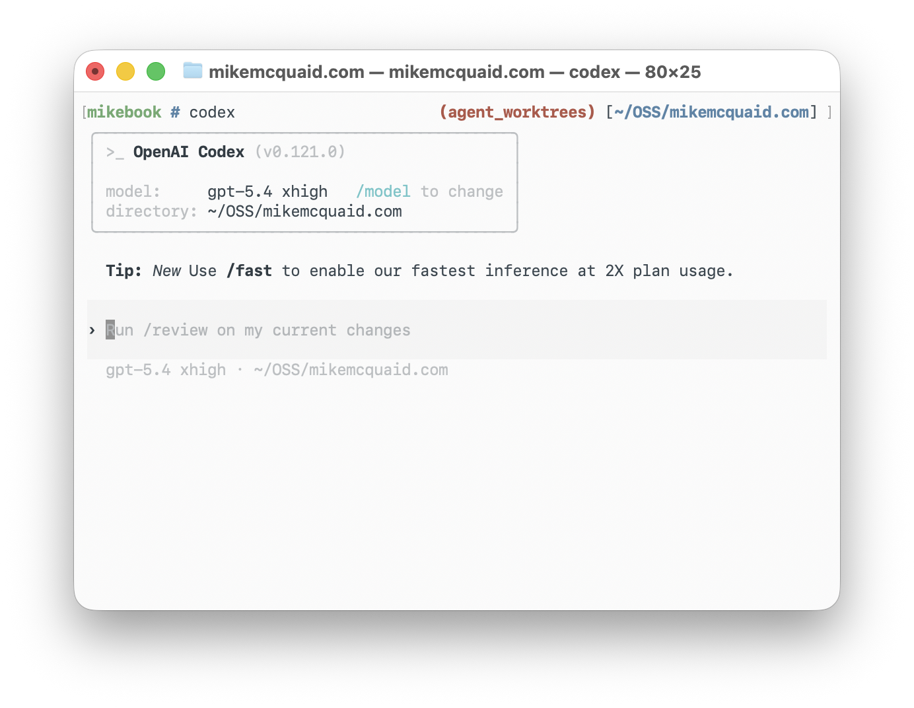
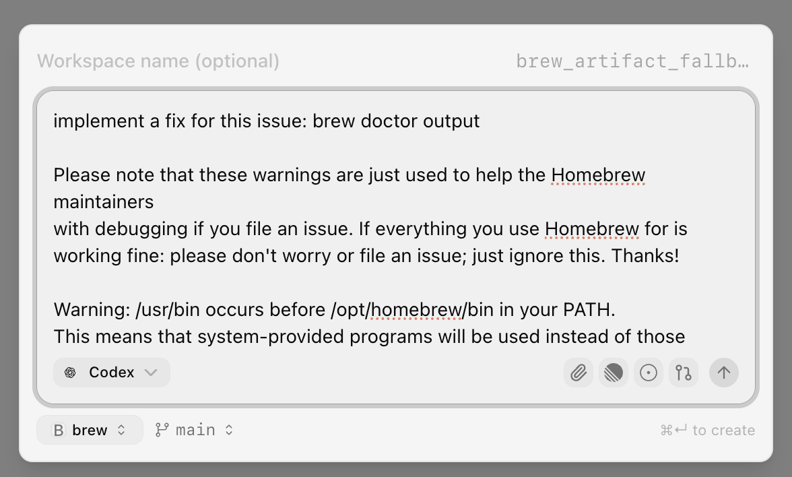
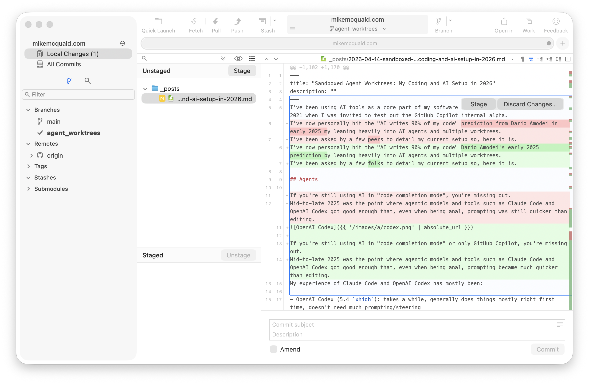

## Mike McQuaid: песочница, рабочие деревья и безопасная параллельность для агентской разработки

История Mike McQuaid отвечает на тот же вопрос, который проходит через Arvid Kahl, HumanLayer и Peter Steinberger: как дать агенту больше самостоятельности и не расширить [радиус ущерба](#handbook--sandbox-permissions). Отличие Mike в уровне ответа. Он решает проблему не длинным `AGENTS.md`, не одним планом и не просьбой к модели быть осторожной, а перестройкой среды исполнения: отдельный пользователь macOS, `sandbox-exec`, общая директория, [рабочие деревья](#handbook--worktrees-parallelism) Git, [Superset](#handbook--worktrees-parallelism), локальная проверка и правила Homebrew для PR, подготовленных с помощью ИИ.

В корпусе это самая инфраструктурная история про безопасность. У Arvid похожая граница задаётся через `allow` / `deny`, тестовую среду и запреты на действия с данными. У Vincent и Mae рабочие деревья помогают не смешивать задачи. У Peter Steinberger, наоборот, виден экспертный режим работы прямо на `main`, который Mike фактически отвергает как общий вариант. Mike переносит безопасность туда, где модель не может рационализировать обход правила: в учётную запись, файловые права, песочницу и физическое разделение рабочих деревьев.

Его ответ складывается в цепочку:

```text
подтверждения команд раздражают → Sandvault
один агент становится узким местом → рабочие деревья Git
несколько клонов путают состояние → единый каталог рабочих деревьев в Superset
новое рабочее дерево не готово → script/bootstrap
много рабочих деревьев трудно проверять → presets для Fork и Zed
PR, созданные с ИИ, перекладывают работу на мейнтейнеров → правила Homebrew
личной памяти CTPO не хватает → проект Superset с заметками, целями и расшифровками
```

Главная формула истории сохраняется:

> Чтобы агентам дать меньше подтверждений и больше параллельности, сначала нужно уменьшить их права, затем разнести изменения по отдельным рабочим деревьям, а перед публикацией результата оставить обязательную человеческую проверку.

Для будущего doc-first процесса эта история важна как напоминание: документы и проверки управляют смыслом работы, но не заменяют границы исполнения. Если агент может читать секреты или менять чужие файлы, красивый план не является достаточной защитой.

### 1. Контекст: Homebrew, Workbrew и долгий опыт автоматизации

Mike McQuaid — Project Leader Homebrew и CTPO Workbrew. Он поддерживает Homebrew с 2009 года, был одним из ранних мейнтейнеров проекта, а с 2019 года является избранным Project Leader. До Workbrew он десять лет работал в GitHub. ИИ-инструменты он использует не с момента шума вокруг “vibe coding”, а с 2021 года, когда тестировал внутреннюю альфу GitHub Copilot.

Этот контекст важен. Mike работает не в маленьком личном репозитории. Он одновременно:

- поддерживает один из ключевых инструментов с открытым кодом для разработчиков на macOS и Linux;
- сталкивается с большим потоком issues, PR и внешних участников;
- отвечает за безопасность и устойчивость проекта, которым пользуются миллионы людей;
- профессионально думает об инструментах разработки, CI, GitHub, доступах и политике мейнтейнеров;
- сам активно использует Codex и Claude для разработки.

В профиле Open Source Initiative хорошо видна его базовая логика безопасности Homebrew: мейнтейнерство — это ответственность, а не привилегия; людям дают минимальный доступ, достаточный для работы; автоматизация активно используется, но результат перед отправкой пользователям должен подтверждать человек; компоненты Homebrew проектируются так, чтобы не полностью доверять друг другу. Эта логика напрямую переносится в его агентскую рабочую среду. Агент может быть полезным, но ему не нужно доверять всю машину.

### 2. Сдвиг: от автодополнения к генерации изменений

В “Sandboxes and Worktrees: My secure Agentic AI Setup” Mike пишет, что к середине и концу 2025 года агентские инструменты вроде Claude Code и OpenAI Codex стали достаточно хороши, чтобы запрос к агенту часто был быстрее ручного редактирования, даже если человек очень придирчив к коду.

Он сравнивает свой опыт с двумя основными агентами:

- **OpenAI Codex** с настройкой `5.4 xhigh`: работает дольше, но обычно делает задачу правильнее с первого раза и требует меньше направляющих уточнений;
- **Claude Code** с Opus `4.6 max`: по его оценке, в варианте по умолчанию чаще требует жёстких hooks, инструментов и подсказок, чтобы работать менее глупо.

Основной ежедневный инструмент у него — OpenAI Codex, но токены заканчиваются быстрее, поэтому он использует и Claude. Эта деталь не бытовая. Она объясняет, почему среда не привязана к одному агенту. [Sandvault](#handbook--sandbox-permissions) и Superset настроены так, чтобы запускать разные инструменты: Codex, Claude, Gemini, OpenCode и shell. Модель может меняться, но слой исполнения остаётся похожим.

Отсюда появляется главный инженерный вопрос: если агенты уже могут делать много работы, как дать им достаточно свободы без доступа к основной учётной записи, токенам и чувствительным файлам?

### 3. Проблема подтверждений: “да, это безопасно” и “нет, это опасно”

Mike формулирует первую проблему очень конкретно: при работе с агентами быстро начинаешь тратить половину жизни на подтверждения. Нужно постоянно говорить: “да, это безопасное действие, выполняй” и “нет, это опасное действие, не выполняй”.

Такой режим раздражает по двум причинам.

Первая причина — скорость. Если каждое безопасное действие требует человека, агент перестаёт быть автономным исполнителем и превращается в медленный интерактивный shell.

Вторая причина — безопасность. Подтверждения сами по себе не создают системную защиту. Человек может устать, пропустить опасный вызов или разрешить слишком широкое действие.

У многих агентов есть режимы вроде “bypass permission checks”, “run without sandbox”, “YOLO” и похожие варианты. Они снимают трение, но переносят риск на основную машину. Mike описывает выбор так:

```text
1. отключить проверки, играть с огнём и надеяться, что ничего плохого не случится;
2. запускать агента в изолированной среде: VM, отдельная машина, песочница, отдельный пользователь, меньше прав, меньше токенов и меньше доступа.
```

Он выбирает второй вариант. Причина не только в личной осторожности. Он связывает это с ответственностью мейнтейнера Homebrew: на машине есть токены, доступы, репозитории, файлы и рабочее состояние, которому нельзя доверять неподконтрольный агент.

### 4. Почему не Docker

Более привычным ответом могла бы быть среда на Docker или виртуальная машина. Mike прямо пишет, что у него “аллергия” на Docker для локальной macOS-разработки. Это не общая теория, а конкретная рабочая причина. У него много локальной инфраструктуры macOS, Homebrew, shell-скриптов, Git-утилит, редакторов и привычных путей. Переносить всё это в Docker ради каждого агентского запуска слишком тяжело.

В README Sandvault отдельно перечислены альтернативы: ClodPod и Chamber запускают Claude Code внутри виртуальной машины macOS, а Claude Code Sandbox использует Docker-контейнер на Linux. Для части проектов это может быть нормальным решением. Mike выбирает другой компромисс, потому что ему нужна нативная macOS-разработка без накладных расходов виртуализации и без полного переноса рабочего процесса в контейнер.

Ему нужен промежуточный вариант:

- локальная разработка остаётся нативной для macOS;
- агент не работает от имени основного пользователя;
- доступ к домашней директории, токенам и чувствительным файлам ограничен;
- запуск остаётся быстрым, без виртуальной машины и тяжёлого контейнерного цикла;
- можно пользоваться привычными агентами: Codex, Claude, Gemini, OpenCode;
- можно автоматизировать браузер и iOS Simulator, не превращая песочницу в отдельную GUI-машину.

Sandvault становится таким промежуточным вариантом.

### 5. Sandvault: отдельный пользователь macOS плюс `sandbox-exec`

<figure class="source-figure" id="fig-story-08-mike-sv-claude">
  
  <figcaption>Скриншот показывает, что безопасность у Mike находится не в просьбе к модели, а в отдельной среде запуска. Источник: <a href="https://mikemcquaid.com/sandboxes-and-worktrees/">Sandboxes and Worktrees</a>. Локальный файл: <code>../assets/story-images/08-mike-sv-claude.png</code>.</figcaption>
</figure>

Sandvault запускает агентов в отдельной учётной записи macOS и дополнительно ограничивает доступ через `sandbox-exec`. На уровне быстрого старта это выглядит просто:

```bash
brew install sandvault
sv claude
sv codex
sv opencode
sv gemini
sv shell
```

Есть и короткие алиасы: `sv cl`, `sv co`, `sv o`, `sv g`, `sv s`. Команда `sv shell` запускает shell внутри песочницы.

Смысл не в синтаксисе. Агент действует не как основной пользователь. Он работает как пользователь `sandvault-$USER` или похожая учётная запись, с меньшими правами и ограниченной видимостью файлов.

Sandvault устроен как защита в несколько слоёв. Отдельная учётная запись macOS ограничивает права агента на уровне пользователя, а `sandbox-exec` добавляет отдельный слой ограничения доступа к файлам и системным ресурсам. Это важная деталь: Mike не полагается только на “пользователь будет осторожен” и не переносит безопасность в текстовую инструкцию для модели. Он уменьшает права на уровне среды, в которой агент выполняет команды.

Согласно README Sandvault, модель доступа примерно такая:

- нельзя читать домашнюю директорию основного пользователя;
- запуск идёт с правами обычного пользователя, без прав администратора;
- нельзя изменять системные файлы;
- нет доступа к смонтированным дискам;
- можно писать в `/Users/Shared/sv-$USER`, доступный и основному пользователю, и пользователю Sandvault;
- можно писать в `/Users/sandvault-$USER`, домашнюю директорию пользователя Sandvault;
- системные директории вроде `/usr`, `/bin`, `/etc`, `/opt` доступны только для чтения;
- другие пользовательские директории под `/Users/*` недоступны.

Для Mike это закрывает большую часть рисков, которые его реально беспокоят:

- агенту труднее сделать `rm -rf` по файлам вне рабочей области и не под контролем Git;
- агент не использует обычный `GITHUB_TOKEN` для действий в чувствительных репозиториях;
- агенту сложнее прочитать и отправить куда-то чувствительные файлы;
- агент работает в среде, которую можно перестроить или удалить отдельно.

Он отдельно отмечает, что для проектов с открытым кодом меньше боится утечки самого кода. Для закрытых репозиториев риск другой. Sandvault не делает работу абсолютно безопасной, но меняет соотношение риска и скорости.


Sandvault показывает более жёсткую версию того, что Arvid Kahl делает через `allow` / `deny`, а HumanLayer — через хуки и управление потоком. У Arvid и HumanLayer часть защиты остаётся внутри агентской среды и правил инструмента. У Mike граница проходит ниже: пользователь, файловые права и `sandbox-exec`. Это важно там, где агенту нельзя доверять даже чтение домашней директории.

### 6. Команды Sandvault: запуск, shell, стандартный ввод, clone, native install

У Sandvault есть несколько деталей, которые важны для реальной работы, а не только для рассказа о безопасности.

Обычный запуск агента:

```bash
sv codex
sv claude
sv gemini
sv opencode
sv shell
```

Можно передавать аргументы агенту после `--`:

```bash
sv gemini -- --continue
```

Можно запустить shell-команду в песочнице и выйти:

```bash
sv shell /Users -- pwd
```

Можно передать вход через стандартный ввод:

```bash
cat PROMPT.md | sv gemini
```

Можно клонировать локальный или удалённый Git-репозиторий в песочницу:

```bash
sv codex --clone https://github.com/webcoyote/sandvault.git
sv codex -c ~/src/my-app
```

Для локальных Git-репозиториев Sandvault настраивает remote `sandvault`, чтобы из основного репозитория можно было сделать `git fetch sandvault` и получить коммиты, сделанные внутри песочницы.

Есть и `--native-install` / `-N`: инструменты устанавливаются внутри песочницы своими установщиками, а не через Homebrew на хосте. Например, Claude Code через install script, Codex через `npm install -g @openai/codex`, OpenCode через свой установщик, Gemini через `npm install -g @google/gemini-cli`. Можно задать:

```bash
export SANDVAULT_ARGS="--native-install"
```

Тогда `sv claude` будет по умолчанию использовать такую установку.

Эти детали показывают, что Sandvault — не только ограничитель, но и рабочая оболочка. Он должен быть достаточно удобным, чтобы разработчик не обходил его при первой сложности.

### 7. `SANDVAULT_ARGS`, обслуживание и наблюдаемость агентов

<figure class="source-figure" id="fig-story-08-mike-codex">
  
  <figcaption>Скриншот полезен как практическое подтверждение: одна и та же sandbox-логика применяется не к одному агенту, а к разным инструментам. Источник: <a href="https://mikemcquaid.com/sandboxes-and-worktrees/">Sandboxes and Worktrees</a>. Локальный файл: <code>../assets/story-images/08-mike-codex.png</code>.</figcaption>
</figure>

Sandvault позволяет задавать аргументы по умолчанию через `SANDVAULT_ARGS`:

```bash
export SANDVAULT_ARGS="--verbose --ssh"
```

Тогда обычный `sv claude` будет эквивалентен `sv --verbose --ssh claude`. Это полезно, если пользователь предпочитает SSH-режим или хочет больше диагностического вывода.

Есть команды обслуживания:

```bash
sv build
sv build --rebuild
sv --fix-permissions
sv uninstall
```

`sv build --rebuild` обновляет права и ACL в общем томе. `sv --fix-permissions` помогает при строгом `umask`, например `077`. `sv uninstall` удаляет Sandvault, но не удаляет файлы в общей директории.

Ещё одна деталь из README — интеграция с `agentsview`. Если `agentsview` установлен на хосте, `sv-agentsview-setup` может зеркалировать историю сессий из песочницы, чтобы dashboard на хосте видел сессии из песочницы рядом с обычными. Это важно концептуально: если агенты работают в отдельной среде, их сессии не должны становиться невидимыми для человека. Иначе безопасность достигается ценой потери наблюдаемости.

### 8. Ограничения Sandvault: вложенная песочница, Swift/Xcode, GUI-приложения

Sandvault решает не всё. README прямо описывает несколько неровных мест.

Первое — вложенные песочницы. Sandvault сам запускает приложения через macOS `sandbox-exec`. Некоторые инструменты, например `swift` и `xcodebuild`, уже используют собственную песочницу. macOS не поддерживает рекурсивные песочницы в таком виде, поэтому такие приложения могут падать.

Для `swift` предлагается отключать песочницу при запуске внутри Sandvault:

```bash
ARGS=()
if [[ -n "${SV_SESSION_ID:-}" ]]; then
    ARGS+=(--disable-sandbox)
fi
swift build "${ARGS[@]}" "$@"
```

Для `xcodebuild` используются переменные и флаги вроде:

```bash
export SWIFTPM_DISABLE_SANDBOX=1
export SWIFT_BUILD_USE_SANDBOX=0
-IDEPackageSupportDisableManifestSandbox=1
-IDEPackageSupportDisablePackageSandbox=1
OTHER_SWIFT_FLAGS=$(inherited) -disable-sandbox
```

Второе — режим без `sandbox-exec`:

```bash
sv -x claude
sv --no-sandbox codex
sv --no-sandbox shell $HOME/projects/my-app -- xcodebuild ...
```

Это всё ещё запуск под пользователем Sandvault, но без дополнительного `sandbox-exec`. README прямо отмечает последствия: нет защиты от чтения и записи на сменных дисках под `/Volumes/...`, нет защиты от записи в файлы с правом `o+w`.

Третье — GUI-приложения. Sandvault README говорит, что запуск GUI-приложений из sandbox-учётной записи не работает из-за ограничений macOS и WindowServer другого пользователя. Это важная граница. Sandvault хорош для CLI-агентов и автоматизации, но не является полной виртуальной рабочей станцией с GUI.

При этом Sandvault не сводится только к shell-песочнице. В README есть отдельный слой browser automation: браузер запускается на стороне хоста в headless-режиме, а процесс в песочнице подключается к нему через Chrome DevTools Protocol по `localhost`. Поддерживаются Chrome и Lightpanda:

```bash
sv --browser claude
sv --chrome claude
sv --lightpanda claude
sv --endpoint
```

Внутри песочницы появляется переменная `SV_BROWSER_ENDPOINT`; Playwright или Puppeteer могут подключиться к этому endpoint. Это важный компромисс: GUI-приложение не запускается внутри учётной записи Sandvault, но агент всё равно может проверять web-интерфейс через управляемый браузер на стороне хоста.

Похожая схема есть для iOS Simulator. Simulator остаётся GUI-приложением на стороне хоста, а песочница получает HTTP-мост через `SV_IOS_SIMULATOR_ENDPOINT`. Команды вроде этих проверяют готовность симулятора, читают accessibility tree, нажимают кнопку, запускают приложение и сохраняют screenshot:

```bash
sv --ios claude
sv --ios-gui shell
curl $SV_IOS_SIMULATOR_ENDPOINT/ready
curl $SV_IOS_SIMULATOR_ENDPOINT/describe
curl -X POST -H 'Content-Type: application/json' -d '{"name":"Sign In"}' $SV_IOS_SIMULATOR_ENDPOINT/tap
curl -o high_res.png $SV_IOS_SIMULATOR_ENDPOINT/view_pixels
```

Для каждой `--ios`-сессии создаётся свежий scratch simulator с именем вида `sandvault-<session-id>`, а мост разрешает ограниченный набор команд `xcrun simctl` и `iosef`. Есть и дополнительные ограничения: `.app` bundles для установки должны лежать под `/Users/Shared/`, иначе мост отклоняет путь; subprocess-вызовы строятся через явные списки аргументов, а не через shell. Это маленькая, но важная деталь безопасности: мост не должен превращаться в произвольный shell-канал из песочницы наружу.

Это снова не идеальная GUI-песочница, а практический мост. Агент получает возможность тестировать iOS-сценарии, но сам Simulator остаётся под контролем хоста, а допустимые действия проходят через ограниченный HTTP-интерфейс.

Эти неровности важны. Иначе легко представить Sandvault как гладкую универсальную песочницу. На деле это рабочий компромисс: очень полезный для CLI-агентов на macOS, но требующий специальных обходов для Swift/Xcode, мостов для browser/iOS automation и понимания, что GUI-приложения внутри Sandvault полноценно не запускаются.

### 9. Общая директория: `/Users/Shared/sv-mike`

После запуска агентов под отдельным пользователем появляется новая проблема: как удобно делиться кодом между основным пользователем `mike` и пользователем Sandvault `sandvault-mike`?

Раньше Mike клонировал репозитории с открытым кодом в `~/OSS/*`, а рабочие репозитории работодателя — в директории вроде `~/Administrate`. С Sandvault он переносит структуру под общую директорию:

```text
/Users/Shared/sv-mike/repositories
/Users/Shared/sv-mike/рабочих деревьев
```

`/Users/Shared/sv-mike/repositories` используется для основных клонов. `/Users/Shared/sv-mike/рабочих деревьев` — для рабочих деревьев. Такая схема даёт безопасное место, доступное и основному пользователю, и пользователю Sandvault.

Но Git начинает ругаться на директории с правом групповой записи и на владельцев. Поэтому нужно добавить безопасную директорию в `~/.gitconfig` для обоих пользователей:

```ini
[safe]
    # It's expected that sandvault directories are owned by another user.
    directory = /Users/Shared/sv-mike/repositories/*
```

Это реальная инженерная деталь, без которой совет “просто запускайте агента в песочнице” быстро ломается. Нужно решить права файлов, общий путь, конфигурацию Git и поведение shell.

### 10. Dotfiles и цветной запрос

Mike также настраивает dotfiles для пользователя Sandvault. Dotfiles можно положить в:

```text
/Users/Shared/sv-${USER}/user
```

Они копируются в соответствующего пользователя Sandvault, например `sandvault-mike`. Mike ссылается на свой `script/sync` как пример.

Он также рекомендует использовать запрос другого цвета для пользователя Sandvault, чтобы сразу видеть, что находишься внутри песочницы. Это маленькая, но важная операционная деталь. Если пользователь не отличает основной shell от shell песочницы, он может случайно выполнить команду не там.

В агентской разработке такие детали имеют вес. Изоляция должна быть видимой. Иначе человек со временем начнёт ошибаться: где он сейчас, под каким пользователем работает агент, какие токены доступны, какие файлы можно трогать.

### 11. Sandvault как ответ на подтверждения команд

После настройки Sandvault Mike получает режим, где можно меньше подтверждать безопасные действия. Песочница не делает агента “безопасным вообще”, но меняет компромисс.

Без песочницы выбор грубый:

```text
много подтверждений → медленно, безопаснее
мало подтверждений → быстро, опаснее
```

С Sandvault появляется средний вариант:

```text
мало подтверждений внутри ограниченной среды
→ быстрее
→ меньше риск для основной учётной записи, токенов и файлов
```

Короткая заметка Mike от 3 марта 2026 формулирует это ещё жёстче: coding agents намного продуктивнее в YOLO mode для некоторых задач, если есть хорошая песочница; его любимый вариант — Sandvault, потому что не нужен Docker.

Главный принцип: безопасность переносится из запрос в среду. После этого агенту можно дать больше свободы.

### 12. Почему одного агента уже мало

Когда Sandvault стал работать с Claude и Codex, Mike смог свободнее запускать агентов. Тогда проявилось следующее ограничение: один агент за раз становится узким местом, особенно если пользователь уже платит за больше токенов, чем реально использует.

Сначала легко распараллеливать работу между разными репозиториями. Но Mike захотел параллелить работу в одном и том же репозитории. Его первый грубый вариант — два клона:

```text
homebrew
homebrew2
```

Он пишет, что это работало, но выглядело неприятно. Главная проблема — помнить, что было сделано в каком клоне. Это признак временного обхода: нагрузка увеличилась, а структура состояния держится в голове человека.

Рабочие деревья Git решают это лучше. Несколько веток одного репозитория могут быть одновременно извлечены в разных директориях. Каждая задача получает своё рабочее дерево, свою ветку и свой дифф.

### 13. Worktrees как форма параллельной записи

Mike хорошо знает Git и даже написал книгу о нём, но признаёт, что давно не игрался с рабочих деревьев. Он не хотел вручную строить всю систему вокруг них, потому что уже написал набор вспомогательных Git-алиасов вокруг Sandvault.

Сначала знакомый CTO подсказал Conductor как способ запускать несколько агентов с рабочими деревьями. Conductor выглядел потенциально полезно, но Mike не смог удобно совместить его с Sandvault.

Затем он нашёл Superset. Важная возможность Superset — переопределение команд запуска агентов. Это позволяет соединить два слоя:

- Superset создаёт рабочие деревья и управляет ими;
- Sandvault запускает агента в ограниченной среде.

То есть Superset должен запускать не просто `codex`, а `sv codex --`; не просто `claude`, а `sv claude --`.


Рабочие деревья у Mike стоит сравнить сразу с Peter Steinberger, Jesse Vincent, Calvin French-Owen и Mae Capozzi. Steinberger часто отказывается от них ради скорости одного dev-сервера. Vincent использует их как исходную изоляцию задачи. Calvin и Mae соединяют рабочие деревья с preview deploys, задачами и Git checkpoints. Mike делает их частью безопасной параллельности после песочницы.

### 14. Superset: рабочие деревья и команды агентов через Sandvault

<figure class="source-figure" id="fig-story-08-mike-superset">
  
  <figcaption>Скриншот показывает второй слой после sandbox: параллельность управляется через отдельные рабочие деревья, а не через смешанный diff. Источник: <a href="https://mikemcquaid.com/sandboxes-and-worktrees/">Sandboxes and Worktrees</a>. Локальный файл: <code>../assets/story-images/08-mike-superset.png</code>.</figcaption>
</figure>

В Superset Mike настраивает `Worktree location`:

```text
/Users/Shared/sv-mike/рабочих деревьев
```

Затем задаёт команды агентов:

```text
Claude:   sv claude --
Codex:    sv codex --
Gemini:   sv gemini --
OpenCode: sv opencode --
```

Он задаёт эти команды и для вариантов “No Prompt”, и для вариантов “With Prompt”. На момент статьи это все агенты, которые поддерживает Sandvault. OpenCode он добавил сам за несколько дней несколькими строками кода.

После этого он добавляет проекты, которые были склонированы в `/Users/Shared/sv-mike/рабочих деревьев`. Для проектов, где это полезно, он запускает базовый `script/bootstrap`, чтобы новое рабочее дерево было подготовлено.

`script/bootstrap` — важная практическая деталь. Новое рабочее дерево без зависимостей и начальной настройки тратит первые шаги агента на путаницу с окружением. Агент может начать чинить не код, а отсутствие настройки. Bootstrap делает рабочее дерево ближе к нормальному состоянию перед задачей.

### 15. Повседневный запрос после Sandvault + Superset

<figure class="source-figure" id="fig-story-08-mike-superset-prompt">
  
  <figcaption>Этот скриншот из первоисточника прямо показывает повседневный интерфейс после настройки Sandvault + Superset: один prompt создаёт новый sandboxed worktree для агента. Источник: <a href="https://mikemcquaid.com/sandboxed-agent-worktrees-my-coding-and-ai-setup-in-2026/">https://mikemcquaid.com/sandboxed-agent-worktrees-my-coding-and-ai-setup-in-2026/</a>. Локальный файл: <code>../assets/story-images/08-mike-superset-prompt.png</code>.</figcaption>
</figure>


После настройки Mike может поднять терминал для проекта, создать рабочее дерево и запустить нужного агента. Его рабочий процесс меняется.

До этого:

```text
прочитал проблему в Homebrew или рабочем коде
→ добавил в TODO
→ вернулся позже
```

После настройки:

```text
прочитал проблему
→ вставил описание проблемы и свой braindump в prompt
→ запустил агента в новом sandboxed рабочее дерево
→ дал ему работать
```

Иногда он запускает несколько агентов с разными подходами одновременно и выбрасывает варианты, которые нравятся меньше. Это важная форма параллельности: не один агент обязан сразу быть правым. Несколько изолированных попыток могут конкурировать. Человек выбирает результат или забирает идеи из нескольких.

Так дополнительные токены превращаются в дополнительные попытки. Но это работает только потому, что попытки изолированы, а проверка остаётся обязательной.

### 16. Почему рабочие деревья лучше, чем несколько клонов

Несколько клонов одного репозитория дают грубую параллельность, но плохо управляют состоянием. Нужно помнить, что где происходит, где какая ветка, какой дифф, какие зависимости обновлены, что можно удалить. Ошибки состояния легко становятся ошибками проверки.

Рабочие деревья лучше:

- каждая задача живёт в отдельной директории;
- у каждой задачи своя ветка;
- дифф читается отдельно;
- неудачное рабочее дерево можно удалить;
- легче сопоставить задачу, ветку и результат;
- не нужно держать в голове `homebrew` против `homebrew2`.

Для агентов это особенно важно. Если несколько агентов пишут в одну директорию, они смешивают изменения. Если они пишут в разные рабочие деревья, человек получает отдельные кандидаты на проверку.

### 17. Проверка остаётся локальной и человеческой

Mike подчёркивает: он всегда локально проверяет работу агента перед тем, как делиться ею с другими. Песочница и рабочие деревья упрощают получение результатов, но не заменяют проверку.

Проверка может включать один или несколько шагов:

- прочитать весь сгенерированный дифф, например через Fork;
- вручную отредактировать результат, например в Zed;
- дать агенту локальные замечания как новый запрос;
- вручную запустить проверки и дать агенту сообщения об ошибках;
- попросить другую ИИ-систему проверить работу агента, например Copilot Code Review в PR;
- передать агенту сбои из CI, например вывод GitHub Actions.

Глубина проверки зависит от трёх факторов:

- насколько Mike знаком с кодом;
- насколько изменение критично;
- насколько он доверяет другим ограничителям: CI, человеческой проверке, тестам, policy.

Это важная граница. Настройка позволяет тратить больше токенов на большее число задач, но не позволяет отправлять дальше непроверенный код.

### 18. Fork, Zed и presets в Superset

<figure class="source-figure" id="fig-story-08-mike-fork">
  
  <figcaption>Скриншот поддерживает раздел о человеческой проверке: даже при сильной изоляции итог остаётся локальным diff, который нужно принять глазами разработчика. Источник: <a href="https://mikemcquaid.com/sandboxes-and-worktrees/">Sandboxes and Worktrees</a>. Локальный файл: <code>../assets/story-images/08-mike-fork.png</code>.</figcaption>
</figure>

В части проверки есть несколько конкретных деталей среды. Mike использует Fork как macOS Git GUI для чтения изменений. Для ручного редактирования выбирает Zed. Он объясняет выбор Zed практично: он проводит меньше времени в редакторе, уже не нуждается в более сильном автодополнении Cursor, а скорость запуска стала важнее.

Чтобы быстрее открывать среду проверки прямо в рабочем дереве, он использует presets в Superset:

```bash
zed .; exit
fork .; exit
```

Эти команды запускают Zed или Fork внутри конкретного рабочего дерева одним кликом. Это маленькая, но характерная деталь. Параллельные рабочие деревья полезны только тогда, когда проверка каждого из них не требует ручного поиска директории и запуска инструментов.

### 19. Другой агент как проверяющий

Mike иногда использует другую ИИ-систему для проверки работы агента, например Copilot Code Review в PR. Это не заменяет его собственную проверку, но добавляет ещё один фильтр.

Эта деталь важна именно в связке с Homebrew. Mike готов использовать ИИ-проверку как дополнительный слой, но не переносит ответственность на неё. Если результат увидят другие мейнтейнеры или коллеги, человек всё равно должен проверить его локально.

Широкий вывод “ИИ-проверки достаточно” здесь был бы неправильным. У Mike это один возможный шаг, зависящий от критичности кода, знакомости с областью и уже существующих проверок.


Этот раздел связан с Jökull Sólberg и Jesse Vincent. Jökull автоматизирует сопровождение PR, но сохраняет классификацию замечаний и критерий готовности. Vincent предупреждает, что некачественные агентские PR пересекают социальную границу: они перекладывают работу на проверяющих. Mike формулирует тот же принцип как обязанность мейнтейнера Homebrew: локальная проверка не может быть заменена тем, что “агент сделал PR”.

### 20. PR, подготовленные с ИИ, как социальная нагрузка на мейнтейнеров

У Mike есть вторая сторона опыта: он не только создаёт код с помощью агентов, но и получает PR от других людей, подготовленные с ИИ, в Homebrew. Это меняет социальный слой агентской разработки.

Если автор PR просто попросил агента “исправь issue и открой PR”, но сам не понял результат, стоимость проверки переносится на мейнтейнеров. Для большого проекта с открытым кодом это опасно. Агенты увеличивают объём входящих изменений, но не гарантируют качество, ответственность и готовность автора отвечать на замечания.

Поэтому Homebrew ввёл формальные правила для AI/LLM contributions. В `CONTRIBUTING.md` зафиксировано:

- нужно раскрыть в initial issue или PR, что использовались AI/LLM, и указать инструмент, модель и другие детали;
- автор должен сам проверить весь сгенерированный код, prose и другой контент до того, как просит Homebrew проверка;
- автор должен быть способен отвечать на все замечания проверки, вручную, если AI/LLM не может помочь;
- если автор не мейнтейнер, у него может быть только один AI-assisted/generated PR одновременно;
- если автор больше не готов или не способен выполнять эти требования, он должен закрыть issue или PR.

В статье Mike добавляет практику Homebrew:

- PR, где ИИ создал PR и выбросил шаблон, могут закрывать без комментария;
- слишком большие PR требуют дробления;
- людей, которые продолжают создавать низкокачественные PR с ИИ, могут блокировать;
- иногда PR закрывают, если создаётся ощущение, что мейнтейнеры разговаривают с агентом автора, а не с самим человеком.

Это один из самых важных слоёв истории. Агентская разработка имеет не только локальный радиус ущерба, но и социальный. Если автор не проверяет работу агента, мейнтейнеры становятся бесплатной QA-командой для чужого запроса.

### 21. Этика мейнтейнера Homebrew: не перекладывать работу наверх

Профиль Mike в Open Source Initiative помогает понять, почему Homebrew так формулирует правила. Там он даёт советы участникам: не спорить с мейнтейнерами без необходимости, отвечать на замечания своевременно, не открывать PR, который не готов довести до конца, не ждать, что мейнтейнер подробно объяснит, как всё реализовать, потому что в какой-то момент мейнтейнеру быстрее сделать самому.

Эта логика прямо применяется к PR, подготовленным с ИИ. Если автор не умеет объяснить, что сделал агент, не может ответить на замечания и не готов вручную исправить результат, такой PR нарушает базовое правило открытого проекта: автор изменения должен нести стоимость доведения изменения до качества проекта.

Mike также пишет в OSI-профиле, что ИИ-инструменты потенциально могут быть полезны open источник, потому что сильные мейнтейнеры умеют тщательно проверять код. Это не безусловный оптимизм. ИИ полезен там, где есть люди, способные тщательно проверять результат. Если проверка перекладывается на мейнтейнеров без ответственности автора, ИИ становится источником шума.

### 22. Почему Homebrew может получить больше слияний после AI

В конце статьи Mike пишет, что GitHub недавно сообщил: Homebrew относится к меньшему числу проектов, где после появления AI agents наблюдается рост merges, а не спад. Он не считает это случайностью: его настройка — часть причины.

Это не означает, что Homebrew просто принимает больше AI-кода. Скорее, у проекта есть условия, при которых ИИ увеличивает пропускную способность:

- мейнтейнеры умеют делать тщательную проверку;
- CI и автоматизация уже сильны;
- участники получают правила по использованию ИИ;
- плохие PR можно закрывать быстро;
- большие PR требуют дробления;
- авторы обязаны понимать свои изменения;
- локальный процесс мейнтейнера позволяет безопасно запускать несколько агентов.

Рост числа слияний возможен не потому, что ИИ заменил мейнтейнеров. Он возможен потому, что существующая культура проверки и автоматизации получила новый способ производить кандидаты изменений.

### 23. `AGENTS-GLOBAL.md`: минимальные правила вместо огромного контекста

Mike пишет, что многие люди тратят много времени на `CLAUDE.md` / `AGENTS.md`, но его опыт показывает: поведение сильно меняется от модели к модели и от версии к версии, поэтому такие файлы стоит держать минимальными.

В его dotfiles есть `AGENTS-GLOBAL.md` — небольшой глобальный файл правил для Claude и Codex. В нём около 30 строк. Это не энциклопедия проекта, а минимальный набор привычек и ограничений.

Примеры правил:

- inline variables and functions used only once;
- follow YAGNI and DRY;
- check `git diff` and keep the diff small;
- for баг исправления, change the fewest lines that solve the problem;
- never remove comments;
- re-read files after each new запрос and keep user edits;
- use red-green TDD for баг исправления and regressions;
- prefer self-documenting code to explanatory comments;
- use `&>/dev/null` instead of `>/dev/null 2>&1`;
- you may be running as `sandvault-<user>` inside a macOS sandbox.

Есть и стилевые мелочи: избегать em dash, использовать британское правописание и пунктуацию. Они не центральны для процесса, но показывают характер файла: короткие постоянные предпочтения, а не длинный рабочий процесс.

### 24. Git-правила из `AGENTS-GLOBAL.md`

Git-часть `AGENTS-GLOBAL.md` особенно конкретна:

- never commit to вариант по умолчанию веткуes: `main`, `master`, `trunk`;
- если имя ветки выглядит автосгенерированным и в ней ещё нет коммита, создать ветку с осмысленным именем;
- обычно предпочитать amend existing коммиты вместо follow-up исправление коммиты;
- commit message должен иметь форму subject/body, subject короче 51 символа, строки body короче 73;
- использовать настоящие переводы строк в сообщениях коммитов вместо literal `
`;
- больше писать о `why`, чем о `how` или `what`;
- оборачивать имена файлов, snippets, variables и identifiers в backticks;
- never add Claude/Codex/Agent Co-Authored-By lines;
- never embed literal `
` in `-m` arguments;
- для многострочных сообщений предпочитать `git commit -F - <<'EOF'` вместо shell-escaped `git commit -m`;
- внутри Codex или Claude не пытаться GPG-sign коммиты, а использовать `git -c commit.gpgsign=false commit ...`;
- после commit или amend запускать `git log -1 --format=%B` и проверять, что нет literal `
`;
- если commit неожиданно падает, быстро остановиться и показать команду, exit status и stderr.

Эта фактура важна. Mike не управляет агентом философскими инструкциями. Его глобальные правила связаны с реальными мелкими сбоями: слишком большой дифф, удаление комментариев, потеря правок пользователя, плохие сообщения коммитов, GPG-подпись внутри агентской среды, literal `
` в сообщении.


Минимальный `AGENTS.md` у Mike не означает отсутствие процесса. Это отличие от Boris Tane и Matt Pocock важно. У Boris смысл удерживается в `research.md` и `plan.md`; у Pocock — в маленьких навыках и доменных документах; у Mike большая часть риска уходит в среду исполнения. Поэтому стартовые инструкции могут быть короче: они не должны выполнять работу песочницы, рабочих деревьев и локальной проверки.

### 25. Почему минимальный `AGENTS.md` логичен для его процесса

Минимализм `AGENTS-GLOBAL.md` связан с общей архитектурой процесса. Mike не пытается решить безопасность через текст. Безопасность в основном вынесена в Sandvault. Параллельность вынесена в рабочие деревья. Проверка вынесена в Fork, Zed, CI, Copilot Code Review и человеческое чтение. Социальная ответственность вынесена в правила Homebrew.

`AGENTS-GLOBAL.md` остаётся коротким слоем ремесленных привычек:

```text
права пользователя
+ общие директории
+ рабочие деревья Git
+ bootstrap
+ presets для инструментов проверки
+ CI
+ правила Homebrew для вкладов с ИИ
+ короткие глобальные правила
```

Поэтому файл не обязан содержать всю систему безопасности и весь процесс. Он не заменяет среду. Он дополняет её.

### 26. CTPO assistant: агент как расширенная память

В статье есть слой, который не относится напрямую к генерации кода, но важен для понимания Mike. Он создаёт в Superset проект `ctpo`. Туда кладёт meeting notes, свои цели, цели компании, личные TODO и другие материалы.

Затем он может спрашивать этот проект:

- как подготовиться к встречам;
- какие у него краткосрочные, среднесрочные и долгосрочные приоритеты;
- что нужно исследовать;
- как текущие задачи соотносятся с целями.

Начальное “обучение” проекта было сделано на внутренних документах инженерной культуры, которые Mike написал, и на корпусе его публичных текстов. Этому помог современный ИИ-инструментарий: он сохраняет transcripts выступлений и подкастов вместе с постами.

Mike описывает это как личного ассистента, который уже знает большую часть его высокоуровневых ценностей и даёт намного лучшую память, в основном точную.

Для этой истории CTPO assistant важен как расширение того же подхода. Superset, агенты и корпус документов превращаются не только в процесс разработки, но и в рабочую память роли CTPO.

### 27. Что в этой истории происходит на самом деле

Если разложить историю Mike как рабочую дугу, получится несколько шагов.

Сначала агенты становятся достаточно хороши, чтобы запрос часто был быстрее ручного редактирования. Затем появляется проблема разрешений: безопасные действия требуют подтверждения, опасные нужно запрещать, а постоянное babysitting убивает скорость. Mike выбирает не отключать проверки на основной машине, а вынести агентов в Sandvault.

После этого один агент становится узким местом. Если уже есть безопасная среда и токены, хочется запускать больше задач. Несколько клонов одного репозитория работают грубо и плохо отслеживаются. Рабочие деревья дают правильную форму: отдельное рабочее дерево, отдельная ветка, отдельный дифф.

Superset связывает всё вместе: создаёт рабочие деревья, запускает агентов через `sv codex --`, `sv claude --`, `sv gemini --`, `sv opencode --`, может запускать `script/bootstrap`, открывать Zed и Fork через presets.

Затем появляется слой проверки: локально читать дифф, вручную править, возвращать замечания агенту, запускать проверки, давать сбои CI, иногда просить другую ИИ-систему проверить результат.

И наконец социальный слой: Homebrew вводит правила для PR, подготовленных с помощью ИИ, потому что чужие агенты создают нагрузку на мейнтейнеров.

История не гладкая и не универсальная. Это набор конкретных узких мест и ответов:

```text
подтверждения команд раздражают → Sandvault
Docker неудобен для локальной macOS-разработки → отдельный пользователь macOS
один агент становится узким местом → рабочие деревья
несколько клонов путают состояние → каталог рабочих деревьев Superset
новое рабочее дерево не готово → script/bootstrap
много рабочих деревьев трудно проверять → presets для Fork/Zed
AI PR перекладывают работу на мейнтейнеров → правила Homebrew
личной памяти не хватает CTPO → проект Superset с заметками, целями и расшифровками
```

### 28. Что переносимо в Codex

История Mike особенно полезна для Codex, потому что его основной ежедневный инструмент — OpenAI Codex. Но буквальный перенос требует осторожности. Его настройка привязана к macOS: Sandvault, `/Users/Shared/sv-mike`, пользователь macOS, Superset, Fork, Zed. В другой среде вместо Sandvault может быть `devcontainer`, виртуальная машина, Codespaces, отдельная машина или собственная песочница Codex.

Переносимые принципы:

**1. Сначала уменьшить права, потом давать больше свободы.**  
Не стоит начинать с `--dangerously-skip-permissions` на основной машине. Лучше создать среду, где агент может ошибиться с меньшим ущербом.

**2. Изолировать параллельную запись через рабочие деревья.**  
Если несколько агентов пишут в один репозиторий, им нужны отдельные рабочие деревья или эквивалентная изоляция. Иначе дифф смешивается и проверка становится дороже.

**3. Новое рабочее дерево нужно подготовить.**  
Если зависимости не установлены и базовые проверки не проходят, агент будет тратить первые шаги на окружение или чинить ложные проблемы.

**4. Проверка должна оставаться локальной и человеческой.**  
Песочница и рабочие деревья упрощают получение результатов, но не дают права делиться непроверенным дифф.

**5. Глобальные инструкции должны быть короткими.**  
Часть контроля лучше держать в среде: правах, Git, CI, рабочих деревьях, инструментах проверки. `AGENTS.md` не должен заменять всё.

**6. Социальная политика нужна отдельно от локального процесса.**  
Если проект получает PR, подготовленные с ИИ, нужно требовать disclosure, проверку автором, готовность отвечать на замечания и ограничение числа открытых PR.

### 29. Что переносимо в CU/dev-process

Для CU эта история важна не как инструкция “используйте Sandvault”. Важны три идеи.

**Первая — безопасность должна быть слоем среды, а не только текстовым правилом.**  
Если агенту нельзя трогать токены, домашние файлы или чувствительные репозитории, это должно быть обеспечено правами, песочницей и директорией, а не только запрос.

**Вторая — параллельность требует отдельного состояния.**  
Если несколько агентов проводят изменения, у каждого должен быть свой рабочий объект: рабочее дерево, ветка, дифф, журнал, критерий готовности, поверхность проверки. Иначе параллельность создаёт не скорость, а смешанное состояние.

**Третья — социальная нагрузка тоже часть процесса.**  
Когда агент помогает написать PR в чужой проект, автор не имеет права переносить долг проверки на мейнтейнеров. CU должен фиксировать не только “код сгенерирован”, но и кто его проверил, какие тесты запущены, какие замечания автор способен обработать сам.

Возможные ритуалы для CU:

- **Sandbox Boundary Check** — перед автономной задачей проверить, какие файлы, токены, сетевые ресурсы и репозитории доступны агенту;
- **Agent Worktree Bootstrap** — создать рабочее дерево, запустить bootstrap, проверить базовые команды, затем дать задачу;
- **Parallel Candidate Run** — запустить несколько изолированных агентов с разными подходами и сравнить дифф;
- **Local Human Review Gate** — запретить публикацию PR без локального чтения диффа и проверки;
- **AI Contribution Disclosure Gate** — для внешнего PR зафиксировать, какой AI использовался и кто проверил результат;
- **Maintainer Load Check** — оценить, не перекладывает ли PR работу с автора на мейнтейнеров.

### 30. Ограничения подхода

Подход Mike силён для опытного разработчика или мейнтейнера, который уже умеет читать дифф, работать с Git, запускать проверки и понимать стоимость плохого PR. Он хуже подходит как первый шаг для человека, который только начал пользоваться Codex.

Ограничения:

- Sandvault привязан к macOS и конкретной модели локальной разработки;
- отдельный пользователь и общие директории требуют аккуратной настройки прав;
- вложенная песочница ломает часть Swift/Xcode-сценариев без специальных флагов;
- `--no-sandbox` решает совместимость, но ослабляет защиту;
- GUI-приложения не запускаются полноценно из Sandvault из-за ограничений WindowServer;
- рабочие деревья увеличивают сложность состояния, если нет привычки к Git;
- `script/bootstrap` нужно поддерживать, иначе новые рабочие деревья будут ломаться;
- параллельные агенты создают больше результатов, которые нужно проверять;
- open источник код снижает страх утечки кода, но для закрытых репозиториев риск другой;
- правила Homebrew подходят проекту с сильной культурой мейнтейнеров, но их всё равно нужно адаптировать к другим проектам.

Сам Mike оставляет важную оговорку: статья может стать смешно устаревшей уже через год. Это не слабость текста. Это нормальное состояние агентских инструментов в 2026 году. Переносить нужно не конкретную версию Codex, Claude, Superset или Sandvault, а причинную структуру: какие проблемы появились и почему такие механизмы их закрывают.

### 31. Практическая формула истории

Историю Mike можно сжать до такой формулы:

> Если агентам нужно меньше babysitting и больше параллельности, сначала уменьшите их права через песочницу, затем дайте каждому изменению отдельное рабочее дерево, а перед публикацией результата оставьте обязательную человеческую проверку.

Эта формула держится на трёх слоях:

1. **Sandvault** уменьшает ущерб от свободного запуска агента.
2. **Рабочие деревья Git + Superset** превращают дополнительные токены в параллельные изолированные попытки.
3. **Проверка + правила Homebrew** не дают агентскому коду стать чужой проблемой мейнтейнеров.

Если оставить только песочницу, будет безопаснее, но один агент всё равно станет узким местом. Если оставить только рабочие деревья без песочницы, параллельность увеличит риск. Если оставить песочницу и рабочие деревья без проверки, скорость превратится в поток непроверенного кода. Если не ввести социальную политику для внешних PR, мейнтейнеры получат новую форму нагрузки от чужих агентов.

### 32. Карта использованных первоисточников

#### Центральные источники

- [“Sandboxes and Worktrees: My secure Agentic AI Setup”](https://mikemcquaid.com/sandboxed-agent-worktrees-my-coding-and-ai-setup-in-2026/) — основной источник по Sandvault, песочнице macOS, отдельному пользователю, общим директориям, `git safe.directory`, Superset, рабочим деревьям, переопределению команд агентов, bootstrap, проверке, правилам Homebrew для PR с ИИ и CTPO assistant.
- [Sandvault repository](https://github.com/webcoyote/sandvault) — источник по самому инструменту: модель доступа, `/Users/Shared/sv-$USER`, `sv codex`, `sv shell`, стандартный ввод, clone, native install, `SANDVAULT_ARGS`, `agentsview`, вложенная песочница, флаги Swift/Xcode, `--no-sandbox`, ограничения GUI, browser automation через `SV_BROWSER_ENDPOINT` и iOS Simulator automation через `SV_IOS_SIMULATOR_ENDPOINT`.
- [Homebrew `CONTRIBUTING.md`](https://github.com/Homebrew/brew/blob/main/CONTRIBUTING.md) — источник формальных правил Homebrew для AI/LLM usage: disclosure, проверка автором, готовность отвечать на comments, только один AI-assisted PR для non-maintainer.
- [MikeMcQuaid/dotfiles `AGENTS-GLOBAL.md`](https://github.com/MikeMcQuaid/dotfiles/blob/main/AGENTS-GLOBAL.md) — источник минимальных глобальных инструкций для Claude и Codex: маленький diff, YAGNI/DRY, red-green TDD, commit rules, запрет co-authored lines, `git -c commit.gpgsign=false`, проверка отсутствия literal `
` и особенности Sandvault.

#### Дополнительные источники

- [Mike McQuaid thought: “It’s hard to understate just how much more productive coding agents…”](https://mikemcquaid.com/thoughts/20260303164133/) — короткая ранняя формулировка: YOLO mode резко повышает продуктивность на некоторых задачах, если есть хорошая песочница; любимый вариант Mike — Sandvault без Docker.
- [Mike McQuaid — Open Source Initiative profile](https://opensource.org/maintainers/mikemcquaid) — контекст Mike как Project Leader Homebrew, CTPO Workbrew, long-term maintainer, человек, который масштабирует open source через automation, review, ограничение доступа и политику границ мейнтейнеров.
- [“Mike McQuaid on SandVault and git worktrees”](https://www.codeofhonor.com/bits/mike-mcquaid-on-sandvault-and-git-worktrees/) — внешний указатель на центральный пост; полезен как подтверждение того, что именно связка Sandvault + worktrees была замечена как самостоятельный рабочий паттерн.

