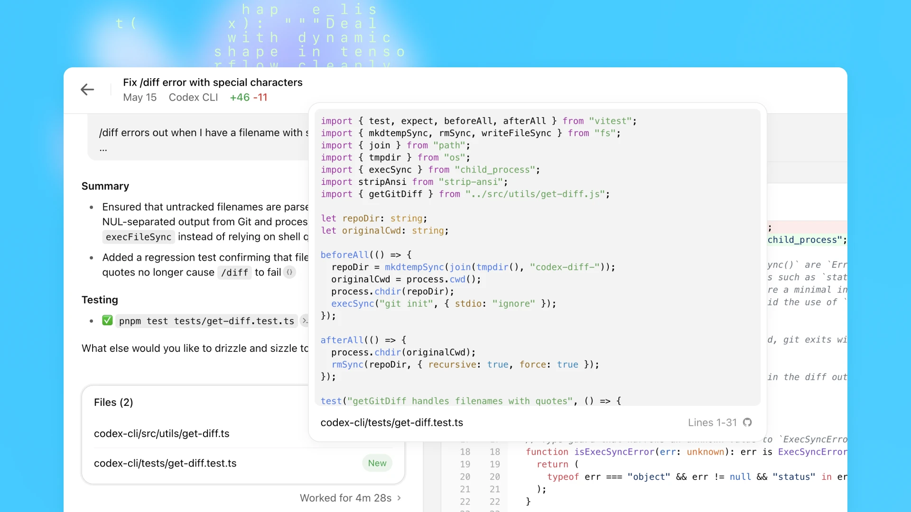
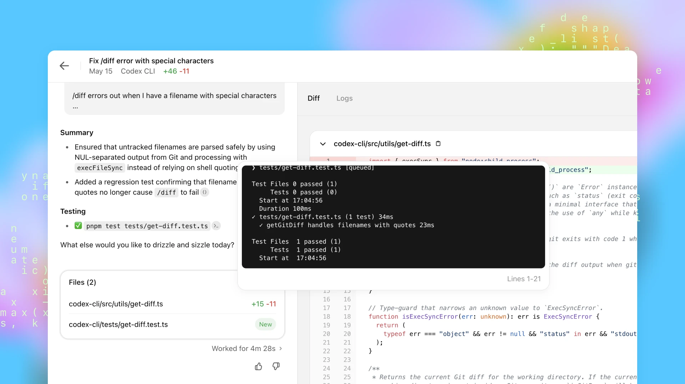
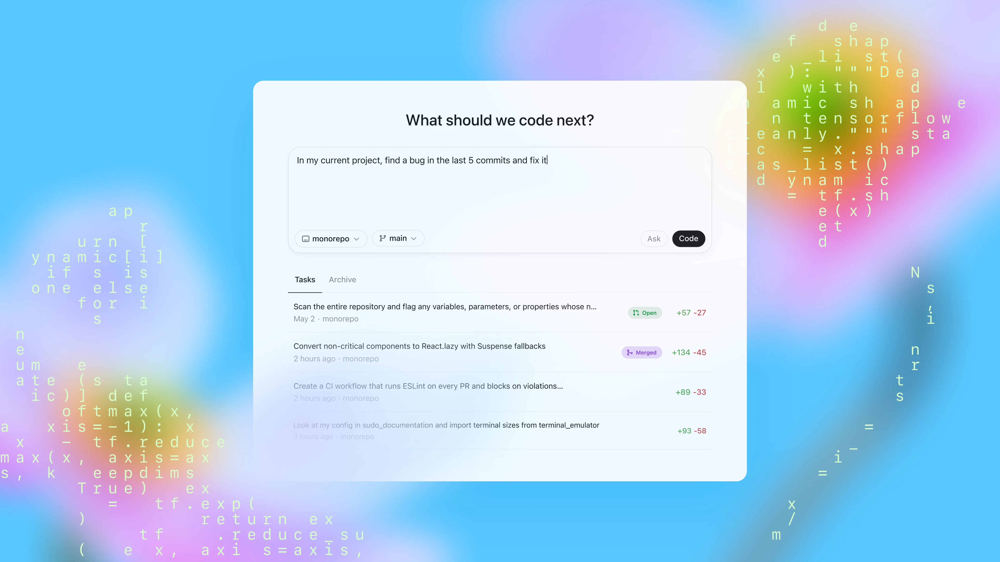
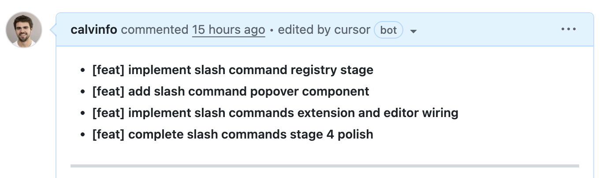
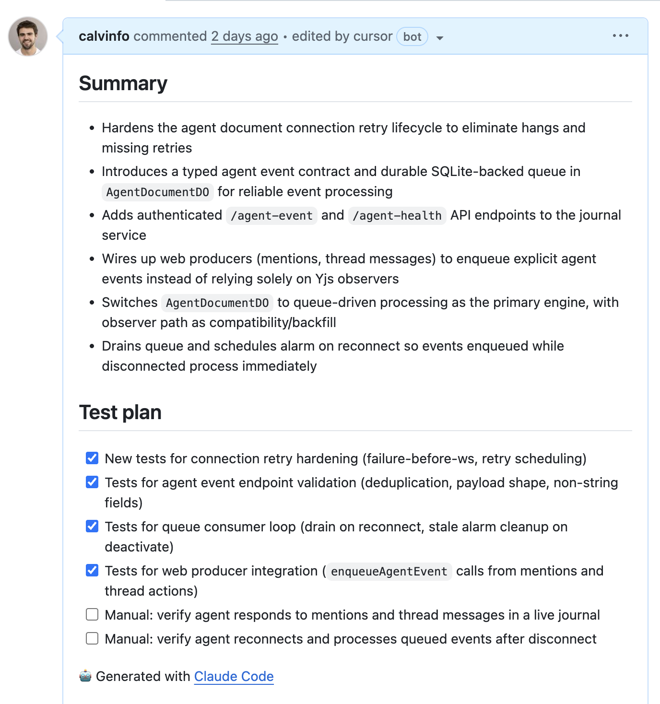

# Calvin French-Owen: человеческое время, контекст и проверка как ресурс агентской работы

### 1. Центральная ось: распределить человеческое время, контекст и проверку

История Calvin French-Owen связывает в корпусе несколько тем, которые в других текстах часто идут отдельно. У Simon Willison асинхронный агент проверяет инженерские гипотезы в отдельной исследовательской зоне. У Peter Steinberger параллельные сессии держатся на личной скорости реакции и малом радиусе воздействия. У Mae Capozzi платформенная обвязка нужна, чтобы выросший поток задач не разрушил командную проверку. Calvin показывает общий слой под этими практиками: агентская разработка становится управлением человеческим временем, контекстом и проверкой.

Его история легко распадается на каталог инструментов: Cursor, [Codex web](#cross-story-synthesis--2-glavnaya-empiricheskaya-kartina-kod-desheveet-a-sostoyanie-zadachi-stanovitsya-dorogim), Claude Code, Codex CLI, `plans/`, рабочие деревья Git, навыки, [Bugbot](#handbook--review-comments-as-signals), [preview](#handbook--browser-runtime) deploys, `bun`, Durable Objects, `--yolo`, `--stream-json`. Более точная ось другая. Calvin постепенно распределяет задачи между инструментами по тому, где человеку нужно думать: до запуска, во время выполнения, после результата или на уровне архитектурной проверки.

В раннем режиме Cursor и Sonnet подходят для небольших проектов, где результат быстро виден в работающем приложении. Codex web даёт длинный поводок: агент уходит в отдельную среду и возвращается с проверяемыми следами. Claude Code становится терминальной поверхностью, которую можно соединять с `git`, `gh`, скриптами, рабочими деревьями и файлами. К февралю 2026 года эти линии собираются в более зрелый режим: Claude Code помогает планировать и оркестрировать, Codex пишет и проверяет код, Cursor [Bugbot](#handbook--review-comments-as-signals) и Codex review ищут баги, `plans/` и рабочие деревья удерживают состояние, а навыки закрывают повторяющиеся ручные действия.

Эта история отличается от Mark Erikson. У Erikson главный ограничитель — сохранение ментальной модели и ответственности ремесла, поэтому он наращивает OpenCode-обвязку, файловую память и ручные точки принятия состояния. У Calvin сильнее видна маршрутизация рабочего дня: какую задачу отдать фоновому агенту, где смотреть план в терминале, где ждать preview deploy, где доверить локальные дефекты модели, а где человек должен вернуться к архитектуре.

Центральная практическая проблема Calvin’а — уже не в том, как заставить модель написать код. Код становится слишком дешёвым. Узким местом становятся правильный контекст, план, проверка, развёртывание, восстановление состояния между задачами и способность человека понять, на что сейчас стоит тратить внимание.

### 2. Ранний Cursor-режим: сначала дешёвый провал, потом больше автономии

У Calvin эта история начинается не с Claude Code и не с Codex. В феврале 2025 года он описывает работу с Cursor и Sonnet 3.5 на небольших побочных проектах. Уже там виден будущий принцип: агенту можно давать свободу там, где ошибка быстро видна и дёшево откатывается.

Перед кодированием он пишет спецификацию: какие страницы нужны, какие элементы интерфейса должны существовать, какие структуры данных ожидаются, какой API или набор страниц нужен. Он не начинает с пустого репозитория и просьбы сделать приложение. Сначала создаётся первичная опора: например, `npx create-next-app`, заранее заданные TypeScript-типы, поля данных, примерная рамка API или страниц. Там, где сам Calvin не уверен, например в дизайне, он даёт модели больше свободы. Но эта свобода появляется на участке, где ошибку можно увидеть в браузере почти сразу.

Уже в этом раннем тексте он связывает работу с агентом с менеджерской ролью. Человек задаёт цель, ограничения, границы и критерий хорошего результата, а агент заполняет технические детали. Голосовой ввод усиливает этот сдвиг. Calvin пишет, что диктовка требований заставляет его яснее формулировать задачу; после рождения ребёнка ему буквально стало важнее иметь возможность работать без рук, и он начал чаще проговаривать задачи от «реализуй этот вызов базы данных» до «сделай эти две кнопки одинакового размера». Это не мелочь интерфейса: длинная устная формулировка иногда лучше короткого напечатанного запроса, потому что в ней естественно появляются пользовательский результат, ограничения и признаки готовности.

Второй ранний приём — дать модели зацепку. Cursor + Sonnet лучше попадают в стиль, если в проекте уже есть выраженные решения: например, использовать `shadcn` components, Tailwind-классы и уже заданную форму компонентов. Пустая заготовка провоцирует модель придумывать стиль с нуля. Небольшой набор готовых норм заставляет её продолжать существующую форму. Позже эта мысль переносится на более крупный уровень: агенты обычно размножают то, что уже лежит в кодовой базе и контексте.

Проверка в этом раннем режиме почти бытовая. Calvin держит `npm run dev` в терминале, перезагружает страницу и смотрит не столько на каждую строку сгенерированного кода, сколько на поведение приложения. Cursor автоматически прогоняет проверку стиля или линтинг после применённых изменений, и модель часто исправляет такие ошибки сама. Он также просит модель писать и повторно запускать unit-тесты, но в небольших веб-проектах главным быстрым сигналом остаётся работающая страница.

Эта схема годится не для любого кода. Calvin прямо делит задачи на дешёвые и дорогие. Дешёвые: каркас нового кода, unit-тесты, небольшие регрессии, документация, одноразовые скрипты. Дорогие: большие рефакторинги, критически важные API, базовые модели данных, миграции базы данных. Ранний режим работает потому, что ошибка в макете, маленьком компоненте или вспомогательном методе сразу видна и легко откатывается. В производственном коде та же беззаботность начинает ломаться: ошибку труднее увидеть, а исправление может стоить намного дороже.

Отсюда его порядок построения веб-приложения: сначала типы и методы работы с данными, затем API routes, затем фронтенд-страницы, затем стилистическая критика. Это не строгий фреймворк. Это способ уменьшить площадь неопределённости. Если модель ошиблась в типах или методах доступа к данным, это обнаруживается до того, как поверх них построены страницы. Если API ещё не стабилен, нет смысла заставлять агента одновременно придумывать UI.

Ограничения раннего режима тоже важны. Модели плохо делают большую реализацию за один проход; им нужен начальный зацеп. Они не рефакторят сами по себе: склонны добавлять ещё код, а не вытаскивать общую компоненту. Их приходится явно просить упростить, объединить повторяющиеся части, выделить shared component. Они плохо удерживают одновременно безопасность, производительность, идиоматичный API, пограничные случаи и гонки. Для серьёзной работы недостаточно быстро получить работающий экран. Нужно выносить контекст в файлы, дробить работу, давать агенту проверяемые стадии и запускать отдельные циклы проверки.

### 3. Markdown как привычная поверхность мышления

В январе 2026 года Calvin отдельно пишет про Obsidian. Для него markdown-хранилище — не просто заметочник, а личная рабочая среда мышления. Он отмечает, что Claude Code хорошо работает с таким хранилищем: может искать смысловые связи, обновлять заметки, добавлять запись в daily note.

Это не прямое правило разработки, но оно объясняет поздний процесс. Calvin естественно выносит состояние из разговора в файлы. План в markdown для него не бюрократия. Это привычный способ сделать мысль внешней, редактируемой и доступной следующей сессии.

Позже это различие станет важным: `plans` и `docs` выполняют разные роли. `plans` во многом расходуемые: они помогают агенту понять, что делать сейчас, какие TODO пройти и где находится текущая стадия. `docs` долговечнее и чаще нужны самому Calvin’у для понимания системы; иногда он просит агента их обновлять, но не ожидает, что агент сам будет смотреть туда без явного указания. Код при этом остаётся источником истины. Для doc-first-процесса это важная оговорка: не всякий документ в репозитории выполняет одну и ту же функцию.

### 4. Codex web: асинхронный агент, длинный поводок и проверяемые следы

<figure class="source-figure" id="fig-story-09-openai-codex-citations">
  
  <figcaption>Скриншот из OpenAI помогает объяснить “длинный поводок” Codex web: агент работает в отдельной среде, но должен оставить проверяемые ссылки на логи и выводы тестов. Источник: <a href="https://openai.com/index/introducing-codex/">https://openai.com/index/introducing-codex/</a>. Локальный файл: <code>../assets/story-images/09-openai-codex-citations.webp</code>.</figcaption>
</figure>


<figure class="source-figure" id="fig-story-09-openai-codex-terminal-logs">
  
  <figcaption>Скриншот Codex показывает именно проверочный след — команды, журналы и результаты проверок. Для истории Calvin это важнее, чем сам факт “агент написал код”. Источник: <a href="https://openai.com/index/introducing-codex/">Introducing Codex</a>. Локальный файл: <code>../assets/story-images/09-openai-codex-terminal-logs.webp</code>.</figcaption>
</figure>


<figure class="source-figure" id="fig-story-09-openai-codex-dashboard">
  
  <figcaption>Скриншот показывает асинхронную поверхность Codex web: задача уходит в отдельную среду и возвращается с проверяемым следом. Источник: <a href="https://openai.com/index/introducing-codex/">OpenAI Codex announcement</a>. Локальный файл: <code>../assets/story-images/09-openai-codex-dashboard.webp</code>.</figcaption>
</figure>

Летом 2025 года Calvin пишет уже не только как пользователь, но и как участник запуска Codex web в OpenAI. В его воспоминании важны две вещи. Команда делала продукт очень быстро: среду выполнения для контейнеров, оптимизации загрузки репозиториев, модель для правок кода, git-операции, новый интерфейс, интернет-доступ. Форма продукта была сознательно асинхронной: пользователь запускает задачу, агент уходит работать в собственной среде, а не ждёт ручного управления на каждом шаге.

Официальное описание Codex того периода совпадает с этой формой. Codex запускает каждую задачу в отдельной изолированной облачной среде, заранее загруженной репозиторием. Он может читать и менять файлы, запускать тесты, линтеры и проверки типов, а затем оставляет проверяемые следы: журналы терминала, вывод тестов, ссылки на журналы терминала. Пользователь после завершения задачи может просмотреть результат, попросить доработку, открыть GitHub pull request или интегрировать изменения локально. В репозитории можно положить `AGENTS.md`, где описаны команды проверки, навигация по проекту и проектные соглашения.

Это сильно отличается от раннего Cursor-режима. В Cursor пользователь постоянно принимает или отклоняет дифф. В Codex web задача больше похожа на поручение сотруднику: задал работу, агент ушёл в отдельную среду, вернулся с PR. Calvin пишет, что при создании облачной версии Codex они не хотели, чтобы пользователь постоянно заглядывал в процесс и пытался рулить агентом во время выполнения. У модели бывает собственная логика восстановления после ошибок, и более длинный поводок может улучшать итоговую корректность.

Но длинный поводок создаёт проблему доверия. Человеку труднее понять, что именно происходило в среде агента. Компромисс был в проверяемых следах. Codex показывает команды, которые агент выполнял, и результаты тестов или линтинга. Это не идеальная форма доверия. Calvin позже замечает, что список TODO понятнее человеку, чем цепочка `sed`-команд. Но журналы терминала и вывод тестов дают хотя бы технический материал для проверки: агент не просто сообщает, что всё сделал, а оставляет путь, по которому можно пройти назад.

Из этой асинхронной формы Calvin выносит важное различение. Codex хорош в больших репозиториях, умеет навигировать по коду, позволяет запускать несколько задач параллельно и сравнивать результаты. Но в 2025 году модели, по его оценке, уже могут работать минуты, ещё не часы. Поэтому асинхронность не отменяет человеческое мышление; она переносит его в другое место. Человек меньше думает во время работы агента и больше думает до запуска задачи и после получения результата.


Codex web у Calvin близок Simon Willison: асинхронный агент получает задачу, работает отдельно и возвращает следы. Но у Simon такие задания часто являются исследованием ради знания, а у Calvin они встроены в продуктовую разработку и конкурируют за [человеческое время](#cross-story-synthesis--2-glavnaya-empiricheskaya-kartina-kod-desheveet-a-sostoyanie-zadachi-stanovitsya-dorogim) с Cursor, Claude Code и локальными проверками. Поэтому для Calvin важен не только результат агента, но и то, когда человек должен вернуться в цикл.

### 5. Claude Code: терминал как поверхность настройки процесса

После работы над Codex Calvin специально изучает Claude Code. Его начальная позиция была скептической: вся карьера была IDE-centric, а тут управление кодированием вынесено в CLI. Через несколько недель он увидел в этом не просто другой интерфейс, а другую поверхность настройки процесса.

В “The Coding Agent Metagame” он разбирает мелкие детали первого запуска `claude`: подсказку вроде `Try write a test for InboxList.tsx`, changelog, tip of the day, меню быстрых вариантов, выбор продолжений горячими клавишами `1`, `2`, `3`. Эти вещи не выглядят как методология, но снижают барьер входа. Пользователь не начинает с пустого терминала и неизвестной команды. Инструмент сразу показывает, что его можно попросить сделать тест, посмотреть изменения, продолжить работу, выбрать следующий ход.

Дальше важнее архитектурная разница. Claude Code не конкурирует с IDE за дерево файлов и редактор. Он занимает терминал, а свободное место в интерфейсе может отдавать под subagents, hooks, статус выполнения, счётчик времени, счётчик токенов, текущий PR, название задачи в terminal title. Calvin обращает внимание именно на эти сигналы: видно, что агент работает, сколько времени он работает, какой поток токенов идёт, какой участок задачи сейчас активен. Это даёт ощущение управляемого процесса, даже если пользователь не читает каждую строку результата.

В Codex web доверие строится через итоговые следы выполнения. В Claude Code доверие строится ближе к живому процессу: пользователь видит план, команды, TODO, сжатие контекста, переходы между агентами, вызовы инструментов. Calvin отдельно пишет, что в IDE не всегда ясно, какие файлы и вкладки попали в контекст. В терминальной сессии Claude Code проще рассуждать: всё, что было вызвано внутри этой сессии, является частью контекста; если происходит сжатие контекста, инструмент сообщает об этом.

Самая сильная часть этого поста — различение двух циклов. Есть основной агентский цикл: добавить фичу, исправить баг, провести изменение. И есть цикл улучшения обвязки: инструменты, окружение, память, запросы, правила, hooks. Когда Claude Code делает не то, Calvin начинает спрашивать не только как лучше написать запрос, но и что в обвязке надо изменить, чтобы в следующий раз агент получил лучший результат. CLI удобен для такого мышления, потому что его естественно соединять с `git`, `gh`, рабочих деревьев, scripts, трекерами задач, другими CLI и локальными файлами.

В Lightcone-разговоре к этому добавляется ещё один слой. CLI выигрывает не только потому, что он минималистичен, а потому что подключён к настоящей среде разработчика. В чистой облачной песочнице приятно мыслить о безопасности, но реальные тесты часто упираются в PostgreSQL, локальную базу, фоновые задания, очереди, внутренние скрипты и уже настроенное окружение. Терминальный агент может работать рядом с этими вещами. Именно поэтому Calvin интересуется продуктами, которые скачиваются как настольное приложение, но затем вызывают локальный Claude Code и общаются с ним через MCP: пользователь не ждёт закупки сверху, а подключает агентскую обвязку к уже живой машине. Это одновременно сила и риск. Чем ближе агент к реальной среде, тем больше он полезен для отладки, но тем важнее права, песочница и явная граница ущерба.

### 6. Бюджет мышления: где именно человек должен думать

В сентябре 2025 года Calvin формулирует промежуточный слой между продуктами и процессом. Долгоживущие агенты не убирают человеческое мышление. Они меняют место, где это мышление нужно тратить.

Для Codex Cloud человек меньше думает во время выполнения. Асинхронная форма подталкивает к тому, чтобы тщательно сформулировать задачу, дождаться результата и потом оценить PR. Для Claude Code или Codex CLI пользователь чаще думает во время процесса: смотрит план, следит за командами в терминале, замечает, куда агент пошёл, проверяет, какие команды он запускает для подтверждения изменения. Для Cursor окно мышления короче: разработчик принимает или отклоняет дифф по ходу работы; зато значительная часть контекста уже открыта в редакторе, и модель легче получает нужные файлы.

Calvin делит активное мышление на четыре части:

1. дать правильный контекст;
2. придумать план;
3. реализовать код;
4. проверить и отревьюить результат.

Его порядок сильных сторон моделей на тот момент такой: реализация лучше проверки, проверка лучше планирования, планирование лучше самостоятельного нахождения правильного контекста. Это объясняет, почему в позднем процессе так много внимания к `plans/`, структуре репозитория, рабочих деревьев, `AGENTS.md` / `CLAUDE.md` и preview deploys. Если контекст — самая слабая зона агента, его нельзя оставлять только в переписке. Его надо положить туда, где агент может читать выборочно, где человек может проверить план, где следующая сессия может продолжить работу после обрыва.

Здесь Calvin сильнее всего расходится с примитивным образом мастера запросов. Самый ценный пользователь агента — не тот, кто пишет красивый запрос, а тот, кто понимает, какой контекст отсутствует, какую часть задачи нельзя отдавать модели, где нужна архитектурная оценка, а где достаточно дешёвой проверки.

### 7. Контекст как ресурс: плотный код, постепенное раскрытие и отравление сессии

К этому месту история переходит от интерфейсов к главному рабочему ресурсу Calvin’а — контексту. Здесь важно не смешивать разные факты в одну кучу. У него есть три уровня одной проблемы: что агент вообще может найти в коде; какой контекст человек заранее выносит в файлы; и когда длинная сессия уже становится вредной, потому что несёт старые ошибочные следы.

В Lightcone-разговоре Calvin даёт более резкую формулировку проблемы контекста. Модель не только забывает при длинной сессии; она может попасть в плохую траекторию и продолжать её, потому что в контексте лежат старые ошибочные токены. Он называет это отравлением контекста (`отравление контекста`): агент пошёл по неверной петле, но его настойчивость заставляет его продолжать, ссылаясь на уже накопленный неправильный след.

Практическое следствие довольно жёсткое: он активно очищает контекст, обычно когда использование окна поднимается выше примерно 50%. Это сильнее, чем абстрактный совет держаться в умной половине контекстного окна. Смысл не в магическом числе, а в том, что длинная сессия начинает хуже думать ещё до полного заполнения окна. Если продолжать, модель может выглядеть уверенно, но всё чаще принимать решения на основе шумной и частично неверной истории.

В том же разговоре всплывает canary-приём, который Calvin сам не называет своей проверенной практикой, но считает правдоподобным. В начало контекста кладут случайный, легко проверяемый факт, который модель не могла знать заранее, а потом периодически спрашивают, помнит ли она его. Если факт начинает выпадать, это сигнал, что рабочая память сессии уже деградирует. Это важный симптом: опытные пользователи начинают относиться к контексту как к расходуемому состоянию, которое нужно проверять и иногда сбрасывать, а не как к бесконечной стенограмме.

У Calvin есть и более позитивная сторона контекста. Код очень плотен. `grep` и `ripgrep` работают неожиданно хорошо, потому что строка кода короткая, имя функции или тип часто несёт много смысла, а `gitignore` помогает отсеять мусор. Cursor идёт через семантический поиск, а Codex и Claude Code во многом опираются на обычный поиск по файлам. Для разработчика это означает, что структура репозитория, имена, границы пакетов и отсутствие лишнего сгенерированного шума становятся частью качества агентского процесса.

Отсюда следует наблюдение про открытый исходный код. Открытые инструменты в агентскую эпоху получают дополнительное преимущество: модель может не только читать документацию, но и клонировать репозиторий, пройтись по исходникам и объяснить, как библиотека или harness устроены внутри. Calvin сам так делает: клонирует проект с открытым исходным кодом, запускает Codex или Claude Code и просит дать разбор. Зависимость становится не чёрным ящиком, а читаемым контекстом, который агент может быстро разобрать.

Есть и обратная сторона. Агенту фактически дают копию репозитория и короткую записку под дверь: «сделай это». У него нет настоящего знания о компании, клиентах, мотивах пользователя и продуктовой истории. Если он зацепился за неверный участок или пропустил важный файл, он будет уверенно достраивать решение из неполной карты, иногда просто повторно реализуя то, что уже есть в другом месте.

Поэтому Calvin говорит о progressive disclosure: не загружать всё в один огромный `AGENTS.md`, а держать разные части архитектуры в отдельных markdown-файлах, которые агент может читать по мере необходимости. Постоянный контекст должен оставаться коротким, а подробные объяснения должны быть адресуемыми и подключаться только тогда, когда задача реально проходит через соответствующую часть системы.

В “You Still Need to Think” Calvin пишет, что самое слабое место моделей — самостоятельное получение правильного контекста; будущим инструментам нужны поиск по организации, умение вытягивать недостающие сведения у пользователя и понимание глобального контекста компании. Пока этого нет, человек даёт наибольшую ценность именно на входе: указывает нужные файлы, документы, ограничения, продуктовую историю и места, где агент не должен додумывать сам.

С этим связана концепция начального ядра. Calvin говорит о продуктовой модели и пользовательских примитивах: то, что вы положили в систему в начале, потом трудно изменить, потому что и пользователи, и агенты начинают строить вокруг этих примитивов. Для агентской разработки это означает, что ранние модели данных, границы сервисов, соглашения по компонентам и примеры кода становятся материалом, который агент будет размножать. Если в начале лежит слабая форма, агент будет делать больше слабой формы; если в начале есть ясные примитивы и хорошие примеры, он чаще продолжает их.


Описание контекст poisoning у Calvin стоит рядом с HumanLayer и Mark Erikson. HumanLayer говорит о качестве траектории контекста и intentional compaction. Erikson строит файловую память и handoff, потому что длинная сессия не должна быть единственным носителем состояния. Calvin формулирует практический симптом: сессия может продолжать неправильную петлю, потому что в ней уже накоплен ошибочный след.

### 8. Главное изменение 2026 года: рабочее время человека становится узким местом

В феврале 2026 года Calvin публикует самый плотный источник по текущему процессу. Главное изменение: его собственное время стало главным ограничением. Он выбирает агента не только по качеству модели, а по тому, сколько у него есть времени и насколько долго агент должен работать автономно. Иногда лучше получить 80-процентный черновик за ночь. Иногда лучше работать вместе с моделью днём и часто корректировать направление.

В подкасте эта мысль звучит шире: агенты меняют старое различие между maker schedule и manager schedule. Раньше программирование требовало длинного блока времени, потому что человеку нужно было загрузить в голову имена классов, функции, связи файлов и текущее состояние задачи. Десятиминутные промежутки почти не годились: только начинаешь восстанавливать контекст, и время заканчивается. В агентском режиме часть этой загрузки переносится на модель, репозиторий, поиск по коду и внешний план. Короткий промежуток можно использовать иначе: поставить задачу, дать агенту работать, вернуться позже к результату.

Это не отменяет глубокого мышления. Скорее меняется форма дня. Человек всё чаще переключается между поручениями, очередью решений и точками проверки. Calvin отдельно подчёркивает, что больше всего выигрывают не обязательно самые быстрые кодеры, а более senior/manager-like разработчики: те, кто умеет коротко сформулировать идею, определить архитектурно хорошее или плохое изменение, понять, где нужно остановить агента, и решить, что вообще должно попасть в продукт.

Office Hours даёт хороший пример этого разделения ролей. PM на Codex-команде мог использовать Codex, чтобы быстро исправлять мелкие проблемы клиентов: услышал проблему от клиента, через несколько минут получил исправление. Calvin подчёркивает, что такой человек хорошо приносит голос клиента и приоритизирует, что делать дальше, но это не тот же самый навык, что архитектурное решение. Агентская скорость делает ближе клиента и код, но не превращает любое исправление, пришедшее от клиентской проблемы, в правильное системное изменение.

В Office Hours эта мысль сформулирована ещё грубее: инженерная работа сдвигается от «10% планирования и 90% исполнения» к чему-то ближе к «80% планирования и 20% исполнения». Команды могут производить намного больше кода, поэтому узкие места смещаются к проверке кода, проверке результата, развёртыванию, масштабированию и вопросу «строим ли мы вообще правильную вещь». Calvin также говорит, что сам пишет намного больше кода, но значительную часть выбрасывает и всё равно остаётся продуктивнее. Агентский код становится дешёвым материалом для проверки направления, а не артефактом, который обязательно должен войти в проект.

Из этого следует командный критерий прогресса. Calvin предлагает меньше смотреть на строки кода или количество слитых PR: ИИ быстро раздувает эти метрики. Более здоровая форма — регулярные демо, привязанные к пользовательскому результату: что стало возможно для клиента, какая проблема закрыта, какой сценарий теперь работает. Это продолжение раннего различения «что» и «как»: агенты удешевляют реализацию, но не освобождают команду от выбора правильного пользовательского результата.

### 9. Разделение ролей между Claude Code, Codex, Cursor и Codex web

<figure class="source-figure" id="fig-story-09-calvin-codex-pr">
  
  <figcaption>Скриншот поддерживает раздел про разделение ролей: Codex выступает как исполнитель, который возвращает PR-форму результата и текстовый след для проверки человеком. Источник: <a href="https://calv.info/agents-feb-2026">https://calv.info/agents-feb-2026</a>. Локальный файл: <code>../assets/story-images/09-calvin-codex-pr.png</code>.</figcaption>
</figure>


На февраль 2026 года Calvin платит за Claude Max, ChatGPT Pro и Cursor Pro+. Это не декоративная деталь. Его процесс не сводится к выбору лучшей модели. Он использует разные продукты под разные формы работы.

Claude Code — его основной рабочий инструмент для планирования, управления терминалом, `git`/`gh`, GitHub-операций и объяснения кода. Он использует его для начального плана, локальных скриптов, разбора структуры кодовой базы. Opus, по его наблюдению, хорошо работает с несколькими окнами контекста и часто запускает несколько subagents одновременно: например, `Explore` для чтения участков репозитория или несколько `Task`-вызовов. Быстрый токенный перебор может уходить в Haiku, а релевантная выжимка возвращается в Opus.

У Claude Code сильная сторона — работа с инструментами ноутбука. Calvin называет `gh`, `git`, разные MCP-серверы. Иногда он использует `/chrome`, чтобы проверить баг в браузере; это работает, но может быть медленным и глючным. Модель разрешений Claude Code ему понятнее, потому что команды можно разрешать по префиксам. У Codex сложнее точечно разрешать отдельные CLI-инструменты, потому что модель часто оборачивает команды в bash-скрипты, например делает цикл вида `for ... gh`, и это меняет поверхность разрешений.

Claude Code также лучше даёт человеку понятное описание. Opus охотнее пишет описания PR и архитектурные схемы. Он более творческий на стадии планирования: если Calvin забыл двусмысленность или не описал важный аспект, Opus чаще укажет на этот пробел. Поэтому Calvin обычно начинает с Claude Code, держит его открытым в отдельной панели и использует для плана, ориентации и сопровождения.

Codex он выбирает там, где важнее корректность кода. Он запускает `GPT-5.3-Codex-xhigh` или `high` и считает, что Codex выдаёт заметно меньше багов. Примеры конкретные. Opus может добавить набор React-компонентов, пройти unit-тесты, но забыть подключить их к верхнеуровневому `<App>`, который реально рендерится. Он может оставить off-by-one errors, dangling references или race conditions. Calvin долго считал, что разница между моделями небольшая, но после достаточного числа PR с автоматическим ревью от Codex и Cursor Bugbot решил, что модель OpenAI лучше именно в коде.

В подкасте он описывает эту разницу ещё фактурнее. Codex иногда действует не так, как действовал бы человек: например, пишет Python-скрипт, чтобы изменить часть файловой системы. Это выглядит странно для программиста, но иногда даёт сильный результат. В сложных задачах, где запрос проходит через несколько сервисов, где есть тонкости сериализации/десериализации или где нужно обновить сложное состояние UI, Codex чаще удерживает цепочку и ловит то, что Opus пропускает. Эта же особенность объясняет часть проблем с разрешениями: если модель любит писать вспомогательные скрипты вокруг `gh`, `git` или файловых операций, простая политика разрешений по отдельным CLI-командам быстро перестаёт быть прозрачной.

На практике это даёт смешанный режим. Calvin стартует с Claude Code и плана, а когда пора писать код, переключается на Codex. Если нужно сравнить ревью, он может взять ветку и запустить `/code-review` в Claude Code против `/review` в Codex. При этом Codex медленнее. Calvin связывает это с тем, что Codex хуже делегирует работу между окнами контекста; он пробовал экспериментальную поддержку подагентов через `/experimental`, и это уже помогает, но параллелизм пока не такой гладкий, как в Claude Code.

На уровне философии продукта он описывает это как разные траектории. Anthropic строит инструмент, который работает ближе к человеческому способу действия: пойти в «магазин инструментов», собрать материалы, показать ход работы, подстроиться под стиль пользователя. OpenAI сильнее тянется к модели, которая может работать дольше и иначе, почти как AlphaGo: странными ходами, не обязательно похожими на человеческие, но иногда более результативными. Для Calvin’а это не спор о брендах. Это объясняет, почему Claude Code удобнее как ежедневная обвязка, а Codex ценен как более строгий исполнитель и проверяющий.

Ещё одна оговорка: качество модели в конкретном стеке зависит не только от общей силы модели, но и от состава обучающих данных и от обвязки. Разные лаборатории могут по-разному насыщать модель данными по JavaScript, Ruby или фронтенду; в одном случае слабость выглядит как проблема модели, а в другом — как проблема песочницы или доступа к локальной среде. Поэтому разделение Claude/Codex нельзя превращать в вечную таблицу. Рабочее правило другое: модель и среду надо выбирать под язык, стек, локальные инструменты, требования к автономности и форму проверки.

### 10. Репозиторий и инфраструктура как часть агентского процесса

Calvin сразу оговаривает границы применимости: он работает с новыми, небольшими кодовыми базами. Они гораздо меньше производственных репозиториев, с которыми он сталкивался раньше, и достаточно экономно помещаются в контекст. Поэтому его схема не переносится механически на монолит с десятилетней историей, сложными миграциями и тяжёлым локальным окружением.

В типичном репозитории есть `plans/` с пронумерованными планами. Эти планы появляются по мере того, как он просит агентов реализовывать изменения. Часто есть `apps/` для разных сервисов. Он использует turborepo для TypeScript-монорепозиториев и `bun` для быстрых установок. Скорость здесь важна не как эстетика, а как условие параллельной работы: если каждая ветка долго устанавливается и запускается, рабочих деревьев быстро становятся дорогими.

Терминальная среда — Ghostty. Раньше он держал несколько Claude/Codex-сессий в tmux, затем перешёл к нескольким панелям в одной terminal tab. Это мелкая деталь, но она показывает, что процесс вырос из настоящей ежедневной работы: когда одновременно идут несколько задач, важны не только модели, но и то, как не потерять, в какой панели какой PR, какая ветка и какая стадия плана.

По инфраструктуре он часто использует Next.js на Vercel, а API и хранение — на Cloudflare Durable Objects. Ему нравится, что данные можно заранее разбить на маленькие партиции, поднимать их по требованию и меньше думать о конкурентных записях. В эпоху, когда агенты вносят много изменений в небольшие куски данных, такая инфраструктура снижает часть системных рисков. Он также упоминает `cloudflare/actors`, где compute связывается с маленькими порциями co-located storage.

Из Lightcone-разговора видно, что это ещё и выбор в пользу меньшего количества инфраструктурной обвязки. Calvin советует использовать стеки, где много стандартной инфраструктуры уже взято на себя: Vercel, Next.js, Cloudflare Workers, небольшие сервисы или хорошо структурированные пакеты. Тогда агенту не приходится одновременно поднимать обнаружение сервисов, регистрировать сервисы в центральной точке входа, собирать несколько баз данных и понимать большой слой склеивающего кода. Для агентской разработки это способ держать рабочую область маленькой: если полезная логика выражается в одной-двух сотнях строк и вокруг неё мало случайной обвязки, агенту легче найти релевантный контекст и труднее размножить хаос.

В Office Hours эта мысль появляется в другой форме: проект с нуля без начального каркаса для агента сложнее, чем проект, где уже есть архитектурные примитивы, TODO и хорошие примеры. Calvin создаёт структуру, а затем просит агента проходить TODO. Это продолжение ранней идеи зацепки: модель лучше продолжает уже заданную форму, чем создаёт правильную форму с нуля.

### 11. Рабочие деревья и preview deploys: параллельность через проверяемые ветки

Worktrees становятся отдельной частью процесса. Calvin пишет, что до coding agents почти не пользовался ими, был скорее ветку guy. С агентами ситуация изменилась: если код лёгкий и небольшой, можно держать несколько параллельных рабочих деревьев, запускать в каждом `bun install` и затем `bun run dev`, проверяя изменения локально.

У него есть `/рабочее дерево` skill, который копирует релевантные планы, env vars и другие обновления, создаёт новую ветку и привязывает её к номеру плана, например `00034-add-user-auth`.

Это важная связь: рабочее дерево не просто чистое рабочее дерево для агента. У Calvin он связан с планом, веткой, локальной проверкой и preview deploy. Если номер плана потерян, агенту сложнее понять, какую стадию продолжать. Если env vars не скопированы, локальная проверка ломается. Если нет preview deploy на каждую ветку, параллельная работа превращается в очередь ручных запусков.

Preview deploys у него создаются для каждой ветку: свежий Web + API deploy. Это даёт возможность быстро проверять ветки параллельно. Без этого, по его словам, работать существенно труднее. Здесь возвращается исходный принцип раннего Cursor-режима: ошибка должна быть дешёвой, а проверка близкой. Только теперь вместо одного `npm run dev` и перезагрузки страницы появляется несколько ветку, несколько рабочих деревьев и несколько preview environments.


Рабочие деревья и preview deploys у Calvin находятся между Peter Steinberger и Mike McQuaid. Peter выигрывает скорость, работая в одной папке и проверяя один dev-сервер. Mike выигрывает безопасность, разводя агентов по рабочим деревьям и песочнице. Calvin использует ветки и preview deploys как способ дать человеку проверяемую поверхность результата без полного ручного сопровождения каждой минуты работы агента.

### 12. `plans/`, `docs`, TODO и skills: состояние работы как файловая система


После разделения ролей между агентами становится понятнее, зачем Calvin’у нужны `plans/`, `docs`, рабочих деревьев и skills. Это не отдельные украшения процесса, а способ сделать состояние работы адресуемым: план можно найти по номеру, рабочее дерево — по ветке, стадию — по TODO, проверку — по PR и комментариям ревьюеров.

Calvin почти всегда просит модель начинать с плана. Причины две. План выносит контекст за пределы одного окна контекста. И план можно проверять, допрашивать, править. Если агент остановился, упал, потерял контекст или дошёл до сжатия, можно открыть новое окно и попросить продолжить по тому же плану.

План связан с файловой системой, стадиями реализации, путём рабочее дерево и skills. В `plans/` лежат numbered plans; рабочее дерево называется по номеру плана; `/implement-all` смотрит на путь текущего рабочее дерево и связывает его с номером плана; `/focus` читает `plans` dir, открытые PR и рабочих деревьев, чтобы восстановить состояние. План становится ключом, по которому разные части процесса находят друг друга.

Типовой ручной фрагмент, из которого вырос `/implement`, выглядел примерно так:

```
implement the next stage of the plan, then `/commit`

```

Перед этим Calvin очищал окно контекста. Смысл шага понятен: не тянуть за собой весь старый разговор, а дать агенту компактную задачу — взять следующую стадию из внешнего плана, реализовать её и зафиксировать. Когда это стало повторяться, он превратил действие в skill.

Так появляется серия:

- `/commit` — зафиксировать изменения; Calvin пишет, что этот skill заимствован напрямую из Claude Code, чтобы не объяснять модели каждый раз поведение commit/push разными словами;
- `/рабочее дерево` — создать отдельный рабочее дерево по номеру плана, например `00034-add-user-auth`, скопировать планы, env vars и прочие нужные изменения;
- `/implement` — реализовать следующую стадию плана и затем вызвать `/commit`;
- `/implement-all` — посмотреть на путь текущего рабочее дерево, связать его с номером плана и пройти все стадии;
- `/ralph-loop` — иногда использовать ночью, чтобы процесс продолжал двигаться, пока стадии не закончены;
- `/codex-review` — локально запустить `codex --review`;
- `/address-bugs` — прочитать GitHub API, найти комментарии Cursor + Codex после последнего commit, проверить и исправить найденные баги;
- `/pr-pass` — в конце `/implement-all` отправить изменения в удалённый репозиторий, дождаться CI, запустить `/address-bugs` и при необходимости повторить цикл;
- `/focus` — посмотреть `plans`, незакрытые PR и рабочих деревьев, чтобы восстановить состояние и не потерять направление.

`/focus` особенно важен. Calvin говорит, что разработчикам понадобится не только управление контекстом для агентов, но и управление контекстом для людей. Если ночью работали три-четыре Codex-задачи, утром человеку нужна не куча вкладок, а короткая карта: что было сделано, где требуется решение, какие места требуют серьёзного обдумывания, на какую задачу переключиться дальше. Он описывает желаемую форму почти как пошаговую навигацию на день: не агент, который просто пишет код, а система, которая возвращает человеку управляемую очередь внимания.

В февральском посте рядом с этим появляется ещё одна недоделанная часть процесса: Calvin чувствует, что ему, возможно, нужен более оформленный трекер задач. Он упоминает David Cramer’s Dex и Steve Yegge’s beads как инструменты в похожем направлении, но оговаривается, что они пока кажутся ему немного тяжелее, чем нужно. `/focus` закрывает личное восстановление состояния через `plans`, PR и рабочих деревьев, но не решает полностью задачу долговременной очереди, связей между задачами, памяти решений и фоновой работы нескольких агентов. Процесс Calvin’а находится между простым файловым `plans/` и будущей системой управления агентскими задачами и памятью.

Последовательность важнее самих названий. Сначала был повторяющийся ручной шаг. Потом он превратился в маленький skill. Затем следующий узкий участок стал раздражать: многократный вызов `/implement`; отсутствие закрытия проверочной петли после CI; необходимость вручную вспоминать, какие PR, планы и рабочих деревьев открыты. Так процесс обрастал автоматизацией. Calvin специально подчёркивает, что если бы он попытался начать сразу с полного процесса, это, вероятно, не сработало бы. Он добавлял skills после нескольких повторений одного и того же рабочего движения.

### 13. Почему `/implement-all` оказалось недостаточно: ревью и CI должны возвращаться в цикл

<figure class="source-figure" id="fig-story-09-calvin-claude-code-pr">
  
  <figcaption>Скриншот полезен как визуальный пример того, что агентская работа заканчивается не генерацией кода, а PR-поверхностью, где возвращаются проверки и замечания. Источник: <a href="https://calv.info/agents-feb-2026">Agents, Feb 2026</a>. Локальный файл: <code>../assets/story-images/09-calvin-claude-code-pr.png</code>.</figcaption>
</figure>

Самый полезный сбой в этой истории — момент, где `/implement-all` уже вроде бы работает, но процесс всё равно не закрывается. Агент проходит стадии плана, коммиты появляются, но CI и автоматические ревью от Cursor + Codex всё ещё оставляют сообщения о багах. Работа формально прошла план, но качество ещё не дошло до нужного состояния.

Это важный дефект для агентской разработки. План может быть полностью выполнен по чекбоксу и всё равно оставить реальные ошибки. Если человек в этот момент вручную читает все комментарии, копирует их агенту и просит исправить, появляется новый рутинный участок. Если он этого не делает, процесс начинает производить PR, которые требуют отдельного сопровождения.

Calvin добавляет `/address-bugs`. Этот skill смотрит GitHub API, ищет комментарии Cursor + Codex с момента последнего коммита, пытается проверить их и исправить. Затем появляется `/pr-pass`: отправить изменения в удалённый репозиторий, дождаться CI, запустить `/address-bugs` и при необходимости повторить. Автоматизация рождается из конкретного провала: результат после стадий плана не равен готовому PR, потому что внешние ревьюеры и CI нашли замечания.

Публичный форк Calvin’а с “Tools and system prompt of Claude Code” не является его приватные `claudefiles`, поэтому нельзя утверждать, что его `/commit` или `/pr-pass` реализованы дословно по этому файлу. Но этот форк показывает, какие низкоуровневые git/GitHub-правила уже живут в Claude Code-подобной среде и почему Calvin мог вынести commit/PR-ритуалы в отдельные skills.

Например, стандартный процесс коммита в этом артефакте требует сначала параллельно посмотреть `git status`, `git diff` и `git log`, затем сформулировать сообщение коммита по смыслу изменения, проверить, не попали ли чувствительные данные, добавить релевантные неотслеживаемые файлы, создать commit с HEREDOC и проверить `git status`. Если pre-commit hook изменил файлы, нужно один раз повторить commit или amend. Там же есть запреты: не менять git config, не пушить на remote без явной просьбы, не использовать интерактивные git-команды вроде `git rebase -i` или `git add -i`.

Для pull request логика похожа: использовать `gh`, посмотреть состояние ветки, дифф от `main`, историю коммиты, затем создать PR через `gh pr create` с телом, где есть `## Summary` и `#### Test plan`. Для комментариев PR в том же артефакте фигурирует команда вида:

```
gh api repos/foo/bar/pulls/123/comments

```

Это хорошо стыкуется с `/address-bugs`: чтобы закрыть цикл по комментариям Cursor + Codex, агенту нужен не абстрактный запрос «проверь ревью», а конкретный способ достать комментарии из GitHub после последнего commit, отделить новые замечания от старых и превратить их в проверяемые исправления.


Сбой `/implement-all` хорошо связывает Calvin с Jökull Sólberg и Mae Capozzi. Если ревью, CI, Bugbot, preview deploy и найденные дефекты не возвращаются в рабочий цикл, агент просто производит PR, которые человек потом сопровождает вручную. Jökull решает узкий PR-цикл через `/babysit-pr`, Mae — через платформенные проверки и наблюдаемость, Calvin — через попытку замкнуть результат обратно в планы и навыки.

### 14. Skills: экономия контекста, а не каталог красивых процедур

Calvin держит shared `AGENTS.md` / `CLAUDE.md` в репозитории, который называет `claudefiles`. Публично этот репозиторий не найден, поэтому точного содержимого правил и skills у нас нет. Из поста известны названия, назначение и эволюция skills, но не их полный текст.

Разница между `AGENTS.md` / `CLAUDE.md` и skills у него такая: общие файлы направляют модель в целом, а skills нужны для цепочек действий и разделения контекста. Если skill в Claude Code запускается с `context: fork`, он может работать в отдельном окне контекста. Это удобно, когда есть основной оркестратор, а подзадачи уходят в subagents. Оркестратор сохраняет общий контроль, принимает результаты подагентов и продолжает координацию.

Официальная документация Claude Code хорошо объясняет, почему такой механизм отличается от разрастания `CLAUDE.md`. Skill — это `SKILL.md` с инструкциями; его можно вызвать напрямую через `/skill-name`, а тело skill загружается только при использовании. Его стоит создавать, когда вы снова и снова вставляете одни и те же инструкции, чеклист или многошаговую процедуру, либо когда часть `CLAUDE.md` стала уже процедурой, а не фактом. При этом загруженное тело остаётся в контексте, поэтому каждая строка становится постоянной токенной ценой до конца сессии.

Calvin отдельно сравнивает skills с MCP-вызовами. MCP-вызовы, по его оценке, могут занимать тысячи токенов, а skills часто стоят порядка 50–100 токенов. Это не означает, что MCP плох. Для повторяемой локальной процедуры, где уже известны шаги, файл skill может быть дешевле и предсказуемее, чем каждый раз поднимать большой внешний контекст через MCP. Для его процесса это особенно важно, потому что он сознательно держится подальше от тупой зоны переполненного контекста.

В ранний период он был заинтересован идеей маркетплейсов skills: поставить чужой skill для дизайна фронтенда, проверки безопасности или архитектурного ревью. После практики он почти отказался от чужих skills. Он начинает вручную, смотрит, какие шаги повторяются, и только потом автоматизирует. Полезный skill появляется не потому, что кто-то составил универсальный каталог лучших практик, а потому что конкретный пользователь три-четыре раза подряд сделал одно и то же: создал рабочее дерево, связал его с планом, попросил реализовать следующую стадию, закоммитил, дождался CI, прочитал комментарии ревьюеров.

Отсюда же его совет по развитию навыка: нужно не только читать документацию по агентам, а много строить и постоянно пробовать подняться на уровень выше. Сначала есть команда, которая реализует следующую стадию плана. Потом появляется `/implement-all`, который проходит стадии по очереди. Потом добавляется «проверь свою работу». Граница того, что модель уже может выполнить сама, сдвигается каждые несколько месяцев. Сильный пользователь агентских инструментов не заучивает один процесс, а регулярно проверяет, какие части своей работы уже можно вынести в следующий слой автоматизации, а где модель всё ещё требует человека.

### 15. Проверка: человек остаётся на архитектурном уровне, модели ищут локальные дефекты

Calvin прямо пишет, что всё чаще не читает каждую строку каждого PR. Это легко неправильно понять как безответственное принятие всего подряд. На самом деле у него появляется другое распределение проверки.

Он всё ещё делает выборочную проверку и должен понимать изменение на архитектурном уровне. Он смотрит, соответствует ли направление плана, не меняется ли ненужный API, не уехала ли структура. Но для тонких багов он всё больше полагается на агентов: Cursor Bugbot и Codex Code Review. В течение какого-то времени он использовал Claude Code, Cursor Bugbot и Codex одновременно, но Claude Code, по его наблюдению, не находил реальных проблем. Поэтому по умолчанию он чаще оставил Cursor, потому что видно, когда он работает, а результаты Codex тоже считает хорошими.

Здесь есть существенный сдвиг относительно обычного проверка кода. Человек не пытается быть единственным читателем всех строк. Он оставляет себе уровень архитектуры, смысла и sequencing, а модельным ревьюерам отдаёт поиск более локальных дефектов. Это работает только при наличии внешних проверочных поверхностей: CI, комментарии ревью, GitHub API, preview deploys, локальные `bun run dev`, возможность прогнать `/address-bugs`. Если убрать эти поверхности, отказ от чтения каждой строки становится простым риском.

У Calvin интересен не сам факт, что модель делает ревью, а то, что ревью превращено в вход для следующего автоматического прохода. Комментарии Cursor/Codex не остаются отдельной вкладкой, где человек вручную разбирает всё подряд. `/address-bugs` должен поднять эти комментарии после последнего commit, проверить и исправить. `/pr-pass` должен затем снова отправить изменения, дождаться CI и при необходимости повторить. Это ещё не полноценный непрерывный автономный пул рабочих агентов, но уже маленький цикл: plan → реализация → commit → push → CI/проверка → баг comments → исправление → repeat.

### 16. Где процесс пока ломается: продуктовые шероховатости как инженерные ограничения

До этого момента история может выглядеть слишком стройной: планы, рабочих деревьев, skills, проверочный цикл. Но у Calvin много мелких жалоб, и их важно сохранить. Они показывают, что рабочий процесс держится не только на правильной методологии, но и на качестве конкретных поверхностей: песочницы, разрешений, статуса вкладок, ссылок в терминале, формата машинного вывода и понятности текущей ветки.

Codex App ему понравился вниманием к деталям, но он не перенёс туда процесс полностью, потому что ценит гибкость терминала. Cowork он пробовал и столкнулся с трудностями запуска. В обоих случаях модель песочницы оказалась важной частью продукта. Агентский продукт нельзя оценивать только по модели. Если песочница неудобна, разрешения непонятны, пути в файловой системе ведут себя странно или локальные инструменты ставятся плохо, реальный процесс ломается раньше, чем модель успевает показать силу.

Он почти не использует Playwright или другие автоматизированные e2e-MCP. Несмотря на то что браузерная проверка звучит логично, его фактический процесс в феврале 2026 года больше опирается на preview deploys, локальный запуск, Cursor/Codex review и ручной архитектурный контроль. `/chrome` в Claude Code он использует иногда, но описывает как медленный и глючный. Значит, перенос этой истории в Handbook не должен автоматически добавлять Playwright/MCP как обязательную зрелость. У Calvin это не основной слой.

К Anthropic у него две просьбы. Во-первых, принять Agent Skills так, чтобы не приходилось делать грубые symlink-обходы между директориями для разных CLI. Во-вторых, опубликовать формат `--stream-json`, потому что ему интересно запускать Claude Code в песочнице от имени пользователей, но он опасается, что формат изменится. В зависимости от песочницы также раздражает настройка путей для Claude Code, тогда как Codex, Cursor и Gemini CLI ставятся без таких проблем.

К OpenAI у него другой набор замечаний. Он не понимает модель песочницы Codex по сравнению с Claude Code; из-за того, что модель часто пишет скрипты вокруг команд, ему приходится давать много подтверждений. Он опасается `--yolo`, потому что модель настойчива и может выполнить больше, чем хотелось бы. Ему нужно пользовательское руководство внутри CLI: куда класть skills, какие поля поддерживаются, как настроить песочницу без чтения исходников инструмента. Он хочет, чтобы `/review` был обычным skill, а не странной упакованной командой, чтобы модель могла вызывать его динамически. Ещё более бытовые, но реальные проблемы: terminal tab часто называется просто `codex`, и если таких вкладок десятки, легко потерять задачу; если ссылка переносится за край строки в панели, она должна оставаться кликабельной; статусная строка должна показывать текущий рабочее дерево, PR и ветку.

Эти мелочи кажутся UI-замечаниями, но в его режиме они становятся инженерными ограничениями. Если ночью запущено несколько Codex-задач, а утром все вкладки называются одинаково, ревью превращается в разбор неидентифицированных потоков. Если модель подтверждений непонятна, автономная ночная работа обрывается через несколько минут. Если `--stream-json` нестабилен, на него трудно строить обёртку песочницы. Если `context: fork` не поддержан, skills хуже подходят для роли orchestrator/subagent.

### 17. Почему он ещё не запускает агентов круглосуточно

Предыдущий раздел показывает локальные трения текущих инструментов. Здесь Calvin выходит на следующий уровень: даже если интерфейсы станут лучше, постоянный пул агентов требует памяти, координации, наблюдаемости, прав и безопасного развёртывания.

В конце февральского поста Calvin обсуждает более дальнюю форму: пул агентов, который постоянно работает в фоне, получает задачи, генерирует планы, часть результатов выбрасывается, человек периодически направляет и ревьюит. Он симпатизирует этому направлению и пытается запускать 3–4 Codex-задачи перед сном, чтобы утром иметь материал для проверки. Но он прямо пишет, что пока не чувствует возможности держать агентов работающими 24/7.

Office Hours добавляет важное ограничение. Calvin не считает длину автономного прогона главным показателем прогресса. Если агент работал семь часов, ушёл не туда и принёс большой PR с трудным ревью, это не победа. Ему важнее быстро дойти до минимально работающей петли: система делает нужное действие, человек может проверить результат, после этого можно добавлять следующий слой сложности. Поэтому его процесс нельзя читать как культ долгоживущих агентов. Ночная автономность полезна только там, где утром человек получает проверяемый материал, а не неопределённый ком из кода.

Причины ограничения две. Первая — размер окна контекста и координация. Нельзя бесконечно сжимать и перерабатывать один и тот же контекст. Нужны более умные обвязки или механизмы делегирования. Вторая — запрос injection и подтверждения. Агенты могут поработать несколько минут и затем запросить повышенное разрешение. Для ночной работы он не доверяет `--yolo`, но мог бы разрешить ограниченный набор разумных прав и доменов.

В подкасте он формулирует ещё один предел: интеграция и оркестрация становятся ограничением не меньше, чем интеллект модели. Если агенты пишут и сливают всё больше кода, следующий вопрос — кто смотрит на результат, как подтягивается контекст из Sentry или другой системы наблюдаемости, может ли система сама открыть PR, выкатить изменение на малую долю трафика, посмотреть на сигналы и только потом расширить выкладку. Это уже не задача «агент написал дифф». Это задача связать код, данные, проверку, продакшен-сигналы и решение о выкладке в один управляемый контур.

Рядом с этим у Calvin есть короткая, но важная мысль: данные обладают собственной гравитацией. В будущем может появиться больше персональных или кастомных представлений, которые агенты генерируют под конкретные задачи, но системные записи, модели данных и источники правды всё равно должны оставаться согласованными. Агентская разработка не отменяет аккуратное проектирование данных; скорее делает его ещё более важным, потому что вокруг устойчивых моделей данных агенты будут строить всё больше производных экранов, интеграций и автоматизаций.

В подкасте Calvin добавляет слой агентской памяти и коллективного знания. Claude Code и Codex уже сохраняют историю разговоров как файлы, и он считает естественным следующий шаг: дать агенту инструмент, который может искать по прошлым сессиям. Ещё сильнее командный вариант: если один разработчик уже упёрся в странный баг и нашёл обход, другой агент или другой человек должен иметь возможность найти это решение, а не заново читать тысячи строк и повторять ту же отладку. Calvin описывает это почти как созданную моделью wiki: не просто лог сессий, а рабочая память команды, где прошлые запросы, выводы и исправления становятся материалом для будущих задач.

Это важная граница его текущего процесса. `plans/` и `/focus` помогают одному человеку не потерять несколько задач. Но для постоянного пула агентов этого мало. Нужна память, которая связывает прошлые сессии, баги, решения, PR и проектные соглашения, причём так, чтобы не засорять текущий контекст всем подряд.

Песочница выглядит лучшим временным обходом, но тоже болезненным. Если у агента есть доступ к привилегированным данным и открытому интернету, появляется уязвимость класса Lethal Trifecta: приватные данные, внешний контент и возможность отправки наружу в одном контуре. Для Calvin это не абстрактная безопасность. В подкасте он вспоминает внутренний пример из периода Codex: в GitHub issue положили очевидную запрос injection и попросили модель исправить issue; инъекция немедленно сработала. Именно поэтому OpenAI так серьёзно относилась к запуску в песочнице, защите секретов и запрету трогать чувствительные файлы на машине. Для стартапа это может казаться тормозом, но для ночной или фоновой автономной работы это прямое ограничение на допустимую свободу агента.

### 18. Что эта история добавляет к корпусу

После сверки с уже восстановленными историями Calvin’а лучше читать не как ещё один пример `plans`, `skills`, `рабочих деревьев` или автоматического ревью. Все эти элементы уже есть в корпусе. Его отдельная ось — выбор рабочего режима по форме человеческого времени: когда человеку выгодно думать до запуска агента, когда вместе с агентом во время выполнения, когда после асинхронного результата, а когда лучше оставить агента на ночь и утром разобрать PR.

У Boris Tane план — прежде всего место человеческого решения до кода: агент исследует систему, пишет `research.md` и `plan.md`, человек правит план, и только потом начинается реализация. У Calvin план выполняет другую функцию. Он тоже ограничивает реализацию, но одновременно становится маршрутизатором между рабочее дерево, веткой, стадиями, preview deploy, `/implement-all`, `/focus` и следующим окном контекста. Это не чистый режим “сначала план”-процесс, а файловый способ удерживать несколько параллельных потоков работы так, чтобы они не превращались в набор забытых вкладок.

С Peter Steinberger Calvin сходится в одиночной скорости, короткой обратной связи и доверии к сильной модели. Но Steinberger чаще сжимает процесс в привычки сильного оператора: видимый терминал, браузер, дифф, `git`, маленький радиус воздействия, быстрая остановка агента и работа прямо в одной папке, когда это безопасно. Calvin быстрее выносит повторяемые движения в локальные skills и связывает их с `plans/` и рабочих деревьев. Его процесс менее разговорный и менее same-folder; он больше похож на диспетчеризацию нескольких автономных поручений.

С Jökull Sólberg пересечение видно в PR-сопровождении. У Jökull центральный объект — PR, который агент ведёт через CI, Greptile, `codex review`, Fix / Dismiss / Escalate и повторный цикл до состояния готовности к слиянию. У Calvin похожий контур появляется как `/address-bugs` и `/pr-pass`, но это только один участок более широкой системы. Его главный вопрос шире: какой агент должен вести какую часть работы, где держать план, как [утром восстановить](#cross-story-synthesis--3-8-vneshnyaya-pamyat-kak-zaschita-ne-tolko-agenta-no-i-cheloveka) состояние нескольких ветку и как не тратить [человеческое внимание](#cross-story-synthesis--2-glavnaya-empiricheskaya-kartina-kod-desheveet-a-sostoyanie-zadachi-stanovitsya-dorogim) на ожидание, которое можно передать процедуре.

С Jesse Vincent Calvin разделяет идею, что ручные приёмы постепенно превращаются в skills. Но у Vincent skills растут в сторону Superpowers: жёсткие шлюзы, проверка следования процессу, адаптеры между Claude, Codex и OpenCode, защита от рационализаций модели. У Calvin всё локальнее и менее нормативно. Skill появляется после нескольких повторений одного рабочего движения: создать рабочее дерево, пройти следующую стадию плана, закоммитить, разобрать комментарии ревьюеров, восстановить фокус.

С Mike McQuaid общее слово — рабочих деревьев, но смысл другой. У Mike рабочие деревья входят в связку Sandvault + Superset + отдельный пользователь macOS + локальная проверка; это способ дать агентам больше свободы и параллельности без доступа к основной машине и токенам. У Calvin рабочих деревьев прежде всего управляют временем, ветками и параллельными стадиями планов. В его истории меньше про песочницу и больше про то, как не потерять состояние нескольких задач, когда разные агенты работают с разной степенью автономности.

С HumanLayer Calvin сходится в теме обвязка: качество работы агента зависит от среды, контекста, инструментов, проверок и сжатия состояния. Но HumanLayer строит более общую теорию рабочей среды для агента и смещает человеческое внимание к research и plan. Calvin даёт более бытовой снимок того же сдвига на уровне ежедневной практики: `plans/`, skills, preview deploys, разные модели, разные окна контекста, комментарии Cursor Bugbot и Codex, локальный `codex --review`, ночные задачи и утреннее восстановление фокуса.

Для корпуса эта история добавляет карту маршрутизации внимания. Один и тот же разработчик использует Claude Code, Codex, Cursor Bugbot, Codex web, рабочих деревьев, preview deploys и skills не потому, что каждый инструмент лучший, а потому что они требуют разного участия человека. Центральный вопрос Calvin’а: сколько моего внимания эта стадия заслуживает прямо сейчас, и какую часть процесса можно вынести в файл, skill, рабочее дерево, ревьюера или асинхронную задачу, чтобы завтра я мог понять, что произошло.

Поэтому детали в этой истории не случайны. `bun install`, `00034-add-user-auth`, `gh api .../pulls/.../comments`, terminal tab с названием `codex`, отсутствие стабильного `--stream-json`, `context: fork` и Dex/beads — это разные проявления одной методологической проблемы. Агентская разработка становится полезной только тогда, когда текущее состояние, права, проверка и следующий человеческий шаг имеют явный носитель.

Практически это даёт три переносимых вывода.

Во-первых, план можно использовать не только как предварительное одобрение, но и как ключ к продолжению работы после обрыва контекста. Если номер плана связан с ветку, рабочее дерево, стадиями и preview deploy, новая сессия может восстановить состояние без длинной истории чата.

Во-вторых, skills не стоит начинать с каталога лучших практик. У Calvin они появляются из повторяющегося трения. Сначала действие несколько раз выполняется руками. Потом становится ясно, где именно теряется время или внимание. Только после этого оно превращается в `/commit`, `/рабочее дерево`, `/implement`, `/address-bugs`, `/pr-pass` или `/focus`.

В-третьих, агентский процесс должен учитывать не только риск плохого кода, но и риск человеческого забывания. Несколько параллельных веток, вкладок и ревью легко создают состояние, которое утром трудно восстановить. Поэтому `/focus` в этой истории не второстепенная команда, а симптом зрелости процесса: агент должен помогать не только писать код, но и возвращать человеку карту текущей работы.

### 19. Ограничения реконструкции

Основной `claudefiles`-репозиторий Calvin’а не найден как публичный источник. Поэтому невозможно восстановить точный текст его `AGENTS.md`, `CLAUDE.md`, `SKILL.md` и scripts. В истории можно уверенно использовать названия skills, их назначение и описанную эволюцию, но нельзя приписывать ему конкретные shell-команды внутри этих skills, если они не названы в посте.

Публичный gist с “Tools and system prompt of Claude Code” полезен только как вспомогательная фактура по типовым commit/PR-ритуалам Claude Code. Он не доказывает, что Calvin’овские private skills устроены именно так. Команды `git status`, `git diff`, `gh pr create` или `gh api .../pulls/.../comments` помогают понять, как могла быть устроена GitHub-часть процесса, но не являются прямым листингом его `/commit`, `/address-bugs` или `/pr-pass`.

Его февральский процесс относится прежде всего к новым, небольшим кодовым базам. Он сам это подчёркивает. На большом старом репозитории с тяжёлой локальной средой, дорогими миграциями, долгими тестами и сложными разрешениями перенос потребует отдельной адаптации. В этом Calvin ближе к одиночному экспериментальному режиму, чем к настройке уровня мейнтейнера Mike McQuaid или командной обвязке HumanLayer.

Часть инструментальных деталей быстро меняется. Жалобы к Anthropic и OpenAI по skills, `context: fork`, sandboxing, `--stream-json`, `/review`, Codex subagents, status bar и permission model привязаны к состоянию инструментов на февраль 2026 года. Для Handbook важнее не заморозить конкретный интерфейс, а сохранить инженерную причину: агентский процесс ломается там, где непонятны разрешения, контекст, ветка, PR, статус CI и формат машинного вывода.

Наконец, история Calvin’а сильна в описании маршрутизации работы между агентами, но слабее в двух областях, хорошо раскрытых в других историях. У него меньше материала про песочницу и политику прав, чем у Mike McQuaid и Arvid Kahl. У него меньше формальной проверки самого процесса, чем у Jesse Vincent с hard gates, hooks и тестированием skills под давлением. Поэтому Calvin не закрывает весь корпус; он добавляет к нему отдельный слой — управление человеческим временем, вниманием и восстановлением состояния между несколькими агентскими потоками.

### 20. Карта использованных первоисточников

- [Calvin French-Owen — Writing](https://calv.info/) — индекс личных постов Calvin’а; дал хронологию материалов: от раннего “How much of a manager are you?” через “The Coding Agent Metagame” и “You Still Need to Think” к “Coding Agents in Feb 2026”.
- [“How much of a manager are you?”](https://calv.info/how-much-of-a-manager) — ранний источник по режиму Cursor + Sonnet 3.5: спецификация перед кодом, `npx create-next-app`, TypeScript-типы, API/pages, `npm run dev`, быстрый reload, unit-тесты, lint check, cheap/expensive use cases, ограничения моделей по рефакторингу и деталям.
- [“Upsides and Downsides”](https://calv.info/upsides-and-downsides) — вспомогательный источник по Calvin’овскому различению upside/downside и переходу от демо к продукту, который должен “just work”; использован как фон для его осторожности вокруг production-grade кода и надёжности.
- [“Reflections on OpenAI”](https://calv.info/openai-reflections) — источник по участию Calvin’а в запуске Codex web: асинхронная форма, агент в собственной среде, PR как результат, multiple tasks at once и контекст OpenAI-команды.
- [OpenAI — “Introducing Codex”](https://openai.com/index/introducing-codex/) — официальный источник по форме Codex research preview: отдельная cloud sandbox environment на задачу, terminal logs, test outputs, linters, type checkers, PR/revision flow, `AGENTS.md` как механизм проектных инструкций.
- [“The Coding Agent Metagame”](https://calv.info/coding-agent-metagame) — основной источник по переходу Calvin’а к Claude Code как terminal-first обвязке: onboarding CLI, TODO/trust surface, terminal commands, compaction, статусные сигналы, token counter, core agent loop vs product harness, мысли о worktrees, chained agents и GitHub issue-driven tasks.
- [“You Still Need to Think”](https://calv.info/you-still-need-to-think) — источник по thinking budget: Codex Cloud, Claude Code/Codex CLI и Cursor требуют человеческого мышления в разных местах; контекст, план, реализация и проверка распределяются между человеком и моделью по-разному.
- [“Coding Agents in Feb 2026”](https://calv.info/agents-feb-2026) — главный источник по текущему процессу: выбор агента по времени и автономности, Claude Code для планирования/терминала/git/GitHub, Codex для более корректного кода, `plans/`, `apps/`, turborepo, `bun`, Ghostty, Vercel, Cloudflare Durable Objects, worktrees, preview deploys, Cursor Bugbot, Codex Code Review, `AGENTS.md`/`CLAUDE.md`, `claudefiles`, `/commit`, `/worktree`, `/implement`, `/implement-all`, `/ralph-loop`, `/codex-review`, `/address-bugs`, `/pr-pass`, `/focus`, потребность в более оформленном трекере задач вроде Dex/beads, `--stream-json`, `--yolo`, `context: fork`, barriers to 24/7 agents.
- [Y Combinator / Lightcone — “We’re All Addicted To Claude Code” transcript](https://ulisten.ai/channels/y-combinator/were-all-addicted-to-claude-code_qwmmWzPnhog/transcript) — первичный разговор с Calvin’ом, после которого появился февральский пост; дал дополнительные концепты: Claude Code как context-splitting CLI, `grep`/`ripgrep` и плотность кода, context poisoning, активная очистка около 50% токенов, canary-приём как возможная проверка деградации контекста, CLI как доступ к настоящей dev-среде, bottom-up distribution через локальные инструменты, человеческое управление контекстом и “turn-by-turn” очередь внимания на день, изменение старого разделения maker schedule / manager schedule, агентская память, общий поиск по прошлым сессиям и идея model-generated wiki.
- [Theory Ventures Office Hours — “Building AI Systems That Scale”](https://www.teahose.com/podcast/Theory%20Ventures%20Office%20Hours/Building%20AI%20Systems%20That%20Scale%20_%20Office%20Hours%20w_%20Calvin%20French-Owen) — расшифровка/выжимка разговора Calvin’а с Tomasz Tunguz; дала дополнительные акценты: сдвиг от исполнения к планированию, code review/deploy/validation как новые узкие места, выбрасываемый агентский код как нормальная часть поиска, различие между `plans` и `docs`, TODO-driven development, weekly demos через customer outcomes, greenfield-проекты как более трудная среда для агента без начального каркаса.
- [“How I Use Obsidian”](https://calv.info/how-i-use-obsidian) — вспомогательный источник по привычке Calvin’а выносить мышление в markdown-среду и использовать Claude Code для semantic search и обновления Obsidian vault; использован для объяснения, почему `plans/` как файловый внешний контекст естественно ложится в его процесс.
- [Claude Code Docs — “Extend Claude with skills”](https://code.claude.com/docs/en/skills) — официальный источник по `SKILL.md`, direct invocation через `/skill-name`, отличию skills от `CLAUDE.md`, `context: fork`, token cost загруженного skill body, frontmatter и bundled skills вроде `/code-review`, `/debug`, `/loop`.
- [OpenAI Developers — “Agent Skills”](https://developers.openai.com/codex/skills) — официальный источник по Codex skills: progressive disclosure, `SKILL.md`, optional `scripts/`, `references/`, `assets/`, явный вызов через `/skills` или `$`, concise `description`, ограничения бюджета initial skills list. Использован для проверки, что проблема совместимости skills и переносимости между CLI является реальной инструментальной осью, а не только личным предпочтением Calvin’а.
- [GitHub Gist Calvin French-Owen — “Tools and system prompt of Claude Code”](https://gist.github.com/calvinfo/940ef3bc6272e86921ee482e57f55e4c) — форкованный Calvin’ом артефакт с Claude Code tool/system prompt. Не является его личным `claudefiles`, но дал конкретику по commit/PR-ритуалам: `git status`, `git diff`, `git log`, HEREDOC для commit message, запрет push без явной просьбы, retry при pre-commit hook, `gh pr create`, `## Summary`, `#### Test plan`, `gh api repos/foo/bar/pulls/123/comments`.
