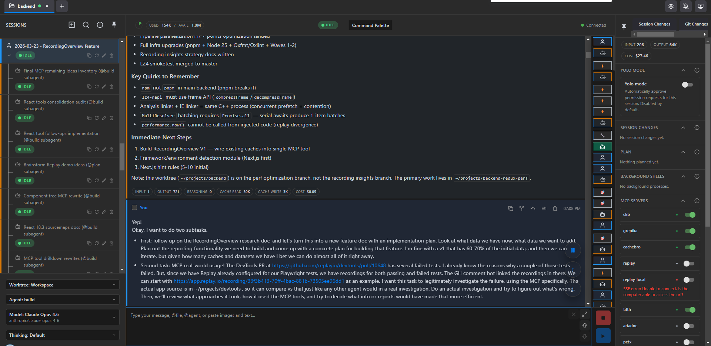
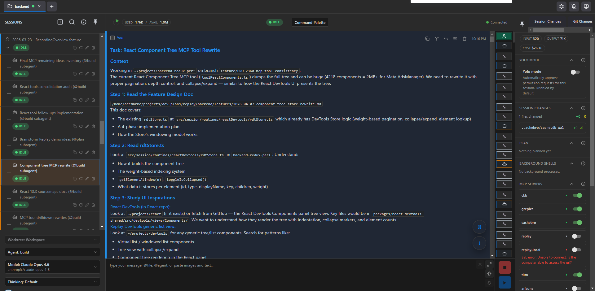
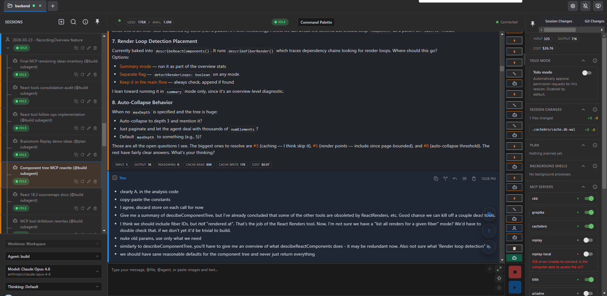
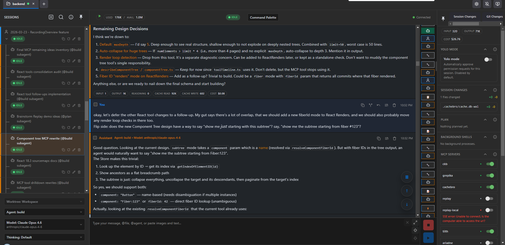

# Mark Erikson: скорость агента, ментальная модель и внешняя рабочая память

Mark Erikson нужен корпусу как история о пределе агентской скорости. У многих авторов код становится дешёвым, но Erikson особенно ясно показывает обратную сторону: если агент пишет быстрее, чем человек восстанавливает смысл, разработчик теряет [ментальную модель](#cross-story-synthesis--3-8-vneshnyaya-pamyat-kak-zaschita-ne-tolko-agenta-no-i-cheloveka) системы и превращается в обслуживающего чужие диффы. Поэтому его текущая обвязка вокруг OpenCode, CodeNomad, `dev-plans`, [handoff](#handbook--task-memory)-файлов, ролей, разрешений, [DiffLoupe](#theoretical-synthesis--34-agentu-nelzya-verit-na-slovo-no-i-cheloveka-nelzya-prevraschat-v-ruchnoy-lint), [Replay MCP](#handbook--mcp) и команд вроде `/progress` или `/dex-complete` отвечает не на желание “автоматизировать всё”, а на желание сохранить инженерное понимание.

Эта история связана с Arvid Kahl через тему долга понимания. Arvid формулирует её для одиночного SaaS: агентский код нельзя принимать, если владелец продукта уже не понимает, почему система устроена именно так. Erikson показывает похожую проблему на уровне сложных инструментов React/Redux/Replay: иногда можно временно двигаться через неполное понимание, логи и тесты, но перед принятием результата нужно восстановить причинную картину.

С HumanLayer его роднит мысль, что контекст — это не просто размер окна, а качество траектории. С Calvin French-Owen — что человеческое внимание становится главным ресурсом. С Jesse Vincent — что длинная агентская работа требует оркестрации и handoff между контекстами. Различие Erikson в том, что он особенно настойчиво переносит повторяемое из вероятностной работы модели в детерминированный слой: скрипт, генератор, lint rule, команду, проверку, инструмент или файл состояния.

Эту историю лучше читать не как справочник по конфигурации OpenCode, а как последовательное наращивание пяти слоёв: защита ментальной модели, временное движение через неполное понимание с обязательным восстановлением смысла, детерминизация повторяемых паттернов, внешняя память для долгих сессий и человеческие точки принятия состояния.

## 1. Исходная проблема: код появляется быстрее, чем восстанавливается смысл

Mark Erikson много лет работает в области React, Redux, TypeScript и инструментов отладки. Он основной мейнтейнер Redux, создатель Redux Toolkit, мейнтейнер React-Redux, Reselect и Immer; в Replay.io занимается time-travel debugging, анализом выполнения приложений и инструментированием React/Redux. Это важно не как биографическая справка. Его профессиональная сила связана с построением точной ментальной модели системы: что произошло, почему состояние изменилось, какие действия привели к результату, где проходит настоящая причинная цепочка.

Поэтому ИИ-инструменты сначала попадали в конфликт с его представлением о программировании. Его тревожило не только качество сгенерированной строки. Глубже был риск, что кодовая база начнёт расти быстрее, чем он успевает понимать, почему она устроена именно так. В таком режиме разработчик легко превращается в ревьюера чужих диффов и менеджера чужой логики. Для человека, который годами объяснял Redux через детерминированный поток данных и воспроизводимость состояния, это не мелкая психологическая оговорка, а удар по самому способу считать программирование инженерной деятельностью.

Первые безопасные применения были локальными. Copilot как автодополнение мог подсказать строку, но предложение было маленьким, его легко прочитать и отвергнуть. Позже модели стали полезны для объяснения чужого кода: можно попросить инструмент прочитать участок, пересказать структуру, найти связи, а затем сверить это со своей картой. Такой режим ещё не отдавал агенту право менять систему. Он только ускорял чтение.

Первый важный переход произошёл в Redux Toolkit. В RTK Query не хватало внутренних тестов. Erikson описал агенту код, логику, тестовую среду и нужный файл, затем попросил написать тесты. Агент вернул примерно 75 строк тестового кода. Erikson прочитал каждую строку и увидел, что код делает именно то, что он просил. Доверие появилось не из-за уверенного ответа модели, а из-за формы задачи: область изменения была маленькой, файл понятный, результат можно было полностью прочитать.

Это начальный паттерн всей истории. Агент получает работу тогда, когда есть способ восстановить понимание результата.

## 2. Агент сначала помогает читать систему, а не писать её заново

До зрелого OpenCode-процесса был промежуточный этап в Replay. Нужно было заменить набор переменных на уровне модуля, которые делали часть backend-системы singleton, на классы, чтобы можно было запускать несколько процессов анализа параллельно. Erikson не знал этот участок достаточно глубоко. Сначала он вручную занимался механическим протаскиванием объектов контекста OpenTelemetry `cx` через функции. Это было медленно, но полезно: через эту работу он начал строить собственную карту незнакомой части системы.

Только после этого он стал использовать KiloCode для архитектурных разборов. Агент читал участок и писал объяснения, которые помогали Erikson собрать мысленную схему. Здесь агент ещё не был автором реализации. Его роль — ускорить построение человеческого понимания.

Эта стадия важна для методологии. В агентской разработке часто сразу обсуждают запрос, план, генерацию кода и проверку. У Erikson появляется более ранний режим: агент как помощник в чтении незнакомой системы. Для сложного проекта это может быть безопаснее, чем сразу просить изменение. Сначала модель помогает увидеть карту, затем человек решает, где можно разрешить правку.

## 3. Ранние успехи и ранние сбои: доверие строится на проверяемых границах

После RTK Query тесты и архитектурных разборов Erikson начал поручать агентам более широкие задачи. Но важнее не список успехов, а то, как быстро появились разные классы ограничений.

### 3.1. `lz4-napi`: правдоподобный прогресс не равен готовому результату

Один из первых отрицательных эпизодов — попытка заменить `node-lz4`, мешавший обновлению Node, на `lz4-napi`. Агент продвинулся далеко: нашёл путь, построил реализацию, написал тесты совместимости. На поверхности это выглядело как успешная агентская работа.

Но потоковая часть работала неправильно. PR в `lz4-napi` был отклонён мейнтейнером. Это не синтаксическая ошибка и не обычный плохой дифф. Агент мог создать убедительную цепочку работы и тесты, но реальное поведение зависимости, особенно потоковый API, оказалось сложнее. Внешний мейнтейнер стал последней проверкой, и именно там выяснилось, что “почти реализовано” недостаточно.

Из этого эпизода следует один из будущих принципов Erikson: если задача зависит от поведения чужой библиотеки, совместимости API и неочевидной семантики среды выполнения, нельзя считать успехом только локальный прогресс агента. Нужны более сильные проверочные артефакты или честная маркировка результата как эксперимента.

### 3.2. Внутреннее lint rule: сначала понять систему, потом писать правило

Другой эпизод был более успешным: внутреннее lint rule для проверки неправильных `data-testid`. Erikson понимал AST, visitors, парсеры, `ts-morph` и похожие темы, но не знал детали их внутренней linting system. Агент сначала написал архитектурный документ по этой системе, затем создал пустой skeleton правила, встроил его в существующий механизм, добавил проверки JSX-паттернов, тесты, проверки для известных внутренних component types и дополнительные edge cases.

Рабочая механика здесь важнее результата. Это не “напиши lint rule”. Последовательность была другой:

```
прочитай внутреннюю linting system
→ объясни архитектуру
→ создай skeleton
→ встрои в существующий механизм
→ добавь JSX cases
→ добавь component-specific checks
→ напиши тесты

```

Для Erikson это был психологический перелом: за полтора часа получилось больше, чем он ожидал успеть вручную. Но процесс всё ещё начинался с чтения и архитектурного описания. Агент не прыгнул сразу к коду.

### 3.3. Побочный проект: подфичи закрыты, продукт не собран

Позже возник другой тип сбоя. В побочном проекте план был разбит на отдельные issues или подзадачи. Агент реализовывал их по отдельности, каждая подфича могла соответствовать описанию, но в конце оказалось, что они не связаны в единое работающее целое. Erikson заметил это только после того, как агент счёл все issues завершёнными.

Это не ошибка одной функции. Это потеря связности между задачами. Если смотреть на список чекбоксов, всё выполнено. Если смотреть на продуктовый поток, результат неполный.

Из этого вырастает потребность в родительской orchestrator-сессии. Дочерние задачи могут делать локальные куски, но должен быть уровень, который удерживает общую цель, связывает результаты, проверяет интеграционные хвосты и решает, что значит “готово”.

## 4. Immer: временное движение через неполное понимание и обязательное восстановление ментальной модели

Самый показательный эпизод из ранней практики — работа над производительностью Immer. Erikson потратил больше 110 часов свободного времени на оптимизацию Immer и использовал KiloCode почти постоянно. Это не была чистая история успеха агента. Там были удачные ускорения, тяжёлая ручная работа, неудачные попытки модели, отладка через логи и последующее восстановление понимания.

Сначала Erikson скачал Immer, Mutative, Limu и Structura. Он попросил агента прочитать README и документацию, сравнить заявленные преимущества библиотек, затем разобрать внутреннюю архитектуру и показать, где альтернативные библиотеки используют другие подходы. Потом агент помог построить инфраструктуру профилирования. Из-за перекоса `process.env.NODE_ENV` benchmark script нельзя было просто импортировать напрямую; его пришлось предварительно собрать. Затем нужны были скрипты, которые постобрабатывали traces производительности и связывали их с sourcemaps.

Самая важная часть — перенос Mutative cleanup approach в Immer. Агент трижды пытался сделать это сам и трижды терялся в изменениях. Erikson в итоге сделал ключевую часть вручную. После этого упало много unit тесты, и он перешёл в режим, который сам воспринимал как почти запретный: добавлял десятки строк логирования во внутренности Immer, запускал по одному тесту, копировал примерно 500 строк log spew в KiloCode и просил объяснить, что сломалось и как чинить.

На время он действительно позволил агенту вести часть отладки через логи. Затем, когда тесты прошли, он “включил мозг обратно”: прошёлся по диффам, восстановил смысл каждого изменения, где нужно попросил KiloCode объяснить rationale, выкинул debug code и достроил собственную ментальную модель. Позже агент помог портировать array/patch generation logic из Mutative, но и там были stuck loops и hallucinated исправления, которые Erikson направлял вручную.

Этот эпизод задаёт важное различение. Erikson не требует, чтобы человек полностью понимал каждый шаг до того, как агент сделает следующую попытку. Иногда полезно временно двигаться через туман: логи, тесты, гипотезы, поправки. Но нельзя принимать результат в проект, пока человек не восстановил понимание. Зелёные тесты сами по себе недостаточны, если код остаётся чужой непрозрачной массой.

Для CU это почти прямой урок: можно разрешить агенту exploratory execution, но нужен отдельный restoration pass, где смысл изменений возвращается человеку и документам.


Immer-эпизод полезно читать рядом с Arvid Kahl. У Arvid это называется долгом понимания: код нельзя принимать, если владелец продукта не может объяснить, почему он устроен именно так. Erikson допускает временное движение через логи и неполное понимание, но только как исследовательскую фазу. Принятие результата начинается позже, когда он восстановил ментальную модель и выбросил отладочный шум.

## 5. Детерминированный слой: если паттерн повторяется, его лучше закодировать

Один из самых сильных концептов Erikson — попытка сделать недетерминированную работу достаточно детерминированной. Он не считает, что LLM станет полностью предсказуемой. Его ответ другой: окружить её детерминированными слоями там, где это возможно.

Хороший пример — Replay Builder. Erikson увидел, что сгенерированные приложения плохо используют RTK: например, несколько файлов data fetching с разными паттернами там, где всё должно было идти через RTK Query. Ответом был не только “улучшить запрос”. Он построил 100% deterministic custom codegen system:

```
DB tables → Hono routes → RTK Query endpoints

```

Сначала правильный паттерн был зафиксирован в кодогенераторе. Затем обновились prebuilt blocks, появились проверки на example apps, а уже потом это стало подключаться к LLM через запросы и инструменты. Модель больше не должна была каждый раз заново угадывать, как правильно использовать RTK Query. Устойчивый паттерн был вынесен в генератор.

Отсюда общая логика:

```
если повторяемое решение можно закодировать,
не оставляй его на свободное усмотрение модели;
сделай script, generator, lint rule, command, skill или проверяемый tool.

```

Это не отменяет LLM. Модель остаётся полезной для исследования, планирования, объяснения, переноса, реализации и сжатия смысла. Но устойчивые участки процесса постепенно переносятся в более детерминированную среду.

## 6. Агент продолжает найденный человеком паттерн, но не обязательно рождает его

Ещё один важный пример — React/Redux analysis layer в Replay. В 2024–2025 Erikson вручную строил сложный слой инструментирования: искал фрагменты ReactDOM, сравнивал dev/prod artifacts, адаптировал instrumentation для React 18 и React 19, переживал переносы и переименования внутренних функций, учитывал Closure Compiler inlining, вводил factory function паттерн, где каждая точка instrumentation получала `reactVersion` object и через `if/else` выбирала нужные fragments, variables и snippets.

Первые проходы были намеренно ugly and unmaintainable. Сначала нужно было доказать, что вывод вообще правильный. Уже потом можно было искать абстракции.

Когда позже потребовалось расширять слой под новые React 19.x variations, Next.js variations и React canaries, агент оказался очень полезен. Но полезен он был потому, что человеческая основа уже существовала: были паттерны, file structures, factory functions, `ast-grep` usage, понимание, какие места важны и почему. Тогда задача агента стала другой: прочитать существующий паттерн, сравнить новый случай, провести расширение.

Это уточняет границу агентской силы в истории Erikson. Агент резко удешевляет продолжение и масштабирование уже найденной архитектурной формы. Но исходная форма — какие внутренности React нужно инструментировать, почему нужны factory functions, где проходит граница поддерживаемого хака — появилась из человеческого исследования.

Для переноса это важно. Если в вашем проекте нет найденного паттерна, агент может предложить правдоподобную структуру, но это другой уровень риска. Если паттерн уже найден, агент может быть очень сильным исполнителем продолжения.

## 7. Как ранние эпизоды переходят в текущую обвязку

Если читать предыдущие эпизоды как отдельные случаи, история снова начинает распадаться: RTK Query тесты, `lz4-napi`, Immer, React instrumentation, deterministic codegen. Их лучше связать одной причинной линией.

Erikson постепенно обнаруживает несколько повторяющихся требований к рабочей среде:

- агент должен помогать читать систему до правок, потому что без карты легко получить правдоподобный, но неверный дифф;
- exploratory work допустим, но перед принятием результата нужно восстановить человеческую ментальную модель;
- повторяемые паттерны лучше кодировать в deterministic scripts/generators/инструменты, а не каждый раз передоверять модели;
- длинная работа должна оставлять внешний след: что решили, что проверили, что осталось, какие гипотезы заменены;
- разные роли должны иметь разные права: координация, ревью, тестирование, документация и реализация не должны сливаться в одну всемогущую сессию;
- скорость полезна только пока человек успевает понимать и принимать результат.

Текущая обвязка OpenCode появляется как ответ на эти требования. Она не является произвольной коллекцией плагинов и команд. Каждый слой ниже закрывает один из этих рисков: потерю контекста, потерю связности между подзадачами, слишком большой вывод инструментов, отсутствие канала наблюдения за средой выполнения, слишком лёгкое “done”, слишком широкие права или неясный момент человеческого принятия.

## 8. OpenCode как рабочая поверхность: удобство интерфейса тоже часть процесса

К моменту описания зрелого процесса Erikson работает в OpenCode. Но он сначала оттолкнулся и от Claude Code, и от OpenCode как терминальных TUI-инструментов. Ему не понравилось взаимодействие в терминале как основная поверхность. Возвращение к OpenCode произошло через CodeNomad: веб-интерфейс к OpenCode, который даёт вкладки, более удобное копирование и вставку, просмотр файлов, дифф и историю сообщений.

Это не косметика. Для его процесса агентская среда должна быть удобна как рабочее место. Он работает на личном Windows-ноутбуке с Git Bash, а на рабочем ноутбуке часто через VS Code + WSL. CodeNomad позволяет запускать OpenCode-сервер внутри WSL и работать с ним из браузера Windows. Так он избегает части неудобств TUI и получает более привычную поверхность для чтения, копирования и ревью.

VS Code остаётся в основном средством просмотра файлов и диффа, а не главным местом написания кода. Fork ему нравится как Git GUI, но с WSL-папками он обновляется хуже, поэтому в некоторых случаях VS Code оказывается практичнее. Это пример того, как локальные ограничения — Windows, WSL, Git Bash, поведение GUI-инструментов — формируют агентский процесс сильнее, чем общие рассуждения о “лучшем IDE”.

В OpenCode он использует Anthropic-модели через API. В опубликованной конфигурации основной моделью стоит `anthropic/claude-opus-4-6`, для `explore`-агента — `anthropic/claude-sonnet-4-6`, для малой модели — `anthropic/claude-haiku-4-5`. Это отражает разделение ролей и стоимости: сильная модель для основной работы, Sonnet для исследовательского режима, Haiku для малых служебных задач.

## 9. Родительская сессия-оркестратор: центр связности, а не исполнитель кода

<figure class="source-figure" id="fig-story-10-mark-codenomad-parent">
  
  <figcaption>Скриншот показывает центральную форму текущего процесса Erikson: родительская сессия не просто пишет код, а удерживает связность и управляет подзадачами. Источник: <a href="https://blog.isquaredsoftware.com/2026/05/thoughts-on-ai-part-2/">Thoughts on AI, Part 2</a>. Локальный файл: <code>../assets/story-images/10-mark-codenomad-parent-orchestrator.png</code>.</figcaption>
</figure>

Главная рабочая форма Erikson — long-running parent session, которую он описывает как Orchestrator. Её задача — держать общее состояние: что сейчас делается, почему, какие подзадачи уже отправлены, какие результаты пришли, что осталось, где нужен человеческий выбор.

Erikson остаётся активным управляющим. Он решает, какие задачи запускать, какие исследования нужны, когда переходить от research к реализации, когда pivot’ить, что считать готовым, какие изменения принять, какие отклонить и когда коммитить. Агент может писать запросы для дочерних задач, проводить исследование, предлагать план и делать правки, но не получает права самостоятельно закрывать весь смысловой цикл.

В config repo эта роль закреплена не только привычкой, но и отдельным subagent definition. `orchestrator.md` запрещает редактировать файлы и запускать shell: `edit: deny`, `bash: deny`, `task: allow`. Его роль — понять общую цель, разбить работу на phases/tasks, spawn subtasks, синтезировать результаты и найти blockers. Он не должен писать код.

Важная грязная деталь — запрет auto-respawn. Если subtask возвращает пустой результат, `{}`, early response или похожий “не завершил работу” ответ, orchestrator не должен отправлять ещё одно сообщение в тот же subtask и не должен запускать новый subtask для продолжения. Причина из практики: Erikson часто сам напрямую ведёт дочернюю сессию после её первоначального ответа, а если нажать Stop, parent получает пустой return value. Без запрета orchestrator решил бы, что дочерняя задача не справилась, и плодил бы новые задачи поверх живой ручной работы.

Это точный пример того, как реальная работа ломает гладкую multi-agent схему. На бумаге parent должен следить за child tasks. На практике человек может войти в child session, направить её вручную, остановить, вернуть результат позже. Рабочая обвязка должна учитывать не идеальную диаграмму, а фактическое вмешательство человека.


Детерминированный слой Erikson хорошо сочетается с Mae Capozzi и HumanLayer. Mae выносит повторяемые миграционные ошибки в codemods, backstops и линтеры. HumanLayer напоминает, что Claude не должен быть линтером: механическое лучше отдавать инструментам. Erikson показывает тот же принцип изнутри: если паттерн устойчив, его нужно сделать скриптом, генератором, правилом или командой, а не каждый раз просить модель угадать.

## 10. Дочерние задачи и handoff: подзадача должна вернуть не “done”, а переносимое состояние

<figure class="source-figure" id="fig-story-10-mark-child-prompt">
  
  <figcaption>Скриншот показывает, что child task получает не общую просьбу, а ограниченный рабочий контракт. Источник: <a href="https://blog.isquaredsoftware.com/2026/05/thoughts-on-ai-part-2/">Thoughts on AI, Part 2</a>. Локальный файл: <code>../assets/story-images/10-mark-codenomad-child-prompt.png</code>.</figcaption>
</figure>


<figure class="source-figure" id="fig-story-10-mark-child-discussion">
  
  <figcaption>Этот скриншот добавляет недостающую пару к parent/child картинкам: подзадача должна возвращать обсуждаемое переносимое состояние, а не просто “done”. Источник: <a href="https://blog.isquaredsoftware.com/2026/05/thoughts-on-ai-part-2/">My Thoughts on AI, Part 2</a>. Локальный файл: <code>../assets/story-images/10-mark-codenomad-child-discussion.png</code>.</figcaption>
</figure>

Дочерние задачи у Erikson — отдельные рабочие контексты для фактической работы. Родительская сессия формирует для них запросы, а Erikson обычно остаётся интерактивным: читает research, правит план, направляет coding. Это не режим “запустить десять агентов и уйти”. Родительская сессия удерживает внешнее состояние, дочерняя задача получает ограниченную работу, человек проверяет, что локальный результат помогает общей цели.

Иногда запрос для дочерней задачи может быть коротким: “spawn a new subtask...” или “kick off phase 3”. Это не обязательно слабый запрос. В сильной среде короткий запрос является указателем на уже собранный контекст. В слабой среде та же фраза была бы просьбой модели угадать задачу.

Для возврата результата есть команды `/subtask-complete` и `/subtask-resume`.

`/subtask-complete` вызывает:

```
~/.config/opencode/scripts/devplans.ts handoff create [slug]

```

Скрипт возвращает путь вроде:

```
{"file":"/path/pending/2026-01-28-2030-fix-routing.md","dir":"/path/pending","timestamp":"2026-01-28 20:30","project":"OpenCode"}

```

Дочерняя сессия записывает handoff в этот файл. Шаблон включает цель, выполненные пункты, ключевые изменения по файлам, findings/decisions, corrections received, discovered about codebase, QUIRKS candidates и секцию `For Parent Session`.

Последняя секция самая важная. Родительской сессии не нужна полная стенограмма дочерней работы. Ей нужно понять, что изменилось, какие решения были приняты, что осталось, какие новые факты влияют на дальнейшую работу.

`/subtask-resume` выполняется в родительской сессии. Она вызывает `devplans.ts handoff consume`, получает все pending handoffs, показывает краткое изложение, переносит файлы в `completed/` и обновляет понимание текущей работы. Handoff не удаляется, а перемещается в историю.

Это прямой ответ на ранний сбой с несвязанными подфичами. Если каждая дочерняя задача возвращает не только “готово”, а key changes, decisions, learnings and parent next steps, родительская сессия получает шанс увидеть интеграционные хвосты до того, как список задач будет формально закрыт.

## 11. `dev-plans`: внешняя рабочая память, отделённая от репозитория кода


У `dev-plans` есть личная предыстория. Erikson много лет вёл рабочий журнал, личные заметки и блог. В декабре 2025 он даже использовал LLM для свёртки старых записей журнала: вертикальные резюме по проектам, росту как инженера, успехам и слабым местам. Поэтому `dev-plans` не возникает из воздуха как “agent trick”. Это продолжение старой привычки фиксировать рабочую память, только теперь эта память становится доступной агенту и участвует в ходе разработки.

Ранний опыт с KiloCode породил практическую проблему: агенты постоянно создавали плановые файлы в корне проекта или в `docs/`. Для личной работы это удобно, но для shared репозиторий это мусор. Не каждый временный план, черновик исследования или progress update должен попадать в основной репозиторий библиотеки или продукта.

Ответ — отдельный личный `dev-plans`-репозиторий. Проектный репозиторий остаётся местом кода, тестов и team-shared документов. `dev-plans` хранит личные рабочие артефакты: текущий фокус, исследования, планы фич, progress updates, архитектурные заметки, handoff’ы дочерних задач и локальные quirks.

Типовая структура в публичном примере:

```
dev-plans/
  work/
    my-app/
      current-focus.md
      QUIRKS.md
      architecture/
      features/
      progress-updates/
      subtask-handoffs/
        pending/
        completed/

```

В реальности у Erikson есть разные области вроде personal, Redux, Replay, side projects. Конкретное дерево может отличаться, но принцип устойчивый: рабочая память отделена от продакшен-кода и от публичных документов.

`current-focus.md` нужен для ориентации новой или возвращающейся сессии. Он хранит active work, ветку, PR, контекст, blockers and next steps. В примере shopping list фича там прямо зафиксировано: aggregation engine done, wiring into UI; ветку `feature/shopping-list`; URL fetching работает via edge function; JSON-LD extraction covers \~70%; volumetric↔weight conversion deliberately scoped out. Это маленький пример того, как рабочее состояние становится читаемым для следующей сессии.

`QUIRKS.md` хранит project-specific gotchas с датами и severity. Примеры из шаблона: critical — `pnpm build:types` должен идти перед `pnpm test`, потому что тесты импортируют generated type declarations; important — `vitest.config.ts` uses custom resolver for `@/` imports; note — лучше `pnpm test:unit path/to/file`, потому что полный suite идёт больше трёх минут. Дата помогает увидеть, не устарело ли правило.

Для CU это важная форма: не все знания должны становиться частью основного репозитория. Часть знания принадлежит рабочему процессу оператора: что сейчас делается, где агент ошибался, какие временные ограничения важны, какие решения ещё не стали командным соглашением.

## 12. `devplans.ts`: файловая память получает API

Если бы `dev-plans` был только папкой markdown-файлов, он быстро превратился бы в ручной архив. Erikson добавляет `devplans.ts` — helper script, который делает операции с рабочими документами стандартными и безопасными для агента.

Основные команды:

```
bun ~/.config/opencode/scripts/devplans.ts info
bun ~/.config/opencode/scripts/devplans.ts progress
bun ~/.config/opencode/scripts/devplans.ts progress list 2
bun ~/.config/opencode/scripts/devplans.ts progress append <tempFile>
bun ~/.config/opencode/scripts/devplans.ts handoff create <slug>
bun ~/.config/opencode/scripts/devplans.ts handoff consume
bun ~/.config/opencode/scripts/devplans.ts doc create <type> <slug>
bun ~/.config/opencode/scripts/devplans.ts doc list <type> [n]
bun ~/.config/opencode/scripts/devplans.ts archive <folder>

```

`info` определяет, какой project mapping соответствует текущей директории. Конфиг различает Windows and WSL base paths, потому что Erikson реально работает между Windows/Git Bash и WSL. Это не украшение: путь, который работает в одной среде, может сломать permission checker или не совпасть с файловой системой в другой.

`doc create` создаёт dated docs для `feature`, `arch`, `analysis`, `issue`, `research`. `archive` переносит старые файлы в `archive/YYYY/MM/DD`. Handoff-команды создают `pending/`-файлы и затем перемещают их в `completed/YYYY/MM/DD/`.

Самая важная инженерная переделка касается `/progress`. Ранний вариант читал растущий daily progress file, добавлял запись и обновлял содержание. С каждым новым progress entry файл становился больше, и следующая запись снова загружала весь файл в контекст. Получался почти квадратичный рост потребления контекста.

Erikson исправил это механически. Команда `progress` создаёт маленький временный JSON-файл внутри `dev-plans`. Агент читает этот scaffold, записывает новую entry JSON, затем вызывает:

```
bun ~/.config/opencode/scripts/devplans.ts progress append <tempFile>

```

Скрипт читает JSON, удаляет временный файл, вставляет entry, пересобирает Summary, заменяет Next Steps, возвращает короткий результат. Модель пишет смысловое содержание, а не вручную правит большой markdown.

Есть и локальная ночная деталь: если сейчас раньше 6 утра, `progress` использует предыдущую дату. Это выглядит мелко, но показывает, что система приспособлена к реальному режиму работы, где поздняя сессия может относиться к предыдущему рабочему дню.

## 13. `/context`, `/progress`, `/dex-complete`: память возвращается в сессию, но принятие остаётся ручным

<figure class="source-figure" id="fig-story-10-mark-design-decisions">
  
  <figcaption>Скриншот поддерживает раздел о ручном принятии состояния: важные решения должны вернуться из агентской работы в читаемый артефакт. Источник: <a href="https://blog.isquaredsoftware.com/2026/05/thoughts-on-ai-part-2/">Thoughts on AI, Part 2</a>. Локальный файл: <code>../assets/story-images/10-mark-codenomad-design-decisions.png</code>.</figcaption>
</figure>

Команда `/context` загружает рабочую память обратно в сессию. Она вызывает `devplans.ts info`, читает `QUIRKS.md`, затем `current-focus.md` и активный work doc, потом последние progress-файлы — обычно один-два — и извлекает recent learnings, corrections and untriaged QUIRKS candidates. Результат должен быть кратким: ориентация, а не полный dump архива.

У Erikson есть отдельное правило `Supersession`: когда новое понимание обновляет или противоречит старому, агент должен явно писать:

```
UPDATE: [old understanding] → [new understanding]

```

Это защита от дрейфа. Агентские сессии часто накапливают промежуточные гипотезы. Если новая информация их опровергает, нужно явно пометить замену старой карты новой.

`/progress` фиксирует итог productive session. Entry обычно 30–50 строк: что построено и почему, key functions/types, files changed, тесты/typecheck status, проверка краткое изложение, design decisions, session learnings, QUIRKS candidates, fresh next steps. Главное правило: progress update пишет текущая сессия, не дочерний агент. Именно текущая сессия имеет наиболее целостную картину.

`/dex-complete` показывает тот же принцип на persistent task tracking. Команда сначала ищет task ID в явном аргументе, session запрос, `dex list --in-progress` или pending tasks. Если уверенность средняя или низкая, она спрашивает пользователя. Затем требует verification: тесты passing, typecheck clean, concrete свидетельства. Только после этого формирует:

```
dex complete <task-id> --result "..."

```

Bad results вроде “Done”, “Should work now”, “Made the changes” прямо запрещены. Хороший результат должен сказать, что изменилось, какие решения приняты и какая проверка это подтверждает.

Здесь важна методологическая граница: Erikson автоматизирует file mechanics, timestamps, краткое изложение rebuild, path routing, handoff movement. Но переход “это состояние принято”, “задача закрыта”, “можно коммитить” остаётся у человека. Это не недостроенная автоматизация, а сознательный human gate.


Родительская orchestrator-сессия Erikson перекликается с Jesse Vincent и Calvin French-Owen. Vincent разделяет архитектурный и реализационный контексты, Calvin распределяет роли между Claude Code, Codex, Cursor и проверяющими агентами. У Erikson ключевой критерий другой: дочерняя задача должна вернуть переносимое состояние, а не просто сообщить “готово”.

## 14. `AGENTS.md`: короткий устойчивый слой поведения

Опубликованный `AGENTS.md` начинается с critical rules:

```
Never auto-commit
Plan before implement
Use ~/ paths
No sycophancy
No any types
Escalate after 2 failures
Minimize context

```

Каждое правило выросло из реального трения.

`Never auto-commit` защищает человеческую границу принятия. Агент может редактировать, запускать проверки и сказать “changes ready for проверка”, но коммит происходит только по явной инструкции. Коммит — не просто техническая операция, а фиксация решения.

`Plan before implement` применяется к нетривиальным задачам: три и больше шага, multi-file changes, refactoring, new фичи, non-obvious баги. Перед реализацией агент должен restate goal, list concrete steps, identify risks, check assumptions, list unresolved questions и ждать approval. При этом есть исключения: obvious single-line исправления, явное “just do it”, follow-up on approved plan.

`Use ~/ paths` — очень локальное правило. В Git Bash и Windows-путях полные quoted expanded paths вызывали проблемы с permission checker. Поэтому агенту говорят использовать `~/`, а не разворачивать путь до `C:/Users/...`. Это пример “грязной” детали, которая объясняет правило лучше любой абстракции.

`No sycophancy` запрещает “You're absolutely right!”, “Excellent point!” и пустую валидацию. Erikson нужна краткая фактическая коммуникация, потому что в процессе, где агент должен находить риски и ошибки, лесть снижает полезное трение.

`No any types` фиксирует TypeScript-границу. Агентам легко обойти сложный типовой конфликт через `any`. Для мейнтейнера Redux Toolkit, React-Redux, Reselect and Immer это опасно: `any` скрывает настоящий контракт.

`Escalate after 2 failures` предотвращает циклы. Если подход дважды не сработал, агент должен остановиться, описать, что пробовал, что произошло, возможные root causes и вернуться с новым подходом.

`Minimize context` связывает `AGENTS.md` с инструментальной средой: читать outlines first, then targeted sections. Полное чтение файлов считается дорогой и часто вредной привычкой.

## 15. Навигация по коду: агент должен искать точечно, а не заливать контекст файлами

Erikson явно задаёт hierarchy инструментов:

```
Directory overview → grepika toc
Find code → grepika search
File structure → grepika outline → get line range
Symbol definitions → tilth search
Callers → tilth search kind:callers
Entry points → ariadne list_entrypoints
Call graph → ariadne show_call_graph_neighborhood
Non-code files → cachebro_read_file / cachebro_read_files

```

Это не просто удобный список. Он отражает принцип: качество контекста важнее его количества. Если агент открывает полный файл каждый раз, он заполняет окно шумом. Если он читает outline, затем точечный range, потом callers или entry points, он строит карту постепенно.

`cachebro` добавляет file cache with дифф tracking. Стандартный OpenCode `Read` плохо подходит для повторного просмотра больших файлов: агент снова получает полный текст. `cachebro` кэширует первое чтение и при последующих чтениях возвращает либо unchanged, либо compact дифф.

Но и этот инструмент породил сбой. OpenCode сам отслеживает, видел ли агент файл перед редактированием, чтобы не позволить править невидимый файл. Если файл читался через cachebro MCP, OpenCode об этом не знал. Erikson в своём локальном fork добавил доступ к file access time через Plugin API и построил `cachebro-bridge`, чтобы OpenCode понимал, что файл был прочитан. Это точный пример того, где ломается agent обвязка: не на уровне “модель не поняла задачу”, а на несовпадении состояния между внешним MCP-инструментом и внутренней логикой разрешения редактирования.

Был и отрицательный пример: `rtk grep`. Erikson попробовал добавить кастомный grep-инструмент, который возвращал бы сжатый grep вывод. Но он изменял формат настолько сильно, что агент путался и начинал зацикливаться. Инструмент отключили. Это важный антипример: не всякая контекстная оптимизация полезна. Если вывод становится непривычным или теряет структуру, модель хуже им пользуется, даже если токенов стало меньше.

## 16. Экономия контекста доходит до описаний инструментов

У Erikson борьба за контекст не останавливается на `dev-plans` и file reading. Она доходит до поверхности инструментов.

`OpenSlimEdit.ts` aggressively shortens инструмент descriptions. `read`, `edit`, `bash`, `task`, `batch`, `todowrite`, `lsp` и другие инструменты получают более короткие, практические описания. Тот же plugin компактит вывод `read`: сокращает absolute path до relative, убирает type tag и footer. Для `edit` он добавляет рабочий обход: `oldString` может быть диапазоном строк вроде `55-64`, а plugin перед выполнением сам превращает этот диапазон в реальный текст файла.

Это важная фактура: контекст economy у Erikson — не лозунг, а серия низкоуровневых вмешательств в то, что видит агент.

Команда `/tokens` дополняет этот слой. Она напрямую вызывает `context_usage` и просит вернуть breakdown по категориям и инструментам: system, user, assistant, инструменты, reasoning; какие инструмент outputs занимают больше всего. То есть потребление контекста становится наблюдаемой величиной, а не ощущением “сессия раздулась”.

Session инструменты закрывают другой вид потери состояния. Ранний `/session-reload` экспортировал OpenCode session JSON в markdown. Потом OpenCode 1.2 перешёл от JSON-файлов к SQLite, и старый подход сломался. Erikson переписал session history plugin через `client.session`. Появились `search_sessions`, `read_session`, `reload_session`: regex-based search with temporal decay, snippets, full transcript reading, current-session reload with compaction messages filtered out by вариант по умолчанию.

Параллельно Dynamic Context Pruning plugin даёт `compress` инструмент. Идея отличается от обычного большого краткое изложение: создать меньший очищенный контекст, оставляя нужные части, а не превращая всё в один пересказ.

Так складывается общий подход: не “модель должна запомнить больше”, а “среда должна дать ей правильный кусок памяти в правильный момент”.

## 17. Permissions: не YOLO, но и не бесконечные подтверждения

Erikson не запускает агента в полноценной песочнице и не использует опасный режим как норму. Он работает на своей машине, поэтому ему нужны ограничения. Одновременно постоянные permission запросы мешают безопасной рутине.

В `opencode.json` виден компромисс. Чтение и редактирование разрешены. Bash по умолчанию `ask`. Разрешены безопасные и часто нужные команды: `git status`, `git diff`, `git log`, `ls`, `pwd`, `rg`, `cat`, `pnpm test *`, `pnpm build`, `pnpm typecheck`, `rtk *`. Запрещены `sudo *`, опасные `rm -rf` по root/home, `git push --force *`, `git push -f *`, `git reset --hard *`.

Custom permission checker auto-approves read/write/edit/glob/grep для `dev-plans` and temp paths, оценивает bash commands и логирует decisions. В core-логике есть проверки для `bun -e` / `bun eval`: опасные inline паттерны вроде file writes/deletes, process spawning, network requests, `eval`, `child_process` не auto-approved. Есть анализ heredoc bodies, command substitution, process substitution, вывод redirection, `sed -i`, splitting chains by `&&`, `||`, `;`, `|` with quote handling.

Не нужно превращать историю в документацию по парсеру shell-команд. Но уровень детализации важен: Erikson не просто написал “allow safe commands”. Он начал строить real permission analysis, потому что простые regex allow/deny быстро становятся либо слишком широкими, либо слишком раздражающими.

Потом OpenCode refactor permissions временно отключил возможность плагинам возвращать статус из `permission.ask`, и Erikson стал поддерживать локальный fork. Это показывает цену кастомного обвязка: если процесс зависит от Plugin API, изменения платформы могут сломать слой безопасности и удобства.


Разрешения Erikson занимают промежуточное место между Peter Steinberger и Mike McQuaid. Он не хочет бесконечных подтверждений, но и не принимает полный YOLO-режим как норму. Mike решает это операционно через отдельного пользователя и песочницу, Arvid — через `allow` / `deny` и тестовую среду. Erikson удерживает право человека принимать состояние там, где автоматизация могла бы незаметно закрыть задачу.

## 18. Replay MCP: агенту нужен канал наблюдения за выполнением, а не только файлы

Самая сильная линия из day job Erikson — Replay.io. Здесь хорошо видно, что агент плохо отлаживает UI/React-проблему без правильного канала наблюдения.

Пример: PR с переходом DevTools UI на React 19 ломал Playwright E2E. Человек быстро увидел в записи ошибку `findDOMNode is not a function`. Агент же минут 10–15 блуждал. У него был `ConsoleMessages` инструмент, но он оказался сломан и не возвращал нужную ошибку. Erikson подсказал использовать `Screenshot`, агент увидел error overlay, затем добавил logpoint и наконец извлёк ошибку.

Этот случай важен не как “агент ошибся”. Он показывает, что правильный инструмент наблюдения меняет саму задачу. Если агент видит только файлы и падающий тест, он может искать неправильно. Если он видит запись выполнения, ошибки консоли, React renders, Redux actions и состояние приложения во времени, у него появляется более детерминированная карта.

После этого Erikson начал строить [Replay MCP](#handbook--mcp) инструменты: `RecordingOverview`, `ReactRenders`, `ReduxActions`, инструменты для Zustand и TanStack Query и другие средства анализа. С ними агент мог находить тот же тип проблемы меньше чем за минуту, а другой React баг — меньше чем за десять минут.

Для Handbook это важный класс фактуры. Не всякий MCP полезен. Полезен тот, который даёт модели воспроизводимое свидетельство о выполнении системы: запись, render tree, actions, query state, console errors, logpoints. Если инструмент сломан, агент выглядит глупым. Если инструмент правильно спроектирован, та же модель становится исследователем выполнения.

## 19. Проверка: DiffLoupe, reviewer-agent и запрет автоматического принятия замечаний

В конфигурации есть `/code-review`, который запускает [DiffLoupe](#theoretical-synthesis--34-agentu-nelzya-verit-na-slovo-no-i-cheloveka-nelzya-prevraschat-v-ruchnoy-lint). Он анализирует staged/unstaged/`HEAD`/ветку/PR/commit, выводит derived intent, risk assessment and intent alignment. Intent можно передать явно, вывести из текущей сессии или взять из Git/PR контекст.

Смысл не в “ещё одном ИИ-ревью”. DiffLoupe сравнивает изменения с намерением. Агент может написать валидный код, пройти тесты and typecheck, но решить чуть другую задачу. Поэтому отдельная проверка intent alignment важна.

Рядом есть `проверяющий.md` — read-only code проверяющий. У него `edit: deny`; разрешены только команды вроде `git diff`, `git show`, `git log`, `git blame`, `rg`, `wc`, `head`, `tail`, остальное запрещено. Его философия:

```
diffs alone are not enough;
read full modified files;
don't invent hypothetical problems;
don't nitpick style that linters catch;
only review changed code;
distinguish must fix / should fix / consider.

```

Это дополняет DiffLoupe. Review у Erikson — не только инструмент-команда, но и отдельная ограниченная роль, которой запрещено исправлять код. Проверяющий должен анализировать, а не начинать чинить. Иначе одна модель легко превращается в исполнителя замечаний другой модели без человеческого решения.

## 20. Роли subagents: разделение не по красивым персонам, а по правам и типу работы

Кроме orchestrator and reviewer, в конфигурации есть `test.md` and `docs.md`.

`test.md` — тест engineer. Он пишет unit, integration and e2e тесты, debug’ит сбои, анализирует coverage, проектирует тест strategies. Он должен смотреть `package.json` и использовать project-specific commands, запускать конкретные тест files, а full suite — только для общей проверки pass/fail.

`docs.md` — documentation specialist. У него `bash: deny`. Он пишет library documentation, README, API docs, guides and tutorials для проектов вроде Redux Toolkit, Immer and React-Redux. Важно: это для public/library documentation, not internal [dev-plans](#handbook--task-memory). Он должен обновлять существующие docs, а не создавать параллельные версии.

Такие роли не являются театральными “персонами”. Они задают права и границы работы. Orchestrator не пишет код. Reviewer не правит файлы. Docs-agent не запускает shell. Test-agent имеет узкий профиль проверки. Это снижает вероятность, что одна сессия начнёт делать всё сразу.

## 21. Полная автоматизация сознательно не завершена

После всех плагинов, скриптов и команд может показаться, что Erikson строит систему полной автоматизации. На самом деле он оставляет ручные triggers там, где это точки принятия состояния.

Он сам запускает `/progress`. Сам вызывает `/subtask-complete` перед закрытием дочерней задачи. Сам возвращается в parent session и запускает `/subtask-resume`. Сам делает Git staging, commit messages and коммиты. Dex tasks не должны закрываться без проверки и уверенности. `dex-complete.md` подтверждает это на уровне процедуры: если task ID найден с низкой или средней уверенностью, нужно спрашивать пользователя; если verification не сделана, её нужно сделать; result должен содержать, что изменилось, key decisions and verification.

Это не пробел автоматизации. Это сознательное разделение:

```
механику файлов, путей, дат, вставок и перемещений можно автоматизировать;
принятие состояния, закрытие задачи и фиксация результата остаются у человека.

```

Для CU это особенно важно. Экзоскелет должен уменьшать рутину, но не должен незаметно переносить право принятия решения туда, где человек думал, что остаётся владельцем смысла.


Replay MCP связывает Erikson с Arvid Kahl, Simon Willison и Mae Capozzi. У Arvid агент смотрит на работающее приложение через браузер. У Willison исследовательский агент оставляет benchmark, график или demo. У Mae агентская работа становится видимой через telemetry и `TRACEPARENT`. У Erikson канал наблюдения нужен для сохранения причинной модели выполнения, а не только для подтверждения зелёного теста.

## 22. Ограничение скорости: параллелизм должен выдерживать человеческое понимание

Erikson прямо пишет, что две-три agent sessions уже создают заметное переключение контекста. Дальше возникает соблазн снять тормоза: больше агентов, меньше подтверждений, больше dashboard’ов, выше PR rate. Его ответ противоположный: если идти слишком быстро, система разбивается.

Это не слабость инструментальная среда. Это осознанная часть процесса. Человек удерживает intent, taste, risk, проверка and mental model. Если поток агентских результатов превышает способность человека понимать и принимать, скорость становится вредной.

Здесь история Erikson отличается от наивной метрики “сколько агентов можно запустить параллельно”. Для него вопрос не в максимальном throughput. Вопрос в темпе, при котором агент ускоряет работу, но human understanding ещё не выпадает из цикла.

Так же он описывает возвращение к flow. Он не всегда пишет конкретные строки сам, но всё ещё crafts the software: думает над реализация approaches, даёт агенту разворачивать идеи, проверяет результат, решает, что менять дальше, когда subtask завершён и куда двигаться. Ремесло переносится вверх: taste, judgment, experience, контекст, запросы, guardrails, vision.

Финальная рамка у него — sustainable, maintainable, understandable, safely productive рабочий процесс. Это ускорение без разрушения понимания.

## 23. Нерешённая граница: долгосрочная память всё ещё слабее, чем нужно

Текущий `dev-plans` хорошо отвечает на вопросы “в каком репозитории мы работаем?” и “какие задачи сейчас активны?”. Но сам Erikson считает этот слой неполным.

Ему не хватает индексации или сканирования generated planning/progress files, динамического подмешивания релевантных результатов в текущую сессию и MCP-инструменты для поиска по уже проиндексированным файлам. Ему также нужен автоматический процесс, который просматривал бы recent sessions, находил повторяющиеся corrections, паттерны and learnings, а затем предлагал рабочий процесс improvements или обновления `QUIRKS.md`.

Это не мелкая future-work заметка. Это показывает границу всей системы. `dev-plans` уже является внешней рабочей памятью, но пока это в основном файловая память с ручными командами `/context`, `/progress`, `/subtask-resume` and regex-based session search. Следующий недостающий слой — active retrieval поверх этой памяти: найти релевантное старое решение без ручного копания, отличить свежее знание от устаревшего, извлечь повторяемые уроки из нескольких сессий и предложить обновление правил.

Для Noveia/CU это один из самых ценных мостов. Erikson уже построил файловую рабочую память, но прямо упирается в отсутствие умной активной памяти.

## 24. Что эта история добавляет к корпусу

Если сравнивать только по центральной оси, Mark Erikson добавляет практику **личной агентской рабочей памяти и контролируемого делегирования вокруг долгих сессий**.

У Boris Tane документ — это место человеческого решения перед реализацией. У Erikson документов больше, и они живут не только до реализации: current focus, progress, handoff, quirks, research, фича plan, architecture note, проверка result. Вся система нужна, потому что работа не укладывается в один план и один дифф.

У HumanLayer `harness` описывается как среда исполнения агента. У Erikson мы видим бытовую, конкретную, частично грязную реализацию похожей идеи на личной машине: OpenCode config, MCP, plugins, scripts, permissions, `dev-plans`, session инструменты.

У Jökull Sólberg `skills` проводят PR через внешние системы. У Erikson commands and scripts чаще удерживают внутреннюю память работы: что делали сегодня, какие подзадачи вернулись, что сейчас активно, что агент узнал и какие quirks стоит сохранить.

У Mike McQuaid центр — sandbox and рабочих деревьев. У Erikson sandbox почти отсутствует. Он делает ставку на permission rules, human commit boundary and local инструментальная среда. Это менее безопасно как универсальный процесс, но показывает другой слой: даже без сильной изоляции можно построить много внешних опор для памяти и проверки.

Главное отличие Erikson: он держит вместе три вещи, которые легко разъезжаются:

```
ментальная модель человека;
детерминированные инструменты;
агентское ускорение.

```

Если убрать первое, получится безответственное vibe coding. Если убрать второе, получится бесконечный запрос-workaround. Если убрать третье, останется обычная ручная инженерия без нового рычага.

## 25. Переносимость в CU / doc-first / dev-process

Для CU эта история полезна в нескольких местах.

Первое — разделение кодового репозитория и репозитория рабочей памяти. Не каждый исследовательский документ должен попадать в основной проект. Нужен слой, где можно хранить личные планы, progress, handoff’ы, research-файлы и quirks, не загрязняя продакшен repo.

Второе — parent/child session model. Дочерняя задача полезна только если есть parent layer, который удерживает цель, принимает handoff, проверяет связность и решает, что делать дальше. Это близко к разделению “локальная операция” и “проведение дельты через систему”.

Третье — детерминированные scripts вокруг markdown. Агент должен писать смысловое содержание, но механика добавления записи, сортировки, краткое изложение rebuild, перемещения handoff’ов и date handling должна быть в коде.

Четвёртое — контекст routing вместо большого запрос’а. `AGENTS.md`, `QUIRKS.md`, current focus, progress, skills, session search, cachebro, grepika, tilth, OpenSlimEdit and контекст\_usage показывают разные каналы контекста. Хороший процесс должен решать, что подгрузить сейчас, а что оставить во внешней памяти.

Пятое — состояние “готово” должно быть проверочным. Нужны concrete verification steps, counts, targeted тесты, grep, дифф проверка, intent alignment. Без этого агент слишком легко закрывает подзадачу по внутреннему ощущению завершённости.

Шестое — harness сам становится объектом сопровождения. Плагины ломаются от refactor’а OpenCode, старые session scripts ломаются из-за перехода с JSON на SQLite, `AGENTS.md` разрастается, permission checker требует parsing. Экзоскелет нельзя считать статичной документацией. Его нужно версионировать, чинить, чистить и проверять как рабочий инструмент.

Седьмое — человеческие gates должны быть явными. Коммит, закрытие Dex-задачи, принятие progress, завершение дочерней задачи и переход к следующей фазе — это не просто технические операции. Это места, где человек подтверждает состояние смысла.

## 26. Ограничения и непереносимые части

У истории есть явные ограничения.

Во-первых, значительная часть конфигурации Erikson — личная и локальная. Он опытный мейнтейнер Redux и разработчик Replay, хорошо понимает React/TypeScript-экосистему, умеет читать результат агента и держит высокую планку ревью. Новичок, скопировавший `dev-plans` и `/progress`, не получит автоматически такой же контроль.

Во-вторых, публичный config repo — sanitized snapshot. В нём заменены API keys и личные пути, а реальные `dev-plans`, внутренние Replay-артефакты и полные рабочие сессии остаются приватными. Мы видим архитектуру процесса и cleaned-up mechanics, но не полный ежедневный корпус.

В-третьих, отсутствие sandbox — сознательный, но спорный компромисс. Erikson не работает в YOLO-режиме, использует permission rules and human commit boundary, но это не тот же уровень защиты, что Sandvault или контейнер. Для команды, закрытого кода или агентов с широким сетевым доступом такой режим нужно усиливать.

В-четвёртых, часть инструментов находится в движении. OpenCode меняет API, session storage, permission hooks; отдельные plugins and MCP-инструменты могут устареть. История особенно чувствительна к версии среды.

В-пятых, система требует регулярной уборки. Сам Erikson признаёт, что `AGENTS.md` стал crufty и потребовал пересмотра. Любой процесс, построенный на accumulating instructions, будет деградировать, если не вводить отдельный проход удаления устаревших правил.

## 27. Практическая формула истории

Если сжать историю Mark Erikson до рабочей формулы:

```
Не пытайся удерживать долгую агентскую работу в одном чате.
Создай внешнюю рабочую память:
- отдельный repo для plans/progress/research/handoffs;
- команды для чтения текущего фокуса и записи прогресса;
- handoff-протокол для дочерних задач;
- короткий глобальный AGENTS.md;
- skills для подробных процедур;
- инструменты точечного чтения кода;
- permission rules для безопасной рутины;
- review по intent/risk;
- явную человеческую границу commit и task completion.

Делай механику детерминированной там, где это возможно.
Кодируй повторяемые паттерны в scripts/generators/tools/skills.
Используй агента для продолжения уже найденных человеческих паттернов.
Сохраняй ручные gates там, где принимается состояние.
Не гони параллелизм быстрее, чем человек способен понимать результат.

```

Эта формула не отменяет главного условия: человек остаётся владельцем направления. Erikson не строит систему, где агент сам решает, что важно. Он строит среду, где агентам легче работать долго, дробно и с меньшими потерями состояния, а человеку легче видеть, что произошло, что изменилось, что ещё не проверено и где нужен следующий выбор.

## 28. Карта использованных первоисточников

- [“My Thoughts on AI, Part 1: Fears, Opinions, and Mental Journey”](https://blog.isquaredsoftware.com/2026/05/ai-thoughts-part-1-fears-opinions-journey/) — основной источник по эволюции отношения Mark Erikson к ИИ: страх потери craft и mental model, Copilot, KiloCode walkthroughs, RTK Query tests, `lz4-napi`, internal lint rule, Immer, Replay Builder, React/Redux instrumentation, speed limits and sustainable workflow.
- [“My Thoughts on AI, Part 2: Agent Setup, Workflow, and Tools”](https://blog.isquaredsoftware.com/2026/05/ai-thoughts-part-2-agent-workflow-tools/) — главный источник по текущему рабочему процессу: OpenCode + CodeNomad, parent orchestrator session, child subtasks, `dev-plans`, `/progress`, `/subtask-complete`, `/subtask-resume`, permission plugin, cachebro, grepika, tilth, Dynamic Context Pruning, session search, DiffLoupe, manual triggers and unresolved long-term memory.
- [Репозиторий ](https://github.com/markerikson/opencode-config-example)[`markerikson/opencode-config-example`](https://github.com/markerikson/opencode-config-example) — cleaned-up snapshot конфигурации OpenCode: структура `config/`, commands, agents, skills, plugins, scripts, пример `dev-plans` и sanitized рабочие правила.
- [`config/AGENTS.md`](https://github.com/markerikson/opencode-config-example/blob/main/config/AGENTS.md) — источник по глобальным правилам поведения агента: no auto-commit, plan before implement, no sycophancy, no `any`, escalation after two failures, context minimization, navigation tools, instruction hierarchy, [dev-plans](#handbook--task-memory) workflow, task tracking and subtask rules.
- [`config/opencode.json`](https://github.com/markerikson/opencode-config-example/blob/main/config/opencode.json) — источник по моделям, разрешениям, MCP and plugins: Opus/Sonnet/Haiku split, `plan` agent permissions, bash allow/deny rules, DCP plugin, grepika/cachebro/Replay/tilth MCP.
- [`config/scripts/devplans.ts`](https://github.com/markerikson/opencode-config-example/blob/main/config/scripts/devplans.ts) — источник по API поверх `dev-plans`: `info`, `progress`, `progress append`, `handoff create/consume`, `doc create/list`, `archive`, `session extract`, Windows/WSL path mapping and late-night date shifting.
- [`dev-plans/README.md`](https://github.com/markerikson/opencode-config-example/blob/main/dev-plans/README.md), [`dev-plans/work/example-project/current-focus.md`](https://github.com/markerikson/opencode-config-example/blob/main/dev-plans/work/example-project/current-focus.md), [`dev-plans/work/example-project/QUIRKS.md`](https://github.com/markerikson/opencode-config-example/blob/main/dev-plans/work/example-project/QUIRKS.md) — источники по структуре отдельного репозитория рабочей памяти, текущему фокусу, gotchas, severity and dated quirks.
- [`config/command/context.md`](https://github.com/markerikson/opencode-config-example/blob/main/config/command/context.md) — источник по загрузке текущего контекста: `devplans.ts info`, чтение `QUIRKS.md`, `current-focus.md`, последних progress-файлов, recent learnings and untriaged quirks.
- [`config/command/progress.md`](https://github.com/markerikson/opencode-config-example/blob/main/config/command/progress.md), [`config/skill/progress-update/SKILL.md`](https://github.com/markerikson/opencode-config-example/blob/main/config/skill/progress-update/SKILL.md) — источники по `/progress`: temp JSON file, content guidelines, Next Steps replacement, deterministic append, prohibition on reading the whole progress file, target length and summary rules.
- [`config/command/subtask-complete.md`](https://github.com/markerikson/opencode-config-example/blob/main/config/command/subtask-complete.md) and [`config/command/subtask-resume.md`](https://github.com/markerikson/opencode-config-example/blob/main/config/command/subtask-resume.md) — источники по handoff-протоколу между дочерней задачей and parent session: pending/completed handoffs, template sections, learnings, QUIRKS candidates, parent continuation.
- [`config/command/dex-complete.md`](https://github.com/markerikson/opencode-config-example/blob/main/config/command/dex-complete.md) — источник по закрытию persistent Dex-задач: поиск task ID, confirmation on uncertainty, verification before completion, structured result summary and ban on empty “Done”-style results.
- [`config/command/code-review.md`](https://github.com/markerikson/opencode-config-example/blob/main/config/command/code-review.md) — источник по DiffLoupe workflow: анализ staged/head/branch/PR/commit, extraction of stated intent, derived intent, risk assessment and intent alignment.
- [`config/plugin/OpenSlimEdit.ts`](https://github.com/markerikson/opencode-config-example/blob/main/config/plugin/OpenSlimEdit.ts), [`config/plugin/context-usage.ts`](https://github.com/markerikson/opencode-config-example/blob/main/config/plugin/context-usage.ts), [`config/plugin/session-search.ts`](https://github.com/markerikson/opencode-config-example/blob/main/config/plugin/session-search.ts), [`config/plugin/permission-checker.ts`](https://github.com/markerikson/opencode-config-example/blob/main/config/plugin/permission-checker.ts), [`config/lib/permission-checker-core.ts`](https://github.com/markerikson/opencode-config-example/blob/main/config/lib/permission-checker-core.ts) — источники по нижнему уровню harness: сжатие descriptions и read output, token breakdown, session search/reload, auto-approval permissions, логирование permission decisions and bash safety analysis.
- [`config/agent/orchestrator.md`](https://github.com/markerikson/opencode-config-example/blob/main/config/agent/orchestrator.md), [`config/agent/reviewer.md`](https://github.com/markerikson/opencode-config-example/blob/main/config/agent/reviewer.md), [`config/agent/test.md`](https://github.com/markerikson/opencode-config-example/blob/main/config/agent/test.md), [`config/agent/docs.md`](https://github.com/markerikson/opencode-config-example/blob/main/config/agent/docs.md) — источники по subagent roles: orchestrator without implementation rights, read-only reviewer, test engineer and documentation specialist.
- [`config/command/init.md`](https://github.com/markerikson/opencode-config-example/blob/main/config/command/init.md), [`config/command/architecture.md`](https://github.com/markerikson/opencode-config-example/blob/main/config/command/architecture.md), [`config/skill/development-plan/SKILL.md`](https://github.com/markerikson/opencode-config-example/blob/main/config/skill/development-plan/SKILL.md), [`config/skill/project-overview/SKILL.md`](https://github.com/markerikson/opencode-config-example/blob/main/config/skill/project-overview/SKILL.md) — источники по проектному onboarding, architecture docs, living development plans, project overview, scope constraints, success criteria, notes and learnings.
- [`glommer/cachebro`](https://github.com/glommer/cachebro), [`agentika-labs/grepika`](https://github.com/agentika-labs/grepika), [`jahala/tilth`](https://github.com/jahala/tilth), [`Opencode-DCP/opencode-dynamic-context-pruning`](https://github.com/Opencode-DCP/opencode-dynamic-context-pruning), [`dcramer/dex`](https://github.com/dcramer/dex) — вспомогательные источники по инструментам, которые участвуют в его OpenCode-среде: file cache, поиск и навигация по коду, pruning контекста and persistent task tracking.
