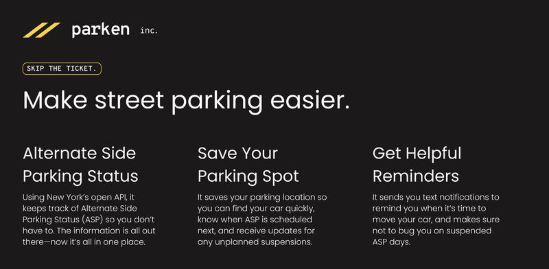
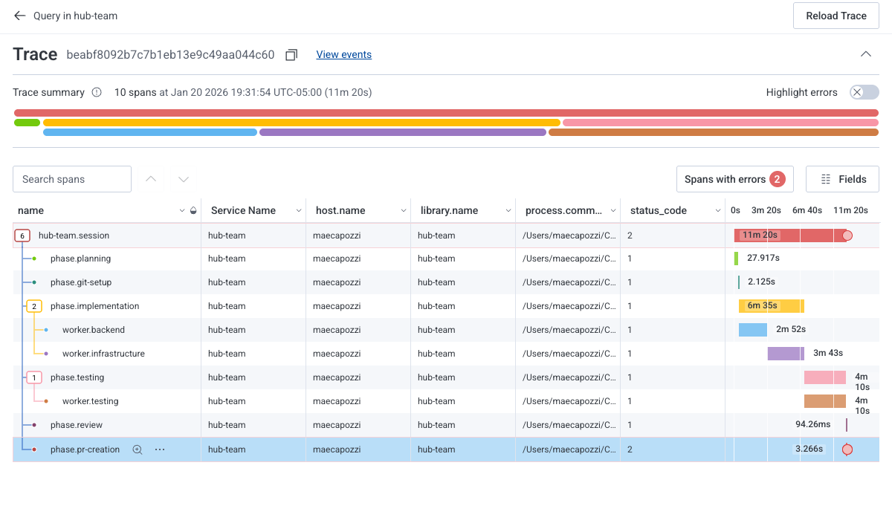
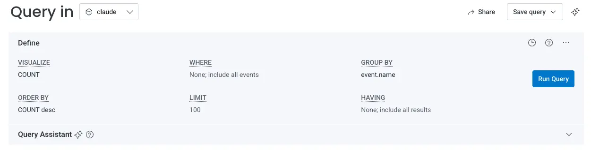

# Mae Capozzi: платформенная обвязка для агентской разработки в команде

## 1. Центральная линия: агент ускоряет работу только после появления платформенной обвязки


История Mae Capozzi добавляет к корпусу взгляд platform / developer experience engineer. У Peter Steinberger и Arvid Kahl агентская разработка часто показана из позиции одиночного владельца продукта. У Mike McQuaid — из позиции мейнтейнера, который прежде всего ограничивает права агента и не перекладывает работу на других. У Calvin French-Owen — из позиции человека, который распределяет своё время между несколькими агентскими поверхностями. Mae смотрит на тот же сдвиг через инфраструктуру команды: что должно измениться в [платформ](#handbook--observability)е, CI, зависимостях, наблюдаемости и документах, чтобы дешёвый первый проход агента не превратился в рост шума и долга.

Центральная механика такая. Claude Code снижает цену запуска задачи: прочитать кодовую базу, найти конфиги, написать черновик миграции, подготовить тестовую ветку, прокомментировать PR, собрать шаблон телеметрии, пройти changelog зависимости или предложить codemod. После этого исчезает старый естественный ограничитель. Больше задач можно начать одновременно, больше PR приходит в очередь, больше решений требует проверки, а человеческое внимание, CI, ревью, локальная документация, зависимости и [наблюдаемость](#handbook--observability) становятся узкими местами.

Mae отвечает на это не усилением отдельных запросов, а платформенной обвязкой. Задачам дают физические границы через рабочие деревья и Git checkpoints. Агентам дают правильный контекст через `AGENTS.md`, `CLAUDE.md`, [Figma MCP](#handbook--mcp), [Honeycomb](#handbook--observability) MCP и локальные документы. Повторяемым ошибкам дают линтеры, [codemods](#handbook--process-repair) и backstop-проверкуs. Долгим процессам дают таймауты. Агентская работа оставляет следы в Git, GitHub и [Honeycomb](#handbook--observability).

Эта история особенно связана с HumanLayer: обе говорят, что модель нужно окружить средой, а не только лучшим запросом. Различие в масштабе. HumanLayer сильнее смотрит на обвязку отдельного агента и качество контекста; Mae показывает, как та же проблема выходит на уровень команды, платформы и adoption-метрик. Поэтому её текст важен для будущего Handbook как предупреждение: ускорение генерации кода переносит узкое место в платформу, проверку и организационную наблюдаемость.

## 2. Исходное давление: запуск задач стал слишком дешёвым

В “Working More, Not Less” Mae описывает сдвиг, который почти всегда теряется в маркетинговых пересказах. ИИ-инструменты не сделали её рабочий день спокойнее. Они убрали старый естественный ограничитель: раньше задача требовала входного усилия, и это усилие заставляло заранее подумать, стоит ли идея нескольких часов, дней или недель работы. С Claude Code старт стал почти бесплатным. После одной задачи легко сразу начать следующую. Она пишет, что часто держит четыре или пять задач одновременно.

Это не описано как чистое благо. Когда цена старта падает, пропадает часть фильтрации. Раньше плохая идея могла не дойти до реализации, потому что требовала слишком много ручной подготовки. Теперь её можно быстро проверить, но можно и быстро увести систему не туда. Mae формулирует это жёстко: движение в неправильном направлении с высокой скоростью остаётся движением в неправильном направлении.

До ноября 2025 года значительная часть её работы уходила на медленное чтение кодовой базы, ручную борьбу со сложными конфигами, RFC и [codemods](#handbook--process-repair) для миграций. Claude Code ускорил именно эту подготовительную платформенную работу. Это важнее, чем кажется: её тезис не в том, что агент быстрее набирает TypeScript. Он дешевле выполняет первый исследовательский и механический проход по задачам, которые раньше часто не начинались из-за высокой входной цены.

Ускорение меняет и внешние ожидания. Stakeholders видят, что теперь можно быстрее выдавать изменения, и начинают ожидать больше. Очередь задач не уменьшается, а растёт. Поэтому платформа становится не приятным улучшением для разработчиков, а способом не превратить выросшую скорость генерации кода в очередь неподъёмного ревью, ожидания CI и плохо понятых изменений.

В этом же тексте Mae точнее раскладывает, куда должна уходить платформенная работа.

Организационный контекст нужно кодировать рядом с кодом. Если команда ушла от Redux или наполовину мигрировала с REST на GraphQL, агент сам этого не узнает. Документация в wiki плохо помогает агенту, который читает репозиторий; полезнее `CLAUDE.md`, локальные `README` в директориях и короткие комментарии в модулях, объясняющие, почему участок существует.

Быстрые петли обратной связи становятся множителем. Если CI идёт 20 минут, агент заблокирован или инженер уже переключился. Если локальный dev server перезагружается 30 секунд, каждая итерация дороже. Ревью тоже не ускоряется автоматически. Чем больше PR создаётся, тем важнее выносить стиль, форматирование, порядок импортов и типовые анти-паттерны в линтеры и автоматические проверки, оставляя человеку дизайн-решения, edge cases и архитектурное соответствие.

В финале Mae формулирует более широкий вывод: platform work всегда был важен, но редко казался достаточно срочным по сравнению со следующей фичей. Когда скорость генерации фич становится обычным уровнем, выигрывают команды, которые инвестируют в платформу и действительно чувствуют движение вперёд, а не просто бегут быстрее на месте. Её вопрос о том, почему мы готовы инвестировать в качество для машин, но не для людей, стоит читать как указание на ту же проблему: в агентскую эпоху человеческая рабочая среда становится главным узким местом.

## 3. Платформенная рамка Mae шире, чем `CLAUDE.md`

Mae не пришла к этой позиции только через Claude Code. Её более ранние тексты про frontend platform показывают, что для неё платформа давно означала не только “инструменты для разработчиков”. Она относит к фронтенд-платформе bundlers, compilers, CSS architecture, зависимость management, design systems, frontend observability, testing, GraphQL инструментальная среда, request wrappers, state management, static analysis, TypeScript configuration и web performance.

Эта рамка важна для агентской разработки. Если агенты увеличивают количество изменений, фронтенд- и платформенный долг может расти быстрее и тише. Медленный bundle, плохая навигация с клавиатуры, непоследовательное поведение кнопок или отсутствие telemetry не обязательно ломают CI. Но они бьют по activation, нагрузке на поддержку, корпоративным закупкам, соответствию требованиям доступности и доверию к продукту.

В статье про frontend technical debt Mae приводит пример страницы Chart, которая грузилась больше 14 секунд, и команда узнала об этом через обращения в поддержку. Формально это могло выглядеть как frontend debt или “косметика”, но для продукта такая проблема означает потерю пользователей и выручки. Пользователь не видит схему базы данных или микросервисы. Он видит интерфейс, задержки, сломанную навигацию с клавиатуры, непредсказуемые компоненты и ощущение надёжности.

Поэтому когда Mae позже пишет, что агентская эпоха усиливает значение platform work, речь идёт не об одном `CLAUDE.md` и не об одном линтере. Речь о всей инфраструктуре, которая делает продуктовую разработку предсказуемее: быстрый CI, доступные компоненты, актуальные зависимости, наблюдаемость, проверяемые соглашения, тестируемые миграции, понятные инструменты для product engineers и ограничения для агентов.

## 4. Ранняя позиция: от скепсиса к агентам как способу масштабировать себя

В LinkedIn Mae описывала себя как человека, который сначала был скептически настроен к AI-агентам в разработке ПО. Часть скепсиса была связана со страхом, что такие инструменты начнут вытеснять инженеров. После нескольких месяцев сознательного эксперимента позиция изменилась: она стала рассматривать ИИ как способ масштабировать себя, но не как замену инженерного суждения старшего уровня.

Простую работу по написанию кода — boilerplate, scripts, synthesis — можно отдавать агенту. Тяжёлая инженерная работа остаётся у человека: архитектура, сложные миграции, guardrails, наставничество и выбор того, какие решения вообще стоит принимать.

Отдельный LinkedIn-пост даёт полезную хронологию инструментов с февраля 2025 года:

```
Copilot in VSCode → Cursor → Claude Code integrated with Cursor → Claude Code with VSCode file viewing and manual git рабочих деревьев → multiple agents in Conductor using Claude Code

```

Эта цепочка объясняет, почему в её поздних материалах так часто появляются `git worktree`, Conductor, MCP и orchestrator. Это не набор случайных модных инструментов. Mae постепенно уходила от встроенного помощника в редакторе к отдельным агентским процессам, затем к ручной изоляции через рабочих деревьев, а затем к нескольким параллельным агентам и собственной фазовой обвязке.

Этот биографический слой нужен здесь не ради портрета автора. Он объясняет границу доверия. Mae не приходит к агентам как к замене инженерного суждения; она постепенно переносит в них те части работы, где уже умеет распознать хороший результат, и одновременно наращивает внешние ограничения там, где одного собственного внимания недостаточно.

## 5. UI-код: модель стала лучше, но решающими оказались Figma, `CLAUDE.md` и готовые компоненты

Ранний UI-кейс Mae хорошо показывает, почему её история не сводится к силе модели. Она экспериментировала с генерацией UI-кода в React, TypeScript и CSS modules. В ранних попытках Claude 3.7 часто делал типичные ошибки: галлюцинировал требования, заново изобретал компоненты, которые уже были в кодовой базе, и пытался писать стили через Tailwind вместо принятых в проекте CSS modules.

Позднее, на Claude 4, она смогла получить готовый к использованию design-system component за час или два: Split Button по Figma file. Важны причины успеха. Модель стала сильнее, но этого было недостаточно. Mae добавила guidelines в `CLAUDE.md`: писать качественный frontend-код и всегда искать существующие компоненты design system перед тем, как делать custom реализация. Она использовала Figma Dev Mode MCP server. Команда к тому моменту имела больше готовых компонентов в design system, и Claude смог собрать новый компонент из `Button` и `DropdownMenu` без явной просьбы.

Этот эпизод задаёт важный паттерн. Качественный UI-код от агента появляется не из пустого запроса. Нужны предсобранные компоненты, которые кодируют дизайн-решения; инструкция, которая направляет агента к этим компонентам; Figma-контекст вместо текстового пересказа; и достаточно сильная модель. Design system в такой рамке становится не только инструментом для людей, но и рабочей поверхностью для агента.

## 6. Parken: обычная фича как малый вариант всей системы

<figure class="source-figure" id="fig-story-11-mae-parken-landing">
  
  <figcaption>Скриншот даёт конкретную визуальную опору для бытового Parken-процесса: агентская работа проверяется через живой интерфейс и продуктовый результат. Источник: <a href="https://maecapozzi.com/blog/my-ai-coding-workflow">My AI Coding Workflow</a>. Локальный файл: <code>../assets/story-images/11-mae-parken-landing.jpeg</code>.</figcaption>
</figure>

Самый простой бытовой процесс Mae описан в “My AI Coding Workflow”. Вместе с Laura Saladin она строит Parken — приложение, которое помогает помнить, где оставлена машина при Alternate Side Parking в Нью-Йорке. Это побочный проект, но именно там хорошо виден её базовый цикл.

Mae отдельно оговаривает, что не считает этот режим `vibe coding`: она сама определила архитектуру, выбрала инструменты и понимает, как части приложения связаны между собой. Claude помогает быстро наращивать функциональность, но не заменяет владение архитектурой. У этой оговорки есть практическая сторона. Mae много лет специализировалась на фронтенде, и именно поэтому может быстро оценивать и исправлять то, что Claude производит в UI. С помощью Claude Code она быстрее строит сквозную функциональность, потому что агент закрывает бэкенд- и инфраструктурную работу, где ей не нужно всё писать вручную с той же скоростью. Но качество процесса держится на её способности вовремя корректировать курс: она знает, как должны быть устроены frontend-части, и понимает архитектуру приложения целиком.

Работа начинается не с редактирования файлов, а с `plan mode` в Claude Code. План проходит несколько итераций, пока подход не выглядит достаточно устойчивым. Это не церемония. Mae прямо пишет: если план ошибочен, всё последующее тоже будет ошибочным. Планирование заставляет вынести предположения наружу до кода: что меняется, какие части приложения затрагиваются, какие состояния появятся, где возможны проблемы.

После этого она использует `Linear MCP server`, чтобы превратить план в задачи Linear. Если фича затрагивает интерфейс, добавляется `Figma MCP server`, чтобы Claude получил дизайн-контекст из макетов, а не из пересказа. Это маленькая, но важная деталь. План не остаётся длинной беседой в Claude Code. Он превращается в набор отдельных задач, каждая из которых достаточно ограничена, чтобы её можно было взять отдельно и не держать в голове весь исходный разговор.

Дальше Mae берёт отдельный Linear ticket и работает с Claude Code уже на уровне реализации. Она даёт задачу, позволяет Claude “раскрутиться”, затем использует GitHub CLI, чтобы отправить изменения в ветку. После этого запускается `/review` skill в Claude Code. Но `/review` не заменяет её собственную проверку. Он нужен как первый автоматический проход по изменению: найти очевидные edge cases, несогласованность, плохую интеграцию с остальной архитектурой. Финальное чтение перед слиянием остаётся за человеком.

Схема компактная:

```
plan mode → Linear MCP → Figma MCP для UI → отдельный ticket → Claude Code → GitHub CLI → /review → ручная проверка

```

В малом виде здесь уже есть вся поздняя логика Mae. Контекст не должен жить только в чате. Дизайн не нужно пересказывать, если его можно дать через Figma. План должен дробиться на задачи. Автоматическое ревью полезно, но не получает право слияния. Человек сохраняет архитектурное понимание и принимает изменения только после чтения результата.

## 7. `tsc` → `tsgo`: фоновый агентский проход меняет порог, после которого миграцию стоит начинать

Самый чистый пример платформенной задачи у Mae — миграция компиляции TypeScript с `tsc` на `tsgo`. Исходная проблема была конкретной: проверка типов занимала 44 секунды в CI. `tsgo` обещал серьёзное ускорение, но сама миграция выглядела как работа на несколько дней: прочитать документацию, сравнить поведение, понять конфигурационные отличия, протестировать edge cases, оценить готовность и разобрать новые ошибки типов.

Mae подчёркивает, что настоящая цена миграции обычно не в механических правках кода. Самая тяжёлая часть — стадия исследования. Нужно построить достаточно контекста, чтобы уверенно принимать решения. Раньше она оценила бы такую задачу в 3–4 дня.

С Claude Code порядок изменился. Она дала довольно неформальный запрос, указала на `tsconfig` и настройку сборки, затем запустила Claude в отдельном `git worktree` и занялась другими задачами. Claude прочитал документацию `tsgo`, нашёл отличия конфигурации и пошагово реализовал миграцию.

Это не было парным программированием в привычном смысле. На первом этапе Claude работал как фоновый исследователь и исполнитель механических шагов. Mae периодически проверяла состояние, но не вела каждое действие. Когда миграция была готова, работа изменилась. Теперь нужно было понять, что именно поменялось. Новый компилятор может находить другие ошибки типов. Часть из них показывает настоящие проблемы, часть может быть ложным срабатыванием или следствием более строгой модели. Здесь Mae возвращается в режим совместного разбора: сравнить новые ошибки с документацией, понять, являются ли они регрессиями, и решить, можно ли принимать миграцию.

Результат был сильным: проверка типов сократилась с 44 секунд до 7 секунд. Но главный урок не только в цифре. Claude Code снизил стоимость первого исследовательско-механического прохода. Человеческая работа осталась в месте, где риск выше: классификация новых ошибок, оценка безопасности миграции и решение о готовности `tsgo` для команды.

Такой режим меняет список проектов, которые вообще стоит начинать. Если миграция требует 3–4 дней непрерывной концентрации, она месяцами лежит в очереди задач. Если Claude выполняет исследование и механическую реализацию в фоне, а человеческая цена сжимается до нескольких часов проверки и разбора ошибок, то compiler migrations, build инструмент swaps, зависимость upgrades и линтер rule changes становятся практически доступными. Это изменение порога, после которого инфраструктурная задача становится достаточно дешёвой, чтобы её поднять.


Миграция `tsc` → `tsgo` стоит рядом с Simon Willison и Calvin French-Owen. У Simon агент снижает цену “интересно, можно ли?” через отдельный эксперимент. У Calvin Codex web и Claude Code меняют место, где человек тратит thinking budget. У Mae агент делает фоновый исследовательско-механический проход, но человек возвращается в точке классификации новых ошибок и принятия риска для команды.

## 8. Рутинная платформенная работа: где Claude действительно снимает трение

В отдельной статье о platform engineering Mae раскладывает задачи, где Claude Code реально уменьшает рутинное платформенное трение. Это не общий тезис “агенты пишут код быстрее”. Список довольно практичный.

Первая зона — исследовательские пробы: оценка инструментов, архитектурные решения, сравнение поставщиков, миграции вроде `typescript-go`. Агент читает документацию, пробует варианты, строит первый набор выводов. Человек выбирает и проверяет. Mae нравится давать Claude исследовательскую задачу и получать набор правдоподобных вариантов, от которых можно оттолкнуться. Это не поручение “реши за меня”, а способ быстро получить карту возможных направлений.

Вторая зона — оценка масштаба миграций. До Claude Code иногда единственным способом понять размер миграции было начать её и посмотреть, где она сломается. Mae отдельно вспоминает включение strict mode: заранее было трудно понять, сколько препятствий появится и хватит ли у неё времени тащить задачу. Агентский первый проход меняет именно эту часть работы: он может быстро пройти систему, наткнуться на препятствия и показать примерный фронт миграции.

Третья зона — тестовые PR для CI. Когда меняется конфигурация CI или скрипт, это нельзя проверить только рассуждением. Нужно создать ветки, открыть PR, посмотреть сборку, иногда повторить сценарий. Mae пишет, что одна небольшая правка CI может требовать двух или трёх тест PR, а проверка CI across multiple project types раньше могла занимать half day. Теперь Claude создаёт тестовые ветки для разных сценариев, а человек смотрит результат.

Четвёртая зона — instrumentation before deploy. Платформенные изменения имеют edge cases и blast radius. До rollout полезно добавить traces и attributes, чтобы быстро увидеть, что сломалось. Claude может подготовить рабочий черновик телеметрии, но Mae всё равно проверяет соответствие [OpenTelemetry](https://opentelemetry.io/docs/specs/semconv/gen-ai/gen-ai-agent-spans/) specification и форму данных.

Пятая зона — разбор обновлений зависимостей. В monorepo Honeycomb Dependabot может открывать около двадцати PR в неделю. Каждый требует читать changelog, проверять breaking changes и понимать, где зависимость реально используется.

Шестая зона — удаление старого кода и инфраструктуры. Удаление старого инструмента, фичи или инфраструктуры требует понять не только прямые imports. Нужно пройти configuration files, deployment scripts, documentation, shared libraries и среда выполнения зависимости. Mae приводит пример experimental инструмент, который больше не поддерживался: Claude помог найти прямые imports, конфиги, deployment scripts, документацию и сервисы, которые использовали инструмент косвенно через shared libraries. Это позволило заранее планировать последовательность удаления и предупредить affected teams, а не обнаруживать зависимости через поломки.

Она оценивает экономию примерно так: 4–5 часов в неделю на исследование, 2–3 часа на проверку CI, 2–3 часа на instrumentation, 1–2 часа на разбор обновлений зависимостей, 1–2 часа на очистка. Итого 10–12 часов в неделю. Эти числа не стоит переносить как универсальную норму, но они хорошо показывают профиль выигрыша: агент помогает там, где много чтения, сверки, подготовки и повторения, а человек хорошо знает, как выглядит приемлемый результат.

Последняя оговорка принципиальна. Mae прямо пишет, что агенты лучше всего работают тогда, когда человек уже понимает, как выглядит хороший результат. Агент особенно полезен, когда есть вкус, доменное понимание и критерии качества. Если их нет, Claude может ускорить не работу, а накопление правдоподобных ошибок.

## 9. `hub-team`: не рой агентов, а фазовый процесс с точками восстановления


До этого места речь шла о задачах, где Claude помогает Mae как отдельный исполнитель: исследует миграцию, пишет черновик телеметрии, готовит тест PRs, двигает фичу по Linear ticket. `hub-team` появляется как следующая попытка: не просто запускать Claude на отдельных задачах, а оформить поток работы в фазы, процессы, рабочие деревья и trace. Это уже не отдельный приём, а эксперимент с минимальной агентской фабрикой, которую всё ещё можно остановить и разобрать.

`hub-team` — самый технически плотный материал Mae. Она описывает его как многоагентного оркестратора для Claude Code, вдохновлённый более радикальными экспериментами Steve Yegge и Katherine Cass. В этих примерах её привлекла идея многих агентов, но она не захотела сразу строить систему, которая работает 24/7 и сама подхватывает поток задач. Ей нужен был вариант, который она понимает и которому может частично доверять в продакшен-репозитории.

Поэтому `hub-team` устроен не как свободный рой агентов, а как фазовый процесс из шести шагов:

1. Planning.
2. Git Setup.
3. Implementation.
4. Testing.
5. Review.
6. PR Creation.

Сами фазы важны не как структура документа. Mae подчёркивает, что это точки восстановления. Если реализация падает, остаётся чистое рабочее дерево. Если тестирование падает, известно, что код уже есть, но он не работает. Если PR не создаётся, проблема локализована в финальной фазе. У каждой фазы есть свой таймаут, свой telemetry span и свой тип отказа.

Это хороший пример того, как агентский процесс становится инженерной системой. Claude Code не просто получает задачу “сделай issue”. Его работа проходит через стадии, которые можно наблюдать, ограничивать, прерывать и разбирать после сбоя.

## 10. Planning координатора: маршрутизация живёт в Markdown, а не в TypeScript

В первой фазе `hub-team` работает planning координатора. Он читает задачу и решает, каких специалистов вызывать: Frontend, Backend, Infrastructure, Testing. Важная деталь: Mae не хардкодит маршрутизацию вида “если frontend-task, вызвать frontend-agent” в TypeScript. Coordinator получает запрос, где описаны доступные специалисты, и возвращает структурированный ответ о том, кто нужен.

Значит, часть логики маршрутизации живёт в естественном языке. Если Mae хочет изменить правила выбора специалистов, она редактирует Markdown, а не код orchestrator. Это удобно, но добавляет новый тип инженерного артефакта. Markdown-файл становится почти исполняемой конфигурацией поведения. Его нужно проверять как часть системы, потому что ошибка в нём приведёт к неправильной декомпозиции задач.

Coordinator может не только выбрать специалистов, но и отвергнуть задачу, если она не имеет смысла или нарушает security boundaries. Это небольшой, но принципиальный фильтр. Автоматизация не должна превращать любой issue в выполнение команд. Первый агент в цепочке должен уметь сказать “нет”, но его отказ тоже остаётся частью управляемой фазы, а не свободным решением автономной системы.

## 11. Отдельные процессы Claude Code: `spawn`, таймауты и отрицательный PID

Каждый специалиста в `hub-team` запускается как отдельный процесс Claude Code. Mae использует Node `child_process.spawn()`, передаёт рабочую директорию — изолированный `git worktree` — и прокидывает вывод в консоль. Это не абстрактный `subagent` внутри одного окна. Это отдельный процесс с отдельной рабочей директорией и отдельным временем жизни.

Здесь появляется первая шероховатая инженерная деталь. Агент может зависнуть: ждать пользовательского ввода, которого не будет, или уйти в цикл. Поэтому Mae ставит таймауты: 15 минут на специалиста и 10 минут на координатора. Эти числа не являются универсальным рецептом, но показывают порядок: координатора должен быстро выполнить маршрутизацию, специалиста может работать дольше, но не бесконечно.

Вторая деталь ещё важнее. Если процесс превышает таймаут, недостаточно убить только родительский процесс. Дочерние процессы могут остаться жить дальше. Поэтому Mae убивает всю группу процессов через отрицательный PID. Это именно тот уровень фактуры, который легко потерять в красивом пересказе. Multi-agent orchestrator — это не только роли, запросы и координация. Это Unix-механика: процессы, группы процессов, вывод, рабочие директории, таймауты и очистка.

## 12. `git worktree` и Git checkpoints: задача должна иметь физическую границу и точки возврата

В фазе Git Setup каждая задача получает отдельное рабочее дерево. Mae описывает схему так:

```
origin/main → новая ветка → рабочее дерево в /tmp/linear-{issueId} → работа агентов → commit → push → PR → cleanup

```

Путь `/tmp/linear-{issueId}` показывает, что рабочее дерево задумано как одноразовая среда. Его не нужно беречь как основной checkout. Если что-то пошло не так, его можно удалить. Основной репозиторий остаётся чистым.

Это решает не только проблему параллельности. `git worktree` превращает агентскую задачу в физически ограниченный эксперимент. Пока агент работает в общей директории, граница держится только на инструкции. Когда задача получает отдельный каталог, ветку и дифф, человек может сравнить результат с `origin/main`, удалить дерево, принять PR или перезапустить задачу без распутывания чужих изменений.

Но рабочее дерево недостаточно. В отдельном LinkedIn-посте, написанном в период работы над многоагентного оркестратора, Mae фиксирует маленькую, но очень практическую ошибку. Когда она стала больше работать в режиме Claude/vibe coding, она иногда переставала регулярно коммитить изменения. Claude помогал решить проблему, реализация работала, но она не фиксировала это состояние. Через несколько изменений Claude мог сломать уже найденное решение, и у неё не оставалось хорошей точки, на которую можно было бы указать: “вот здесь всё работало, вернись к этой форме”.

Практический вывод простой: в агентском процессе коммит — это не только подготовка к PR. Это проверяемая метка успешного состояния, которую можно показать следующей сессии или тому же агенту после отката. Для Mae это особенно важно, потому что она часто даёт Claude несколько последовательных задач. Без частых коммитов следующая задача может разрушить результат предыдущей, а Git уже не поможет быстро объяснить агенту, где была рабочая версия.


`hub-team`, рабочие деревья и Git checkpoints перекликаются с Mike McQuaid, Calvin French-Owen и Jesse Vincent. Mike использует рабочие деревья как часть безопасной параллельности после Sandvault. Calvin связывает их с preview deploys и проверяемыми ветками. Vincent начинает задачу с отдельного рабочего дерева, чтобы дифф можно было выбросить. Mae добавляет фазовую командную обвязку и точки восстановления.

## 13. `hub-team`: что пока не получилось

Mae не продаёт `hub-team` как готовую автономную систему. Она прямо перечисляет ограничения.

Первое: специалистаs пока выполняются последовательно. Если задача требует и frontend, и backend, backend ждёт frontend. Технически можно запускать их параллельно, но тогда появляются новые проблемы: конфликты изменений, объединение результатов, синхронизация вывода, понятная трассировка и стратегия слияния.

Второе: восстановление после ошибки грубое. Если один специалиста падает, останавливается весь процесс. Mae хотела бы, чтобы координатора мог переоценить ситуацию: попробовать другой подход, продолжить без одного специалиста или хотя бы вернуть полезное резюме произошедшего. Пока этого нет.

Третье: Testing специалиста запускается после реализации, но не знает достаточно о том, что изменилось. Поэтому он склонен запускать слишком общий набор проверок. Mae хочет передавать ему список изменённых файлов и характер правки, чтобы тестирование было targeted, а не полным и шумным.

Наконец, она отдельно говорит, что не отпустила бы `hub-team` без присмотра в продакшен codebase. Она использует его для backlog tasks и side app, но сохраняет supervision. Это не осторожная оговорка на всякий случай. Это граница применимости: orchestrator полезен как усилитель и структура, но не как полностью автономный инженер.

После `hub-team` логика истории поднимается на организационный уровень. Внутри одного orchestrator можно задать фазы, рабочие деревья, таймауты и traces. Но часть платформенной работы живёт не в одном процессе, а в командных очередях: Dependabot PRs, on-duty rotation, Goalie, GitHub Actions, flaky тесты and продакшен risk. Там агент полезен не как автономный исполнитель, а как предварительный читатель, который оставляет артефакт для человека.

## 14. Dependabot: агент делает предварительное чтение, Goalie принимает риск

Про разбор обновлений зависимостей есть отдельный гостевой пост Juliana Gomez на блоге Mae. Это не личный процесс Mae в узком смысле, но это важный командный контекст Honeycomb, который продолжает ту же платформенную тему.

До агентского слоя у Mae уже была процессная рамка работы с зависимостями. Она предлагает отслеживать outdated зависимости через пакетный менеджер: например, `pnpm outdated` или `npm outdated`, затем парсить результат и отправлять данные в Honeycomb, чтобы видеть прогресс. Дальше нужен on-duty rotation: один инженер в неделю отвечает за KTLO-работу, включая Dependabot. PR классифицируются как patch/minor или major. Patch/minor можно тестировать и сливать, а при сомнениях тегать релевантную команду и давать ей 24 часа. Major upgrade нужно превращать в ticket и добавлять зависимость в ignore-конфигурацию `dependabot.yml` с комментарием на ticket.

Mae предлагает SLA вида: к концу on-duty week должно быть 0 открытых Dependabot PR. Это не значит, что все зависимости обновлены. Это значит, что каждая из них либо слита, либо triaged, либо превращена в задачу, а Dependabot сможет открыть новую порцию PR на следующей неделе.

В Honeycomb есть роль `Goalie`: человек недели, который разбирает срочные задачи и Dependabot PRs. Juliana пишет, что Dependabot занимает много времени, а зависимость upgrade уже не раз ломал продакшен, поэтому к таким PR относятся осторожно.

Первый ручной агентский вариант был простым. Через Conductor она запускала несколько экземплярами Claude Code и давала им запрос. Здесь важна причина выбора Conductor. Juliana прямо пишет, что она “не совсем терминальный человек”: когда все начали использовать несколько экземпляров Claude и `git worktree` вручную, она не сразу вошла в этот режим. Conductor стал удобной GUI-обвязкой, которая управляет несколькими экземплярами Claude Code с рабочими деревьями Git и показывает их в чистом интерфейсе. Параллельность стала доступной не через ручную терминальную дисциплину, а через инструмент, который удерживает состояние сессий и рабочих деревьев.

Prompt был таким:

```
Review this Dependabot PR and let me know if it's safe to merge: [link to PR]

```

Благодаря GitHub integration Claude видел PR, изменение версии, library, статус сборки и мог проверить, где зависимость используется. Несколько instances в Conductor позволяли быстрее собрать разбор по нескольким PR.

Затем коллега Dean предложил перенести это в GitHub Action. Когда открывается Dependabot PR, action запускает Claude, а тот оставляет comment с рекомендацией в PR. Когда Goalie приходит разбирать зависимости, предварительное чтение уже лежит рядом с дифф.

Процесс специально не доведён до auto-merge. Есть конкретные сбои. Иногда build длится дольше, чем 15-минутный timeout GitHub Action; тогда Goalie вручную перезапускает action после прохождения build. Иногда flaky тест заставляет Claude пометить PR как потенциально небезопасный, хотя человек понимает, что это флейк. Поэтому финальное решение остаётся у Goalie.

Это зрелый паттерн Mae/Honeycomb: агент поднимает сигнал и готовит проверяемый артефакт, но не получает право принимать рискованное решение. Для зависимость upgrades это принципиально: автоматическая рекомендация полезна, но продакшен-инцидент после зависимость upgrade остаётся человеческой ответственностью.

## 15. Backstops, codemods и миграции: агент не должен выполнять сложную миграцию одним проходом

Mae отдельно пишет про backstop-проверкуs перед миграцией. Её исходное наблюдение практическое: миграции редко завершаются полностью. Часто они доходят до 80%, затем застревают из-за edge cases, других приоритетов команд или сложного старого кода.

Если начать миграцию с переписывания существующего кода, проблема продолжит расти. Команды, которые не знают о миграции, будут добавлять новые использования старого паттерна. Пока вы переносите 50 файлов, могут появиться 10 новых.

Поэтому Mae предлагает начинать с backstop-проверку. Обычно это lint rule, которая запрещает новые imports старого компонента или старый API паттерн. Такой backstop-проверку не исправляет старый код, но останавливает рост проблемы. После этого миграция становится fixed-size problem. Её можно делать постепенно, передавать командам, запускать codemods или вообще отложить часть хвоста, не опасаясь, что старый паттерн продолжит размножаться.

Более старый текст про design system migrations даёт важный фон. Mae описывает типовой ход такой миграции: сначала построить replacement component с достаточным фича parity, затем stop the bleeding через backstop-проверкуs, затем автоматизировать большую часть замен codemod или похожим инструментом, а потом столкнуться с последними 20% случаев, которые требуют product engineers в нишевых продуктовых областях. Именно там миграции чаще всего застревают.

Отсюда появляется роль codemods. Mae определяет codemod как script, который автоматически находит и переписывает определённый вид кода. Но главный смысл для platform team не в механической замене. Codemod позволяет передать часть миграции продуктовым командам: platform team создаёт инструмент, а product engineers выполняют изменения в своих доменах. С развитием LLM барьер создания codemod ниже: то, что раньше требовало глубокого знания AST и syntax инструментальная среда, теперь можно быстрее прототипировать и уточнять с моделью.

Поздний LinkedIn-пост Mae уточняет этот паттерн применительно к AI agents. Она прямо пишет, что агенты плохо подходят для one-shot выполнения сложных миграций и апгрейдов. Зато они хорошо помогают быстро писать codemods. Её рабочая схема здесь такая: разбить сложную миграцию на меньшие части, понять, какие scripts нужны для автоматизации каждой части, вручную прогнать эти scripts по низко висящим случаям, а затем парно с агентом полуавтоматически чинить более трудные места.

Это важная оговорка против красивой, но неверной версии “дай агенту миграцию целиком”. В реальности агент полезнее как ускоритель декомпозиции, codemod-написания и разборки хвоста, чем как автономный исполнитель всей миграции.

Для агентской разработки это особенно важно. Mae прямо связывает local rules and migration state с поведением агентов. Агент не знает, что команда два года назад решила уходить от Redux или находится на полпути от REST к GraphQL. Если это знание не закодировано рядом с кодом или не закреплено линтером, агент будет повторять старые паттерны. Linter ловит и человека, и агента. Codemod превращает миграцию из личного труда platform engineer в масштабируемую процедуру, которую можно передавать другим людям и, вероятно, агентам.


Dependabot-процесс Mae похож на Fix / Dismiss / Escalate у Jökull Sólberg. Агент может прочитать changelog, сравнить код и предложить исправления, но решение о риске принимает Goalie или человек. Это тот же принцип: сигнал автоматизации полезен только после классификации, особенно если изменение касается зависимостей и может сломать команду не сразу.

## 16. Дрейф зависимостей: агент читает документацию latest version, а проект может жить на старой версии

Ещё один платформенный риск Mae называет зависимость drift. В веб-проектах зависимости часто устаревшие. Агент читает документацию для latest version библиотеки, но репозиторий может быть на версии на несколько шагов позади. Тогда Claude пишет код, который выглядит правильным по документации, но не работает в реальной кодовой базе.

Mae приводит пример Honeycomb: за неполный год команда снизила frontend зависимость drift на 39.5%. Это подано не как housekeeping ради порядка, а как инфраструктура для более надёжной работы агентов. Чем ближе зависимости к актуальным версиям, тем меньше разрыв между внешней документацией, которую читает агент, и возможностями проекта.

Это ещё один пример её более общего вывода: platform work становится leverage point для агентской разработки. Хорошие зависимости, быстрый CI, observability и локальные правила улучшают не только жизнь людей, но и качество работы моделей.

Backstops, codemods и работа с зависимостями отвечают на один класс проблем: как не дать старым паттернам и устаревшим зависимостям продолжать расти, пока агенты ускоряют поток изменений. Следующий класс проблем другой: как дать агенту ровно тот контекст, который нужен для текущей задачи, не превращая постоянные инструкции в шумную энциклопедию.

## 17. Контекст как API: `AGENTS.md`, `CLAUDE.md`, MCP и постепенное раскрытие

В статье про harness engineering Mae формулирует одну из самых переносимых идей: длинные `AGENTS.md` или похожие файлы могут вредить. Их первоначально рекомендовали писать как большие документы с философией проекта, подробной документацией инструментов и общими правилами. По наблюдению Mae, это часто даёт обратный эффект: agents get overwhelmed и начинают игнорировать части контекста.

Её альтернатива — progressive disclosure. Агент должен получать информацию в момент, когда она нужна. Для customer issue одного запроса “исправление the issue” недостаточно. Если есть ticket with reпродакшен steps, агент работает лучше. Если добавить observability data, relevant code paths и recent changes, он становится заметно полезнее. Для UI-фичи нужен Figma контекст. Для проверки зависимости — changelog, изменение версии, usage паттерны. Для телеметрии — желаемая форму trace и Honeycomb MCP. Нельзя каждую задачу начинать с энциклопедии проекта.

Это не отказ от `AGENTS.md` или `CLAUDE.md`. Mae сама использует такие файлы и пишет hooks, чтобы проверить их загрузку. Но она не рассматривает их как бездонную память. Постоянные инструкции должны быть короткими и устойчивыми. Длинное, условное или доменное знание лучше давать через отдельные документы, MCP, skills, линтеры, CI и контекст, специфичный для задачи.

Здесь есть тонкая концептуальная связь с API design. Mae прямо предлагает думать о контексте как об API: поверхность должна показывать то, что нужно сейчас, и давать ясные пути, куда копать глубже. Плохой `AGENTS.md` пытается дать весь мир сразу. Хороший контекстный слой направляет агента к нужным источникам в нужный момент.

Эту же линию продолжает маленький, но показательный LinkedIn-пост про Claude Code `/insight` skill. Mae пишет, что использует `/insight`, чтобы понять, как эффективнее работать с самим Claude Code. Ей особенно полезны предложения о новых skills, precommit hooks и изменениях в `CLAUDE.md`. Агент используется не только для написания кода или миграций, но и для рефлексии над собственной рабочей средой. После нескольких сессий Claude может предложить, какие повторяющиеся правила стоит вынести в skill, какую проверку запускать precommit hook и что поправить в `CLAUDE.md`. Обвязка не задаётся один раз, а постепенно улучшается по следам реального использования.

Этот блок про контекст закрывает одну половину проблемы: как сделать так, чтобы агент видел правильные источники и правила. Но для Mae этого недостаточно. Следующий слой — наблюдаемость. Нужно видеть не только то, что агенту дали, но и что он реально загрузил, какие инструменты вызвал, где остановился, сколько стоила работа и где человек отклонил действие агента.

## 18. Наблюдаемость: агент пишет telemetry boilerplate, но форму trace задаёт человек

В “AI agents removed the friction from writing telemetry” Mae описывает другой тип трения. Она знала, что телеметрию стоит добавлять, но OpenTelemetry часто превращался в переключение контекста: вспомнить, что такое span и trace, какие attributes нужны, как правильно обработать errors, нужно ли вручную создавать child spans, как назвать `service.name` или похожие поля. Потом эксперты Honeycomb по OpenTelemetry всё равно находили недочёты.

С Claude Code первый черновик стал дешёвым. Mae описывает желаемую форму trace, иногда даже рисует схемы, даёт Claude доступ к Honeycomb MCP server, и Claude пишет instrumentation. Затем она проверяет результат в Honeycomb UI. Эксперты всё ещё дают обратную связь, но исправления занимают меньше времени.

Здесь важно не сгладить процесс. В одном LinkedIn-посте Mae прямо пишет, что при работе над многоагентного оркестратора отправить данные в Honeycomb через OpenTelemetry Node SDK было не главной проблемой: Claude не испытывал трудностей с самой отправкой telemetry. Сложно было довести данные до нужной формы — выбрать структуру spans, attributes и события так, чтобы trace отвечал на реальные вопросы. Это уточняет её позицию: агент хорошо снимает синтаксическое и boilerplate-трение, но смысловая форма observability всё равно требует человеческого вкуса и понимания того, какие вопросы trace должен закрывать.

В этом источнике есть ещё один важный концепт: cognitive debt. Чем больше кода появляется с помощью agents, тем меньше у инженера непосредственная построчная память о каждой детали. Это не обязательно плохо: abstraction всегда позволяла двигаться быстрее. Но если код начинает падать в продакшен, отсутствие глубокой локальной модели каждой строки становится долгом понимания. Для Mae ответом становится не героическое чтение всего сгенерированного кода, а систематическая observability. Если instrumentation занимает минуты, оно перестаёт быть trade-off между velocity и operational excellence и становится частью обычного написания фичи.

## 19. `InstructionsLoaded`: документ в репозитории ещё не значит, что агент его прочитал

Самый сильный эпизод из telemetry-материала связан уже не с продуктовой телеметрией, а с наблюдаемостью самого Claude Code. Mae хотела понять, действительно ли agent documentation files — `CLAUDE.md` и project rules — загружаются в её Claude Code sessions. Без этого неясно, почему агент не следует guidelines: он мог вообще не прочитать файл, а мог прочитать, но потерять правило в перегруженном контексте.

Claude Code supports hooks: shell commands, которые запускаются на событиях жизненного цикла. Mae решила использовать hooks, чтобы отправлять telemetry в Honeycomb. Она описала Claude желаемое поведение: hook должен срабатывать на lifecycle events вроде session start, instructions loaded, инструмент use, запрос submit и отправлять span в Honeycomb с релевантным контекстом. Claude написал scripts, настроил OpenTelemetry exporter config, а Mae подключила это через `.claude/settings.json`.

После этого в Honeycomb появились traces с spans:

```
InstructionsLoaded
SessionStart
UserPromptSubmit
ToolUse
SessionEnd

```

Ключевой span — `InstructionsLoaded`. В нём есть attribute `instructions.file_path`, где видно, какой именно файл инструкций был загружен: например, `.claude/rules/lattice.md` или `CLAUDE.md`.

Это меняет диагностику. Если нужный файл не появляется в trace, проблема находится в загрузке контекста. Если файл появляется, но агент всё равно не соблюдает правило, проблема вероятнее в перегруженности, конфликте или плохой форме инструкции.

Для doc-first процесса это почти прямой урок. Документ в репозитории не является рабочим правилом сам по себе. Нужно видеть, попал ли он в контекст агента, когда был загружен, какие файлы реально прочитаны и не конфликтует ли постоянный слой с контекст, специфичный для задачи.

## 20. `TRACEPARENT`: один агентский процесс должен быть виден как trace

<figure class="source-figure" id="fig-story-11-mae-honeycomb-trace">
  
  <figcaption>Скриншот важен для раздела о trace: агентская работа становится наблюдаемой только когда отдельный процесс виден как связная трасса, а не как набор сообщений. Источник: <a href="https://maecapozzi.com/blog/building-a-multi-agent-orchestrator">Claude Orchestrator: Building a Multi-Agent AI System with Claude Code</a>. Локальный файл: <code>../assets/story-images/11-mae-honeycomb-trace.png</code>.</figcaption>
</figure>

В `hub-team` наблюдаемость применяется уже к orchestrator. Проблема практическая: `hub-team` состоит из нескольких процессов. Если каждый пишет отдельные логи, человек получает набор фрагментов. Чтобы понять, где именно задача зависла или упала, нужен единый trace.

Для этого Mae передаёт trace контекст дочерним процессам через переменную окружения `TRACEPARENT`. Когда специалиста запускается, он подхватывает родительский контекст и создаёт child spans. В Honeycomb весь процесс виден как одна трасса: planning, git настройка, специалиста work, testing, PR creation.

Это меняет качество отладки. Если задача провалилась, Mae видит не общую фразу “агент не справился”, а конкретную фазу, длительность и место отказа. Если testing занимает слишком много времени, это видно. Если PR creation не произошёл, это отдельный участок trace.

Здесь у Mae появляется важный паттерн: когда агентская среда становится частью разработки, наблюдаемым должен быть не только продукт, но и сам агентский процесс.


Наблюдаемость у Mae соединяет несколько линий корпуса. У Arvid агент приносит свидетельства из браузера. У Mark Erikson Replay MCP даёт канал к среде выполнения. У Simon Willison исследовательский агент оставляет отчёт и графики. У Mae та же потребность становится платформенной: агентский процесс должен быть виден как trace, событие, метрика принятия и материал для командного улучшения.

## 21. Командная наблюдаемость: измерять нужно не только продукт и сессию, но и принятие Claude Code в команде

<figure class="source-figure" id="fig-story-11-honeycomb-query">
  
  <figcaption>Скриншот поддерживает организационный слой истории Mae: наблюдаемость нужна не только продукту, но и внедрению агентского процесса в команде. Источник: <a href="https://www.honeycomb.io/blog/measuring-roi-claude-code-honeycomb">Measuring the ROI of Claude Code at Honeycomb</a>. Локальный файл: <code>../assets/story-images/11-honeycomb-claude-query.webp</code>.</figcaption>
</figure>

Статья Mae на блоге Honeycomb “Measuring Claude Code ROI and Adoption in Honeycomb” решает ещё одну задачу. Если `hub-team` показывает наблюдаемость одного агентского процесса, то Honeycomb-пост показывает наблюдаемость использования Claude Code в инженерной команде.

Исходный вопрос там организационный, но технически оформленный. Mae хотела не по ощущениям, а по данным ответить:

- используют ли инженеры Claude Code в репозиториях регулярно;
- растёт ли adoption;
- сколько это стоит;
- какие модели используются;
- часто ли разработчики принимают предложения Claude;
- какие инструменты вызываются чаще всего;
- какие инструменты падают или медленные;
- часто ли пользователи reject инструмент executions, что может указывать на недостаток доверия;
- есть ли rate limits, ошибки API и проблемы запрос caching.

Claude Code уже поддерживает OpenTelemetry. Для одного monorepo Mae добавляет проектную конфигурацию в `.claude/settings.json`, включая metrics and logs exporters. Смысловая форма конфигурации такая:

```
CLAUDE_CODE_ENABLE_TELEMETRY = 1
OTEL_METRICS_EXPORTER = otlp
OTEL_LOGS_EXPORTER = otlp
OTEL_EXPORTER_OTLP_PROTOCOL = grpc
OTEL_METRIC_EXPORT_INTERVAL = 10000
OTEL_LOGS_EXPORT_INTERVAL = 5000
OTEL_EXPORTER_OTLP_ENDPOINT = https://api.honeycomb.io:443
OTEL_EXPORTER_OTLP_HEADERS = x-honeycomb-dataset=claude,x-honeycomb-team=YOUR_API_KEY
OTEL_SERVICE_NAME = claude-code
OTEL_RESOURCE_ATTRIBUTES = service.name=claude-code

```

Она подчёркивает, что такая конфигурация project-specific: если нужно видеть использование Claude Code в нескольких репозиториях, её нужно добавить в каждый репозиторий или иначе решить уровень настройки. Наблюдаемость агентского инструмента не появляется “в компании вообще”; она появляется там, где реально включена telemetry.

Перед построением доски Mae проверяет, что данные пришли, простым Honeycomb query:

```
COUNT | GROUP BY event.name

```

После этого видны event types:

```
api_request
api_error
tool_result
tool_decision
user_prompt

```

Каждый тип отвечает на свой класс вопросов. `api_request` показывает token usage and costs, `tool_result` — вызовы `Read`, `Edit`, `Bash`, `Grep` и похожих инструментов, `api_error` — ошибки API, `tool_decision` — принятые или отклонённые пользователем действия, `user_prompt` — сообщения пользователя, при этом redacted by вариант по умолчанию.

Дальше Mae подключает Honeycomb MCP:

```
claude mcp add honeycomb --transport http https://mcp.honeycomb.io/mcp

```

После перезапуска Claude Code получает доступ к Honeycomb environment: может запускать queries, создавать boards, искать columns, fetch traces. Mae не строит 15+ запросов вручную. Она формулирует, какие вопросы должна закрывать board, и просит Claude через Honeycomb MCP создать её. Потом она проверяет queries и настраивает time ranges.

На уровне полей особенно важны:

```
user.account_uuid
session.id
terminal.type
claude_code.cost.usage
input_tokens
output_tokens
cache_read_tokens
cache_creation_tokens
model
tool_name
success
duration_ms
decision
event.name

```

Эта часть добавляет в историю Mae верхний слой. Нужна не только наблюдаемость приложения, не только hooks для проверки `CLAUDE.md`, не только trace одного orchestrator. Организация должна наблюдать само использование агентского инструмента. Иначе нельзя обсуждать ROI, adoption, trust issues, стоимость моделей, эффективность запрос caching и качество инструментов без анекдотов.

Для CU это почти прямое требование. Если агентский dev-process становится частью команды, нужно видеть не только итоговые PR и не только внутренний trace одной сессии. Нужна метрика использования: где модель вызывает инструменты, где человек отказывает, какие проверки медленные, какие среды используются — VSCode, Cursor, iTerm — и где стоимость растёт без соответствующего результата.

Три уровня наблюдаемости теперь образуют понятную лестницу. На уровне фичи Claude помогает писать instrumentation, но человек задаёт форму trace. На уровне сессии hooks показывают, были ли загружены нужные инструкции. На уровне orchestrator `TRACEPARENT` связывает фазы и специалистов в одну трассу. На уровне команды Honeycomb board показывает adoption, cost, запрос caching, инструмент latency and rejected actions. После этого естественно перейти к границам доверия: наблюдаемость делает агентскую работу видимой, но не превращает все решения в безопасные.

## 22. Где Mae не доверяет агентам

В “Less Magic, More Harness Engineering” Mae отдельно перечисляет зоны, где агенты опасны или требуют особой осторожности.

Первая — complex business logic decisions. Агент может видеть validation rule, но не понимать, какой инцидент, customer commitment или странное взаимодействие систем стоит за этим правилом.

Вторая — cross-system integration planning. Агент может предложить технически корректную схему, но не знать, что другая команда в следующем квартале переписывает сервис, что API ненадёжен или что организационное решение уже принято вне документации.

Третья — performance optimization without profiling data. Без traces, profiles и продакшен signals агент угадывает. Он может предложить типовые optimizations, но это часто правдоподобный шум.

Четвёртая — annotating traces for evals. Там требуется глубокое знание продукта и failure modes.

Пятая — long-term architecture decisions. Агент видит информацию перед собой сейчас, но не знает headcount, roadmap, стиль команды и будущую стоимость сопровождения.

Эти ограничения не ослабляют историю Mae. Они объясняют, почему она так много говорит о guardrails, контекст engineering, Honeycomb MCP, custom линтерs и human judgment. Чем яснее зоны недоверия, тем полезнее можно использовать агента там, где он действительно силён: миграции, refactors, зависимость reading, тест PRs, instrumentation drafts, очистка и предварительный разбор.

## 23. Повторяющийся паттерн: агент создаёт артефакт, человек классифицирует риск

Если собрать примеры Mae вместе, получается устойчивый рабочий паттерн.

В Parken Claude создаёт реализацию по Linear ticket и запускает `/review`; Mae читает результат и решает, подходит ли он архитектурно. В `tsgo` migration Claude выполняет исследовательско-механический проход; Mae классифицирует новые ошибки типов. В Dependabot-процессе Claude пишет comment с рекомендацией; Goalie решает, merge или нет. В telemetry Claude пишет spans и exporter config; Mae проверяет Honeycomb UI и показывает результат экспертам. В `hub-team` специалистаs двигают задачу по фазам; таймауты, traces, рабочих деревьев и проверка удерживают процесс от неконтролируемой автономии. В ежедневной работе к этому добавляются частые Git checkpoints: если агент нашёл рабочее решение, его нужно зафиксировать до следующей серии правок, иначе через несколько изменений можно потерять удачное состояние и уже не иметь хорошей ссылки для восстановления.

В этой истории агент не должен просто “сделать работу”. Он должен оставить проверяемый артефакт: ветку, PR, Linear ticket, GitHub comment, trace, тест PR, telemetry draft, migration рабочее дерево или краткое изложение проверки. Человек не обязан вручную выполнять всю рутину, но должен оценить риск: где результат механический, где есть архитектурное решение, где нужен продуктовый контекст, где возможен продакшен-impact.

Именно поэтому Mae интересна для корпуса. Она показывает не только агента как автора кода, а агента как производителя проверяемых промежуточных объектов в платформенном процессе.

## 24. Что эта история добавляет к корпусу

В уже собранном корпусе есть несколько близких осей: Boris Tane показывает документ как поверхность человеческого решения; Simon Willison показывает агента как исследователя, создающего проверяемые технические свидетельства; Jesse Vincent и HumanLayer показывают skills, gates, harness и разделение research / plan / implement; Jökull Sólberg показывает сопровождение PR через ожидание CI и автоматическое ревью; Mike McQuaid показывает песочницу и рабочих деревьев как основу безопасной параллельности.

Mae добавляет другую перспективу: platform engineer, для которой агентская работа упирается в миграции, зависимости, CI, telemetry, drift, локальные соглашения и инфраструктуру качества. Её материалы особенно ценны тем, что соединяют несколько уровней:

- ежедневный процесс с Claude Code: `plan mode`, Linear MCP, [Figma MCP](#handbook--mcp), `/review`, рабочее дерево, GitHub CLI;
- фазовый orchestrator: координатора, специалистаs, `child_process.spawn()`, таймауты, отрицательный PID, `/tmp/linear-{issueId}`;
- платформенные backstop-проверкуs: custom линтерs, зависимость process, CI тест PRs, codemods, зависимость drift;
- UI/design-system слой: Figma Dev Mode MCP, `CLAUDE.md` guidelines, готовые design-system components и правило искать существующие компоненты перед custom реализация;
- наблюдаемость: OpenTelemetry, Honeycomb MCP, hooks, `InstructionsLoaded`, `TRACEPARENT`, team-level adoption/ROI board.

В результате история Mae показывает, что агентская разработка в серьёзной кодовой базе требует не только “лучшего запроса”, а инфраструктуры, которая делает хорошее поведение дешёвым, плохое поведение заметным, а рискованные решения — человеческими.


Контекст как API у Mae близок HumanLayer и Matt Pocock. HumanLayer говорит о постепенном раскрытии и коротких постоянных инструкциях. Pocock предупреждает против длинных `AGENTS.md`, но сохраняет `CONTEXT.md`, ADR и handoff как смысловые документы. Mae добавляет платформенный взгляд: документ в репозитории ещё не означает, что агент его прочитал, поэтому нужны события вроде `InstructionsLoaded` и трассировка.

## 25. Переносимость для CU / doc-first / dev-process

Для будущего CU-процесса из этой истории можно вынести несколько практических правил.

Первое: документ должен быть проверяемо загружен в рабочий контекст агента. Наличие `CLAUDE.md` или `AGENTS.md` в репозитории недостаточно. Если правило важно, нужно уметь увидеть, что файл был загружен, например через telemetry hook и span `InstructionsLoaded` с `instructions.file_path`.

Второе: контекст нужно раскрывать по ситуации. Постоянный слой не должен превращаться в энциклопедию. Для каждой задачи нужны свои источники: ticket, Figma, Honeycomb, changelog, `tsconfig`, настройку сборки, changed files, форму trace. Иначе модель перегружается и начинает игнорировать часть правил.

Третье: механические запреты лучше закреплять инструментами. Если нельзя использовать старый API или старый компонент, нужен линтер/backstop-проверку. Текстовое “не делай так” слабее, особенно когда агент читает старые примеры в кодовой базе.

Четвёртое: агентская задача должна иметь физическую границу. В `hub-team` это `/tmp/linear-{issueId}`. В других процессах это может быть отдельный рабочее дерево, sandbox или временная ветка. Без границы дифф смешивается, а проверка дорожает. Но границы задачи недостаточно: внутри неё нужны Git checkpoints. Если агент нашёл рабочее состояние, его лучше зафиксировать до следующего слоя правок, иначе успешная промежуточная форма легко теряется.

Пятое: долгие агентские операции должны иметь таймауты и очистка. Если агент запускается как процесс, нужно думать о дочерних процессах, группе процессов и том, что останется после остановки.

Шестое: агентский процесс должен быть наблюдаемым. Для CU это означает не только логи приложения, но и traces самого проведения изменения: какие стадии пройдены, какой контекст был загружен, какие инструменты вызваны, где был таймаут, что создано как проверяемый артефакт.

Седьмое: нужно наблюдать team-level adoption and cost. Honeycomb-пост Mae показывает, что Claude Code можно измерять как часть инженерной системы: сессии, активные пользователи, cost per user, запрос caching, инструмент latency, `tool_decision`, отклонённые actions, API errors и rate limits. Это другой уровень контроля, чем проверка одного PR. Без такого слоя команда будет спорить о пользе агентов по впечатлениям.

Восьмое: человеку выгоднее проверять не только финальный дифф, а риск-классификацию результата. Агент может сделать миграцию, комментарий к Dependabot PR или telemetry draft. Человек должен решить, где это механическая работа, где скрытый архитектурный выбор, где нужен продакшен data, а где изменение нельзя принимать без команды.

## 26. Ограничения источников

По Mae найден хороший набор первоисточников, но не все артефакты доступны на уровне исходного кода.

Главное ограничение: `hub-team` описан в статье, но я не нашёл публичный репозиторий с реализацией orchestrator. Поэтому детали вроде `child_process.spawn()`, `/tmp/linear-{issueId}`, таймаутов, отрицательный PID и `TRACEPARENT` можно восстанавливать по тексту статьи, но нельзя проверить по коду.

Второе ограничение: хуки телеметрии для `InstructionsLoaded` описаны рабоче, но без полного публикационного набора scripts и специфичный для хука `.claude/settings.json`. При этом отдельный Honeycomb-пост Mae публикует проектную `.claude/settings.json` для встроенной telemetry Claude Code: это не рецепт хука, а настройка metrics/logs exporters для мониторинга использования на уровне команды.

Третье ограничение: Dependabot / Conductor материал — гостевой пост Juliana Gomez на блоге Mae. Это командный процесс Honeycomb, близкий к темам Mae и напрямую связанный с её platform-toil статьёй, но его нельзя полностью приписывать личной практике Mae.

Четвёртое ограничение: LinkedIn-посты полезны для хронологии и самоописания роли, но они слабее блога как технические источники. Основу реконструкции поэтому дают статьи на maecapozzi.com и Honeycomb.

## 27. Сжатая реконструкция рабочего процесса

Эта сжатая реконструкция нужна не как замена всей истории, а как проверка её системности: разные источники должны складываться в один рабочий сценарий. Если какой-то источник не помещается в эту цепочку, значит текст снова распадается на набор фактов. В текущей версии основные детали укладываются в следующий порядок.

Сначала задача ограничивается. Для фичи Mae работает в `plan mode`, затем превращает план в Linear tickets. Для UI подключается Figma MCP. Для платформенной миграции Claude получает `tsconfig`, настройку сборки, changelog, текущую конфигурацию или CI-скрипты. Для проверки зависимости агент получает PR, изменение версии, статус сборки и контекст использования. Для телеметрии он получает желаемую форму trace и доступ к Honeycomb MCP.

Затем задача уходит в изолированную или ограниченную среду. В ручном режиме это отдельный `git worktree`. В `hub-team` это `/tmp/linear-{issueId}`. Для Dependabot это комментарий PR, который не меняет код сам по себе. Для телеметрии это черновая инструментированная реализация, который проверяется в Honeycomb.

Дальше создаётся проверяемый артефакт: PR, Linear ticket, тестовую ветку, комментарий GitHub Action, trace, span, ветку миграции, краткое изложение проверки, Git checkpoint. Без такого артефакта человек не может быстро понять, что агент сделал и где остался риск.

После этого человек выполняет классификацию. Mae смотрит дифф, разбирает ошибки типов, проверяет Honeycomb UI, читает `/review`, оценивает рекомендацию по зависимости, решает, можно ли сливать, добавляет линтер или backstop-проверку, если процесс показывает повторяющийся риск.

Параллельно сама среда улучшается. Если Claude регулярно спотыкается о старый паттерн, появляется линтер или codemod. Если агент игнорирует `CLAUDE.md`, добавляется hook telemetry. Если многопроцессный orchestrator трудно разбирать, появляется `TRACEPARENT`. Если команда спорит о пользе Claude Code, появляется Honeycomb board по adoption, cost, запрос caching, инструмент latency and rejected actions.

Здесь нет романтической автономии. Агент полезен именно потому, что его ограничивают, наблюдают, заставляют оставлять след и помещают в платформенную инфраструктуру качества.

## 28. Карта использованных первоисточников

- [“Claude Orchestrator: Building a Multi-Agent AI System with Claude Code”](https://maecapozzi.com/blog/building-a-multi-agent-orchestrator) — основной источник по `hub-team`: шесть фаз, точки восстановления, planning coordinator, specialists, `child_process.spawn()`, таймауты 15/10 минут, negative PID, `git worktree` в `/tmp/linear-{issueId}`, `TRACEPARENT`, Honeycomb trace и ограничения текущей версии.
- [“My AI Coding Workflow”](https://maecapozzi.com/blog/my-ai-coding-workflow) — источник по Parken: `plan mode`, несколько итераций плана, `Linear MCP server`, `Figma MCP server`, работа по отдельным Linear tickets, GitHub CLI, `/review` skill и ручная проверка перед merge.
- [“Working More, Not Less”](https://maecapozzi.com/blog/working-more-not-less) — источник по общей рамке: ускорение через Claude Code увеличивает поток задач и число параллельных направлений; преимущество смещается в platform work, локальные документы, линтеры, dependency drift, быстрый CI и снижение нагрузки на человеческое ревью; отдельная фактура по CI 20 минут, dev server 30 секунд, локальной документации рядом с кодом и автоматизации механических PR-проверок.
- [“Frontend Technical Debt Is a Business Problem”](https://maecapozzi.com/blog/frontend-technical-debt-business-costs) — источник по более широкой платформенной позиции Mae: frontend/platform debt выражается не только в developer friction, но и в user attrition, legal risk, revenue loss, performance, accessibility, design consistency and business metrics.
- [“The Rise of Frontend Platform: Helping Product Engineers Build Frontends More Efficiently (#79)”](https://maecapozzi.com/newsletter/79) — источник по baseline-пониманию frontend platform у Mae до AI-волны: bundlers/compilers, CSS architecture, dependency management, design systems, frontend observability, testing, GraphQL tooling, request wrappers, state management, static analysis, TypeScript configuration and web performance как зоны, где platform team снижает сложность для product engineers.
- [LinkedIn post: “Using Claude to generate UI code in React, TypeScript, and CSS modules”](https://www.linkedin.com/posts/maecapozzi_over-the-past-few-months-ive-been-exploring-activity-7337853668349685762-vets) — источник по раннему UI/design-system кейсу: Claude 3.7 галлюцинировал требования, заново изобретал существующие компоненты и предпочитал Tailwind; Claude 4 вместе с `CLAUDE.md` guidelines, Figma Dev Mode MCP and richer design system смог собрать Split Button из существующих `Button` and `DropdownMenu` components и писать custom styling через CSS modules.
- [“Why you should set up backstops before starting a migration”](https://maecapozzi.com/newsletter/88) — источник по backstops: миграции часто застревают около 80%, поэтому сначала нужен lint rule или другой механизм, который запрещает новые использования старого паттерна.
- [“Migrations are the hardest part of design systems work (#75)”](https://maecapozzi.com/newsletter/75) — источник по старому migration-фону: replacement component, stop the bleeding, automated 80%, тяжёлые последние 20% и зависимость от product teams.
- [“What are codemods, when should you use them, and how do they give platform teams leverage?”](https://maecapozzi.com/newsletter/87) — источник по codemods как платформенному механизму: структурированная повторяемая работа, миграции компонентов/API, крупные рефакторинги, распределение migration work между platform и product teams, снижение барьера codemod creation через LLM.
- [LinkedIn post: “How I use AI Agents for migrations and upgrades”](https://www.linkedin.com/posts/maecapozzi_ai-agents-are-not-good-at-one-shotting-difficult-activity-7364062693135118338-LIQd) — источник по важной оговорке: агенты плохо подходят для one-shot сложных миграций, но хороши для быстрого написания codemods; рабочая схема — разбить миграцию, написать scripts, вручную прогнать низко висящие случаи, затем полуавтоматически разбирать сложный хвост с агентом.
- [“Tooling migrations don't have to take weeks anymore”](https://maecapozzi.com/blog/claude-tsgo-migration-workflow) — основной источник по миграции `tsc` → `tsgo`: отдельный `git worktree`, неформальный запрос с указанием на `tsconfig` и build setup, фоновая работа Claude, последующий разбор type errors и результат 44 секунды → 7 секунд.
- [“How I Use Claude Code to Reduce Toil as a Platform Engineer”](https://maecapozzi.com/blog/ai-powered-toil-reduction-platform-engineering) — источник по рутинной платформенной работе: исследовательские пробы, CI test PRs, dependency reviews, instrumentation before deploy, cleanup/deletion work и грубая оценка экономии 10–12 часов в неделю.
- [“How to Make AI Agents Work: Less Magic, More Harness Engineering”](https://maecapozzi.com/blog/finding-ai-agent-leverage-points) — источник по границам применимости, context engineering, progressive disclosure, опасности длинных `AGENTS.md`, custom linters, dependency review workflows и Honeycomb MCP как способу дать агенту реальные production signals.
- [“AI agents removed the friction from writing telemetry”](https://maecapozzi.com/blog/ai-removes-observability-friction) — источник по telemetry workflow: Claude пишет OpenTelemetry boilerplate, получает Honeycomb MCP, проверяется через Honeycomb UI; отдельный эпизод с Claude Code hooks, `.claude/settings.json`, spans `InstructionsLoaded`, `SessionStart`, `UserPromptSubmit`, `ToolUse`, `SessionEnd` и attribute `instructions.file_path`.
- [LinkedIn post: “Sending telemetry with OpenTelemetry Node SDK and Honeycomb”](https://www.linkedin.com/posts/maecapozzi_sending-telemetry-continues-to-be-a-challenge-activity-7418665807297159169-4GCv) — источник по двум шероховатостям, которые блог сглаживает: Claude легко отправляет telemetry, но трудно доводит её до нужной shape; при Claude/vibe coding Mae иногда не коммитила рабочее состояние, и через несколько изменений Claude ломал реализацию без удобной точки возврата.
- [“Measuring Claude Code ROI and Adoption in Honeycomb”](https://www.honeycomb.io/blog/measuring-claude-code-roi-adoption-honeycomb) — важный источник по командной наблюдаемости агентской разработки: `.claude/settings.json` для встроенной telemetry Claude Code, `CLAUDE_CODE_ENABLE_TELEMETRY`, OTLP metrics/logs exporters, query `COUNT | GROUP BY event.name`, event types `api_request`, `tool_result`, `api_error`, `tool_decision`, `user_prompt`, Honeycomb MCP command `claude mcp add honeycomb --transport http https://mcp.honeycomb.io/mcp`, board для adoption/ROI/cost/tool latency/prompt caching и поля `user.account_uuid`, `session.id`, `terminal.type`, `claude_code.cost.usage`, `tool_name`, `decision`.
- [“AI-Assisted Dependency Review”](https://maecapozzi.com/blog/using-conductor-for-dependabot-reviews) — гостевой пост Juliana Gomez на блоге Mae; источник по командному процессу Honeycomb: Conductor как GUI для нескольких Claude Code instances with git worktrees, роль `Goalie`, prompt `Review this Dependabot PR...`, GitHub Action, 15-минутный timeout, flaky tests и отказ от auto-merge.
- [“How to keep dependencies up to date with dependabot (#78)”](https://maecapozzi.com/newsletter/78) — источник по более ранней process-рамке зависимостей: `pnpm outdated`, `npm outdated`, on-duty rotation, patch/minor/major triage, tickets для major upgrades, `dependabot.yml` ignore и SLA `0 open Dependabot PRs at the end of the on duty week`.
- [GitHub profile ](https://github.com/maecapozzi)[`maecapozzi`](https://github.com/maecapozzi) — вспомогательный источник для проверки роли: Staff Software Engineer • Developer Experience at Honeycomb.io • Founder of Dedicated Co. Не использовался как источник по рабочей механике.
- [LinkedIn post: “The AI-Native Software Engineer”](https://www.linkedin.com/posts/maecapozzi_the-ai-native-software-engineer-activity-7350596289450967041-hi-H) — вспомогательный источник по ранней позиции Mae: переход от AI skepticism к использованию агентов для boilerplate, scripts и synthesis, при сохранении человеческой ответственности за architecture, migration planning, guardrails и mentoring.
- [LinkedIn post: “Adapting to New Tools: Claude Code and Conductor Integration”](https://www.linkedin.com/posts/maecapozzi_ive-had-to-be-so-flexible-changing-up-my-activity-7429669934512709632-6YV7) — источник по хронологии инструментов с февраля 2025: `Copilot in VSCode → Cursor → Claude Code integrated with Cursor → Claude Code with VSCode file viewing and manual git worktrees → multiple agents in Conductor using Claude Code`.
- [LinkedIn post about Claude Code ](https://www.linkedin.com/posts/maecapozzi_im-finding-claude-codes-insight-skill-activity-7426669983847440384-HneD)[`/insight`](https://www.linkedin.com/posts/maecapozzi_im-finding-claude-codes-insight-skill-activity-7426669983847440384-HneD) — небольшой, но полезный источник по self-improving workflow: `/insight` предлагает skills, precommit hooks и изменения в `CLAUDE.md` на основе работы с Claude Code.
- [LinkedIn post: “Software Engineers' Role Shifts with AI Agents”](https://www.linkedin.com/posts/maecapozzi_how-to-make-ai-agents-work-less-magic-more-activity-7442597850527645696-sXoe) — вспомогательный источник по публичной формулировке Mae: роль software engineer смещается к context engineering и harness engineering. Использовался только как подтверждение рамки, не как основной технический источник.
