# Matt Pocock: навыки как ремонтопригодная процедурная память агента

У Matt Pocock агентская разработка описывается не через один большой процесс, а через набор маленьких процедур, каждая из которых появилась как ответ на повторяющийся сбой. Агент слишком рано пишет код — появляется `/grill-me`. Агент теряет доменный язык — появляется `/grill-with-docs` и `CONTEXT.md`. Агент режет работу по слоям вместо проверяемых срезов — появляется `/to-issues`. Агент пишет тесты после реализации и подгоняет их под уже сделанный код — появляется `/tdd`. Долгая задача должна идти без постоянного участия человека — появляется [Ralph loop](#handbook--skills-hooks). Опасные git-команды нельзя оставлять на уровне просьбы — появляется `PreToolUse` hook.

В корпусе эта история стоит рядом с Jesse Vincent, но отвечает на похожую проблему другим масштабом. Vincent показывает, как рабочий процесс разрастается в Superpowers, подагентов, шлюзы и проверку поведения модели под давлением. Pocock, наоборот, делает ставку на маленькие [навык](#handbook--skills-hooks)и, которые можно читать, чинить, удалять, переписывать и комбинировать. Сбой не растворяется в большой методологии; у него появляется конкретное место ремонта.

С HumanLayer и Mike McQuaid его роднит недоверие к огромному постоянному контексту. `AGENTS.md` должен быть коротким; то, что агент может найти в файлах, не нужно грузить в каждый запуск. Но Pocock не отказывается от документов. Он различает шумные обзоры кодовой базы и узкие смысловые артефакты: доменный язык, ADR, agent brief, handoff, решения out-of-scope. Эти документы нужны не как энциклопедия проекта, а как переносимые носители решений, которые агент не выведет надёжно из файлов.

Поэтому центральная ось истории такая: [навык](#handbook--skills-hooks)и становятся ремонтопригодной процедурной памятью агента. Это не каталог красивых запросов и не полный фреймворк разработки. Это библиотека малых процедур, каждая из которых закрывает один тип рабочего сбоя и может быть адаптирована под конкретный репозиторий.

## 1. Почему это не один большой процесс

<figure class="source-figure" id="fig-story-12-matt-skills-repo">
  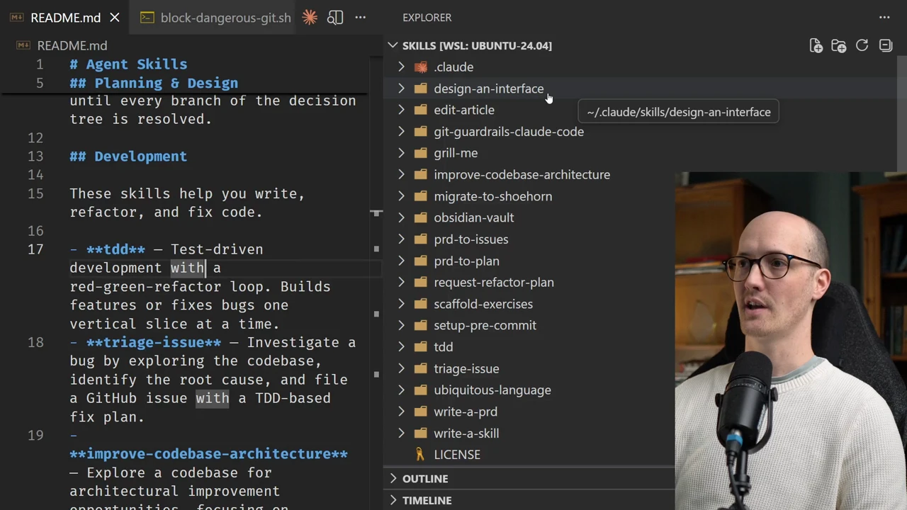
  <figcaption>Скриншот показывает исходную форму истории: это не монолитный фреймворк, а библиотека малых ремонтопригодных процедур. Источник: <a href="https://www.aihero.dev/claude-code-skills-are-all-you-need">Claude Code Skills Are All You Need</a>. Локальный файл: <code>../assets/story-images/12-matt-skills-repo.webp</code>.</figcaption>
</figure>

Pocock прямо отталкивается от больших агентских методологий вроде GSD, BMAD и Spec-Kit. Его претензия не в том, что такие подходы бесполезны. Проблема в управляемости. Когда процесс пытается владеть всей разработкой сразу, трудно понять, где именно он сломался: постановка задачи, планирование, разбиение на задачи, тестовая стратегия, контекст, интеграция с трекером или поведение модели.

Малый skill даёт другой тип контроля. Если агент задаёт слишком много слабых вопросов, чинится `/grill-me`. Если он не умеет закреплять доменный язык, чинится `/grill-with-docs`. Если он режет PRD на горизонтальные задачи, меняется `/to-issues`. Если он не умеет диагностировать, меняется `/diagnose`. Если он может выполнить опасную git-команду, добавляется hook. Сбой не растворяется в “методологии вообще”. У него появляется конкретное место ремонта.

В этом смысле Pocock ближе к библиотеке процедур, чем к фреймворку разработки. Навыки можно составлять, но каждый из них должен оставаться достаточно маленьким, чтобы его можно было прочитать, проверить и переписать. Это особенно важно для агентской разработки: сам инструмент меняется, Claude Code добавляет plugins, Anthropic меняет hooks, появляются новые формы skills, упаковка может отставать от документации. Если процесс монолитный, платформа ломает его целиком. Если процесс состоит из маленьких процедур, адаптировать нужно отдельные узлы.

## 2. Предыстория: plan mode как первая граница перед кодом

До нынешнего набора skills у Pocock уже была более простая дисциплина: почти всё начинать через plan mode. В Claude Code это режим, где агент может читать файлы, исследовать кодовую базу и рассуждать, но не может редактировать файлы, запускать команды и выполнять тесты. Его можно включить через `/plan` или запуск с `--permission-mode plan`.

Практический смысл plan mode не только в получении плана. Pocock использует его как контекст priming. Агент до реализации читает релевантные файлы, находит связи, видит существующие интерфейсы, уточняет требования и формирует рабочую карту. Когда затем начинается реализация, агент уже не действует из пустого чата.

Он использует plan mode даже для небольших исправлений. Это иногда медленнее, если разработчик сам прекрасно знает участок кода, но Pocock оптимизирует не только текущую минуту. Он тренирует собственное чувство того, какие задачи агент берёт хорошо, снижает ручную усталость и вынуждает себя формулировать требования до реализации.

Есть и мелкая, но важная деталь: планы должны быть короткими. Pocock советует прямо сказать агенту, что в plan mode нужно жертвовать грамматической полнотой ради краткости, перечислять unresolved questions и заканчивать ответ нумерованным списком конкретных шагов. План, который нельзя быстро прочитать в терминале, сам становится трением.

Здесь видна предыстория `/grill-me` и `/grill-with-docs`. Plan mode останавливает агента до кода. Skills добавляют более точные формы: интервью, доменный словарь, ADR, PRD, вертикальные задачи, [TDD](#handbook--verification), handoff и triage.

## 3. Минимальный `AGENTS.md`: агенту не нужна энциклопедия проекта

Pocock отдельно пишет о `AGENTS.md` как о файле, который хранится в Git и попадает в начало разговора агента. Для Claude Code аналогичную роль играет `CLAUDE.md`. Если нужно поддерживать оба имени, можно сделать символическую ссылку:

```
ln -s AGENTS.md CLAUDE.md

```

Но его позиция здесь ограничительная. В `AGENTS.md` нельзя складывать всё, что когда-либо оказалось полезным. Каждый токен этого файла загружается в каждый запрос. Если туда автоматически сгенерировать длинное описание директорий, команды, общие правила стиля и устаревающие подсказки, файл превращается в постоянный шум.

В статье про `/init` позиция ещё жёстче: автоматически созданный `CLAUDE.md` лучше удалить. Pocock делит контекстное окно на фазы: system запрос, exploration, реализация, testing. Exploration, реализация и testing гибкие: они раздуваются только тогда, когда задача этого требует. Системный слой фиксируется в начале, и всё, что попало в `CLAUDE.md`, постоянно вытесняет место из остальных фаз.

Он также говорит об instruction budget: модель может одновременно следовать ограниченному числу инструкций. Если `CLAUDE.md` набит правилами про frontend, backend, migrations, database, docs и стиль комментариев, агент тратит внимание ещё до задачи.

Init-файлы плохи ещё и потому, что дублируют то, что агент может открыть сам. Команды уже есть в `package.json`. Фреймворк виден из конфигов и imports. Структура файлов устаревает при первом переименовании. Важная формула Pocock: file system is the documentation. Если кодовая база хорошо структурирована, explore step даст агенту более свежую картину, чем гниющий краткое изложение.

Его почти предельный пример глобального `CLAUDE.md` может состоять из одной строки:

```
you are on WSL on Windows

```

Это правило глобально релевантно и плохо выводится из кода. Оно проходит порог попадания в постоянный контекст.

Здесь возникает важное напряжение. Pocock одновременно предупреждает про doc rot и активно использует `CONTEXT.md`, ADR, agent briefs и решения out-of-scope. Это не противоречие, если различать виды документов. Он выступает против широких автоматически сгенерированных обзоров кодовой базы. Но он сохраняет узкие смысловые документы: доменный язык, причины решений, границы продукта, состояние длинной работы, условия отказа. Эти вещи агент не всегда может вывести из файлов.


Минимальный `AGENTS.md` у Pocock стоит рядом с HumanLayer и Mike McQuaid. HumanLayer предупреждает, что постоянный стартовый контекст должен быть коротким и человечески написанным. Mike держит глобальные правила минимальными, потому что безопасность обеспечивают Sandvault и рабочие деревья. Pocock добавляет критерий ремонтопригодности: если правило нужно не всегда, его лучше вынести в навык или локальный документ.

## 4. `setup-matt-pocock-skills`: мягкая настройка рабочей среды

После установки набора у Pocock есть отдельный настройка-навык. Его роль не в том, чтобы один раз “правильно поставить” все skills. Он делает другое: помогает связать общий набор процедур с конкретным репозиторием.

Это важное различие. Сами skills не знают, как именно в проекте устроены задачи, какие статусы используются для triage, где хранится доменный язык, есть ли один общий контекст или несколько контекстов по подсистемам. Если оставить это неявным, агент будет действовать по собственным вариантам по умолчанию: предположит GitHub, придумает метки, начнёт писать задачи в неподходящем формате или не найдёт документы, на которые должны опираться другие навыки.

Setup-навык превращает эти неявные предположения в небольшую локальную конфигурацию. Он выясняет у пользователя, где живёт трекер задач, как называются рабочие состояния, где должны лежать доменные документы и какой файл используется как стартовая инструкция для агента — `AGENTS.md`, `CLAUDE.md` или их аналог. После этого он добавляет в репозиторий короткие steering-документы, на которые смогут ссылаться остальные skills.

Здесь нет жёсткого механизма исполнения. В issue #88 прямо зафиксировано: downstream skills не валидируют окружение, не останавливаются и не имеют строгих fallback-путей. Если настройка не выполнен или выполнен плохо, агент всё равно будет работать, но чаще начнёт подставлять неправильные варианты по умолчанию. Это делает систему гибкой, но оставляет её зависимой от качества начальной настройки.

Показательно и то, что Pocock рассматривал более строгую архитектуру: отделить навыки, которые создают содержательные артефакты, от навыков, которые публикуют их в конкретный трекер вроде GitHub. Такой слой адаптеров сделал бы процесс чище: один skill создаёт PRD или задачи, другой знает, как отправить их во внешнюю систему. Но в текущем наборе это не реализовано как отдельный устойчивый слой. Развязка остаётся в основном текстовой: через `AGENTS.md`, локальные документы и инструкции для агента.

Для этой истории настройка важен именно как граница между универсальным skill и конкретной рабочей средой. Pocock не пытается сделать skills полностью самодостаточными. Он предполагает, что у каждого репозитория есть свои соглашения, и сначала нужно дать агенту достаточно локальной ориентации, чтобы остальные процедуры не начинались с неверных предположений.

На этом заканчивается стартовый слой истории. Агент ещё ничего не реализует, но уже получает ограниченную рабочую среду: короткий постоянный контекст, указатели на доменные документы, правила triage и понимание того, где живут задачи. Дальше начинается другой слой — превращение сырого намерения в задачу, которую можно передать агенту без потери смысла.

## 5. `/grill-me`: остановить преждевременное понимание

<figure class="source-figure" id="fig-story-12-matt-design-tree">
  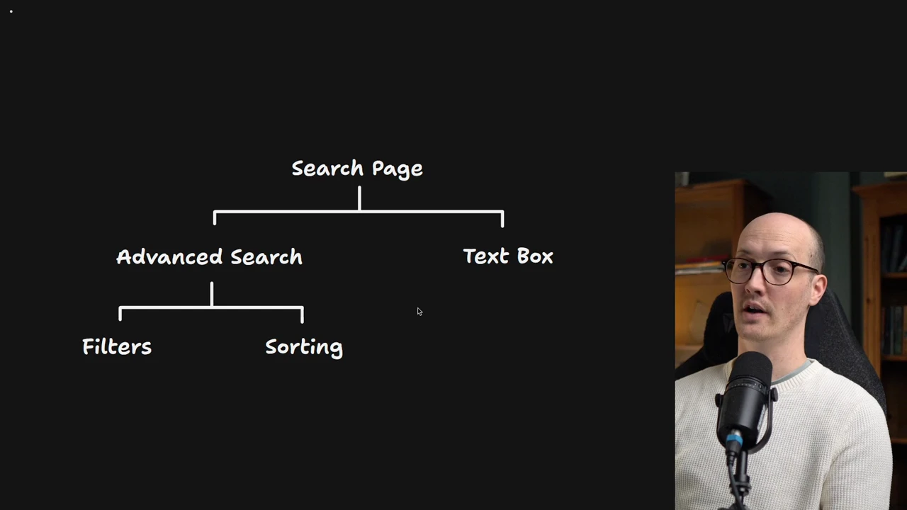
  <figcaption>Изображение поддерживает раздел о раннем уточнении намерения: до плана нужно увидеть форму задачи и развилки решения. Источник: <a href="https://www.aihero.dev/my-5-favorite-claude-code-skills">My Five Favorite Claude Code Skills</a>. Локальный файл: <code>../assets/story-images/12-matt-design-tree.webp</code>.</figcaption>
</figure>

<figure class="source-figure" id="fig-story-12-matt-clarifying-questions">
  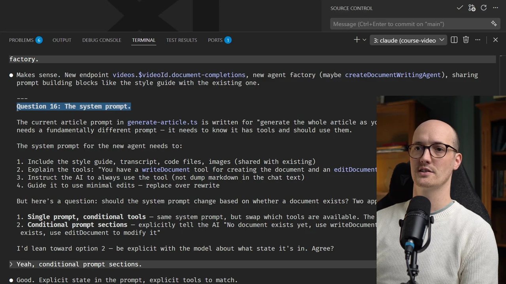
  <figcaption>Скриншот показывает рабочую механику `/grill-me`: агент должен задавать уточняющие вопросы, а не слишком рано делать вид, что задача понята. Источник: <a href="https://www.aihero.dev/my-5-favorite-claude-code-skills">My Five Favorite Claude Code Skills</a>. Локальный файл: <code>../assets/story-images/12-matt-clarifying-questions.webp</code>.</figcaption>
</figure>

Один из самых ранних и устойчивых навыков Pocock — `/grill-me`. В короткой форме он выглядит так:

```
Interview me relentlessly until you have enough information to complete the task. Ask one question at a time. Provide your recommended answer.

```

В полной версии `SKILL.md` агент должен пройти дерево решений, отделить существенные решения от несущественных, исследовать кодовую базу, если ответ можно получить из кода, и для каждого вопроса предложить рекомендуемый ответ.

Последний пункт важен. Если агент просто задаёт вопрос, человек каждый раз формулирует ответ с нуля. Если рядом есть recommended answer, многие итерации превращаются в быстрые “да, так” или “нет, здесь иначе”. Такой режим уменьшает нагрузку на человека, но не убирает его из процесса.

Проблема, которую закрывает `/grill-me`, проста: агент слишком рано делает план. Человек даёт несколько расплывчатых предложений, агент выдаёт связную структуру, и это выглядит как понимание. Но на самом деле не выяснены границы задачи: какие сценарии главные, какие варианты поведения допустимы, где нужен продуктовый выбор, какие существующие сущности нельзя трогать.

Pocock приводит пример с редактором видео для курса: после короткого описания Claude Code задал шестнадцать вопросов. В других сессиях число вопросов доходило до тридцати или пятидесяти. Это не задержка ради формы. Это способ вытащить скрытые решения до того, как они станут кодом.

Есть важная граница. Если вопрос низкой точности — например, какой URL должен быть у маршрута, — его можно решить разговором. Если вопрос высокой точности — как должен ощущаться интерфейс, как работает сложная анимация, какой вариант прототипа лучше воспринимается, — разговор начинает производить много текста и мало знания. Тогда нужно переходить к `/prototype`.

Есть и проблема масштаба. Если дать `/grill-me` слишком большую задачу, он может развернуть дерево решений до сотен вопросов. Pocock пишет о “dumb zone” около 120k токенов: формально контекст ещё есть, но сессия становится тяжёлой и хуже управляемой.

Issue #44 хорошо показывает его подход к этому сбою. Пользователь пожаловался, что Codex задал около 200 вопросов, и предложил hard cap. Решение было записано как out-of-scope: лимит вопросов не добавляется. Иногда три вопроса достаточно, иногда пятьдесят оправданы. Числовой лимит смешивает две разные проблемы: задача действительно недоопределена или модель задаёт слабые повторяющиеся вопросы. Второе нужно чинить запрос’ом навыка, а не счётчиком. Человек может остановить сессию, попросить wrap-up, принять текущий уровень определённости или перейти в прототип.

## 6. `/grill-with-docs`: доменный язык как рабочая память

<figure class="source-figure" id="fig-story-12-matt-grill-docs-cardinality">
  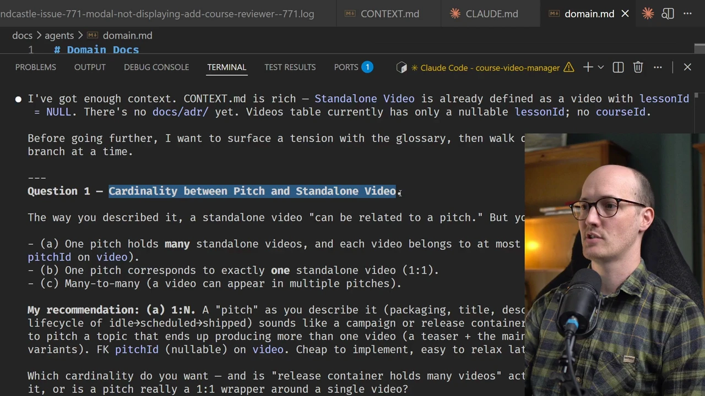
  <figcaption>Скриншот из урока `/grill-with-docs` показывает, как доменные документы превращают разговор в конкретные вопросы: агент не пишет код, пока не разрешена модель cardinality. Источник: <a href="https://www.aihero.dev/grill-with-docs">https://www.aihero.dev/grill-with-docs</a>. Локальный файл: <code>../assets/story-images/12-matt-grill-with-docs-cardinality.webp</code>.</figcaption>
</figure>


<figure class="source-figure" id="fig-story-12-matt-grill-docs-terminology">
  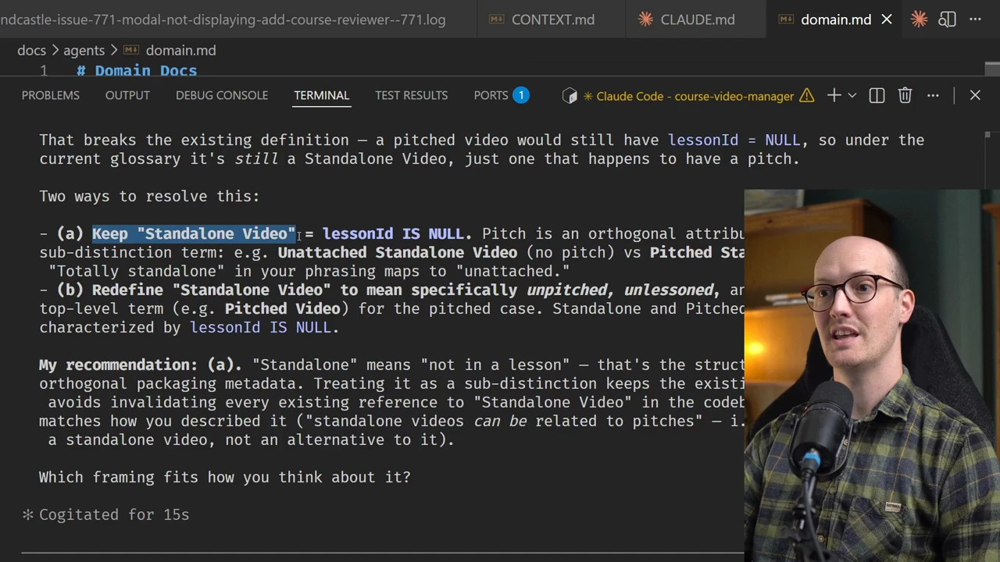
  <figcaption>Этот кадр полезен для той же подглавы, но включён как второй только потому, что он показывает другой тип пользы: не требования, а конфликт терминов в доменном языке. Источник: <a href="https://www.aihero.dev/grill-with-docs">https://www.aihero.dev/grill-with-docs</a>. Локальный файл: <code>../assets/story-images/12-matt-grill-with-docs-terminology.webp</code>.</figcaption>
</figure>


Следующий сбой: даже хороший разговор не гарантирует правильные слова. В проекте уже могут быть доменные термины, но агент назовёт сущность иначе. Или в разговоре появится удачный термин, но он не попадёт в код, документы и будущие сессии.

Изначально Pocock экспериментировал с отдельным навыком `/ubiquitous-language`. Позже он объединил его с `/grill-me` в `/grill-with-docs`. Навык задаёт вопросы и одновременно обновляет доменные документы.

В простом репозитории он ищет:

```
/CONTEXT.md
/docs/adr/

```

В монорепозитории или проекте с несколькими bounded contexts:

```
/CONTEXT-MAP.md
/<context>/CONTEXT.md
/<context>/docs/adr/

```

`CONTEXT.md` у Pocock — не спецификация и не черновик задачи. Это глоссарий доменного языка: термины, различения, правила употребления, связи с реальным кодом. Если документа нет, `grill-with-docs` создаёт его только тогда, когда появляется первый термин, который действительно стоит закрепить. Если нет `docs/adr/`, навык создаёт ADR только при первом решении, которое трудно откатить, трудно понять без контекста и которое содержит trade-off.

По ходу разговора агент должен проверять, не противоречит ли новое слово существующему словарю, уточнять расплывчатые слова, спрашивать про конкретные сценарии, сверяться с кодом и обновлять `CONTEXT.md` сразу, а не в конце. Это важно: если словарь обновляется по ходу разговора, следующая часть обсуждения уже использует более точный язык.

Pocock приводит пример из своего курса, где важно различать `Pitch`, `Pitched Standalone Video` и связанные состояния курса. Без таких слов агент каждый раз описывает длинную ситуацию. С ними PRD, задачи, тесты и код начинают ссылаться на одно и то же понятие.

В публичных материалах есть неровность именования. Страница `skills-grill-me` говорит, что Pocock теперь рекомендует `domain-model` как вариант по умолчанию starting point для planning рабочий процессs, но ссылка `skills-domain-model` редиректит на `/grill-with-docs`, а issue #166 фиксирует, что `domain-model` документирован, но не устанавливается через `npx skills add mattpocock/skills --skill=domain-model`. В текущем репозитории фактическое имя — `grill-with-docs`. Это не косметика, а признак живого инструмента: сайт, packaging и реальные `SKILL.md` могут расходиться.

Идея здесь шире, чем “вести словарь”. Pocock уменьшает энтропию языка. Если один объект называется разными словами в беседе, коде, PRD и задачах, агент будет ошибаться даже при большом контексте. Если язык закреплён в `CONTEXT.md`, последующие навыки строят на нём работу.

## 7. Когда разговор нужно заменить прототипом

`/grill-with-docs` не должен решать всё. Pocock отдельно разбирает ошибки использования `/grill-me` и `/grill-with-docs`: high-fidelity вопросы нельзя бесконечно договаривать. Их нужно увидеть.

Навык `/prototype` появился как ответ на вопросы, которые нельзя нормально закрыть разговором. Он делит прототипы на два типа.

Если вопрос про логику, состояние или бизнес-поведение, прототип должен быть маленькой runnable-программой в терминале. Желательно использовать тот же язык или среда выполнения, что и проект, но не тащить новый package manager только ради эксперимента. Логика должна быть изолирована в переносимый модуль: reducer, state machine, pure functions или класс. Оболочка может быть выброшена, а логический модуль позже перенесён в проект.

Если вопрос про интерфейс, прототип должен дать несколько видимых вариантов, между которыми можно переключаться. Часть решений появляется только при взгляде на работающий вариант. Особенно это относится к layout, состояниям, анимациям, визуальной плотности, потоку пользователя.

В `LOGIC.md` для прототипа есть важное правило: перед кодом записать вопрос, на который прототип должен ответить. Прототип, который отвечает не на тот вопрос, — потеря времени. Это предохранитель против агентской активности ради активности.

Типовая связка получается такой:

```
/grill-with-docs → /handoff to /prototype → iterate → /handoff back → /to-prd → /to-issues

```

`handoff` здесь нужен, чтобы прототип не загрязнял основную сессию. Прототип строится в отдельном потоке, возвращает выводы, и только после этого PRD и задачи получают уже проверенный материал.

Так закрывается слой формирования намерения. Pocock не пытается сразу получить идеальный план. Он сначала вытаскивает скрытые решения через вопросы, закрепляет язык в `CONTEXT.md`, а там, где слова уже недостаточны, строит маленький прототип. Только после этого материал имеет смысл сжимать в PRD.


`/grill-with-docs` связан с Boris Tane, но закрывает другой риск. У Tane `research.md` и `plan.md` удерживают понимание системы и будущий способ реализации. У Pocock `CONTEXT.md` удерживает язык, на котором потом будут писаться PRD, задачи, тесты и код. Если язык расползается, даже хороший план начнёт вести агента к разным сущностям.

## 8. `/to-prd`: разговор нужно сжать до переносимого намерения

<figure class="source-figure" id="fig-story-12-matt-prd-user-stories">
  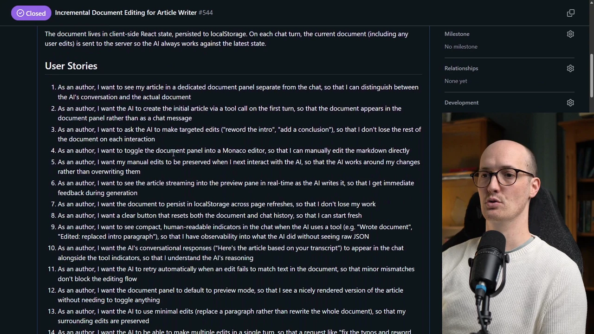
  <figcaption>Скриншот поддерживает идею PRD как переносимого намерения: разговор сжимается в документ, с которым можно работать дальше. Источник: <a href="https://www.aihero.dev/my-5-favorite-claude-code-skills">My Five Favorite Claude Code Skills</a>. Локальный файл: <code>../assets/story-images/12-matt-prd-user-stories.webp</code>.</figcaption>
</figure>

После `/grill-with-docs` Pocock часто переходит к `/to-prd`. Этот навык не должен заново интервьюировать человека. Он берёт уже накопленный разговор, доменный словарь, решения и ограничения, а затем превращает их в PRD.

Перед записью PRD агент может исследовать кодовую базу, но должен уважать `CONTEXT.md` и ADR. Он также думает о тестовых швах: где поведение можно проверить через существующие интерфейсы, какой самый высокий уровень тестирования даст уверенность, где лучше не лезть в детали реализации.

PRD содержит не только “что сделать”. В нём должны быть проблема, предлагаемое решение, пользовательские истории, реализация decisions, testing decisions, out-of-scope и дополнительные заметки для будущего агента. Если в ходе обсуждения видно, что за задачей скрывается deep module, PRD должен это заметить: стабильный небольшой интерфейс и сложная внутренняя реализация меняют способ тестирования.

Pocock отдельно предупреждает: не очищайте контекст до того, как сделали PRD, если в беседе уже накопились важные design decisions. Иначе следующий агент получит чистый чат, но потеряет причины решений.

Здесь PRD выступает не как бюрократический документ, а как переносимый носитель намерения между длинным разговором и будущим исполнением.

## 9. `/to-issues`: вертикальные задачи вместо горизонтального распила

<figure class="source-figure" id="fig-story-12-matt-vertical-slices">
  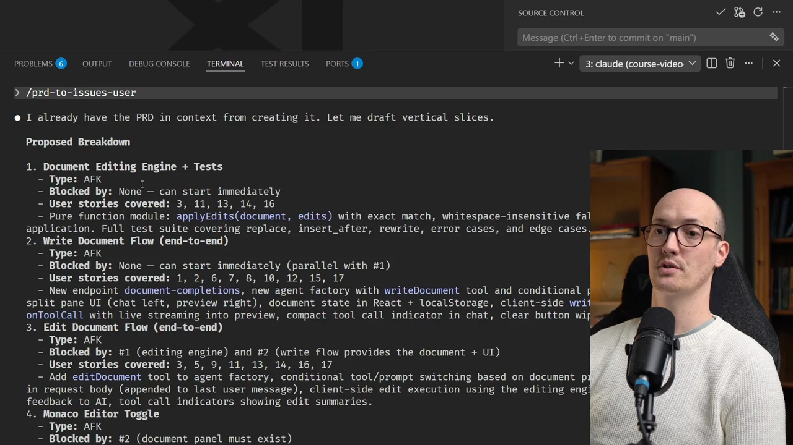
  <figcaption>Скриншот показывает, почему `/to-issues` режет работу на проверяемые вертикальные срезы, а не на горизонтальные слои реализации. Источник: <a href="https://www.aihero.dev/my-5-favorite-claude-code-skills">My Five Favorite Claude Code Skills</a>. Локальный файл: <code>../assets/story-images/12-matt-vertical-slices.webp</code>.</figcaption>
</figure>

Следующий навык — `/to-issues`. Он превращает PRD, план или спецификацию в задачи для трекера. Важная часть здесь не интеграция с GitHub или Linear, а форма задач.

Плохой набор задач выглядит так:

```
1. Добавить схему базы данных.
2. Добавить API.
3. Добавить UI.
4. Написать тесты.

```

Такой распил удобен для описания слоёв, но плох для агентского исполнения. Каждая задача сама по себе не даёт работающего поведения. Агент может выполнить “схему”, второй агент — “API”, третий — “UI”, а затем окажется, что интерфейсы не совпадают.

Хорошая задача должна быть vertical slice или tracer bullet:

```
1. Создать самый простой end-to-end путь для одного объекта.
2. Разрешить редактирование одного поля.
3. Показать первую ошибку валидации.

```

Каждая такая задача может затронуть схему, API, UI и тесты, но в минимальном объёме. Она даёт проверяемое поведение и может быть завершена агентом независимо.

`/to-issues` также различает задачи `AFK` и `HITL`. `AFK` можно делегировать агенту с минимальным участием человека. `HITL` требует человеческого решения: дизайн, архитектурный выбор, продуктовая граница, спорная миграция или другое место, где агент не должен сам закрывать вопрос.

Задачи публикуются в порядке зависимостей, чтобы реальные номера задач можно было использовать в “Blocked by”. Это важная мелочь: если зависимости не зафиксированы, параллельная агентская работа быстро создаёт конфликт.

Issue #265 даёт хороший сбой этой схемы. `/to-issues` правильно увидел доменные зависимости между slice A и slice C, но пропустил interface blocker. Slice C требовал CLI-флаг `--finecoTransactionsPath`, который должен был опираться на механизм `applyCliOverride` из slice B. Так как B не был указан как blocker, агент, работавший над C, заново реализовал почти тот же механизм как `parseCliOverride`. Конфликт пришлось разруливать вручную при rebase.

Вывод: вертикальные задачи должны искать не только потоки данных и типов, но и инфраструктурные механизмы, на которые указывают acceptance criteria. Если acceptance criterion одной задачи ссылается на CLI-флаг, endpoint, shared utility или другой механизм, который строит соседняя задача, эта соседняя задача должна стать blocker.

## 10. Agent brief: issue не равно контракт для агента

Для triage и AFK-работы Pocock отдельно различает исходное issue и agent brief. В `AGENT-BRIEF.md` issue body и discussion — это контекст, а agent brief — контракт, по которому будет работать AFK-агент.

Отсюда правило durability over precision. Agent brief может пролежать в `ready-for-agent` несколько дней или недель, и кодовая база за это время изменится. Поэтому в нём не стоит писать file paths и line numbers, если это не абсолютно необходимо. Лучше описывать current behavior, desired behavior, key interfaces, edge cases, acceptance criteria и out-of-scope.

Это меняет смысл `/to-issues`. Задача для AFK-агента должна быть не инструкцией “открой `src/foo.ts` и измени строку 42”, а устойчивым описанием поведения. Агент потом сам заново исследует кодовую базу и найдёт текущие файлы.

Такой brief особенно важен в open источник: входящее issue редко является хорошей задачей для агента. Его нужно превратить в контракт.


Вертикальная нарезка задач у Pocock хорошо дополняет Mae Capozzi и Calvin French-Owen. Mae через Linear, Figma MCP и платформенные проверки превращает план в ограниченные рабочие единицы. Calvin использует `plans/`, TODO, preview deploys и навыки, чтобы сохранить состояние между сессиями. Pocock формулирует локальное правило: задача для агента должна быть проверяемым срезом, а не горизонтальным слоем без пользовательского результата.

## 11. `/triage`: backlog как подготовка работы, а не генерация кода

<figure class="source-figure" id="fig-story-12-matt-triage-issue-labels">
  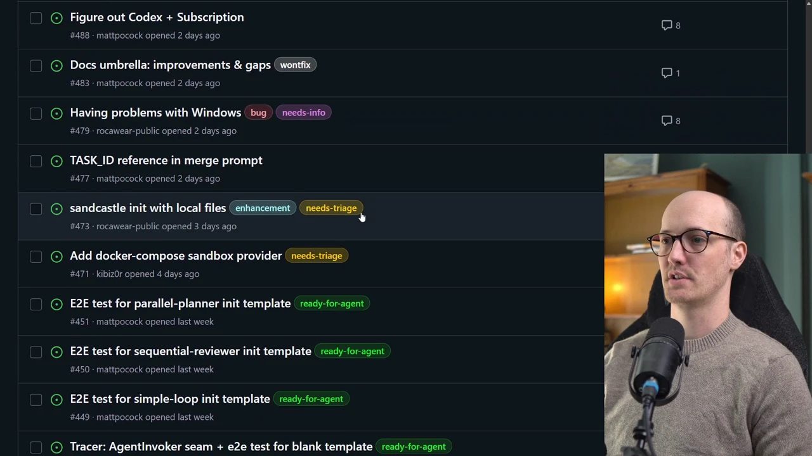
  <figcaption>Скриншот показывает `/triage` как подготовку backlog: issue получает статус вроде needs-triage или ready-for-agent до того, как агенту разрешают реализацию. Источник: <a href="https://www.aihero.dev/burn-through-your-backlog-with-my-triage-skill">https://www.aihero.dev/burn-through-your-backlog-with-my-triage-skill</a>. Локальный файл: <code>../assets/story-images/12-matt-triage-issue-labels.webp</code>.</figcaption>
</figure>


<figure class="source-figure" id="fig-story-12-matt-triage-bulk-labeling">
  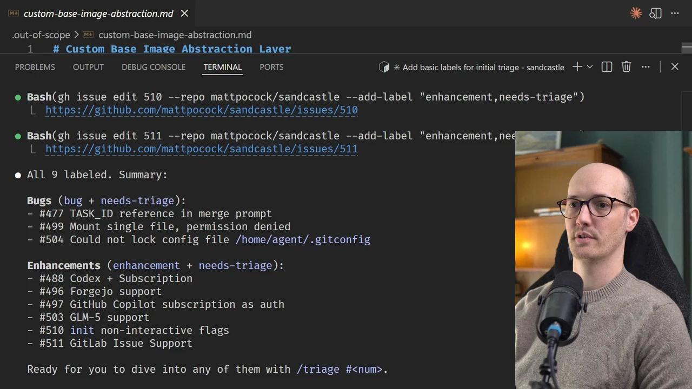
  <figcaption>Кадр поддерживает мысль, что triage — это не генерация кода, а массовая классификация и подготовка задач к безопасной передаче агенту. Источник: <a href="https://www.aihero.dev/burn-through-your-backlog-with-my-triage-skill">https://www.aihero.dev/burn-through-your-backlog-with-my-triage-skill</a>. Локальный файл: <code>../assets/story-images/12-matt-triage-bulk-labeling.webp</code>.</figcaption>
</figure>


Навык `/triage` переносит ту же логику на трекер задач. Pocock пишет, что использует его на всех open источник репозиториях, которые поддерживает. Цель не в том, чтобы агент “починил все issues”, а в том, чтобы превратить разрозненный backlog в состояния.

У каждой записи должна быть ровно одна роль категории и ровно одна роль состояния. Категории:

```
bug
enhancement

```

Состояния:

```
needs-triage
needs-info
ready-for-agent
ready-for-human
wontfix

```

В каждом комментарии или issue, созданном во время triage, должна быть пометка:

```
> *This was generated by AI during triage.*

```

Это часть прослеживаемости. Если агент оставляет комментарий в публичном репозитории, читатель должен понимать происхождение текста.

Навык требует читать `AGENT-BRIEF.md`, `OUT-OF-SCOPE.md`, проектный словарь и ADR. Для конкретного issue агент собирает содержимое, комментарии, метки, автора, даты и предыдущие triage-заметки, затем исследует кодовую базу. Для багов правило строже: сначала попытаться воспроизвести или хотя бы пройти кодом к месту сбоя, и только потом grill.

Если нужно больше информации, агент пишет `needs-info` с тем, что уже установлено, и конкретными вопросами. Если задача готова для агента, он пишет brief. Если готова для человека, объясняет, почему это не стоит делегировать модели.

Для enhancement с решением `wontfix` есть отдельный ход: записать причину в `.out-of-scope/*.md`, оставить комментарий и закрыть. `OUT-OF-SCOPE.md` уточняет, что один файл должен соответствовать одному concept, а не одному issue. Если несколько людей просят dark mode, plugin system или GraphQL API, эти запросы группируются под один документ с decision, reason и prior requests. Это маленькая база институциональной памяти.

Реальные `.out-of-scope/` решения самого репозитория показывают этот механизм в работе. В `question-limits.md` отказ от hard cap для grilling превращён в durable decision. В `mainstream-issue-trackers-only.md` зафиксировано, что first-class трекер задач integrations ограничиваются mainstream-инструментами; для остальных есть local markdown и other/custom. В `setup-skill-verify-mode.md` отклонён отдельный verify mode: тот же запрос-driven настройка skill должен уметь проверить конфигурацию, если попросить его “не переписывать, только сверить”.

Есть и важный пробел. Issue #289 описывает dormant defect: реальный дефект в коде, который сейчас недостижим из-за текущего дизайна, но может стать живым багом при конкретном изменении. Это не обычный `wontfix bug` и не `.out-of-scope/` для rejected enhancement. Предложенное направление — якорить анализ рядом с кодом: оставить комментарий в слабом месте, указать, почему дефект сейчас недостижим, при каком условии он оживёт и как его исправлять.

Это важно для CU: не каждый найденный смысловой объект должен становиться текущей задачей. Иногда он должен стать watch condition.

На этом слой упаковки работы становится полным. У Pocock есть несколько разных форм переносимого состояния: PRD для намерения, issue для единицы работы, agent brief для AFK-исполнителя, `.out-of-scope/` для отклонённого направления и watch condition для дефекта, который пока не активен. Эти формы нужны не для документации ради документации, а для того, чтобы следующая сессия агента не начинала с пустого места и не восстанавливала смысл по обрывкам чата.

## 12. Tracer bullets: сначала маленький сквозной срез

Pocock отдельно описывает tracer bullets как способ держать ИИ-код под контролем. Типичный сбой: агент получает задачу про сервис базы данных и сразу строит endpoints, модели, middleware, auth, rate limiting и логирование. Через двадцать минут выясняется, что подключение к базе вообще не работает.

Tracer bullet требует обратного порядка. Сначала маленький end-to-end срез, который проходит через все важные слои. Потом проверка. Потом расширение.

В запрос-фрагменте смысл примерно такой:

```
When building features, build a tiny, end-to-end slice of the feature first, seek feedback, then expand out from there.

```

Пример — “Reveal in File System” в приложении, где нужно было из WSL открыть файл в Windows Explorer. Первый tracer bullet не строит весь UI. Он делает минимальный backend endpoint, который выполняет PowerShell-команду и показывает файл в проводнике. Только когда этот срез работает, появляется смысл строить следующий слой интерфейса.

Это тот же принцип, что в `/to-issues`, но на уровне исполнения: агенту нельзя позволять долго строить воображаемую систему без контакта с реальностью.

## 13. `/tdd`: тест до кода как честный сигнал для агента

<figure class="source-figure" id="fig-story-12-matt-tdd-source-workflow">
  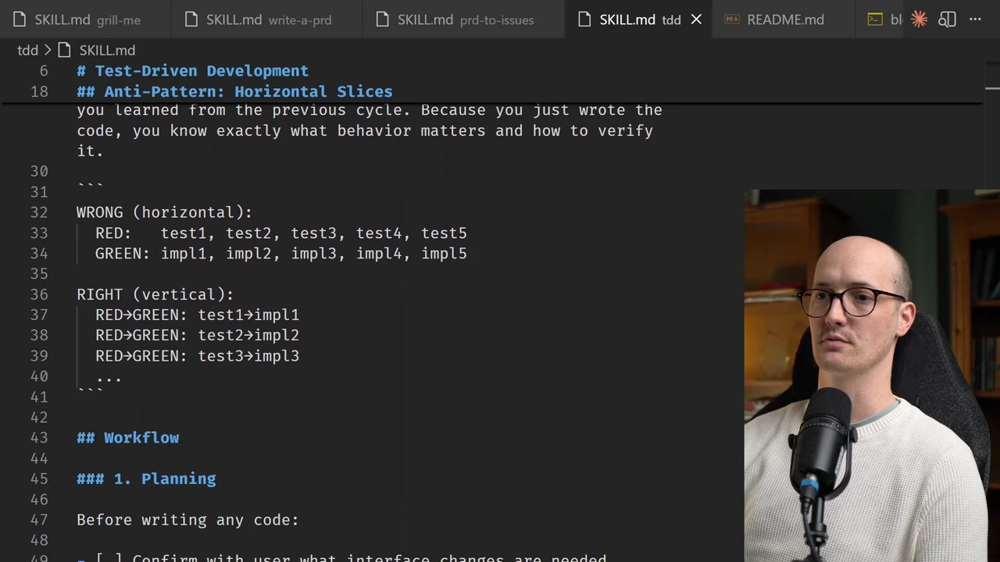
  <figcaption>Картинка из первоисточника показывает TDD workflow как навык, который заставляет агента получить красный тест до реализации. Источник: <a href="https://www.aihero.dev/my-5-favorite-claude-code-skills">5 Agent Skills I Use Every Day</a>. Локальный файл: <code>../assets/story-images/12-matt-tdd-source-workflow.webp</code>.</figcaption>
</figure>


Самый жёсткий технический навык в наборе — `/tdd`. Pocock пишет, что использовал этот skill для большинства не-фронтендовой работы. Причина: обычный агентский режим порождает плохие тесты.

Типичный сбой:

1. агент пишет всю фичу;
2. затем пишет тесты;
3. тесты проверяют то, что агент уже решил построить;
4. если тесты не проходят, агент иногда меняет тесты, а не реализацию;
5. если контекст большой, агент теряет исходное поведение и начинает подгонять всё под зелёный результат.

В `tdd/SKILL.md` прямо запрещён горизонтальный подход “все тесты, потом вся реализация”. Навык требует вертикальных tracer bullets:

```
ONE test → ONE implementation → repeat

```

Цикл классический: red, green, refactor. Но важнее правила честности. Хороший тест проверяет поведение через публичный интерфейс. Плохой тест мокает внутреннюю функцию, проверяет приватный метод, пишет напрямую в БД, утверждает, что helper был вызван, вместо проверки результата.

Перед началом [TDD](#handbook--verification) агент должен задать вопросы: какие интерфейсы меняются, какое поведение нужно проверить, где находятся deep modules, через какой интерфейс лучше тестировать. Затем он пишет один падающий тест, показывает ошибку, делает минимальную реализацию, снова запускает тест и только потом идёт дальше. Refactor разрешён только после зелёного состояния.

Это не просто дисциплина тестирования. Это способ дать агенту правдивую обратную связь. Если тест написан до реализации и проверяет поведение через публичный интерфейс, агенту труднее обмануть себя локальным зелёным состоянием.

## 14. Петли обратной связи: механическое нужно отдавать инструментам

Pocock связывает TDD с более общей идеей обратных связей. Агентам нужны проверяемые сигналы, а не просьбы “будь аккуратен”. Если проверку можно сделать детерминированной, её лучше вынести в инструмент: typecheck, тесты, formatter, linter, pre-commit hook.

В TypeScript-проектах это обычно означает простые команды вроде `tsc` и `vitest`. Для коммитов — связку Husky, `lint-staged`, Prettier, проверку типов и тесты. Конкретный набор инструментов не является главным. Важнее другое: агент не должен решать на глаз, достаточно ли аккуратно он изменил код. Он должен столкнуться с внешним сигналом: проверка прошла или не прошла.

Это хорошо совпадает с агентской природой работы. Агенты не раздражаются от повторения. Если hook или тест падает, это не “рутина, которую человек устал бы делать десятый раз”, а входные данные для следующей попытки. Поэтому механические проверки лучше держать в инструментах, а не в длинных текстовых правилах внутри `AGENTS.md`.

Здесь Pocock снова повторяет свой главный ход. Повторяемая ошибка агента не должна оставаться советом. Её нужно превратить в среду, которая возвращает сигнал сама.


`/tdd` и tracer bullets у Pocock связаны с Mark Erikson и Peter Steinberger. Mark стремится переносить повторяемое в детерминированные проверки и инструменты. Peter часто просит тесты после фичи или исправления, пока контекст свежий. Pocock делает тест раньше кода, чтобы агент не мог подогнать проверку под уже выбранную реализацию.

## 15. Ralph loops: когда задачи начинают исполняться без постоянного участия человека

В процессе Pocock skills готовят материал не только для ручной реализации, но и для [Ralph loop](#handbook--skills-hooks)s. В статье про реальную фичу для `course-video-manager` путь выглядит так: начальный brainstorm, `grill-me`, PRD, issues, затем автономные Ralph loops.

Ralph — это небольшая shell-обвязка вокруг повторяемого запуска coding agent. Агент получает `PRD.md`, читает `progress.txt`, выбирает следующую незавершённую задачу, делает один логический шаг, запускает проверки, коммитит результат и обновляет progress file. Если всё закончено, он выводит явный completion marker вроде:

```
<promise>COMPLETE</promise>

```

Эта форма важнее конкретного shell-скрипта. `PRD.md` задаёт целевое состояние, `progress.txt` хранит память между независимыми запусками, completion marker даёт внешней обвязке способ понять, когда цикл можно остановить. В HITL-режиме человек запускает одну итерацию и смотрит результат. В AFK-режиме цикл получает лимит итераций и работает дальше без постоянного участия человека.

Pocock подчёркивает, что Ralph нельзя понимать как “пусть агент сам долго работает”. У него есть несколько обязательных условий: задача должна быть разрезана на маленькие шаги, каждая итерация должна делать один логический change, проверки должны блокировать плохой commit, рискованные части лучше выполнять раньше и в HITL-режиме, а для AFK нужен sandbox. Иначе автономный цикл превращается в генератор большого, плохо проверяемого дифф.

Позже Anthropic сделал официальный Ralph plugin для Claude Code, и Pocock резко выступил против него. Его аргумент технический: plugin-loop держит работу внутри одной Claude Code session через stop hook, поэтому каждое новое прохождение наследует весь накопленный контекст. После нескольких итераций сессия уходит из smart zone в dumb zone. Bash loop делает противоположное: каждая итерация стартует в свежем контекстном окне, заново читает PRD и progress file, видит состояние через Git и файлы, делает один шаг и выходит. Для Pocock сброс контекста — ключевое свойство Ralph, а не побочная реализация.

У bash loop есть своя шероховатость. Если запускать Claude в print mode, AFK-режим может выглядеть как чёрный ящик: терминал молчит до завершения. Поэтому Pocock использует потоковый JSON-вывод и обработку через `grep`, `tee` и `jq`, чтобы одновременно видеть живой вывод агента и сохранить финальный результат для проверки completion marker. Эти детали не нужны как инструкция, но они хорошо показывают реальную проблему: автономность без наблюдаемости быстро становится тревожной и плохо управляемой.

Источник задач можно заменить. Ralph может работать не только от локального `PRD.md`, но и от GitHub Issues, Linear или beads; результат может быть веткой и PR. Но общий критерий остаётся тем же: задача должна подходить под форму “посмотреть репозиторий, сделать один проверяемый шаг, зафиксировать состояние”.

## 16. `/handoff`: перенос состояния без загрязнения основного контекста

<figure class="source-figure" id="fig-story-12-matt-handoff-smart-zone">
  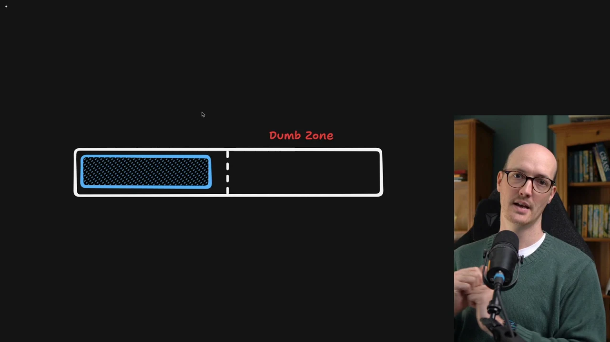
  <figcaption>Скриншот из `/handoff` визуально объясняет, почему состояние нужно переносить в файл: новая сессия должна начать в “умной” части контекста, а не тащить шум старой. Источник: <a href="https://www.aihero.dev/skills-handoff">https://www.aihero.dev/skills-handoff</a>. Локальный файл: <code>../assets/story-images/12-matt-handoff-smart-zone.webp</code>.</figcaption>
</figure>


<figure class="source-figure" id="fig-story-12-matt-handoff-two-way">
  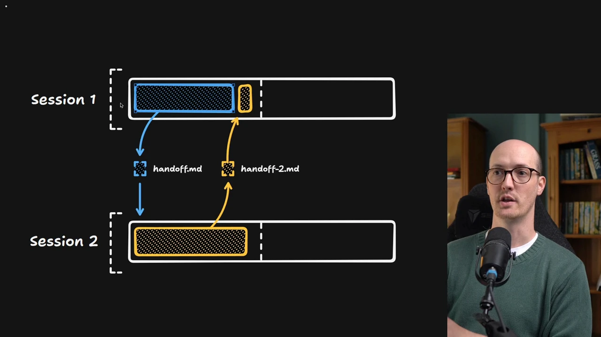
  <figcaption>Этот источник показывает handoff как двусторонний перенос состояния между сессиями: файл не заменяет агента, но связывает независимые контексты. Источник: <a href="https://www.aihero.dev/skills-handoff">https://www.aihero.dev/skills-handoff</a>. Локальный файл: <code>../assets/story-images/12-matt-handoff-two-way-transfer.webp</code>.</figcaption>
</figure>


`/handoff` решает проблему длинной сессии. Большой разговор может накопить много решений, но побочная работа — прототип, отдельный баг, исследование или переход в другой инструмент — загрязнит основной контекст. Если открыть новый чат без подготовки, новый агент потеряет важные решения.

Навык пишет markdown-документ для следующей сессии. Он сохраняет его во временную директорию операционной системы, а не в рабочий каталог проекта. Это disposable-документ.

Хороший handoff содержит цель следующей сессии, релевантный контекст, ссылки на существующие артефакты, suggested skills, ограничения, а также редактирование секретов, API keys, паролей и PII.

В `SKILL.md` прямо сказано: не дублировать содержимое уже существующих PRD, планов, ADR, issues, коммиты или diffs. Нужно ссылаться на путь или URL. Handoff не должен стать ещё одной копией правды, которая завтра устареет.

Pocock противопоставляет `handoff` слепому `/compact`. Compact остаётся внутри той же линии разговора. Handoff создаёт управляемую границу между сессиями.

## 17. `/diagnose`: сначала pass/fail-сигнал, потом исправление

`/diagnose` важен не как “ещё один skill для багов”. В текущем `SKILL.md` у него есть сильная техническая идея: для трудного бага сначала нужно построить быстрый, детерминированный, запускаемый агентом сигнал pass/fail.

Если есть надёжный feedback loop, причину можно найти. Если его нет, чтение кода легко превращается в гадание. Поэтому агент должен сначала создать воспроизведение. Возможные формы:

- падающий unit, integration или e2e-тест;
- `curl` или HTTP-скрипт против dev-сервера;
- CLI-вызов с fixture и сравнением stdout;
- headless browser script через Playwright или Puppeteer;
- replay сохранённого network request, payload или event log;
- throwaway harness;
- property/fuzz loop;
- bisection harness для `git bisect run`.

После этого навык ведёт последовательность: минимизировать случай, выдвигать гипотезы, инструментировать код, исправлять и добавить regression тест.

В changelog Pocock пишет, что `/diagnose` ещё нуждается в настройке, потому что ИИ слишком охотно перескакивает к решению. Это важный failure mode: модель знает, что надо диагностировать, но при виде правдоподобной причины всё равно пытается сразу чинить. Навык зрелый только тогда, когда агент в реальной задаче строит pass/fail-сигнал до первого исправления.

Этим завершается слой исполнения и обратной связи. Tracer bullet, TDD, pre-commit, Ralph, handoff и diagnose решают одну общую проблему: агенту нельзя давать длинный отрезок работы без проверяемого сигнала и внешнего состояния. Если же даже при таких циклах агент всё равно постоянно путается, Pocock переносит внимание выше — к архитектуре самой кодовой базы.

## 18. Архитектура: иногда агент ошибается из-за формы кодовой базы

<figure class="source-figure" id="fig-story-12-matt-architecture-candidates">
  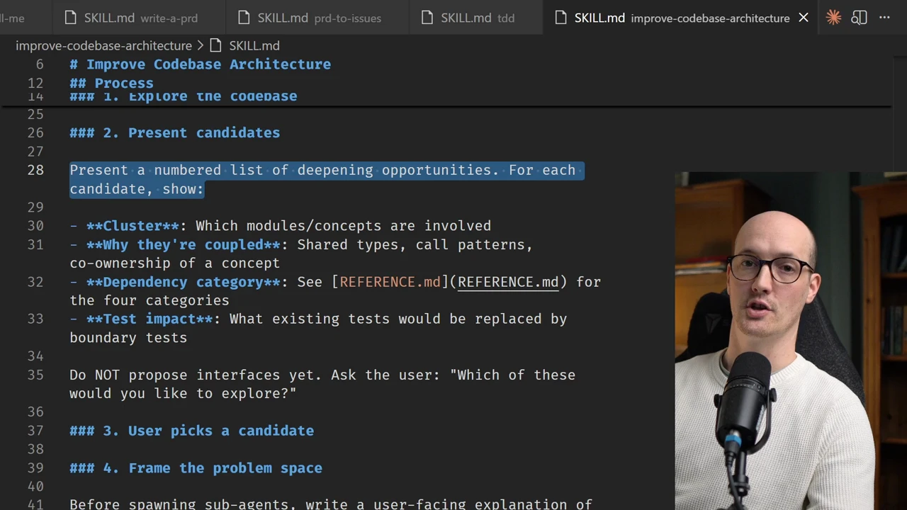
  <figcaption>Скриншот полезен в разделе про архитектуру: Pocock предлагает не “улучшить архитектуру вообще”, а сначала собрать конкретные candidate areas и только потом выбирать направление. Источник: <a href="https://www.aihero.dev/my-5-favorite-claude-code-skills">5 Agent Skills I Use Every Day</a>. Локальный файл: <code>../assets/story-images/12-matt-architecture-candidates.webp</code>.</figcaption>
</figure>

Навык `/improve-codebase-architecture` исходит из мысли, что агент может ошибаться не из-за плохого запроса, а из-за самой структуры кода. Если модель постоянно прыгает между большим числом файлов, тесты лезут во внутренности, helpers не дают настоящей изменяемости, а агент выбирает не тот слой для правки, возможно, кодовая база ведёт его в неправильное место.

Навык читает `CONTEXT.md` и ADR, затем исследует код. В `LANGUAGE.md` зафиксирован словарь: `Module`, `Interface`, `Implementation`, `Depth`, `Seam`, `Adapter`, `Leverage`, `Locality`.

`Interface` здесь — не только сигнатура типа и не TypeScript `interface`, а всё, что вызывающий код должен знать: инварианты, ограничения порядка, режимы ошибок, обязательная конфигурация, характеристики производительности. `Depth` определяется не числом строк реализации, а leverage at the interface: сколько поведения спрятано за малой поверхностью. `Seam` предпочтительнее слова boundary, потому что boundary перегружен DDD-смыслом. `The interface is the test surface`: если тесту нужно пройти мимо interface, форма модуля, вероятно, выбрана плохо.

В `DEEPENING.md` это становится практическим. Зависимости классифицируются:

- in-process pure computation;
- local-substitutable зависимость;
- remote but owned;
- true external.

Для каждой категории своя тестовая стратегия. Правило “one adapter = hypothetical seam, two adapters = real seam” защищает от преждевременной абстракции. Если есть только один продакшен adapter и никакой реальной вариативности, seam может быть лишней прослойкой. Если есть продакшен adapter и тест adapter, seam уже выполняет работу.

Итогом архитектурного анализа должен быть HTML-отчёт во временной директории:

```
architecture-review-<timestamp>.html

```

Отчёт содержит candidate refactors как карточки: involved files/modules, problem, solution, benefits через locality and leverage, before/after diagram и recommendation strength. Он не становится частью проекта автоматически.

Есть и короткий навык `/zoom-out`: перед правкой незнакомого участка попросить агента подняться на уровень выше и дать карту modules/вызывающий кодs через доменный glossary. Не всякая непонятная область требует полного архитектурного обзора.

Issue #274 показывает важный сбой: после добавления grilling в архитектурный skill он стал хуже для раннего широкого анализа. Вместо “shotgun blast” архитектурных вариантов агент слишком рано выбирает один вариант и начинает длинное интервью. Значит, grilling полезен не всегда. Сначала нужен обзор кандидатов и визуальный отчёт, затем выбор человеком, и только после этого grilling выбранного направления.

## 19. `review` как ещё не стабилизированная проверка

В `in-progress` лежит навык `review`, и его нельзя считать частью публичного основного процесса. `.claude-plugin/plugin.json` его не экспортирует. Но концептуально он важен.

Он предлагает two-axis проверка. Первая ось — Standards: соответствует ли дифф задокументированным стандартам репозитория. Вторая — Spec: реализует ли дифф исходное issue, PRD или spec. Эти проверки запускаются параллельными subagents, чтобы контексты не загрязняли друг друга. Итоговый отчёт сохраняет оси раздельными.

Это хорошо продолжает линию Pocock: проверка не должна быть одним общим “посмотри PR”. Соответствие стандартам и соответствие спецификации — разные виды ошибок. Но пока это `in-progress`, а не стабильный публичный навык.

## 20. `git-guardrails-claude-code`: sandbox не защищает историю Git

`git-guardrails-claude-code` отличается от навыков вроде `/grill-me` или `/tdd`: это не процедура рассуждения, а установка `PreToolUse` hook для Claude Code. Его задача — блокировать опасные git-команды до выполнения.

Речь идёт о командах, которые могут уничтожить рабочее состояние или отправить изменения наружу: `git push`, `git push --force`, `git reset --hard`, `git clean -fd`, удаление веток, массовый `checkout` или `restore` всего дерева. В обычном тексте можно попросить агента не делать таких действий без разрешения, но если он ошибётся, команда уже выполнится. Hook переносит запрет из просьбы в среду.

Связь с Docker Sandbox здесь важна. Pocock использует sandbox, чтобы агент мог работать свободнее и не трогал локальную машину. Но sandbox не защищает историю Git внутри самой рабочей папки. Если агент внутри sandbox выполнит `git reset --hard` или `git clean -fd`, ущерб произойдёт именно там, где лежит результат работы. Sandbox ограничивает место действия; git hook ограничивает класс действий.

Это хороший пример разделения защитных слоёв. Один слой ограничивает файловую и системную среду. Другой слой запрещает команды, опасные даже внутри этой среды. Для переноса важна не конкретная конфигурация хука, а принцип: безопасность агентской работы нельзя полностью решить текстовой инструкцией или одним sandbox. Некоторые риски нужно закрывать ближе к инструменту, который может нанести ущерб.


Git-guardrails у Pocock показывают текстово-инструментальную версию того, что Mike McQuaid делает на уровне песочницы, а Arvid Kahl — через `deny`. Хук не заменяет Sandvault и не защищает от всех действий в файловой системе, но закрывает конкретный класс дорогих ошибок: опасные git-команды, которые могут уничтожить историю или чужую работу.

## 21. Операционная наблюдаемость: status line и `caveman`

У Pocock есть несколько деталей, которые на первый взгляд выглядят мелкими, но методологически относятся к одному слою: человек должен видеть состояние агентской работы и не тратить внимание на лишний шум.

Первая такая деталь — строка состояния Claude Code. Она показывает репозиторий, ветку Git, количество staged/unstaged/added файлов и процент занятого контекста. Примерно так:

```
matt/course-video-manager | main | S: 0 | U: 1 | A: 0 | 17.3%

```

Если открыто несколько терминалов или несколько сессий Claude Code, легко забыть, в каком репозитории и ветке работает текущий агент. Если контекст близок к тяжёлой зоне, нужно решить: продолжать, сделать PRD, выполнить handoff или перейти в свежую сессию. Status line снижает риск ошибки не за счёт интеллекта модели, а за счёт постоянной видимости рабочего состояния.

Вторая деталь — навык `/caveman`: предельно сжатый режим коммуникации. Он убирает вежливые вступления, лишние оговорки и словесный шум, но сохраняет техническую точность. В нём есть важное исключение: для предупреждений о безопасности, необратимых действий и многошаговых инструкций краткость временно отступает. Это не центральный навык разработки, но он показывает тот же принцип: если лишние слова регулярно съедают внимание и токены, проблему можно оформить как вызываемый режим.

Status line, streaming Ralph, sandbox gap, git hook и `caveman` выглядят разнородно, но методологически решают одну задачу: сделать агентскую работу наблюдаемой, ограниченной и менее зависимой от усталости человека.

## 22. Что эта история добавляет к корпусу

История Pocock добавляет в корпус не один новый инструмент, а новый масштаб процессной единицы. У Boris Tane исследование и план становятся внешними документами. У Jesse Vincent навыки, шлюзы и хуки постепенно образуют экзоскелет. У HumanLayer среда агента описывается как `harness`. У Pocock главный вклад — гранулярность: маленькая процедурная память для каждого повторяемого сбоя.

Эту историю лучше читать не как “какие skills полезны”, а как четыре типа носителей процесса.

**Слой управления** задаёт постоянные и условные инструкции: минимальный `AGENTS.md`, `CLAUDE.md`, настройка-навык, `docs/agents/*`, `CONTEXT.md`, `CONTEXT-MAP.md`, ADR и решения out-of-scope. Этот слой не должен превращаться в энциклопедию проекта. Его задача — хранить то, что агент не сможет надёжно вывести из кода: доменный язык, локальные правила, причины отказов, выбранный трекер задач, границы процесса.

**Transformation artifacts** переводят одно состояние работы в другое: разговор превращается в PRD, PRD — в вертикальные issues, issue — в durable agent brief, неясный enhancement — в `needs-info` или `wontfix`, побочная задача — в handoff-документ. Эти артефакты важны потому, что текущая сессия агента не должна быть единственным носителем намерения.

**Execution loops** дают агенту проверяемое движение: tracer bullet, TDD, петли обратной связи, Ralph, diagnose, prototype. Здесь Pocock пытается не просто “дать агенту задачу”, а построить цикл, где агент видит ошибку, получает сигнал, делает один шаг и фиксирует состояние.

**Guardrails and observability** защищают процесс от разрушительных или незаметных сбоев: git hook, Docker Sandbox, status line, streaming AFK Ralph, `caveman`, будущий two-axis проверка. Эти элементы выглядят мелкими, но именно они показывают, что агентский процесс ломается не только на уровне смысла. Он ломается ещё и на уровне терминала, Git, видимости контекста, языка ответа и накопления старого контекста.

В таком виде отдельные skills становятся понятнее:

- агент не понимает задачу → `/grill-me`;
- агент теряет доменный язык → `/grill-with-docs` и `CONTEXT.md`;
- вопрос нельзя решить словами → `/prototype`;
- разговор накопил решения → `/to-prd`;
- PRD слишком велик для исполнения → `/to-issues`;
- issue не готово для агента → agent brief;
- backlog грязный → `/triage`;
- агент пишет тесты после кода → `/tdd`;
- сессия становится тяжёлой → `/handoff`;
- длинная работа должна идти автономно → Ralph loop;
- баг трудно понять → `/diagnose`;
- кодовая база ведёт агента в неправильный слой → `/improve-codebase-architecture` или `/zoom-out`;
- Git может быть разрушен одной командой → `git-guardrails-claude-code`.

Это не снимает человеческую ответственность. Многие навыки специально возвращают человеку правильные точки решения: вопросы до плана, выбор прототипа, `ready-for-human`, архитектурный отчёт, проверка тестовых швов, triage статусы, решения out-of-scope. Pocock не передаёт агенту весь процесс; он раскладывает процесс на маленькие места, где агент может работать лучше, а человек — вмешиваться точнее.

Для CU / doc-first направления это особенно полезно: повторяемая рабочая логика должна жить не только в чате, а в вызываемых, проверяемых, адаптируемых файлах. Но эти файлы должны быть достаточно маленькими, чтобы их можно было чинить.

## 23. Ограничения и открытые края

Эту историю нельзя переносить как готовый набор команд.

Во-первых, часть навыков зависит от Claude Code: slash-команды, `SKILL.md`, хуки `PreToolUse`, `CLAUDE.md`, строка состояния. В Codex, OpenCode или другой обвязке придётся адаптировать обнаружение навыков, инструменты, hooks и формат установки.

Во-вторых, навыки постоянно меняются. `/ubiquitous-language` был объединён с `/grill-with-docs`, `/diagnose` ещё настраивается, настройка стал поддерживать разные трекеры, документы были реорганизованы по категориям. Есть naming/package drift: AI Hero pages местами говорят `domain-model`, но реальный репозиторий и установочный набор используют `grill-with-docs`.

В-третьих, многие примеры идут из личного процесса и закрытых проектов, вроде `course-video-manager`. Мы видим skills, статьи и описания сессий, но не всегда видим полный дифф, реальные PR, стенограммы всех разговоров и последующие исправления. Поэтому реконструкция сильнее в процедурной механике, чем в одной сквозной PR-истории.

В-четвёртых, Pocock явно полагается на сильные модели для ранних стадий. Grilling требует параметрического знания и творческих предложений. Маленькие модели лучше подходят для выполнения уже подготовленного плана. Если перенести `/grill-with-docs` на слабую модель, она может задавать много вопросов, но не увидеть правильных скрытых решений.

В-пятых, skills сами могут стать шумом. Если их слишком много, описания длинные, агент плохо понимает, когда их применять, или `AGENTS.md` превратился в оглавление всего на свете, процесс снова будет страдать от перегрузки контекста.

В-шестых, текущий forward рабочий процесс оставляет lifecycle-вопрос. Issue #212 формулирует его точно: цепочка `grill-me → to-prd → to-issues → implement` хорошо движется вперёд, но не объясняет, что делать с PRD после закрытия всех задач. Если реализация разошлась с PRD, нужно ли синхронизировать PRD? Можно ли заново сгенерировать current-state PRD из кода? Или PRD — это frozen planning checkpoint, а не long-lived источник of truth? В текущем наборе нет отдельного skill для “sync PRD with reality after реализация”.

В-седьмых, английский язык самих skills может влиять на языковое поведение модели. Issue #199 описывает случай, где non-English пользователь запускает `grill-with-docs`, а planning/thinking block и первые вопросы всё равно уходят в английский, потому что `SKILL.md` написан английскими imperative instructions. Для англоязычного Pocock это не центральная проблема, но для русскоязычного или смешанного процесса это существенная деталь: skill — не нейтральный контейнер процедуры, он ещё и языковой якорь.

## 24. Что сознательно оставлено на периферии

На дополнительных проходах были проверены `misc`, `personal`, `in-progress` и `deprecated`. Там есть полезная фактура, но она не должна размывать эту историю.

В `misc` лежат `setup-pre-commit`, `migrate-to-shoehorn`, `scaffold-exercises` и `git-guardrails-claude-code`. `setup-pre-commit` уже учтён через петли обратной связи. `git-guardrails-claude-code` важен как пример хука. `migrate-to-shoehorn` и `scaffold-exercises` показывают, что Pocock иногда сохраняет очень локальные skills, но они меньше объясняют его агентский рабочий процесс.

В `deprecated` показателен старый `qa`: интерактивная QA-сессия, где пользователь разговорно сообщает о багах, агент слегка уточняет, фоном исследует код и заводит GitHub issues. Сейчас это не публичный core skill, но он объясняет эволюцию к `/triage`: разговорный QA-сигнал нужно превратить в durable issue или agent brief.

В `in-progress` есть writing- и teaching-навыки. Они интересны концептуально: те же паттерны применяются к обучению и письму — файлы миссии, ресурсы, глоссарий, записи обучения, фрагменты и beats. Но это уже не Developer Workflow Story в строгом смысле. Если разворачивать их внутри этой главы, история Matt Pocock skills расползётся от агентской разработки в общий рабочий процесс управления личными знаниями.

Главный переносимый вывод проще и строже: **повторяемый сбой агента нужно переводить в проверяемую форму**. Иногда это навык. Иногда `CONTEXT.md`. Иногда agent brief. Иногда вертикальная задача. Иногда pre-commit hook. Иногда throwaway-прототип. Иногда запрет на git-команду. Если сбой остаётся только устным напоминанием, следующий агент почти наверняка повторит его.

### Карта использованных первоисточников

- [Репозиторий ](https://github.com/mattpocock/skills)[`mattpocock/skills`](https://github.com/mattpocock/skills) — основной источник по составу набора: установка через `npx skills@latest add mattpocock/skills`, список engineering/productivity/misc skills, failure modes, роль `/setup-matt-pocock-skills`, связь с `CONTEXT.md`, `AGENTS.md`, triage и TDD.
- [`.claude-plugin/plugin.json`](https://github.com/mattpocock/skills/blob/main/.claude-plugin/plugin.json) — источник по публичной plugin-поверхности: экспортируется ограниченный набор skills, а `personal`, `in-progress`, `deprecated` и часть `misc` остаются вне core-поставки.
- [“5 Agent Skills I Use Every Day”](https://www.aihero.dev/5-agent-skills) — основной текст по живой цепочке `/grill-me`, `/to-prd`, `/to-issues`, `/tdd`, `/improve-codebase-architecture`; дал объяснение, почему Pocock рассматривает агентов как инженеров без памяти и почему процесс нужно кодировать в навыки.
- [“My ‘Grill Me’ Skill Went Viral”](https://www.aihero.dev/my-grill-me-skill-went-viral) — источник по исходной форме `/grill-me`: короткий `SKILL.md`, “provide your recommended answer”, длительные сессии вопросов, сценарий, где задача начинается с нескольких расплывчатых предложений.
- [“grill-with-docs: Align Before You Build”](https://www.aihero.dev/grill-with-docs) — основной источник по объединению `/grill-me` с доменной документацией: `CONTEXT.md`, `CONTEXT-MAP.md`, per-context docs, обновление глоссария по ходу разговора, ADR только для действительно важных решений.
- [`skills/engineering/grill-with-docs/SKILL.md`](https://github.com/mattpocock/skills/blob/main/skills/engineering/grill-with-docs/SKILL.md) — первоисточник по точной процедуре навыка: вопросы по одному, рекомендуемые ответы, поиск существующей документации, создание файлов только по необходимости, ограничение `CONTEXT.md` до глоссария, условия для ADR.
- [Issue #44 / ](https://github.com/mattpocock/skills/blob/main/.out-of-scope/question-limits.md)[`.out-of-scope/question-limits.md`](https://github.com/mattpocock/skills/blob/main/.out-of-scope/question-limits.md) — источник по отказу от hard cap для grilling: проблема качества вопросов должна чиниться prompt’ом навыка, а не числовым счётчиком.
- [Issue #166: ](https://github.com/mattpocock/skills/issues/166)[`domain-model`](https://github.com/mattpocock/skills/issues/166)[ skill missing from package](https://github.com/mattpocock/skills/issues/166) — источник по naming/package drift между публичной страницей `domain-model`, редиректом на `grill-with-docs` и фактическим установочным набором skills.
- [“9 Things People Get Wrong With /grill-me and /grill-with-docs”](https://www.aihero.dev/things-people-get-wrong-with-grill-me-and-grill-with-docs) — источник по failure modes самого grilling: high-fidelity вопросы, слишком большой scope, пассивность человека, потеря design decisions при очистке контекста, выбор более сильной модели для grilling и умеренный параллелизм.
- [“Never Run Claude /init”](https://www.aihero.dev/never-run-claude-init) — источник по жёсткой позиции против автоматически сгенерированных `CLAUDE.md`: system prompt как негибкая часть контекста, instruction budget, globality problem, trust the explore step, skills for steering и пример `you are on WSL on Windows`.
- [“A Complete Guide To AGENTS.md”](https://www.aihero.dev/a-complete-guide-to-agents-md) — источник по минимальному `AGENTS.md`, опасности автоматически сгенерированных init-файлов, progressive disclosure, вложенным `AGENTS.md` и символической ссылке на `CLAUDE.md`.
- [“An Introduction To Plan Mode”](https://www.aihero.dev/plan-mode-introduction) — источник по plan mode как read-only стадии исследования и context priming перед кодом, а также по concise plans, unresolved questions и actionable summary at the end.
- [`skills/engineering/prototype/LOGIC.md`](https://github.com/mattpocock/skills/blob/main/skills/engineering/prototype/LOGIC.md) и [“prototype”](https://www.aihero.dev/prototype) — источники по throwaway-прототипам: отдельные ветви для UI и логики, обязательный вопрос, на который прототип отвечает, маленькая runnable-программа, переносимый чистый модуль.
- [`skills/engineering/to-prd/SKILL.md`](https://github.com/mattpocock/skills/blob/main/skills/engineering/to-prd/SKILL.md) — первоисточник по превращению текущего разговора и доменной документации в PRD без повторного интервью, включая user stories, implementation decisions, testing decisions, out-of-scope и deep module opportunities.
- [`skills/engineering/to-issues/SKILL.md`](https://github.com/mattpocock/skills/blob/main/skills/engineering/to-issues/SKILL.md) — первоисточник по разбиению PRD на вертикальные задачи, AFK/HITL-разметку, порядок зависимостей и публикацию в issue tracker.
- [Issue #265: implicit interface blockers](https://github.com/mattpocock/skills/issues/265) — пользовательский failure case для `/to-issues`: параллельные slices не распознали зависимость через общий CLI override mechanism, из-за чего второй агент продублировал почти ту же логику и создал ручной rebase-конфликт.
- [`skills/engineering/triage/SKILL.md`](https://github.com/mattpocock/skills/blob/main/skills/engineering/triage/SKILL.md) — первоисточник по state machine triage: `bug` / `enhancement`, состояния `needs-triage`, `needs-info`, `ready-for-agent`, `ready-for-human`, `wontfix`, обязательная AI-пометка, работа с `AGENT-BRIEF.md`, `OUT-OF-SCOPE.md`, воспроизведение багов перед grilling.
- [`skills/engineering/triage/AGENT-BRIEF.md`](https://github.com/mattpocock/skills/blob/main/skills/engineering/triage/AGENT-BRIEF.md) — источник по durable agent briefs: issue body как контекст, agent brief как контракт для AFK-агента; запрет на stale file paths и line numbers; current/desired behavior, key interfaces, acceptance criteria и out-of-scope.
- [`skills/engineering/triage/OUT-OF-SCOPE.md`](https://github.com/mattpocock/skills/blob/main/skills/engineering/triage/OUT-OF-SCOPE.md) — источник по `.out-of-scope/` как базе институциональной памяти для rejected enhancements: один файл на concept, prior requests, durable reason и проверка похожих новых issues.
- [Issue #289: dormant defect gap](https://github.com/mattpocock/skills/issues/289) — источник по слабому месту текущего triage: реальный, но недостижимый сейчас defect не ложится ни в обычный `wontfix bug`, ни в `.out-of-scope/` для rejected features.
- [“Tracer Bullets: Keeping AI Slop Under Control”](https://www.aihero.dev/tracer-bullets) — источник по принципу маленького end-to-end среза перед расширением, включая пример с `Reveal in File System` и WSL/PowerShell.
- [`skills/engineering/tdd/SKILL.md`](https://github.com/mattpocock/skills/blob/main/skills/engineering/tdd/SKILL.md) и [“My Skill Makes Claude Code GREAT At TDD”](https://www.aihero.dev/my-skill-makes-claude-code-great-at-tdd) — источники по TDD-правилам: поведение через публичные интерфейсы, запрет горизонтального подхода “все тесты, потом вся реализация”, цикл `ONE test → ONE implementation → repeat`, red/green/refactor.
- [“Essential AI Coding Feedback Loops For TypeScript Projects”](https://www.aihero.dev/essential-ai-coding-feedback-loops-for-typescript-projects) — источник по механическим обратным связям: `tsc`, `vitest`, Husky, `lint-staged`, Prettier, pre-commit как способ превращать ошибки в входные данные для агента.
- [“Getting Started With Ralph”](https://www.aihero.dev/getting-started-with-ralph) — источник по конкретной механике Ralph: `PRD.md`, `progress.txt`, `ralph-once.sh`, `afk-ralph.sh`, `docker sandbox run claude`, `--permission-mode acceptEdits`, `-p`, `<promise>COMPLETE</promise>`, лимит итераций.
- [“Why the Anthropic Ralph plugin sucks (use a bash loop instead)”](https://www.aihero.dev/why-the-anthropic-ralph-plugin-sucks) — источник по отрицательному сравнению: plugin-loop внутри одной Claude Code session накапливает контекст и уводит модель в dumb zone, тогда как bash loop держит каждую итерацию в свежем контексте.
- [“Here's How To Stream Claude Code With AFK Ralph”](https://www.aihero.dev/heres-how-to-stream-claude-code-with-afk-ralph) — источник по операционной шероховатости AFK Ralph: `--print` даёт blank screen, поэтому Pocock использует `--output-format stream-json`, `grep`, `tee`, временный файл и `jq` filters.
- [`skills/productivity/handoff/SKILL.md`](https://github.com/mattpocock/skills/blob/main/skills/productivity/handoff/SKILL.md) и [“handoff”](https://www.aihero.dev/handoff) — источники по `/handoff`: временный markdown-документ, suggested skills, запрет на дублирование существующих артефактов, ссылки на пути и URL, редактирование секретов и PII.
- [`skills/engineering/diagnose/SKILL.md`](https://github.com/mattpocock/skills/blob/main/skills/engineering/diagnose/SKILL.md) — первоисточник по дисциплинированной диагностике: сначала быстрый pass/fail-сигнал, затем minimization, hypotheses, instrumentation, fix и regression test.
- [“How To Make Codebases AI Agents Love”](https://www.aihero.dev/how-to-make-codebases-ai-agents-love) — источник по более широкой архитектурной рамке Pocock: кодовая база влияет на агента сильнее, чем prompt; deep modules, grey box modules, тестируемые interfaces и снижение cognitive burnout.
- [`skills/engineering/improve-codebase-architecture/LANGUAGE.md`](https://github.com/mattpocock/skills/blob/main/skills/engineering/improve-codebase-architecture/LANGUAGE.md) — источник по архитектурному словарю: Module, Interface, Depth, Seam, Adapter, Leverage, Locality, deletion test, interface as test surface.
- [`skills/engineering/improve-codebase-architecture/DEEPENING.md`](https://github.com/mattpocock/skills/blob/main/skills/engineering/improve-codebase-architecture/DEEPENING.md) — источник по dependency categories и testing strategy for deepening: in-process, local-substitutable, remote but owned, true external.
- [Issue #274: improve-codebase-architecture after grill-me](https://github.com/mattpocock/skills/issues/274) — пользовательский failure case: добавление grilling в архитектурный skill может преждевременно сузить широкий анализ до одного решения и долгого интервью.
- [`skills/engineering/zoom-out/SKILL.md`](https://github.com/mattpocock/skills/blob/main/skills/engineering/zoom-out/SKILL.md) — источник по короткому навыку: перед правкой незнакомого участка попросить агента подняться на уровень выше и дать карту modules/callers через доменный glossary.
- [`skills/in-progress/review/SKILL.md`](https://github.com/mattpocock/skills/blob/main/skills/in-progress/review/SKILL.md) — источник по ещё не публичному core-навыку review: two-axis review через Standards и Spec, parallel subagents, fixed-point diff через `git diff <fixed-point>...HEAD`, отдельное сохранение двух осей отчёта.
- [`skills/misc/git-guardrails-claude-code/SKILL.md`](https://github.com/mattpocock/skills/blob/main/skills/misc/git-guardrails-claude-code/SKILL.md) и [“This Hook Stops Claude Code Running Dangerous Git Commands”](https://www.aihero.dev/this-hook-stops-claude-code-running-dangerous-git-commands) — источники по установке `PreToolUse` hook для блокировки опасных git-команд, project/global scope, скрипту `block-dangerous-git.sh`, JSON-конфигурации и связи с Docker Sandbox.
- [“Creating Perfect Claude Code Status Line”](https://www.aihero.dev/creating-perfect-claude-code-status-line) — источник по строке состояния Claude Code: репозиторий, ветка, staged/unstaged/added файлы, процент контекста, `ccStatusLine`, `compactThreshold`, shell wrapper.
- [`skills/productivity/caveman/SKILL.md`](https://github.com/mattpocock/skills/blob/main/skills/productivity/caveman/SKILL.md) — источник по ultra-compressed communication mode и auto-clarity exception для security warnings, irreversible actions и многошаговых объяснений.
- [`skills/productivity/write-a-skill/SKILL.md`](https://github.com/mattpocock/skills/blob/main/skills/productivity/write-a-skill/SKILL.md) — источник по мета-навыку создания skills: структура `SKILL.md`, описание как поверхность обнаружения, progressive disclosure, reference files, scripts для детерминированных операций и checklist качества.
- [Issue #199: non-English language drift in grill-with-docs](https://github.com/mattpocock/skills/issues/199) — источник по языковому failure mode: английский `SKILL.md` может тянуть planning/thinking и первые вопросы в английский, даже когда пользователь пишет на другом языке.
- [Issue #212: PRD lifecycle after implementation](https://github.com/mattpocock/skills/issues/212) — источник по открытому lifecycle-пробелу: после закрытия всех issues под PRD нет очевидного skill или правила, которое синхронизирует PRD с реальностью реализации или превращает его в долговечный source of truth.
- [“9 Ways AI Coding Has Rewired My Brain”](https://www.aihero.dev/ways-ai-coding-has-rewired-my-brain) — источник по общему сдвигу Pocock: integration tests, feedback loops, aggressive prototyping for UI, deep grey-box modules, doc rot, метапрограммирование собственных процессов и рост cognitive load.
- [“Real-world feature build with Claude Code: every step explained”](https://www.aihero.dev/real-world-feature-build-with-claude-code) — источник по реальному рабочему контексту `course-video-manager`: React Router application, более 1 200 commits и 637 закрытых issues, путь от `grill-me` через PRD и issues к Ralph loops; использован как ограниченное свидетельство, потому что страница даёт описание видео, а не полную стенограмму.
