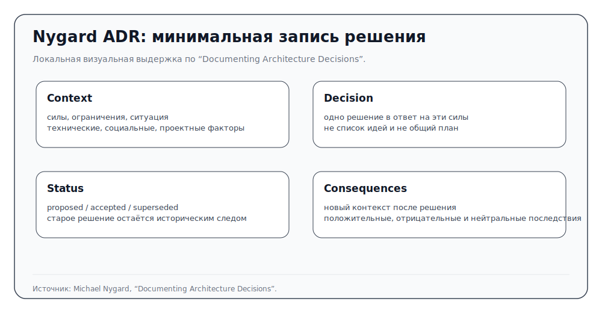
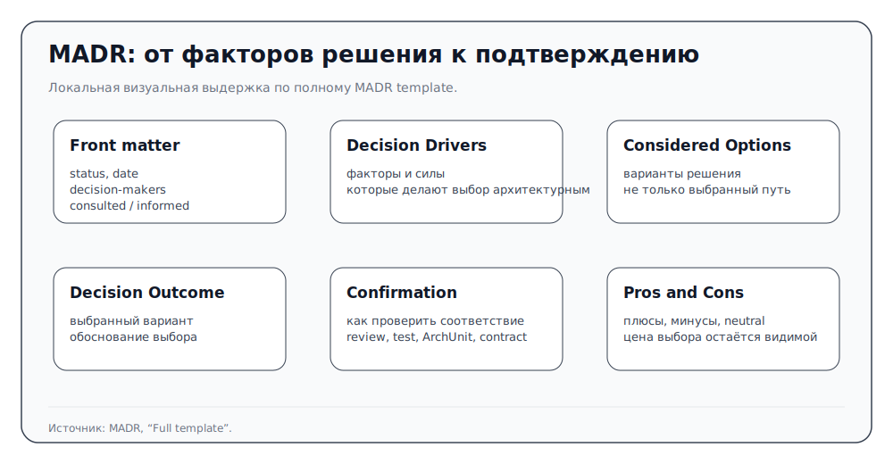
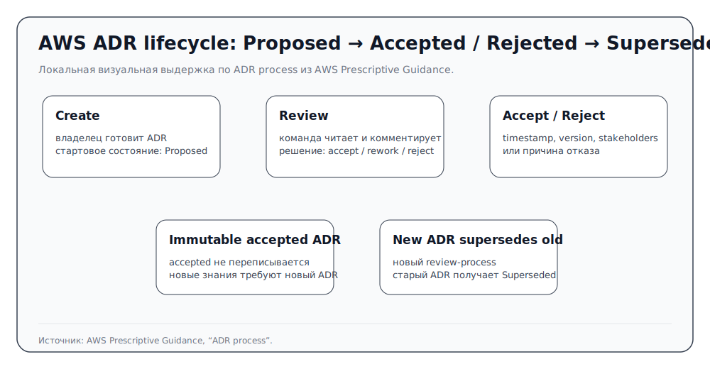
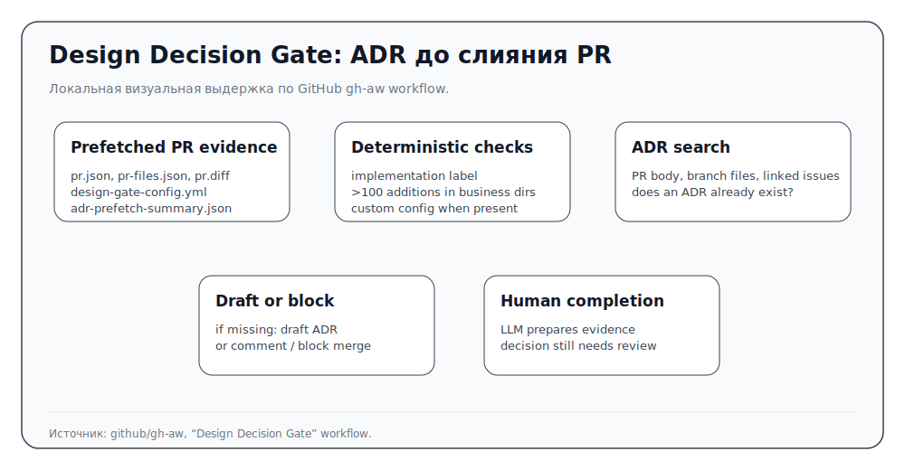

# ADR как метод архитектурной памяти

ADR нужен не для того, чтобы у команды появился ещё один Markdown-шаблон. Он нужен там, где агент, человек или команда меняют не только строку кода, а устойчивое устройство системы: границу модуля, способ интеграции, модель данных, стратегию развёртывания, требования к совместимости, ответственность владельцев или правило, по которому будущие изменения будут приниматься или отклоняться. В такой точке важно сохранить не только итоговый выбор, но и контекст, альтернативы, последствия, статус и условия замены.

В агентской разработке эта функция становится практической. Модель может прочитать старый документ как безусловную инструкцию, вывести недостающие ограничения из соседних файлов, восстановить “очевидную” архитектуру из diff и случайно придать временному плану статус принятого решения. ADR вводит отдельный носитель архитектурной памяти: не спецификацию изменения, не тест и не комментарий в ревью, а запись о решении, которое уже принято, ещё обсуждается, было отклонено или заменено.

Эта статья отвечает на вопрос: **как использовать ADR как метод архитектурной памяти в AI-driven SDLC, не превращая его ни в бюрократический журнал, ни в фиктивно исполнимый закон для агента**.


## Как читать эту статью

Статью лучше читать как маршрут от события архитектурного выбора к его проверяемым последствиям. Внутри есть несколько слоёв: классические ADR-источники, исследования AI/ADR, подтверждение решения, правила для агента, реконструированные ADR и типичные сбои. Они собраны вокруг одного вопроса: как сохранить причину решения так, чтобы будущая работа могла отличить действующее правило от черновика, устаревшей записи или непроверенного предположения.

Сначала статья вводит ADR как запись решения: что записывается, почему статус важен и как решение заменяется. Затем она отделяет ADR от соседних артефактов. Спецификация удерживает намерение изменения. Проверочный контракт делает ошибку видимой. PWG хранит состояние работы. ADR сохраняет причину, статус и последствия архитектурного выбора. После этого статья раскрывает `Confirmation`: какие части решения можно связать с проверками, ревью и операционными сигналами. Только затем появляется вопрос практической работы агента с ADR: как полный документ превращается в короткое правило, `skill`, hook, resolver или PR-gate. В конце идут особые режимы: неявная архитектура после работы агента, сгенерированный или реконструированный ADR, типичные сбои и практическая проверка внедрения.

Если читателю нужно быстро применить материал, можно идти так:

```text
1. Есть ли архитектурный порог?              → раздел “Когда ADR нужен”
2. Какой статус у решения?                   → раздел “Статус...”
3. Нужно ли заменить старый ADR?             → раздел “Жизненный цикл...”
4. Чем подтвердить решение?                  → раздел “Confirmation...”
5. Что дать агенту в активный контекст?      → разделы “Операционная проекция” и “Как агент работает с ADR”
6. Не сделал ли агент архитектуру без ADR?   → раздел “Когда агент уже изменил архитектуру...”
7. Можно ли доверять сгенерированному или реконструированному ADR? → разделы “Исследования AI/ADR” и “Реконструированный ADR”
```

Этот маршрут удерживает границу статьи: она не должна становиться справкой по всем инструментам проверки или каталогом ADR-шаблонов. Инструменты появляются только там, где помогают понять жизненный цикл решения. Рабочая дуга здесь одна: сначала определить статус решения, затем прочитать его обоснование, отвергнутые альтернативы и последствия, после этого связать решение с подтверждением, при изменении контекста заменить его новым ADR и отдельно проверить, не получил ли агент больше прав, чем даёт запись.

## ADR как память решения и связка с подтверждением

Архитектурное решение меняет допустимые варианты дальнейшей работы. После него команда иначе выбирает зависимости, границы модулей, способ развёртывания, API-политику, владение или эксплуатационный бюджет. Код показывает результат такого выбора, но обычно плохо показывает момент принятия решения: какие силы действовали, какие варианты были отвергнуты, кто согласился на последствия и при каких условиях решение нужно пересмотреть.

ADR сохраняет именно этот момент. Он полезен не потому, что добавляет ещё один файл в репозиторий, а потому что делает событие решения доступным будущему читателю. Новый разработчик, ревьюер или агент видит не только “здесь используется очередь”, а более точную запись: почему очередь была выбрана, какой статус у решения, какие последствия команда приняла и что должно произойти, если контекст изменится. В агентской разработке эта память особенно важна: модель легко выводит правило из текущего кода и затем применяет его как будто оно было явно принято.

Вторая работа ADR — связать решение с подтверждением. Архитектурное решение редко можно доказать одной проверкой. Зато можно назвать свидетельства, которые поддерживают отдельные части решения: правило зависимостей, проверку контракта, ревью владельца, SLO-политику, метрику развёртывания, проверку правила оповещения или ручной архитектурный разбор. Хороший ADR честно говорит, что именно подтверждает каждый сигнал и чего он не доказывает. Тогда агент может запускать нужную проверку, но не получает ложного права объявить весь архитектурный риск закрытым.

Эта связка делает ADR рабочим артефактом, а не архивной заметкой. Полная запись остаётся местом, где живёт обоснование и статус. Проверки и правила становятся производными от решения. Если решение меняется, обновляется не старый текст задним числом, а связь между старым и новым ADR, а вместе с ней — короткие правила для агента, проверки и маршруты ревью.

## Границы статьи

В атласе ADR рассматривается как самостоятельный методический объект, а не как справка о Markdown-шаблонах. Он не занимает место таких крупных рамок, как SPDD, Persistent Work Graph или Gas Town, но его нужно объяснять отдельно: ADR удерживает статус, происхождение, подтверждение и замену решений, которые влияют на долгую форму системы.

Главный вопрос статьи можно сформулировать так: **когда агентская команда должна вынести архитектурный выбор в ADR, какой статус должна иметь такая запись, чем её можно частично подтвердить и как не дать агенту превратить ADR в вечное правило или задним числом переписанную историю?**

Границы статьи такие:

- это не каталог ADR-шаблонов; Nygard, Fowler, MADR, AWS и `adr-tools` нужны как опоры для метода, а не как список вариантов оформления;
- это не статья о Spec Kit, Constitutional SDD или TDAD: соседние статьи атласа объясняют спецификационные и тестовые режимы, а здесь важна память архитектурного решения;
- это не статья о Persistent Work Graph: рабочий граф может хранить состояние `proposed` ADR, шаг ревью, сбой `Confirmation` и замену решения, но сам механизм графа объясняется отдельно;
- это не общий обзор управления: владельцы, `CODEOWNERS`, branch protection и правила ревью появляются только там, где помогают понять статус решения и подтверждение;
- это не повтор общей теории атласа: теория разводит классы артефактов и режимы работы, а эта статья показывает ADR как самостоятельный концептуальный объект.

Связь с общей теорией задаёт две практические границы. Статья должна читаться сама по себе и может контролируемо повторять тезисы теории, если без них ADR не будет понятен как концепция. ADR появляется тогда, когда разговор, план или спецификация уже недостаточны: решение становится долговременной памятью, которую нужно читать по статусу, связывать с проверками и заменять явным новым решением.


## Что именно записывает ADR

Классическая форма ADR у Michael Nygard появилась как ответ на слабость тяжёлой архитектурной документации в проектах, где решения принимаются не только в начале. Его минимальная запись помещается рядом с кодом, обычно в `doc/arch/adr-NNN.md`, получает последовательный номер и описывает одно архитектурно значимое решение: контекст, само решение, статус и последствия ([Nygard, “Documenting Architecture Decisions”](https://cognitect.com/blog/2011/11/15/documenting-architecture-decisions)).

Минимальный контракт выглядит просто:

```text
Title
Context
Decision
Status
Consequences
```

Эта простота обманчива. `Context` не является вступлением “для красоты”: он описывает силы, которые действовали на команду, включая технические, социальные и организационные ограничения. `Decision` фиксирует выбор, а не список идей. `Status` отделяет предложение от принятого решения и сохраняет историю замены. `Consequences` показывает новый контекст, который решение создаёт для будущей работы.


У Nygard важны ещё две маленькие детали. Во-первых, номера ADR монотонны и не переиспользуются: старый номер остаётся следом истории, даже если решение заменено. Во-вторых, стиль записи должен напоминать разговор с будущим разработчиком, а не юридический документ; Nygard прямо рекомендует одну-две страницы и связные предложения вместо таблицы ради таблицы ([Nygard](https://cognitect.com/blog/2011/11/15/documenting-architecture-decisions)). Для агента это полезная мера качества: если запись невозможно прочитать как объяснение будущему сопровождающему, модель будет видеть только поля шаблона и начнёт заполнять их правдоподобной прозой.

<figure class="image-asset" id="fig-adr-nygard-minimal-record" data-asset-status="local_source_excerpt_asset" data-repo-path="content/assets/atlas-images/adr/adr-nygard-minimal-record.svg">
  
  <figcaption>Локальная визуальная выдержка по статье Michael Nygard показывает минимальную форму ADR: `Context`, `Decision`, `Status` и `Consequences`. Здесь она нужна не как декоративная схема, а как напоминание, что ADR держит одно решение вместе с причинами, статусом и последствиями.</figcaption>
</figure>


Martin Fowler описывает ADR как короткую запись одного важного решения и подчёркивает дисциплину замены: принятое решение не нужно переписывать задним числом, его нужно связать с новым ADR, который его заменяет ([Fowler, “Architecture Decision Record”](https://martinfowler.com/bliki/ArchitectureDecisionRecord.html)). Для агентской работы это критично. Если модель “улучшает” старый ADR на месте, она стирает временную трассу: какое решение управляло кодом, в какой момент оно перестало быть верным и почему команда решила его заменить.


Fowler также полезен не только статусами. Он рекомендует писать ADR так, чтобы главное было видно в начале: решение, существенный контекст и последствия, а подробности и дополнительное обсуждение уходили ниже или в ссылки. Для решений вокруг кода он считает удобным хранить записи рядом с кодовой базой, часто в `doc/adr`, потому что тогда ADR участвует в diff и ревью. Для решений, затрагивающих людей вне репозитория, хранения только внутри репозитория может быть недостаточно ([Fowler](https://martinfowler.com/bliki/ArchitectureDecisionRecord.html)). Это задаёт практическую границу: ADR — не всегда только файл в репозитории; место хранения должно соответствовать тому, кто должен читать и оспаривать решение.

Более структурированная форма MADR расширяет минимальный шаблон: добавляет факторы решения, рассмотренные варианты, плюсы и минусы, результат, подтверждение, метаданные и категории ([MADR](https://adr.github.io/madr/)). Поэтому MADR полезен не как “длинный ADR”, а как форма для решений, где важно явно показать альтернативы, критерии и способ проверки. В агентском процессе разница между минимальной записью и MADR важна: короткая форма лучше для небольшого решения, которое нужно быстро удержать в репозитории; более полная форма нужна там, где агенту потом придётся проверять границы решения, варианты и условия пересмотра.


У MADR есть и практическая сторона посадки в репозиторий. Раздел Quick start предлагает держать решения в `docs/decisions`, копировать шаблон в файл вида `NNNN-title-with-dashes.md` и использовать markdownlint / GitHub workflow для единообразия Markdown ([MADR](https://adr.github.io/madr/)). Полный шаблон добавляет front matter с `status`, `date`, `decision-makers`, `consulted` и `informed`, а дальше ведёт читателя через `Context and Problem Statement`, `Decision Drivers`, `Considered Options`, `Decision Outcome`, `Consequences`, `Confirmation`, `Pros and Cons of the Options` и `More Information` ([MADR template](https://adr.github.io/madr/)). Для агента такие поля полезны, потому что дают именованные места для альтернатив, факторов и подтверждения. Но они же создают риск: модель может заполнить поле “решение принято такими-то людьми” или “команда согласна”, хотя источники этого не доказывают.

<figure class="image-asset" id="fig-adr-madr-template-confirmation" data-asset-status="local_source_excerpt_asset" data-repo-path="content/assets/atlas-images/adr/adr-madr-template-confirmation.svg">
  
  <figcaption>Локальная визуальная выдержка по полному MADR template показывает, где в структурированном ADR появляются факторы решения, рассмотренные варианты, результат, подтверждение и цена выбора. Это помогает читать MADR не как длинный шаблон, а как форму для решений, где альтернативы и проверка действительно важны.</figcaption>
</figure>


В крупных проектах MADR допускает категории и поддиректории, например для backend- и UI-решений ([MADR](https://adr.github.io/madr/)). Для поиска релевантных ADR это важно: сотни ADR без категорий превращаются в шум. Но категоризация сама становится архитектурным решением. Сквозные темы вроде безопасности, наблюдаемости, данных или владения могут не принадлежать одному каталогу, поэтому агенту нужны не только директории, но и ссылки между решениями, статусы, теги и связи `superseded by`.

## Архитектурное решение шире, чем файл

ADR-файл — это запись. Архитектурное решение — более широкий объект. Оно может быть подготовлено в спецификации, обсуждено в issue, подтверждено тестом, отражено в `CODEOWNERS`, зафиксировано в политике развёртывания и частично проверено в CI. Но ни один из этих соседних артефактов не заменяет саму память решения.

В этом месте часто возникают три подмены.

Первая подмена: спецификацию принимают за ADR. Спецификация говорит, какое изменение нужно сделать, что не трогать и какие требования обязательны. Она может содержать архитектурные варианты, но она не должна незаметно становиться принятым решением. Если `design.md`, REASONS Canvas, план Spec Kit или другой файл описывает новую долговременную границу системы, это должно быть вынесено в явное решение, а не остаться временной инструкцией для агента.

Вторая подмена: тест или контракт принимают за объяснение архитектуры. Проверка совместимости API, контрактный тест, smoke-маршрут, нагрузочный порог или статическое правило зависимостей показывают, что определённая граница не нарушена. Они не объясняют, почему команда выбрала именно такую границу. Зелёная проверка — это свидетельство в своей области, а не архитектурная память.

Третья подмена: ADR принимают за право действовать. Принятый ADR может дать агенту правило: не нарушать слой, не менять протокол без миграции, не обходить выбранный механизм хранения. Но право признать изменение завершённым остаётся у владельцев, ревьюеров, проверок и процесса принятия. ADR фиксирует решение и условия применения; он не снимает ответственность за конкретный diff.

## Статус как защита от слепого применения

Раздел `Status` — не декоративная строка. Он говорит агенту и человеку, можно ли использовать запись как действующее правило. В минимальной традиции Nygard встречаются `proposed`, `accepted`, `deprecated`, `superseded` с указанием заменяющего решения ([Nygard](https://cognitect.com/blog/2011/11/15/documenting-architecture-decisions)). Fowler удерживает ту же идею через `proposed`, `accepted` и `superseded`: старое решение сохраняется, но связывается с новым ([Fowler](https://martinfowler.com/bliki/ArchitectureDecisionRecord.html)).


Практически это означает, что статус должен быть проверяемым перед применением. Например, репозиторий WA Government ADR содержит отдельный `Decision Finder`, который помогает найти решение и проверить его по статусу, дате ревью и пригодности перед применением ([WA Government Decision Finder](https://github.com/wagov-dtt/architecture-decision-records/blob/main/decision-finder.md)). Для агента это не UI-деталь, а рабочая граница: он должен сначала понять, какую запись применяет, действует ли она, не истёк ли срок пересмотра и не существует ли замена.

Для AI-driven SDLC статус должен быть читаемым машиной и понятным человеку. Агенту нельзя давать полный каталог ADR как плоский набор правил. Ему нужно различать:

- `Proposed`: решение обсуждается, его нельзя применять как обязательное правило без ревью;
- `Accepted`: решение действует в указанной области;
- `Superseded`: решение исторически важно, но его заменяет другой ADR;
- `Deprecated` или аналогичный статус: решение больше не рекомендуется, но может объяснять существующий код;
- `Rejected`: вариант был рассмотрен и отклонён, поэтому агент не должен повторно предлагать его как новую идею без нового контекста;
- `Reconstructed`: происхождение записи, а не статус решения; такая запись восстановлена из кода, истории или обсуждений и требует отдельного подтверждения.

Последний пункт особенно важен для старых систем. Реконструированный ADR может помочь понять, почему код устроен так, как устроен, но он не должен притворяться исторически принятой записью. Лучше отделить `status` от `origin`: например, `status: proposed` или `accepted`, а рядом `origin: reconstructed`. Тогда читатель видит, действует ли решение сейчас, и понимает, как появилась запись.

## Жизненный цикл: создать, принять, заменить

ADR работает только как журнал, если жизненный цикл записи не размыт. `adr-tools` показывает простую командную форму этой дисциплины: `adr init`, `adr new`, а также создание нового ADR, который заменяет предыдущий через опцию `-s`; прежняя запись получает связь с заменяющим решением ([npryce/adr-tools](https://github.com/npryce/adr-tools)). Ценность здесь не в конкретной утилите, а в явном переходе состояния: создать запись, присвоить номер, связать с предыдущим решением, не переиспользовать номера и не редактировать прошлое так, будто оно всегда было другим.


Команды вроде `adr new Implement as Unix shell scripts` или `adr new -s 9 Use Rust for performance-critical functionality` важны как техническая опора семантики замены: замена — это не свободное редактирование старого текста, а новое решение с изменением статуса прежней записи ([npryce/adr-tools](https://github.com/npryce/adr-tools)). Если такую операцию выполняет агент, она должна попадать в diff как отдельное архитектурное действие, а не прятаться внутри большого PR.

AWS Prescriptive Guidance описывает ADR как процесс с владельцем, чтением, ревью и статусами. ADR со статусом `Proposed` читается командой, обсуждается и затем принимается, отклоняется или возвращается на доработку; `accepted` ADR получает временную метку, версию и список заинтересованных участников, а принятые записи считаются неизменяемыми. Если появляются новые сведения, создаётся новый ADR, который после принятия заменяет старый ([AWS ADR process](https://docs.aws.amazon.com/prescriptive-guidance/latest/architectural-decision-records/adr-process.html)).

<figure class="image-asset" id="fig-adr-aws-lifecycle-process" data-asset-status="local_source_excerpt_asset" data-repo-path="content/assets/atlas-images/adr/adr-aws-lifecycle-process.svg">
  
  <figcaption>Локальная визуальная выдержка по AWS ADR process показывает жизненный цикл записи: `Proposed`, review, принятие или отклонение, неизменяемость принятого ADR и замену через новый ADR. Для агентского процесса важна именно эта дисциплина состояния, а не наличие ещё одного Markdown-файла.</figcaption>
</figure>


Для агента это означает: изменение архитектурной памяти не должно быть обычной правкой текста. Если в ходе задачи выяснилось, что старый ADR больше не подходит, нормальный рабочий ход такой:

1. агент фиксирует конфликт с существующим ADR;
2. готовит `proposed` ADR или комментарий с альтернативами и последствиями;
3. человек или команда принимает решение;
4. новая запись явно заменяет старую;
5. операционные правила, проверки и короткие инструкции для агента обновляются как производные от нового статуса.

Если пропустить этот порядок, агент может “починить” архитектурную память так же легко, как чинит README. Для архитектуры это опасно: история решения становится недостоверной.

## `Confirmation`: не один тест, а план подтверждения

MADR включает раздел `Confirmation`, и в агентской разработке он становится одним из самых полезных полей ([MADR](https://adr.github.io/madr/)). Но `Confirmation` нельзя читать как “напиши тест”. Архитектурное решение часто подтверждается несколькими разными сигналами: структурным правилом, проверкой совместимости, владельческим ревью, метрикой в рабочей среде, политикой развёртывания или ручным архитектурным разбором.

Пример структурного подтверждения — ArchUnit. Его правила позволяют проверять зависимости между пакетами и слоями, описывать ограничения на уровне классов, использовать PlantUML-диаграмму как правило и замораживать старые нарушения через `FreezingArchRule`, чтобы новый код не увеличивал долг ([ArchUnit User Guide](https://www.archunit.org/userguide/html/000_Index.html)). Такая проверка полезна для ADR о слоистой архитектуре, границах модулей или запрете зависимости. Но она доказывает только проверяемую часть решения. Она не доказывает, что решение было хорошим, что оно покрывает все случаи или что его последствия приняты владельцами.

За пределами Java похожую роль могут играть NetArchTest для .NET, Import Linter для Python, dependency-cruiser и Nx для JavaScript/TypeScript и монорепозиториев, Conftest или Open Policy Agent для структурированной конфигурации и политик ([NetArchTest](https://github.com/BenMorris/NetArchTest), [Import Linter](https://import-linter.readthedocs.io/en/stable/), [dependency-cruiser rules reference](https://github.com/sverweij/dependency-cruiser/blob/main/doc/rules-reference.md), [Nx Enforce Module Boundaries](https://nx.dev/docs/features/enforce-module-boundaries), [Conftest](https://www.conftest.dev/), [Open Policy Agent](https://www.openpolicyagent.org/docs)). Здесь важна не коллекция инструментов, а тип связи: ADR говорит, почему граница нужна; проверка показывает, что конкретная часть этой границы не нарушена.

Другой тип подтверждения — владельческое ревью. `CODEOWNERS` может автоматически запрашивать ревью у людей или команд, отвечающих за файлы, а branch protection может требовать подтверждение от code owner перед слиянием ([GitHub Docs: About code owners](https://docs.github.com/en/repositories/managing-your-repositorys-settings-and-features/customizing-your-repository/about-code-owners)). Но code owner не равен владельцу всего архитектурного риска. Он помогает маршрутизировать ревью; он не заменяет обсуждение компромисса, влияния на продукт, эксплуатационной цены и условий замены.


Практические детали здесь важны. GitHub ищет `CODEOWNERS` в `.github/`, корне или `docs/`, использует версию файла из базовой ветки, требует, чтобы указанные владельцы имели write access, применяет последнее совпавшее правило и поддерживает обязательное code-owner review через branch protection ([GitHub Docs: About code owners](https://docs.github.com/en/repositories/managing-your-repositorys-settings-and-features/customizing-your-repository/about-code-owners)). Поэтому ADR, который опирается на подтверждение владения, должен говорить не “проверят владельцы”, а какой путь, правило или шаг ревью должен сработать и кто защищает сам файл владельцев.

Для ADR о совместимости API подтверждение может включать два разных горизонта. `oasdiff` показывает breaking changes в OpenAPI-описании ([oasdiff](https://github.com/oasdiff/oasdiff)). Pact и `can-i-deploy` проверяют совместимость известных consumer/provider-версий через Pact Matrix и возвращают машинно читаемый результат развертывания ([Pact documentation](https://docs.pact.io/), [Pact can-i-deploy](https://docs.pact.io/pact_broker/can_i_deploy)). Один горизонт не заменяет другой: спецификация может быть чистой, но реальные потребители ещё не готовы; потребители могут проходить контрактные тесты, но публичная схема уже содержит нежелательную ломку.

<figure data-asset-status="external-real-candidate" id="fig-adr-pact-can-i-deploy">
  <figcaption><strong>Реальный внешний кандидат.</strong> Фрагмент Pact Broker `can-i-deploy`: вывод команды или матрица, где совместимость развёртывания выводится из проверенных consumer/provider-версий. Нужен как пример скриншота исполняемой проверки для ограниченной части `Confirmation`, а не как доказательство всего ADR. Источник для прохода по изображениям: [Pact — “Can I Deploy?”](https://docs.pact.io/pact_broker/can_i_deploy).</figcaption>
</figure>


Для ADR о производительности или эксплуатационной устойчивости подтверждение может включать пороги k6, SLO-документ, правила оповещения Prometheus, тесты правил оповещения, Argo Rollouts AnalysisTemplate, Flagger или флаги OpenFeature ([пороги k6](https://grafana.com/docs/k6/latest/using-k6/thresholds/), [Google SRE Workbook: Implementing SLOs](https://sre.google/workbook/implementing-slos/), [правила оповещения Prometheus](https://prometheus.io/docs/prometheus/latest/configuration/alerting_rules/), [Prometheus unit testing rules](https://prometheus.io/docs/prometheus/latest/configuration/unit_testing_rules/), [Argo Rollouts Analysis](https://argo-rollouts.readthedocs.io/en/stable/features/analysis/), [Flagger](https://github.com/fluxcd/flagger), [OpenFeature](https://openfeature.dev/docs/reference/concepts/intro/)). Но и здесь сигнал ограничен: метрика на canary-трафике не доказывает всю архитектуру, а только показывает, что заранее выбранные условия продолжения или остановки выполнены в данном постепенном развёртывании.

Удобно держать шесть уровней подтверждения и не путать их между собой.

1. **Текстовое ревью.** Человек читает ADR, PR и объяснение. Это нужно почти всегда, но это самый слабый уровень свидетельства.
2. **Структурная проверка.** ArchUnit, Import Linter, dependency-cruiser, Nx или OPA проверяют машинно выражаемую часть решения: слой, направление зависимости, запрещённый путь и входные данные политики.
3. **Владельческая проверка.** `CODEOWNERS`, branch protection и правила ревью направляют изменение к людям, которые могут принять или отклонить риск.
4. **Совместимость интерфейса.** `oasdiff breaking`, Pact verification и `pact-broker can-i-deploy` проверяют, можно ли менять границу API/schema/consumer-provider.
5. **Эксплуатационный бюджет.** пороги k6, SLO/SLI/error budget, правила оповещения Prometheus и тесты правил проверяют измеримую часть решения о задержке, надёжности и стоимости.
6. **Постепенное развёртывание.** Argo Rollouts `AnalysisTemplate`, Flagger и feature flags проверяют решение на ограниченном трафике и связывают метрику с продолжением, паузой или откатом.

Каждый уровень является проекцией `Confirmation`, а не заменой ADR. Если ADR говорит “используем границу ports/adapters”, ArchUnit может упасть при новой запрещённой зависимости. Но причина границы, отвергнутые варианты и цена решения остаются в ADR. Если ADR говорит “публичный API совместим в пределах major version”, `oasdiff breaking` и Pact Matrix дают разные подтверждения, но ни один из них не говорит, что выбранная архитектура API была правильной. Если ADR говорит “новый путь checkout включается через canary”, Argo Rollouts показывает, когда продолжить или остановить rollout, но не заменяет решение о допустимом риске.

Технические опоры лучше записывать прямо в ADR или рядом с ним:

```yaml
confirmation:
  structural:
    command: ./gradlew architectureTest
    artifact: ArchUnit rule for package boundaries
    proves: new code does not add forbidden service-to-adapter dependency
  ownership:
    file: .github/CODEOWNERS
    required_review: platform-architecture
    proves: responsible reviewers were asked before merge
  api_compatibility:
    commands:
      - oasdiff breaking openapi-before.yaml openapi-after.yaml
      - pact-broker can-i-deploy --pacticipant Billing --version $GIT_SHA --to-environment production
    proves: documented API diff and known consumer/provider matrix are acceptable
  operations:
    k6_threshold: http_req_duration p(95)<200 under named profile
    slo_policy: checkout availability SLO and error-budget response
    rollout: Argo Rollouts AnalysisTemplate success-rate >= 0.95, failureLimit: 3
  does_not_prove:
    - that the whole architectural trade-off is still correct
    - that unregistered consumers or hidden operational dependencies are safe
    - that owners accepted a new architectural risk without review
```

Практически полезно записывать `Confirmation` как план подтверждения:

```text
Что подтверждаем: конкретная часть решения.
Чем подтверждаем: правило, тест, ревью, метрика, gate или ручная проверка.
Где это живёт: файл, команда, CI job, dashboard, CODEOWNERS, runbook.
Кто отвечает: человек, команда или роль.
Что считается отказом: какой сигнал останавливает работу или требует нового ADR.
Что не доказывается: границы свидетельства.
```

Такой формат помогает агенту: он знает, какую проверку запускать и где не переоценивать её результат.

## Операционная проекция: короткое правило для агента

Полный ADR часто слишком длинный для активного контекста агента. В реализации агенту может быть полезнее короткое правило: “модуль UI не импортирует persistence”, “публичный API нельзя менять без `oasdiff breaking` и проверки потребительского контракта”, “новая интеграция с внешним сервисом требует `proposed` ADR”, “использовать feature flag для постепенного развёртывания этого решения”.

Такая короткая форма — операционная проекция ADR. Она должна быть производной от полной записи, а не самостоятельным правилом без происхождения. В ней нужны:

- ссылка на полный ADR;
- действующий статус;
- область применения;
- короткое правило для агента;
- проверка или обязательный gate;
- владелец или маршрут ревью;
- условие истечения, пересмотра или замены.

Иначе правило отрывается от обоснования. Агент продолжает исполнять старый запрет после статуса `Superseded`, применяет его вне области действия или не понимает, что предложенное изменение требует нового решения. В этом смысле ADR должен иметь две формы чтения: полное обоснование для людей и короткое проверяемое правило для инструмента.

Vercel `adr-skill`, практики `/adr`-команд для Claude и cADR-подходы показывают, что ADR всё чаще рассматривают как материал, который агент может находить, создавать, обновлять или компилировать в рабочие ограничения ([Vercel `adr-skill`](https://github.com/vercel/ai/blob/main/skills/adr-skill/SKILL.md), [The ADR Pattern for Claude](https://7tonshark.com/posts/claude-adr-pattern/), [YotpoLtd/cADR](https://github.com/YotpoLtd/cADR/)). Но это не отменяет границу: агент может подготовить черновик, найти конфликт, собрать свидетельства или предложить новый ADR. Он не должен сам присваивать решению статус `Accepted`.


Здесь полезно учитывать ограничения файлов правил для агентов. Исследования `AGENTS.md` и контекста уровня репозитория показывают, что большой контекст не всегда улучшает выполнение задач и может повышать стоимость; для ADR это аргумент против полной выгрузки журнала решений в активный контекст ([Gloaguen et al. 2026](https://arxiv.org/abs/2602.11988)). Отдельные работы по guardrails для кодовых агентов также подчёркивают, что запретительные ограничения часто работают надёжнее, чем позитивные советы; для ADR это означает: короткая проекция должна формулировать проверяемый запрет или gate, а не общую рекомендацию “следовать архитектуре” ([Zhang et al. 2026](https://arxiv.org/abs/2604.11088)).

## Как агент работает с ADR

После статуса, жизненного цикла и `Confirmation` остаётся практический вопрос: где агент вообще встречает ADR во время работы. В источниках видно несколько несовпадающих, но полезных форм. Их не нужно читать как зрелый стандарт; они показывают, какие части ADR приходится выносить из человеческого документа в рабочий процесс, читаемый агентом.

Эти формы стоит оценивать не по названию инструмента, а по трём проверкам. Во-первых, выбирает ли форма только релевантные ADR с учётом `status`, `scope` и замены. Во-вторых, показывает ли она, какие проверки и ревью относятся к `Confirmation`. В-третьих, оставляет ли она человеческий переход для `accepted`, `rejected` или `superseded`, вместо того чтобы давать агенту право самому завершить решение. Если хотя бы одна проверка проваливается, перед нами не рабочий способ использовать ADR, а удобный способ раздать модели слишком широкий архив правил.

Один вариант — **индекс и команда чтения**. В схеме 7 ton shark ADR лежат маленькими файлами в `adr/`, а `CLAUDE.md` содержит не полный журнал, а краткий индекс и маршрут: slash-команда `/adr` заставляет Claude сначала прочитать релевантные записи, затем планировать изменение и при устаревании решения предложить новый ADR ([The ADR Pattern for Claude](https://7tonshark.com/posts/claude-adr-pattern/)). Это хорошо совпадает с правилом не загружать полный журнал ADR в активный контекст.

Другой вариант — **skill, который заставляет остановиться перед архитектурным порогом**. Vercel `adr-skill` называет ADR executable specifications for coding agents, но для практики это значит не “ADR стал кодом”, а “запись должна дать агенту достаточно контекста, чтобы корректно реализовать человеческое решение”. Skill вводит триггеры: новая зависимость, новый архитектурный паттерн, выбор между реальными альтернативами, конфликт с `accepted` ADR или длинный комментарий “почему”. Его `Phase 0` начинается до написания ADR: агент ищет существующие ADR, соглашения, файлы стека вроде `package.json`, `go.mod`, `requirements.txt`, `Cargo.toml`, затронутые паттерны и ссылки из кода на ADR ([Vercel `adr-skill`](https://github.com/vercel/ai/blob/main/skills/adr-skill/SKILL.md)). Это важная деталь: агентский ADR-процесс начинается не с шаблона, а с проверки уже существующей архитектурной памяти.

<figure data-asset-status="external-real-candidate" id="fig-adr-vercel-skill-phase0">
  <figcaption><strong>Реальный внешний кандидат.</strong> Фрагмент Vercel `adr-skill` вокруг philosophy и `Phase 0: Scan the Codebase`: существующие ADR, файлы стека, связанные паттерны кода и ссылки на ADR. Нужен как реальный фрагмент источника для тезиса, что агентский ADR-процесс начинается с чтения существующей архитектурной памяти. Источник для прохода по изображениям: [Vercel `adr-skill`](https://github.com/vercel/ai/blob/main/skills/adr-skill/SKILL.md).</figcaption>
</figure>


Третий вариант — **архитектурный diff по изменениям**. cADR анализирует staged/uncommitted changes или диапазоны commit и пытается создавать MADR-записи для архитектурно значимых изменений; его README также описывает использование как Vercel AI Agent Skill ([YotpoLtd/cADR](https://github.com/YotpoLtd/cADR/)). Такой подход полезен именно после запуска агента: он не спрашивает модель “что ты решила?”, а смотрит на diff и проверяет, появилось ли архитектурное решение. Риск тот же: сгенерированный ADR должен оставаться `proposed` или `reconstructed` до ревью.

Четвёртый вариант — **короткое правило, производное от полного ADR**. Angular Architects описывают `AGENTS.md` как короткий список запретов и ссылок, а `docs/architecture-boundaries.md` хранит архитектурные правила и ссылки на полные ADR. В ветке `ai-arc-adr` правила об общем коде и управлении состоянием помечены как производные от конкретных ADR, а детерминированный Stop-Hook запускает Sheriff, тесты и сборку ([Angular Architects](https://www.angulararchitects.io/blog/verlaessliche-angular-architekturen-mit-ai-assisted-coding/)). Это хороший пример нужной границы: полный ADR хранит обоснование; короткая проекция сообщает агенту, что нельзя делать сейчас; hook проверяет ту часть, которую можно проверить.

Пятый вариант — **разрешитель активного набора решений**. Mneme ADR compiler — артефакт проекта, а не универсальный стандарт, но он хорошо показывает недостающий слой: полные ADR остаются в `docs/adr/*.md`, необязательные разделы `## Constraints` содержат машинно читаемые директивы вроде `FORBID_DEPENDENCY`, `FORBID_PATH`, `REQUIRE_PATH`, компилятор собирает действующие решения в `project_memory.json`, а конфликты между `accepted` ADR с одинаковыми областью действия, приоритетом и датой останавливают генерацию, пока люди их не разберут ([Mneme ADR compiler](https://mnemehq.com/demo/adr-compiler/)). Для агента это лучше, чем выгрузка каталога: он получает набор решений, где учтены статус, замена и конфликтующие правила.

<figure data-asset-status="external-real-candidate" id="fig-adr-mneme-compiler-constraints">
  <figcaption><strong>Реальный внешний кандидат.</strong> Фрагмент Mneme ADR compiler: конвейер `Parse docs/adr/*.md → Validate → Resolve precedence + supersession → Emit project_memory.json → Enforce hook + CI`, а также ограничения вроде `FORBID_DEPENDENCY`, `FORBID_PATH`, `REQUIRE_PATH`. Нужен как реальный фрагмент источника для идеи resolver с учётом статуса вместо выгрузки всего каталога. Источник для прохода по изображениям: [Mneme — “The ADR compiler”](https://mnemehq.com/demo/adr-compiler/).</figcaption>
</figure>


Шестой вариант — **PR/CI-точка контроля с детерминированным порогом и LLM-помощью**. Публичный рабочий процесс `Design Decision Gate` в `github/gh-aw` готовит `pr.json`, `pr-files.json`, `pr.diff`, `.design-gate.yml` и краткую предварительную выборку ADR; он решает, нужен ли ADR, по детерминированным условиям вроде метки `implementation` или больше 100 добавленных строк бизнес-логики; затем ищет ссылки на ADR и при их отсутствии генерирует `draft` ADR и блокирующий комментарий для человеческого завершения перед слиянием ([GitHub `gh-aw` Design Decision Gate workflow](https://github.com/github/gh-aw/actions/runs/24966700524/agentic_workflow)). Полезен здесь порядок: сначала детерминированный триггер и сбор свидетельств, затем LLM-черновик, затем человеческое завершение перед слиянием.

<figure class="image-asset" id="fig-adr-design-decision-gate" data-asset-status="local_source_excerpt_asset" data-repo-path="content/assets/atlas-images/adr/adr-design-decision-gate.svg">
  
  <figcaption>Локальная визуальная выдержка по `Design Decision Gate` показывает порядок, который особенно важен для ADR в агентской разработке: сначала собираются PR-свидетельства и срабатывает детерминированный порог, затем появляется LLM-черновик, а завершение решения остаётся человеческим действием.</figcaption>
</figure>


Из этих примеров получается практическая цепочка:

```text
полный ADR
  → resolver или индекс с учётом статуса
  → короткая операционная проекция
  → контекст агента / skill / hook
  → детерминированные проверки там, где они возможны
  → LLM-triage только там, где нужны суждение или краткое изложение
  → человеческое решение для статуса `accepted` или `superseded`
```

Если убрать resolver, агент получает слишком много текста. Если выкинуть обратную ссылку на полный ADR, правило теряет обоснование. Если сделать LLM единственным gate, архитектурное решение превращается в правдоподобный комментарий. Если оставить только детерминированные проверки, система пропустит решения о владении, эксплуатации и компромиссах. Хороший способ работы агента с ADR держит все эти элементы раздельно.

## ADR в ходе агентской работы

До реализации ADR нужен там, где спецификация обнаруживает архитектурный выбор. Если задача требует новой зависимости, меняет публичную границу, вводит долговременное хранилище, меняет путь развёртывания, выбирает обмен сообщениями вместо синхронного вызова или переносит ответственность между командами, агент не должен просто продолжать реализацию. Он должен либо найти действующий ADR, либо подготовить `proposed` ADR и показать альтернативы.

Во время реализации ADR работает как контекст и ограничение. Агент читает действующие записи, но не весь исторический архив без статусов. Он должен видеть только релевантные решения и их короткие операционные проекции. Старые `superseded` записи нужны для объяснения кода и миграции, но не как активные правила.

Во время ревью ADR становится опорой для проверки. AWS прямо описывает ситуацию, где ревьюер видит нарушение принятого ADR и просит автора обновить код со ссылкой на запись ([AWS ADR process](https://docs.aws.amazon.com/prescriptive-guidance/latest/architectural-decision-records/adr-process.html)). В агентском рабочем процессе это можно усилить: PR может содержать ссылку на ADR, список затронутых решений, результаты проверок из `Confirmation` и указание, нужен ли новый `proposed` ADR.

После слияния ADR остаётся частью сопровождения. Если фактическая эксплуатация показывает, что решение неверно, если canary остановлен по архитектурной причине, если новая команда не может работать в выбранной границе или если компромисс между стоимостью и производительностью изменился, это не повод редактировать старую запись. Это повод создать новый ADR или пересмотреть статус через явную замену.

Практический механизм можно описать как короткую цепочку состояний. Сначала агент или человек обнаруживает архитектурный порог: изменение влияет на долговременную структуру, публичную границу, зависимость, развёртывание или владение. Затем система ищет действующие ADR по области применения и статусу, а не выгружает весь архив. Если подходящего решения нет, появляется `proposed` ADR с альтернативами, последствиями и происхождением записи. После этого владелец или команда принимает, отклоняет или возвращает запись на доработку. Только `accepted` ADR может стать источником короткого правила для агента, а проверки из `Confirmation` становятся способами проверить отдельные части решения.

В этой цепочке важно не пропустить обратный ход. Когда проверка падает, владелец не должен автоматически чинить код так, чтобы снова пройти gate. Иногда падение означает, что реализация нарушила принятое решение. Иногда оно показывает, что старое решение устарело. Иногда сама проверка слишком узкая или ошибочная. Поэтому сбой `Confirmation` должен вести к понятному состоянию: исправить diff, уточнить проверку, открыть `proposed` ADR на замену или передать вопрос владельцу. Без такого состояния ADR превращается в мёртвую ссылку или в неподконтрольный запрет.

## Когда агент уже изменил архитектуру без ADR

В агентской разработке ADR часто нужен не до, а после первого тревожного сигнала. Агент может выбрать фреймворк, способ хранения, путь оркестрации, интеграционный стиль или инфраструктурный каркас раньше, чем команда успеет назвать это архитектурным решением. Исследовательская линия `Architecture Without Architects` описывает именно этот риск: кодовые агенты формируют архитектуру через prompt и diff, а не только исполняют уже принятый проектный замысел ([Konrad et al. 2026](https://arxiv.org/abs/2604.04990)).

Из этого следует отдельный проход после существенного работы агента: проход архитектурного diff. Его задача — не искать любое крупное изменение, а найти архитектурно значимые изменения: новую долговременную зависимость, перенос ответственности, изменение публичного API, новую форму хранения состояния, обход существующей границы, новый путь развёртывания или путь среды выполнения или изменение владельческого контура. Для каждого такого изменения нужно решить, что остаётся обычным обоснованием в PR, что требует `proposed` ADR, а что конфликтует с `accepted` ADR.

Такой проход особенно полезен, когда исходная задача выглядела неархитектурной. Агент мог “просто” добавить кэш, “просто” выбрать очередь сообщений, “просто” изменить формат события или “просто” вынести модуль в общий пакет. Если это создаёт правило для будущих изменений, обычного PR-комментария мало. Нужна запись решения или явный отказ создавать ADR с объяснением, почему выбор локален и обратим.

## Исследования AI/ADR: черновик, контекст, нарушение и реконструкция

Исследования по LLM и ADR полезны только если не смешивать разные утверждения. Одно дело — может ли LLM сгенерировать черновик архитектурного решения. Другое — какой контекст ей нужен. Третье — можно ли найти нарушение существующего ADR. Четвёртое — можно ли восстановить архитектурную память из старой кодовой базы.


Для статьи важны не названия моделей, а границы автоматизации. Автоматически сгенерированный ADR-текст может быть полезным черновиком, но его статус остаётся `proposed` или `draft`, пока люди или установленный процесс не приняли решение. Реконструированный ADR может быть полезной гипотезой о старой системе, но его происхождение должно быть записано отдельно от статуса. Связи трассируемости могут помочь агенту понять, где решение воплощено, но только при наличии свидетельств: пути в коде, конфигурации, PR, commit, issue, сигнала работающей системы или заметки ревью. Без этого связь начинает вводить модель в заблуждение.

Работы Dhar, Vaidhyanathan и Varma исследуют генерацию Architectural Design Decisions с помощью LLM и затем показывают, что одного запроса недостаточно: качество зависит от процесса, контекста и проверки ([Dhar, Vaidhyanathan, Varma 2024](https://arxiv.org/abs/2403.01709), [Dhar et al. 2025](https://arxiv.org/abs/2504.08207)). Gupta et al. рассматривают выбор контекста для генерации ADR и показывают важный для практики принцип: агенту не всегда нужно загружать полный исторический архив, иногда лучше ограниченное окно релевантных недавних записей ([Gupta et al. 2026](https://arxiv.org/abs/2604.03826)). Nogueira, Silva и Conte сравнивают шаблоны ADR и показывают, что форма записи влияет на результат, поэтому выбор между Nygard и MADR не является чистой эстетикой ([Nogueira, Silva, Conte 2026](https://arxiv.org/abs/2604.27333)). Su et al. исследуют выявление нарушений ADR с помощью LLM; это полезный сигнал, но не автоматический вывод о нарушении решения ([Su et al. 2026](https://arxiv.org/abs/2602.07609)).

Для реконструкции архитектурной памяти отдельный слой дают исследования трассируемости и управления архитектурными знаниями. Работы по LLM-assisted traceability через распознавание архитектурных сущностей помогают сформулировать практическую границу: ADR полезен агенту только если можно связать решение с кодом, документацией, конфигурацией и свидетельствами ([Fuchß et al. 2025/2026](https://arxiv.org/abs/2511.02434)). AgenticAKM показывает агентский конвейер восстановления ADR из репозитория: резюме, проверка, генерация и повторная проверка, а не один запрос с ожиданием готового решения ([Dhar, Vaidhyanathan, Varma 2026](https://arxiv.org/abs/2602.04445), [AgenticAKM repository](https://github.com/sa4s-serc/AgenticAKM)).


Практические выводы из этих работ можно превратить в три правила.

Первое правило: генерация ADR должна учитывать поиск релевантных записей. В DRAFT-подходе черновик улучшался не потому, что модель получила красивую инструкцию, а потому что процесс искал релевантные ADR, использовал примеры и проходил отдельные offline/online-фазы на корпусе из 4,911 ADR ([Dhar et al. 2025](https://arxiv.org/abs/2504.08207)). Значит, команда не должна просить агента “напиши ADR по этому diff” без поиска действующих и похожих решений.

Второе правило: контекст ADR нужно ограничивать по статусу, близости и назначению. Gupta et al. работали с последовательными ADR из 750 open-source репозиториев и сравнивали несколько стратегий подачи истории; для этой темы важен практический результат: небольшое окно из 3–5 недавних записей часто даёт лучший баланс качества и стоимости, чем полная выгрузка истории ([Gupta et al. 2026](https://arxiv.org/abs/2604.03826)). Для агента это означает: сначала действующие, недавние и релевантные ADR, затем целевой поиск для сквозных решений, а не полный журнал решений.

Третье правило: поиск нарушений ADR полезен как первичный разбор, но не должен сам становиться окончательным основанием для блокировки. Su et al. проверяли 980 ADR из 109 репозиториев и показывают, что LLM лучше работает с явными решениями, выводимыми из кода, и хуже с решениями, зависящими от развёртывания, конфигурации или организационного знания ([Su et al. 2026](https://arxiv.org/abs/2602.07609)). Поэтому LLM-ревьюер может поднять подозрение: “этот diff нарушает ADR-0012”. Но блокирующим свидетельством должны становиться более надёжные артефакты: структурное правило, упавшая контрактная проверка, владельческое ревью, политика развёртывания, метрика работающей системы или явное человеческое решение.

AgenticAKM показывает отдельный режим — восстановление архитектурной памяти из репозитория. Важно, что там не один запрос “найди ADR”, а цепочка агентов: суммаризация, проверка резюме, написание ADR и проверка ADR, с экспериментальными артефактами и сгенерированными примерами ADR ([AgenticAKM](https://arxiv.org/abs/2602.04445), [sa4s-serc/AgenticAKM](https://github.com/sa4s-serc/AgenticAKM)). Для реконструированного ADR это даёт хорошую практическую модель: конвейер может подготовить `proposed`-записи и карту свидетельств, но не превращает их в принятую историю.

Исследования трассируемости добавляют ещё один предохранитель. LLM-assisted architecture entity recognition может помочь связать архитектурные документы и код через извлечённые компоненты и архитектурные сущности ([Fuchß et al. 2025/2026](https://arxiv.org/abs/2511.02434)). Но связь “ADR → component” не должна быть просто красивой стрелкой. Агенту нужно знать, из какого файла, класса, конфигурации, теста, issue или артефакта развёртывания следует связь. Без этого карта трассируемости становится вторым источником галлюцинаций: модель начинает считать принятым архитектурным фактом то, что было лишь приблизительным сопоставлением.

Главный вывод такой: LLM может помогать ADR-процессу, но не должна получать роль органа принятия архитектурных решений. Она может найти кандидата на решение, подготовить черновик, предложить альтернативы, указать на конфликт, извлечь карту трассируемости и сформулировать `Confirmation`. Статус решения, принятие риска и замена действующего ADR остаются человеческим или организационным шагом принятия.


Поэтому в статье используется такая рабочая шкала:

```text
Сгенерированный AI ADR-текст → черновик, не статус решения
AI-реконструированный ADR      → гипотеза с origin/evidence/confidence, не историческое доказательство
LLM-поиск нарушений ADR       → первичный сигнал, не основание для автоматической блокировки
Карта трассируемости          → кандидатные связи, пока нет свидетельств и проверки
ADR со статусом `accepted`    → результат принятия, ревью и явного статуса
```

## Реконструированный ADR

В старой системе часто нет исторического ADR, хотя архитектурные решения уже воплощены в коде. В таком случае полезен реконструированный ADR: запись, которая восстанавливает вероятное решение из кода, истории commit, документации, конфигурации, issue и эксплуатационных следов.

Реконструированный ADR должен быть честным по происхождению. Он не говорит: “так команда решила в прошлом”, если источники этого не доказывают. Он говорит: “из этих свидетельств видно, что система сейчас устроена так, а вот вероятные силы и последствия”. Microsoft Learn описывает brownfield/retroactive ADR как способ поддерживать архитектурную память в существующей системе и сохранять журнал в добавочном режиме ([Microsoft Learn: Maintain an architecture decision record](https://learn.microsoft.com/en-us/azure/well-architected/architect-role/architecture-decision-record)). Исследовательская линия architectural reconstruction также описывает восстановление недостающих архитектурных решений как отдельную проблему, а не как обычную запись текущей воли команды ([Belle et al. 2021](https://arxiv.org/abs/2112.01644)).

Для реконструированного ADR нужны дополнительные поля:

```yaml
origin: reconstructed
evidence:
  - code path / config / commit / issue / document
confidence: high | medium | low
missing_evidence:
  - что не удалось подтвердить
review_status: needs_architecture_review | reviewed | rejected
```

Такой ADR может стать входом для ревью и будущего `accepted` ADR. Но пока он не принят, агент должен обращаться с ним как с гипотезой, а не как с законом.

## Три рабочих примера

### 1. ADR о запрете новой зависимости

Ситуация: в старой Java-системе уже есть смешение domain- и adapter-слоёв, но команда решила не ухудшать границу. Хороший ADR не должен утверждать “архитектура чистая”. Он должен сказать: с этого момента новые зависимости из domain в adapter запрещены; старые нарушения временно признаны baseline; каждое новое нарушение останавливает PR.

Минимальная запись может выглядеть так:

```yaml
status: accepted
context: legacy code already contains layer violations
decision: do not add new domain -> adapter dependencies
confirmation:
  tool: ArchUnit FreezingArchRule
  proves: no new violations beyond frozen baseline
  does_not_prove: old architecture is clean
replacement_condition: when baseline is fully repaired, replace with stricter ADR
```

Здесь `FreezingArchRule` важен как механизм, привязанный к конкретному источнику: он позволяет сохранить текущие нарушения как управляемый baseline и сообщать только о новых нарушениях ([ArchUnit User Guide](https://www.archunit.org/userguide/html/000_Index.html)). Агент получает не абстрактное “соблюдай архитектуру”, а конкретное правило: не ухудшать известную границу.

### 2. ADR о совместимости публичного API

Ситуация: агент меняет billing API. Спецификация задачи говорит, что поведение должно остаться совместимым, но это не объясняет архитектурное решение: команда могла принять правило “в пределах major version публичный API не ломается без отдельного ADR”. Тогда `Confirmation` должен иметь два горизонта:

```yaml
confirmation:
  schema_diff:
    command: oasdiff breaking openapi-before.yaml openapi-after.yaml
    proves: OpenAPI spec has no classified breaking changes
  consumers:
    command: pact-broker can-i-deploy --pacticipant Billing --version $GIT_SHA --to-environment production
    proves: known consumer/provider matrix permits deployment
  does_not_prove:
    - all undocumented consumers are safe
    - semantic behavior outside examples is unchanged
```

Такой ADR объясняет не только проверку, но и правило: какие изменения требуют нового решения, кто принимает исключение и какие свидетельства достаточны для релиза. `oasdiff` и Pact остаются подтверждениями, а не памятью решения ([oasdiff](https://github.com/oasdiff/oasdiff), [Pact can-i-deploy](https://docs.pact.io/pact_broker/can_i_deploy)).

### 3. Реконструированный ADR после запуска агента

Ситуация: агент выполнил задачу миграции и добавил интеграцию через очередь, хотя исходная спецификация говорила только о “разнести обработку”. В проходе архитектурного diff команда видит, что это долговременный стиль интеграции. Нормальный результат не “агент принял архитектуру”. Нормальный результат:

```yaml
status: proposed
origin: reconstructed
evidence:
  - diff introduced queue client and worker process
  - service A stopped calling service B synchronously
  - deployment config added worker replica
confidence: medium
needs_review:
  - platform architecture
  - operations owner
confirmation_needed:
  - integration contract
  - rollout metric
  - failure handling runbook
```

Сгенерированные примеры в AgenticAKM полезны именно как примеры предложенной или реконструированной архитектурной памяти, а не как свидетельство, что сгенерированный ADR уже принят ([AgenticAKM generated ADR examples](https://github.com/sa4s-serc/AgenticAKM/tree/main/Generated_ADRs)). Это различие не даёт агенту превратить правдоподобную реконструкцию в недостоверную историческую запись.

В агентской системе эта граница должна сохраняться и после компиляции памяти. Если индекс, skill или LLM-validator отдаёт модели реконструированный ADR рядом с принятыми решениями, он обязан сохранить предупреждение: это кандидатная запись, а не правило проекта. Иначе удобная автоматизация делает слишком большой скачок — из «мы нашли следы такого решения» получается «команда это решила». Такой ADR может быть хорошим поводом для ревью, но не должен сам становиться источником архитектурной власти.

<figure data-asset-status="external-real-candidate" id="fig-adr-agenticakm-proposed-generated-adr">
  <figcaption><strong>Реальный внешний кандидат.</strong> Фрагмент AgenticAKM `Generated_ADRs` с `Status: Proposed` и рядом фрагмент pipeline/logs, если проход по изображениям подтвердит читаемость. Нужен для границы: generated/reconstructed ADR является кандидатной записью, пока не прошёл человеческое ревью. Источник для прохода по изображениям: [AgenticAKM generated ADR examples](https://github.com/sa4s-serc/AgenticAKM/tree/main/Generated_ADRs).</figcaption>
</figure>


## Когда ADR нужен, а когда нет

ADR не нужен для каждого технического выбора. Если изменение локально, легко обратимо, не меняет публичную границу, не создаёт долгосрочного правила и не влияет на важные нефункциональные характеристики, достаточно issue, спецификации, PR-описания и тестов. Избыточный ADR-процесс быстро превращается в шум, и агент начинает писать архитектурные записи там, где нужно было просто исправить баг.

ADR нужен, когда выполняется хотя бы одно условие:

- решение влияет на структуру системы, границы модулей, данные, протоколы, зависимости, развёртывание или владение;
- решение создаёт правило для будущих изменений;
- цена отмены решения заметна;
- решение меняет или закрепляет нефункциональное свойство: производительность, безопасность, отказоустойчивость, совместимость, наблюдаемость;
- есть серьёзные альтернативы, и важно сохранить, почему они отвергнуты;
- агент предлагает изменение, которое выглядит как архитектурный выбор, даже если исходная задача называла его “реализационной деталью”;
- существующий ADR конфликтует с предлагаемым diff.

Практическое правило: если будущий разработчик будет спрашивать “почему здесь так устроено?” и ответ нельзя восстановить из теста или кода без догадок, нужен ADR или хотя бы `proposed` ADR.

## ADR в жизненном цикле соседних артефактов

ADR лучше понимать через функцию в жизненном цикле, а не через соседство названий.

Адверсариальная проверка простая. Если документ отвечает на вопрос “что нужно построить и в каких шагах?”, это спецификационный слой. Если он отвечает “какая работа сейчас заблокирована, кто владеет gate и что уже выполнено?”, это рабочий граф. Если он отвечает “какая проверка обнаружит ошибку?”, это контракт, тест или oracle. ADR нужен для другого вопроса: почему архитектурный выбор принят или предложен, какой у него статус, какие последствия команда принимает и чем это решение будет заменено, если контекст изменится.

<figure data-asset-status="synthetic_figure" class="synthetic-figure" id="fig-adr-neighbor-artifact-boundaries">
  <figcaption><strong>Синтетическая схема.</strong> Граница ADR относительно соседних артефактов жизненного цикла.</figcaption>

| Артефакт | Главный вопрос | Что становится долговечным | Что он не заменяет |
| --- | --- | --- | --- |
| Спецификация | Что нужно изменить и в каких границах? | Намерение, требования, план и критерии приёмки. | Не объясняет, почему выбран архитектурный компромисс. |
| ADR | Почему принят или предложен именно этот архитектурный выбор? | Контекст, статус, последствия, подтверждение и замена решения. | Не является тестом, задачей или автоматическим правом на слияние. |
| Контракт / тест / oracle | Где ошибка становится видимой? | Проверяемый сигнал: пример, diff, правило, метрика или gate. | Не хранит причину архитектурного выбора. |
| Persistent Work Graph | В каком состоянии находится работа над решением? | `Proposed/review/blocked/failed-confirmation/supersession` как состояние процесса. | Не является самой памятью решения и не принимает риск. |

</figure>


Spec Kit и specification-first методы удерживают намерение изменения до кода: `Spec → Plan → Tasks → Implement`, требования, план и задачи. Они отвечают на вопрос “что строим, в каких границах и какими шагами?”. ADR появляется, когда внутри этой цепочки принято или предлагается долговременное архитектурное решение: новая граница, зависимость, способ хранения, API-правило или путь развёртывания. Спецификация может подготовить такое решение, но не должна молча становиться `accepted` ADR.

Constitutional SDD добавляет слой правил и ограничений проекта: constitution, compliance matrix, reference implementation и checkpoints. Его функция — удерживать принципы и ограничения, которым должны соответствовать будущие спецификации и реализации. ADR в этом жизненном цикле записывает конкретный архитектурный выбор внутри или рядом с конституционным слоем: почему выбран этот способ соответствовать правилу, какие альтернативы отвергнуты, как решение будет проверяться и когда его нужно заменить. Constitution может сказать “какое правило нельзя нарушать”; ADR говорит “какое архитектурное решение принято под этим правилом и какие последствия команда принимает”.

TDAD и проверочные контракты находятся ближе к оракулу поведения. Они делают ошибку видимой через тест, пример, контракт, критерий приёмки или evaluation harness. ADR может ссылаться на такой оракул в `Confirmation`, но тест не объясняет архитектурный выбор. Если тест упал, это может означать нарушение решения, устаревшее решение, неверный тест, изменившийся контекст или необходимость нового ADR. Сам факт падения не говорит, какое архитектурное решение теперь правильно.

Persistent Work Graph отвечает за долговечное состояние работы: что предложено, что заблокировано, кто владеет, какое gate-условие ждёт человека, какой источник прочитан, какой проход завершён. Для ADR это место состояния: `proposed` ADR ждёт ревью, сбой `Confirmation`, конфликт с `accepted` ADR, кандидат на замену решения, пробел по внешнему источнику. Но PWG не заменяет ADR. Он не хранит обоснование решения вместо записи; он делает видимым, на какой стадии жизненного цикла находится решение и кто должен выполнить следующий gate.

Эта граница защищает статью от трёх ошибок: спецификацию нельзя использовать как память решения; тест нельзя использовать как архитектурное объяснение; рабочий граф нельзя использовать как само решение. Все три могут ссылаться на ADR, порождать `proposed` ADR или блокировать работу до ревью ADR. Но `accepted`-решение и семантика замены должны оставаться явными.

## Типичные сбои

Эти сбои важны не как список “что бывает плохо”, а как признаки, что ADR перестал выполнять свою функцию в жизненном цикле решения.

**Мёртвая запись.** ADR существует в репозитории, но агент и ревьюеры не могут понять, действует ли он, к какой области относится и чем был заменён. Такой файл создаёт ложное чувство порядка: формально решение записано, но в рабочем процессе нет шага, который проверяет статус, scope, дату ревью и связь с новым ADR. Исправление начинается не с переписывания текста, а с восстановления связей жизненного цикла: статус, `superseded_by`, владелец, область применения и маршрут ревью.

**Пустой шаблон.** Команда заполняет поля, но не фиксирует реальный конфликт сил, альтернативы и последствия. Агент затем видит убедительный документ, который почти ничего не ограничивает. Хорошая проверка качества здесь простая: можно ли по записи понять, какой выбор больше нельзя делать без нового решения и какая цена была принята.

**Неподтверждённое убеждение.** В ADR записан правильный на вид выбор, но `Confirmation` отсутствует или сводится к общей фразе “покрыть тестами”. При реализации агент не знает, какую проверку запускать, какой результат считается отказом и кто принимает риск, если проверка не покрывает важную часть решения. Такой ADR нужно дополнять не количеством тестов, а картой свидетельств: какая команда, правило, шаг ревью, метрика или условие развёртывания подтверждает какую часть решения.

**Сгенерированная трассировка без происхождения.** Агентский конвейер строит карту “решение → компонент → файл”, но не показывает, из какого пути в коде, конфигурации, commit, issue, PR, log или заметки ревью следует связь. В результате агент начинает применять ADR к месту, где связь была только предположением. Каждая машинно созданная карта трассируемости должна хранить `evidence` и `confidence`; без них она остаётся гипотезой для ревью, а не основанием для автоматического принуждения.

**Видимость исполнимой проверки.** CI показывает зелёное правило ArchUnit, `oasdiff` не нашёл breaking changes, Pact Matrix разрешила развёртывание или canary-анализ прошёл порог. Это полезные сигналы, но они закрывают только выбранную проекцию решения. Они не доказывают, что архитектурный компромисс всё ещё верен, что владельцы приняли новый риск или что скрытые потребители и эксплуатационные зависимости безопасны. В `Confirmation` поэтому нужно писать не только `proves`, но и `does_not_prove`.

**Слепое редактирование прошлого.** Старую принятую запись правят задним числом вместо того, чтобы создать новый ADR. История решения исчезает, и агент больше не может понять, какое правило действовало во время старого diff. Для архитектуры безопаснее сохранить старую запись и явно связать её с заменяющей.

**Короткое правило без обратной ссылки.** В `AGENTS.md`, skill или hook остаётся запрет, но исчезают ссылка на ADR, статус, область действия и владелец. Агент выполняет правило, но команда больше не понимает, почему оно существует и когда его можно изменить.

**Code owner как владелец риска.** `CODEOWNERS` помогает направить ревью, но не означает, что указанный человек один принимает архитектурный риск, продуктовые последствия и эксплуатационную цену. Подтверждение владения должно указывать маршрут ревью, а не притворяться полным управленческим решением.

**Черновик как решение.** LLM сгенерировала красивый ADR с альтернативами и последствиями, но он не прошёл шаг ревью. Если такой текст попадает в `accepted`-контекст, агент получает ложное основание для будущих действий. Сгенерированный или реконструированный ADR должны начинаться как `proposed`, с явным `origin`, `evidence` и `confidence`.

## Минимальный практический контракт ADR для агента

Для агентского рабочего процесса полезен не большой стандарт, а минимальный контракт, который можно проверять:

```yaml
id: adr-0007
title: Use asynchronous events for order fulfilment
status: proposed | accepted | superseded | rejected
origin: human-authored | agent-drafted | reconstructed
scope:
  paths:
    - services/orders/**
    - services/fulfilment/**
  decisions:
    - integration_style
context: |
  Какие силы действуют и почему вопрос архитектурно значим.
decision: |
  Что именно принято или предлагается.
alternatives:
  - name: synchronous call
    why_not: ...
  - name: shared database
    why_not: ...
consequences:
  positive:
    - ...
  negative:
    - ...
confirmation:
  checks:
    - command: npm run depcruise
      proves: no forbidden dependency from UI to persistence
      does_not_prove: correctness of product flow
  reviews:
    - owner: platform-architecture
      required_when: public API or event schema changes
operational_projection:
  agent_rule: Do not add synchronous order-to-fulfilment calls without a new `proposed` ADR.
  source: adr-0007
  expires_or_reviews_on: 2026-12-01
supersedes: []
superseded_by: null
```

В реальном проекте формат может быть проще. Важно сохранить рабочие различия: статус, происхождение, область действия, само решение, последствия, подтверждение, короткое правило для агента и порядок замены.

Поля такого контракта работают не как равные ячейки шаблона. `status`, `supersedes` и `superseded_by` отвечают за применимость решения во времени. `context`, `alternatives` и `consequences` сохраняют причину выбора и цену отказа от других вариантов. `confirmation` связывает отдельные части решения с проверками и ревью, но не заменяет принятие риска владельцами. `operational_projection` даёт агенту короткое правило для текущей правки и одновременно ограничивает его: агент может сослаться на ADR, запросить новый `proposed` ADR или остановить изменение на gate, но не может сам объявить черновик действующим решением.

Такую форму не нужно навязывать каждому pull request. Она нужна там, где изменение проходит архитектурный порог: меняет долгую границу системы, способ интеграции, совместимость, развёртывание, владение или правило будущих правок. Для обычной локальной задачи достаточно issue, спецификации, теста или ревью. ADR подключается тогда, когда будущему агенту и человеку понадобится не только увидеть, что было изменено, но и понять, почему это решение действует, чем оно ограничено и как его заменить.

## Связь с общей теорией и соседними статьями атласа

В общей рамке AI-driven SDLC агент постоянно переносит сведения между issue, спецификацией, планом, кодом, тестами, pull request, рабочим графом и памятью репозитория. Ошибка начинается там, где один артефакт начинает отвечать за чужую работу. Спецификация превращается в якобы принятое архитектурное решение, зелёный тест начинает выглядеть как принятие риска, рабочий граф пытается заменить объяснение архитектуры, а старый ADR читается как вечный запрет без статуса и даты пересмотра.

ADR занимает в этой рамке узкую и полезную позицию. Он хранит событие архитектурного выбора: контекст, статус, происхождение, последствия, частичное подтверждение и порядок замены. Соседние методы отвечают за другие вопросы. Spec Kit и specification-first-процесс помогают сформулировать намерение изменения и разложить его на план. Constitutional SDD удерживает правила и ограничения проекта. TDAD, контрактные проверки и поведенческие оракулы показывают, где ошибка становится наблюдаемой. Persistent Work Graph хранит состояние работы: что предложено, что заблокировано, кто должен принять решение, какой gate ещё не пройден.

Из этого следует простой порядок для агентской платформы. В активный контекст агента должен попадать не весь архив ADR, а статусно отфильтрованная проекция: действующие решения для затронутой области, короткие правила, ссылка на полный ADR, нужные проверки и владелец ревью. `Proposed`, `reconstructed`, `rejected` и `superseded` записи полезны, но они должны приходить с пояснением роли. Кандидат не должен становиться правилом только потому, что он хорошо написан; заменённое решение не должно управлять новой правкой только потому, что файл всё ещё лежит в репозитории.

Так статья связана с различием между правом действовать и правом принять результат. Агент может найти архитектурный порог, подготовить diff, запустить `Confirmation`, обнаружить конфликт с действующим ADR и предложить новый текст. Признание решения действующим, замена старого ADR и принятие риска остаются отдельным переходом состояния. Этот переход должен быть видим в ревью, рабочем графе или другом process gate; последняя строка ответа агента не должна закрывать его сама.

Эта связка намеренно короткая. Подробная теория объясняет классы артефактов, режимы агентской работы и Persistent Work Graph отдельно. В этой статье связь нужна только для практического вопроса: какой артефакт является источником истины для решения, какой — для намерения, какой — для проверки, а какой — для состояния работы.

## Короткая проверка перед внедрением

Перед тем как вводить ADR в агентский процесс, стоит проверить шесть вещей.

Во-первых, есть ли у записи явный статус и порядок замены. Без этого агент не отличит действующее правило от исторического объяснения и не поймёт, когда старый ADR уже уступил место новому.

Во-вторых, сохранены ли обоснование, отвергнутые альтернативы и последствия. Если оставить только `Decision`, запись быстро превращается в приказ без причины, а будущая команда не увидит, какую цену уже приняла и какие варианты уже обсуждала.

В-третьих, есть ли область применения. ADR без `scope` становится слишком широкой инструкцией и начинает управлять изменениями, для которых он не был принят.

В-четвёртых, есть ли `Confirmation`, которое называет конкретные проверки, ревью или сигналы, а также честно говорит, чего они не доказывают.

В-пятых, есть ли короткая операционная проекция для агента: правило, источник, gate и владелец. Полный журнал решений не должен попадать в активный контекст как неразобранный архив.

В-шестых, есть ли путь для `proposed` и `reconstructed` ADR. Агентская система должна уметь сказать “здесь нужно решение” и “здесь я восстановил гипотезу”, не присваивая этим записям статус `accepted`.

Если эти шесть вещей есть, ADR перестаёт быть шаблоном. Он становится способом удерживать архитектурную память между сессиями, PR, проверками и людьми: от статуса решения через обоснование, последствия и `Confirmation` к явной замене и безопасной работе агента с этой памятью.

## Внешние изображения для asset-pass

Ниже перечислены визуальные источники после локального patch-pass. Четыре прежних внешних кандидата переведены в локальные `source_excerpt_asset` SVG. Ещё четыре кандидата остаются внешними placeholder’ами и требуют отдельного asset-pass, если они вообще нужны в публикационной версии.

| Figure id | Источник | Что взять | Зачем здесь |
| --- | --- | --- | --- |
| `fig-adr-nygard-minimal-record` | [Nygard — “Documenting Architecture Decisions”](https://cognitect.com/blog/2011/11/15/documenting-architecture-decisions) | Локальный `source_excerpt_asset` по `Context / Decision / Status / Consequences` и `superseded`. | Показывает минимальную форму ADR как первоисточник. |
| `fig-adr-madr-template-confirmation` | [MADR template](https://adr.github.io/madr/) | Локальный `source_excerpt_asset` по front matter, `Decision Drivers`, `Decision Outcome`, `Confirmation`, `Pros and Cons`. | Показывает, где в структурированном ADR находятся альтернативы и подтверждение. |
| `fig-adr-aws-lifecycle-process` | [AWS ADR process](https://docs.aws.amazon.com/prescriptive-guidance/latest/architectural-decision-records/adr-process.html) | Локальный `source_excerpt_asset` по `Proposed`, review, `Accepted`/`Rejected`, immutable accepted ADR и `Superseded`. | Даёт визуальную опору жизненного цикла для `proposed/accepted/rejected/superseded`. |
| `fig-adr-pact-can-i-deploy` | [Pact — “Can I Deploy?”](https://docs.pact.io/pact_broker/can_i_deploy) | вывод команды или матрица. | Показывает частичное исполняемое подтверждение для совместимости API. |
| `fig-adr-vercel-skill-phase0` | [Vercel `adr-skill`](https://github.com/vercel/ai/blob/main/skills/adr-skill/SKILL.md) | Philosophy + `Phase 0: Scan the Codebase`. | Показывает агентский ADR-процесс до написания черновика. |
| `fig-adr-mneme-compiler-constraints` | [Mneme ADR compiler](https://mnemehq.com/demo/adr-compiler/) | разделы pipeline и constraints. | Показывает resolver с учётом статуса и скомпилированный корпус правил. |
| `fig-adr-design-decision-gate` | [GitHub `gh-aw` Design Decision Gate workflow](https://github.com/github/gh-aw/actions/runs/24966700524/agentic_workflow) | Локальный `source_excerpt_asset` по pre-fetched PR evidence, deterministic checks, draft/block и human completion. | Показывает PR/CI-точку контроля: детерминированные свидетельства до LLM-черновика. |
| `fig-adr-agenticakm-proposed-generated-adr` | [AgenticAKM generated ADR examples](https://github.com/sa4s-serc/AgenticAKM/tree/main/Generated_ADRs) | Сгенерированный ADR со `Status: Proposed`, и соседний фрагмент конвейера или журнала, если он полезен. | Показывает границу между сгенерированным кандидатом и принятым решением. |
