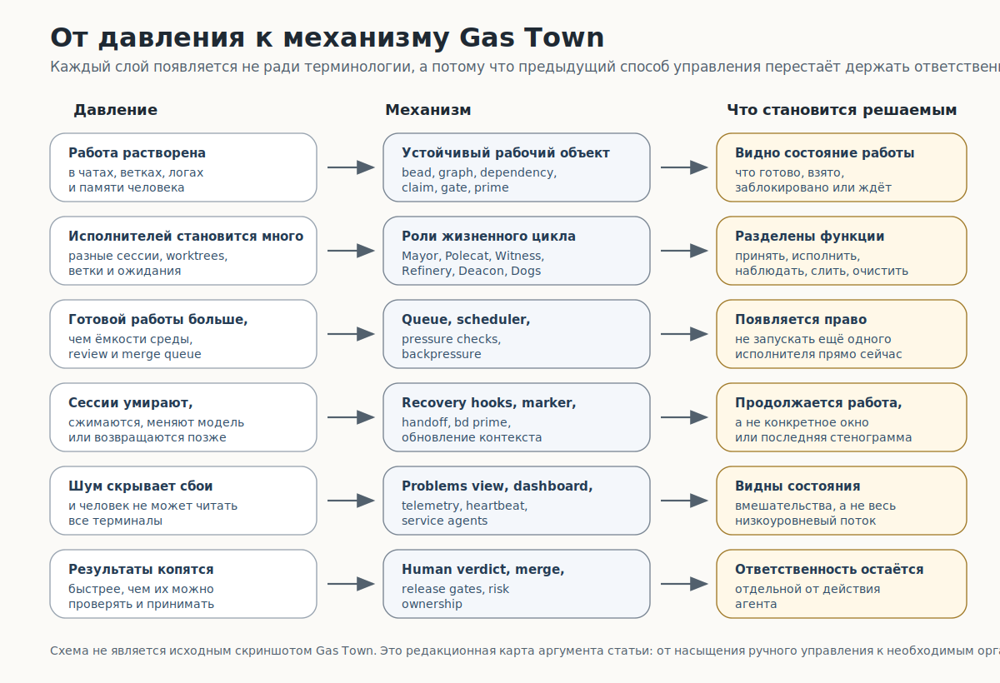
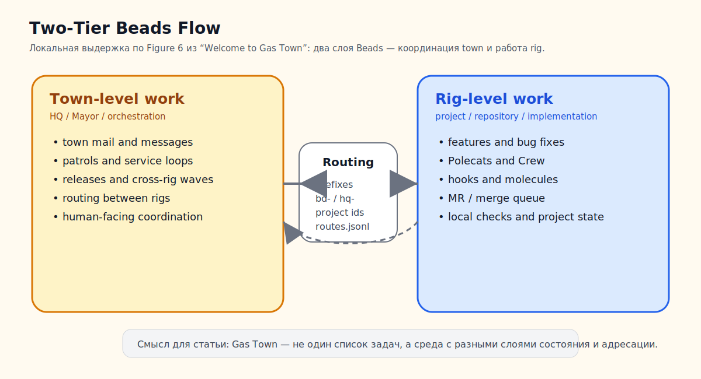
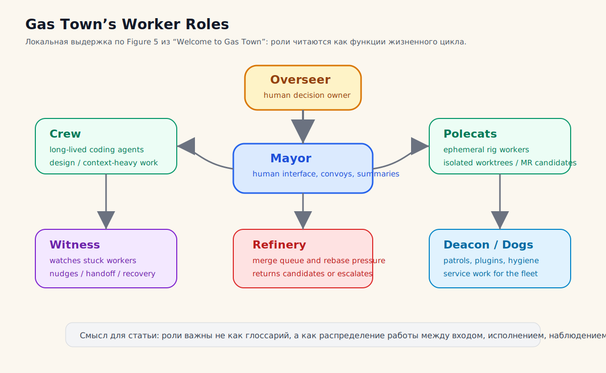

# Gas Town: какие организационные механизмы нужны, когда агентная работа выходит за пределы одного чата, одного рабочего дерева и ручного наблюдения?

Gas Town стоит читать как попытку построить рабочую среду для управляемого флота кодовых агентов. В такой среде агентная работа выходит из одного окна чата и проходит через задачи, рабочие деревья, ветки, сессии, очереди, сообщения, проверки, слияния, восстановление контекста и человеческие решения. Если всё это остаётся в голове человека или в последнем сообщении агента, параллельность быстро превращается в шум: задач становится больше, а понимания меньше.

В источниках Gas Town описан как система для Claude Code, GitHub Copilot, Codex, Gemini и других кодовых агентов, где работа отслеживается устойчиво, а состояние сохраняется через Git-хуки вместо памяти живой сессии ([Gas Town README](https://github.com/gastownhall/gastown)). Steve Yegge в исходном тексте подчёркивает более жёсткую сторону: система свежая, дорогая и хаотичная; она рассчитана на людей, которые уже дошли до ручного управления множеством CLI-агентов, а не на спокойный универсальный сценарий для любого проекта ([Welcome to Gas Town](https://steve-yegge.medium.com/welcome-to-gas-town-4f25ee16dd04)). Поэтому флот агентов сам по себе не масштабирует разработку. Gas Town показывает, какое организационное устройство приходится добавить, когда человек пытается удерживать несколько расходуемых агентных сессий под своим надзором.

## Почему одного чата становится мало

Пока задача короткая, один чат может быть достаточной рабочей поверхностью. Человек формулирует просьбу, агент предлагает изменение, человек смотрит `diff`, запускает проверку и принимает или отклоняет результат. Ошибки видны близко к месту действия. Контекст держится в голове владельца. Если агент ошибся, его легко остановить.

Ситуация меняется, когда появляются несколько признаков одновременно. Работа длится дольше одной сессии. Контекст заполняется и сжимается. Несколько агентов работают в разных ветках или рабочих деревьях. Один исполнитель ждёт ревью, другой ждёт CI, третий открыл новую подзадачу, четвёртый застрял после конфликта. Человек не может читать каждый терминал и каждую стенограмму. Но он всё ещё должен понимать, какая работа разрешена, какая заблокирована, кто за неё отвечает, какие результаты можно сливать, где нужен выбор, а где систему нужно остановить.

В этот момент простая переписка перестаёт быть рабочей системой. У сообщения в чате нет устойчивого адреса задачи, статуса готовности, блокирующей зависимости, владельца, канала передачи, контрольного ожидания и истории восстановления. Markdown-план тоже помогает только до определённой нагрузки: он может описать порядок шагов, но сам по себе не отвечает, какая работа готова прямо сейчас, кто её взял, что заблокировано, какие найденные подзадачи не должны расширять текущую область работы и что нужно показать следующему исполнителю после разрыва сессии.

Gas Town появляется именно на этой границе. Он предполагает, что сессии расходуемы: они могут умереть, исчерпать контекст, перезапуститься, быть заменены другой моделью или уйти в неверную ветку. Устойчивость переносится на работу, роли, сообщения, очереди, восстановление и решения человека. Архитектурный центр Gas Town находится во внешнем рабочем состоянии и организационной оболочке вокруг него; `tmux` и игровые названия ролей только поверхности этой среды.

Техническое давление накапливается через малые рассогласования. Рабочее дерево или ветка отделяет запись в файлы, но не говорит, была ли задача готова, кто имел право её брать и какое решение теперь нужно. Лог сессии показывает события, но не показывает, что изменение относится к правильному рабочему узлу и прошло нужный контрольный барьер. Один агент может ждать решения человека, другой зависнуть после неудачного слияния, третий оставить рабочую ветку без актуального `rebase`, четвёртый открыть найденную подзадачу, которая не должна расширять текущую область работы. Если эти состояния не становятся внешними объектами, человек вынужден восстанавливать карту по терминалам, веткам, PR, заметкам и собственной памяти. При нескольких параллельных исполнителях человек занимается уже не координацией, а восстановлением картины по следам.

Поэтому рядом с исполнителями в Gas Town быстро появляются служебные механизмы: очередь, состояние `awaiting_verdict`, обнаружение застрявших и «зомби»-сессий, петля слияния и Refinery, подталкивания (`nudges`), передача (`handoff`) и очистка (`cleanup`). Они не добавляют модели особую «агентность». Их задача проще и жёстче: вернуть наблюдаемость и право остановки туда, где один чат и одно рабочее дерево уже смешали исполнение, состояние работы и человеческое решение.

## Линия давления: от ручного управления к ответственности

Дальше удобнее идти по одной линии давления. Сначала ручная координация ломается потому, что состояние работы растворено в чате, терминалах, ветках и памяти человека. Первый механизм — вынести работу в Beads/PWG-подобное состояние: задача получает идентичность, зависимости, готовность, закрепление (`claim`), контрольный барьер (`gate`) и восстановление. Когда таких задач и исполнителей несколько, одного графа мало: нужны роли, которые принимают работу, назначают её, выполняют, наблюдают, возвращают на исправление, проводят через слияние и чистят инфраструктуру.

Следующий рост давления создаёт очередь и диспетчеризацию. Готовая работа ещё не равна безопасному запуску: планировщик и обратное давление (`backpressure`) ограничивают число Polecats, темп запуска, давление на CPU/память, очередь слияния и внимание ревьюера. Затем появляется восстановление: если сессия умерла или сжалась, продолжать должен рабочий объект через `bd prime`, хуки, маркер и передачу (`handoff`), а не стенограмма. После этого нужна наблюдаемость: человек не может читать всё, поэтому система должна показывать проблемные состояния, панель, телеметрию и статусы вмешательства. В конце вся цепочка возвращается к ответственности: агент может довести работу до проверяемого состояния, но человеческое решение, слияние, релиз и принятие риска остаются отдельными переходами.

Эта линия давления задаёт границу статьи. Каждый следующий механизм появляется там, где предыдущего уже не хватает: состояние без ролей не распределяет ответственность; роли без очереди создают перегрузку; очередь без восстановления теряет работу; восстановление без наблюдаемости скрывает сбои; наблюдаемость без обратного давления только лучше показывает перепроизводство; обратное давление без человеческого права решения превращает флот в автоматическое накопление неподтверждённых результатов.

<figure class="image-asset synthetic-figure" id="fig-gastown-pressure-to-mechanism-stack">
  
  <figcaption>Схема показывает последовательность переходов: когда чат и рабочее дерево перестают держать работу, появляется устойчивый рабочий объект; когда исполнителей несколько, появляются роли; когда готовой работы больше ёмкости, нужна очередь и обратное давление; когда сессии расходуемы, нужно восстановление; когда логов слишком много, нужна наблюдаемость; когда результаты копятся быстрее ревью, человеческое решение остаётся отдельным переходом.</figcaption>
</figure>

## Контракт статьи: граница между Beads, PWG и Gas Town

Здесь важно держать три уровня раздельно. Beads — конкретная рабочая память и граф задач: CLI, Dolt-база, идентификаторы, зависимости, очередь готовой работы, закрепление (`claim`), контрольные барьеры (`gates`), `prime` и диагностика. Persistent Work Graph — переносимый механизм за этим примером: долговечное состояние работы, которое переживает сессию агента, связывает владельца, блокеры, ожидания, передачу, свидетельства и восстановление. Gas Town — среда вокруг такого состояния: роли, очереди, диспетчеризация, почта, восстановление, сервисные агенты, наблюдаемость, ограничения ресурсов и точки человеческого решения.

Beads здесь служит нижней рабочей основой: местом, где задачи, зависимости, готовность, владение, память и восстановление становятся объектами, которые можно спросить и изменить. Роли Gas Town рассматриваются выше этого слоя — через функцию в жизненном цикле работы. Главный вопрос остаётся практическим: что должно появиться вокруг устойчивой рабочей основы, когда работа проходит путь от человеческого намерения до распределённого исполнения, наблюдения, слияния, восстановления и принятия результата?

Поэтому команды Beads и термины Gas Town дальше нужны только там, где они объясняют сбой и способ его закрыть. За пределами текста остаются продуктовый учебник по Beads, отдельная теория PWG, сравнение процессных профилей вроде BMAD/GSD и тезис «больше агентов значит лучше». Предмет статьи — то, что приходится построить между человеком, устойчивым графом работы и несколькими расходуемыми сессиями кодовых агентов, чтобы параллельность оставалась наблюдаемой, ограниченной и принимаемой человеком.

## Минимальная рамка для чтения без всей теории

Чтобы читать эту статью, не нужно заранее знать весь теоретический словарь. Достаточно обычной картины: есть репозиторий, ветки или рабочие деревья, задачи в трекере, несколько CLI-агентов и человек, который всё ещё отвечает за результат. Дальше нужен один дополнительный принцип: рабочее состояние должно жить вне контекста модели. Под рабочим состоянием здесь понимается всё, что нужно, чтобы продолжить и принять работу: идентификатор задачи, описание, владелец, зависимости, блокеры, контрольные барьеры, передача, свидетельства, история и способ восстановить контекст после разрыва сессии.

Слово `PWG` в статье можно читать как обобщение этого принципа: Persistent Work Graph, то есть долговечный граф работы. Beads — конкретная реализация такого состояния в экосистеме Gas Town. Gas Town начинается там, где одного такого графа уже недостаточно: вокруг него приходится строить организационную среду. Названия Mayor, Polecat, Witness, Refinery, Deacon, Dog, Rig, Hook, Convoy и Molecule в статье читаются как функции: принять работу от человека, направить её, исполнить в отдельной среде, заметить застревание, провести через слияние, очистить инфраструктурный долг, восстановить контекст и вернуть человеку решение.

Отсюда получается рабочий вопрос: если агентная работа перестала быть одной просьбой в одном чате, какие механизмы нужны, чтобы она оставалась адресной, ограниченной, наблюдаемой, восстанавливаемой и принимаемой человеком? Следующие секции отвечают на него, а не перечисляют все возможности Gas Town.

## Нижний слой: работа должна быть объектом

Gas Town опирается на Beads. В текущей документации Beads описан как трекер задач для рабочих процессов программирования под наблюдением ИИ на основе Dolt: задачи имеют идентификаторы, типы, статусы, приоритеты, зависимости, память, историю и очередь готовой работы; Dolt выступает источником истины, а не просто экспортным файлом JSONL ([Beads Documentation](https://gastownhall.github.io/beads/), [Beads Architecture](https://gastownhall.github.io/beads/architecture)). Для Gas Town это означает, что рабочая единица существует вне сессии агента. Её можно показать, закрепить за исполнителем, связать с другой задачей, заблокировать контрольным барьером, передать, закрыть или восстановить.

Ключевой пример — очередь готовой работы. `bd ready` показывает работу без активных блокеров; `bd ready --explain --json` может объяснять, почему другая задача не готова; `bd update --claim` закрепляет работу за исполнителем; `bd dep add` связывает задачи зависимостями; `bd prime` вводит в сессию компактный контекст работы и правил взаимодействия с Beads ([Beads Quick Start](https://gastownhall.github.io/beads/getting-started/quickstart), [Beads CLI Reference](https://gastownhall.github.io/beads/cli-reference), [`bd prime`](https://gastownhall.github.io/beads/cli-reference/prime)). Эти команды важны не как список CLI-функций. Они показывают, что агентная работа должна иметь форму, которую можно вычислять и предъявлять: что готово, что заблокировано, что взято, что нужно вспомнить перед продолжением.

<figure class="image-asset" id="fig-beads-task-graph-memory">
  
  <figcaption>Beads даёт нижнюю рабочую память: задачи имеют состояния, зависимости, закрепления, заметки и команду восстановления контекста. Диаграмма намеренно не показывает весь Gas Town: вокруг этого графа ещё должны появиться роли, очереди, диспетчеризация, наблюдение, сервисные петли и человеческие решения.</figcaption>
</figure>

Но этого слоя недостаточно для Gas Town. Долговечная задача ещё не знает, куда её отправить, какой рабочий каталог ей нужен, кто будет наблюдать за застреванием, кто разберёт очередь слияния, как человек увидит проблемы и что делать, когда система начинает потреблять больше ресурсов, чем даёт полезного результата. Persistent Work Graph делает работу продолжимой. Gas Town отвечает на следующий вопрос: как организовать людей, агентов, рабочие пространства и сервисные циклы вокруг продолжимой работы.

## Два уровня состояния: координация и реализация

В Gas Town состояние разделяется на уровень town и уровень rig. `Town` — управляющее пространство, где живёт координация, идентичности, почта и общие маршруты. `Rig` — конкретный проект или репозиторий, где исполняется работа реализации. Материалы Gas Town и архитектурные документы описывают два уровня Beads: town-level база для координации между rig-ами, почты Mayor и идентичности агента; rig-level база внутри проекта для задач реализации, запросов на слияние и проектной работы ([Gas Town architecture docs](https://github.com/gastownhall/gastown/blob/main/docs/design/architecture.md), [Welcome to Gas Town](https://steve-yegge.medium.com/welcome-to-gas-town-4f25ee16dd04)).

Это разделение решает конкретную проблему. Если вся работа лежит в одном плоском слое, координация и реализация начинают мешать друг другу. Задача «разобраться, куда отправить работу» и задача «изменить файл в проекте» требуют разных прав, разных наблюдателей и разных признаков готовности. Уровень town удерживает поток: кто просит, куда направить, кто отвечает, какие сообщения пришли, какие агенты доступны. Уровень rig удерживает проектную работу: ветку, рабочее дерево, зависимости в коде, MR/PR, локальные проверки и состояние слияния.

<figure class="image-asset" id="fig-gastown-architecture">
  
  <figcaption>Локальная схема показывает Gas Town как организацию рабочих областей: Mayor координирует пространство town workspace, rigs отделяют проекты, hooks дают устойчивое место работы, Polecats исполняют задачи, а рабочие деревья Git связывают агентное исполнение с репозиторием.</figcaption>
</figure>

Маршрутизация делает это разделение рабочим. В источниках Gas Town и Beads встречается маршрутизация по префиксу: идентификаторы вроде `hq-*` или проектных префиксов направляют команду в нужную базу; карта маршрутов может храниться в `routes.jsonl`, а диагностика маршрутизации включается отдельным отладочным флагом ([Gas Town Reference](https://docs.gastownhall.ai/reference/), [Beads Routing](https://gastownhall.github.io/beads/multi-agent/routing)). Для работы флота это не украшение. Агент не должен по памяти угадывать, где лежит задача и в каком проекте её надо продолжать. Адрес должен вести к правильному графу работы и правильной зоне исполнения.

<figure class="image-asset" id="fig-gastown-two-tier-beads-flow" data-asset-status="local_source_excerpt_asset" data-repo-path="content/assets/atlas-images/gas-town/gastown-two-tier-beads-flow.svg">
  
  <figcaption>Локальная визуальная выдержка по Figure 6 из `Welcome to Gas Town` показывает два слоя Beads: town-level work для координации, почты, patrols, релизов и cross-rig волн, и rig-level work для проектных задач, Polecats/Crew, hooks и очереди слияния. В статье эта картинка нужна не как UI-тур, а как подтверждение, что Gas Town разделяет координацию и реализацию.</figcaption>
</figure>

Такой слой адресации особенно важен для кодовых агентов. Ошибка маршрута — это не только неправильная ссылка в тикете. Агент может читать не ту базу, продолжать чужой проход, писать результат в неправильный репозиторий, считать задачу свободной, хотя она уже закреплена, или отправить сообщение не тому наблюдателю. Чем больше рабочих деревьев, веток и проектов, тем меньше можно полагаться на человеческое «я помню, куда это относится».

## Роли как функции жизненного цикла

Gas Town использует яркие названия ролей: Mayor, Crew, Polecats, Refinery, Witness, Deacon, Dogs, Overseer. Их легко превратить в глоссарий, но для понимания системы важнее другая мысль: каждая роль закрывает отдельный разрыв жизненного цикла, который появляется при работе флота.

Человеку нужен вход в систему, который не требует читать все терминалы. Эту функцию выполняет Mayor: он принимает задание, помогает запускать convoys, вытаскивает важные вопросы и делает состояние управляемым для человека. Нужны долгоживущие агенты для исследовательской или контекстной работы; эту функцию выполняет Crew. Нужны временные исполнители для хорошо ограниченных задач в отдельных ветках и рабочих деревьях; эту функцию выполняют Polecats. Нужен наблюдатель за застрявшими исполнителями; эту функцию выполняет Witness. Нужен обработчик очереди слияния; эту функцию выполняет Refinery. Нужен обслуживающий слой, который чистит инфраструктуру, ищет устаревшие состояния и запускает обходы (`patrol`); эти функции выполняют Deacon и Dogs ([Welcome to Gas Town](https://steve-yegge.medium.com/welcome-to-gas-town-4f25ee16dd04), [Gas Town Docs](https://docs.gastownhall.ai/)).

Такое чтение защищает статью от декоративной терминологии. В малом процессе эти функции не обязаны быть отдельными агентами. Они могут быть скриптами, CI-правилами, ручными контрольными точками, ревью-ритуалами или страницей состояния. Но если функции отсутствуют полностью, система распадается. Кто-то должен принять работу от человека. Кто-то должен закрепить её за исполнителем. Кто-то должен понять, что исполнитель застрял. Кто-то должен провести изменение через слияние. Кто-то должен очистить устаревшие ветки, сообщения и временные рабочие элементы. Кто-то должен вернуть человеку сводку вместо потока низкоуровневого вывода.

У каждой функции есть цена. Town/Rig-разделение даёт адресацию, но добавляет долг маршрутизации и синхронизации. Mayor снимает с человека чтение всех потоков, но может стать новым узким местом триажа и выбора. Crew сохраняет контекст, но потребляет долгую сессию и может накапливать устаревшие предположения. Polecats дают параллельное исполнение, но создают ветки, MR, конфликты и очередь ревью. Witness снижает риск потерянных исполнителей, но сам требует правил, когда будить, передавать или останавливать. Refinery разгружает слияние, но превращает его в отдельную производственную линию со своей очередью и отказами. Deacon и Dogs делают гигиену видимой, но показывают неприятную правду: флот создаёт работу по обслуживанию флота.

Эта ролевая граница также отделяет право действовать от права признать результат принятым. Polecat может написать патч и довести его до MR; Refinery может подготовить кандидата на слияние; Witness может вернуть застрявшую задачу в движение; Deacon может очистить устаревшие состояния. Но `accepted`, `merged`, `released` или «бизнес-результат достигнут» не должны автоматически вытекать из того, что агент смог выполнить действие. Gas Town нужен именно для того, чтобы действие, проверка, ожидание и человеческое решение не смешивались в одном слове `done`.

<figure class="image-asset" id="fig-gastown-worker-roles" data-asset-status="local_source_excerpt_asset" data-repo-path="content/assets/atlas-images/gas-town/gastown-worker-roles.svg">
  
  <figcaption>Локальная визуальная выдержка по Figure 5 из `Welcome to Gas Town` поддерживает чтение ролей как функций жизненного цикла: человек принимает решения, Mayor держит интерфейс, Crew и Polecats исполняют разные типы работы, Witness следит за застреванием, Refinery проводит кандидатов через слияние, а Deacon/Dogs обслуживают флот.</figcaption>
</figure>

Ключевой принцип здесь можно сформулировать без игрового словаря: агент не равен сессии. Сессия может исчезнуть. Роль, hook, почтовый ящик (`mailbox`), рабочий bead, convoy и история должны остаться. Если новая сессия получает ту же роль и тот же закреплённый рабочий объект, она продолжает работу через внешнее состояние, а не через память предыдущего окна. В источниках Gas Town hook описывается как закреплённый bead (`pinned bead`): устойчивый объект, на который кладётся работа; role beads и agent beads также сохраняют устойчивые идентичности ([Welcome to Gas Town](https://steve-yegge.medium.com/welcome-to-gas-town-4f25ee16dd04)). Это и есть организационное различение: исполнитель временный, ответственность и состояние — долговечные.

## От поручения к доставке: convoy, sling, hook и почта

В одиночном чате человек может написать: «сделай это изменение». В Gas Town такое поручение должно стать объектом движения. Задача оформляется как bead, заказ или convoy, после чего её можно отправить в rig или конкретному исполнителю через `gt sling`. README описывает базовую петлю как `You → Mayor → Convoy → Agent → Hook → completion → summary` ([Gas Town README](https://github.com/gastownhall/gastown)). Ролевой шаблон Mayor добавляет дисциплину: изменение кода по умолчанию должно быть оформлено и отправлено (`filed and slung`) — оформлено через `bd create ...` и отправлено через `gt sling`, а не оставлено как приватное намерение в чате ([Mayor role template](https://github.com/gastownhall/gastown/blob/main/internal/templates/roles/mayor.md.tmpl)).

Эта форма нужна для связности, а не для церемонии. Она отвечает на несколько рабочих вопросов сразу. У работы появляется адрес. Она попадает в нужное пространство исполнения. У неё есть потенциальный владелец. Её можно увидеть в очереди. Её можно остановить, если есть блокер. Её можно передать другому исполнителю. Её можно связать с результатом, очередью слияния и человеческим решением. Если поручение остаётся только в разговоре, эти связи приходится восстанавливать вручную.

Коммуникация между агентами тоже становится частью графа работы. В Gas Town mail-сообщения маршрутизируются через Beads и могут переносить сигналы вроде `POLECAT_DONE`, `MERGE_READY` и `MERGED` между Polecats, Witness и Refinery ([Gas Town mail protocol](https://github.com/gastownhall/gastown/blob/main/docs/MAIL_PROTOCOL.md)). В дизайн-материалах встречаются и другие операционные состояния: `FIX_NEEDED`, `awaiting_verdict`, `MERGE_FAILED`, `GUPP_VIOLATION`, `ORPHANED_WORK`. Конкретная строка статуса менее важна, чем типизированная обратная связь. Завершение, сбой слияния, нарушение режима работы и необходимость исправления становятся событиями, с которыми система может работать, а не репликами, затерянными в терминале.

<figure class="image-asset" id="fig-gastown-basic-workflow">
  
  <figcaption>Базовая петля Gas Town показывает, что поручение не остаётся сообщением в чате. Оно проходит через координацию, диспетчеризацию, исполнителя, hook, уведомление Convoy, отчёт о прогрессе и возврат состояния или решения человеку.</figcaption>
</figure>

GUPP усиливает эту дисциплину. Если работа лежит на hook, агент должен её выполнять, а не ждать очередного человеческого подтверждения. Это не отменяет надзора человека. Напротив, надзор становится явнее: человек управляет тем, что попадает на hook, какие контрольные барьеры открыты, где нужна остановка и кто принимает результат. Система пытается убрать слабое место, когда агент после перезапуска говорит «я готов, что делать дальше?», хотя работа уже была назначена.

## Декомпозиция работы: как убрать неявность из поручения

Флот агентов нельзя кормить только большим текстовым поручением. Большая цель должна раскладываться на единицы, которые можно адресовать, назначать, блокировать, проверять и снова собирать в общий результат. В Gas Town для этого появляются MEOW, Formulas, Molecules, Gates и Wisps. В словаре Gas Town MEOW расшифровывается как Molecular Expression of Work: разбиение крупной цели на детальные инструкции для агентов, поддержанное Beads, Epics, Formulas и Molecules ([Gas Town Glossary](https://github.com/gastownhall/gastown/blob/main/docs/glossary.md)).

В документации Beads `Formula` описывает шаблон рабочего процесса в TOML/JSON; `Molecule` создаёт долговечный экземпляр этого процесса, хранимый в `.beads/` и связанный с задачами; `Wisp` даёт эфемерную форму, хранимую в `.beads-wisp/`, которая подходит для временной оркестрации без загрязнения постоянной истории ([Beads Workflows](https://gastownhall.github.io/beads/workflows), [Beads Molecules](https://gastownhall.github.io/beads/workflows/molecules), [Beads Wisps](https://gastownhall.github.io/beads/workflows/wisps)). `bd gate` добавляет устойчивые ожидания: `human`, `timer`, `GitHub run`, `GitHub PR` и `bead gates` могут блокировать движение до разрешения или эскалации ([`bd gate`](https://gastownhall.github.io/beads/cli-reference/gate)).

По функции эти термины разводят разные операции. MEOW переводит крупное намерение в набор рабочих единиц, которые можно назначать и проверять. Formula хранит повторяемую форму процесса, чтобы не придумывать заново порядок шагов. Molecule делает конкретный запуск этой формы долговечным: его можно остановить, восстановить и связать с bead-ами. Wisp оставляет временную оркестрацию временной, чтобы не превращать каждый внутренний ход в постоянную проектную историю. Gate отделяет «следующий шаг технически возможен» от «следующий шаг разрешён»: ожидание человека, CI, PR или другой задачи становится состоянием, а не просьбой в чате. GUPP добавляет дисциплину исполнения: если работа уже положена на hook, агент должен двигаться по ней и возвращать состояние, а не снова превращать назначение в вопрос «что делать дальше?».

Эти элементы можно читать как язык разбиения и удержания работы. Длинная задача не должна превращаться в один запрос, который агент исполнит «как понял». Она должна стать цепью маленьких шагов с состоянием, зависимостями, правом продолжения, контрольными барьерами и способом восстановления. Иногда эти шаги стоит сохранить как долговечную Molecule, потому что их состояние должно пережить сессию и стать частью истории. Иногда достаточно Wisp, потому что шаги служат внутренней оркестрации и не должны засорять постоянный граф.

Организационный вывод здесь простой: декомпозиция создаёт управляемые единицы для флота, а не только план выполнения. Если шаг нельзя назначить, увидеть, заблокировать, повторить, передать или закрыть, он остаётся частью текста, а не частью рабочей среды.

## Очередь и обратное давление

Главная ошибка при чтении Gas Town — начинать масштабирование с числа агентов. На практике оно начинается с очереди, ёмкости, обратного давления и защиты человеческого ревью. Иначе система производит больше веток, логов, PR и незавершённых переходов, чем человек способен понять.

Gas Town CHANGELOG показывает, что система постепенно наращивает именно такие механизмы: `gt queue`, движок диспетчеризации, пульс очереди (`heartbeat`), пакетная диспетчеризация, проверки давления CPU/памяти перед запуском агентов, неразрушающие подталкивания, типизированные статусы, событийный жизненный цикл Polecat, `FIX_NEEDED`, `awaiting_verdict`, Convoy Dashboard, OTEL-инструментация, обнаружение `spawn storm` и статус очереди слияния ([Gas Town CHANGELOG](https://github.com/gastownhall/gastown/blob/main/CHANGELOG.md)). Эти изменения показывают не набор удобств, а давление реальной эксплуатации. Когда временных исполнителей много, система должна решать, сколько работы запускать, когда ждать, когда будить, когда останавливать, когда эскалировать и когда не создавать ещё одного агента.

Если читать этот набор как контур управления, видно несколько обязательных петель. Планировщик решает, можно ли сейчас запустить нового Polecat, а не только какую задачу выбрать. Очередь хранит ожидание и даёт пульс (`heartbeat`), чтобы зависшая диспетчеризация стала видимым состоянием. Проверки давления перед запуском защищают CPU/память и не дают флоту съесть собственную рабочую среду. `FIX_NEEDED` и `awaiting_verdict` отделяют «агент что-то сделал» от «результат принят или отправлен на исправление». Панель Dashboard и телеметрия делают эти переходы наблюдаемыми для человека и сервисных агентов. Очередь слияния показывает, что узким местом может стать не генерация кода, а принятие, `rebase`, повторная проверка и право слить результат.

Слабое место без планировщика — момент запуска. `bd ready` может сказать, что работа не заблокирована, но это ещё не значит, что среда имеет право поднять ещё одного исполнителя. В дизайн-материалах Gas Town планировщик описывается как слой между готовой работой и фактической диспетчеризацией: прямой запуск отличается от отложенного, `gt sling --queue` кладёт работу в очередь, а параметры вроде `max_polecats`, `batch_size`, `spawn_delay` и предохранитель (`circuit breaker`) задают ёмкость системы ([Gas Town Scheduler design](https://github.com/gastownhall/gastown/blob/main/docs/design/scheduler.md)). Это важная граница: очередь готовой работы отвечает на вопрос «что можно делать», а планировщик и обратное давление отвечают на вопрос «сколько работы система сейчас выдержит».

Обратное давление нужно на нескольких уровнях. Машина может быть перегружена CPU, памятью, рабочими деревьями или Dolt-сервером. Очередь слияния может стать уже, чем поток MR. Человек может стать уже, чем поток вопросов. Ревью может стать уже, чем генерация кода. Даже если все агенты по отдельности работают хорошо, организация может проиграть из-за перепроизводства незакрытых результатов.

Для меньших агентных процессов отсюда следует практический урок. Если в проекте появился второй или третий параллельный агент, нужно заранее ответить, где будет очередь готовой работы, кто имеет право запускать новую, как понять, что система перегружена, какой сигнал означает «не создавай ещё одну ветку», где живут ожидания ревью и что делать с задачами, которые висят без прогресса. Без этих ответов параллельность выглядит продуктивно только в момент запуска.

## Наблюдаемость: человек должен видеть состояние, а не поток шума

Когда агентов становится много, человек не может быть «в контуре» через чтение всего вывода. Такой режим быстро ломается: он награждает шумных агентов, наказывает сложные задачи и прячет реальные проблемы среди нормального технического лога. Gas Town отвечает на это отдельной поверхностью видимости.

Mayor важен именно как человеческий интерфейс. Он должен помогать увидеть, что изменилось, где блокер, какой вопрос требует выбора, какие агенты простаивают, какие застряли, какие работают, где есть риск «зомби»-сессии или нарушения GUPP. README описывает `gt feed --problems`, где агенты группируются по состояниям здоровья: `GUPP Violation`, `Stalled`, `Zombie`, `Working`, `Idle`, с возможностями вмешательства вроде `nudge` и `handoff` ([Gas Town README](https://github.com/gastownhall/gastown)). Эту функцию можно назвать «видимостью без чтения»: человек остаётся владельцем решения, но не обязан потреблять весь низкоуровневый поток.

Словарь проблемных состояний важен именно потому, что «не завершено» перестаёт быть одним состоянием. `Working` означает нормальное движение; `Stalled` — что движение остановилось; `Zombie` — что процесс ещё виден, но полезная работа уже, вероятно, умерла; `GUPP Violation` — что агент не исполняет работу на своём hook. На стороне доставки `FIX_NEEDED`, `MERGE_FAILED` и `ORPHANED_WORK` показывают уже не состояние агента, а следующий допустимый ход: вернуть кандидата на исправление, разобрать сбой слияния или найти работу, потерявшую владельца. Команды вроде `bd blocked`, `bd dep tree` и `bd mail` дают этому словарю рабочую поверхность: можно спросить, что держит узел, от чего он зависит и какие сообщения изменили состояние ([Beads CLI Reference](https://gastownhall.github.io/beads/cli-reference), [Gas Town mail protocol](https://github.com/gastownhall/gastown/blob/main/docs/MAIL_PROTOCOL.md)).

<figure class="image-asset" id="fig-gastown-mayor-hub">
  
  <figcaption>В этой статье Mayor’s Hub работает как человеческая поверхность выбора, триажа и наблюдения. Она снижает необходимость читать все терминалы, но создаёт собственную цену — узкое место внимания и необходимость ясно отделять действие агента от человеческого решения.</figcaption>
</figure>

Панель Dashboard, `gt feed --problems` и телеметрия нужны не в конце как приложение к системе, а в середине жизненного цикла. Без них планировщик не знает, что `spawn storm` уже начался; Witness не видит, кого будить или передавать; Refinery не знает, какие MR ждут повторного прогона; человек видит только итоговые сводки и не видит очередь решений. Наблюдаемость становится частью управления, потому что статус должен менять допустимое следующее действие.

Наблюдаемость здесь не декоративна. Она защищает ответственность. Если человек видит только итоговые отчёты «готово», он не знает, сколько работы застряло, какие ветки конфликтуют, какие агенты не отправили MR, какие проверки провалены и где система сама себя обслуживает вместо движения к результату. Хорошая поверхность должна показывать проблемные состояния раньше, чем они превращаются в неправильное слияние, потерянную задачу или устаревший контекст.

## Восстановление: продолжать должна работа, а не сессия

Самый сильный переносимый урок Gas Town связан с восстановлением. Кодовый агент часто ломается не потому, что не умеет написать один фрагмент кода, а потому что долгий процесс переживает разрыв: сжатие контекста, сбой, перезапуск, смену модели, ручное вмешательство, паузу на ревью или возвращение после CI. Если восстановление означает «прочитай всё заново и догадайся, где остановился», система быстро теряет точность.

Beads предлагает более конкретную форму через `bd prime`. Команда выдаёт агенту компактный Markdown-контекст текущей работы, правил и памяти; документация связывает её с хуками `SessionStart` и восстановлением после сжатия контекста ([`bd prime`](https://gastownhall.github.io/beads/cli-reference/prime)). Интеграция с Codex показывает жизненный цикл ещё точнее: `bd setup codex` устанавливает навык Beads, указания в `AGENTS.md` и нативные хуки; `SessionStart` вводит полный `bd prime`, `PreCompact` проверяет контекст, который живёт только в памяти, `PostCompact` ставит маркер, а `UserPromptSubmit` один раз после сжатия вводит свежий `bd prime`, потому что stdout из `PreCompact` не является надёжным каналом ввода для Codex ([Beads Codex Integration](https://gastownhall.github.io/beads/integrations/codex)).

Этот механизм важен не только для Codex. Он показывает, как должна выглядеть зрелая среда восстановления: есть событие жизненного цикла, есть маркер, есть компактная команда восстановления, есть различение памяти и полного рабочего контекста, есть точка, где новая сессия получает состояние перед продолжением. В такой системе агент не пытается восстановить смысл из последней стенограммы. Он читает текущий рабочий объект, зависимости, блокеры, назначение, правила и ближайшее допустимое действие.

Но восстановление контекста не решает всё. Если состояние работы повреждено, устарело или рассинхронизировано, `prime` может уверенно ввести неправильную картину. Поэтому Gas Town/Beads требуют диагностики и обслуживания нижнего слоя, а не только красивого входа в сессию.

## Сервисная работа: флот обслуживает сам себя только частично

Параллельная агентная среда создаёт новую категорию работы: обслуживание самой агентной организации. Это не продуктовая фича и не архитектурная задача пользователя. Это проверки очередей, слияний, застрявших агентов, устаревших веток, heartbeat-базы, плагинов, старых сообщений, конфликтов, повторных попыток, очистки и восстановления.

Refinery нужен потому, что несколько Polecats могут принести изменения, которые конфликтуют с `main` и друг с другом. Поздний исполнитель может пытаться слиться в базу, которая уже изменилась. Нужен отдельный обработчик очереди слияния: `rebase`, повторная сборка, повторная проверка, иногда возврат к исполнителю или эскалация человеку. Witness нужен потому, что временные исполнители застревают, теряют контекст, не отправляют MR или ждут несуществующего подтверждения. Deacon и Dogs нужны потому, что регулярная инфраструктурная уборка начинает конкурировать с полезной работой ([Welcome to Gas Town](https://steve-yegge.medium.com/welcome-to-gas-town-4f25ee16dd04), [Gas Town CHANGELOG](https://github.com/gastownhall/gastown/blob/main/CHANGELOG.md)).

В меньшей системе эти функции можно устроить проще. Witness может быть скриптом, который ищет рабочие деревья без коммитов и задачи без обновления. Refinery может быть ручным правилом: не запускать новую серию задач, пока очередь слияния не очищена. Deacon может быть еженедельной процедурой удаления устаревших инструкций, закрытия старых веток и проверки, какие навыки агента уже вредят. Важно другое: обслуживание не должно оставаться невидимым долгом. Если флот создаёт работу по обслуживанию флота, эта работа должна попасть в тот же жизненный цикл: адрес, владелец, состояние, свидетельство и право закрытия.

## Устойчивое состояние само становится инфраструктурой

Gas Town часто звучит как история о том, как вынести работу из контекстного окна в устойчивую основу. Это правильное направление, но оно не даёт устойчивость бесплатно. Как только рабочее состояние становится настоящей базой, у неё появляются собственные сбои: синхронизация, миграции, режим server/embedded, теневая база данных, lock-файлы, устаревшие метаданные, повреждение журнала, среда выполнения в песочнице и режимы восстановления.

Документация Beads Troubleshooting показывает это прямо. Если `bd` показывает ноль задач, хотя база содержит данные, причина может быть в неправильном сервере или базе Dolt, старом `metadata.json` или теневой базе данных; диагностика включает проверку `.beads/metadata.json`, списка баз на сервере Dolt, прямой SQL-запрос и `bd doctor --server` ([Beads Troubleshooting](https://github.com/gastownhall/beads/blob/main/docs/TROUBLESHOOTING.md)). При повреждении журнала Dolt документация предупреждает, что удаление внутренних lock-файлов может привести к невосстановимой порче; безопасный путь зависит от состояния remote и может требовать `bd bootstrap`, `bd stats` и экспертной проверки через `dolt fsck` ([Beads Troubleshooting](https://github.com/gastownhall/beads/blob/main/docs/TROUBLESHOOTING.md)).

Даже отладочная поверхность показывает, что это уже инфраструктура, а не файл со списком задач. В материалах Beads/Gas Town есть отдельные отладочные флаги: `BD_DEBUG` для общего вывода, `BD_DEBUG_RPC` для связи CLI с сервером Dolt, `BD_DEBUG_SYNC` для отметки времени синхронизации/импорта, `BD_DEBUG_ROUTING` для маршрутизации между репозиториями и `BD_DEBUG_FRESHNESS` для обнаружения замены файла базы и переподключения. Каждый такой флаг указывает на отдельный риск управления состоянием: команда не видит сервер, синхронизация устарела, маршрут ведёт не туда, база изменилась под ногами, агент читает устаревшее состояние.

Песочницы добавляют отдельный риск. В средах вроде Codex или Claude Code процесс может не иметь права остановить существующий сервер Dolt или отправить ему сигнал; это приводит к состояниям out-of-sync или hash mismatch. Документация Beads отдельно вводит режим песочницы для таких случаев, например `bd --sandbox ready`, `bd --sandbox create ...`, `bd --sandbox update ... --claim` ([Beads Troubleshooting](https://github.com/gastownhall/beads/blob/main/docs/TROUBLESHOOTING.md)). Для Gas Town это важное предупреждение: рабочая среда должна учитывать не только смысл задачи, но и права процесса, в котором живёт агент.

Риск синхронизации не теоретический. В заметках к релизу Beads был gated-релиз v1.0.5, где миграция `0043` могла тихо и необратимо сломать multi-machine `bd dolt` sync после обновления обоих клонов; пользователям советовали не запускать `bd dolt push/pull` между машинами до исправления ([Beads Releases](https://github.com/gastownhall/beads/releases)). DoltHub также описывает компромисс после перехода Beads на Dolt: задачи больше не живут как обычные JSONL-изменения в ветке, рабочий процесс одного агента может использовать удалённый Git как удалённый Dolt, а сценарии с несколькими клонами и несколькими агентами требуют дисциплины синхронизации и могут получать конфликты, похожие на кодовые ([DoltHub: Common Beads Classic Workflows](https://www.dolthub.com/blog/2026-04-15-common-beads-workflows/)).

Вывод получается практический. Устойчивый граф работы снижает риск исчезающего контекста, но переносит часть сложности в инфраструктуру состояния. Чем больше система полагается на Beads/Dolt/почта/хуки, тем важнее резервные копии, инструкции восстановления, отладочные флаги, релизные барьеры, режим песочницы, понятные режимы синхронизации и ограничения области применения.

## Где механизм ломается под нагрузкой

Специфические для Gas Town режимы деградации важны потому, что они возникают не снаружи системы, а из её собственных ответов на сложность. Флот увеличивает не только скорость исполнения, но и стоимость наблюдения: больше исполнителей означает больше веток, сообщений, статусов, MR, зависших хуков, очередей и решений, которые кто-то должен увидеть. Если Dashboard и Problems View показывают много красных состояний, это не означает, что ответственность исчезла. Это означает, что ответственность стала очередью внимания.

Очередь тоже может стать способом спрятать ответственность. `ready` показывает, что работа не заблокирована; планировщик может ограничить запуск, размер пакета, память, CPU и очередь слияния; обратное давление может сказать «не запускай ещё». Но ни один из этих механизмов сам не решает, какой риск принять, какую работу отложить, когда остановить поток и кто имеет право сказать, что результат достаточно хорош. Автоматическое управление ёмкостью защищает среду от перегруза, но не заменяет человеческий выбор.

Роли перестают помогать, когда становятся только названиями. Если Mayor только пересказывает человеку сообщения, Polecat только делает патч без связи с рабочим объектом, Witness только шумит о проблемах, а Refinery только создаёт ещё одну очередь без права вернуть работу на исправление, такие роли не организуют работу. Они становятся новыми именами для ручной координации без правил. Роль имеет смысл только тогда, когда меняет допустимое следующее действие: назначает, блокирует, передаёт, будит, возвращает, сливает, закрывает или эскалирует.

Восстановление также имеет жёсткую границу. `prime`, хуки и передача могут восстановить процесс, но не гарантируют восстановление всего смысла ситуации. Если задача устарела, ветка разошлась, предположение стало неверным, источник поменялся или человек уже принял другое решение, восстановленная сессия может уверенно продолжить неправильную работу. Поэтому восстановление должно быть связано со свежестью состояния, диагностикой, журналом операций и человеческим решением, а не с иллюзией, что компактный контекст всегда равен пониманию.

Local-first-подход и параллельность через рабочие деревья ограничивают масштаб так же сильно, как помогают ему. Рабочее дерево отделяет запись в файлы, но не устраняет устаревшую базу, `rebase`, конфликт зависимостей, права на секреты, различия окружений, синхронизацию Dolt, маршрутизацию и трение слияния. Чем больше агенты работают параллельно, тем чаще узким местом становится не генерация патча, а доказательство происхождения, повторная проверка, очередь слияния и возможность объяснить, почему именно этот результат можно принять. Пробел в журнале операций усиливает этот риск: если после сбоя приходится собирать историю из git log, Beads history и mail, наблюдаемость системы ниже, чем кажется по Dashboard.

Отсюда следует практическая граница. Gas Town слишком тяжёл для малой работы, где один чат, одно рабочее дерево и одно человеческое ревью справляются дешевле. Его ценность начинается там, где простая форма уже создаёт больше скрытого долга, чем экономит. Для небольших процессов нужен не весь город, а минимальная функция, которая закрывает реальный сбой: внешнее состояние, контрольный барьер, восстановление, очередь, watcher-наблюдатель, правило слияния или сводка проблем.

## Что остаётся нерешённым даже у Gas Town

Gas Town полезен как пограничный пример именно потому, что не выглядит законченным ответом. Он показывает потребность и одновременно показывает, где текущие механизмы ещё не закрывают весь жизненный цикл.

Один явный пробел — подробный журнал операций. В обсуждении Agent-First Version Control for Gas Town & Beads отмечается, что при сбое сейчас приходится реконструировать события из git log, Beads history и mail threads; предложенное направление — журнал операций только на добавление (`append-only operation log`) с идентичностью агента, session ID, model и token count, чтобы вопрос «что делал агент X в сессии Y?» становился одним запросом ([Gas Town discussion #363](https://github.com/gastownhall/gastown/discussions/363)). Для сильной агентной среды это не роскошь. Если человек должен принимать ответственность за результат, ему важно видеть не только финальный diff и не только историю задачи, но и трассу действий, которые привели к нему.

Другой пробел — человеческая ёмкость. Обсуждение на Hacker News нельзя использовать как каноническое описание Gas Town, но оно полезно как сигнал восприятия: пользователи опасаются перегрузки понятиями, багов, конфликтов слияния и того, что параллельные агенты не снимают узкое место ревью и ответственности ([HN: Welcome to Gas Town discussion](https://news.ycombinator.com/item?id=46458936)). Это соответствует внутренней логике самой системы. Если поток изменений растёт быстрее, чем человек или команда способны понимать, проверять и принимать риск, флот ускоряет накопление незавершённой работы.

Третий пробел — граница между Beads как local-first, то есть локально-ориентированной рабочей основой и системами управления работой масштаба команды. Архитектурная документация Beads прямо описывает случаи, где Beads не стоит использовать: большие команды с частыми параллельными правками, неразработчики, совместная работа в реальном времени, богатые медиа-вложения и некоторые межрепозиторные сценарии организационного масштаба лучше подходят для GitHub Issues, Linear или Jira ([Beads Architecture](https://gastownhall.github.io/beads/architecture)). Это не слабость концепции, а важная граница. Gas Town строит среду для контролируемых флотов кодовых агентов, но не становится универсальной системой управления компанией.

## Что переносимо в меньшие процессы

Полная версия Gas Town нужна немногим. Переносить из него стоит не терминологию и не весь набор ролей, а конкретную функцию, которая закрывает уже наблюдаемый сбой. Если работа теряется после сжатия контекста или смерти сессии, нужен внешний рабочий объект и короткий `prime`-подобный ввод для продолжения. Если несколько исполнителей могут взять одно и то же или пойти в одну область репозитория, нужны закрепление, очередь и изоляция записи через ветки или рабочие деревья. Если результаты копятся быстрее ревью, нужен контрольный барьер человека и обратное давление на запуск новых исполнителей. Если застрявшие ветки и старые назначения никто не чистит, нужна сервисная работа, даже если её выполняет не отдельный агент, а скрипт, CI-правило или регулярный ручной проход.

Практический выбор режима начинается с вопроса, что именно не выдерживает нагрузку. Persistent Work Graph нужен там, где работа переживает сессию, имеет зависимости, владельца, контрольные барьеры, передачу или привязку к свидетельствам. Процессная рамка нужна, когда один и тот же сбой повторяется и должен стать общей формой работы. Среда исполнения нужна, когда агент может повредить файловую систему, секреты, Git-историю, пользовательские данные или чужой проект до человеческого просмотра. Gas Town находится дальше по этой шкале: он нужен тогда, когда одного графа работы уже недостаточно и появляются роли, очереди, сервисные циклы, наблюдаемость и стоимость организации флота.

Поэтому самый полезный способ читать Gas Town — как перечень функций, которые могут понадобиться позже. Если вы не управляете десятком агентов, вам, скорее всего, не нужен весь город. Но одна или две функции могут понадобиться намного раньше: очередь готовых задач, восстановление контекста после сжатия, явное закрепление работы, человеческий контрольный барьер, очередь слияния, наблюдатель для застрявших задач, сводка проблем, проход очистки или запрет запускать нового агента, пока не принят результат старого.

## Как Gas Town связан с общей теорией

В общей теории AI-driven SDLC Gas Town занимает место после Persistent Work Graph и рядом со средой исполнения. PWG отвечает на вопрос: какое состояние работы должно пережить чат, исполнителя и сбой. Среда исполнения отвечает на вопрос: где агент может безопасно действовать — в рабочем дереве, devbox, песочнице, runtime-сессии или движке рабочих процессов (`workflow engine`). Gas Town отвечает на следующий вопрос: что должно появиться вокруг долговечного рабочего графа, когда таких запусков становится много и они начинают конкурировать за очередь, ревью, восстановление, слияние, инфраструктуру и человеческое внимание.

Эту связь удобнее читать через обратные вопросы, а не через иерархию терминов.

| Вопрос общей теории | Что Gas Town делает видимым | Что Gas Town уточняет для теории |
|---|---|---|
| Что должно пережить отдельную сессию? | Beads-узлы, зависимости, контрольные барьеры, закрепления, `handoff` и `prime` становятся минимальной памятью работы. | Долговечное состояние нужно не только для восстановления контекста, но и для координации множества исполнителей. |
| Когда процессная роль становится реальной? | Mayor, Polecat, Refinery, Deacon, Watcher и сервисные роли имеют смысл только если меняют допустимый следующий ход работы. | Роль или фаза не равна процессу, пока её выход не меняет состояние графа, очередь, контрольный барьер, решение или очистку. |
| Чем рабочее дерево отличается от состояния работы? | Отдельная ветка изолирует запись, но не решает, готов ли результат, кто его принимает и как он возвращается в общее состояние. | Среда выполнения должна возвращать структурированный результат, а не сама назначать себе смысл и завершение. |
| Где заканчивается наблюдение и начинается свидетельство? | Dashboard, Problems View, телеметрия и почта помогают видеть флот, но сами по себе не закрывают работу. | Лог, статус и UI-сигнал становятся свидетельством только тогда, когда подходят к типу обещанного результата. |
| Кто имеет право действовать, а кто — завершать? | Polecat может писать, Refinery может готовить слияние, Watcher может заметить сбой, но принятие остаётся отдельным решением. | Право действовать нужно отделять от права завершать, особенно когда агент уверенно производит артефакты. |
| Как ремонтировать жизненный цикл после сбоя? | Prime, хуки Witness/Recovery, `handoff`, очистка Deacon и сервисные агенты показывают ремонт как рабочую функцию. | Восстановление возвращает не «ту же сессию», а проверяемую возможность продолжения: свежесть, владельца, ожидания и следующий безопасный ход. |

Обратная связь работает и в другую сторону. Механика Gas Town помогает общей теории не спутать долговечность с полнотой организации. Наличие PWG ещё не означает, что система выдержит флот: у неё могут не быть обратного давления, очередей, роли триажа, наблюдаемости, дисциплины восстановления и человеческого узкого места принятия. Наличие среды выполнения рабочего процесса тоже не означает, что работа стала понятной: запуск может произвести diff, лог или отчёт, но без связи с рабочим узлом, контрольным барьером, владельцем и пакетом свидетельств он остаётся событием исполнения, а не переходом состояния.

В атласе Gas Town важен как граничный случай. Он показывает, какие организационные функции становятся необходимыми, когда работа уже не помещается в один чат, одно рабочее дерево и одного исполнителя. Для меньших процессов переносимыми остаются проверяемые функции: долговечный рабочий объект, явная готовность, очередь и обратное давление, передача, восстановление, наблюдаемая поверхность проблем, человеческое решение и очистка.

## Визуальные источники после patch-pass

Два прежних external-real placeholder’а переведены в локальные `source_excerpt_asset` SVG. Это не копии оригинальных Medium-изображений, а локальные визуальные выдержки по Figure 5 и Figure 6 из `Welcome to Gas Town`, сделанные для публикационной версии статьи. Они сохраняют внешний источник как основание картинки, но не превращают статью в набор чужих скриншотов.

- `fig-gastown-two-tier-beads-flow` — локальная схема по Figure 6: `Two-Tier Beads Flow`; файл `content/assets/atlas-images/gas-town/gastown-two-tier-beads-flow.svg`.
- `fig-gastown-worker-roles` — локальная схема по Figure 5: `Gas Town’s Worker Roles`; файл `content/assets/atlas-images/gas-town/gastown-worker-roles.svg`.

Очередь для будущего визуального прохода остаётся вспомогательной: `Convoy CLI`, `Patrols`, `MEOW`, `GUPP`, `NDI`, `plugins`, `tmux` и другие картинки из исходной статьи лучше не вставлять в основной текст без отдельной причины. Они быстро превращают статью из анализа организационного механизма в экскурсию по Gas Town.
