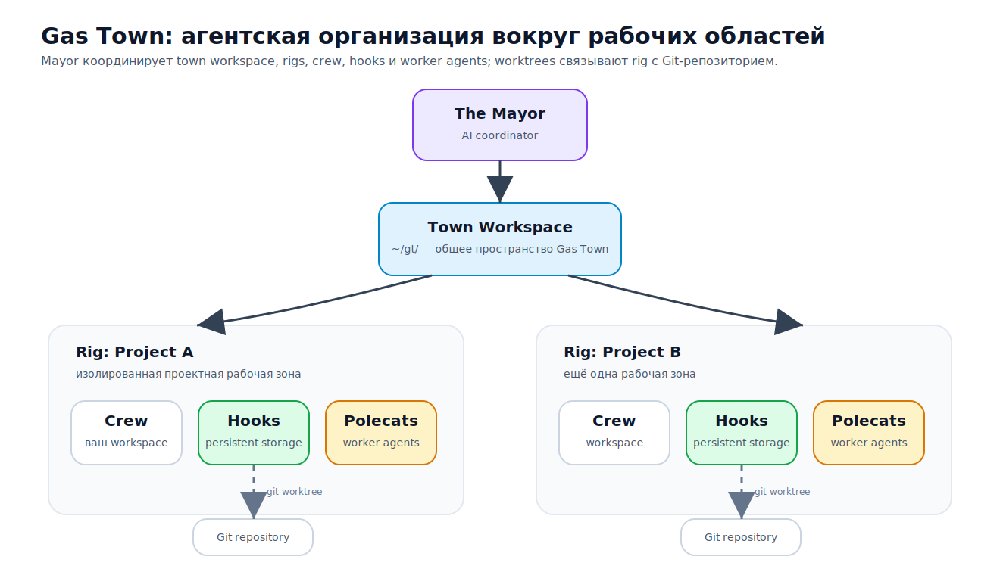
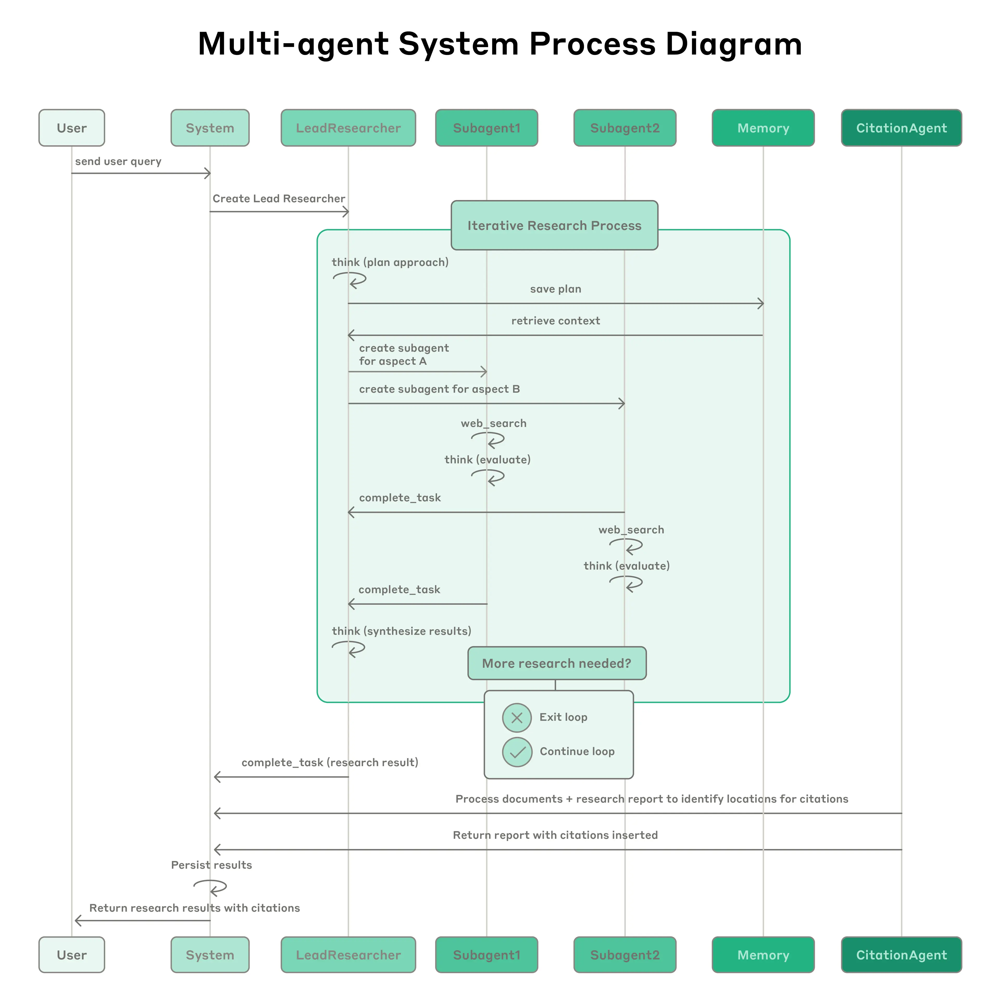

# Persistent Work Graph: устойчивое состояние работы вне сессии агента

Какое состояние работы должно жить вне чата, вне отдельного запуска агента и вне простого списка задач, чтобы работу можно было продолжать, блокировать, передавать, проверять и восстанавливать?

Persistent Work Graph — это ответ на этот вопрос. Его не стоит понимать как обязательную покупку конкретного трекера, как требование завести графовую базу или как новую управленческую процедуру. Это минимальная внешняя структура рабочего состояния, в которой действие агента перестаёт быть только ходом разговора. У работы появляется устойчивая идентичность, зависимости, готовность, владелец, ожидания, свидетельства, история, компактный прайм для следующей сессии и путь восстановления после обрыва.

Этот слой нужен не потому, что чат плох. Чат удобен для размышления, уточнения и быстрого перехода от намерения к действию. Но чат плохо удерживает обязательства. Он не умеет сам по себе показать, что источник был только найден, но не использован; что тест запущен, но не привязан к обещанному изменению; что работа заблокирована человеческим решением; что другой агент уже взял тот же узел; что следующий исполнитель должен продолжить с последнего валидного артефакта, а не начать заново. Persistent Work Graph появляется там, где цена такого угадывания становится выше, чем цена внешнего состояния.

В этой статье Beads используется как главный практический якорь, но не как тема статьи. Beads описывает себя как трекер задач на Dolt для рабочих процессов разработки под надзором ИИ и как распределённый графовый трекер задач и постоянную структурированную память для кодовых агентов ([документация Beads](https://gastownhall.github.io/beads/), [репозиторий Beads на GitHub](https://github.com/gastownhall/beads)). Для понятия PWG важен не конкретный интерфейс Beads, а набор свойств: структурированное и версионированное состояние, зависимостная готовность, закрепление работы, долговечные gate-условия, компактное восстановление контекста и диагностика сбоя.

## Контракт статьи: что здесь считается Persistent Work Graph

У статьи узкий контракт. Она не является обзором продукта Beads, не пересказывает Gas Town и не предлагает реализацию TypeScript-оркестратора. Persistent Work Graph здесь — концептуально-техническая форма устойчивого состояния работы: минимальная структура, благодаря которой работу можно честно продолжить после обрыва сессии, смены исполнителя, сжатия контекста, параллельной попытки, открытого gate-условия или незавершённого пакета свидетельств.

Границы нужны не для терминологической чистоты, а для практического выбора режима:

| PWG не равен | Почему это другая вещь | Что PWG всё же берёт на границе |
| --- | --- | --- |
| обзор продукта Beads | Beads — конкретный инструмент с Dolt, CLI/MCP, маршрутизацией, ограничениями плагинов и эксплуатационными решениями. | Beads проверяет механизм: состояние получает хранилище, команды, зависимости, очередь готовой работы, историю, прайм и восстановление. |
| операционная модель Gas Town | Gas Town добавляет Town/Rig, Mayor, Crew, Polecats, Convoys, Refinery, Witness, очереди, mail, наблюдаемость и интерфейс человеческого управления. | PWG объясняет нижний слой, на котором такая среда может видеть работу как долговечные узлы. |
| процессный профиль BMAD/GSD | Процессный профиль задаёт фазы, роли, документы, проверки и порядок действий. | PWG удерживает последствия этих фаз как состояние: готовность, владелец, gate-условие, свидетельство, восстановление. |
| обычный трекер задач | Обычный трекер показывает задачи, отношения и статусы, но не обязательно знает состояние источников, компактный прайм, ожидания по свидетельствам и агентное восстановление. | PWG наследует идентичность рабочего элемента, историю, blocked/blocking и иерархию как базовый минимум. |
| долговечное выполнение | LangGraph, Temporal, DBOS, Restate и похожие слои возобновляют конкретный запуск или рабочий процесс. | PWG связывает запуск с работой: что существует, что готово, кто владеет, что ждёт, чем закрывается. |
| CRDT/совместный редактор | Общая редактируемая структура может сводить изменения и предотвращать часть конфликтов записи. | PWG всё равно требует смыслового слияния, gate-условий, свидетельств и владельца принятия. |
| План реализации нашего TS-loop | Документный процесс здесь используется как проверочный пример, а не как спецификация продукта. | Его `job/pass/gate/prime/recovery` показывает, какие поля нужны любому долговечному рабочему состоянию. |

Такой контракт позволяет статье быть самостоятельной: читатель может прийти от конкретной концепции и понять, зачем нужен PWG, не собирая его из глав теории. Но статья не должна захватывать соседние статьи атласа. Beads остаётся якорем механизма, Gas Town — верхней организационной средой, GSD/BMAD — процессными профилями, долговечное выполнение — соседним слоем среды выполнения, а CRDT/STORM-подобные подходы — механизмами конкурентной записи и координации, которые не заменяют рабочее состояние.

## Где PWG стоит в жизненном цикле изменения

Читателю не нужно знать весь словарь атласа, чтобы пользоваться понятием PWG. Достаточно одной карты. Изменение начинается как намерение: «исправить баг», «написать раздел», «перенести API», «проверить источник». Потом появляется решение или спецификация: что именно обещано, где границы, какой риск. Затем начинается рабочее состояние: какие части работы существуют, что готово, что заблокировано, кто владеет узлом, какое gate-условие нужно пройти и какие свидетельства потребуются. После этого идёт исполнение: агент открывает файлы, запускает команды, работает в devbox, браузере, движке рабочего процесса или обычной оболочке. Только затем появляются свидетельства: diff, тесты, источники рядом с тезисами, скриншоты, CI, ревью, проверки паритета. Завершение наступает не потому, что агент написал «готово», а потому что владелец принятия сопоставил свидетельства с обещанием изменения и закрыл остаточный риск.

PWG занимает середину этой цепочки:

```text
намерение / спецификация → PWG-узел работы → запуск выполнения → пакет свидетельств → принятие / ремонт
```

Это место кажется скромным, но именно оно чаще всего пропадает в агентной разработке. У проекта может быть хорошая спецификация и мощная среда выполнения, но без PWG непонятно, какую работу следующий агент имеет право продолжать. У проекта может быть PR с тестами, но без PWG непонятно, какой исходный узел он закрывает и какие зависимые узлы теперь стали `ready`. У документа может быть список источников, но без PWG непонятно, какие источники уже перенесены в основной текст, а какие остались рабочим долгом.

Минимальная история выглядит так. Рабочий сигнал превращается в узел с идентичностью. Его зависимости решают, попадёт ли он в очередь готовой работы. Исполнитель оформляет закрепление (`claim`) и получает право действовать в рамках узла. Gate-условие останавливает переход, если требуется человек, CI, источник, таймер, PR или другой рабочий узел. Исполнение создаёт артефакты, но не закрывает работу автоматически. Пакет свидетельств переводит узел в состояние `review`. Владелец принятия переводит его в `accepted`, `rejected`, `blocked` или `recovering`. Прайм и восстановление позволяют следующей сессии продолжить не из памяти чата, а из последнего устойчивого состояния.


Эти различия не являются классификацией ради классификации. Каждый соседний слой отвечает на другой рабочий вопрос:

| Соседний слой | Какой вопрос он закрывает | Что остаётся за PWG |
| --- | --- | --- |
| трекер задач | Какая задача открыта, что обсуждалось, кто в проекте видит blocked/blocking или sub-issues. | Какую часть работы можно продолжать сейчас, какой снимок действителен, кто сделал закрепление (`claim`), какие gate-условия, свидетельства и восстановление относятся к узлу. |
| долговечное выполнение | Где остановился конкретный рабочий процесс, запуск или поток и как возобновить его контрольные точки, таймеры, сигналы или ожидающие записи. | Какой рабочий элемент этот запуск обслуживает, что означает результат запуска и кто может принять переход состояния. |
| CRDT/совместный редактор | Как несколько авторов могут сходиться на уровне общего состояния или текста. | Что является правильным смысловым слиянием, какие источники, решения и свидетельства конфликтуют и кто закрывает остаточный риск. |
| STORM/проверка при записи | Можно ли записывать из данного снимка чтения, не устарели ли файл или зависимость чтения. | Что вообще разрешено писать, какой узел владеет записью, что делать после отклонения и какое gate-условие нужно перед канонической записью. |
| MAST-подобный анализ сбоев | Почему многоагентные системы срываются из-за коммуникации, предположений и организационного дизайна. | Как сделать владение, ожидания, передачу, эскалацию и свидетельства устойчивыми объектами, а не надеждой на хорошую координацию. |
| Gas Town | Как устроить операционную среду вокруг многих агентов, ролей, очередей, convoys, mail, наблюдаемости и интерфейса человеческого управления. | Как отдельная рабочая единица остаётся продолжимой внутри или вне такой среды. |

Граница проверяется простым тестом. Если вопрос звучит «где остановился запуск?», это среда выполнения/долговечное выполнение. Если вопрос звучит «как не смешать две параллельные записи?», это слой worktree, CRDT или STORM-подобной проверки. Если вопрос звучит «как человек управляет множеством агентов и обратным давлением?», это Gas Town-подобная среда. Если вопрос звучит «что следующий исполнитель имеет право продолжать, что его блокирует, чем будет доказано закрытие и как восстановиться после обрыва?», это PWG.

## Почему отчёт «сделано много» не является состоянием работы

Типичный сбой длинной агентной работы выглядит мирно. Агент сообщает, что он многое сделал. В стенограмме есть план, несколько промежуточных объяснений и финальный абзац с уверенностью. Но когда сессия оборвалась, контекст сжался или работу должен продолжить другой исполнитель, оказывается, что этого недостаточно. Нельзя быстро понять, какие части действительно завершены, какие только начаты, какие проверены тестом, чтением источника или ревью, где лежат артефакты, какая версия документа была входом, какие источники уже перенесены в канонический текст, что ждёт человека, что ждёт CI, а что зависло из-за другой задачи.

Разовый список TODO решает только часть проблемы. Он показывает намерение, но не доказывает состояние. Markdown-план может сказать: «проверить источник», но он не всегда знает, был ли источник открыт, прочитан, использован, отвергнут или оставлен как кандидат на изображение. Стенограмма может содержать ход рассуждения, но она не является устойчивым интерфейсом для следующего агента: в ней нет вычислимой готовности, формального владельца, долговечного ожидания, запрета на параллельную запись и компактного входа для восстановления.

PWG начинается там, где нужно отличить текст объяснения от состояния работы. Комментарий, заметка передачи и отчёт остаются важными, но они должны жить рядом с формальными полями: статусом, зависимостями, владельцем, блокировками, gate-условиями, свидетельствами и историей. Иначе следующий исполнитель читает объяснение, но не видит права на действие.


Проблема становится точнее, если разложить её по потерянным свойствам:

| Носитель | Что он хорошо держит | Что он теряет в длинной агентной работе |
| --- | --- | --- |
| Чат | Локальную траекторию внимания, уточнение, быстрый ответ. | Устойчивую идентичность работы, машинную готовность, историю статусов, право записи и компактное восстановление после смены сессии. |
| Стенограмма | След действий и объяснений. | Вычислимую зависимость, владелец/`claim`, активное gate-условие, текущий статус и ответ «что можно делать сейчас?». |
| Markdown TODO | Намерение и грубый порядок шагов. | Блокирующие зависимости, атомарное закрепление, требования к свидетельствам, проверку устаревшего чтения и восстановление. |
| Обычная issue | Идентичность, обсуждение, историю, иногда отношения blocked/blocking. | Агентно-удобный прайм, состояние источников, различение наблюдения/свидетельства, условия передачи и восстановление после сжатия контекста. |
| Локальный план | Декомпозицию задачи и критерии. | Право продолжения после обрыва, историю переходов, состояние внешних ожиданий, синхронизацию с параллельной работой и очистку. |

В терминах жизненного цикла изменения это означает: промпт не является единицей анализа. Изменение проходит через намерение, спецификацию, решение, рабочее состояние, исполнение, свидетельства, завершение и сопровождение; агент полезен там, где этот цикл удержан вне краткой памяти чата — в документах, графе задач, рабочем дереве, журналах, тестах, PR, правилах доступа и человеческих точках решения. Поэтому PWG не конкурирует с хорошим запросом. Он фиксирует тот слой жизненного цикла, который запрос не может честно удержать: продолжимость работы после исчезновения текущего исполнителя.

## Минимальная единица: работа как долговечный объект

Рабочий элемент в PWG должен иметь устойчивую идентичность. Пока задача существует только как строка в запросе, она исчезает вместе с контекстом. Если она живёт как адресуемый объект, её можно продолжать, блокировать, передавать и проверять. В разных системах это выглядит по-разному: bead с идентификатором на основе хеша, issue в GitHub или Linear, запись в `tasks.json`, объект `job` в оркестраторе, узел документного процесса. Технология хранения вторична. Важно, что элемент сохраняет свою идентичность после закрытия вкладки, перезапуска агента или смены исполнителя.

Узел PWG отвечает на несколько практических вопросов:

| Вопрос | Что хранит граф |
| --- | --- |
| Что это за работа? | Идентификатор, краткая формулировка, целевой артефакт, границы изменения. |
| От чего она зависит? | Блокирующие и неблокирующие зависимости, связи parent/child, внешние ожидания. |
| Можно ли её брать сейчас? | Очередь готовой работы, статус блокеров, устаревание входного снимка. |
| Кто имеет право писать? | Владелец, pin/claim/lock, правила передачи и восстановления. |
| Что ждём? | Подтверждение человека, таймер, CI/run, PR, bead/issue, аудит источника, языковая проверка. |
| Чем подтверждается завершение? | Diff, тест, ревью, ссылка на источник, цитатный аудит, скриншот, отчёт проверки. |
| Как продолжать после сбоя? | Последний успешный шаг, прайм, артефакты, заметка восстановления, запрет сброса заново без `force`. |

Это не обязательно «графовая база». Графом работу делает не тип базы данных, а наличие отношений, которые меняют поведение системы. Если зависимость не влияет на готовность, если gate-условие не блокирует продвижение, если владелец не предотвращает дублирующую запись, то граф остаётся декорацией. Он может выглядеть зрелым, но фактически остаётся списком заметок.

Минимальный узел работает как механизм, только если эти поля меняют следующий допустимый шаг. Сначала из спецификации, issue или рабочего сигнала появляется рабочий элемент с границей изменения и ссылкой на исходный смысл. Затем зависимости определяют, попадает ли он в очередь готовой работы. Если узел готов, исполнитель оформляет закрепление (`claim`): теперь другой агент не должен молча писать тот же участок. Во время работы комментарии и история не заменяют состояние, а объясняют переходы состояния. Если появляется подтверждение человека, CI, PR, аудит источника или ожидание другой задачи, оно становится контрольным условием, то есть gate-условием, которое блокирует следующий переход.

Передача переносит не настроение исполнителя, а право продолжать: входной снимок, уже созданные артефакты, открытые gate-условия, риски и следующий допустимый шаг. Компактный прайм вводит новую сессию в это рабочее состояние без полного перечитывания всего проекта. Восстановление возвращает узел из последнего валидного состояния, если закрепление зависло, gate-условие было обойдено, артефакт создан не там или текущий исполнитель исчез. Пакет свидетельств связывает переход `done`, `review`, `accepted` или `blocked` с доказательством, а не с уверенностью агента.

Эта последовательность важнее названий полей. Если рабочий элемент существует, но нет очереди готовой работы, система не знает, что можно брать. Если есть очередь готовой работы, но нет закрепления (`claim`), параллельность превращается в гонку. Если есть закрепление (`claim`), но нет gate-условия, агент может продолжить через человеческое решение. Если есть gate-условие, но нет свидетельства, статус закрывается по словам. Если есть свидетельство, но нет прайма и восстановления, следующий исполнитель всё равно восстанавливает работу по стенограмме. Persistent Work Graph появляется только тогда, когда вся цепочка делает работу продолжимой: от исходного обещания до проверяемого перехода состояния.

Один возможный минимальный фрагмент схемы помогает увидеть, почему это уже не TODO:

```json
{
  "work_item_id": "pwg-132",
  "title": "Усилить раздел про очередь готовой работы",
  "target": "work/atlas/articles/persistent_work_graph.md#dependencies-ready-queue",
  "state": "ready|claimed|blocked|waiting_gate|review|accepted|rejected|recovering",
  "claim": { "owner": "agent-a", "since": "2026-06-13T10:15:00Z", "scope": ["section:dependencies"] },
  "dependencies": [
    { "id": "pwg-101", "type": "blocks", "status": "closed" },
    { "id": "source-audit-07", "type": "waits-for", "status": "open" }
  ],
  "gates": [
    { "id": "citation-audit", "resolver": "reviewer", "status": "open", "evidence_required": ["inline_source_links"] }
  ],
  "evidence": [
    { "kind": "source_transfer_ledger", "path": "persistent_work_graph_source_transfer_ledger.md", "status": "attached" }
  ],
  "prime": { "last_valid_pass": "P08", "next_action": "continue_from_ready_queue" },
  "recovery": { "last_valid_artifact": "persistent_work_graph.md", "stale_if": ["target_changed", "ledger_changed"] }
}
```

Такой объект не диктует формат хранения. Он показывает семантику. `ready` не равно «кто-то сказал, что можно»: оно означает, что блокирующие зависимости закрыты, закрепление (`claim`) либо отсутствует, либо принадлежит текущему исполнителю, gate-условия не блокируют вход в работу, а входной снимок не устарел. `claimed` не равно «агент сейчас пишет»: оно означает, что право записи ограничено и его можно восстановить или отозвать. `review` не равно «модель считает готовым»: оно означает, что пакет свидетельств приложен и ожидает владельца принятия. `recovering` не равно «начать сначала»: оно означает, что есть последний валидный артефакт и механическое правило продолжения.

В слабой системе эти различия скрыты в прозе. В PWG они становятся переходами состояния. Поэтому важны не только поля, но и запрещённые переходы: нельзя перейти из `claimed` в `accepted` без gate-условий и свидетельства; нельзя перейти из `blocked` в `ready`, если блокирующая зависимость всё ещё `open`; нельзя заменить закрепление другого исполнителя без передачи или события восстановления; нельзя закрыть узел с плотной работой по источникам, если состояние источников осталось `opened` или `read`, но не `used_in_main_text` / `rejected_with_reason` / `candidate_image_only`.

Практический контрольный тест простой: изменение поля в PWG должно менять допустимое поведение. Закрытая зависимость должна выпускать следующий узел в очередь готовой работы. Открытое gate-условие должно реально блокировать переход. Закрепление должно менять право записи. Пакет свидетельств должен быть проверяемой причиной перехода в `review` или `accepted`. Прайм должен указывать, откуда продолжать, а восстановление — куда откатиться при сбое. Если поле ничего не запрещает, не разрешает, не восстанавливает и не объясняет, оно относится к заметкам вокруг работы, а не к самому Persistent Work Graph.

## Зависимости и очередь готовой работы

Главная разница между списком задач и PWG — готовность вычисляется из состояния, а не из самооценки агента. Если задача B зависит от A, система должна показать, что B пока нельзя брать, а после закрытия A — что B стала доступной. Beads делает это через типы зависимостей и команды вроде `bd ready`, `bd blocked`, `bd dep cycles` и `bd graph`; блокирующими могут быть `blocks`, `parent-child`, `conditional-blocks`, `waits-for`, а неблокирующими — `related`, `tracks`, `discovered-from`, `caused-by`, `validates`, `supersedes` ([зависимости Beads](https://github.com/gastownhall/beads/blob/main/docs/DEPENDENCIES.md)).

Для агентной разработки это критично. Агенту недостаточно увидеть, что задачи «связаны». Ему нужен ответ: можно ли работать сейчас? Если такого ответа нет, агент либо спрашивает человека по каждому шагу, либо преждевременно делает неготовую работу. Обычный issue tracker может показать отношение blocked/blocking, и это уже важная базовая практика: GitHub поддерживает issue dependencies и sub-issues, Linear поддерживает отношения blocked/blocking/related/duplicate ([зависимости issue в GitHub](https://docs.github.com/en/issues/tracking-your-work-with-issues/using-issues/creating-issue-dependencies), [sub-issues в GitHub](https://docs.github.com/en/issues/tracking-your-work-with-issues/using-issues/adding-sub-issues), [связи issue в Linear](https://linear.app/docs/issue-relations)). Но PWG требует, чтобы эта связь была не только визуальной, а операционной: она должна направлять следующего агента.

`bd ready` и `bd blocked` здесь полезны как простая проверка смысла. Первая команда показывает работу без открытых блокирующих зависимостей; вторая объясняет, что именно держит узел. Но `ready` не означает `completed`: узел может быть готов к началу, ждать свидетельств после чернового результата или требовать владельца принятия после зелёного теста. Очередь готовой работы отвечает только на вопрос, можно ли брать следующий шаг, а не на вопрос, можно ли уже строить зависимые решения на результате.

В многопроходном документном процессе это видно особенно просто. Проход по глубине источников должен завершиться до синтеза. Языковой проход должен идти после переноса фактуры, а не вместо него. Замена канонического файла должна ждать отчёта о различиях и gate-условия человека. Упавший проход должен перейти в восстановление, а не запускать весь процесс заново. Если всё это записано только в инструкции, следующий исполнитель легко нарушит порядок. Если это часть графа работы, порядок становится проверяемым.

## Владение, передача и право записи

PWG нужен не только для зависимостей, но и для права действия. Когда несколько агентов видят одну и ту же свободную задачу, они могут одновременно решить, что она их. После сбоя человек не понимает, кто должен продолжать, какую версию считать последней и чья правка имеет приоритет. Beads показывает практическую форму такого контроля: закрепление работы за агентом, `bd hook`, последовательная передача, fan-out/fan-in, резервирование файлов и блокировки issues ([координация нескольких агентов в Beads](https://gastownhall.github.io/beads/multi-agent/coordination)).

Передача не должна быть только фразой «передаю тебе». Она должна переносить право и контекст. Минимальная передача говорит: какой узел передаётся; какой входной снимок был использован; что уже сделано; какие артефакты появились; какие gate-условия открыты; какие файлы можно менять; что должен вернуть следующий исполнитель; при каких условиях узел можно закрыть. Если такой записи нет, следующая сессия продолжает через догадку.

Владение также помогает не перепутать ответственность. Агент может обновить статус узла, но не должен автоматически присваивать себе право принять архитектурное решение, закрыть ревью, опубликовать архив или считать спорный текст готовым. PWG должен различать право писать, право проверять и право принимать риск.

## Gate-условие как долговечное ожидание, а не просьба в запросе

Человеческое решение, CI, PR-ревью, таймер, внешняя зависимость и аудит источника часто ведут себя одинаково: работа не может двигаться дальше, пока событие не произошло. В слабом процессе это формулируется как текстовая просьба: «спроси пользователя», «дождись тестов», «проверь ссылку». В PWG это должно быть долговечным объектом ожидания.

`bd gate` в Beads моделирует такие ожидания явно: gate-условие может быть `human`, `timer`, `GitHub run`, `GitHub PR` или `bead`; `bd gate check` проверяет условия, а GitHub-gate использует `gh` CLI для состояния run или PR ([bd gate](https://gastownhall.github.io/beads/cli-reference/gate)). Это важно не как конкретная команда, а как форма: ожидание хранится вне чата и блокирует продолжение.

Соседний слой виден в подходе Temporal Human-in-the-Loop: агентный рабочий процесс может остановиться на рискованном действии и ждать человеческого подтверждения через Signal, сохраняя долговечное ожидание, таймеры и аудиторский след ([Temporal Human-in-the-Loop AI Agent](https://docs.temporal.io/ai-cookbook/human-in-the-loop-python)). Temporal описывает долговечное выполнение, а не PWG в строгом смысле, но пример показывает: «ждать человека» не обязано быть открытой вкладкой с чатом. Это может быть состояние процесса.

Для PWG gate-условие должно отвечать на практические вопросы: что именно блокируется, кто может снять блокировку, какое свидетельство требуется, что делать при тайм-ауте, можно ли обойти ожидание вручную, какой аудит остаётся после обхода. Без этого агент легко имитирует прогресс: пишет следующий раздел, хотя источник не проверен, тест не прошёл или человек ещё не принял решение.

Минимально такое ожидание хранит четыре вещи: заблокированный переход, того, кто или что может снять блокировку, свидетельство после снятия и действие на случай отказа, тайм-аута или ручного обхода. Это важно именно как ограничение следующего шага. CI, PR-ревью или человеческое «да» могут снять ожидание, но сами по себе не делают работу принятой.

## Прайм: компактное восстановление рабочего состояния

Граф работы не решает сам по себе проблему контекстного окна. Если следующий агент должен перечитать весь репозиторий, все логи и все промежуточные артефакты, граф уже не помогает. Нужен компактный вход для восстановления: что происходит сейчас, какая работа активна, что готово, что заблокировано, какой следующий шаг допустим, какие ограничения нельзя нарушать.

Beads даёт практический якорь через `bd prime`: команда формирует оптимизированный для Markdown-контекст для ИИ; `--mcp` даёт компактную справку, а вывод CLI рассчитан на Claude Code, Gemini CLI и Codex SessionStart после сжатия контекста ([bd prime](https://gastownhall.github.io/beads/cli-reference/prime)). Для PWG это лучше читать как ориентир: прайм должен быть коротким вводом, условно на одну-две тысячи токенов, чтобы его можно было дать новой модели в начале сессии. Но он должен быть достаточно конкретным, чтобы модель не начинала с нуля.

В документном процессе прайм должен включать не пересказ всей теории, а минимальные сведения для продолжения: текущую работу, целевой файл, последний успешный проход, открытые блокеры, допустимые пути записи, состояние источников, ожидаемые сопутствующие файлы, контрольные ожидания, текущие долги, владельца следующего шага, путь восстановления и прямой запрет на сброс с чистого листа без явного решения. Хороший прайм не делает агента «умнее» и не заменяет чтение источников. Он уменьшает вероятность, что агент начнёт не ту работу с неправильного состояния.

## Восстановление и эксплуатационная дисциплина

Устойчивое состояние не отменяет сбои. Оно делает их диагностируемыми. Документация Beads по восстановлению строит инструкции вокруг симптома, диагностики, решения и профилактики; быстрая диагностика начинается с `bd status`, `bd doctor`, `bd blocked` ([обзор восстановления Beads](https://gastownhall.github.io/beads/recovery)). Architecture добавляет рабочие процедуры с `bd dolt stop`, `git worktree prune`, `bd dolt pull`, `bd dolt start` и предупреждение, что автоматические команды исправления требуют осторожности и резервной копии ([архитектура Beads](https://gastownhall.github.io/beads/architecture)).

Из этого следует неприятный, но важный вывод: чем устойчивее состояние, тем больше оно само становится объектом сопровождения. Неправильный сервер, теневая база, конфликт порта, повреждённый журнал, устаревший снимок или неверный `cwd` могут сломать не только выполнение, но и доверие к рабочему графу. Поэтому PWG должен иметь собственные правила восстановления: последний успешный шаг, сбойный шаг, ожидаемые файлы, проверка рабочего каталога, команда продолжения, запрет сброса без явного `force`, заметка восстановления и эскалация человеку.

Для агентного SDLC это особенно важно. Если агент создал артефакты в дочернем каталоге, обновил не тот файл или отметил проход завершённым без сопутствующих файлов, проблема не должна требовать ручного разбора стенограммы. Она должна быть статусом работы: `recovering`, `failed_artifact_check`, `stale_read`, `wrong_cwd`, `waiting_human`.

## Источники и промежуточные артефакты тоже имеют состояние

В программной работе состояние часто ассоциируется с задачами и кодом. В агентной документной работе состояние источника не менее важно. Ссылка может быть найдена, открыта, прочитана, использована в основном тексте, использована только как кандидат на изображение, отвергнута с причиной или требовать повторного открытия после изменения тезиса. Если это не хранится, следующий проход не знает, что уже перенесено из источника в текст.

Минимальный жизненный цикл источника выглядит так:

```text
`found` → `opened` → `read` → `used_in_main_text` → `used_in_source_register`
                       ↘ `candidate_image_only`
                       ↘ `rejected_with_reason`
                       ↘ `reopen_required`
```

Это не бюрократия ради покрытия. Источник считается перенесённым только тогда, когда факт вошёл в основной текст рядом с ссылкой, а не когда URL попал в нижний список. В противном случае сопутствующий файл создаёт видимость источниковой дисциплины, но читатель не видит, какой именно тезис держится на каком источнике. Если тезис изменился, источник может перейти в `reopen_required`: его уже открывали, но прежнего чтения больше недостаточно.

Для публичной статьи это ещё и вопрос происхождения ссылки. Рабочая заметка может помогать сбору фактуры, но опубликованная ссылка должна вести на первичный источник, если утверждение опирается на документацию, статью или репозиторий. Если первичный источник нельзя уверенно восстановить, лучше оставить долг, чем ссылаться на черновую заметку так, будто она является публикационным источником.

Работа про промежуточные артефакты формулирует близкий принцип: промежуточные продукты многошаговой агентной системы должны быть типизированными, структурированными, адресуемыми, версионированными, зависимыми и пригодными для последующих вычислений. Это не приватная цепочка рассуждений. Такие артефакты должны быть поддерживаемыми рабочими продуктами: картами свидетельств, критериями, допущениями, планами и списками нерешённых напряжений ([Intermediate Artifacts as First-Class Citizens](https://arxiv.org/abs/2605.12087)). Для PWG это означает, что реестры, карты источников, планы изображений, открытые вопросы и отчёты проходов — не мусор после работы. Они часть рабочего состояния, если будущий исполнитель должен на них опираться.

## Граф работы и граф выполнения — разные слои

PWG легко спутать с долговечным выполнением. LangGraph persistence, LangGraph interrupts, Temporal, Pydantic AI durable execution, DBOS и Restate описывают близкие, но не тождественные вещи: контрольные точки, threads, interrupts, таймеры, сигналы, resume, ожидающие записи, журналируемые steps и отказоустойчивость выполнения ([LangGraph persistence](https://docs.langchain.com/oss/python/langgraph/persistence), [LangGraph interrupts](https://docs.langchain.com/oss/python/langgraph/interrupts), [Pydantic AI durable execution](https://pydantic.dev/docs/ai/integrations/durable_execution/overview/), [DBOS Transact TypeScript](https://github.com/dbos-inc/dbos-transact-ts), [Restate durable execution](https://docs.restate.dev/concepts/durable_execution)).

Эти системы отвечают на вопрос: где остановился конкретный запуск и как его возобновить? PWG отвечает на другой вопрос: какая работа существует, кто её ведёт, что готово, что заблокировано, что ждёт человека и чем будет доказано завершение. Можно иметь долговечное выполнение без нормальной рабочей очереди. Можно иметь граф задач без контрольных точек конкретного запуска. Можно иметь Markdown-память без формальной готовности. Для зрелой агентной работы слои должны соприкасаться, но не подменять друг друга.

Практическая формула такова:

```text
граф работы: существование работы, зависимости, владелец, готовность, gate-условия
граф выполнения: состояние конкретного запуска, контрольные точки, возобновление, ожидающие записи
прайм: компактный рабочий снимок для следующей модели
пакет свидетельств: почему результат можно принять или отклонить
```

Когда эти слои смешиваются, возникают ложные гарантии. Рабочий процесс может возобновиться, но продолжить уже устаревшую задачу. Issue может быть закрыта, но без пакета свидетельств. Контекст может быть восстановлен, но без права записи. PWG нужен именно как слой, который связывает эти вещи в проверяемое состояние работы.

Полезно держать не два, а пять соседних состояний, которые часто ошибочно называют одним словом «контекст»:

| Слой состояния | Что хранит | Типичный вопрос | Что нельзя выводить только из него |
| --- | --- | --- | --- |
| Граф работы | Рабочий элемент, зависимости, `ready`/`blocked`, владелец/`claim`, gate-условие, передача, восстановление. | Что имеет право продолжаться сейчас? | Факт, что конкретный запуск технически можно возобновить. |
| Граф выполнения | Запуск/thread/рабочий процесс, контрольные точки, ожидающие записи, таймеры, логи, состояние инструментов, devbox или worktree. | Где остановилась процедура и как её перезапустить? | Что работа готова к закрытию или что исполнитель имел право менять канонический артефакт. |
| Слой свидетельств | Diff, тесты, CI, источники рядом с утверждениями, ревью, проверки паритета, сигналы rollout/canary. | Почему состояние узла может перейти в `review`, `accepted`, `rejected` или `blocked`? | Само существование работы, её приоритет, владельца принятия или допустимый следующий шаг. |
| Состояние источников | `found`, `opened`, `read`, `used_in_main_text`, `rejected_with_reason`, `candidate_image_only`, связь источника с тезисом, остаточный долг по источникам. | Какой материал уже перенесён в канонический текст, а какой только найден? | Что финальный тезис доказан: источник может быть прочитан, но не встроен или встроен не туда. |
| Координация совместной записи | Worktree, lock, reservation, CRDT/shared buffer, снимок/проверка при записи, отчёт о конфликте. | Как не потерять или не перетереть параллельную запись? | Что смысловое слияние корректно и что итоговая работа принята. |

Их нужно связывать адресами, а не смешивать. `run_id` должен ссылаться на `work_item_id`, но не становиться заменой рабочего элемента. `evidence_package_id` должен объяснять переход состояния, но не превращаться в статус `done` без владельца принятия. `source_id` должен иметь собственный жизненный цикл, потому что найденный источник может быть хорошей находкой и одновременно нулевым вкладом в текущий текст. `reservation` или CRDT-сходимость должны защищать запись, но не принимать смысловое решение за синтезирующий проход.

Отсюда следует правило проектирования: PWG не обязан хранить все байты выполнения, все логи и весь текст источника. Но он обязан хранить устойчивые ссылки и условия перехода между слоями. Если выполнение завершилось, граф работы должен знать, какой узел получил результат и что дальше: `review`, повтор, ожидание gate-условия, передача или очистка. Если источник был использован, карта состояния источников должна знать, какой тезис он поддержал. Если параллельный исполнитель вернул патч, слой совместной записи может сказать «запись не конфликтует на уровне файлов», но PWG всё равно должен отправить результат через свидетельства и принятие.

<figure class="synthetic-figure" id="fig-pwg-work-state-hub">
  <pre><code>запуск выполнения ──run_id──┐
                        │
жизненный цикл источника ─`source_id`──► рабочий элемент / PWG-узел ──переход──► ready | blocked | review | accepted
                        │              │
совместная запись ─claim/reservation──────┘              └── `evidence_package_id` + владелец принятия
</code></pre>
  <figcaption>PWG не заменяет среду выполнения, карту источников, пакет свидетельств или механизм совместного редактирования. Он связывает их устойчивыми идентификаторами и правилами перехода: запуск оставляет след, состояние источников показывает перенос факта, слой совместной записи защищает запись, свидетельства объясняют переход, а рабочий узел удерживает право продолжать и принимать результат.</figcaption>
</figure>

## Beads как якорь, но не рецепт

Beads важен для PWG потому, что собирает несколько свойств в одном практическом месте. Dolt выступает источником истины: записи попадают в историю, база даёт branch/merge/diff/push/pull на уровне SQL, серверный режим нужен для нескольких авторов записи, встроенный режим — для CI, контейнеров и одноразовых сценариев ([архитектура Beads](https://gastownhall.github.io/beads/architecture)). Зависимости влияют на готовность. Gate-условия блокируют асинхронные ожидания. Multi-agent coordination задаёт pinning, hooks, handoff, fan-out/fan-in и locks. `bd prime` возвращает компактный контекст.

<figure class="image-asset" id="fig-pwg-beads-task-graph-memory">
  
  <figcaption>Локальный ассет показывает Beads как близкий практический якорь PWG: задача становится узлом с зависимостями, claim-состоянием, очередью готовой работы и компактным входом для следующего агента.</figcaption>
</figure>

Здесь важен не перечень команд, а то, какие свойства PWG становятся видимыми в инструменте. Каждая строка ниже отвечает на вопрос «какое поведение рабочего состояния это проверяет?», а не на вопрос «какую фичу Beads стоит повторить»:

| Свойство PWG | Как Beads делает его видимым | Что это проверяет в механизме |
| --- | --- | --- |
| Устойчивая идентичность рабочего элемента | Issue/bead с идентификатором на основе хеша и историей состояния. | Работа не исчезает вместе с запросом или стенограммой. |
| Структурированное хранилище | Dolt как источник истины, SQL-состояние, история, branch/merge/diff/push/pull. | Состояние можно запрашивать, синхронизировать, сравнивать и восстанавливать. |
| Готовность | `bd ready`, `bd blocked`, блокирующие типы зависимостей и проверка циклов. | Следующий шаг выбирается из графа, а не из самоотчёта агента. |
| Граф связей | `bd graph`, блокирующие/неблокирующие связи, parent/child, `waits-for`, `validates`, `supersedes`. | Связь между задачами влияет на порядок и объясняет блокировку. |
| Владение/закрепление/передача | Pin/claim, `bd hook`, multi-agent coordination, fan-out/fan-in, locks. | Параллельные агенты не должны молча брать один и тот же узел. |
| Gate-условие | `bd gate` с `human`, `timer`, `GitHub run`, `GitHub PR` и `bead`. | Ожидание становится долговечным блокером, а не просьбой в запросе. |
| Компактное восстановление | `bd prime`, в том числе интеграция с hooks после сжатия контекста. | Следующая сессия получает рабочий снимок состояния без полного перечитывания. |
| Маршрутизация и hydration | `.beads/routes.jsonl`, проверки маршрутов, внешние зависимости, `bd hydrate`. | Работа может выходить за один репозиторий, но оставаться связанной. |
| Операционная диагностика | инструкции восстановления, `bd status`, `bd doctor`, `bd blocked`, диагностика сервера, базы, синхронизации и repair-процедур. | Устойчивое состояние само требует обслуживания и наблюдаемости. |

Эта таблица намеренно не превращает Beads в образец «правильного продукта». Она проверяет переносимый механизм. Если другая система умеет дать стабильную идентичность, готовность из зависимостей, закрепление, долговечное gate-условие, прайм, закрытие, подкреплённое свидетельствами, и восстановление, она может выполнять роль PWG без Dolt. Если система имеет Dolt, CLI и красивые команды, но зависимости не блокируют работу, закрепление не меняет право записи, gate-условие не удерживает переход, а восстановление не знает последнего валидного состояния, она остаётся театром графа.

Эксплуатационные ограничения Beads также важны для честного чтения. Dolt-подобное хранилище добавляет синхронизацию, серверный и встроенный режимы, риск теневой базы, портовые конфликты, осторожность вокруг команд исправления и необходимость восстановления после повреждений; маршрутизация и многоагентная координация добавляют ещё один слой диагностики. Для PWG отсюда следует общее правило: долговечное состояние не устраняет сбои, а делает их видимыми и требующими собственного сопровождения.

Но переносимый механизм не равен требованию использовать Beads. У Beads есть конкретные ставки: Dolt, CLI/MCP, локальная база, синхронизация, Git-подобная семантика, repair-процедуры. В его Architecture также названы границы: для больших команд, совместной работы в реальном времени, неразработческих рабочих процессов, богатых вложений и межрепозиторного трекинга может быть лучше смотреть на GitHub Issues, Linear или Jira ([архитектура Beads](https://gastownhall.github.io/beads/architecture)).

Поэтому статья о PWG использует Beads как проверку механизма, а не как рекламный обзор. Вопрос не «почему Beads лучше трекера?». Вопрос: какие свойства делают агентную работу продолжимой после исчезновения текущей сессии? Beads показывает один сильный ответ. Taskmaster показывает более лёгкий файловый вариант: `tasks.json`, отдельные файлы задач, `dependencies`, `priority`, `details`, `testStrategy`, `tm next`, `tm list --ready`, `tm clusters`, теги и автоматический `tm loop` ([структура задач Taskmaster](https://tryhamster.com/docs/taskmaster/capabilities/task-structure), [зависимости Taskmaster](https://tryhamster.com/docs/taskmaster/task-workflow/dependencies), [теги Taskmaster](https://tryhamster.com/docs/taskmaster/task-workflow/tags), [цикл Taskmaster](https://tryhamster.com/docs/taskmaster/automation/loop)). GitHub и Linear показывают массовый минимум. PWG — не один продукт, а критерий внешней рабочей формы.

## Где проходит граница с Gas Town

Gas Town — не синоним PWG. Gas Town показывает организационно-операционную среду: Town/Rig, Mayor, Crew, Polecats, Convoys, Refinery, Witness, Deacon, Dogs, очереди, mail, передачу, видимость проблем и человеческое управление потоком. PWG — слой устойчивого состояния работы внутри такой среды. Beads может быть частью Gas Town, но понятие PWG должно оставаться уже: это не весь город, а рабочий граф, который делает задачи, зависимости, владельцев, gate-условия, передачу, свидетельства и восстановление видимыми. Короткая граница такая: PWG даёт долговечность отдельной работы, а Gas Town добавляет долговечность организации вокруг многих работ.

<figure class="image-asset" id="fig-pwg-gastown-architecture-boundary">
  
  <figcaption>Эта локальная схема нужна не для пересказа Gas Town, а для границы: PWG описывает устойчивый рабочий граф внутри такой среды, тогда как Gas Town добавляет роли, рабочие зоны, очереди, hooks, исполнителей и человеческую координацию.</figcaption>
</figure>

Граница полезна практически. Если проблема в том, что конкретная работа теряет состояние между сессиями, нужен PWG. Если проблема в том, что команда уже управляет множеством временных исполнителей, ролями, очередью слияния, обратным давлением, наблюдаемостью, восстановлением сессий и стоимостью человеческого понимания, мы выходим к Gas Town-подобной организации. Gas Town-досье подчёркивает: полная Gas Town-среда дорогая, хаотичная, требует зрелого пользователя, постоянного ручного управления и отдельной системы наблюдения ([Welcome to Gas Town](https://steve-yegge.medium.com/welcome-to-gas-town-4f25ee16dd04), [репозиторий Gas Town на GitHub](https://github.com/gastownhall/gastown)). Поэтому статья о PWG не должна превращаться в рекомендацию «используйте Gas Town».

Ошибка возникает в обе стороны. Назвать любую дисциплинированную процедуру PWG — значит раздуть понятие. Назвать всю агентную организацию PWG — значит спрятать социальную и операционную часть: кто видит проблемы, кто будит застрявших исполнителей, кто сливает, кто откатывает, кто держит обратное давление и кто принимает риск.

Поэтому здесь стоит остановиться на этом разрезе. Роли, патрули, merge-очереди, mail-маршрутизация и интерфейс Mayor принадлежат соседней статье о Gas Town, если они не помогают объяснить состояние отдельной рабочей единицы.

## Параллельность: общий граф не отменяет смысловое слияние

PWG помогает параллельным агентам видеть готовность, владение и передачу работы. Он не гарантирует, что параллельные правки будут семантически совместимы. Это особенно важно, потому что «у нас есть общий граф» легко превращается в разрешение запускать больше исполнителей.

CodeCRDT показывает сильную, но ограниченную модель координации через общее сходящееся состояние: агенты наблюдают обновления, используют TODO-протокол закрепления и движутся через детерминированно сходящееся общее состояние. Результаты при этом неоднозначны: в оценках эффект варьировал от ускорения до замедления, а семантические конфликты сохранялись несмотря на сходимость на уровне символов ([CodeCRDT](https://arxiv.org/abs/2510.18893)). STORM решает соседний класс проблем через снимки чтения, проверку на момент записи, резервирования и пометки намерения, отклоняя запись, если файл или зависимость устарели ([статья STORM](https://arxiv.org/html/2604.09003v1), [репозиторий STORM на GitHub](https://github.com/haipham2306/STORM-CodeAgent)). MAST добавляет отрицательную проверку: сбои многоагентных LLM-систем часто возникают из-за организационного дизайна и координации, а не только из-за слабости отдельной модели ([MAST](https://arxiv.org/abs/2503.13657)).

Вывод для PWG простой: граф работы не является CRDT-редактором, файловым посредником или магическим слиянием смысла. Он должен задавать, кто что взял, что готово, что заблокировано, какие снимки чтения действительны и какие gate-условия нужны перед записью. Но после независимых исполнителей всё равно нужен синтезирующий проход: проверить дублирование, противоречия, устаревшие источники, стиль и границы тезиса. Сходимость файла не равна согласованности решения.

## Модель для многопроходного документного процесса

Многопроходное письмо теории само является хорошей проверкой PWG. В таком процессе легко объявить проход завершённым, но потерять источник; создать отчёт, но не обновить канонический текст; выполнить языковую правку до переноса фактуры; запустить следующее задание из неправильного каталога; начать заново после обрыва; забыть, что внешний кандидат на изображение требует отдельного прохода по ассетам.

Этот пример нужен не как внутренний отчёт о написании статьи. Он показывает переносимость понятия: даже там, где нет привычного баг-трекера, работа всё равно имеет допустимый следующий шаг, владельца записи, входные снимки, gate-условия, состояние источников и критерии закрытия.

Минимальная модель может быть файловой, без Dolt. Но она должна иметь настоящие рабочие примитивы:

```json
{
  "job_id": "persistent-work-graph-article",
  "target_doc": "work/atlas/articles/persistent_work_graph.md",
  "state": "ready|running|blocked|waiting_human|recovering|done|failed",
  "owner": "assistant-run",
  "allowed_paths": ["work/atlas/articles/**"],
  "current_pass": 1,
  "next_action": "continue_from_last_successful_pass",
  "gates": [],
  "recovery": {}
}
```

Проход должен хранить входы, выходы, статус, использованные источники, кандидаты на изображения, артефакты, проверки и подсказку следующего шага. Gate-условие должно хранить, что блокируется, кто или что может разрешить блокировку, какое свидетельство требуется и статус `open|passed|failed|waived`. Карта состояния источников должна хранить не просто URL, а факт переноса. Состояние изображения должно различать `synthetic_figure`, `local_image_asset`, `external_real_image_candidate` и `editorial_visual_idea`.

Пороговая рекомендация из досье остаётся практичной: начинать можно с дисциплинированных JSON/Markdown/статус-файлов, если есть строгие проверки и аудиторский след. SQLite или Dolt-подобное хранилище становится оправданным, когда появляются настоящие параллельные авторы записи, конфликтующие gate-условия, насыщенные запросами представления статуса или необходимость сравнивать ветки состояния. Иначе слой хранения начнёт съедать внимание раньше, чем появилась реальная боль.


Как второе доказательство понятия, документный процесс показывает, что PWG шире привязанного к конкретному продукту графа задач. Здесь нет пользовательского баг-трекера в привычном смысле, но есть работа, которую нужно продолжать через проходы, источники, редакторские решения и сопутствующие файлы. Если такая работа представима как состояние, а не только как инструкция, значит PWG описывает переносимую форму.

Минимальная переносимая модель выглядит так:

| Элемент | Что хранит | Почему это состояние работы, а не план |
| --- | --- | --- |
| `job` | идентификатор статьи, целевой документ, базовый снимок, разрешённые пути, владелец, текущий проход, следующее действие, состояние. | Следующий исполнитель знает, что именно продолжается и относительно какой базы. |
| `pass` | файл задания, входы только для чтения, статус, ожидаемые результаты, использованные источники, кандидаты на изображения, локальная дельта, проверки. | Проход можно повторить, проверить, отклонить или передать без реконструкции из чата. |
| `gate` | ответственный за снятие, блокируемый переход, обязательные свидетельства, статус, заметка об обходе или эскалации. | Ревью человека, языковая проверка, аудит цитирования или проверка артефактов реально блокирует переход. |
| `prime` | компактный снимок рабочего состояния: последний валидный проход, открытые блокеры, разрешённые файлы, долги по источникам, долги по изображениям, следующий шаг. | Новая сессия не начинает сброса заново и не читает лишний репозиторий. |
| `recovery` | сбойная операция, последний валидный артефакт, отсутствующие файлы, проверка неправильного `cwd`, команда повтора/продолжения, путь эскалации. | Сбой становится диагностируемым состоянием, а не поводом переписать всё заново. |
| `source_state` | `found`, `opened`, `read`, `used_in_main_text`, `candidate_image_only`, `rejected_with_reason`. | Источник перестаёт быть URL в списке и становится рабочим объектом переноса фактуры. |
| `возврат исполнителя` | открытые источники, точные утверждения, отвергнутые следы, кандидаты на изображения, предложенные встроенные ссылки, нерешённые напряжения. | Параллельный исполнитель возвращает пакет свидетельств, а не фрагмент канонического текста. |
| `citation_audit` | claim → первичный источник → предложение статьи → расположение ссылки → пройдено/провалено/долг. | Синтез не переносит факты без привязки к первоисточнику. |
| `synthesis_pass` | дублирующиеся источники, противоречия, устаревшие снимки, смысловые конфликты, стилевой дрейф, финальное размещение. | Канонический текст пишет один владелец, который сливает смысл, а не просто объединяет файлы. |

Протокол безопасной параллельной работы с источниками в такой модели ограничивает параллелизм там, где он полезен. Независимые исполнители могут искать разные классы источников, открывать их, фиксировать закрепления и возвращать пакеты результата. Они не должны одновременно писать основной текст. Между ними и канонической записью стоит аудит цитирования и синтезирующий проход. Это та же логика, что в PWG для кода: параллельность допустима, когда есть владение, снимок чтения, запрет на самовольную каноническую запись, пакет возврата и gate-условие слияния.

<figure class="image-asset" id="fig-pwg-anthropic-multi-agent-process">
  
  <figcaption>Диаграмма многоагентского исследования показывает соседний паттерн: ведущий агент распараллеливает поиск, подагенты возвращают результаты, память удерживает промежуточное состояние, а CitationAgent закрывает проверку ссылок. Для PWG это не образец UI, а напоминание, что параллельные возвраты исполнителей должны входить в аудит цитирования и синтезирующий проход, прежде чем кто-то пишет канонический текст.</figcaption>
</figure>

Эта модель не является скрытой спецификацией будущего TypeScript-оркестратора. Её задача в статье другая: показать, какие свойства должны быть у состояния, если работа должна переживать очередь запросов, проходы по глубине источников, визуальные проходы по ассетам, общие редакторские проходы, языковые/стилевые проходы и финальную проверку. Даже если реализация останется Markdown/JSON, вопрос PWG уже возник: что готово, что заблокировано, кто владеет записью, какие источники действительно перенесены, какие изображения имеют статус ассета, какой проход последний валидный и какое свидетельство позволяет закрыть статью.

## Ошибки применения PWG

**Театр графа.** Самый частый дефект — создать граф, который не меняет поведение. Зависимости есть, но `ready` их не учитывает. Gate-условие есть, но его можно обойти текстом. Владелец есть, но два агента всё равно пишут один файл. Такой граф успокаивает, но не защищает.

**Устаревший граф.** Устойчивое состояние опаснее эфемерного, если ему доверяют после изменения кода, источников, решения человека или целевой архитектуры. У графа должны быть проверки устаревшего чтения, повторный прайм и правила очистки. Если `ready` было вычислено на старом снимке, это не готовность, а историческая запись о готовности.

**Зависимость снята без свидетельства.** Блокировка не должна исчезать только потому, что исполнитель хочет продолжить. Если зависимость закрыта, граф должен знать, какое событие её сняло: принятая PR, прошедший CI, прочитанный источник, решение человека, закрытый bead/issue или явный waiver. Иначе граф превращает отсутствие блокера в отсутствие риска.

**`ready` не означает «безопасно делать».** `ready` говорит, что известные блокирующие зависимости сняты и узел можно брать в работу. Он не говорит, что изменение дешёвое, что все источники достаточны, что человек разрешил опасные вызовы инструментов, что рабочий снимок свежий или что параллельный смысловой конфликт невозможен. Поэтому рядом с `ready` нужны закрепление, gate-условие, ожидания по свидетельствам и проверка устаревшего состояния.

**Владелец/закрепление создаёт ложное чувство контроля.** Закрепление (`claim`) полезно, когда оно меняет право записи и видимость работы. Но закрепление (`claim`) не является экспертизой, ревью, правом принять риск или гарантией, что исполнитель понял задачу. Плохое закрепление только прячет проблему: остальные исполнители видят «занято», а владелец не обязан возвращать валидный результат. Нужны тайм-аут, передача, восстановление и эскалация.

**Gate-условие превращается в бюрократический флаг.** Gate-условие должно блокировать конкретный переход и иметь ответственного за снятие, обязательные свидетельства, тайм-аут/waiver и аудит. Если gate-условие — просто поле `needs_review`, которое никто не проверяет, агент научится двигаться вокруг него. Если gate-условие слишком общее, оно тормозит всё; если слишком слабое, оно создаёт декоративную уверенность.

**Прайм не восстанавливает весь смысл.** Хороший прайм возвращает рабочий снимок состояния, но не заменяет чтение первичных источников, ревью diff, запуск тестов или понимание архитектуры. Опасный прайм звучит как готовое описание состояния, но скрывает, что источник только найден, свидетельство устарело или открытый вопрос был закрыт через waiver без решения. Прайм должен ссылаться на артефакты и долги, а не притворяться полной памятью проекта.

**Ложное завершение.** Агент ставит `done`, потому что создал текст или diff. Но завершение должно означать наличие обещанных свидетельств: diff, тесты, ссылки на источники, решение по изображению, заметка ревью, открытые вопросы или решение человека. Статус без свидетельства переносит неопределённость на следующего человека.

**Агент учится удовлетворять граф вместо задачи.** Если метрика процесса — закрыть узлы, агент может подгонять состояние под результат: снимать блокеры, писать минимальные заметки свидетельств, закрывать открытые вопросы как `not relevant`, разбивать работу так, чтобы всё выглядело `ready`. PWG должен иметь отрицательные проверки: почему узел нельзя закрыть, какие свидетельства недостаточны, какие статусы требуют внешнего владельца.

**Неверные полномочия.** Изменить статус и принять риск — разные действия. Агент может вести узел до ревью, но не становится владельцем продукта, архитектуры, публикации или внешнего вклада. Gate-условия полномочий вроде AEGIS полезны именно как напоминание: опасные вызовы инструментов и необратимые действия требуют отдельной политики и оставляют аудиторский след ([AEGIS](https://arxiv.org/abs/2603.12621)).

**Хранилище вводится раньше, чем нужно.** Версионированная база даёт историю и запросы, но приносит серверные режимы, repair-процедуры, синхронизацию, резервные копии и собственные сбои. Если команда решает маленькую локальную проблему, простой статус-файл может быть честнее, чем преждевременный Dolt-слой. Сначала нужно доказать, что зависимости, gate-условия, свидетельства и восстановление меняют поведение; только потом усложнять хранилище.

**Утечки метаданных.** Состояние задания часто видно логам, экспорту, инструментам и модельным провайдерам. Taskmaster прямо предупреждает, что секреты и чувствительные учётные данные нельзя хранить в метаданных задачи ([структура задач Taskmaster](https://tryhamster.com/docs/taskmaster/capabilities/task-structure)). PWG должен исходить из того же правила: рабочее состояние не является сейфом.

**Семантическая сходимость вместо согласования.** CRDT или проверка при записи могут предотвратить часть конфликтов записи, но они не доказывают, что итоговый текст, решение или архитектура согласованы. Нужно отдельное смысловое gate-условие.

## Когда PWG избыточен, а когда уже нужен

PWG не должен становиться обязательным режимом для любой просьбы. Если изменение локально, обратимо, быстро проверяется и не создаёт долговечного обязательства, достаточно разговора, короткого плана или обычного issue. Если ошибка видна сразу, владелец один, внешних gate-условий нет, источники не переносятся и завершение можно проверить в том же контексте, полноценный рабочий граф будет только тормозить.

PWG становится оправданным, когда хотя бы один слой работы должен пережить сессию: зависимость, владелец, передача, подтверждение человека, CI/PR, источник, свидетельство, восстановление, параллельная работа, межрепозиторная маршрутизация, будущая очистка или повторный проход. Ещё сильнее сигнал, если работа может быть продолжена другим агентом, если статус `done` без свидетельства опасен, если источники и промежуточные артефакты должны быть поддерживаемыми рабочими продуктами, если доступ агента к среде требует gate-условий.

Самый практичный вопрос: что следующий человек или агент должен знать, чтобы честно продолжить не с начала и не по памяти? Если ответ помещается в два предложения и не требует машинного статуса, PWG не нужен. Если ответ требует зависимостей, владельца, gate-условий, свидетельства и восстановления, чатовая память уже создаёт преждевременное закрытие.

## Связь с общей теорией AI-driven SDLC

В общей теории PWG занимает место между спецификацией, средой исполнения, свидетельствами и организационным процессом. Спецификация говорит, каким должно быть изменение и какие обязательства оно несёт. PWG превращает часть этих обязательств в продолжимое состояние работы: задачи, зависимости, владельцев, gate-условия, состояния источников и ожидания по свидетельствам. Среда исполнения ограничивает, что агент может сделать с файловой системой, секретами, базой, внешними сервисами и Git-историей. Пакет свидетельств показывает человеку, почему результат можно принять или отклонить. Последующий ремонт завершает цикл: что теперь стало устаревшим в спецификациях, ADR, skills, файлах контекста, тестах, hooks или самом графе работы.

Связи этой статьи с общей теорией выглядят так:

| Вопрос общей теории | Что даёт статья о PWG | Граница, которую нельзя потерять |
| --- | --- | --- |
| Как изменение перестаёт быть запросом и становится управляемым изменением? | Показывает рабочее состояние как отдельный носитель между намерением/спецификацией и исполнением. | PWG не пишет спецификацию и не заменяет решение о цели изменения. |
| Как процессная методология превращается в продолжимое состояние? | Объясняет, что фазы, роли и документы должны оставлять узлы, gate-условия, передачу, состояние источников и ожидания по свидетельствам. | BMAD/GSD-подобный процесс не равен PWG; он задаёт ритм, а PWG хранит последствия ритма. |
| Чем наблюдение агента отличается от свидетельства? | Требует, чтобы `done`, `review` и `accepted` были привязаны к пакету свидетельств, а не к уверенной фразе в отчёте. | Лог, скриншот, найденный URL или сигнал LLM-судьи ещё не являются принятием. |
| Кто имеет право действовать и кто имеет право завершать? | Разделяет закрепление, владельца исполнения и владельца принятия: агент может вести узел, но не обязан иметь право принять риск. | Право действовать не превращается в право завершать. |
| Как среда выполнения связана с работой? | Отделяет граф выполнения от граф работы и связывает их через `run_id`, пакет свидетельств и правила перехода состояния. | Возобновление запуска не означает честное продолжение работы. |
| Что происходит после результата? | Делает очистку, закрытие блокировок, перенос источников, снятие закреплений и ремонт устаревших артефактов частью рабочего состояния. | Слияние или финальный текст не закрывают автоматически все долговечные обязательства. |

Поэтому эта статья не является вставкой про инструмент внутри теории. Она отвечает на один общий вопрос: где должна жить незавершённая работа, чтобы жизненный цикл изменения не распался при смене сессии, исполнителя, источника, среды исполнения или владельца принятия? Хороший PWG не добавляет процесс ради процесса. Он даёт изменению ровно столько внешней структуры, сколько нужно, чтобы намерение, выполнение, проверка, передача, восстановление и последующий ремонт не распались на фрагменты разговора.
