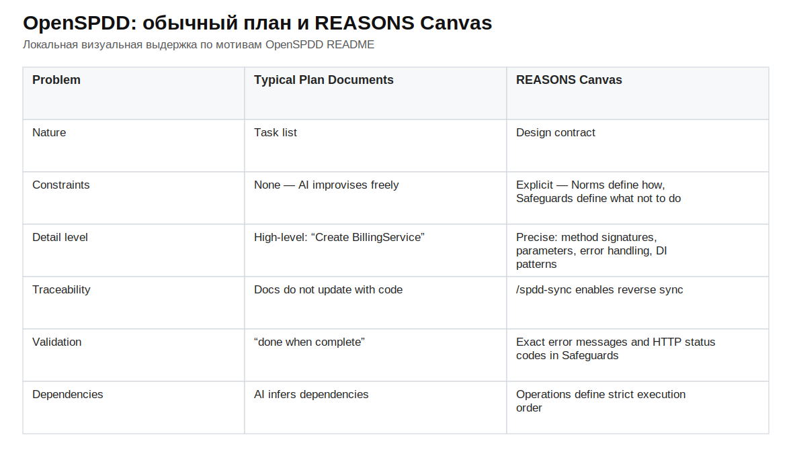
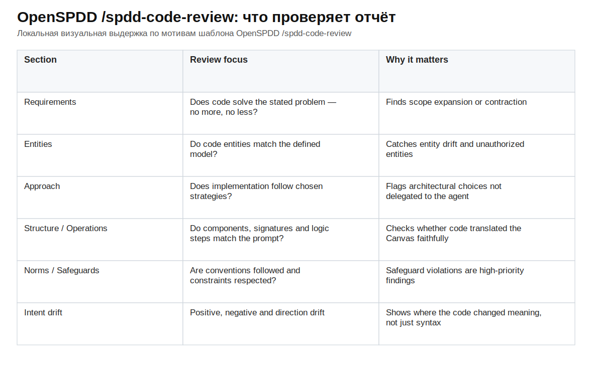
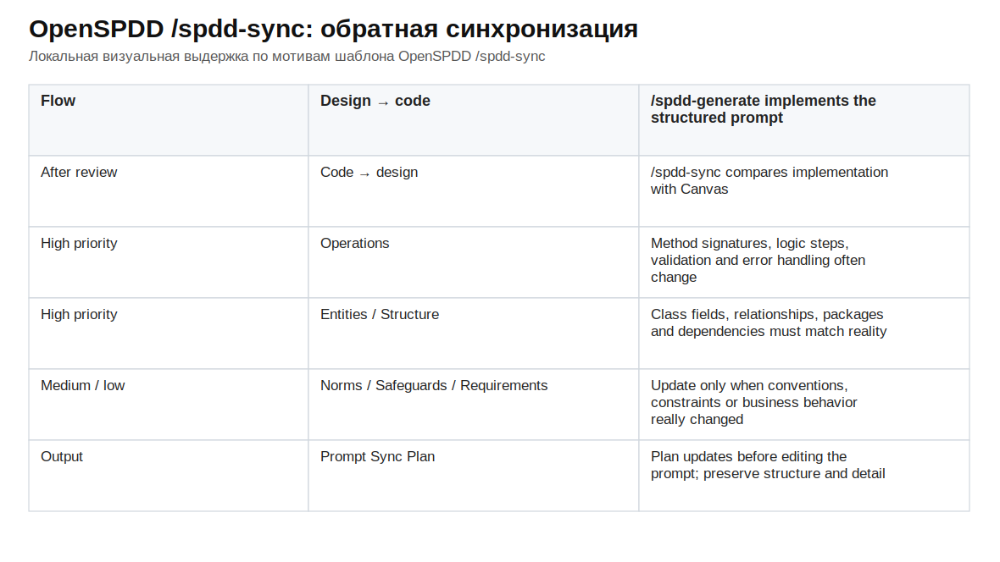

# SPDD / OpenSPDD: как превратить намерение в сопровождаемый артефакт

SPDD отвечает на практический вопрос, который быстро появляется в агентной разработке: как дать ИИ-агенту достаточно свободы для реализации и при этом не позволить ему молча выбрать продуктовые, архитектурные и эксплуатационные компромиссы за команду. В обычном режиме человек часто пишет короткую просьбу, агент читает часть проекта, достраивает недостающие решения и возвращает `diff`. Часть решений при этом появляется слишком поздно: уже в коде, тестах и побочных изменениях.

Structured Prompt-Driven Development переносит эту работу раньше. Сначала команда делает намерение видимым, затем проверяет его, потом разрешает генерацию и после этого поддерживает связь между промптом, кодом и проверочными свидетельствами. Базовая формулировка метода дана в статье Thoughtworks / Martin Fowler о [Structured-Prompt-Driven Development](https://martinfowler.com/articles/structured-prompt-driven/), а OpenSPDD превращает её в набор команд и шаблонов для агентских сред [OpenSPDD README](https://github.com/gszhangwei/open-spdd).

Главный объект SPDD лучше понимать как REASONS Canvas, а не как удлинённую просьбу к модели. Это структурированный документ уровня фичи, который хранится рядом с кодом, ревьюится до реализации и обновляется после изменений. Он фиксирует требования, сущности, подход, структуру, порядок операций, нормы проекта и запреты. Такой документ не заменяет код текстом. Его задача — вынести значимые решения из неявного контекста в артефакт, с которым можно спорить, который можно коммитить, сравнивать, обновлять и использовать в следующем раунде работы.

<figure class="image-asset" id="fig-fowler-spdd-overview" data-asset-status="local_image_asset" data-repo-path="content/assets/theory-images/fowler-spdd-overview.svg">
  
  <figcaption>Промпт в SPDD не исчезает после генерации: он становится артефактом поставки, который можно версионировать, ревьюить и использовать в следующих изменениях. Источник: <a href="https://martinfowler.com/articles/structured-prompt-driven/">Fowler/Thoughtworks, Structured-Prompt-Driven Development</a>.</figcaption>
</figure>

## Как читать эту статью

Эта статья отвечает на один вопрос: как SPDD помогает команде передать агенту намерение фичи так, чтобы это намерение можно было проверить до кода, сопоставить с реализацией и обновить после изменений. Поэтому в центре здесь REASONS Canvas, команды OpenSPDD, свидетельства поведения, ревью по Canvas и два направления сопровождения: `prompt-update` и `sync`.

Удобно держать в голове один полный цикл. Сырая просьба не передаётся агенту сразу как разрешение менять код. Сначала она превращается в документ, где видно, какое поведение нужно получить, какие слова домена нельзя перепутать, какой подход выбран, какие файлы и компоненты должны измениться, в каком порядке идти и какие соседние области запрещено трогать. После этого код становится ответом на согласованный документ, а не результатом скрытого обсуждения внутри модели. Когда реализация сталкивается с ревью, тестом или новым знанием о системе, это знание должно вернуться либо в Canvas, либо в отдельный артефакт, который владеет соответствующим решением.

Соседние методы понадобятся здесь только на границах. Статья не пытается сравнить все подходы к спецификациям и не превращает SPDD в замену ADR, тестовой стратегии, проектной конституции или устойчивого графа работы. Эти темы появятся позже, когда нужно будет показать, где полномочия Canvas заканчиваются.

## Почему сильной модели всё равно нужны границы намерения

SPDD начинается с различия между способностью модели и правом на решение. Сильная модель может распознать паттерны проекта, написать правдоподобный код, предложить тесты и даже угадать часть неописанных ожиданий. Но она не должна сама решать, какой компромисс подходит продукту: делать ли вызовы синхронными или событийными, какую совместимость сохранить, где провести границу изменения, можно ли расширить модель данных, как обрабатывать старые счета, какие внешние API считаются стабильными. В философии OpenSPDD это сформулировано как проблема управления: модель видит слишком много допустимых вариантов, и человеческое решение должно сузить это пространство до вариантов, которые команда готова принять [OpenSPDD design philosophy](https://github.com/gszhangwei/open-spdd/blob/main/docs/design-philosophy.md).

Эта граница особенно важна там, где ошибка выглядит локально разумной. Агент может добавить «полезное» поведение, которого не просили; может пропустить неудобное ограничение; может выбрать другую архитектурную форму, не ломая тесты; может сделать значение по умолчанию, которое сегодня спасает демо, но завтра станет бизнес-ошибкой. В таком случае проблема не сводится к качеству кода. Код может компилироваться, тесты могут проходить, а намерение уже смещено.

SPDD делает это смещение предметом ревью. Человек сначала проверяет документ, где написано, что именно должно измениться, какие сущности участвуют, какой подход выбран, в каком порядке выполняется работа и что запрещено менять. После этого агент получает меньше свободы там, где свобода вредна, и больше конкретики там, где нужна точная реализация.

## Место SPDD между свободным промптом и формальной спецификацией

SPDD находится между двумя крайностями. С одной стороны — свободная просьба на естественном языке: она быстрая, но значительная часть намерения остаётся в голове человека, текущем чате или неявных соглашениях проекта. С другой стороны — строгая формальная спецификация, контракты и DSL, которые могут дать более сильные гарантии, но требуют другого уровня затрат и другой дисциплины. В рамке Shuvendu Lahiri про формализацию намерения это прагматический низко- или среднеформальный слой: REASONS Canvas остаётся человекочитаемым документом, а API-скрипты, ревью по Canvas и последующая синхронизация добавляют косвенные проверочные артефакты, но не доказывают корректность всей системы [Intent Formalization](https://ar5iv.labs.arxiv.org/html/2603.17150v1).

Из этого следует важное ограничение. SPDD не даёт независимый оракул правильности спецификации. Canvas может быть аккуратным, полным, технически удобным и всё равно выражать неверное продуктовое решение. Поэтому первая точка ревью находится до генерации кода. Команда должна спросить не только «сможет ли агент реализовать этот Canvas», но и «правильно ли этот Canvas описывает то, что мы хотим разрешить агенту реализовать».

В современном языке разработки, ведомой спецификациями, SPDD ближе к практике с опорой на спецификацию (`spec-anchored`), чем к режиму `spec-as-source`. Спецификация остаётся живой опорой для работы и сопровождения, но код, тесты, эксплуатационные сигналы и человеческое решение не исчезают. Общее сравнение инструментов разработки, ведомой спецификациями, у Fowler помогает удержать эту границу: спецификация может быть источником управления, но не обязана становиться единственным редактируемым источником всей системы [Understanding Spec-Driven-Development](https://martinfowler.com/articles/exploring-gen-ai/sdd-3-tools.html).

## REASONS Canvas как рабочий контракт

REASONS Canvas делит намерение на семь частей: `Requirements`, `Entities`, `Approach`, `Structure`, `Operations`, `Norms`, `Safeguards`.

В статье Fowler/Thoughtworks эта структура описана как переход от намерения и дизайна к исполнению и управлению. `Requirements`, `Entities` и `Approach` удерживают смысл и выбранное направление; `Structure` и `Operations` переводят его в архитектурное место и порядок действий; `Norms` задают правила качества, а `Safeguards` — границы, которые агент не должен переходить [Structured-Prompt-Driven Development](https://martinfowler.com/articles/structured-prompt-driven/). OpenSPDD README формулирует похожее различение через практический контраст с обычным планом: план может сказать «создать сервис», а Canvas должен описать ответственность, пакет, зависимости, методы, обработку ошибок и порядок исполнения [OpenSPDD README](https://github.com/gszhangwei/open-spdd).

<figure class="image-asset" id="fig-fowler-spdd-reasons-canvas" data-asset-status="local_image_asset" data-repo-path="content/assets/theory-images/fowler-spdd-reasons-canvas.svg">
  
  <figcaption>REASONS Canvas раскладывает намерение фичи на семь зон: смысл изменения, доменный словарь, выбранный подход, структуру, порядок операций, нормы проекта и предохранители. Источник: <a href="https://martinfowler.com/articles/structured-prompt-driven/">Fowler/Thoughtworks, Structured-Prompt-Driven Development</a>.</figcaption>
</figure>

Польза этой структуры в том, что она разводит разные типы решений. Если смешать всё в один список задач, агенту приходится заново угадывать границу между бизнес-смыслом, доменной моделью, архитектурной формой, порядком реализации и запретами. Canvas делает эти различия видимыми до генерации.

<figure class="image-asset" id="fig-openspdd-plan-vs-reasons-canvas" data-asset-status="local_source_excerpt_asset" data-repo-path="content/assets/theory-images/openspdd-plan-vs-reasons-canvas.svg">
  
  <figcaption>Фрагмент OpenSPDD README показывает практическую разницу между обычным планом и REASONS Canvas: план остаётся списком предложений, а Canvas фиксирует ограничения, порядок операций, трассируемость и проверяемые ожидания. Источник: <a href="https://github.com/gszhangwei/open-spdd#why-openspdd">OpenSPDD README</a>.</figcaption>
</figure>

`Requirements` описывает, что должно измениться для пользователя или бизнеса. Здесь нельзя прятать архитектурный выбор под видом требования. Если задача про биллинг, требования должны говорить о правилах расчёта, планах, квотах, ошибках и ожидаемом поведении, а не только о том, что «нужно добавить поддержку тарификации».

`Entities` фиксирует предметные объекты и слова, на которых строится задача. Для агента это защита от смешения терминов. Если в проекте `customer`, `account`, `plan`, `usage`, `modelId` и `invoice` имеют разные роли, Canvas должен удержать эти роли явно. Иначе агент может выбрать удобную, но неверную модель данных.

`Approach` объясняет выбранное направление решения. Здесь команда говорит, почему задача решается так, а не иначе: например, использовать расширяемую стратегию расчёта вместо набора условий, оставить обратную совместимость для исторических данных или не менять публичный контракт API без отдельного решения.

`Structure` задаёт ожидаемую форму изменения в кодовой базе: какие компоненты, модули, слои или файлы должны появиться или измениться. Этот раздел не обязан быть детальным планом реализации, но он должен удержать архитектурную границу. Агенту не нужно заново решать, будет ли логика лежать в контроллере, сервисе, доменной модели или отдельной стратегии, если это решение уже важно для сопровождаемости.

`Operations` переводит намерение в порядок действий. Для SPDD это один из самых важных разделов, потому что `/spdd-generate` должен идти по операциям и не превращать реализацию в свободный поиск решения [шаблон OpenSPDD `/spdd-generate`](https://github.com/gszhangwei/open-spdd/blob/v0.4.9/internal/templates/data/core/spdd-generate.md). Хороший раздел `Operations` помогает человеку ревьюить не только итог, но и последовательность: сначала модель данных, затем расчёт, затем API-поведение, затем тестовые сценарии, затем синхронизация документа.

`Norms` удерживает проектные соглашения: стиль именования, тестовые конвенции, структуру пакетов, подход к ошибкам, формат ответов, способ логирования. Этот раздел важен именно потому, что сильная модель может написать рабочий код в чужом стиле. Для сопровождения это часто хуже маленькой локальной ошибки.

`Safeguards` фиксирует запреты, ограничения и соседние области, которые агент не должен трогать: какие данные нельзя мигрировать без отдельного решения, какие API нельзя менять, какие старые сценарии нужно сохранить, какие архитектурные обходные пути недопустимы. В хорошем Canvas этот раздел не выглядит декоративным чек-листом. Он говорит агенту, где заканчивается его право на изменение.

### Как пример с биллингом раскладывается по Canvas

Абстрактное объяснение REASONS легко прочитать как ещё одну форму требований. Пример с биллингом из статьи Fowler/Thoughtworks показывает, почему это не так. Задача про тарификацию содержит несколько решений, которые короткая просьба вроде «добавь расчёт стоимости токенов» почти наверняка оставит агенту: как различать Standard и Premium, где учитывать `modelId`, как раздельно считать `prompt tokens` и `completion tokens`, что делать с неизвестным клиентом (`customer`), как реагировать на отрицательные количества токенов, как применять квоту и какой формат ответа считается контрактом [Structured-Prompt-Driven Development](https://martinfowler.com/articles/structured-prompt-driven/).

<figure class="image-asset" id="fig-fowler-spdd-analysis-review" data-asset-status="local_image_asset" data-repo-path="content/assets/theory-images/fowler-spdd-analysis-review.png">
  
  <figcaption>В разборе биллинга анализ до генерации выводит краевые случаи и технические риски в читаемую форму: настройку цен моделей, расчёт квоты, миграцию старых данных и риск сломать существующие тесты. Источник: <a href="https://martinfowler.com/articles/structured-prompt-driven/">Fowler/Thoughtworks, Structured-Prompt-Driven Development</a>.</figcaption>
</figure>

В Canvas это должно разойтись по разным местам. `Requirements` называют наблюдаемое поведение: какие планы поддерживаются, какие входы считаются валидными, какие ошибки должны вернуться, что должно быть в ответе. `Entities` удерживают словарь: `customer`, план, запись использования, `modelId`, `prompt tokens`, `completion tokens`, квота. `Approach` фиксирует выбранный способ расчёта, чтобы агент не разнёс тарифные правила по случайным условиям в контроллере или обработчике запроса.

Дальше Canvas связывает это решение с кодовой базой. `Structure` говорит, где должна жить ответственность за расчёт, валидацию и форматирование ответа. `Operations` задают порядок: проверить вход, найти клиента (`customer`) и план, выбрать правило расчёта, отдельно посчитать `prompt`/`completion`-токены, применить ограничение квоты, собрать ответ и покрыть сценарии проверкой. `Norms` привязывают реализацию к принятым соглашениям проекта — именованию, ошибкам, тестам, формату ответов. `Safeguards` запрещают скрытые компромиссы: молча принимать неизвестного клиента (`customer`), нормализовать отрицательные токены, менять публичный контракт ответа или вводить вариант по умолчанию для исторических счетов без явного решения.

Такой пример важен не из-за самого биллинга. Он показывает, что Canvas не дублирует список задач. Один и тот же исходный запрос распадается на поведение, словарь домена, проектный выбор, место изменения, порядок реализации, соглашения и запреты. Человек может спорить с каждым из этих пунктов до генерации кода. Если спор начался только после `diff`, агент уже успел принять часть решений за команду.

### Почему Canvas должен сопровождаться

Canvas становится сопровождаемым артефактом только тогда, когда команда обращается с ним как с частью поставки. В статье Fowler/Thoughtworks промпт не остаётся стенограммой чата: он хранится в версии рядом с кодом, проходит ревью, переиспользуется и улучшается со временем [Structured-Prompt-Driven Development](https://martinfowler.com/articles/structured-prompt-driven/). Это меняет предмет ревью: рядом с итоговым `diff` появляется документ, в котором заранее видно, что агент считает задачей, какие объекты он видит, какой путь реализации предлагает и что ему запрещено делать.

Сопровождаемость держится на двух условиях. Во-первых, Canvas должен быть достаточно конкретным. `Operations` не может быть красивым списком намерений; он должен задавать проверяемые шаги реализации, потому что `/spdd-generate` потом следует этому порядку. Во-вторых, Canvas должен обновляться, когда реальность меняется. Fowler/Thoughtworks формулируют правило так: если расходится реальность, сначала исправляется промпт, затем код; документ OpenSPDD design philosophy прямо предупреждает, что Canvas, который не обновили после изменения кода, превращается из руководства по дизайну (`design guide`) в устаревшую документацию, вводящую в заблуждение (`misleading outdated documentation`) [Structured-Prompt-Driven Development](https://martinfowler.com/articles/structured-prompt-driven/), [OpenSPDD design philosophy](https://github.com/gszhangwei/open-spdd/blob/main/docs/design-philosophy.md).

Именно здесь Canvas может ввести в заблуждение. Неверный Canvas заставляет агента точно реализовать неверное решение. Устаревший Canvas выглядит как согласованный контракт, хотя код уже ушёл дальше. Слишком общий Canvas возвращает агенту свободу выбора там, где команда думала, что уже поставила границы. Поэтому REASONS Canvas нужно ревьюить до генерации и поддерживать после изменения, иначе SPDD превращается в аккуратный документ, которому нельзя доверять.

Canvas нужно отделять от файлов инструкций уровня репозитория. `AGENTS.md`, `CLAUDE.md` или похожие документы могут задавать общие правила проекта: как запускать проверки, какой стиль кода принят, какие команды опасны, как вести себя с секретами. REASONS Canvas работает ниже и конкретнее: он фиксирует намерение одной фичи, её сущности, выбранный подход, последовательность операций и запреты для текущего изменения. Если положить всё в общий файл инструкций, агент получает слишком общий фон; если всё держать только в Canvas, теряются устойчивые проектные нормы. SPDD полезен именно как разделение этих уровней: правила репозитория поддерживают среду, Canvas удерживает смысл фичи [OpenSPDD design philosophy](https://github.com/gszhangwei/open-spdd/blob/main/docs/design-philosophy.md).

## Как Canvas собирает и ограничивает контекст

В OpenSPDD Canvas создаётся не из воздуха. `/spdd-analysis` и `/spdd-reasons-canvas` задают дисциплину чтения. `/spdd-analysis` сначала извлекает из требования доменные существительные, глаголы действий, API-поверхности и технические подсказки, затем ограниченно читает релевантную часть кода и расширяет исследование на один переход [шаблон OpenSPDD `/spdd-analysis`](https://github.com/gszhangwei/open-spdd/blob/v0.4.9/internal/templates/data/core/spdd-analysis.md). Это важно для агентной разработки в целом: агенту не нужно читать весь репозиторий, но он должен объяснимо выбрать релевантную область.

`/spdd-reasons-canvas` продолжает эту дисциплину. Шаблон требует полностью читать переданные `@file` и `@folder`, не усекать содержание и не оставлять `TODO` или заполнители в выходном Canvas [шаблон OpenSPDD `/spdd-reasons-canvas`](https://github.com/gszhangwei/open-spdd/blob/v0.4.9/internal/templates/data/core/spdd-reasons-canvas.md). Поэтому Canvas оставляет проверяемый след работы с контекстом: в нём видно, какие исходные требования, спецификации, API-файлы или папки были взяты в работу и какой консолидированный дизайн получился из этого чтения.

Эта часть метода защищает от распространённого сбоя: агент уверенно пишет решение, но его уверенность основана на неполном чтении. SPDD не устраняет риск полностью. Он лишь переводит риск в проверяемую форму: какие источники были прочитаны, какие понятия извлечены, какие пробелы остались и какие решения нельзя принимать без человека.

## Три навыка SPDD: что остаётся за человеком

Если говорить в статье только о Canvas и командах OpenSPDD, метод легко посчитать шаблонным конвейером: заполнили документ, сгенерировали код, прогнали проверки. У Fowler/Thoughtworks помимо самого процесса есть и другой акцент. SPDD требует от разработчика трёх навыков — `Abstraction First`, `Alignment` и `Iterative Review`. Они описывают не новые должности в команде, а три вида работы, которые нельзя честно отдать агенту целиком.

`Abstraction First` — это способность увидеть модель до генерации. Разработчик должен понять, какие объекты существуют, как они связаны, где проходят границы ответственности, какие интерфейсы стоит зафиксировать заранее и насколько мелко нужно разложить работу [Fowler/Thoughtworks, `Abstraction First`](https://martinfowler.com/articles/structured-prompt-driven/abstraction-first.html). Диаграмма, набросок последовательности или ER-модель здесь полезны не как украшение документа, а как способ поймать плохую форму решения до того, как агент превратит её в код.

`Alignment` — это согласование смысла до реализации. Команда проверяет, что бизнес-ценность, нецели, доменный язык, основной сценарий, крайние случаи, критерии готовности и ограничения старого кода действительно совпали [Fowler/Thoughtworks, `Alignment`](https://martinfowler.com/articles/structured-prompt-driven/alignment.html). Если этот слой слабый, Canvas может стать очень аккуратным документом про не ту задачу. Поэтому SPDD сначала требует согласовать анализ и структурированный промпт, а уже потом разрешает генерацию.

`Iterative Review` — это умение превратить первый результат в управляемую петлю. Ревью смотрит не только на стиль кода, но и на согласованность промпта и реализации, границы ответственности, выдуманные импорты или зависимости, ошибки компиляции, ухудшение сопровождаемости и дрейф намерения [Fowler/Thoughtworks, `Iterative Review`](https://martinfowler.com/articles/structured-prompt-driven/iterative-review.html). В этой логике `/spdd-api-test` и `/spdd-code-review` не заменяют инженерное суждение: они дают ему правильное место, входы и свидетельства.

## Рабочий процесс OpenSPDD

OpenSPDD задаёт порядок поддержания Canvas. Слеш-команды — только видимая форма этого порядка: одни сужают бизнес-ввод, другие создают контекст, третьи порождают Canvas, четвёртые используют его для генерации, пятые проверяют соответствие, а последние возвращают изменения обратно в документ. Метод работает, когда эти роли связаны в один цикл. Если взять только `/spdd-generate`, получится обычная генерация по длинному промпту. Если взять только `/spdd-sync`, получится документационное упражнение после кода. SPDD начинается там, где Canvas проходит полный цикл: создать документ, проверить его, использовать для реализации, сверить код и обновить документ после изменения.

Важная часть OpenSPDD — запреты, действующие на каждом шаге. На анализе он собирает контекст и пробелы, но не должен сразу реализовывать. При создании Canvas он обязан заполнить все семь зон и остановиться до подтверждения. При генерации он читает Canvas целиком и не перепланирует операции под собственный вкус. При ревью он показывает расхождения без молчаливой правки кода. При `prompt-update` и `sync` он переносит информацию в нужную сторону: новое намерение — в Canvas перед кодом, принятое изменение реализации — обратно в Canvas после кода. Поэтому OpenSPDD превращает общую идею SPDD в рабочую систему: каждый шаг ограничивает, что агент сейчас имеет право решить, а что должен вынести человеку.

<figure class="image-asset" id="fig-fowler-spdd-workflow" data-asset-status="local_image_asset" data-repo-path="content/assets/theory-images/fowler-spdd-workflow.svg">
  
  <figcaption>Рабочий процесс SPDD связывает исходное требование, анализ контекста, REASONS-промпт, генерацию, проверку, ревью и последующую синхронизацию. Поэтому метод работает как цикл сопровождения Canvas, а не как разовый запрос к модели. Источник: <a href="https://martinfowler.com/articles/structured-prompt-driven/">Fowler/Thoughtworks, Structured-Prompt-Driven Development</a>.</figcaption>
</figure>

Первый вход — ограничение задачи. Необязательная `/spdd-story` превращает крупное требование в истории, которые можно независимо поставить и проверить: шаблон требует читать `@`-ссылки полностью, не исследует кодовую базу вместо анализа, проверяет INVEST, удерживает `Scope In` / `Scope Out`, критерии приёмки и размер истории примерно в один–пять дней [шаблон OpenSPDD `/spdd-story`](https://github.com/gszhangwei/open-spdd/blob/v0.4.9/internal/templates/data/optional/spdd-story.md). Практическая задача этой команды — удержать размер будущего Canvas. Она не нужна для красивой формулировки пользовательской истории (`user story`); она не даёт границе истории расплыться до задачи, в которой агент получает право решать слишком много.

Затем `/spdd-analysis` переводит бизнес-ввод в рабочий контекст для Canvas. Шаблон требует сохранить исходное требование без пересказа, полностью прочитать переданные `@file` и `@folder`, но не читать весь репозиторий подряд. Вместо этого он извлекает доменные существительные, глаголы действий, API-поверхности и технические подсказки, прицельно читает релевантные схемы и код, допускает только ограниченное расширение на один переход и сохраняет результат в `spdd/analysis/<file-name>.md` [шаблон OpenSPDD `/spdd-analysis`](https://github.com/gszhangwei/open-spdd/blob/v0.4.9/internal/templates/data/core/spdd-analysis.md). Его функция — подготовить для Canvas контекст, привязанный к текущей кодовой базе, рискам и пробелам, а не оставить агенту абстрактный брифинг.

`/spdd-reasons-canvas` создаёт сам артефакт намерения. Команда принимает текст, `@`-файлы или папки, объединяет источники без усечения, читает релевантный контекст проекта и генерирует полностью заполненные семь зон REASONS. В шаблоне важно требование сохранить Canvas в `spdd/prompt/<file-name>.md`, не оставлять заполнителей и не начинать реализацию до подтверждения пользователя [шаблон OpenSPDD `/spdd-reasons-canvas`](https://github.com/gszhangwei/open-spdd/blob/v0.4.9/internal/templates/data/core/spdd-reasons-canvas.md). После этого Canvas перестаёт быть промежуточным ответом агента в чате и становится файлом: его можно открыть, отревьюить, изменить, закоммитить и использовать повторно.

После подтверждения `/spdd-generate` читает весь Canvas и переводит его в код. Шаблон явно извлекает `Requirements`, `Entities`, `Approach`, `Structure`, `Operations`, `Norms` и `Safeguards`, проверяет порядок `Operations`, сверяет его со `Structure` и затем генерирует код по операциям. Ключевой запрет: не перепланировать последовательность, не добавлять функции и методы вне спецификации, не менять сообщения ошибок из `Safeguards` [шаблон OpenSPDD `/spdd-generate`](https://github.com/gszhangwei/open-spdd/blob/v0.4.9/internal/templates/data/core/spdd-generate.md). В этом месте Canvas становится поручением для реализации: агент всё ещё пишет код, но область допустимой импровизации уже резко сужена.

После генерации появляются два разных проверочных артефакта. `/spdd-api-test` создаёт самодостаточный `scripts/test-api.sh` с `curl`-вызовами, таблицей тест-кейсов в начале скрипта, таблицей `expected`/`actual` после выполнения, нормальными, граничными и негативными сценариями, `bash + curl` без внешних зависимостей, защитой от тайм-аута и кодом выхода для CI [шаблон OpenSPDD `/spdd-api-test`](https://github.com/gszhangwei/open-spdd/blob/v0.4.9/internal/templates/data/optional/spdd-api-test.md). Его роль — дать человеку читаемое поведенческое свидетельство: вместо заверения агента о работоспособности появляются сценарии, входы и ожидаемые ответы.

`/spdd-code-review` проверяет другое: совпадает ли реализация с намерением. Шаблон читает Canvas и указанные файлы или `git diff`, проверяет все семь зон REASONS, отдельно смотрит `Safeguards`, границы области изменения, неявные решения и три вида дрейфа: добавления сверх Canvas, пропуски того, что Canvas требовал, и расхождение направления, когда код делает похожее, но по другой архитектурной или бизнес-логике [шаблон OpenSPDD `/spdd-code-review`](https://github.com/gszhangwei/open-spdd/blob/v0.4.9/internal/templates/data/optional/spdd-code-review.md). Команда работает в режиме `read-only`: она должна уменьшить когнитивную нагрузку ревьюера, а не автоматически переписать код под видом ревью.

Последний слой — сопровождение Canvas после столкновения с реальностью. `/spdd-prompt-update` идёт от нового намерения к документу: новое требование, архитектурное уточнение, новая сущность, новый предохранитель (`Safeguards`) или исправление спецификации. Шаблон требует читать весь существующий Canvas, менять только затронутые секции, сохранять имя файла, проверять согласованность между секциями и не превращать спецификацию в кодовые блоки [шаблон OpenSPDD `/spdd-prompt-update`](https://github.com/gszhangwei/open-spdd/blob/v0.4.9/internal/templates/data/core/spdd-prompt-update.md).

`/spdd-sync` идёт в обратную сторону: от принятого изменения кода к Canvas. Он сравнивает текущую реализацию с документом, строит план обновления, чаще всего трогает `Operations`, `Structure` и `Entities`, и должен сохранить Canvas как актуальное описание системы, а не как исторический снимок [шаблон OpenSPDD `/spdd-sync`](https://github.com/gszhangwei/open-spdd/blob/v0.4.9/internal/templates/data/core/spdd-sync.md).

`/spdd-reverse` стоит отдельно от прямого потока. Это beta-команда для участка кода, у которого ещё нет Canvas: ей можно передать `@`-ссылки на файлы и папки, описание области или их сочетание. Если область неясна, команда должна спросить пользователя; если область слишком большая, примерно от 15–20 файлов, она должна показать найденный список и попросить сузить или подтвердить охват. Затем она восстанавливает REASONS Canvas по текущему поведению, структуре, сущностям, зависимостям, нормам и ограничениям кода [шаблон OpenSPDD `/spdd-reverse`](https://github.com/gszhangwei/open-spdd/blob/main/internal/templates/data/optional/spdd-reverse.md).

Этот обратный вход нельзя читать как автоматическое извлечение «истинного намерения» из legacy-кода. Шаблон требует описывать код как он есть: не идеализировать, не рефакторить, не придумывать требования, которые код не выполняет, и фиксировать странности как странности. Поэтому `/spdd-reverse` полезен как способ включить старый участок в сопровождение через SPDD, но его результат остаётся кандидатом на Canvas, а не доказательством исходного замысла системы. Человек всё равно подтверждает область, проверяет реконструкцию и решает, какие особенности кода станут нормой, а какие останутся долгом.

## Свидетельства поведения и ревью по намерению

SPDD ценен не только тем, что создаёт спецификацию до кода. В полной версии он строит цепочку: артефакт намерения → реализация → поведенческое свидетельство → ревью соответствия → обновление спецификации. Эта цепочка особенно хорошо видна в примере с биллингом из статьи Thoughtworks. Там задача включает `modelId`, разные правила для Standard и Premium, отдельные ставки для `prompt`/`completion`-токенов, неизвестного клиента (`customer`), отрицательные количества токенов, квоты и формат ответа [Structured-Prompt-Driven Development](https://martinfowler.com/articles/structured-prompt-driven/). Это тот тип задачи, где SPDD уместен: она не является микробагом, но содержит достаточно бизнес-логики, чтобы не отдавать проектные развилки агенту молча.

Здесь важно разделить три вопроса, которые в обычном агентском `diff` часто сливаются. Первый вопрос — поведение: что система фактически возвращает на названных сценариях? Второй — соответствие намерению: покрывает ли реализация все части Canvas и не добавляет ли она скрытых решений? Третий — исправление намерения: если ожидание, тест или код расходятся, где источник ошибки — в реализации, в тестовом ожидании или в самом Canvas? SPDD полезен именно потому, что даёт разные артефакты для этих трёх вопросов.

`/spdd-api-test` отвечает только на первый вопрос. Шаблон OpenSPDD требует создать `scripts/test-api.sh`, использовать shell и cURL, заранее показать обзор тест-кейсов, а после запуска зафиксировать `expected`/`actual`/`result` и код выхода [шаблон OpenSPDD `/spdd-api-test`](https://github.com/gszhangwei/open-spdd/blob/v0.4.9/internal/templates/data/optional/spdd-api-test.md). В биллинг-задаче такая таблица должна сделать видимыми нормальные и ошибочные ветки: Standard и Premium расчёт, разные ставки для `prompt`/`completion`-токенов, `modelId`, неизвестного клиента (`customer`), отрицательное количество токенов, превышение квоты и ожидаемый формат ответа. Это ещё не доказывает, что правила тарификации правильные. Но это превращает «агент сказал, что проверил» в проверяемый пакет: сценарий, вход, ожидаемый результат, фактический результат и красно-зелёный статус.

В этом месте полезна именно числовая форма примера. Проверка не ограничивается словами `Standard` и `Premium`: в таблице появляется отсутствующий `modelId → 400`, неизвестный `customer → 404`, отрицательные токены → `400`, клиент `Standard` с квотой `100K`, из которых `90K` уже использованы, и новый запрос на `30K` токенов `fast-model`, где превышение `20K` даёт `$0.20`. Для `Premium` отдельно проверяется `reasoning-model`: `10K prompt + 20K completion` дают `$1.50`. Эти числа не превращают пример в универсальное правило тарификации [Structured-Prompt-Driven Development](https://martinfowler.com/articles/structured-prompt-driven/), [шаблон OpenSPDD `/spdd-api-test`](https://github.com/gszhangwei/open-spdd/blob/v0.4.9/internal/templates/data/optional/spdd-api-test.md).

<figure class="image-asset" id="fig-fowler-spdd-api-test-script" data-asset-status="local_image_asset" data-repo-path="content/assets/theory-images/fowler-spdd-api-test-script.png">
  
  <figcaption>Сгенерированный API-тестовый скрипт начинается с обзора, который человек может прочитать до запуска: ошибки валидации, поведение квоты для плана Standard и раздельный расчёт `prompt`/`completion`-токенов для плана Premium. Источник: <a href="https://martinfowler.com/articles/structured-prompt-driven/">Fowler/Thoughtworks, Structured-Prompt-Driven Development</a>.</figcaption>
</figure>

Такой пакет становится свидетельством только тогда, когда понятно, чему он служит. Полезный лог для исполнителя ещё не является основанием для принятия работы. Для ревью нужно понимать, какой раздел Canvas или какое обещание проверяет сценарий, какой критерий считается проходом, где сохранён скрипт и вывод, можно ли повторить запуск и кто принимает остаточный риск. Иначе таблица `expected`/`actual` остаётся наблюдением в ходе работы: она помогает агенту сделать следующий ход, но не даёт человеку устойчивого основания принять изменение.

<figure class="image-asset" id="fig-fowler-spdd-api-test-results" data-asset-status="local_image_asset" data-repo-path="content/assets/theory-images/fowler-spdd-api-test-results.png">
  
  <figcaption>После запуска тот же слой превращается в свидетельство `expected`/`actual`/`result`: человек видит, какие сценарии проверены, что ожидалось и что вернула система. Источник: <a href="https://martinfowler.com/articles/structured-prompt-driven/">Fowler/Thoughtworks, Structured-Prompt-Driven Development</a>.</figcaption>
</figure>

`/spdd-code-review` отвечает на второй вопрос. Это не обычная проверка стиля и не свободный комментарий к `diff`. Шаблон задаёт ревью реализации по REASONS Canvas без правки кода (`read-only`): соответствие разделам Canvas, соблюдение `Safeguards`, границу области, неявные решения, дрейф намерения и готовность к слиянию [шаблон OpenSPDD `/spdd-code-review`](https://github.com/gszhangwei/open-spdd/blob/v0.4.9/internal/templates/data/optional/spdd-code-review.md).

Форма отчёта делает эту проверку видимой. Отчёт должен пройти `Requirements Alignment`, `Entities Alignment`, `Approach Alignment`, `Structure Alignment`, `Operations Alignment`, `Norms Alignment` и `Safeguards Alignment`, а затем отдельно разобрать дрейф (`drift`), неявные решения реализации (`implicit implementation decisions`) и границу области (`scope boundary`). Дрейф может быть положительным, когда агент добавил полезное, но несогласованное поведение; отрицательным, когда часть намерения потерялась; направленным, когда решение ушло в другое продуктовое или архитектурное направление. Такое ревью ближе к семантическому сравнению `diff`: сравнивается не только старый и новый код, а зафиксированное намерение и фактическая реализация.

<figure class="image-asset" id="fig-openspdd-code-review-report" data-asset-status="local_source_excerpt_asset" data-repo-path="content/assets/theory-images/openspdd-code-review-report.svg">
  
  <figcaption>Фрагмент шаблона `/spdd-code-review` показывает, что ревью строится не как общий комментарий к патчу, а как проверка по зонам REASONS, дрейфу намерения, неявным решениям и границе области. Источник: <a href="https://github.com/gszhangwei/open-spdd/blob/main/internal/templates/data/optional/spdd-code-review.md">OpenSPDD `/spdd-code-review`</a>.</figcaption>
</figure>

<figure class="image-asset" id="fig-fowler-spdd-code-review" data-asset-status="local_image_asset" data-repo-path="content/assets/theory-images/fowler-spdd-code-review.svg">
  
  <figcaption>Ревью кода в SPDD разделяет два пути после замечания: изменение поведения или намерения возвращается в промпт, а рефакторинг без изменения поведения можно сделать в коде и затем синхронизировать. Источник: <a href="https://martinfowler.com/articles/structured-prompt-driven/">Fowler/Thoughtworks, Structured-Prompt-Driven Development</a>.</figcaption>
</figure>

Практическая логика разбора выглядит так. Если таблица `expected`/`actual` показывает красный статус, сначала понятно только то, что выбранный сценарий не совпал с ожиданием; это может быть баг кода, неправильное ожидание в тесте или неверный Canvas. Если API-тесты зелёные, а `/spdd-code-review` находит нарушение `Safeguards`, работа всё равно не готова: поведение выбранных сценариев совпало, но реализация могла расширить область, изменить архитектурную границу или ввести опасный вариант по умолчанию.

Если `/spdd-code-review` находит неявное решение, команда должна решить, что это такое: принятое изменение намерения для `prompt-update`, чистое структурное изменение для `sync` или расширение области задачи, которое нужно отклонить. Если ревьюер отвергает сам Canvas, зелёные тесты и аккуратный код не спасают задачу: исправлять нужно исходное намерение, возможно с возвратом к анализу.

Именно поэтому свидетельства помогают человеческому ревью, но не доказывают корректность исходного намерения. API-скрипт показывает, что произошло в выбранных сценариях. `/spdd-code-review` показывает, насколько реализация похожа на Canvas. Ни один из этих артефактов не отвечает сам по себе на вопрос, верен ли Canvas как продуктовое, архитектурное или эксплуатационное решение. SPDD улучшает качество решения за счёт разделения ответственности: поведение проверяется артефактами, соответствие — ревью по Canvas, а изменение намерения возвращается в сопровождаемый документ.

## `prompt-update` и `sync`: два направления обновления

В SPDD эти два направления изменений нужно держать отдельно. Если изменилось намерение, нужно обновить Canvas как источник будущей реализации. Если изменилась реализация без изменения намерения, нужно синхронизировать Canvas с текущей структурой кода.

`/spdd-prompt-update` используется, когда появляется новое требование, бизнес-уточнение, архитектурная корректировка или изменение наблюдаемого поведения. В примере с биллингом это похоже на решение о `modelId`: если команда подтверждает, что для исторических счетов нужен конкретный вариант по умолчанию, это не косметика. Сначала меняется Canvas, затем код. Так бизнес-решение не растворяется в локальном патче.

На практике `prompt-update` должен выглядеть как минимальный патч к существующему файлу, а не как перегенерация всего документа. Шаблон принимает путь к файлу промпта и инструкции обновления, читает весь Canvas, определяет затронутые разделы REASONS, не трогает незатронутые части, сохраняет имя файла, проверяет согласованность между секциями и запрещает превращать спецификацию в блоки реализационного кода [шаблон OpenSPDD `/spdd-prompt-update`](https://github.com/gszhangwei/open-spdd/blob/v0.4.9/internal/templates/data/core/spdd-prompt-update.md). Это защищает историю ревью: в `diff` должно быть видно, какое решение изменилось — требование, сущность, подход, структура, операция, норма или предохранитель (`Safeguards`).

<figure class="image-asset" id="fig-fowler-spdd-prompt-update" data-asset-status="local_image_asset" data-repo-path="content/assets/theory-images/fowler-spdd-prompt-update.png">
  
  <figcaption>Пример `prompt-update` показывает, как принятое биллинг-изменение возвращается в артефакт промпта до следующей генерации или корректировки кода. Источник: <a href="https://martinfowler.com/articles/structured-prompt-driven/">Fowler/Thoughtworks, Structured-Prompt-Driven Development</a>.</figcaption>
</figure>

`/spdd-sync` работает в обратную сторону. Если ревью нашло магическое число, неудачную декомпозицию или локальное улучшение структуры без изменения поведения, код можно исправить напрямую. Но если эта структура теперь важна для будущей работы, она должна попасть в Canvas. Иначе агент в следующем цикле снова будет опираться на устаревшее описание. Практическая формулировка из внешнего руководства WebReactiva удобна как контрольный вопрос: изменилось ли наблюдаемое поведение? Если да, путь идёт через `prompt-update`; если нет, допустим рефакторинг сначала в коде с последующим `sync` [WebReactiva SPDD guide](https://www.webreactiva.com/blog/spdd).

У `sync` тоже есть конкретная форма. Шаблон требует читать текущую реализацию, сравнивать её с Canvas, составлять план обновления и затем править документ так, чтобы он описывал принятое состояние системы. В источнике самые чувствительные зоны для такого обратного переноса — `Operations`, `Structure` и `Entities`: порядок реализации, фактическая форма модулей и доменные объекты чаще всего дрейфуют при рефакторинге [шаблон OpenSPDD `/spdd-sync`](https://github.com/gszhangwei/open-spdd/blob/v0.4.9/internal/templates/data/core/spdd-sync.md). Если `sync` просто переписывает Canvas красивее, он вреден. Хороший `sync` оставляет минимальный, объяснимый след: что изменилось в коде, почему это не изменение поведения и какую часть Canvas нужно поправить, чтобы следующий агент не получил устаревшую карту.

<figure class="image-asset" id="fig-openspdd-sync-bidirectional-flow" data-asset-status="local_source_excerpt_asset" data-repo-path="content/assets/theory-images/openspdd-sync-bidirectional-flow.svg">
  
  <figcaption>Фрагмент шаблона `/spdd-sync` показывает обратную сторону цикла: после ревью или рефакторинга код сравнивается с Canvas, затем изменения возвращаются в `Entities`, `Structure`, `Operations`, `Norms` или `Safeguards`. Источник: <a href="https://github.com/gszhangwei/open-spdd/blob/main/internal/templates/data/core/spdd-sync.md">OpenSPDD `/spdd-sync`</a>.</figcaption>
</figure>

## Команды, навыки и границы доверия

OpenSPDD показывает, что метод не должен быть привязан к одной IDE или одному типу слеш-команд. README перечисляет разные среды — Cursor, Claude Code, GitHub Copilot, OpenCode и Codex — и разные места установки: для GitHub Copilot команды попадают в `.github/copilot-prompts/`, для Codex создаются навыки (`skills`) уровня проекта в `.agents/skills/<id>/SKILL.md`; в Codex-варианте такие навыки по умолчанию требуют явного вызова через `allow_implicit_invocation: false`, а README отдельно предупреждает о модели доверия, где навыки из недоверенного проекта могут игнорироваться [OpenSPDD README](https://github.com/gszhangwei/open-spdd).

Эта деталь кажется низкоуровневой, но для практики SPDD она важна. Артефакт намерения недостаточно написать. Его нужно доставить в ту среду, где агент действительно работает. Если команда думает, что SPDD включён, а конкретный агент не видит нужный навык (`skill`), не доверяет проекту или использует устаревшую копию шаблона, метод ломается на границе доставки.

Поэтому SPDD лучше описывать как практику, которую можно перенести между агентскими средами, а не как «набор команд для Claude». Одна и та же логика — `/spdd-story`, `/spdd-analysis`, REASONS Canvas, `/spdd-generate`, `/spdd-api-test`, `/spdd-code-review`, `/spdd-prompt-update`, `/spdd-sync` — может проецироваться на разные оболочки. Но каждая оболочка добавляет свои риски: каталог установки, политику доверия, способ вызова, версию шаблонов, правила чтения `@`-ссылок и поведение модели при большом контексте.

## Плановое сопровождение спецификаций

SPDD можно использовать не только как интерактивный режим для одной фичи. В `github/gh-aw` есть пример `daily-spdd-spec-planner.md`: файл определяет `OPENSPDD_REF`, скачивает OpenSPDD-команды в `.github/copilot-prompts`, затем запускает ежедневный планировщик по стадиям `/spdd-analysis`, `/spdd-reasons-canvas`, `/spdd-generate`, `/spdd-sync` для файлов спецификаций и документации [daily-spdd-spec-planner.md](https://github.com/github/gh-aw/blob/main/.github/workflows/daily-spdd-spec-planner.md). Пример результата — задача в GitHub issue с ежедневным планом, где перечислены просмотренные спецификационные файлы, `rotation index`, приоритеты P0/P1/P2 и пункты Analysis, Norms, Safeguards, Sync [github/gh-aw#30864](https://github.com/github/gh-aw/issues/30864).

Этот пример расширяет понимание SPDD: метод можно применять как плановую проверку корпуса спецификаций. В таком режиме агент ищет слабые места в документах, создаёт очередь действий и оставляет человеку проверяемую задачу в GitHub. Пример одновременно показывает новый риск. Если планировщик исправно создаёт задачи по устаревшим или плохо выбранным файлам, без актуального `rotation cache`, проверки `write preflight` и человеческого ревью эти задачи становятся организованным шумом. Автоматизация полезна только тогда, когда сохраняет связь между прочитанными файлами, найденной проблемой, предлагаемым действием и решением человека.

## Где SPDD оправдан

SPDD требует работы, и эту работу нельзя считать формальностью. Нужно ограничить историю, провести анализ, создать Canvas, прочитать его и провести ревью, согласовать спорные решения, дать агенту сгенерировать код, проверить поведение, выполнить ревью по намерению и затем поддерживать связь между документом и реализацией.

В статье Fowler/Thoughtworks это описано как инженерная инвестиция. Она оправдана для повторяемой бизнес-логики, комплаенса, командной трассируемости и сквозной согласованности. Для срочных исправлений, исследовательских задач-спайков (`spike`), одноразовых скриптов, задач почти без контекста и творческой работы этот режим часто слишком тяжёлый [Structured-Prompt-Driven Development](https://martinfowler.com/articles/structured-prompt-driven/).

Метод особенно полезен там, где ошибка намерения дороже поддержки артефакта: биллинг, тарифы, налоги, отчётность, права доступа, комплаенс, миграции данных, сквозная согласованность между командами, расширяемые API и изменения, которые будут жить дольше одной сессии агента. В таких задачах Canvas нужен не ради скорости первого ответа. Он помогает раньше увидеть неверное решение, оставить след компромисса, уменьшить случайную импровизацию модели и дать следующей итерации лучшее стартовое состояние.

Ограничения нужно показывать рядом с пользой, иначе метод начинает выглядеть универсальным режимом для каждой задачи. При живом инциденте сначала восстанавливают систему, а не пишут идеальный Canvas. После стабилизации сигнал из эксплуатации всё равно должен вернуться в слой намерения: причина сбоя, принятое исправление и новое ограничение становятся входом для `prompt-update`, `sync`, ADR или другого артефакта. Если этого не сделать, код будет учитывать реальный режим сбоя, а Canvas останется старым.

Практическое правило остаётся грубым, но полезным: SPDD стоит рассматривать, когда стоимость неверного направления выше стоимости поддержания Canvas. Если задача маленькая, обратимая, одноразовая и проверяется одним локальным запуском, SPDD легко превращается в формальность. Документ OpenSPDD design philosophy прямо проводит похожую границу: структурированные промпты — инструмент внешнего выражения важных решений, а не универсальный режим для каждого изменения [OpenSPDD design philosophy](https://github.com/gszhangwei/open-spdd/blob/main/docs/design-philosophy.md).

## Типичные неверные чтения

SPDD легко расширить до соседних методов, потому что он стоит в середине рабочего процесса: до кода, рядом с проверками и после ревью. Поэтому полезно явно удержать несколько запретов на такое расширение.

| Неверное чтение | Что при этом ломается | Более точная граница |
| --- | --- | --- |
| SPDD — это набор шаблонов промптов. | Команда копирует команды, но не ревьюит Canvas и не возвращает изменения обратно в документ. Получается длинный промпт с удобными именами команд. | Шаблоны важны только как механизм дисциплины: анализ, Canvas, генерация, проверка, ревью, `prompt-update` и `sync` должны работать как один цикл. |
| SPDD — это облегчённые формальные методы. | Canvas начинают воспринимать как доказательство корректности. Ошибка в самом намерении или неполное чтение контекста тогда выглядит как валидная спецификация. | REASONS Canvas остаётся структурированным естественно-языковым контрактом. Он помогает ревью и трассировке, но не заменяет формальную модель, статическую проверку, проверку модели (`model checking`) или доказательство инвариантов. |
| SPDD заменяет ADR. | Архитектурный компромисс, который переживёт одну фичу, растворяется в локальном Canvas и теряется для будущих изменений. | Canvas может ссылаться на ADR и фиксировать последствия решения для текущей фичи. Само долговечное архитектурное решение должно жить в ADR или соседнем документе решения. |
| SPDD заменяет слой свидетельств и тестовую стратегию. | API-скрипт или отчёт `/spdd-code-review` начинают принимать за достаточное основание для выпуска, хотя они покрывают только выбранные сценарии и соответствие Canvas. | `/spdd-api-test` и `/spdd-code-review` дают свидетельства для человека. Регрессионная защита, контракты, модульные и интеграционные тесты, контрольные барьеры CI и риск-карта тестирования остаются отдельным проверочным слоем. |
| SPDD заменяет устойчивый граф работы. | В Canvas пытаются хранить владельцев, блокировки, очереди, передачу работы, контрольные условия и восстановление после сбоя. Документ фичи становится плохим трекером задач. | `/spdd-sync` синхронизирует Canvas и реализацию. Состояние работы между сессиями, зависимости, готовность, владение и восстановление должны жить в устойчивом графе работы (`persistent work graph`) или другом долговечном слое управления работой. |
| OpenSPDD — это просто CLI. | Инструментальная установка выглядит завершением метода: бинарник поставлен, команды появились, значит SPDD «включён». | CLI только доставляет шаблоны в конкретную агентскую среду. Метод начинается там, где эти шаблоны реально читают источники, создают файл Canvas, требуют подтверждения, ограничивают генерацию и поддерживают документ после изменений. |

Эти ошибки похожи между собой: каждая берёт одну полезную часть метода и объявляет её всем методом. В рабочей практике SPDD остаётся узким слоем: он управляет намерением фичи и его связью с реализацией. Когда возникает другой тип решения, его не стоит поглощать в Canvas; лучше сослаться на артефакт, который подходит для этой ответственности.

## Сценарии сбоев

Первый и самый опасный сбой — убедительный, но неверный Canvas. Структура REASONS может выглядеть полной: есть требования, сущности, подход, операции, нормы и запреты. Но полнота формы не доказывает правильность решения. Если команда согласовала неверный вариант по умолчанию для исторических счетов, неверную границу совместимости или неверное правило расчёта, `/spdd-generate` добросовестно реализует именно это. API-тесты затем могут закрепить неправильные ожидания, а `/spdd-code-review` покажет хорошее соответствие кода неправильному намерению. Поэтому первая важная контрольная точка SPDD — человеческое ревью Canvas до генерации, а не только ревью `diff` после генерации.

Второй сбой — устаревший Canvas. Документ OpenSPDD design philosophy формулирует это жёстко: если код изменился, а Canvas не обновлён, документ превращается из руководства по дизайну (`design guide`) в устаревшую документацию, вводящую в заблуждение (`misleading outdated documentation`), то есть становится опаснее отсутствующей документации [OpenSPDD design philosophy](https://github.com/gszhangwei/open-spdd/blob/main/docs/design-philosophy.md). Причина проста: следующий агент воспринимает файл как согласованный контракт, а не как архив. Он будет строить новую работу на устаревшем описании системы.

Третий сбой — локальный патч вместо обновления намерения. В примере Fowler/Thoughtworks поведенческое изменение должно идти через `prompt-update`: сначала фиксируется новое намерение в Canvas, затем генерируется целевой код. Рефакторинг без изменения наблюдаемого поведения может идти через код и затем `sync` [Structured-Prompt-Driven Development](https://martinfowler.com/articles/structured-prompt-driven/). Если команда исправляет бизнес-логику прямо в коде и забывает обновить Canvas, она получает быстрый патч сейчас и дрейф будущих изменений. Следующее изменение снова начнётся с документа, в котором нет принятого решения.

Четвёртый сбой — механическое следование принципу «сначала промпт». Правило «если реальность расходится, сначала исправь промпт» полезно, пока Canvas действительно выражает корректное намерение. Но иногда реализация показывает, что сам Canvas был построен на плохой абстракции: неверные сущности, зависимый порядок операций, неправильно выбранная архитектурная граница. Тогда нужна не маленькая правка к разделу `Operations`, а пересмотр Canvas и, возможно, возврат к анализу. SPDD не отменяет инженерное суждение; он только показывает, где это суждение должно быть принято явно.

Пятый сбой — ложная уверенность от сгенерированных свидетельств. `/spdd-api-test` полезен как читаемое поведенческое свидетельство, но функциональный API-скрипт не доказывает корректность всей системы; даже статья Fowler отдельно отмечает, что функциональное тестирование остаётся вспомогательной проверкой, а финальное подтверждение основной логики требует модульных тестов [Structured-Prompt-Driven Development](https://martinfowler.com/articles/structured-prompt-driven/). `/spdd-code-review` тоже не является оракулом. Он снижает когнитивную нагрузку, но может пропустить файл, неверно прочитать инвариант или принять стилистическое расхождение за безвредное. Свидетельства должны помогать человеку проверять работу, а не заменять проверяющего.

Шестой сбой — стоимость синхронизации. `/spdd-sync` не бесплатная кнопка «документация обновлена». Шаблон требует сравнивать текущую реализацию с Canvas, строить план обновления и чаще всего трогать самые детальные зоны — `Operations`, `Structure`, `Entities` [шаблон OpenSPDD `/spdd-sync`](https://github.com/gszhangwei/open-spdd/blob/v0.4.9/internal/templates/data/core/spdd-sync.md). В большой унаследованной системе (`legacy`) это стоит чтения, токенов, человеческой проверки и дисциплины минимального патча. Если команда не готова платить эту цену, Canvas будет деградировать.

Седьмой сбой — избыточный Canvas. Команда может создать Canvas для задачи, где достаточно короткой правки, одного теста и обычного ревью. В этом случае SPDD добавляет форму без дополнительного контроля, и эту форму никто всерьёз не читает. Это опасно не только потерей времени. Canvas, созданный ради формы, учит команду не доверять собственному артефакту намерения, и метод теряет главное свойство.

Восьмой сбой — команды не доходят до агента. Команды могут быть установлены в неправильный каталог, навыки (`skills`) могут не вызываться автоматически, шаблоны могут устареть, а агент может не увидеть важные `@`-ссылки. В таких случаях команда формально работает «по SPDD», но фактически снова делегирует смысл короткому запросу и удаче.

Общий вывод неприятный, но важный: SPDD не устраняет человеческое суждение. Он делает места суждения явными. Человек всё ещё отвечает за правильность Canvas, за решение о том, что является изменением поведения, за проверку свидетельств, за цену синхронизации и за выбор, стоит ли применять метод в конкретной задаче. Без этого SPDD превращается в аккуратную формальность `prompt-as-code`. С этой дисциплиной появляется управляемый цикл: намерение, код, проверка и следующая работа.

## Где SPDD заканчивается

SPDD хорошо отвечает на вопрос, как намерение конкретной фичи становится ревьюируемым артефактом и как этот артефакт остаётся связанным с кодом. Он хуже отвечает на вопросы о состоянии работы между сессиями: кто владеет задачей, что заблокировано, какие внешние ожидания открыты, какая очередь готова, какой агент продолжает после обрыва контекста, где хранится история передачи работы. Эти вопросы относятся к соседнему слою — устойчивому графу работы (`persistent work graph`).

Эта граница видна в слове `sync`. В SPDD `/spdd-sync` означает согласование Canvas и реализации. Это не синхронизация всего процесса. Она не превращает множество задач в граф зависимостей, не хранит ожидание человеческого решения как долговечный объект и не показывает, какую работу можно брать следующей. Поэтому в общей теории SPDD должен стоять рядом с механизмами долговечного состояния работы, а не заменять их.

На практике границу можно проверять по вопросу, какой артефакт должен владеть решением. Если решение направляет реализацию одной фичи, ему место в REASONS Canvas. Если нужно защитить наблюдаемое поведение от регрессии, нужен тест, контракт или другой исполнимый проверочный артефакт; API-скрипт SPDD может подсветить сценарии, но не заменяет весь слой тестирования. Если команда принимает архитектурный компромисс, который переживёт эту фичу, его лучше вынести в ADR или соседний документ решения, а в Canvas оставить ссылку и последствия для текущего изменения.

Та же граница работает для более широких вопросов. Правила всего репозитория — команды проверки, стиль, секреты, опасные операции — живут на уровне `AGENTS.md`, `CLAUDE.md` или проектной конституции. Владение задачей, блокировки следующего шага и свидетельство, закрывающее состояние «завершено», относятся к устойчивому графу работы (`persistent work graph`). Canvas может ссылаться на эти артефакты, но не должен поглощать их все внутрь себя.

<figure class="synthetic-figure" id="fig-spdd-artifact-ownership-boundary" data-asset-classification="synthetic_figure" data-asset-status="synthetic_figure">
  <table>
    <thead>
      <tr>
        <th>Вопрос, который возник в работе</th>
        <th>Артефакт, который должен владеть решением</th>
        <th>Что остаётся в Canvas</th>
      </tr>
    </thead>
    <tbody>
      <tr>
        <td>Что должна изменить одна фича и в каких границах агенту разрешено действовать?</td>
        <td>REASONS Canvas</td>
        <td>Основное решение: требования, сущности, подход, структура, операции, нормы и запреты.</td>
      </tr>
      <tr>
        <td>Как защитить наблюдаемое поведение от регрессии?</td>
        <td>Тест, контракт, API-сценарий или другой исполнимый проверочный артефакт</td>
        <td>Ссылка на сценарии и критерии, которые важны именно для этой фичи.</td>
      </tr>
      <tr>
        <td>Где хранить архитектурный компромисс, который переживёт текущую фичу?</td>
        <td>ADR или соседний документ решения</td>
        <td>Краткая ссылка и последствия решения для текущего изменения.</td>
      </tr>
      <tr>
        <td>Где фиксировать правила всего репозитория: стиль, команды проверки, секреты, опасные операции?</td>
        <td><code>AGENTS.md</code>, <code>CLAUDE.md</code> или проектная конституция</td>
        <td>Только локальные уточнения, если эта фича применяет общее правило особым образом.</td>
      </tr>
      <tr>
        <td>Кто владеет задачей, что заблокировано и какое свидетельство закрывает состояние «завершено»?</td>
        <td>Устойчивый граф работы или другой долговечный слой состояния работы</td>
        <td>Ссылка на рабочий объект, но не очередь задач и не историю передачи работы.</td>
      </tr>
    </tbody>
  </table>
  <figcaption>Граница SPDD удобнее всего проверяется вопросом о владельце решения. Canvas удерживает намерение одной фичи, но не должен поглощать тесты, ADR, правила репозитория и состояние работы между сессиями.</figcaption>
</figure>

Эта граница важна для всей картины разработки с ИИ-агентами. SPDD даёт сильную опору для слоя намерения: он показывает, как структурировать, проверить и сопровождать смысл фичи. Но SDLC с ИИ-агентами требует и других механизмов: графа работы, среды проверки, организационных контрольных точек, памяти решений и правил передачи между людьми и агентами.

## Связь с общей рамкой SDLC с ИИ-агентами

В общей рамке эта статья отвечает только за один участок жизненного цикла изменения: как исходное намерение становится документом, по которому агенту можно поручить реализацию, а затем как этот документ сверяется с кодом и обновляется. Этого достаточно, чтобы связать SPDD с несколькими теоретическими вопросами, но не достаточно, чтобы заменить соседние статьи.

| Теоретический вопрос | Что здесь объясняет SPDD | Что остаётся соседним статьям |
| --- | --- | --- |
| Как программное изменение проходит переход от намерения к исполнению? | REASONS Canvas показывает, как смысл фичи, доменные слова, порядок операций и запреты становятся носителем, который можно ревьюить до кода и использовать при генерации. См. общий словарь жизненного цикла: [00_spine_map](../../theory-writing/fragments/00_spine_map.md). | Архитектурное решение, состояние работы, среда исполнения и пакет завершения требуют отдельных носителей. |
| Чем SPDD отличается от других спецификационных методологий? | Здесь SPDD показан как глубокий Canvas уровня фичи с сопровождением после реализации, а не как вся цепочка `spec → plan → tasks`. См. синтез спецификационных подходов: [A3_specification_methodologies_synthesis](../../theory-writing/fragments/A3_specification_methodologies_synthesis.md). | Spec Kit и Kiro подробнее объясняют фазовые спецификации, plan/tasks и IDE-состояние спецификации. |
| Что именно SPDD вносит в агентный SDLC? | Статья показывает вклад SPDD как опору для намерения: вместо короткой просьбы агент получает согласованный Canvas, API-свидетельства, ревью кода по Canvas и последующую синхронизацию. См. фрагмент о вкладе и границах: [B1_spdd_contribution_and_limits](../../theory-writing/fragments/B1_spdd_contribution_and_limits.md). | Слой свидетельств, ADR, PWG и организационное право закрытия остаются отдельными узлами общей теории. |
| Где спецификация должна перейти в долговечное состояние работы? | Разделы про `sync`, типичные ошибки и границу SPDD показывают момент, когда Canvas уже не должен хранить владельцев, блокировки и контрольные условия. См. мост спецификации к рабочему графу: [C1_specification_to_pwg](../../theory-writing/fragments/C1_specification_to_pwg.md). | Persistent Work Graph отвечает за готовность, зависимости, владение, передачу работы, восстановление и условия завершения. |

Эти связи не превращают статью в главу общей теории. Они показывают, почему SPDD занимает устойчивое место в SDLC с ИИ-агентами: метод хорошо удерживает намерение фичи, но закрывает только один тип вопроса. Когда вопрос меняется, меняется и артефакт, которому нужно доверять.

## Что остаётся открытым

У SPDD остаются открытые инженерные вопросы. Насколько устойчиво `/spdd-sync` работает на больших унаследованных кодовых базах, где исторический Canvas отсутствует или давно устарел? Как проверять качество самого Canvas без превращения метода в формальные методы? Как удержать полное чтение `@`-ссылок без взрыва стоимости на больших репозиториях? Как переносить шаблоны между Claude Code, Cursor, Copilot, Codex и другими агентами так, чтобы они действительно использовались? Как отличить полезный Canvas от ритуальной формы, которую никто не ревьюит?

Эти вопросы не отменяют метод. Они показывают границу метода. SPDD полезен там, где команда готова поддерживать намерение как рабочий артефакт: писать его до реализации, ревьюить до генерации, проверять поведение после генерации и обновлять документ после изменений. Без этой дисциплины остаётся длинный промпт. С этой дисциплиной появляется управляемый цикл между намерением, кодом, свидетельствами и следующим раундом работы.

## Внешние изображения и asset-pass

В этой версии три прежних внешних placeholder’а переведены в локальные `source_excerpt_asset`: они не являются скриншотами сайта, а представляют компактные визуальные выдержки из внешних исходников, отрисованные в локальные SVG. Перед публикацией всё равно стоит проверить актуальность источников, но статья больше не зависит от пустых inline-placeholder’ов.

| Figure | Локальный файл | Источник | Что показывает |
|---|---|---|---|
| `fig-openspdd-plan-vs-reasons-canvas` | `content/assets/theory-images/openspdd-plan-vs-reasons-canvas.svg` | OpenSPDD README | Чем обычный план отличается от REASONS Canvas: ограничения, детализация, трассируемость, проверка, зависимости. |
| `fig-openspdd-code-review-report` | `content/assets/theory-images/openspdd-code-review-report.svg` | OpenSPDD `/spdd-code-review` | Ревью по зонам REASONS, intent drift, implicit decisions и scope boundary. |
| `fig-openspdd-sync-bidirectional-flow` | `content/assets/theory-images/openspdd-sync-bidirectional-flow.svg` | OpenSPDD `/spdd-sync` | Обратная синхронизация от кода к Canvas и зоны Prompt Sync Plan. |
