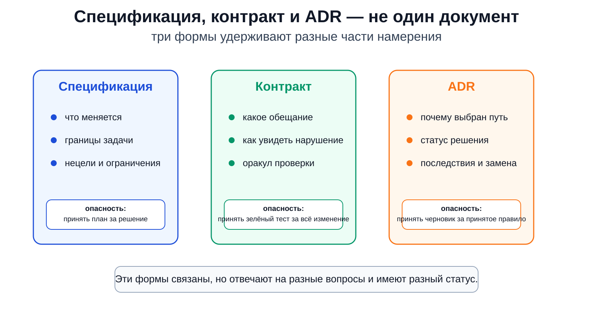
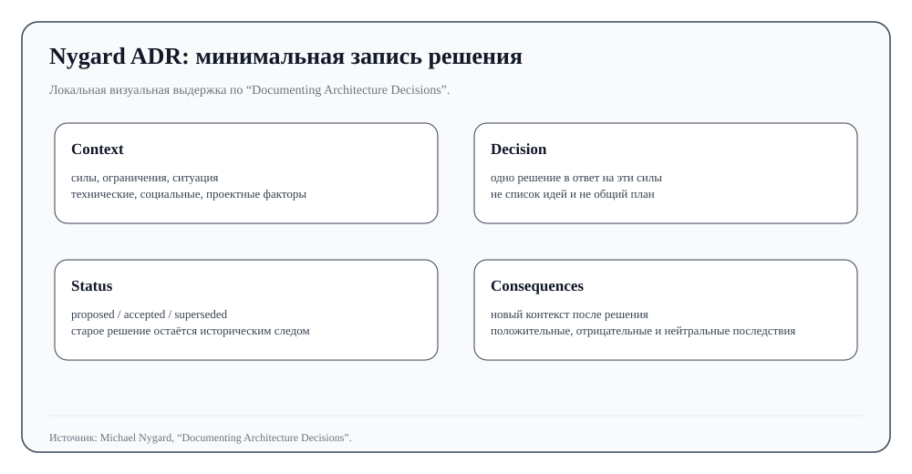
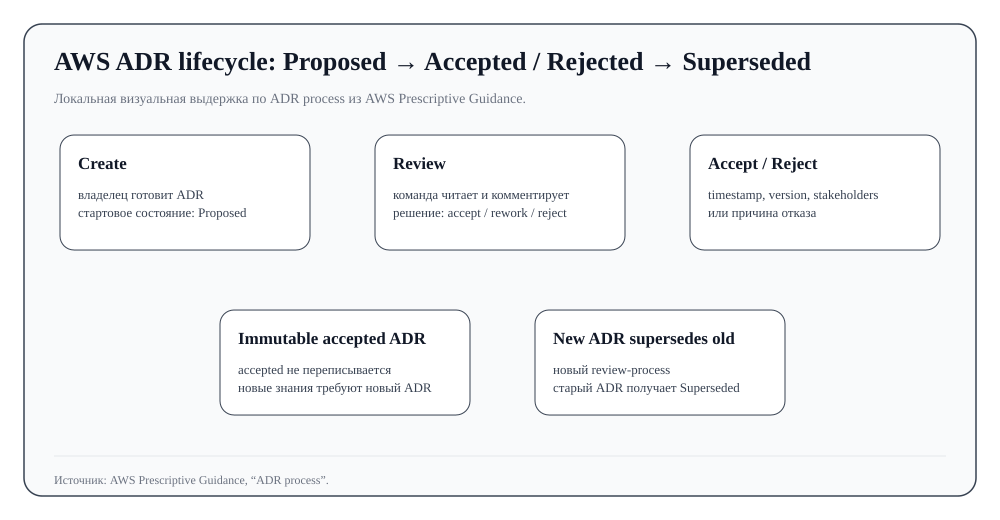
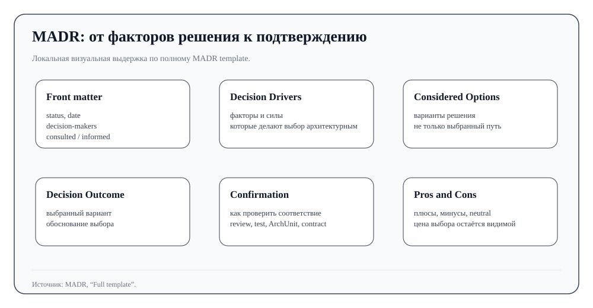
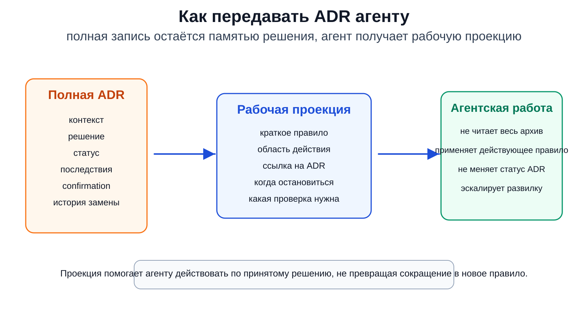

# III. Намерение, спецификация, контракт и ADR

## О чём эта глава

После агентской сессии остаются сообщения, логи, диффы, заметки, иногда план и короткое резюме. Они помогают восстановить ход работы, но ещё не показывают, что именно изначально хотели изменить и где это зафиксировано. По какому тексту или рабочему документу следующий агент, другой разработчик или сам автор через неделю поймёт, что работа не ушла в сторону?

Глава II остановилась на границе сессии. Сессия может быть плотной и хорошо управляемой, но она всё равно остаётся локальным исполнением. В ней человек уточняет задачу, агент читает код, пробует варианты, ошибается, исправляется и оставляет следы. Глава III начинается там, где этих следов уже недостаточно. Намерение должно получить форму вне разговора: сначала как спецификация, затем как проверяемое обещание, а при архитектурном выборе — как ADR (Architecture Decision Record, запись архитектурного решения) со статусом и последствиями.

Эти формы нельзя сводить к дополнительным файлам “для порядка”. Спецификация, контракт и ADR отвечают за разные части работы над изменением. Спецификация говорит, что должно измениться и где проходят границы задачи. Контракт выделяет часть ожидания, которую можно проверить. ADR хранит решение, его причину, статус, последствия и способ замены. Агент может подготовить любой из этих документов, но проект должен отдельно решить, что действительно принято.

## 1. Как намерение выходит за пределы агентской сессии

В короткой задаче намерение может оставаться в разговоре. Человек объясняет агенту, что нужно сделать, смотрит на дифф, поправляет очевидные ошибки и быстро принимает или отклоняет результат. Такой режим работает, пока изменение маленькое, обратимое и находится под близким человеческим контролем.

Проблема начинается, когда работа становится длиннее или дороже. Агент может правильно понять первую фразу, но через несколько шагов начать оптимизировать локальную реализацию. Часть смысла остаётся в плане, часть — в последнем сообщении, часть — в списке задач, часть — только в том, какие файлы агент прочитал и какие варианты отбросил. После сжатия контекста, перезапуска сессии или передачи работы другому исполнителю это уже не цельное намерение, а набор следов.

В реальных рабочих практиках этот сдвиг обычно выглядит буднично. У Boris Tane агент не начинает с кода: сначала он исследует систему, пишет план, получает человеческие пометки, обновляет план и только потом переходит к реализации. У HumanLayer дуга `research → plan → implement` нужна, чтобы смысл не потерялся между чтением кодовой базы и исполнением. У Matt Pocock разговор можно сжать в PRD — документ с требованиями к продукту, — затем разложить на вертикальные задачи и краткое задание для агента, потому что бесконечный чат плохо подходит для продолжения работы. В каждом случае документ не отчёт о прошедшем разговоре, а следующий рабочий предмет: его можно исправить, разделить на задачи, дать агенту и потом проверить.

Это не означает, что любой проект обязан начинать с тяжёлой спецификации. Лёгкое изменение может пройти через короткий план и близкую проверку. Важна сама граница: как только работа должна пережить текущую сессию, намерение нужно вынести в отдельный рабочий документ или другой внешний носитель, который можно читать, править, ревьюить и связывать с дальнейшими действиями.

## 2. Спецификация как рабочая форма намерения

Здесь спецификация — не идеальный формальный документ, а внешняя форма намерения. В ней должно быть понятно, что меняется, какие требования обязательны, какие соседние области не трогать, какие решения уже приняты человеком и где агент не должен угадывать.

Хорошая спецификация снижает число скрытых догадок. Если человек просит “добавить экспорт”, агенту всё равно нужно понять формат, объём данных, права доступа, обработку ошибок, совместимость, способ запуска, тесты и границы изменения. Пока эти вопросы остаются только в чате, агент может выбрать удобный вариант и не заметить, что выбрал его сам. Когда они записаны в спецификации, их можно обсуждать до кода и сверять после кода.

Разные методики оформляют этот переход по-разному. В SPDD спецификация становится сопровождаемым документом: она участвует в генерации, ревью и синхронизации с кодом. В Spec Kit похожий сдвиг виден через переход от `spec.md` к `plan.md` и `tasks.md`, а `constitution` задаёт ограничения более высокого порядка. Важна не цепочка команд сама по себе, а то, что намерение получает форму, по которой агент может работать, а человек — проверить, что задача понята не приблизительно.

Хорошая спецификация меняет и следующее допустимое действие агента. Пока задача остаётся только в разговоре, агенту легко перейти к реализации: других опор у него нет. Когда появляется спецификация, нормальным следующим шагом может стать уточнение неясного требования, проверка противоречия, подготовка плана, выделение риска или остановка перед архитектурной развилкой. Документ полезен не потому, что лежит в репозитории, а потому, что меняет ход работы. Поэтому важны не названия файлов сами по себе — `research.md`, `plan.md`, PRD или agent brief, — а то, что каждый из них ограничивает следующий ход агента.

У спецификации есть собственная слабость. Она может выглядеть настолько уверенно, что начинает играть чужую роль. Временный план вдруг читается как принятое архитектурное решение. Список требований начинает восприниматься как подтверждение того, что пользователь действительно хотел именно это. Сгенерированный документ получает тон завершённости, которого не было в исходном разговоре. Поэтому спецификация должна показывать границы своей силы: что она задаёт, что только предполагает и что требует отдельного решения.

Если задача затрагивает долговременную структуру системы, одной спецификации уже мало. Фраза “меняем слой хранения данных”, “выносим модуль в отдельный сервис”, “меняем публичный API” или “добавляем новую зависимость” может быть нормальной частью плана текущей работы. Но если этот выбор будет ограничивать будущие изменения, ему нужен другой статус.

Спецификация может зафиксировать выбор для текущей задачи, но сама по себе плохо отвечает на вопросы “почему”, “кто принял” и “как заменить”. Это не недостаток спецификации, а граница её роли. Если заставить её хранить ещё и память архитектурного решения, она быстро станет двусмысленной: следующий агент не поймёт, где рабочее предположение, где согласованный план, а где принятое правило проекта.

## 3. Контракт: проверяемая часть спецификации

Спецификация обычно шире, чем то, что можно проверить одной процедурой. Она может включать намерение, ограничения, сценарии, нецели, архитектурные варианты и требования к сопровождению. Контракт уже. Он выделяет обещание, нарушение которого можно увидеть.

Поэтому контракт начинается не с аккуратной формулировки требования, а с наблюдаемой границы. “Экспорт должен быть удобным” — ещё не контракт. “Пользователь с такой ролью получает файл в таком формате, с такими полями, а при такой ошибке видит такой ответ” — уже ближе к контракту: нарушение можно обнаружить. Контракт не обязан быть автоматическим тестом, но у него должна быть форма проверки.

Для API это может быть формат запроса и ответа. Для миграции — совпадение поведения старой и новой реализации на выбранном наборе сценариев. Для UI — доступность определённого пользовательского пути. Для агента — структурированный ответ, в котором есть решение, ссылка на узел работы, проверочный материал и сообщение пользователю. Для архитектуры — запрет зависимости, правило направления импортов или требование, что изменение не ломает публичный интерфейс.

Для этого нужно понятие оракула проверки: нужен способ решить, совпало ли наблюдаемое поведение с ожиданием. Этим способом может быть тест, схема, контракт между сервисами, миграционная проверка, ручной сценарий или ревью определённой границы. В любом варианте выбирается конкретная точка видимости. Контракт не обещает увидеть всё изменение сразу.

Именно поэтому контракт полезен: он превращает часть намерения в проверяемую границу. Он не спрашивает, хороша ли вся архитектура, и не заменяет человеческое суждение. Он говорит: вот конкретное обещание, вот способ увидеть, выполнено оно или нет.

Поэтому зелёный результат проверки нельзя читать слишком широко. Тест может показать, что выбранный сценарий прошёл. Контрактный тест может показать, что два участника взаимодействия соблюдают согласованный формат. OpenAPI diff — сравнение версий OpenAPI-схемы — может показать, что публичная схема изменилась или не изменилась определённым образом. Но всё это не объясняет, почему архитектурный выбор был правильным, достаточно ли покрыты риски и можно ли считать работу принятой.

В агентской разработке это различие особенно важно. Модель легко превращает один успешный сигнал в общий вывод. Она видит зелёные тесты и пишет, что изменение завершено. Видит чек-лист и ведёт себя так, будто все риски закрыты. Видит формальный контракт и начинает относиться к нему как к полному выражению намерения. Процесс должен удерживать реальную силу контракта, но не приписывать ему лишнего: контракт делает ошибку видимой на выбранной границе.

## 4. Почему спецификации и контракта мало для архитектурного решения

Спецификация и контракт закрывают важные части работы, но они не отвечают за всё изменение целиком. Спецификация задаёт границы задачи: что нужно изменить, чего не трогать, какие ожидания и ограничения уже известны. Контракт выделяет наблюдаемую часть обещания: по какому поведению, формату, сценарию или правилу можно увидеть, что выбранная граница соблюдена.

Архитектурное решение отвечает на другой вопрос: почему система должна быть устроена именно так, а не иначе. Этот вопрос появляется не в каждом изменении. Он становится важным, когда выбор будет влиять на будущие правки: структуру модулей, зависимости, публичный интерфейс, совместимость, способ интеграции, развёртывание, владение кодом или правила дальнейшего развития.

Представим задачу: новый модуль должен передавать событие в соседний сервис. В спецификации можно записать, что должно произойти с точки зрения пользователя и какие области кода менять нельзя. В контракте можно зафиксировать формат события, обязательные поля, совместимость старого и нового поведения. Но если команда решает не добавлять прямой синхронный вызов между сервисами, а идти через событийную интеграцию, это уже не просто требование текущей задачи. Это архитектурный выбор. Он отвечает на вопросы, которые не помещаются в обычный контракт: почему прямой вызов отвергнут, какие варианты рассматривались, какую цену команда готова заплатить, что станет проще, что станет сложнее и где это решение действует.

Здесь появляется место для явной записи архитектурного решения. ADR — удобная и распространённая форма такой записи, но не единственная: в разных командах похожую работу может выполнять архитектурный RFC, дизайн-документ, зафиксированное решение в задаче, обсуждение в pull request или внутренний журнал решений. Для этой главы важен не сам ярлык `ADR`, а свойства, которые такая запись должна удержать: причину архитектурного выбора, его статус, последствия и способ вернуться к решению позже. Без такой записи через несколько недель останутся код, тесты, PR-комментарии и, возможно, короткое объяснение агента. Но другой человек или другой агент снова начнёт выяснять, почему решение устроено именно так, можно ли его менять и не был ли более простой вариант уже отвергнут.

Для агентской разработки этот разрыв особенно заметен. Агент умеет быстро пройти от задачи к коду, но плохо различает историческую память проекта, действующее правило и аккуратно написанное предположение, если все три выглядят как уверенный текст. Он может найти старую запись, восстановить вероятную причину по коду или сам подготовить хорошо оформленную ADR. Поэтому дальше ADR рассматривается как конкретный и хорошо описанный пример такой формы. Она помогает отделить принятое архитектурное решение от черновика, локального плана и проверочного сигнала, но общая задача шире одного формата: проекту нужно ясно показывать, какое архитектурное решение действительно действует и на чём держится его статус.

<figure class="image-asset" id="fig-iii-spec-contract-adr-boundaries" data-asset-status="local_image_asset" data-repo-path="content/assets/theory-images/iii-spec-contract-adr-boundaries.svg">
  
  <figcaption>Рисунок III-0. Спецификация, контракт и ADR связаны, но не заменяют друг друга: первая удерживает границы задачи, второй выделяет проверяемое обещание, третья хранит архитектурное решение, его статус и последствия. Локально синтезированная схема для главы III.</figcaption>
</figure>

## 5. ADR: запись архитектурного решения, а не ещё один план

Классическая идея ADR у Michael Nygard проста: писать короткие записи о важных архитектурных решениях так, чтобы будущий разработчик понял контекст, само решение, его статус и последствия ([Nygard, “Documenting Architecture Decisions”](https://www.cognitect.com/blog/2011/11/15/documenting-architecture-decisions)). Martin Fowler описывает ADR как небольшую запись в журнале решений: она нужна не для тяжёлой архитектурной документации, а для сохранения причин, по которым система стала такой, какой стала ([Fowler, “Architecture Decision Record”](https://martinfowler.com/bliki/ArchitectureDecisionRecord.html)).

Подробный разбор ADR вынесен в [статью технического атласа «ADR как метод архитектурной памяти»](../../atlas/articles/adr_method.md). Там отдельно разобраны Nygard, Fowler, MADR — Markdown Architectural Decision Records, распространённый Markdown-шаблон для ADR, — `Confirmation`, восстановленные ADR и типичные сбои. В этой главе тот же материал нужен уже для другой задачи: на примере ADR видно, как намерение, контракт и проверка связываются с вопросом, может ли проект считать архитектурное решение действующим.

Эта форма важна именно своей скромностью. Хорошая ADR не пытается стать всей архитектурной документацией. Она фиксирует один существенный выбор. Обычно для этого достаточно нескольких частей: `Context`, `Decision`, `Status`, `Consequences`. Но эти части нужны не ради шаблона.

`Context` показывает, в каких условиях принималось решение: какие ограничения уже были в системе, какие требования давили на выбор, какие зависимости, сроки, совместимость, безопасность, стоимость миграции или организационные ограничения были существенны. Без контекста агент видит только правило и начинает применять его слишком широко. Решение, принятое из-за временного ограничения, может начать выглядеть как универсальный принцип проекта.

`Decision` фиксирует выбранный путь. Это не список идей и не протокол обсуждения. Для агента и будущего разработчика здесь важна практическая граница: что теперь считается правильным способом в этой области, а что требует нового обсуждения или новой ADR. Если проект принял событийную интеграцию вместо прямого вызова, эта часть должна сказать именно это, а не растворить решение в длинном объяснении.

`Status` отвечает на практический вопрос: можно ли применять эту запись как действующее решение. Это центральное различение для агентской разработки. Текст может быть красивым, убедительным и похожим на ADR, но без статуса непонятно, что перед нами: предложение, принятое решение, отвергнутый вариант, устаревшая запись или восстановленное предположение.

`Consequences` сохраняют цену решения. Они показывают не только выгоду, но и новые ограничения: что стало проще, что стало сложнее, какие будущие изменения теперь дешевле или дороже, какие проверки нужны, какие зависимости нельзя добавлять без пересмотра. Для агента это особенно важно: короткое правило без последствий превращается в механический запрет, а не в понимание архитектурного выбора.

Так устроенная запись отвечает на проблему, которую спецификация и контракт обычно не закрывают. Она объясняет не только “что нужно сделать” и “как проверить выбранную границу”, а “почему проект принял именно это решение и как дальше с ним работать”. ADR удобна здесь тем, что делает эти части явными и достаточно компактными.

<figure class="image-asset" id="fig-iii-adr-minimal-record" data-asset-status="local_image_asset" data-repo-path="content/assets/atlas-images/adr/adr-nygard-minimal-record.svg">
  
  <figcaption>Рисунок III-1. Минимальная ADR — это короткая запись решения с контекстом, статусом и последствиями, а не ещё один большой план. Локальный atlas-asset по мотивам <a href="https://www.cognitect.com/blog/2011/11/15/documenting-architecture-decisions">Michael Nygard, Documenting Architecture Decisions</a>.</figcaption>
</figure>

## 6. Статус архитектурного решения и его изменение со временем

ADR полезна только тогда, когда по ней можно понять, какое место запись занимает в жизни проекта. В простом случае решение сначала предложено, затем обсуждено и принято. Но в реальном проекте записи меняются: какие-то варианты отклоняются, какие-то решения заменяются, какие-то остаются как историческое объяснение.

Поэтому статусы вроде `proposed`, `accepted`, `rejected`, `superseded` — не формальность. `Proposed` говорит: решение ещё нельзя применять как правило проекта. `Accepted` говорит: проект признал это решение действующим в указанной области. `Rejected` важен не меньше: он сохраняет память о варианте, который уже рассматривали и отвергли, чтобы агент или человек не приносил его заново как будто с чистого листа. `Superseded` говорит: запись остаётся частью истории, но действующее решение теперь другое.

В [AWS Prescriptive Guidance по ADR process](https://docs.aws.amazon.com/prescriptive-guidance/latest/architectural-decision-records/adr-process.html) хорошо видна эта практическая дисциплина: ADR проходит состояние предложения, ревью, принятия или отклонения; принятую запись не переписывают задним числом, а при новом решении создают новую ADR, которая заменяет старую. Важно не копировать конкретную процедуру AWS, а удержать принцип: архитектурная память должна показывать, что действует сейчас и почему прежнее решение больше не действует.

Если этого нет, агентский контекст становится опасным. Модель может найти ADR со старым решением и применить её как новое правило. Может увидеть отвергнутый вариант и предложить его снова. Может восстановить вероятную ADR по коду и вести себя так, будто команда действительно принимала такое решение. В человеческом чтении такие ошибки ещё можно поймать по дате, соседним файлам, истории PR и здравому смыслу. Агенту лучше не оставлять это на догадку.

Статус не принимает решение сам. Решение принимает человек, команда, владелец области или установленный процесс. Но статус делает результат этого процесса видимым. Он говорит следующему исполнителю: эту запись можно использовать как действующую границу; эту нельзя; эта нужна только как история; эта требует проверки или обсуждения. Поэтому ADR в агентской разработке должна быть не просто хорошо написана, а правильно помещена в состояние проекта.

<figure class="image-asset" id="fig-iii-adr-lifecycle" data-asset-status="local_image_asset" data-repo-path="content/assets/atlas-images/adr/adr-aws-lifecycle-process.svg">
  
  <figcaption>Рисунок III-2. Архитектурное решение живёт во времени: его предлагают, обсуждают, принимают, применяют и при необходимости заменяют новой записью. Локальный atlas-asset по мотивам <a href="https://docs.aws.amazon.com/prescriptive-guidance/latest/architectural-decision-records/adr-process.html">AWS Prescriptive Guidance</a>.</figcaption>
</figure>

## 7. Пример архитектурного решения: запрет прямой зависимости между сервисами

Пусть команда добавляет новую возможность: сервис заказов должен сообщать сервису уведомлений о событии оплаты. Быстрый путь — сделать прямой синхронный вызов. Это удобно для агента: он видит место в коде, добавляет клиент, вызывает соседний сервис, пишет тест. Локально такое решение может выглядеть проще и даже пройти проверку.

Спецификация в этой задаче должна сказать: при оплате заказа должно появиться уведомление; нужно сохранить совместимость старых сценариев; нельзя добавлять жёсткую синхронную зависимость между сервисами, если команда уже считает это архитектурной границей. Она задаёт намерение и границы текущей работы.

Контракт выделяет проверяемое обещание. Например: при событии оплаты публикуется сообщение заданного формата; потребитель принимает прежнюю и новую версию схемы; при недоступности сервиса уведомлений оплата не должна падать. Эти вещи можно проверить тестом, контрактным тестом, схемой события или сценарной проверкой. Но даже успешная проверка не объясняет, почему команда выбрала событийную интеграцию и какие последствия этого решения принимает.

Для этой части нужна явная запись архитектурного выбора. В ADR или другом принятом проектом формате можно записать: прямой синхронный вызов отвергнут, потому что он связывает доступность двух сервисов и усложняет независимые релизы; выбран обмен через событие; цена решения — согласованность не сразу, отдельная обработка повторов, наблюдаемость очереди и дополнительные проверки схемы события; решение действует для интеграции заказов и уведомлений; при изменении способа интеграции нужна новая запись или пересмотр существующей.

Тогда `Confirmation` получает понятное место. Оно не доказывает, что вся архитектура идеальна. Оно говорит, чем проект будет проверять соблюдение принятого решения: ревью зависимостей, тест публикации события, проверка схемы, запрет прямого клиента в модуле заказов, ревью владельца интеграции. Если агент затрагивает эту область, он должен увидеть не абстрактный запрет, а связь: есть действующая ADR, у неё есть область действия, у изменения есть проверяемые признаки нарушения, а в некоторых случаях нужен человек.

Для агента из этой полной записи нужна рабочая проекция. Не весь длинный контекст обсуждения, а короткая инструкция с происхождением: “в интеграции заказов и уведомлений не добавлять прямой синхронный вызов; использовать событие; см. ADR-012; при изменении схемы события требуется проверка совместимости и ревью владельца интеграции”. Такая проекция полезна только потому, что за ней стоит исходная запись со статусом, последствиями и ссылкой.

## 8. `Confirmation`: как решение связывается с проверкой

Теперь `Confirmation` можно вводить в правильном месте. В шаблоне [MADR](https://adr.github.io/madr/decisions/adr-template.html) так называется часть ADR, где записывают, чем будет подтверждаться реализация или соблюдение решения: ревью дизайна или кода, тестом, архитектурной проверкой или другим проверочным действием. Она стоит не до ADR, а внутри логики ADR: если проект принял архитектурное решение, ему нужно понимать, как потом заметить, что реализация не ушла в сторону.

`Confirmation` не превращает ADR в тест. Оно связывает решение с будущей проверкой. В нём стоит фиксировать более узкие вещи: какое поведение должно быть видно после реализации, какая граница должна сохраниться, кто или что проверяет эту границу, где нужна автоматическая проверка, а где владельческое ревью.

Иногда такую проверку можно сделать исполнимой. В evolutionary architecture для этого используется понятие [`fitness function`](https://evolutionaryarchitecture.com/precis.html): так называют проверку некоторой архитектурной характеристики системы. Например, можно запретить нежелательную зависимость, проверить направление импортов или следить за временем ответа. Но даже в этом случае проверка остаётся частичной. Она подтверждает выбранный признак, а не всю разумность архитектурного решения.

В других случаях `Confirmation` проходит через ревью и владение областью. GitHub `CODEOWNERS` позволяет автоматически запрашивать ревью у владельцев путей или областей кода; branch protection, то есть защита ветки, может требовать такого ревью перед слиянием ([GitHub CODEOWNERS](https://docs.github.com/repositories/managing-your-repositorys-settings-and-features/customizing-your-repository/about-code-owners), [GitHub protected branches](https://docs.github.com/en/repositories/configuring-branches-and-merges-in-your-repository/managing-protected-branches/managing-a-branch-protection-rule)). Это не ADR-система сама по себе, но хороший пример того, как решение можно связать с практическим механизмом проверки: если изменение затрагивает архитектурно важную область, его должен увидеть нужный владелец.

В агентской разработке снова нужна осторожность. Зелёный сигнал проверки не означает, что решение принято. Успешное ревью зависимости не означает, что все последствия решения поняты. `Confirmation` помогает проекту не потерять связь между решением и проверкой, но достаточность проверки и право принять изменение остаются отдельными вопросами. Они вернутся в главах о проверочном материале и внешнем контуре ответственности.

<figure class="image-asset" id="fig-iii-adr-confirmation" data-asset-status="local_image_asset" data-repo-path="content/assets/atlas-images/adr/adr-madr-template-confirmation.svg">
  
  <figcaption>Рисунок III-3. `Confirmation` связывает архитектурное решение с проверкой, наблюдаемостью и поддержанием решения в силе после его принятия. Локальный atlas-asset по мотивам MADR.</figcaption>
</figure>

## 9. Как передавать агенту действующее архитектурное решение

Полный журнал ADR почти никогда не стоит целиком помещать в активный контекст агента. То же относится к длинным RFC, дизайн-документам и архитектурным обсуждениям. В длинном проекте там будут старые решения, заменённые решения, предложения, отклонённые варианты, длинные обоснования и исторические детали. Агент получит много текста и будет вынужден сам решать, что действует сейчас.

Но обратный вариант тоже плох: не давать архитектурных решений вообще. Тогда агент оптимизирует локально, заново придумывает архитектуру и может нарушить решение, которое проект уже принял.

Практический ответ — краткая рабочая проекция действующего решения. Она может опираться на ADR, RFC, дизайн-документ или другой принятый проектом источник. Полная запись остаётся памятью решения, а агент получает короткое представление для текущей работы:

```text
принятая ADR
→ область действия
→ короткое правило для агента
→ ссылка на исходную запись
→ проверка или ревью, если изменение затрагивает это решение
```

Такая проекция должна быть скромной. Она не создаёт нового решения и не заменяет исходную запись. В ней должны быть статус, область действия, краткое правило, ссылка на источник, условия пересмотра и ожидаемая проверка. Если этого нет, проекция быстро становится неподконтрольной инструкцией: агент действует по сжатому правилу, происхождение которого уже никто не может проверить.

В процессе нужна точка остановки: агент должен заметить, что изменение затрагивает принятую ADR, и поднять вопросы, которые нельзя решать по инерции. Есть ли действующая запись? Какую область она покрывает? Можно ли проверить соблюдение автоматически? Где нужен человек или владелец области?

Такая остановка не принимает решение за проект. Она только не даёт агенту проскочить момент, где локальная реализация превращается в архитектурный выбор.

<figure class="image-asset" id="fig-iii-adr-agent-projection" data-asset-status="local_image_asset" data-repo-path="content/assets/theory-images/iii-adr-agent-projection.svg">
  
  <figcaption>Рисунок III-4. Агенту обычно не нужен весь журнал архитектурной памяти; ему нужна рабочая проекция действующего решения с областью действия, ссылкой на ADR, условиями остановки и проверкой. Локально синтезированная схема для главы III.</figcaption>
</figure>

## 10. Запись, подготовленная или восстановленная агентом: происхождение не равно статусу

Если архитектурное решение существует как текстовая запись, модель может помочь её подготовить. Это особенно видно на ADR, потому что у неё есть компактный и узнаваемый формат. Агент может подготовить черновик по обсуждению, собрать варианты, восстановить вероятную причину по обсуждениям задач и истории коммитов, предложить `Confirmation` или заметить, что изменение нарушает принятое решение.

Это полезно, но создаёт новый риск: хорошо оформленный документ может выглядеть как уже принятое решение. Уже есть исследования, где LLM используют для генерации архитектурных решений; например, Dhar et al. показывают, что модель может выдавать релевантные и точные решения в некоторых условиях, но результат всё ещё не достигает человеческого уровня ([Dhar et al., 2024](https://arxiv.org/abs/2403.01709)). Практический вывод для агентской разработки уже ясен: модель может помогать готовить запись, но из этого не следует, что она получила право принять архитектурное решение или изменить его статус.

Есть и другой вариант: агент может не только писать новую ADR, но и восстанавливать архитектурную память из репозитория. В подходах вроде [AgenticAKM](https://arxiv.org/html/2602.04445v1), где агент помогает восстанавливать архитектурную память проекта, для этого нужен не один запрос, а процесс с извлечением, поиском, генерацией и проверкой. Из этого следует практическое предупреждение: восстановленная запись полезна для обсуждения и наведения порядка, но она не становится исторически принятой ADR только потому, что агент нашёл убедительные признаки в коде.

Поэтому для любой такой записи нужно развести две оси:

```text
происхождение: human-written / agent-drafted / reconstructed / imported
статус: proposed / accepted / rejected / superseded
```

`Происхождение` говорит, откуда появилась запись: её написал человек, подготовил агент, восстановили по коду и истории работы или перенесли из другого места. `Статус` говорит, какое место она занимает в процессе проекта. `agent-drafted`, то есть подготовленная агентом запись, не означает `accepted`. `reconstructed`, восстановленная запись, не означает, что команда действительно так решила в прошлом. `imported`, перенесённая запись, не означает, что правило применимо к текущему репозиторию без проверки.

Чтобы такая запись была безопасной для проекта, в ней должно быть видно, из чего она собрана, какие пробелы остаются, где нужна человеческая проверка, какой у неё текущий статус и какой план `Confirmation` потребуется, если запись будет принята. Без этого агентский документ может стать опаснее обычной заметки: он звучит уверенно, оформлен привычно, но его место в проекте неясно.

В агентском проекте формат не должен подменять принятие. ADR выглядит как ADR потому, что в ней есть заголовки `Context`, `Decision`, `Status` и `Consequences`. Но пока проект не присвоил ей статус, это только подготовленный материал. То же правило относится к RFC, дизайн-документу, задаче или pull request: аккуратно написанная запись помогает думать и проверять, но не становится действующим решением сама по себе.

## 11. Результат работы агента нуждается в проверке перед принятием

Это различение касается не только ADR. Агент может подготовить спецификацию, контракт, план проверки, PRD, миграционный план, описание релиза, архитектурный отчёт или дифф. Всё это может быть хорошей работой. Но даже хороший результат работы агента нужно проверить и принять отдельно.

Mike McQuaid показывает эту границу на стороне кода. Даже если агент работал в песочнице, с отдельными worktrees, CI и дополнительным автоматическим ревью, итог всё равно должен быть локальным диффом, который разработчик читает и принимает. В правилах Homebrew для AI/LLM contributions та же мысль становится социальной: автор обязан сам проверить сгенерированный код, текст и другой материал до того, как просит мейнтейнеров о ревью. Иначе стоимость проверки переносится на мейнтейнеров.

С документами происходит то же самое. Уверенно написанная спецификация не доказывает, что намерение понято правильно. Контракт не подтверждает всю архитектуру. ADR не становится принятой из-за формата. Маркер завершения агента не означает, что проект завершил изменение.

Зрелый процесс должен держать разные статусы раздельно. Агент может завершить свой локальный цикл. Тест может пройти выбранный сценарий. Ревью может покрыть указанную область. ADR может быть предложена, принята, отклонена или заменена. Слияние в общую ветку может ввести код в основную линию разработки. Эти события связаны, но их нельзя сливать в один общий флаг `done`.

Из этого следуют два вопроса. Первый — проверочный: какие результаты проверки достаточно сильны для данного обещания и где их граница. Второй — вопрос о праве принятия: кто может сказать, что изменение вошло в проект, а не просто было подготовлено агентом. В реальной работе они часто звучат как один вопрос: “всё прошло, можно считать готовым?” Для агентской разработки их нужно развести, иначе зелёный сигнал слишком легко превращается в право завершить работу.

После начала исполнения появляется ещё один слой. Спецификация говорит, какое изменение нужно провести. Контракт говорит, что проверить. ADR говорит, почему решение принято. Но ни один из этих документов сам по себе не хранит владельца текущей работы, блокировки, безопасную точку продолжения, частично прикреплённые результаты проверки или состояние передачи между сессиями. Для этого нужен отдельный слой рабочего состояния.

Документы могут быть на месте: `requirements.md`, `design.md`, `tasks.md`, ADR-проекция, чек-лист и зелёный тест. Но после обрыва всё равно остаются практические вопросы. Кто сейчас владеет узлом работы? Можно ли другой сессии писать в тот же файл? Какая проверка уже связана с каким обещанием? Какое человеческое решение ещё не принято? От какого снимка нужно продолжать? Если это осталось только в локальной сессии или последнем сообщении агента, следующий исполнитель снова будет угадывать состояние.

## 12. Переход к SPDD и дальше

Итоговое различение простое, но в агентской работе оно легко стирается. Намерение выходит из разговора и получает форму, пригодную для работы агента. Спецификация удерживает ожидаемое изменение и границы. Контракт выделяет проверяемое обещание. ADR сохраняет архитектурное решение: почему оно принято, где действует, какой у него статус, какие последствия оно создаёт и чем проект будет проверять соблюдение этого решения. ADR, подготовленная или восстановленная агентом, остаётся рабочим материалом, пока в проекте ей не присвоили статус.

Следующая глава может углубиться в SPDD как сильный частный случай. Там спецификация перестаёт быть подготовительной заметкой и становится рабочим документом, который сопровождает разработку: она управляет генерацией, участвует в ревью и должна возвращаться в документы, решения и текущее состояние проекта.

Дальше эти границы будут раскрыты отдельно. Глава V сравнит защищённые спецификационные профили. VI и VII покажут, как из спецификации и решения возникает устойчивое рабочее состояние. XI разберёт, каких результатов проверки достаточно для принятия. XII отделит право агента действовать от права проекта признать изменение завершённым.

Итоговый вывод простой: агентская разработка требует не больше документов ради документов, а точного различения статусов. Что было сказано в разговоре. Что записано как намерение. Что стало проверяемым обещанием. Что принято как архитектурное решение. Что только подготовлено агентом. И кто имеет право сказать, что работа действительно вошла в проект.
