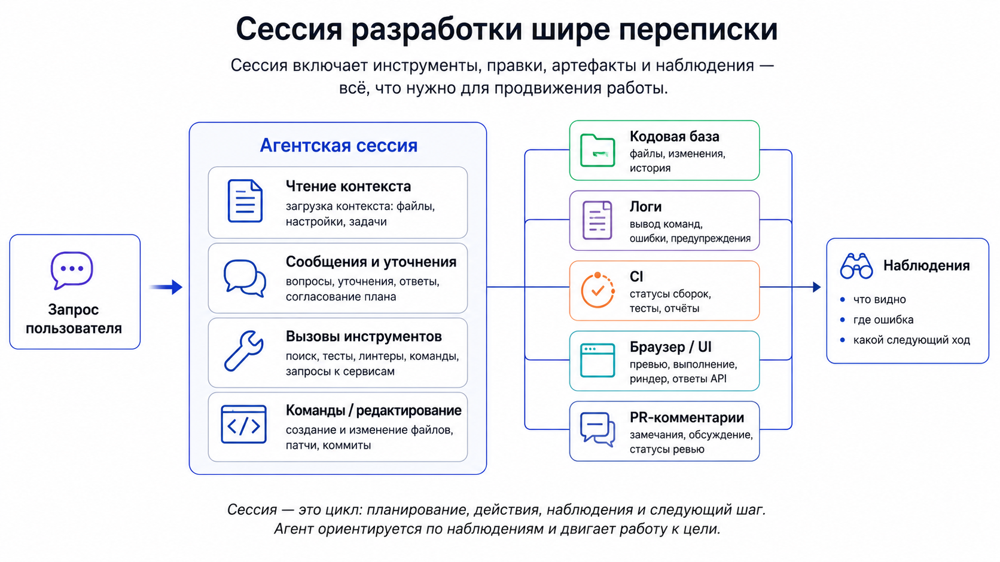
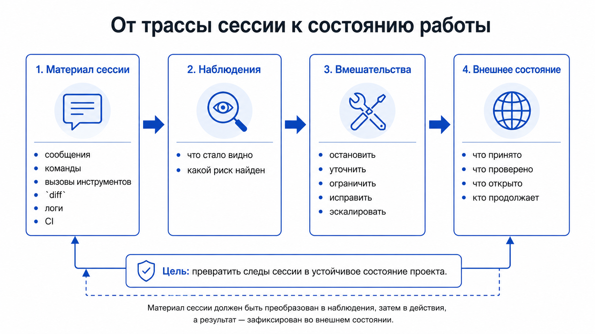
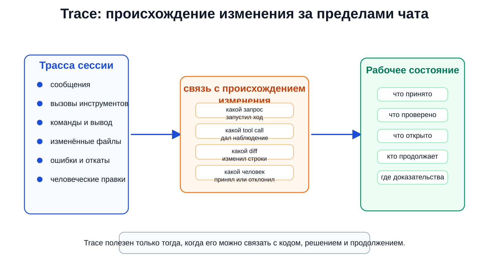

# II. Агентская сессия: след работы, вмешательство и то, что остаётся после неё

## Зачем вообще смотреть на сессию

В агентской разработке первое, что бросается в глаза, — сама сессия. Человек пишет задачу, агент читает файлы, предлагает ход, меняет код, запускает команды, получает ошибку, открывает браузер, исправляет себя, снова запускает проверку и в конце оставляет дифф. На экране это выглядит как почти вся работа: переписка, терминал, браузер, логи, финальное «готово».

Это впечатление нельзя просто отбросить. Без сессии изменение часто вообще не приходит в движение. Начальная просьба редко бывает полной: человек описывает проблему так, как он её сейчас видит; агент сталкивает эту просьбу с проектом; первый запуск, ошибка или странное поведение интерфейса уточняют задачу; человек смотрит на промежуточный результат и вмешивается. Именно в сессии намерение впервые встречается с реальной системой.

Но отсюда легко сделать неверный вывод: раз работа видна в сессии, значит, состояние работы там и хранится. Это не так. Длинная переписка показывает, что говорили участники. Лог показывает, что запускалось. Скриншот показывает один момент поведения. Всё это может быть полезно, но само по себе не отвечает на более жёсткие вопросы: что теперь принято, что проверено, что осталось спорным, где граница изменения, кто имеет право продолжить и что следующая сессия должна считать действительным состоянием задачи.

После первой главы единицей анализа остаётся программное изменение, а не промпт, не отдельная задача и не дифф. У изменения есть источник потребности, намерение, ограничения, затронутые контракты, среда исполнения, проверки, решение о принятии и дальнейшая жизнь в проекте. Поэтому нужно сразу развести три уровня. Промпт — входная фраза или пакет инструкций. Задача — локальная работа, которую можно поручить человеку или агенту: исследовать, поправить, проверить, написать тест, разобрать комментарий. Изменение — более длинный объект: оно проходит через намерение, решение, исполнение, проверку, принятие и сопровождение. В маленькой правке эти уровни могут совпасть; в реальной работе они быстро расходятся. Один промпт порождает несколько задач, одна задача оказывается только подготовкой, а одно изменение переживает несколько сессий.

Здесь появляется первый практический разрыв внутри этой рамки: агентская сессия хорошо показывает ход работы, но плохо работает как единственная память изменения.

Это хорошо видно в исследовании [`Programming by Chat`](https://arxiv.org/abs/2604.00436): 74 998 сообщений из 11 579 IDE-сессий в 1 300 репозиториях, 899 разработчиков, Cursor и GitHub Copilot. У авторов работа с агентом часто описывается как progressive specification — задача уточняется уже в разговоре, а не передаётся модели в окончательном виде. Разработчик добавляет контекст, меняет формулировку, выносит планы во внешние артефакты и ограничивает автономию агента по ходу работы.

Инженерный смысл здесь простой. Сессия нужна именно потому, что намерение в ней ещё движется. Человек видит первый результат и понимает, что исходная просьба была неточной. Агент читает проект и находит ограничение, которого не было в запросе. Тест падает не там, где ожидали. Браузер показывает другой сценарий. Поэтому сессию нельзя считать шумом вокруг «настоящей» разработки. Но по той же причине её нельзя считать надёжным долговременным носителем смысла: если смысл задачи менялся в процессе, его надо потом вынести в форму, которую можно прочитать отдельно от живого разговора.

Проверка наступает в момент разрыва. Чат оборвался. Контекст модели сжался. Работу надо передать другому агенту. Человек возвращается через неделю. Если единственный способ продолжить — заново перечитать длинную переписку и угадать, что из неё было важно, состояние изменения не стало переносимым. Оно существовало в совместном внимании человека и агента, но не стало рабочим состоянием проекта.

## След сессии шире переписки

Когда говорят «сохраним сессию», часто имеют в виду только переписку: реплики человека и модели. Для агентской разработки этого мало. Настоящий след сессии шире. В него входят сообщения, вызовы инструментов, команды, вывод терминала, открытые файлы, изменения в коде, ошибки консоли, браузерные действия, скриншоты, замечания ревью, сигналы CI, промежуточные решения человека, остановки, возвраты и финальный дифф.

Эти вещи нельзя сваливать в одну кучу. Переписка показывает, что было сказано. Лог показывает, что запускалось. Дифф показывает, что изменилось в файлах. Браузер и скриншот показывают, что стало видно в интерфейсе. След сессии интересен как связка этих материалов: почему агент пошёл в этот файл, на какой ошибке сменил гипотезу, где человек сказал «нет, ты чинишь не тот случай», какая проверка была запущена и что она реально показала.

[`SWE-chat`](https://arxiv.org/abs/2604.20779) даёт хороший внешний язык для этой разницы. Авторы описывают 6 000 реальных сессий с кодовыми агентами, больше 63 000 пользовательских запросов и больше 355 000 вызовов инструментов. Важен не только масштаб, а сам тип материала: полные следы взаимодействия (`complete interaction traces`), где можно связывать запросы, вызовы инструментов, вклад человека и агента в код, пользовательскую коррекцию и дальнейшую судьбу агентского кода в коммитах. Это уже не вопрос «что модель сказала», а вопрос о том, как её действия прошли через инструменты, код и последующее принятие или исправление.

Именно поэтому простая переписка не закрывает задачу. Агент мог написать код, а человек потом исправил или отклонил часть результата. Тест мог пройти, но проверять не то обещание. Браузер мог показать исчезновение симптома, хотя соседний сценарий остался сломанным. Агент мог уверенно пересказать запуск, но не сохранить команду и вывод. В каждом из этих случаев финальная фраза модели слабее, чем проверяемая цепочка событий.

Эта граница хорошо видна в рабочих формах Simon Willison. В исследовательских задачах агент может работать в отдельной зоне, ставить зависимости, запускать код и возвращать не только ответ, но и маршрут: что было проверено, какой бенчмарк или прототип получился, где лежит результат. Showboat и Rodney доводят ту же мысль до демонстрационного документа: рядом оказываются команда, сохранённый вывод, браузерное действие, скриншот и возможность заново проверить маршрут. Результат перестаёт быть просто рассказом агента о том, что он будто бы сделал. [Simon Willison, `Code research projects with async coding agents like Claude Code and Codex`](https://simonwillison.net/2025/Nov/6/async-code-research/), [`Introducing Showboat and Rodney`](https://simonwillison.net/2026/Feb/10/showboat-and-rodney/).

Но такой след силён только пока связан с настоящим выполнением. Если агент просто редактирует Markdown и вписывает туда правдоподобный вывод, документ начинает выглядеть как проверенный маршрут, хотя маршрута не было. След сессии ценен настолько, насколько он сохраняет происхождение результата и остаётся проверяемым.

Полный след помогает восстановить прошлое. Но он не говорит автоматически, что теперь считается состоянием проекта. Для этого его нужно прочитать, отобрать важное и связать с внешними артефактами: задачей, PR, проверкой, решением, заметкой для продолжения или записью открытого долга.

<figure class="image-asset" id="fig-ii-session-wider-than-chat" data-asset-status="local_image_asset" data-repo-path="content/assets/theory-images/ii-session-wider-than-chat.png">
  
  <figcaption>Рисунок II-1. Сессия разработки шире переписки: в реальной работе в неё входят чтение контекста, инструменты, правки, логи, CI, UI и PR-комментарии, а итогом становятся наблюдения о следующем ходе. Локально синтезированная схема по мотивам <a href="https://arxiv.org/abs/2604.00436">Programming by Chat</a> и <a href="https://arxiv.org/abs/2604.20779">SWE-chat</a>.</figcaption>
</figure>

## Почему сессия хорошо показывает ближайшую причинность

Сессия сильна тем, что находится рядом с исполнением. В ней видны короткие причинные цепочки: агент изменил файл, тест упал иначе, он прочитал лог, сузил гипотезу, открыл браузер, увидел другой экран, поправил обработчик, получил новый дифф. Такой ход часто важнее общего отчёта «я внёс исправление». По нему человек понимает, где агент ориентируется верно, где не понял проект, где расширяет область правки и где его нужно остановить.

Обычная сцена быстро показывает, почему это важно. Человек просит: «после сохранения настроек кнопка остаётся выключенной». Агент находит компонент, меняет состояние кнопки и запускает локальную проверку. В браузере симптом вроде бы исчезает, но в консоли появляется ошибка авторизации; лог сервера показывает, что проблема возникает только после протухшей сессии; человек вмешивается и уточняет: «не чини кнопку, у нас ломается восстановление состояния после 401». Первый дифф был не бесполезным: он дал наблюдение и вывел работу на настоящий сбой. Но без браузера, консоли, лога и человеческого уточнения сессия легко ушла бы в красивое исправление не той проблемы.

На лёгком краю этого режима находится практика Peter Steinberger: короткий запрос, быстрый просмотр диффа, малый радиус изменения и готовность остановить агента, если тот пошёл в сторону. Браузерная обратная связь здесь не превращает сессию в большую систему; наоборот, она поддерживает быстрый ручной цикл: попросил, посмотрел, поправил направление, откатил лишнее. Это не универсальный совет «пиши меньше документов», а экспертный режим, где безопасность берётся из плотного человеческого внимания и дешёвого отката. [Peter Steinberger, `Just Talk To It`](https://steipete.me/posts/just-talk-to-it), [`Optimal AI Development Workflow`](https://steipete.me/posts/2025/optimal-ai-development-workflow).

Arvid Kahl смещает ту же близость к исполнению в сторону живого продукта. Браузер, DOM, консоль и скриншоты дают агенту «глаза»: он видит не только код, но и поведение интерфейса. Ошибка в консоли или неправильное состояние страницы становится входом для следующего хода. Но это всё ещё наблюдение за исполнением, а не принятие результата. Браузер помогает диагностике; он не заменяет критерии, тесты, владение областью и решение человека. [Arvid Kahl, `How to Actually Use Claude Code to Build Serious Software`](https://thebootstrappedfounder.com/how-to-actually-use-claude-code-to-build-serious-software/).

Ещё ниже лежит почти бытовая сторона той же проблемы: агенту нужны команды, которые дают понятный сигнал. У Armin Ronacher это `make dev`, логи, маленькие CLI-инструменты, простые проверки, а позже Pi с деревьями сессий, файлами запросов и явными командами вроде `/is` и `/wr`. Важен не конкретный инструмент. Важна поверхность, где действие агента можно запустить, увидеть, прочитать и остановить. Чем меньше эта поверхность похожа на скрытую магию, тем легче человеку понимать ход работы. [Armin Ronacher, `Agentic Coding Recommendations`](https://lucumr.pocoo.org/2025/6/12/agentic-coding/), [`Pi: The Minimal Agent Within OpenClaw`](https://lucumr.pocoo.org/2026/1/31/pi/), [`/is`](https://github.com/earendil-works/pi/blob/main/.pi/prompts/is.md), [`/wr`](https://github.com/earendil-works/pi/blob/main/.pi/prompts/wr.md).

Вместе эти режимы разводят функции, которые легко спутать. Короткий ручной цикл и малый радиус — одно. Наблюдение живого интерфейса — другое. Исполнимая поверхность, которую агент и человек могут читать, — третье. Все они делают сессию лучше, но не превращают её в долговечное состояние работы.

Тут важно не назвать всю обвязку одним словом «среда» и не ждать от неё невозможного. Worktree или песочница задают границу, где агент имеет право действовать. Браузер, логи, команды и MCP задают поверхность наблюдения и доступных действий. Скрипт или движок рабочего процесса удерживает порядок шагов, повтор и восстановление запуска. Платформенный слой доводит результат до PR, CI, ревью и владельцев. Один и тот же механизм может занимать несколько слоёв, но вопросы у этих слоёв разные.

Ошибка обычно начинается там, где от одного слоя ждут свойств другого. Worktree ограничивает область записи, но не говорит, какой план достаточен. Браузер показывает поведение, но не задаёт критерий приёмки. Workflow engine может повторить шаги и сохранить запуск, но не решает, можно ли принять результат. PR собирает дифф, проверки и обсуждение, но само право завершения всё равно остаётся у людей и правил проекта.

Лог говорит, что произошло. Worktree ограничивает ущерб. Браузер показывает поведение. CI даёт сигнал по выбранным проверкам. А состояние работы отвечает на другой вопрос: что теперь считается сделанным, что заблокировано, что ещё требует решения, кто может продолжить и на каком основании результат можно принять.

## Вмешательство человека — нормальная часть сессии

В аккуратных рассказах об агентской разработке человека часто видно только в начале и в конце: дал задачу, принял результат. Реальная работа почти никогда так не выглядит. Человек вмешивается в середине, потому что именно в середине становятся заметны ошибки понимания.

Агент может буквально выполнить просьбу и получить бессмысленно правильный результат. Может не заметить неявный запрет на соседнюю область. Может решить, что зелёный тест доказывает больше, чем он доказывает. Может сообщить о завершении, не проверив важный путь. Может поверхностно прочитать репозиторий и чинить симптом не в том месте. Такие сбои не всегда видны по финальному диффу. Они проявляются раньше: в выборе файла, первой гипотезе, неверном объяснении ошибки, попытке расширить правку.

[`How Coding Agents Fail Their Users`](https://arxiv.org/abs/2605.29442) полезен тем, что смотрит не только на лабораторные траектории, а на реальные сессии. Авторы анализируют 20 574 сессии из 1 639 репозиториев и используют developer pushback как видимый маркер misalignment. Они выделяют повторяющиеся формы сбоев: как агент читает проект, понимает намерение, следует правилам, ограничивает действие, реализует и исполняет код, сообщает о прогрессе. Отсюда важен общий вывод: вмешательство разработчика — не паранойя отдельных пользователей, а обычная часть работы с агентом; видимое исправление таких сбоев часто начинается именно с явной коррекции со стороны пользователя.

На стадии PR вмешательство становится ещё более явным. В `/babysit-pr` у Jökull Sólberg агент получает не расплывчатое «исправь всё», а процедуру сопровождения: дождаться CI, разобрать замечания, классифицировать сигналы как Fix / Dismiss / Escalate, исправить очевидное, объяснить отклонение спорного и вернуть человеку то, где требуется решение. Это не автономный PR-менеджер, а управляемый разбор сигналов. Агент снимает рутину ожидания и сортировки, но не получает право автоматически решать спорные вопросы. [Jökull Sólberg, `Babysitting PRs With Claude Code`](https://www.solberg.is/babysit-pr).

Человеческое вмешательство не портит сессию, а возвращает в неё намерение, область действия и границу ответственности. Иногда человек уточняет требование. Иногда запрещает соседнюю правку. Иногда говорит: этот сигнал надо исправить, этот можно отклонить, а этот нужно эскалировать. Иногда останавливает работу не потому, что агент слабый, а потому что следующий шаг уже требует решения, которого агент не имеет права принимать.

Из этого следует ещё одно различение: сигнал в сессии помогает двигаться дальше, но не каждый сигнал является основанием принять изменение.

## Наблюдение ещё не основание принять изменение

Сессия производит много видимых сигналов. Тест упал. Тест прошёл. Лог показал ошибку. Браузер открыл нужный экран. CI стал зелёным. Агент написал резюме. Ревьюер оставил комментарий. Всё это важно, но статус у этих материалов разный.

Наблюдение нужно для следующего рабочего хода. Если тест упал, агент ищет причину. Если консоль показала ошибку, человек или агент сужает гипотезу. Если браузер показал неправильное состояние, сессия возвращается к коду. Такое наблюдение может быть очень ценным, даже если его ещё нельзя использовать как основание для принятия результата.

Основание для принятия появляется только после других вопросов. Что именно проверялось? Какая область покрыта? Какой критерий применён? Где сохранён результат? Можно ли повторить проверку? С каким требованием, контрактом или решением связан этот сигнал? Кто имеет право сказать «достаточно» и по какому признаку работа должна вернуться назад?

Один и тот же скриншот в середине отладки остаётся наблюдением. Тот же скриншот, связанный с конкретным пользовательским маршрутом, версией кода, ожидаемым поведением и критерием отказа, может стать частью проверочного материала. Сила материала зависит не от количества сигналов, а от качества связи между сигналом и обещанием изменения. У сильного проверочного материала есть область действия, критерий, след происхождения, воспроизводимость, связь с требованием или решением, владелец проверки и критерий отказа. Без этой цепочки тесты, логи, скриншоты, записи воспроизведения, записи разговора и комментарии к PR остаются полезными наблюдениями. С этой цепочкой они становятся материалом, на основании которого можно принять изменение, вернуть его на доработку или остановить выпуск.

Самоотчёт агента здесь особенно ненадёжен. Фраза «я запустил тесты, всё зелёное» может быть полезным указателем, но она не сообщает, какие тесты запускались, в каком окружении, после какого диффа и какое обещание они проверяли. Человеку нужен не уверенный тон модели, а команда, вывод, ссылка на CI, сохранённый лог, тест, дифф, скриншот, PR-комментарий или другой объект, к которому можно вернуться.

Полная теория проверок и ревью начинается позже. Здесь достаточно удержать рабочую границу. Наблюдение адресовано следующему ходу работы. Основание для принятия адресовано решению о судьбе изменения: принять, вернуть на доработку, расширить проверку, отклонить или остановить выпуск. Один и тот же артефакт может перейти из одного статуса в другой, но только если к нему добавлены область проверки, критерий и владелец решения.

<figure class="image-asset" id="fig-ii-session-trace-to-state" data-asset-status="local_image_asset" data-repo-path="content/assets/theory-images/ii-trace-to-work-state.png">
  
  <figcaption>Рисунок II-2. Материал сессии сначала помогает наблюдать и вмешиваться, но для продолжения работы должен быть переведён во внешнее состояние: что принято, что проверено, что открыто и кто продолжает. Локально синтезированная схема для главы II.</figcaption>
</figure>

Схема грубая, но полезная. Она не пытается классифицировать все инструменты. Она разводит статусы материала. Пока сигнал живёт только в текущем разговоре, он помогает управлять текущей работой. Если он должен поддерживать продолжение проекта завтра, его нужно связать с внешним состоянием.

## Что должно остаться после обрыва

Результат сессии сохранён не тогда, когда агент написал «готово». И не тогда, когда человек примерно помнит, что происходило. Он действительно перенесён дальше тогда, когда следующий человек или агент может продолжить работу, не выясняя заново, что было сделано, что проверено и где остались риски.

После полезной сессии должны остаться ответы на практические вопросы. Что пытались изменить? Какие ограничения появились по ходу? Какие места проекта затронуты? Какие проверки запускались и что они действительно показали? Что принято, что отклонено, что осталось долгом? Где находится след сессии, если к нему нужно вернуться? Что должен знать следующий исполнитель, чтобы не начать заново и не повторить уже отвергнутую гипотезу?

Плохая передача работы звучит как «починили проблему с настройками, тесты зелёные». Хорошая передача говорит иначе: исходный симптом оказался следствием 401 после протухшей сессии; гипотеза про состояние кнопки отклонена; изменён обработчик восстановления авторизации; вручную проверен путь сохранения после повторного входа; запущены такие-то тесты; соседний сценарий с несколькими вкладками не проверялся и остаётся долгом. В первом случае следующий агент снова выясняет, что вообще произошло. Во втором он получает состояние работы, а не просто воспоминание о разговоре.

Минимальная форма такого остатка может быть очень простой: несколько строк в задаче, комментарий в PR, короткая записка для следующей сессии. Важно не название файла, а состав сведений: исходный симптом, найденная причина, изменённые места, выполненные проверки, незакрытые риски и следующий безопасный ход. Если этого нет, даже удачная сессия остаётся эпизодом, который приходится заново восстанавливать по переписке и диффу.

Это и есть граница между следом сессии и состоянием работы. След помогает восстановить, как участники пришли к текущей точке. Состояние работы говорит, откуда продолжать: какой объект сейчас открыт, какие решения уже действуют, какие проверки ещё требуются, какие гипотезы закрыты и где находится следующий допустимый ход.

После обрыва особенно заметно, почему длинная работа не должна держаться только в активном чате. Mark Erikson выносит её во внешнюю рабочую память: планы разработки, текущий фокус, прогресс, дочерние задачи, передача материала обратно в родительскую сессию. Здесь важен не конкретный файл, а сам жест: у долгой агентской работы должно быть место, которое переживает текущий разговор и не зависит от того, помнит ли модель направление. [Mark Erikson, `My Thoughts on AI, Part 2: Agent Setup, Workflow, and Tools`](https://blog.isquaredsoftware.com/2026/05/ai-thoughts-part-2-agent-workflow-tools/).

HumanLayer добавляет к этому проблему отбора. Harness engineering, бюджет контекста, обратное давление, подагенты и сжатие нужны не для того, чтобы набросать в контекст больше инструментов. Если вернуть в основной контекст весь шум исследования, следующая сессия получит не состояние работы, а загрязнённую переписку. Переносимым должен быть отобранный результат: что выяснено, где источник, какие файлы важны, что осталось неопределённым и какой следующий шаг допустим. [HumanLayer, `Skill Issue: Harness Engineering for Coding Agents`](https://www.humanlayer.dev/blog/skill-issue-harness-engineering-for-coding-agents).

Внешний носитель состояния не обязан быть сложным. Для маленькой задачи достаточно комментария в issue, заметки в PR, ссылки на CI, списка проверок и короткого резюме передачи работы. Для длинной работы нужен план, файл прогресса, отдельная запись задачи, ADR, проверочный документ или более формальный рабочий граф. Форма зависит от риска и длительности изменения. Но без какой-то формы сессия остаётся локальным эпизодом: полезным, продуктивным, иногда решающим, но плохо переносимым.

Поэтому показательны попытки вроде [`Agent Trace`](https://cognition.ai/blog/agent-trace). Cognition описывает Agent Trace как открытый, независимый от поставщика способ фиксировать вклад ИИ рядом с человеческим авторством в кодовых базах под контролем версий и связывать изменения с разговором, траекторией работы и диапазонами строк. Этот источник не нужно превращать в рекомендацию конкретного стандарта. Он важен как симптом: индустрия уже сталкивается с тем, что одного диффа и обычной переписки мало. Нужно восстанавливать происхождение изменения за пределами текущего окна разговора.

<figure class="image-asset" id="fig-ii-agent-trace-provenance" data-asset-status="local_image_asset" data-repo-path="content/assets/theory-images/ii-agent-trace-provenance.svg">
  
  <figcaption>Рисунок II-3. Trace полезен тогда, когда связывает разговор, инструментальные действия, изменённые строки и последующее рабочее состояние. Локально синтезированная схема по мотивам Agent Trace и аргумента главы II.</figcaption>
</figure>

## Переход к проверяемому намерению

Если результат должен сохраняться вне сессии, следующий шаг уже не сводится к ещё одной реплике агенту. Сессия дала движение: агент действовал, человек наблюдал, ошибка уточняла задачу, проверка меняла гипотезу, часть результата принималась, часть отклонялась. Это сильная форма работы. Но она не хранит смысл изменения достаточно надёжно, если смысл остаётся только в памяти модели, длинной переписке или человеческом ощущении «мы вроде это обсудили».

Дальше вопрос меняется. Нужно не только добиться лучшего следующего ответа, а зафиксировать намерение так, чтобы его можно было проверить, передать, пересмотреть и принять. Для этого нужны формы, которые делают смысл изменения явным: спецификация, контракт, story, task, ADR, decision record, правила проекта, критерии проверки. Они не заменяют сессию. Они удерживают то, что сессия сама сохраняет плохо.

Отсюда ход переходит к формам проверяемого намерения: как задача получает границы, как контракт отделяет желаемый эффект от случайной формулировки, как ADR или соседняя запись решения удерживает выбранный путь и последствия. Живая сессия показывает, как изменение начинает двигаться. Её след показывает, как агент действовал и где человек вмешивался. Но чтобы изменение стало продолжимым и проверяемым, его смысл должен выйти из сессии в устойчивые артефакты.
