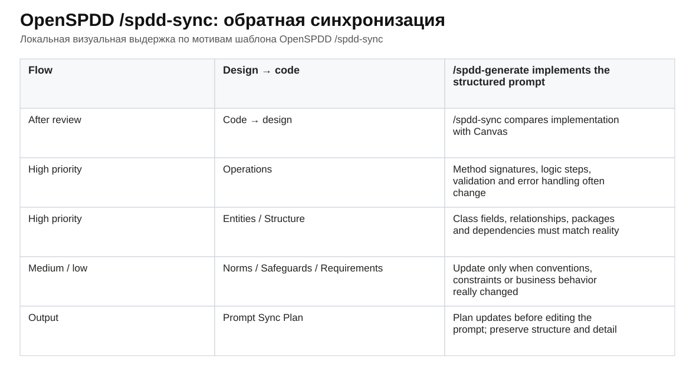

# IV. SPDD как спецификационный жизненный цикл

SPDD легко недооценить, если увидеть в нём просто более аккуратный способ писать промпты. Тогда смысл метода сводится к привычному совету: перед генерацией кода надо подробнее описать задачу, дать модели больше контекста и попросить её составить план. Это полезно, но почти не меняет устройство разработки. Человек сформулировал запрос, модель сгенерировала код, а дальше работа снова держится на чате, диффе, ревью и памяти участников.

В SPDD сильнее другое. Намерение становится отдельным рабочим артефактом: его можно увидеть, отредактировать, использовать для генерации, проверить по нему результат и затем обновить. В статье Fowler/Thoughtworks [Structured-Prompt-Driven Development](https://martinfowler.com/articles/structured-prompt-driven/) промпт описан не как одноразовая реплика в диалоге, а как артефакт поставки. Для агентской разработки важно именно это смещение роли. Намерение перестаёт жить только в голове автора или в истории чата и получает форму, к которой можно вернуться после первого действия модели.

SPDD нужен не потому, что модель плохо понимает естественный язык. Напротив, сильная модель часто понимает задачу достаточно хорошо, чтобы достроить недостающие детали и вернуть правдоподобный результат. Проблема в другом: она может по пути выбрать продуктовые, доменные, архитектурные и проверочные решения, которые человек не формулировал и не принимал. Модель может расширить область задачи, выбрать значение по умолчанию, обойти неудобное ограничение, придумать правило обработки ошибки или изменить уровень абстракции. Код при этом может компилироваться и выглядеть разумно, но намерение уже сместилось.

<figure class="image-asset" id="fig-fowler-spdd-overview" data-asset-status="local_image_asset" data-repo-path="content/assets/theory-images/fowler-spdd-overview.svg">
  
  <figcaption>Рисунок IV-0. В SPDD prompt artifact становится не одноразовым сообщением, а рабочим артефактом: он участвует в генерации, проверке и обновлении намерения. Источник: <a href="https://martinfowler.com/articles/structured-prompt-driven/">Fowler/Thoughtworks, Structured-Prompt-Driven Development</a>.</figcaption>
</figure>

Поэтому SPDD важен не как техника “хороших промптов”, а как пример управляемого перехода `намерение → спецификация`. Хороший промпт может привести к удачному диффу. Спецификационный жизненный цикл начинается там, где документ можно проверить до генерации, сопоставить с результатом после генерации и обновить после ревью. Подробный разбор метода, команд и визуальных материалов вынесен в Атлас: [SPDD / OpenSPDD](../../atlas/articles/spdd_method.md). Здесь важна более узкая роль SPDD: он показывает, зачем спецификация нужна агентской разработке, какую проблему она закрывает и как один рабочий цикл проходит от намерения к коду, проверке и обновлению документа.

## Почему обычного плана недостаточно

План перед реализацией — уже важный шаг. Он заставляет агента замедлиться, назвать предполагаемые действия и даёт человеку точку вмешательства до изменения кода. Во многих практических случаях этого достаточно: короткая задача, малый радиус изменения, быстрый человеческий контроль. Даже простое “сначала напиши план, я поправлю, потом реализуй” резко лучше свободной генерации из одного абзаца.

Минимальный вариант этой дисциплины виден в реконструкции практики Boris Tane: сначала `research.md`, затем `plan.md`, человеческие пометки в плане и только потом реализация ([Boris Tane story](../../../content/stories/01_boris_tane_research_plan_implement_reconstruction_connected.md)). Его “don’t implement yet” хорошо фиксирует границу: документ ещё не разрешает действие, пока человек не проверил направление. SPDD делает тот же ход более строгим: вместо обычного плана появляется Canvas, который должен работать и после первой реализации.

Обычный план чаще всего отвечает на вопрос “что сделать сейчас”. Он плохо отделяет цель изменения от порядка действий, допущения от принятых решений, доменные понятия от технической реализации, критерии проверки от инженерных запретов. В короткой задаче это терпимо. В изменении с несколькими итерациями план быстро стареет: ревью потребовало правку, код реализовали иначе, обнаружился новый крайний случай, часть требований уточнили. Старый план уже не является ни актуальным намерением, ни описанием фактической реализации.

В OpenSPDD обычный план и REASONS Canvas разведены по разным ролям: план предлагает порядок действий, а Canvas удерживает ограничения, уровень детализации, проверку и зависимости как более строгий рабочий документ ([OpenSPDD README](https://github.com/gszhangwei/open-spdd)). Это различие не про вкус к форматам Markdown. Оно про практический вопрос: по какой записи мы поймём, что агент всё ещё делает то же изменение, а не похожую соседнюю задачу?

SPDD появляется именно там, где ошибки смысла дороже самой генерации. Для маленькой обратимой правки достаточно короткого плана и обычного ревью. Для биллинга, прав доступа, интеграционного контракта, миграции данных или доменной логики нужен другой слой: документ, который заранее показывает, какие решения человек разрешает агенту реализовать.

## Как устроен REASONS Canvas

REASONS Canvas собирает намерение в семь областей: `Requirements`, `Entities`, `Approach`, `Structure`, `Operations`, `Norms`, `Safeguards`. Его можно назвать расширенным промптом, но это обедняет идею. Точнее сказать: Canvas — рабочая спецификация одной области изменения. Он фиксирует не только цель, но и доменные объекты, выбранный подход, место изменения в системе, порядок действий, инженерные правила и запреты.

Эти семь областей удобнее читать не как таблицу ради таблицы, а как несколько разных вопросов. `Requirements` и `Entities` отвечают за смысл: что должно измениться и какие предметные объекты участвуют. `Approach` и `Structure` отвечают за инженерное решение: какой способ выбран и в какой части системы он должен быть реализован. `Operations` переводит решение в порядок работы. `Norms` и `Safeguards` задают правила качества и границы, которые нельзя нарушать.

Шаблон OpenSPDD для [`/spdd-reasons-canvas`](https://github.com/gszhangwei/open-spdd/blob/v0.4.9/internal/templates/data/core/spdd-reasons-canvas.md) важен тем, что Canvas не должен возникать из краткого пересказа. Команда требует прочитать переданные `@`-файлы и папки полностью, не сокращать входной материал, заполнить все секции и не переходить к реализации без подтверждения пользователя. Так SPDD превращает сбор контекста из неявной привычки модели в явную часть процесса.

В [статье Fowler/Thoughtworks](https://martinfowler.com/articles/structured-prompt-driven/) исходный пример связан с расчётом стоимости использования модели. В инженерной постановке это выглядит как изменение API: в системе есть метод `POST /usage/quote`. Он рассчитывает предварительную стоимость запроса к модели для уже известного клиента. На вход метод получает `customer_id`, `model_id`, `input_tokens` и `output_tokens`; в ответ возвращает сумму, валюту, версию тарифа и состояние квоты.

Метод использует несколько источников данных: справочник моделей и ставок, тарифный план клиента, текущую квоту и правила округления. Входные и выходные токены считаются по разным ставкам. Клиент и модель должны существовать заранее. Отрицательные значения токенов не исправляются автоматически. Превышение квоты возвращает заранее согласованный код ошибки или статус. Округление выполняется один раз, в конце расчёта, чтобы промежуточные суммы не расходились между реализацией, тестами и отчётами.

Если дать агенту только короткое намерение, он легко заполнит эти места сам. Он может хранить тарифы прямо в контроллере, смешать входные и выходные токены, придумать бесплатный тариф по умолчанию, вернуть ошибку в новом формате или вместе с расчётом стоимости начать строить новую политику биллинга. Такой код может выглядеть работоспособным, но продуктовые правила уже будут выбраны без человека. Для биллинга это не мелочи реализации, а смысл изменения.

В Canvas та же задача должна разложиться на рабочие части. `Requirements` фиксируют ожидаемое поведение: по известному клиенту, модели и числу токенов вернуть расчёт стоимости, а для неизвестной модели, неизвестного клиента, отрицательных значений и превышения квоты вернуть заранее оговорённый результат. `Entities` называют предметные объекты: запрос на расчёт, клиент, тарифный план, модель, ставка для входных и выходных токенов, квота, валюта, версия тарифа. `Approach` и `Structure` задают инженерное решение: расчёт реализуется в отдельном сервисе, контроллер только принимает запрос и отдаёт ответ, тарифы читаются через заданный источник, промежуточные суммы не округляются до финального шага. `Operations` описывают порядок работы: проверить клиента, найти тариф, проверить токены и квоту, посчитать входную и выходную часть, сложить стоимость, округлить результат, вернуть успешный ответ или одну из оговорённых ошибок. `Norms` и `Safeguards` удерживают запреты: не добавлять тариф по умолчанию, не менять формат ответа без решения человека, не переносить расчёт в произвольный слой, не расширять задачу до новой подписочной модели и не скрывать спорные правила внутри кода.

После такой записи человек обсуждает уже не готовый дифф, а правила изменения до генерации. Если команда решает, что неизвестная модель должна давать `400`, превышение квоты — `409`, а перенос расчёта из контроллера в сервис обязателен, эти решения попадают в Canvas до того, как агент начнёт писать код. По Canvas уже видно, какие действия агент должен выполнить и какие решения ему не переданы.

Canvas работает в две стороны. Он помогает модели, потому что сужает пространство допустимых трактовок. И он помогает человеку, потому что показывает, какие решения уже попали в задание, а какие модель могла бы молча придумать сама. SPDD не требует доверять промпту. Он, наоборот, исходит из недоверия к голому чату и выносит намерение в документ, который можно читать до кода.

<figure class="image-asset" id="fig-fowler-spdd-reasons-canvas" data-asset-status="local_image_asset" data-repo-path="content/assets/theory-images/fowler-spdd-reasons-canvas.svg">
  
  <figcaption>Рисунок IV-1. REASONS Canvas делает намерение рабочим документом: требования, предметная область, подход, структура, операции, нормы и предохранители фиксируются до генерации и затем участвуют в ревью. Источник: <a href="https://martinfowler.com/articles/structured-prompt-driven/">Fowler/Thoughtworks, Structured-Prompt-Driven Development</a>.</figcaption>
</figure>

## Что меняется в делегировании

После Canvas становится видно, что SPDD меняет не только форму входного текста, но и место человеческой проверки. В обычной агентской задаче человек часто смотрит уже готовый дифф: модель сама решила, какие файлы читать, как понимать бизнес-слова, где расширить объём работы и какие ошибки считать существенными. В SPDD часть этих решений выносится раньше. Человек проверяет не только результат, но и то, что именно он поручает агенту.

В SPDD важны три рабочих движения. `Abstraction First` означает, что сначала выделяется предметное изменение, его границы и запреты, а уже потом список файлов и технических действий. `Alignment` — это чтение Canvas как документа согласования: видно, что агент собирается считать задачей, где он может расширить смысл и какие решения уже попали в делегирование. `Iterative Review` замыкает цикл после кода: если ревью, исправления или уточнения изменили содержание работы, спецификация должна быть обновлена, иначе она снова становится старым планом.

Эта человеческая часть важнее конкретной команды со слэшем. Если Canvas никто не читает, SPDD превращается в ритуал. Если человек действительно проверяет намерение до генерации и возвращает принятые изменения в документ после неё, метод начинает удерживать переход от замысла к работе.

Тот же принцип жёстче проявляется в практиках HumanLayer: ход `research → plan → implement` нужен потому, что плохое понимание задачи на раннем этапе может породить намного больше плохого кода позднее ([HumanLayer story](../../../content/stories/07_human_layer_agentic_harness_reconstruction_connected.md)). Для SPDD это предупреждение об автономии: агент усиливает спецификацию, которую получил. Если Canvas никто не прочитал, повторная генерация не делает процесс надёжнее; она просто быстрее распространяет ошибку смысла.

## Реализация по спецификации

После Canvas начинается генерация, но теперь она не должна быть свободным продолжением разговора. Шаблон [`/spdd-generate`](https://github.com/gszhangwei/open-spdd/blob/v0.4.9/internal/templates/data/core/spdd-generate.md) требует прочитать весь структурированный промпт, идти по Operations, соблюдать Norms и Safeguards, не перепланировать последовательность и не добавлять улучшения вне заданной области.

В примере с биллингом это означает простую вещь: агент реализует не “какой-нибудь расчёт цены”, а именно ту политику, которая записана в Canvas. Он не должен сам добавить бесплатный тариф, выбрать округление “для удобства”, разрешить неизвестную модель или вернуть ошибку в другом формате, даже если такие решения выглядят разумно. Если во время реализации агент видит, что Canvas неполон — например, не сказано, что делать при превышении квоты, — правильный ход не в том, чтобы молча придумать правило, а в том, чтобы вернуть это как вопрос к спецификации.

Это ограничение может казаться странным, потому что сильная модель часто полезна именно своей инициативой: она замечает недосказанность, предлагает лучший вариант, чинит по пути. Но в управляемом изменении такую инициативу нужно явно принять или отклонить. Если агент обнаружил проблему в спецификации, он должен вернуть её в Canvas или хотя бы вынести на человеческое решение. Если он молча улучшил код в обход документа, процесс потерял важную границу: уже нельзя уверенно сказать, что было принято человеком, что вывела модель, а что случайно оказалось в реализации.

Поэтому SPDD защищает не весь проект, а локальное намерение. В документе OpenSPDD о проектных принципах эта граница проведена прямо: Canvas работает на уровне конкретной фичи, а правила уровня репозитория остаются отдельным слоем; структурированный промпт сужает пространство интерпретации, но не отменяет человеческие решения ([OpenSPDD design philosophy](https://github.com/gszhangwei/open-spdd/blob/main/docs/design-philosophy.md)). Внутри этой границы Canvas удерживает сущности, компоненты, операции и ограничения данной области. Метод остаётся легче формального процесса, но позволяет проверять реализацию не только по качеству кода, но и по соответствию принятому намерению.

Разница здесь принципиальная. “Модель написала хороший код” — это оценка результата. “Изменение прошло через спецификацию” — это оценка пути: было ли намерение зафиксировано, не изменилось ли оно скрыто, можно ли следующей итерации опереться на тот же документ.

## Проверка результата по Canvas

После генерации SPDD не превращается в отдельную теорию тестирования. Здесь важно другое: проверка должна быть связана с Canvas, а не только с общим ощущением, что код работает.

Шаблон [`/spdd-api-test`](https://github.com/gszhangwei/open-spdd/blob/v0.4.9/internal/templates/data/optional/spdd-api-test.md) показывает один такой ход. Из спецификации можно вывести API-сценарии, shell-скрипт с `curl` и таблицы “ожидалось / получено / результат”. В примере с биллингом это не абстрактная проверка эндпойнта, а проверка конкретных обещаний из Canvas: известная модель и тариф дают ожидаемую сумму; неизвестная модель возвращает оговорённую ошибку; отрицательное число токенов не принимается; превышение квоты обрабатывается по принятому правилу; формат ответа совпадает с тем, что было согласовано.

Шаблон [`/spdd-code-review`](https://github.com/gszhangwei/open-spdd/blob/v0.4.9/internal/templates/data/optional/spdd-code-review.md) задаёт другой вид контроля: реализация читается относительно Canvas. Ревью спрашивает, не сместилось ли намерение, не нарушены ли Safeguards, не появились ли скрытые решения вне области задачи, соответствуют ли изменения секциям REASONS.

<figure class="image-asset" id="fig-fowler-spdd-code-review" data-asset-status="local_image_asset" data-repo-path="content/assets/theory-images/fowler-spdd-code-review.svg">
  
  <figcaption>Рисунок IV-4. Ревью в SPDD смотрит не только на качество кода, но и на соответствие Canvas: нарушение может требовать правки реализации, проверки или самого prompt artifact. Источник: <a href="https://martinfowler.com/articles/structured-prompt-driven/">Fowler/Thoughtworks, Structured-Prompt-Driven Development</a>.</figcaption>
</figure>

Эти проверки важны не потому, что они автоматически доказывают правильность изменения. Они показывают, где именно результат совпал или не совпал с принятой спецификацией. API-скрипт может быть зелёным, а ревью кода по Canvas всё равно найдёт нарушение архитектурной границы. Или наоборот: ревью может показать, что код следует Canvas, но сам Canvas ошибочен как продуктовое решение. SPDD не отменяет человеческое принятие. Он делает спор точнее: проблема в коде, в проверке, в Canvas или в новом решении, которое нужно явно вернуть в спецификацию.

## Рабочий цикл SPDD и команды, которые его поддерживают

Если смотреть на SPDD через отдельные команды, метод легко распадается на список приёмов: сделать Canvas, сгенерировать код, написать API-тест, провести ревью, обновить промпт, синхронизировать документ с кодом. Так можно потерять главное. Команды нужны не сами по себе, а как точки перехода в одном цикле изменения.

В биллинге цикл SPDD начинается со слишком свободной задачи: “добавить расчёт стоимости использования модели”. [`/spdd-reasons-canvas`](https://github.com/gszhangwei/open-spdd/blob/v0.4.9/internal/templates/data/core/spdd-reasons-canvas.md) должен превратить её в спецификацию метода `POST /usage/quote`. В Canvas попадают обязательные поля запроса, структура ответа, источник тарифов, отдельные ставки для входных и выходных токенов, проверка клиента и модели, обработка отрицательных значений, превышение квоты и правило округления. После этого человек видит не только список файлов, а политику расчёта, которую он разрешает агенту реализовать.

[`/spdd-generate`](https://github.com/gszhangwei/open-spdd/blob/v0.4.9/internal/templates/data/core/spdd-generate.md) должен работать по этой записи. В таком сценарии агент добавляет обработчик запроса, сервис расчёта, чтение тарифов, проверку входных данных и тестовые сценарии, но не придумывает новую подписочную модель и не прячет тарифы в контроллере. Если Canvas не говорит, что делать при превышении квоты, правильный результат генерации — не молчаливое правило в коде, а вопрос к спецификации.

После генерации результат нельзя оценивать только по впечатлению “работает”. [`/spdd-api-test`](https://github.com/gszhangwei/open-spdd/blob/v0.4.9/internal/templates/data/optional/spdd-api-test.md) проверяет выбранные сценарии: известная модель и клиент дают ожидаемую сумму; неизвестная модель возвращает оговорённую ошибку; неизвестный клиент не создаётся автоматически; отрицательные токены отклоняются; превышение квоты обрабатывается по принятому правилу; формат ответа совпадает с тем, что записано в Canvas. [`/spdd-code-review`](https://github.com/gszhangwei/open-spdd/blob/v0.4.9/internal/templates/data/optional/spdd-code-review.md) смотрит на другой слой: не оказался ли расчёт в неподходящих модулях, не появилась ли новая ветка обработки ошибки вне Canvas, не нарушены ли Safeguards, не смешана ли проверка квоты с расчётом цены.

Дальше цикл возвращается в спецификацию. Если после ревью команда решает, что превышение квоты должно возвращать отдельный статус, а не ошибку, меняется намерение; это нужно внести через [`/spdd-prompt-update`](https://github.com/gszhangwei/open-spdd/blob/v0.4.9/internal/templates/data/core/spdd-prompt-update.md). Если поведение осталось прежним, но ревью перенесло расчёт из контроллера в сервис и выделило отдельный `UsageQuoteService`, [`/spdd-sync`](https://github.com/gszhangwei/open-spdd/blob/v0.4.9/internal/templates/data/core/spdd-sync.md) приводит Canvas в соответствие с принятой структурой кода. В обоих случаях следующий агент получает не старое пожелание “сделать биллинг”, а актуальную запись о том, как именно устроен расчёт и какие правила уже приняты.

В общем виде цикл выглядит так: сначала появляется неготовое намерение; агент помогает собрать материалы, но ещё не меняет код; Canvas фиксирует требования, сущности, подход, структуру, операции, нормы и предохранители; человек уточняет этот документ; агент генерирует код по Canvas; проверки и ревью сравнивают результат со спецификацией; принятые уточнения возвращаются обратно в Canvas. Без последнего шага SPDD снова становится только стартовым промптом.

<figure class="image-asset" id="fig-fowler-spdd-workflow" data-asset-status="local_image_asset" data-repo-path="content/assets/theory-images/fowler-spdd-workflow.svg">
  
  <figcaption>SPDD важен не отдельной командой, а циклом: намерение превращается в сопровождаемый Canvas, по нему создаётся код, результат проверяется, а принятые уточнения возвращаются в спецификацию. Источник: <a href="https://martinfowler.com/articles/structured-prompt-driven/">Fowler/Thoughtworks, Structured-Prompt-Driven Development</a>.</figcaption>
</figure>

На схеме тот же порядок собран в одну линию: анализ и Canvas идут до генерации, ревью и проверки возвращаются к спецификации, а обновление промпта и синхронизация переносят принятое знание назад в документ. Поэтому SPDD лучше понимать не как набор слэш-команд, а как сопровождение намерения на протяжении изменения.

## Как Canvas остаётся актуальным после генерации

Главная часть SPDD начинается после первого результата. Если Canvas остался таким, каким был до генерации, а код уже прошёл ревью, исправления и уточнения, документ быстро превращается в архивную запись. Он показывает, с чего работа начиналась, но уже не гарантирует, что следующая итерация будет строиться на актуальном состоянии.

OpenSPDD различает два обратных движения. [`/spdd-prompt-update`](https://github.com/gszhangwei/open-spdd/blob/v0.4.9/internal/templates/data/core/spdd-prompt-update.md) нужен, когда меняется намерение: появилось новое требование, принято архитектурное уточнение, изменилась ожидаемая логика. Команда должна обновить затронутые секции Canvas, сохранить неизменное, проверить согласованность и не превращать спецификационный документ в исходный код. Это путь от нового решения или требования к обновлённой спецификации.

[`/spdd-sync`](https://github.com/gszhangwei/open-spdd/blob/v0.4.9/internal/templates/data/core/spdd-sync.md) нужен в другой ситуации: код уже изменился после ревью, рефакторинга, исправления ошибки или оптимизации, и Canvas нужно привести в соответствие с фактической реализацией. Шаблон предлагает сравнить реализацию с промптом, определить структурные, поведенческие, именовательные и другие изменения, подготовить план обновления и привести Entities, Structure, Operations, Norms или Safeguards в соответствие с принятым кодом.

Это различение важно для инженерной практики. Если изменилось поведение, требование или архитектурное ожидание, сначала нужно исправить Canvas: иначе код будет реализовывать решение, которого нет в сопровождаемой спецификации. Если поведение осталось прежним, но ревью привело к новой структуре кода, Canvas можно синхронизировать с уже принятым результатом. В биллинге это различие вполне практическое: новое правило обработки превышения квоты — повод обновить намерение; перенос расчёта из контроллера в сервис при той же логике — повод синхронизировать структуру документа с кодом. В обоих случаях цель одна: следующий агент не должен опираться на устаревшее описание работы.

Именно возвращение принятых изменений в Canvas превращает SPDD из техники стартового промпта в жизненный цикл спецификации. Документ должен оставаться рабочим, а не архивным. В документе OpenSPDD о проектных принципах отдельно отмечен риск устаревшего Canvas: если код меняется, а Canvas не обновляется, спецификация становится устаревшей документацией и может ввести следующий цикл в заблуждение ([OpenSPDD design philosophy](https://github.com/gszhangwei/open-spdd/blob/main/docs/design-philosophy.md)). Если код принят, а Canvas не обновлён, возникает знакомый агентский сбой: дифф уже попал в репозиторий, а смысл изменения снова распадается между чатом, ревью и памятью участников.

При этом `sync` не делает Canvas состоянием всего проекта. Он может вернуть в спецификацию фактические изменения сущностей, структуры, операций и ограничений в данной области. Но он не хранит владельцев, блокировки, открытые ожидания, состояние источников, историю передачи между сессиями и право закрыть работу. Это уже слой persistent work graph и более общего рабочего состояния.

<figure class="image-asset" id="fig-openspdd-sync-bidirectional-flow" data-asset-status="local_image_asset" data-repo-path="content/assets/theory-images/openspdd-sync-bidirectional-flow.svg">
  
  <figcaption>Рисунок IV-5. После генерации работа не заканчивается: если меняется само намерение, обновляется prompt artifact; если реализация прояснила структуру без смены намерения, выполняется синхронизация обратно в Canvas. Источник: OpenSPDD.</figcaption>
</figure>

## Как работать со старым кодом без исходной спецификации

В реальном проекте код часто появляется раньше сильной спецификации. Новый код можно вести от Canvas к реализации; старый код сначала нужно описать так, чтобы с ним вообще можно было работать в том же цикле. Для этого в OpenSPDD есть [`/spdd-reverse`](https://github.com/gszhangwei/open-spdd/blob/main/internal/templates/data/optional/spdd-reverse.md): команда читает существующие файлы или область кода и строит по ним REASONS Canvas. В терминах шаблона она создаёт недостающий слой спецификации для старого кода, чтобы дальше эта область могла участвовать в обычном SPDD-цикле.

Эта возможность полезна, но ей легко приписать лишнюю силу. Canvas, построенный по старому коду, не восстанавливает исходное намерение автора. Он не знает, какие варианты обсуждались, почему выбрали именно это решение, какие компромиссы были сознательными, а какие появились случайно. Он описывает код как он есть. Шаблон прямо запрещает идеализировать и рефакторить, придумывать требования, которых код не выполняет, или попутно исправлять странные решения.

У такого Canvas есть два разных результата, которые нельзя смешивать. Первый — описание текущего поведения: что код делает сейчас, какие сущности и операции в нём есть, какие ограничения реально проверяются. Второй — список неопределённостей: где поведение похоже на намеренное, но источник не даёт права утверждать, что команда именно этого хотела. В сильном процессе такой Canvas должен приходить на человеческое ревью как описание текущего состояния, а не как готовая история решения.

Поэтому `/spdd-reverse` — не восстановление исходного смысла, а фиксация текущей реализации в виде рабочей спецификации. От неё можно идти дальше: новые требования проводить через `prompt-update`, новую реализацию — через `generate`, изменения после кода — через `sync`. Но память решения, если она важна, всё равно надо восстанавливать отдельно: через ADR, обсуждение, ревью или человеческое объяснение.

## Когда SPDD оправдан

Из этого не следует, что SPDD нужен для каждого изменения. Его стоимость — время на сбор контекста, Canvas, ревью намерения, проверку результата и последующую синхронизацию документа. Для маленькой обратимой правки это может быть лишним трением. Если ошибка дешёвая, радиус изменения мал, а человек сразу видит результат, короткий план и обычное ревью часто достаточно.

Метод становится оправданным там, где ошибка смысла дороже самой генерации: биллинг, права доступа, миграции данных, интеграционный контракт, юридически значимое поведение, правила безопасности, доменная логика, которую трудно восстановить из одного диффа. В таких задачах главный риск не в том, что модель напишет некрасивый код, а в том, что она реализует соседнее намерение. Canvas делает это намерение видимым до того, как оно попадёт в систему.

Эта же граница защищает от чрезмерного процесса. SPDD не должен быть обязательной бюрократией вокруг любой агентской правки. Его смысл появляется, когда спецификация действительно будет жить дальше: её будут читать на ревью, связывать с проверками, обновлять после изменения требований и использовать в следующем раунде работы.

## Где проходит граница SPDD

SPDD хорошо держит один переход: намерение становится спецификацией, спецификация управляет реализацией, результат проверяется и возвращается в документ. Но именно поэтому метод нельзя растягивать на весь процесс разработки.

Canvas не является ADR. Он может содержать подход и ограничения, но не обязан хранить статус архитектурного решения, альтернативы, последствия, условия пересмотра и ответственность за выбор. Если в ходе SPDD возникает настоящее архитектурное решение, его нужно выносить в память решения, а не прятать в секцию Approach.

Canvas не является контрактом в смысле предыдущей главы. Он задаёт ожидаемое поведение и границы, но не всегда создаёт внешний проверочный оракул или ответственность между сторонами. Иногда он работает как сильная спецификация, иногда как договорённый рабочий промпт, иногда как материал для дальнейшей формализации. Если называть его контрактом без оговорок, стирается разница между намерением, решением и проверяемым обязательством.

Canvas не является persistent work graph. Он говорит, что должно измениться и как синхронизировать документ с кодом. Но он не отвечает на вопросы активной работы: кто владеет текущим узлом, что заблокировано, какое ревью ожидается, какие источники уже перенесены, где остановился агент и что должен прочитать следующий исполнитель. Если `sync` стал обязательным следующим действием, это должен помнить рабочий граф, а не последняя реплика в чате. Если проверка прошла, граф всё равно должен знать, закрывает ли она работу или только добавляет один проверочный результат. Без такого слоя SPDD всё равно зависит от последней сессии.

Canvas также не является harness, sandbox, слоем политик или системой навыков. OpenSPDD может поставляться как команды и skills, но skills только делают метод вызываемым. Они не решают, кому разрешено принять результат, какие инструменты может запускать агент, как ограничен радиус действия, как работает CI и кто отвечает за merge.

Эти ограничения не ослабляют SPDD. Они делают его пригодным. Если ждать от Canvas всей полноты процесса, он превратится в перегруженный документ, где смешаны намерение, решение, состояние работы и политика исполнения. Если дать ему правильную роль, он закрывает один из самых опасных разрывов агентской разработки: разрыв между свободным намерением и кодом, который уже выглядит готовым.

## Что SPDD меняет в жизненном цикле

SPDD показывает, что спецификация в агентской разработке не обязана быть тяжёлым предварительным документом. Она может быть достаточно лёгкой, чтобы возникнуть из текущей задачи, и достаточно структурированной, чтобы выдержать генерацию, проверку и обновление.

В статье Fowler `Understanding Spec-Driven-Development` различаются spec-first, spec-anchored и spec-as-source подходы ([Understanding Spec-Driven-Development](https://martinfowler.com/articles/exploring-gen-ai/sdd-3-tools.html)). SPDD здесь ближе всего к spec-anchored режиму: спецификация становится рабочей опорой, но не единственным источником всей системы. Она направляет генерацию и синхронизируется с кодом, но не отменяет архитектурные решения, рабочее состояние, среду исполнения и человеческое принятие результата.

Такой режим подходит для локальных, но не тривиальных изменений: API-эндпойнта, доменной операции, сервисного слоя, интеграционного сценария, куска инфраструктурной логики. Там, где свободного чата уже мало, а тяжёлый формальный процесс избыточен, SPDD даёт рабочую середину. Он заставляет назвать намерение, границы и проверяемое поведение до кода, а потом напоминает, что после кода спецификацию нужно вернуть в актуальное состояние.

Сравнение SPDD с другими способами защиты спецификации должно идти отдельно. Здесь он важен как один показательный цикл, а не как универсальная форма проектной памяти и контроля.

Главный урок здесь простой: агентской разработке нужны не только лучшие промпты, а носители, которые остаются после действия агента. SPDD — один из таких носителей для начала изменения. Он не завершает весь процесс, но делает первый переход управляемым: намерение становится документом, документ ведёт генерацию, проверка возвращается к документу, а принятые изменения не должны оставлять спецификацию в прошлом.
