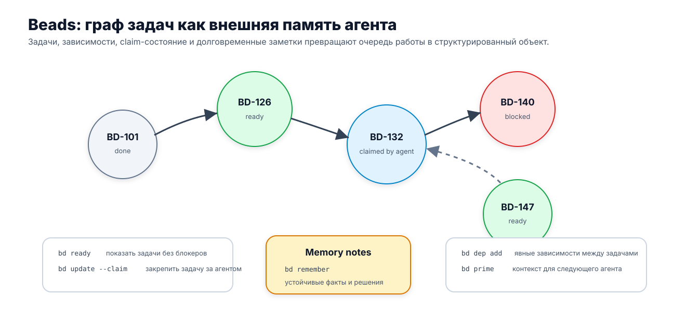

# VII. Persistent Work Graph: состояние работы, которое переживает сессию

## Когда «почти готово» перестаёт быть состоянием работы

Представим обычное изменение в кодовой базе. Агенту поручили добавить `billingPlanId` в endpoint смены подписки. Задача выглядит небольшой: обновить DTO, поправить валидацию, протянуть поле в billing service, добавить тесты и изменить публичную документацию. Первая сессия работает достаточно успешно. DTO изменён, mapping написан, unit tests зелёные, PR открыт. В конце агент оставляет аккуратное summary: «реализация почти готова, остались compatibility edge case, integration CI and review».

Такой отчёт может быть честным. Но он ещё не является состоянием работы.

К моменту завершения сессии внутри изменения уже живёт несколько разных линий. Старый mobile client может отправить payload без нового поля. Один subagent проверил историю API-контракта и нашёл, что раньше endpoint обещал backward compatibility. Другой subagent посмотрел проверки: unit run зелёный, но integration run падает на legacy payload scenario. В PR открыт review thread: internal billing DTO, возможно, протекает в public API layer. Человек должен решить, будет ли strict validation или compatibility fallback. Target branch за время работы ушла вперёд. Ветка с изменением существует, но предыдущая сессия оставила claim на реализацию, и непонятно, жив ли он.

Если следующая сессия получит только summary, она увидит знакомую, но опасную картину: «почти готово». Если она получит состояние работы, картина будет другой: одни узлы закрыты, другие заблокированы, третьи ждут человеческого решения, четвёртые требуют повторной проверки источника, а один конкретный кусок можно безопасно взять прямо сейчас.

Именно здесь появляется отдельный слой, который нельзя заменить ни хорошим prompt, ни длинным transcript, ни обычным issue tracker, ни checkpoint’ом runtime. Агентская работа живёт дольше, чем одна сессия. Она проходит через CI, ревью, subagents, человеческие решения, смену веток, compaction, повторные запуски и частичную потерю контекста. Чтобы её можно было продолжить, проекту нужен не просто рассказ о прошлом, а долговечная форма текущего состояния: где работа находится, что её блокирует, кто её держит, какие проверки уже относятся к актуальному источнику, чего ждём и что нужно показать следующей сессии.

Эту форму здесь удобно назвать Persistent Work Graph: постоянный граф работы.

## Локальное `done` и завершение изменения

Главный сбой, который делает этот слой необходимым, прост: локальное `done` начинает выглядеть как завершение работы.

Агент действительно мог закрыть локальный кусок. Он обновил DTO. Добавил mapping. Написал unit tests. Получил зелёный unit run. Возможно, даже сделал commit and push. На уровне своей сессии он не обязательно ошибся. Проблема возникает тогда, когда система принимает локальный конец операции за конец изменения.

В примере с billing/API локально закрыты только несколько узлов:

```text
W-101  DTO and validation updated
W-102  billing service mapping updated
W-103  unit tests added and passed
```

Но общий work item ещё не закрыт:

```text
W-100  Add billingPlanId to change-plan endpoint
  blocked by W-104 legacy mobile compatibility
  blocked by W-105 architecture boundary review
  blocked by W-106 integration CI failure
  gated by G-201 human compatibility decision
  gated by G-202 review decision
  source state stale: target branch advanced
```

Это не педантизм. Если следующий агент закроет W-100 только потому, что patch выглядит готовым, проект получит ложное завершение. Документация может описать не то поведение, которое согласовал reviewer. Integration failure может остаться неразобранным. Комментарий по архитектурной границе может потеряться. Вывод subagent может оказаться привязанным к старой версии документации. Человек, который должен принять compatibility decision, увидит уже «закрытое» изменение и будет вынужден заново восстанавливать, где именно случилась подмена.

Поэтому в агентской разработке `done` должно быть состоянием графа, а не самооценкой последнего исполнителя. Локальный результат может быть завершён. Общее изменение — нет.

## Почему summary не спасает

Можно возразить: хороший summary ведь как раз перечислит все открытые вопросы. Например:

```text
Добавил billingPlanId в change-plan endpoint. DTO, validation и mapping обновлены, unit tests проходят. Нашёл edge case со старым mobile client, надо решить compatibility. Integration CI падает на legacy payload scenario, возможно связано с edge case. Есть review comment по границе DTO. Следующей сессии надо поправить edge case, дождаться review и обновить docs.
```

Это неплохой текст. В нём нет явной лжи. Но он всё равно не отвечает на рабочие вопросы:

Можно ли следующей сессии прямо сейчас менять validation? Кто имеет право решить compatibility behavior? Падение integration CI уже классифицировано или только замечено? Unit tests зелёные на каком commit? Review по DTO boundary блокирует merge or is it only a comment? Public API docs можно обновлять сейчас или они зависят от человеческого решения? Claim предыдущей сессии ещё активен or stale? Что будет считаться закрытием W-100?

Summary хранит рассказ. Граф работы должен хранить продолжимость.

Transcript даёт ещё больше материала, но не решает проблему. В стенограмме может быть всё: рассуждения, ложные старты, промежуточные идеи, команды, повторения, ошибочные гипотезы, устаревшие выводы. Чтобы продолжить работу из transcript, следующая сессия должна снова выполнить работу извлечения состояния. В маленьких задачах это терпимо. В долгой агентской разработке это превращается в постоянный налог: новая сессия не продолжает, а сначала гадает, какие фразы из прошлого ещё являются рабочими обязательствами.

Issue tracker тоже не равен Persistent Work Graph. Современные трекеры уже умеют многое. GitHub Issues поддерживает sub-issues and issue dependencies, а GitHub CLI в июне 2026 года вынес issue types, parent/sub-issue relationships and dependencies into terminal/JSON surface useful for scripts and coding agents ([GitHub Issues](https://docs.github.com/en/issues/tracking-your-work-with-issues/about-issues), [GitHub CLI changelog](https://github.blog/changelog/2026-06-10-github-cli-projects-issue-types-sub-issues-and-issue-dependencies/)). Linear поддерживает relations вроде blocking, related and duplicate, and marks blocked/blocking issues visually ([Linear issue relations](https://linear.app/docs/issue-relations)). Это важная основа. Но обычная issue-карточка часто не знает, какой source state использовал subagent, какой CI run относится к текущему commit, какой review signal был dismissed, какой claim устарел после оборванной сессии, и какой compact restoration packet нужно дать следующему агенту.

Runtime checkpoint решает соседнюю, но другую задачу. LangGraph, например, различает checkpointers for thread-scoped graph state and stores for longer-lived cross-thread data; interrupts can pause graph execution and resume later with persisted state ([LangGraph persistence](https://docs.langchain.com/oss/python/langgraph/persistence), [LangGraph interrupts](https://docs.langchain.com/oss/python/langgraph/interrupts)). Temporal показывает durable human-in-the-loop flow: workflow waits for approval through Signals, can wait without compute, uses durable timers and records decisions ([Temporal human-in-the-loop agent](https://docs.temporal.io/ai-cookbook/human-in-the-loop-python)). Pydantic AI now documents durable execution integrations with Temporal, DBOS, Prefect and Restate for agents that preserve progress across failures and long-running waits ([Pydantic AI durable execution](https://pydantic.dev/docs/ai/integrations/durable_execution/overview/)). Всё это важно для выполнения. Но runtime может знать, где остановилась программа, и всё равно не знать, какая работа сейчас готова, что блокирует merge, кто должен принять решение и какой вывод subagent устарел.

Иными словами: checkpoint can resume a run. Persistent Work Graph must let another run, another agent or a human continue the work.

## Что хранит Persistent Work Graph

Persistent Work Graph — это не просто ещё один список задач. Это долговечный граф рабочих узлов, связей, ожиданий и проверочных оснований, который отвечает на вопрос продолжения.

Минимальный узел такого графа должен быть не «заметкой», а work item: адресуемой единицей работы, которую можно показать, взять, заблокировать, связать, проверить, закрыть или вернуть в восстановление. У work item есть граница, источник, зависимости, статус, владелец или claim, проверочные сигналы, открытые gates and cleanup obligations.

В примере с billing/API в граф попадают не все мысли подряд. Запись «старый mobile client может не отправить `billingPlanId`» может начаться как note. Но если от неё зависит поведение API and final acceptance, она должна стать work item or blocker:

```text
W-104  Resolve legacy mobile payload compatibility
  discovered-from: W-101 validation work
  blocks: W-100 final closure
  source: Subagent Contract report, based on docs/api/subscriptions.md@main@8f31c2a
  gate: G-201 human compatibility decision
```

Падение integration CI тоже не должно остаться фразой в summary:

```text
W-106  Fix or classify integration CI failure
  source: ci/integration/18453 failed on LegacyMobilePayloadScenario
  related-to: W-104 legacy compatibility
  blocks: W-100 final closure
```

А review thread по архитектурной границе должен быть не “там был комментарий”, а отдельным состоянием:

```text
W-105  Resolve architecture boundary review
  source: PR#842/thread#boundary-dto-leak
  gate: G-202 reviewer decision
  blocks: W-100 final closure
```

Граф не обязан быть именно такой схемой. Важна функция: всё, что влияет на возможность продолжать или закрывать работу, должно быть представлено как состояние, а не как рассказ.

<figure class="image-asset" id="fig-vii-beads-task-graph-memory">
  
  <figcaption>Практический якорь PWG хорошо виден в Beads: работа живёт не только в сообщении агента, а в графе задач, зависимостей, закреплений и памяти, которую можно поднять в следующей сессии.</figcaption>
</figure>

## Связь не всегда означает блокировку

Граф становится полезным только тогда, когда связи имеют смысл. Если всякая связь между узлами трактуется как hard blocker, очередь готовой работы быстро пустеет. Если hard blocker записан как мягкая связь, агент начинает действовать там, где должен ждать.

В billing/API примере есть несколько разных отношений:

```text
W-104 discovered-from W-101
W-104 blocks W-100 final closure
W-106 related-to W-104
W-107 blocked-by G-201
W-105 blocks W-100 final closure
W-101 parent-child W-100
```

`parent-child` показывает разбиение работы, но не обязательно говорит, что parent blocked by every child in the same way. `related` помогает понять связь, но не обязательно запрещает действие. `discovered-from` говорит, что задача возникла во время другой задачи. `blocks` действительно влияет на готовность. Если эти типы смешать, граф начнёт лгать.

Beads полезен здесь как current-practice пример. В его документации issue is a work item with status, priority, labels and dependencies; dependency types include `blocks`, `parent-child`, `discovered-from` and `related`, and only `blocks` affects ready work ([Beads core concepts](https://gastownhall.github.io/beads/core-concepts)). Это не значит, что Beads задаёт единственно возможную модель. Но он показывает важное правило: readiness is not derived from the mere existence of an edge. It depends on the semantics of that edge.

В Task Master похожая идея проявляется проще. Tasks in `tasks.json` carry fields such as `status`, `dependencies`, `details`, `testStrategy`, `subtasks` and metadata, and clusters can be derived from dependency graph to identify phases or parallel task groups ([Task Master task structure](https://docs.task-master.dev/capabilities/task-structure), [Task Master clusters](https://docs.task-master.dev/capabilities/clusters)). Но для главы VII важен не сам Task Master. Важна общая смена формы: task graph becomes an agent-facing topology. Следующий агент должен видеть не только карточки, но и структуру продолжения.

## Готовность как вычисляемое состояние

Самая важная операция PWG — ответить на вопрос: что можно делать сейчас?

В обычном отчёте готовность часто выражается словами: «можно продолжать», «почти готово», «осталось проверить». В графе это должно быть вычисляемым состоянием. Узел готов, если он открыт, не удерживается чужим действующим claim, не заблокирован hard blockers, не ждёт gate, не зависит от явно устаревшего source state and is not intentionally deferred.

В примере ready view может выглядеть так:

```text
Ready now:
  W-106 Fix or classify integration CI failure
    reason: open; blocks W-100; no human decision required to inspect failure

Partially actionable, not closable:
  W-104 Resolve legacy mobile payload compatibility
    allowed action: prepare options, inspect code paths, add exploratory tests
    not allowed: finalize behavior before G-201

Not ready:
  W-107 Update public API docs
    blocked by G-201 compatibility decision

Not done:
  W-100 Add billingPlanId
    blocked by W-104, W-105, W-106 and gates G-201/G-202/G-203
```

Это уже не summary. Это рабочая поверхность. Следующая сессия знает, что можно разбирать integration failure. Она знает, что docs пока не стоит финализировать. Она знает, что общий work item нельзя закрывать, даже если часть кода написана.

Beads `bd ready` даёт конкретный внешний якорь: команда shows open issues with no active blockers, excludes states such as `in_progress`, `blocked`, `deferred`, `hooked`, and can atomically claim the first ready issue with `--claim`; it also supports explanation-oriented use around readiness ([`bd ready`](https://gastownhall.github.io/beads/cli-reference/ready)). Важно не то, что все проекты должны использовать эту команду. Важно, что готовность становится не пожеланием, а запросом к состоянию графа.

## Claim: защита от параллельной путаницы

Когда один агент работает в одиночку, claim может казаться бюрократией. В нескольких сессиях и worktrees он быстро становится условием честной параллельности.

Без claim два агента могут взять один и тот же work item, сделать несовместимые изменения, написать два разных объяснения и оба оставить «готово». С claim появляется другая опасность: stale claim. Сессия оборвалась, worktree удалён, агент ушёл, а узел всё ещё выглядит занятым. Поэтому claim должен быть не только флажком владельца, но и восстанавливаемым состоянием: owner, scope, branch/worktree/session reference, last seen, heartbeat or expiry, release/transfer procedure.

В billing/API примере следующая сессия должна увидеть не просто «Agent A работал над W-100», а более точное состояние:

```text
claim:
  owner: Agent A
  scope: W-100 implementation
  branch: feature/billing-plan-id@b12d44f
  worktree: /tmp/agent-a-feature-billing-plan-id
  last_seen: 2026-06-15 12:10
  state: probably stale; recover before editing
```

Правильное продолжение начинается с recovery: проверить branch, worktree, uncommitted changes, scope of claim, then release or renew claim. Это не хозяйственная мелочь. Без этого работа либо дублируется, либо исчезает из ready set.

## Gate: ожидание как объект работы

Многие длинные задачи не готовы не потому, что никто не знает следующий шаг, а потому что они ждут внешнего события или решения. В summary это обычно записывается словами: «ждём review», «подождать CI», «надо спросить человека». В PWG это должно становиться gate.

Gate — это долговечное условие ожидания, которое влияет на готовность и закрытие work item.

В billing/API примере есть как минимум три gate:

```text
G-201 Human decision: strict validation or compatibility fallback
  type: human
  owner: Reviewer
  blocks: W-104, W-107, W-100 final closure

G-202 Architecture boundary review
  type: review
  source: PR#842/thread#boundary-dto-leak
  blocks: W-105, W-100 final closure

G-203 Integration CI run
  type: ci
  source: ci/integration/18453
  state: failed
  blocks: W-106, W-100 final closure
```

Эти gates имеют разные последствия. Human decision cannot be closed by an implementation agent unless explicitly authorized. CI gate can fail, pass, be canceled or become stale after rebase. Review gate may become accepted, rejected, or turn into new work. Если всё это хранится как “ждём”, следующая сессия снова будет угадывать.

Beads `bd gate` documents this object in a useful form: gates are asynchronous wait conditions blocking workflow steps; gate types include `human`, `timer`, `gh:run`, `gh:pr` and `bead`; checks can resolve gates when GitHub run succeeds, PR is merged, timer expires or target bead closes, while failures can escalate ([`bd gate`](https://gastownhall.github.io/beads/cli-reference/gate)). Это ровно тот технический слой, который нужен главе: ожидание перестаёт быть просьбой в prompt and becomes a stateful object.

Temporal and LangGraph show the runtime side of the same pressure. A workflow can pause for human approval or interrupt graph execution and resume later. But gate in PWG answers a different question: which work item is blocked, what condition resolves it, who owns the decision and what changes when it resolves.

## Проверочный сигнал не является приказом

Как только граф начинает хранить CI, review, subagent outputs and traces, появляется новый риск: система начинает механически выполнять каждый сигнал. Reviewer wrote a comment → agent fixes it. Codex found a concern → agent edits code. Greptile raised an observation → task grows. Subagent suggested a hypothesis → summary treats it as truth.

У Jökull Sólberg этот риск хорошо виден в `/babysit-pr`, Claude Code skill for escorting a PR through CI, Greptile and Codex review ([“Babysitting PRs With Claude Code”](https://www.solberg.is/babysit-pr), [“How I Use Claude Code”](https://www.solberg.is/how-i-use-claude-code)). The procedure detects current PR through `gh pr view`, waits for CI and Greptile, runs `codex review --base main`, classifies feedback as Fix / Dismiss / Escalate, fixes valid items, runs lint, commits, pushes and repeats until a clean state or an iteration limit. Its exit criteria are not “the agent made changes”, but CI green, no untriaged issues and PR ready to merge. It also has a maximum of three iterations, after which human review is likely needed.

The small classification is the important part:

- **Fix** — the signal is valid, local fix is clear, and scope allows it;
- **Dismiss** — the signal is false, based on wrong assumption or not relevant;
- **Escalate** — human decision is needed: product boundary, architecture choice, risk beyond scope.

В одном из его примеров CI был зелёным, Greptile дал observation, который был dismissed as operational rather than code bug, while Codex found two real semantic problems: UI text no longer matched behavior, and unpublish→republish lifecycle left a tour in wrong state. After fixes, second pass was clean and auto-merge queued. The lesson is not “Codex is better than Greptile” or “three reviewers are always enough.” The lesson is that signals must be triaged before they become actions or closure.

Mark Erikson’s setup gives the same principle from another side. His OpenCode configuration includes a DiffLoupe workflow for intent alignment and a read-only reviewer agent whose role is to analyze changed code, not edit it; the reviewer distinguishes must fix / should fix / consider and is explicitly denied edit permissions ([Mark Erikson, AI workflow setup](https://blog.isquaredsoftware.com/2026/05/ai-thoughts-part-2-agent-workflow-tools/), [`markerikson/opencode-config-example`](https://github.com/markerikson/opencode-config-example)). Это важная граница для PWG: review output should first become typed graph state. Only then a process profile decides whether to fix, dismiss, escalate or close.

Mae Capozzi’s platform work adds another version of the same pattern. In her AI coding workflow, the agent produces PRs, Linear tickets, traces, spans, test branches or GitHub Action comments; then a human classifies diff, type errors, Honeycomb UI state, `/review` output or dependency recommendations before merge ([Mae Capozzi, “My AI Coding Workflow”](https://maecapozzi.com/blog/my-ai-coding-workflow), [“AI-Assisted Dependency Review”](https://maecapozzi.com/blog/using-conductor-for-dependabot-reviews)). The artifact is necessary because the human needs something inspectable. But artifact does not automatically mean acceptance.

PWG therefore needs not just `check passed/failed`, but signal state: untriaged, accepted, dismissed, escalated, stale, converted to work item, converted to gate.

## Source state: выводы стареют

В длинной работе почти всякий вывод привязан к источнику. Агент прочитал файл на одном commit. CI run относится к одной ветке. Review comment написан к одному diff. Subagent report основан на старой версии документации. Trace captures one execution. Если источник меняется, вывод может стать устаревшим, даже если в момент получения был верным.

В billing/API примере это происходит сразу:

```text
start base: main@8f31c2a
feature branch: feature/billing-plan-id@b12d44f
current main after one day: main@9c77b40
Subagent Contract report: based on docs/api/subscriptions.md@8f31c2a
unit CI: success on feature@b12d44f
integration CI: failed on feature@b12d44f
api docs: changed on current main
```

Следующая сессия не должна принимать subagent report as timeless truth. Она должна видеть: this report was based on old docs; docs changed; refresh before final decision. Unit CI success is real but belongs to old branch state. Integration failure may still matter but should be rechecked after rebase. Review comment may refer to code before latest refactor.

В документной работе source state виден ещё грубее. Ссылка могла быть найдена, но не открыта. Источник мог быть прочитан, но не перенесён. Факт мог быть перенесён в текст, но без ссылки at point of introduction. Иллюстрация могла быть настоящим asset candidate, но её нельзя заменить текстовой схемой. Всё это должно быть состоянием работы, если от этого зависит продолжение.

Mark Erikson’s cachebro/OpenCode mismatch gives a precise technical example: a file read through cachebro MCP was known to that external tool, but OpenCode’s internal edit-safety logic did not know the file had been read, so Erikson had to build a bridge for file access state ([`cachebro`](https://github.com/glommer/cachebro), [`opencode-config-example`](https://github.com/markerikson/opencode-config-example)). Это не просто мелкая интеграционная ошибка. Это пример разрыва source state между слоями системы. Один слой считает источник увиденным, другой — нет. В PWG такой разрыв должен становиться видимым, иначе система либо запрещает безопасное действие, либо разрешает небезопасное.

Observability artifacts are similar. Erikson’s Replay MCP work shows that agent debugging changes radically when it sees recording overview, screenshots, React renders, Redux actions or console errors rather than only files and a failing test. Mae’s Honeycomb work shows traces, spans and Claude Code telemetry events such as `InstructionsLoaded`, `SessionStart`, `UserPromptSubmit`, `ToolUse` and `SessionEnd` as operational signals around agent work ([Mae, “AI agents removed the friction from writing telemetry”](https://maecapozzi.com/blog/ai-removes-observability-friction), [Honeycomb, “Measuring Claude Code ROI and Adoption”](https://www.honeycomb.io/blog/measuring-claude-code-roi-adoption-honeycomb)). These traces are not PWG themselves. But they can become source artifacts attached to work items: this run failed here; this tool decision was rejected; this instruction file was loaded; this session produced this span.

PWG does not need to store the whole world. It needs to store the source-state markers that change the meaning of continuing or closing work.

## Prime: восстановление рабочей формы, а не пересказ прошлого

Даже хороший граф бесполезен, если следующая сессия не знает, как к нему подступиться. Поэтому рядом с PWG нужен restoration packet: компактная рабочая картина для следующего actor.

Это не то же самое, что summary. Summary пересказывает, что произошло. Restoration packet говорит, как безопасно продолжить.

Для billing/API он мог бы выглядеть так:

```text
Current work: W-100 billing/API change.
Branch: feature/billing-plan-id@b12d44f; base main@8f31c2a; current main@9c77b40.
Closed locally: W-101 DTO/validation, W-102 mapping, W-103 unit tests.
Do not close W-100 yet.
Blocking:
  - W-104 legacy mobile compatibility; final behavior gated by G-201.
  - W-105 architecture boundary review; gated by G-202.
  - W-106 integration CI failure; ci/integration/18453 failed.
Ready now:
  - Investigate W-106 failure.
  - Prepare compatibility options for W-104 without finalizing behavior.
Not ready:
  - W-107 public docs until G-201 resolved.
Cautions:
  - Subagent Contract report was based on old docs.
  - Unit CI success does not close integration gate.
  - Agent A claim may be stale; recover before editing.
```

Такой packet не пытается быть полным transcript. Он восстанавливает рабочую форму: what is ready, blocked, gated, stale and forbidden.

Beads `bd prime` is a useful concrete anchor. It outputs essential workflow context in AI-optimized Markdown, adapts between MCP and CLI modes, supports `.beads/PRIME.md`, and is designed for agent startup and post-compaction recovery ([`bd prime`](https://gastownhall.github.io/beads/cli-reference/prime)). Its Codex integration uses skill, managed `AGENTS.md` and lifecycle hooks: SessionStart can inject full `bd prime`; after compaction, the system can refresh context through the next user prompt lifecycle ([Beads Codex integration](https://gastownhall.github.io/beads/integrations/codex)).

Это место хорошо связывает главы VI and VII. Hooks, skills and MCP belong to the project interface layer. They deliver context. But the content that matters here comes from PWG: ready queue, gates, claims, source state, recovery notes.

HumanLayer’s harness engineering materials strengthen the same boundary from another side. Their practical advice around `CLAUDE.md` / `AGENTS.md`, progressive disclosure, research→plan→implement and subagents as context firewall says: don’t dump the whole encyclopedia into the model; give it the right context at the right moment ([HumanLayer, “Skill Issue: Harness Engineering for Coding Agents”](https://www.humanlayer.dev/blog/skill-issue-harness-engineering-for-coding-agents), [Advanced Context Engineering for Coding Agents](https://github.com/humanlayer/advanced-context-engineering-for-coding-agents/blob/main/ace-fca.md)). PWG makes that instruction actionable: the right context is derived from work state, not from a heroic summary of the whole conversation.

## Research output and subagent output must return to the graph

Subagents are often presented as a way to get more work done in parallel. For PWG, their more important property is different: they produce bounded outputs that must be reattached to shared work state.

HumanLayer’s BAML and parquet/Hadoop examples are useful here. In the BAML case, an initial research pass wrongly concluded that the codebase was correct; the pass was discarded and rerun with better steering. Research-informed plan then produced a better implementation and test strategy than a plan without corrected research. In the parquet/Hadoop failure, research did not go deep enough through dependency tree, so a plausible plan broke on deeper dependencies ([HumanLayer, “Skill Issue”](https://www.humanlayer.dev/blog/skill-issue-harness-engineering-for-coding-agents)).

The lesson for this chapter is not “always do research first.” That belongs more to process profiles. The lesson is that research has state. It can be accepted, rejected, stale, insufficient, blocking, or converted into work. If a subagent returns “compatibility promise exists,” PWG must know where that claim came from, which source version it used, whether human accepted it, and which work item it blocks. If research was wrong, the graph should not preserve it as ordinary context. It should mark the old pass as rejected or superseded.

The same applies to review agents, telemetry agents, source-search agents, migration agents. A subagent summary is not a durable work state. It becomes useful only when it is typed and attached to the graph.

## Execution environment and PWG are different layers

It is tempting to solve all of this inside the runtime. Give the agent a durable workflow engine, save checkpoints, persist model calls, wrap tools in durable steps, and resume after failure. That is valuable, but it is not enough.

Temporal, Restate and DBOS show why the runtime layer matters. Temporal’s durable execution relies on replay, separated deterministic workflows and non-deterministic activities; Restate journals every step, skips completed steps on replay and wraps LLM/tool executions to avoid duplicate side effects; DBOS can wrap agent run loops as workflows and model/MCP requests as steps ([Pydantic AI Temporal integration](https://pydantic.dev/docs/ai/integrations/durable_execution/temporal/), [Pydantic AI Restate integration](https://pydantic.dev/docs/ai/integrations/durable_execution/restate/), [DBOS Pydantic AI integration](https://docs.dbos.dev/integrations/pydantic-ai)). These systems answer hard questions: how not to lose progress, how not to redo side effects, how to wait efficiently, how to resume after crash.

PWG answers another question: what does this progress mean for the work?

A runtime can say: the workflow is waiting for human approval. PWG must say: W-104 is blocked by G-201, the decision is strict validation vs compatibility fallback, W-107 cannot be finalized, W-100 cannot close, and Agent B may prepare options but not decide. A runtime can say: tool execution failed. PWG must decide whether that failure is a blocker, a flaky signal, a missing permission, a source-state problem or a new work item. A runtime can resume a process after crash. PWG must let a different process understand whether resuming is still the right move.

Worktrees have a similar boundary. They isolate file writes and make parallel diffs reviewable. But a worktree does not know whether it is an experiment, a candidate patch, a discarded approach, a blocked branch, a stale claim or the accepted path. Mike McQuaid’s Sandvault/Homebrew practices, Claude Code worktrees and Codex worktrees all point to the importance of isolated execution surfaces, but the semantic state of work remains a layer above the filesystem ([Git worktree](https://git-scm.com/docs/git-worktree), [Claude Code worktrees](https://docs.anthropic.com/en/docs/claude-code/common-workflows#run-parallel-claude-code-sessions-with-git-worktrees), [OpenAI Codex worktrees](https://developers.openai.com/codex/app/worktrees)).

PWG should not execute commands. It should receive enough from execution: run IDs, logs, diffs, traces, errors, test results, PR links, source references, proposed next steps. Then it decides what state transition is allowed.

## Граф тоже может лгать

Persistent Work Graph is not a magic solution. It can become a new source of false confidence.

The simplest failure is wrong dependency semantics. If every relation becomes `blocks`, ready queue empties and agents stop seeing valid work. If blockers are represented as loose relations, agents act too early. Beads troubleshooting explicitly warns that `bd ready` showing no issues may mean open blockers, and that only `blocks` dependencies affect ready work; complex dependency structures can confuse agents and may need simplification or labels for loose relationships ([Beads troubleshooting](https://github.com/gastownhall/beads/blob/main/docs/TROUBLESHOOTING.md)).

Stale claims are another failure. A dead session can keep a node unavailable. A missing claim can let two agents overwrite each other. An overbroad claim can freeze unrelated work.

Gates can also rot. A CI gate may have been resolved but not closed. A human decision may have been made in a PR comment but not propagated. A failed gate may need escalation, not silent retry. A closed PR is not the same as merged PR. A timer expiring may be a timeout, not success.

Source state can lie by omission. A subagent report based on old docs can look current. A green CI run on an old commit can look like acceptance. A trace from one environment can be mistaken for production truth. A review comment on an old diff can block new code incorrectly.

Even the PWG infrastructure itself can fail. Beads architecture describes Dolt as source of truth, auto-committed writes, embedded/server modes, recovery through pull or backup restore, and also lists limitations around multi-machine sync, real-time collaboration and larger teams ([Beads architecture](https://gastownhall.github.io/beads/architecture)). The Beads release page also shows why version details must be handled carefully: one release can be gated because of migration/sync risk, while another remains latest. This is not a reason to avoid work graphs. It is a reminder that the graph is infrastructure; infrastructure needs recovery, migration discipline and cleanup.

Cleanup therefore belongs to the work graph. Not all cleanup, not the whole theory of technical debt, but graph-truth cleanup:

- stale claims must be released or renewed;
- resolved gates must be closed;
- failed gates must create work or escalation;
- old source notes must be marked stale;
- duplicate work items must be merged;
- abandoned worktrees must not be deleted before artifacts are accepted or rejected;
- subagent outputs must be accepted, rejected or archived;
- restoration packet must be regenerated after meaningful state change.

Without this, PWG becomes a more authoritative-looking summary. That is worse than a plain summary, because it gives false state the appearance of structure.

## Как это выглядит в текущей практике

The chapter’s concept is not invented in isolation. Pieces of it already appear across current tools and workflows.

Beads is the closest single anchor: it describes itself as a distributed graph issue tracker for AI agents, with persistent structured memory, dependency-aware graph, Dolt backend, JSON output and agent-oriented commands such as `bd ready`, `bd update --claim`, `bd gate`, `bd prime` and `bd remember` ([Beads GitHub repository](https://github.com/gastownhall/beads), [Beads documentation](https://gastownhall.github.io/beads/)). The useful lesson is not “use this tool.” The useful lesson is that agentic work wants graph-shaped, durable, machine-readable state outside the chat.

GitHub and Linear show that blocked/blocking relationships and issue hierarchies are already mainstream. Task Master shows that AI-facing tasks often include dependencies, details, test strategy and execution clusters. Durable execution systems show that runtime state is becoming persistent. Jökull’s `/babysit-pr` shows PR as a work object that must pass through checks, triage and iteration limits. HumanLayer shows research and subagent outputs as artifacts that can be wrong or insufficient. Erikson shows how source state, permissions and reviewer roles must be explicit. Mae shows that agent runs must return PRs, traces, spans, tickets or comments that humans can classify.

These practices do not collapse into one product category. They point to one underlying pressure: once agents work across sessions and systems, state must be externalized in a form that both humans and agents can inspect.

## Где заканчивается глава VII

PWG does not choose the method of action. It shows the state of work.

If the graph says W-106 is ready, the next chapter can ask: should the process profile be investigation, repair, test reproduction, CI triage or escalation? If W-104 is gated by human compatibility decision, the next chapter can ask: should the agent prepare options, gather source evidence, draft a decision memo or wait? If W-107 is blocked by G-201, the next chapter can ask: what profile applies after the gate resolves? If W-100 is not done because integration CI failed, review is open and source state is stale, the next chapter can ask how to move from this graph state into a disciplined action path.

That is the boundary.

Chapter VI explained the project as an interface: skills, hooks, MCP, rules and routes. Chapter VII explains where the work left by those routes lives. Chapter IX will go deeper into runtime, rights, sandbox and execution environment. Chapter X can expand the broader Gas Town / organizational layer. Later chapters can take up acceptance, authority, evidence and cleanup more fully. Here the central claim is narrower and sharper:

A long-running agentic change cannot safely continue from a beautiful summary. It needs a persistent work graph: a durable state of work items, dependencies, claims, gates, source states, classified signals and restoration packets. Without that layer, `done` becomes whatever the last session had enough context to say. With it, the next session can see not only what happened, but what the work now permits.
