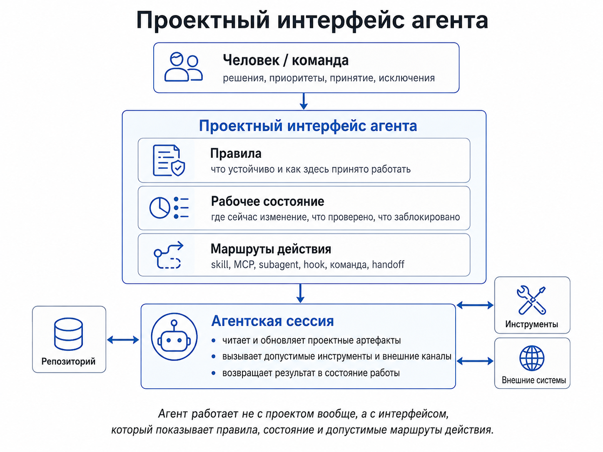
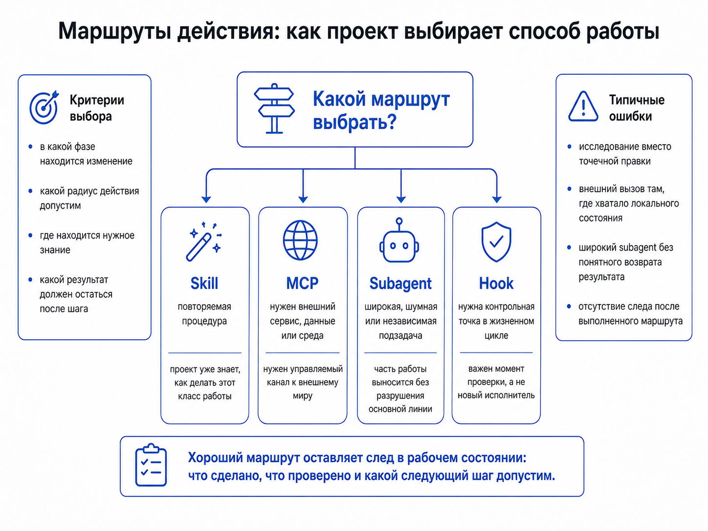
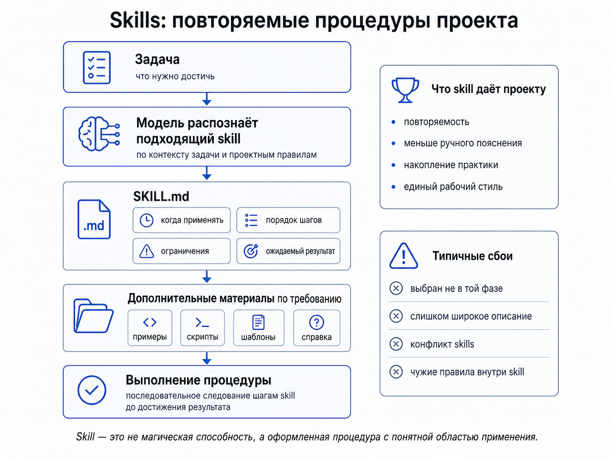
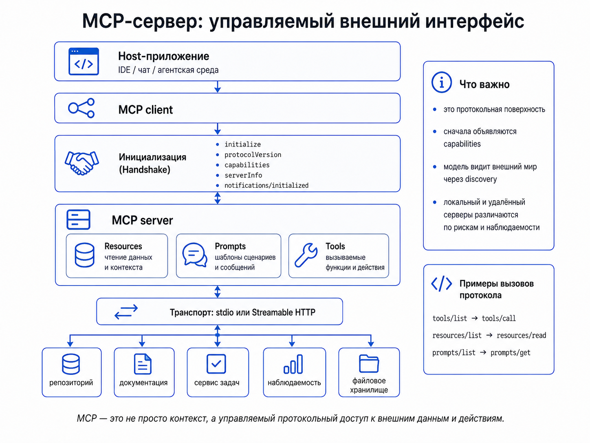
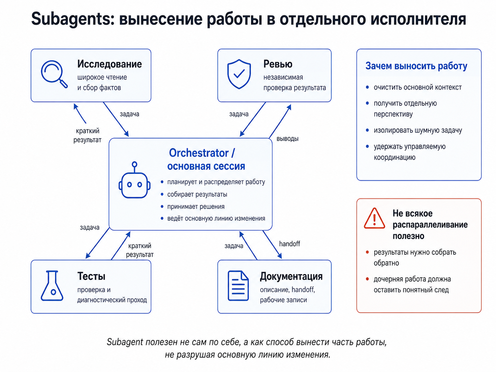
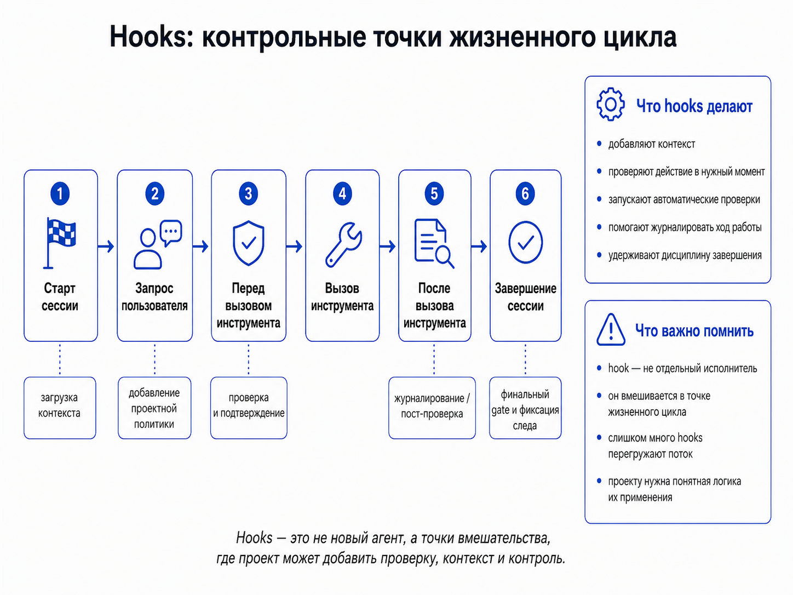

# VI. Контекст и рабочее состояние: проект как интерфейс агента

В агентской разработке почти любой сбой можно объяснить словами: «модели не хватило контекста». Иногда это действительно так. Но очень быстро слово «контекст» начинает закрывать собой слишком разные вещи: текст задачи, историю чата, правила репозитория, текущий план, прошлые решения, открытые вопросы, набор инструментов, результаты тестов, внешние источники и рабочие привычки команды. Когда всё это называется одним словом, причина сбоя перестаёт быть видимой.

Для устойчивой агентской разработки важнее другой вопрос: что именно проект показывает агенту перед работой и во время работы? Агент не имеет прямого доступа к «проекту как целому». Он видит только тот вход, который для него собран: файлы инструкций, спецификации, задачи, статусы, команды, skills, hooks, подключённые инструменты, ограничения прав, фрагменты переписки, результаты проверок. Если этот вход устроен плохо, даже сильная модель начинает восстанавливать проект по обрывкам. Иногда она угадывает правильно. Но это уже не управляемый процесс.

Типовой сбой выглядит просто. В репозитории осталось старое правило: запускать прежнюю команду проверки, обновлять прежний файл прогресса, использовать старый способ загрузки состояния. Человек в текущем чате уже работает иначе и даже даёт агенту новую локальную инструкцию. Но долговечное правило в проекте не изменено. Агент открывает репозиторий, читает проектные инструкции и действует по старому порядку. В следующей сессии ошибка повторяется, потому что исправление осталось в разговоре, а не стало частью проекта.

Другой вариант: правила актуальны, но состояние работы не видно. Агент знает, как писать код, какие тесты запускать и чего нельзя делать. Но он не знает, что уже решено, какие варианты отклонены, что проверено, где блокировка и какой следующий шаг безопасен. Тогда новая сессия начинает почти с нуля: читает лишние файлы, предлагает уже отвергнутые решения, ломает порядок фаз или пытается завершить то, что ещё не прошло проверку.

Третий вариант: инструменты есть, но выбран неправильный маршрут действия. В проекте может быть skill для ревью, skill для исправления, команда загрузки прогресса, subagent для исследования, MCP-сервер для внешнего сервиса. Но если проект не показывает текущую фазу работы, агент выбирает правдоподобный, но неверный путь: начинает ревью вместо исправления, планирует уже спланированное, правит код до уточнения состояния, запускает широкое исследование вместо точечной проверки.

Во всех этих случаях проблема не сводится к размеру запроса. Сбой возникает на границе между проектом и агентом. Проект должен быть не только набором файлов и не только темой разговора. У него должен быть рабочий интерфейс для агента: понятный способ показать правила, текущее состояние, допустимые действия и границы исполнения.

Важно не сваливать в «среду» всё подряд. Одно дело — где и с какими правами агент может действовать. Другое — что он видит: файлы, логи, команды, инструменты, внешние сервисы. Третье — кто удерживает порядок шагов, повторяемость и восстановление после сбоя. Четвёртое — через какой канал результат попадает в CI, pull request, ревью и правила принятия. Эта глава берёт только один срез: как проект предъявляет агенту правила, состояние и доступные способы действия. Среда исполнения и безопасность важны, но если начать с них здесь, разговор о рабочем состоянии быстро растворится в разговоре о правах доступа и sandbox-режимах.

Хорошо видно это на малой, не корпоративной обвязке Mark Erikson. Рядом стоят короткий `AGENTS.md`, отдельный `dev-plans` для рабочей памяти, команды `/context` и `/progress`, handoff-файлы дочерних задач и отдельные subagents для ревью, тестов и документации ([Mark Erikson, “Agent Setup, Workflow, and Tools”](https://blog.isquaredsoftware.com/2026/05/ai-thoughts-part-2-agent-workflow-tools/), [`markerikson/opencode-config-example`](https://github.com/markerikson/opencode-config-example)). Это не просто набор удобных скриптов. Так новая сессия входит в проект не через длинную переписку, а через поддерживаемый интерфейс: правила, текущий фокус, свежий прогресс, допустимый маршрут и границу принятия результата.

Из этого следуют три простых вопроса. Что в проекте считается устойчивым правилом, а не случайной просьбой из последнего чата? Где сейчас находится изменение и что уже можно считать проверенным состоянием работы? Каким маршрутом агент должен действовать именно в этой фазе: исследовать, планировать, чинить, проверять, передавать или ждать человека? Это не новая строгая классификация. Это диагностический способ понять, какой слой интерфейса сломался, когда агент вроде бы «получил контекст», но всё равно действует не туда.

Схематически проектный интерфейс можно представить как слой между человеком, репозиторием, агентом и внешними системами. Он не заменяет ни человека, ни среду выполнения. Он собирает для агента тот вход, без которого действие превращается в угадывание.

<figure class="image-asset" id="fig-vi-project-interface-layers" data-asset-status="local_image_asset" data-repo-path="content/assets/theory-images/vi-project-interface-agent.png">
  
  <figcaption>Проектный интерфейс агента как общий каркас главы: человек задаёт решения, проектный интерфейс удерживает правила, состояние и маршруты действия, а агентская сессия связывает этот слой с репозиторием, инструментами и внешними системами. Синтетическая схема по материалам главы.</figcaption>
</figure>

## Правила: что считается устойчивым

Первый слой такого интерфейса — правила и ограничения. Это не всё знание о проекте, а только то, что должно переживать отдельную сессию: соглашения о стиле, команды проверки, запреты, порядок работы, требования к тестам, языку, безопасности, источникам, документации и принятию результата.

В Codex эта роль прямо отдана `AGENTS.md`: документация описывает, что Codex читает такие файлы до начала работы, собирает инструкции сначала с глобального уровня, затем с уровня проекта и текущей директории; инструкции, расположенные ближе к рабочему файлу, добавляются в запрос позже и перекрывают более общие правила ([OpenAI Codex AGENTS.md](https://developers.openai.com/codex/guides/agents-md)). Это важная техническая деталь. У правила есть не только содержание, но и область действия: правило в корне репозитория и правило в подпапке не равны.

Похожая потребность видна в межинструментальной инициативе `AGENTS.md`: этот файл описывается как `README` для агентов, где можно держать команды сборки, проверки и проектные соглашения ([AGENTS.md](https://agents.md/)). Важен не сам формат, а направление. Команда уже не рассчитывает, что агент сам восстановит рабочий порядок из обычного README, кода и истории сообщений. Ему дают отдельный машинно-читаемый вход.

В Claude Code похожую роль выполняют `CLAUDE.md` и автоматическая память. Документация подчёркивает, что каждая сессия начинается с нового контекстного окна, а знания между сессиями переносятся через `CLAUDE.md` и автоматическую память ([Claude Code memory](https://code.claude.com/docs/en/memory)). Но у этого слоя есть граница: это контекст, а не принудительная настройка поведения. Если действие нужно гарантированно заблокировать, нужен `PreToolUse` hook. Значит, файл правил помогает агенту действовать правильно, но сам по себе не становится механизмом принуждения.

Kiro решает близкую задачу через steering-файлы: они могут описывать продукт, технические решения, структуру проекта и правила. `AGENTS.md` там работает как всегда включённая steering-директива, а обычные steering-файлы могут подключаться по разным режимам ([Kiro Steering](https://kiro.dev/docs/steering/)). Это снова показывает не «ещё один тип документации», а устройство проектного входа: часть правил нужна всегда, часть — только для определённых файлов или задач, часть — по явному вызову.

Та же граница видна в практических обвязках. У Erikson `AGENTS.md` ценен именно потому, что он короткий и устойчивый: там держатся правила поведения, а не весь рабочий архив ([пример `config/AGENTS.md`](https://github.com/markerikson/opencode-config-example/blob/main/config/AGENTS.md)). У Mae Capozzi похожий урок выражен через сигнал `InstructionsLoaded`: мало иметь файл инструкций в репозитории; нужно понимать, что агент действительно загрузил нужный слой контекста ([Mae Capozzi, “Claude Orchestrator”](https://maecapozzi.com/blog/building-a-multi-agent-orchestrator)). Иначе команда думает, что правило действует, а агент фактически работает по неполному входу.

Этот слой начинает вредить, когда превращается в склад прошлых намерений. Старое правило, забытый запрет, инструкция под прежний стек, неактуальная команда проверки — для человека это может быть просто устаревшая документация. Для агента это активный управляющий вход. Если проект показывает старую картину, модель может очень дисциплинированно воспроизвести старый процесс.

Поэтому правилам нужен статус. Нужно понимать, что является постоянной политикой, что является локальной просьбой, что уже устарело, что требует переноса из чата в проектный файл, а что нужно удалить. Иначе каждая новая сессия снова сталкивает текущую реплику человека с долговечными инструкциями, которые никто не почистил.

## Рабочее состояние: где находится изменение

Правил недостаточно. Агент может хорошо знать порядок работы в проекте и всё равно ошибаться, если не видит, где сейчас находится изменение.

Рабочее состояние — это не история сообщений. История чата смешивает рабочие решения, отменённые варианты, промежуточные объяснения, ошибки, усталость, уточнения и побочные идеи. Человек часто достраивает статус из памяти: он помнит, что было принято, а что просто обсуждалось. Агенту нужен более явный носитель: текущая задача, принятые решения, открытые вопросы, выполненные проверки, блокировки и следующий безопасный шаг.

Kiro Specs дают простой пример такого носителя. Спецификация раскладывается на `requirements.md` или `bugfix.md`, `design.md` и `tasks.md`; `tasks.md` используется как план с отслеживаемыми задачами и обновлением статуса выполнения ([Kiro Specs](https://kiro.dev/docs/specs/)). Существенно здесь другое: изменение получает форму, которую агент может открыть, прочитать и обновить. Работа перестаёт жить только в разговоре.

В той же логике `dev-plans` у Erikson — не ещё одно место для заметок. Текущий фокус, рабочие записи, записи прогресса, handoff-файлы дочерних задач и локальные особенности проекта вынесены из основного репозитория кода, но доступны агенту через команды ([`devplans.ts`](https://github.com/markerikson/opencode-config-example/blob/main/config/scripts/devplans.ts), [`/context`](https://github.com/markerikson/opencode-config-example/blob/main/config/command/context.md), [`/progress`](https://github.com/markerikson/opencode-config-example/blob/main/config/command/progress.md)). `/context` возвращает в сессию краткую ориентацию, а `/progress` фиксирует итог текущей рабочей сессии: что изменено, какие решения приняты, что проверено и какие следующие шаги актуальны. Смысл не в формате, а в дисциплине: состояние записывает та сессия, которая действительно держит целую картину работы, а следующая сессия загружает не весь архив, а рабочую вводную.

BMAD Method показывает похожий принцип в более процессной форме. Планирование и реализация разведены по отдельным рабочим потокам, которые рекомендуется запускать в новых чатах; проект проходит через PRD, architecture, epics/stories, а `sprint-status.yaml` хранит состояние эпиков и историй ([BMAD Getting Started](https://docs.bmad-method.org/tutorials/getting-started/)). Отдельно `project-context.md` описывается как руководство по реализации для AI-агентов: файл, где держатся технические предпочтения, шаблоны и правила, чтобы агент не принимал общие решения заново в каждом новом рабочем потоке ([BMAD Project Context](https://docs.bmad-method.org/how-to/project-context/)). Здесь хорошо виден стык правил и состояния: одно показывает, как принято работать, другое — какая часть работы сейчас движется.

GSD Core формулирует проблему ещё прямее: тяжёлые шаги выносятся в subagents с чистым контекстом, работа идёт через повторяемый фазовый цикл, а состояние и контекст должны переживать границы сессии через структурные артефакты вроде `STATE.md` и `CONTEXT.md` ([GSD Core](https://github.com/open-gsd/gsd-core)). Здесь важна не конкретная реализация GSD, а признание проблемы: если вся работа держится в одном раздувающемся контекстном окне, состояние теряется, качество падает, а проверка сливается с самоописанием агента.

Spec Kit даёт жёсткую последовательность: constitution, specification, plan, tasks, implementation. В README проекта `tasks.md` описан как дорожная карта реализации, а перед самой реализацией агент должен проверить наличие constitution, spec, plan и tasks ([GitHub Spec Kit](https://github.com/github/spec-kit)). Это пример процесса, где агент получает не один большой запрос, а цепочку артефактов, каждый из которых меняет статус работы.

Разные инструменты устроены по-разному, но общий смысл одинаковый: рабочее состояние должно быть вынесено из головы человека и из истории чата. Новая сессия должна быстро понять:

- что является текущей задачей;
- какие решения уже приняты;
- какие файлы и источники считаются актуальными;
- что проверено;
- что заблокировано;
- какой следующий шаг допустим;
- какой артефакт нужно обновить после шага.

Если этих ответов нет, агент имитирует непрерывность. Он пишет так, будто понимает ход работы, но на самом деле собирает вероятную версию из видимого текста. В коротких задачах этого иногда хватает. В длинной агентской разработке так накапливаются повторные решения, потерянные ограничения, устаревшие планы, недовыполненные проверки и плохие handoff-и.

Особенно опасно, когда статус есть, но его приоритет не задан. В одном файле задача помечена как завершённая, в другом остался список обязательных проверок, в чате человек написал «пока не принимать», а в старом плане указана другая последовательность действий. Для модели это несколько текстовых фрагментов. Чтобы они стали состоянием работы, проект должен задавать порядок доверия: какой файл главный, кто его обновляет, что означает `done`, что означает `blocked`, что считается черновиком, где записываются исключения.

Фраза в запросе «учти всё, что было раньше» не решает эту задачу. Она просит модель реконструировать процесс. Рабочее состояние должно быть предъявлено как объект, а не как просьба вспомнить всё.

## Маршруты действия: как проект выбирает способ работы

Даже правила и состояние ещё не образуют полный интерфейс. Агенту нужно знать не только что важно и где сейчас находится работа, но и каким способом в этом проекте обычно выполняют такой тип задачи. Здесь появляются skills, MCP, subagents и hooks. Их легко назвать одним словом «инструменты», но тогда исчезает главное различие: одни задают процедуру, другие открывают внешний канал, третьи выносят работу в отдельный контекст, четвёртые вмешиваются в момент действия.

Поэтому маршруты действия лучше не сжимать в общий список возможностей. На этом уровне проект выбирает форму работы: взять повторяемую процедуру, открыть внешний канал, вынести часть задачи в отдельный контекст или поставить автоматическую точку вмешательства. Эти формы достаточно крупные и по-разному влияют на состояние проекта, поэтому дальше они рассматриваются как самостоятельные части одного аргумента, а не как подпункты каталога инструментов.

Выбор маршрута — это не украшение процесса и не вопрос удобства интерфейса. Это часть управления изменением. Одна и та же внешняя просьба может требовать разных форм работы в зависимости от фазы. «Проверь этот модуль» может означать быстрый локальный проход по известному чеклисту, исследование незнакомой подсистемы, запуск отдельного ревью-исполнителя, обращение к внешнему сервису или автоматический барьер перед принятием результата. Если проект не различает эти случаи, агент выбирает маршрут по ближайшей привычной форме: начинает планировать там, где нужно чинить; исследует там, где уже есть решение; правит файлы до проверки состояния; запускает широкий поиск вместо точечного чтения; оставляет результат без финальной фиксации.

Маршрут выбирается не по названию инструмента, а по характеру работы. Повторяемая процедура тянет задачу к skill: проект уже знает, как делать такой класс работы, и хочет воспроизвести порядок шагов. Если задаче нужны внешняя система, живые данные, API, сервис или среда репозитория, она ближе к MCP: агенту нужен не только текст в контексте, но и управляемый канал к среде. Широкое чтение, независимая проверка, шумные логи или параллельные перспективы тянут задачу к subagent: основной контекст должен сохранить ход изменения, а побочная работа может быть вынесена наружу. Момент, где действие должно быть проверено, дополнено, остановлено или зафиксировано автоматически, тянет задачу к hooks: здесь важен не новый исполнитель, а точка вмешательства в жизненный цикл.

На практике эти маршруты часто соединяются. Skill может описывать процедуру ревью, subagent — выполнить один из её проходов, MCP-сервер — дать доступ к трекеру задач или тестовой среде, hook — остановить небезопасное действие или потребовать финальную проверку перед завершением. Поэтому проекту мало иметь список возможностей. Ему нужна простая логика выбора: в какой фазе находится изменение, какой радиус действия допустим, где находится нужное знание, какой результат должен остаться после выполнения и кто принимает следующий шаг.

Хороший маршрут оставляет след в рабочем состоянии. После него должно быть понятно, что именно было сделано, какой способ работы был выбран, какие проверки прошли, какие ограничения остались, что можно считать результатом и где требуется человек. Без такого следа маршрут превращается в одноразовое действие внутри чата. С ним он становится частью проектного интерфейса: следующая сессия видит не только текст результата, но и форму работы, через которую этот результат был получен.

<figure class="image-asset" id="fig-vi-route-selection" data-asset-status="local_image_asset" data-repo-path="content/assets/theory-images/vi-route-selection.png">
  
  <figcaption>Выбор маршрута действия — это часть управления изменением: проект решает, когда нужна повторяемая процедура, когда — внешний канал, когда — отдельный исполнитель, а когда — контрольная точка в жизненном цикле. Синтетическая схема по материалам главы.</figcaption>
</figure>

## Skills: повторяемые процедуры как часть проекта

Skill — это не просто сохранённый запрос и не ещё одна команда в списке инструментов. В проектном интерфейсе агента skill лучше понимать как повторяемую рабочую процедуру, которую можно передать агенту вместе с правилами её применения. Конкретная упаковка в Codex, Claude Code и других средах различается, поэтому здесь важнее не путь к файлу и не синтаксис настройки, а внутренняя форма: у процедуры есть назначение, условия применения, порядок действий, входные данные, ожидаемый результат, ограничения и материалы, на которые агент должен опираться. Официальные описания Codex и Anthropic сходятся в этом общем смысле: skill упаковывает инструкции, ресурсы и, когда это нужно, поддерживающую логику так, чтобы агент мог воспроизводимо выполнить определённый класс задач ([Codex Agent Skills](https://developers.openai.com/codex/skills), [OpenAI Codex best practices](https://developers.openai.com/codex/learn/best-practices), [Anthropic, “Equipping agents for the real world with Agent Skills”](https://www.anthropic.com/engineering/equipping-agents-for-the-real-world-with-agent-skills)).

Зачем это нужно? В агентской разработке человек постоянно повторяет одни и те же инструкции: сначала уточни задачу, собери требования, разбей работу на независимые куски, проведи ревью, сделай диагностику, напиши handoff, проверь UI в браузере, подготовь заметки к релизу. Пока это каждый раз пишется заново, процедура живёт в памяти человека и в последнем чате. Skill переносит её в проектную среду: её можно улучшать, обсуждать, версионировать, проверять на реальных задачах, переносить между проектами и заменять, когда способ работы изменился.

Обычно skill держит несколько вещей. Короткое описание помогает агенту понять, когда процедура подходит к задаче. Основная инструкция задаёт порядок работы: что прочитать, какие вопросы задать, какие шаги выполнить, что считать хорошим результатом. Примеры показывают ожидаемую форму ответа или артефакта. Дополнительные материалы, шаблоны или скрипты нужны там, где одной инструкции мало. Важная идея здесь — постепенная загрузка: агенту не обязательно держать всё содержимое всех skills в контексте заранее; сначала ему достаточно увидеть краткие описания, а подробности нужны только для выбранной процедуры. Поэтому описание skill становится рабочим механизмом, а не красивой подписью: если оно слишком широкое, слишком узкое или плохо различает фазу работы, агент выберет не тот маршрут ([Codex Agent Skills](https://developers.openai.com/codex/skills), [Codex customization](https://developers.openai.com/codex/concepts/customization), [Anthropic Agent Skills](https://www.anthropic.com/engineering/equipping-agents-for-the-real-world-with-agent-skills)).

<figure class="image-asset" id="fig-vi-skills-procedure" data-asset-status="local_image_asset" data-repo-path="content/assets/theory-images/vi-skills-procedure.png">
  
  <figcaption>Skill полезен не как красивая команда, а как оформленная процедура: модель распознаёт подходящий skill, подгружает нужные материалы и проходит шаги, у которых есть условия применения, ограничения и ожидаемый результат. Синтетическая схема по материалам главы.</figcaption>
</figure>

Хороший skill обычно начинается с повторяемой ручной практики. Команда замечает, что один и тот же запрос приходится формулировать снова и снова. Из него делают первый вариант процедуры. Затем skill применяют к реальным задачам и смотрят, где он сработал плохо: включился не в той фазе, не задал важный вопрос, вернул слишком общий артефакт, не проверил источник, перепутал исследование с реализацией. После этого уточняют описание, добавляют входные требования, примеры, ограничения, проверочные шаги или вспомогательные материалы. Если процедура перестала соответствовать проекту, её нужно обновить или вывести из использования. Иначе проект начинает воспроизводить старый рабочий порядок уже не из-за забытых правил, а через устаревший skill.

Практические сценарии хорошо видны на инженерных наборах skills. У Matt Pocock `/grill-me` и `/grill-with-docs` заставляют агента сначала уточнить замысел, а не преждевременно писать план; `/to-prd` переводит разговор в PRD; `/to-issues` разбивает PRD на отдельные задачи; `/tdd` удерживает цикл «сначала тесты»; `/improve-codebase-architecture` ищет места, где плохая структура кода мешает агенту и человеку; `/handoff` помогает перенести состояние работы в следующую сессию. Это не «магические команды», а закодированные процедуры для типичных провалов агентской разработки: недопонятая задача, слишком ранний план, плохая декомпозиция, слабые тестовые границы, потеря состояния при передаче ([`mattpocock/skills`](https://github.com/mattpocock/skills), [“5 Agent Skills I Use Every Day”](https://www.aihero.dev/5-agent-skills-i-use-every-day), [`handoff/SKILL.md`](https://github.com/mattpocock/skills/blob/main/skills/productivity/handoff/SKILL.md), [`diagnose/SKILL.md`](https://github.com/mattpocock/skills/blob/main/skills/engineering/diagnose/SKILL.md), [`tdd/SKILL.md`](https://github.com/mattpocock/skills/blob/main/skills/engineering/tdd/SKILL.md)).

Похожие сценарии видны и в Codex-документации. В примерах для создания повторяемых skills фигурируют исправление упавших Buildkite-проверок, превращение заметок PR-ревью в комментарии прямо в pull request, заметки к релизу по объединённым pull requests, исправление merge conflicts, skill для фронтенда со стилевыми правилами интерфейса, проверка по скриншотам и финальная доводка в браузере. Это хороший набор типовых случаев: skill нужен там, где есть не просто одно действие, а повторяемый способ работы с входами, проверками и ожидаемым результатом ([Save workflows as skills](https://developers.openai.com/codex/use-cases/reusable-codex-skills), [Build responsive front-end designs](https://developers.openai.com/codex/use-cases/frontend-designs)).

Отдельный слой появляется, когда skills собираются в библиотеку. Один skill решает локальную процедуру. Набор skills уже задаёт стиль работы с агентом: как уточнять задачу, как писать требования, как дробить работу, как проверять, как передавать состояние. Поэтому люди начинают не только писать свои skills, но и следить за чужими наборами, устанавливать подходящие, сравнивать варианты, адаптировать их под проект и выводить из использования неудачные. Публичные каталоги показывают, что skills группируются не только вокруг кодинга, но и вокруг документов, анализа данных, фронтенда, ревью, безопасности, коммуникации, автоматизации и работы с внешними сервисами. В Agent Skills Library видны отдельные разделы по провайдерам и примеры вроде Frontend Design, React Best Practices, NotebookLM Skill и YouTube Transcript Downloader; репозитории `openai/skills`, `anthropics/skills` и подборки вроде `awesome-claude-skills` показывают тот же сдвиг: skills становятся распространяемым слоем практики, а не личными заметками одного пользователя ([openai/skills](https://github.com/openai/skills), [anthropics/skills](https://github.com/anthropics/skills), [awesome-claude-skills](https://github.com/ComposioHQ/awesome-claude-skills), [Agent Skills Library](https://mcpservers.org/agent-skills)).

Но библиотека skills не делает работу автоматически надёжной. У skill есть несколько характерных сбоев. Он может сработать не в той фазе: skill для реализации включится до уточнения требований или skill для ревью начнёт оценивать работу, у которой ещё нет принятой цели. Его описание может быть таким широким, что агент выбирает его почти для любой похожей задачи. Несколько skills могут конкурировать за один случай и давать разные маршруты. Внешний skill может принести чужие правила, которые конфликтуют с проектом. Skill может спрятать важное решение внутри процедуры: агент будет делать «как обычно», но команда уже не видит, где именно принято спорное правило. А если skill содержит скрипты или обращается к внешним ресурсам, он становится ещё и частью доверенной поверхности проекта.

Исследования по skills подтверждают этот риск с двух сторон. Анализ десятков тысяч публичных skills показывает, что они уже образуют заметную инфраструктуру вокруг агентов, но при этом содержат много похожих намерений, неравномерно покрывают разные категории и включают небезопасные случаи с действиями, которые меняют состояние системы или работают на системном уровне. Другая работа показывает, что выгода от skills становится хрупкой в реалистичных условиях: агенту нужно самому найти подходящий skill в большой коллекции, и ближайший найденный skill может оказаться не совсем тем, что нужно задаче. Исследование атак через `SKILL.md` отдельно подчёркивает, что описание skill — не пассивная документация: оно влияет на обнаружение, выбор, загрузку и доверие к skill, а значит может становиться частью риска в цепочке поставки ([Agent Skills: A Data-Driven Analysis](https://arxiv.org/abs/2602.08004), [How Well Do Agentic Skills Work in the Wild](https://arxiv.org/abs/2604.04323), [Under the Hood of SKILL.md](https://arxiv.org/abs/2605.11418)).

Для проектного интерфейса вывод простой: skill усиливает агента только тогда, когда связан с текущим состоянием работы и с понятными условиями применения. Его нельзя воспринимать как готовую «способность из интернета». Это рабочий артефакт проекта: у него должна быть область применения, примеры, ограничения, способ обновления и понятное место среди других маршрутов. Тогда skill перестаёт быть длинной подсказкой и становится способом, которым проект накапливает повторяемые процедуры.

## MCP-сервер: управляемый внешний интерфейс

MCP решает другую часть проблемы. Skill задаёт повторяемую процедуру: как здесь обычно уточняют задачу, делают ревью, диагностируют сбой или передают работу дальше. MCP открывает внешний канал, через который агент может получить данные, вызвать инструмент или выполнить действие вне собственного текстового контекста. В этом смысле MCP добавляет к проектному интерфейсу не «контекст вообще», а управляемый доступ к внешнему миру.

Технически MCP-сервер не является ещё одной папкой с текстом и не сводится к «докинуть контекст модели». Официальная спецификация описывает схему из host-приложения, MCP client внутри этого приложения и MCP server, который предоставляет контекст и возможности. Host — это IDE, чат или другая агентская среда; client ведёт протокол; server отдаёт возможности. Связь строится на JSON-RPC 2.0: стороны обмениваются запросами, ответами и уведомлениями внутри stateful-сессии ([MCP specification 2025-11-25](https://modelcontextprotocol.io/specification/2025-11-25), [MCP architecture](https://modelcontextprotocol.io/docs/learn/architecture), [MCP base protocol](https://modelcontextprotocol.io/specification/2025-11-25/basic)).

Сессия начинается не с произвольного вызова инструмента, а с рукопожатия. Client отправляет `initialize`: поддерживаемую версию протокола, свои `capabilities` и `clientInfo`. Server отвечает выбранной версией протокола, своими `capabilities`, `serverInfo` и, если нужно, `instructions`; после этого client отправляет `notifications/initialized`. Только после этой фазы начинается нормальная работа. Поэтому внешний интерфейс MCP-сервера — это не просто список функций: сначала сервер объявляет, какие классы возможностей вообще доступны в этой сессии ([MCP lifecycle](https://modelcontextprotocol.io/specification/2025-11-25/basic/lifecycle)).

Транспортный слой отделён от этих прикладных методов. В `stdio`-варианте client запускает MCP-сервер как subprocess, пишет JSON-RPC-сообщения в `stdin`, читает ответы из `stdout`, а `stderr` используется для логов; в `stdout` не должно попадать ничего, кроме валидных MCP-сообщений. В Streamable HTTP server работает как отдельный процесс с одним MCP endpoint, который принимает `POST` и `GET`: client отправляет JSON-RPC через `POST`, а server может вернуть один JSON-ответ или открыть поток Server-Sent Events для streaming, notifications и server-to-client requests. Это важная практическая развилка: локальный сервер для IDE и удалённый сервер организации выглядят для модели похоже на уровне методов, но сильно отличаются по запуску, авторизации, сетевым рискам и наблюдаемости ([MCP transports](https://modelcontextprotocol.io/specification/2025-11-25/basic/transports)).

<figure class="image-asset" id="fig-vi-mcp-server-interface" data-asset-status="local_image_asset" data-repo-path="content/assets/theory-images/vi-mcp-server-interface.png">
  
  <figcaption>MCP-сервер показывает внешний мир как протокольную поверхность: host-приложение и клиент проходят инициализацию, сервер объявляет capabilities, а затем агент работает с resources, prompts и tools через transport layer. Синтетическая схема по официальной спецификации MCP 2025-11-25.</figcaption>
</figure>

На прикладном уровне сервер обычно раскрывается через три серверные возможности. `resources` дают данные и контекст по URI: файлы, схемы базы, документы, результаты API или другой материал для чтения; client может запрашивать список ресурсов, читать ресурс и, если поддержано, следить за изменениями списка или подписываться на обновления. `prompts` дают шаблоны сообщений и рабочих сценариев: client может получить список prompts и запросить конкретный prompt с аргументами. `tools` дают функции, которые модель может обнаружить и вызвать; у каждого tool есть имя, описание, `inputSchema`, иногда `outputSchema`, а вызов идёт через `tools/call` с именем инструмента и аргументами. Поэтому MCP-сервер проектируется не только как backend-адаптер, но и как поверхность discovery: модель понимает доступный внешний мир через имена, описания и схемы, которые ей показаны ([MCP Resources](https://modelcontextprotocol.io/specification/2025-11-25/server/resources), [MCP Prompts](https://modelcontextprotocol.io/specification/2025-11-25/server/prompts), [MCP Tools](https://modelcontextprotocol.io/specification/2025-11-25/server/tools)).

Такой внешний интерфейс не сводит MCP к передаче контекстных материалов. Через `resources` сервер действительно открывает данные, которые модель может прочитать: файлы, документы, схемы, результаты внешних API. Но `prompts` и `tools` относятся к другим формам работы. `prompts` приносят подготовленный рабочий сценарий или шаблон сообщения, а `tools` открывают действие с возможными побочными эффектами: запрос к API, запись комментария, создание issue, изменение объекта во внешнем сервисе, запуск вычисления. Поэтому один и тот же MCP-сервер может одновременно быть источником сведений, каталогом процедур и набором внешних действий. Для проектного интерфейса это принципиально: читать список `resources` и разрешить `tools/call` — не одно и то же.

Эта граница должна быть узкой. Для ревью pull request нужен один набор возможностей: прочитать дифф, увидеть проверки, открыть связанные issues, оставить комментарий, возможно, запустить или посмотреть workflow. Для работы по макету нужен другой контур: получить структуру дизайна, размеры, стили, состояния компонентов и связь с design system. Для платежной интеграции нужен третий: читать документацию, работать с sandbox или безопасными объектами API, не смешивая это с доступом к production-действиям. Для диагностики ошибки нужен четвёртый: получить issue, stack trace, события, релиз, окружение и связанные коммиты. Один большой сервер «ко всему» выглядит удобным, но плохо совпадает с задачей: агент видит лишние инструменты, тратит контекст на ненужные описания и получает права, которые не оправданы текущей работой.

Поэтому MCP-сервер в проектном интерфейсе стоит понимать как контур доступа под определённый класс задач. GitHub MCP подходит к работе с репозиториями, issues, pull requests и workflow ([GitHub MCP Server](https://github.com/github/github-mcp-server), [GitHub MCP in IDE](https://docs.github.com/en/copilot/how-tos/provide-context/use-mcp-in-your-ide/use-the-github-mcp-server)). Figma MCP нужен там, где агент должен получать дизайн-контекст для генерации или исправления интерфейса, а не угадывать структуру UI по скриншоту ([Figma MCP server](https://developers.figma.com/docs/figma-mcp-server/)). Playwright MCP и Chrome DevTools MCP относятся к браузерному контуру: навигация, проверка UI, network/debugging, accessibility snapshots и диагностика поведения страницы ([Playwright MCP](https://github.com/microsoft/playwright-mcp), [Chrome DevTools MCP](https://github.com/ChromeDevTools/chrome-devtools-mcp)). Stripe MCP нужен для платежной интеграции и работы с документацией и объектами Stripe API ([Stripe MCP](https://docs.stripe.com/mcp)). Notion MCP открывает рабочее пространство Notion с учётом доступа и прав ([Notion MCP](https://developers.notion.com/guides/mcp/overview)). Sentry MCP рассчитан на отладку и developer workflows, а не на весь Sentry API подряд ([Sentry MCP](https://github.com/getsentry/sentry-mcp)). Context7 даёт актуальную документацию и примеры по библиотекам, а reference servers вроде Filesystem, Git, Fetch и Memory показывают базовые типы доступа: файлы, репозиторий, веб-контент и долговременную память ([Context7](https://github.com/upstash/context7), [MCP reference servers](https://github.com/modelcontextprotocol/servers), [MCP Registry](https://github.com/mcp)).

Этот набор примеров важен не как список популярных серверов. Он показывает разные формы внешнего мира. Репозиторий, браузер, дизайн-макет, платёжный API, база знаний, система мониторинга и локальная файловая система требуют разных границ доступа. Если агент чинит падение теста, ему не нужен платежный сервер. Если он переносит дизайн в компонент, ему не нужен доступ к Sentry. Если он уточняет документацию по библиотеке, ему обычно достаточно доступа к актуальным docs только на чтение, а не общего права менять проект. Хороший MCP-контур начинается с вопроса: что именно агент должен прочитать или сделать для этой задачи, какие действия должны быть запрещены и где требуется подтверждение человека.

С этим связана безопасность. MCP-инструменты рассчитаны на то, что модель может обнаруживать и вызывать их по контексту, но спецификация прямо говорит, что tools относятся к model-controlled primitives, а интерфейс приложения должен показывать пользователю, какие tools открыты модели, визуально отмечать вызовы и давать человеку возможность отклонять операции. В определении tool важны не только `name` и `inputSchema`: описание и annotations тоже влияют на поведение модели, поэтому client должен считать аннотации инструмента недоверенными, если они не получены от trusted server ([MCP Tools](https://modelcontextprotocol.io/specification/2025-11-25/server/tools)). Официальные практики безопасности отдельно разбирают риски вроде confused deputy, token passthrough, SSRF, session hijacking, компрометации локального сервера и scope minimization ([MCP Security Best Practices](https://modelcontextprotocol.io/docs/tutorials/security/security_best_practices)). В прикладных исследованиях появляются MCP-специфические проблемы: tool poisoning в описаниях инструментов, ошибки MCP-серверов, возможность добраться через tool handler до shell, сети или файловой системы, если сервер написан слишком широко или плохо проверяет входы ([MCP at First Glance](https://arxiv.org/abs/2506.13538), [MCPTox](https://arxiv.org/abs/2508.14925), [VIPER-MCP](https://arxiv.org/abs/2605.21392), [Prompts Don’t Protect](https://arxiv.org/abs/2605.18414)). Практический вывод простой: prompts и правила поведения не заменяют архитектурного ограничения доступа. Лучше не показывать агенту лишний инструмент, чем надеяться, что он никогда им не воспользуется.

В зрелом проектном интерфейсе MCP связан со skills и рабочим состоянием. Skill диагностики может требовать: открыть issue, получить свежие логи через Sentry, проверить статус релиза, посмотреть связанные изменения и только после этого предлагать исправление. MCP при этом не должен превращаться в широкий набор «на всякий случай». Он даёт конкретные каналы для чтения и действия, а skill задаёт процедуру, когда и как этими каналами пользоваться. Если состояние работы говорит, что задача ещё в фазе исследования, сервер может быть доступен только на чтение. Если человек перевёл задачу в фазу исправления, набор действий может расшириться, но всё равно должен оставаться связанным с этой задачей.

Kiro Powers дают хороший пример той же проблемы с другой стороны. Документация предупреждает, что несколько MCP-серверов могут загрузить десятки тысяч токенов описаний инструментов ещё до первого содержательного запроса, а Powers пытаются включать только релевантные инструменты и контекст по задаче ([Kiro Powers](https://kiro.dev/docs/powers/)). Это не просто экономия контекста. Это способ не превращать возможности агента в шумную свалку доступов.

Та же мысль видна на двух масштабах. Armin Ronacher тянет интерфейс к малой программируемой поверхности: `make dev`, `make tail-log`, короткие скрипты, логи и Playwright-сценарии часто лучше гигантского каталога MCP-инструментов, потому что агент видит понятный путь действия ([Agentic Coding Recommendations](https://lucumr.pocoo.org/2025/6/12/agentic-coding/), [“Your MCP Doesn’t Need 30 Tools”](https://lucumr.pocoo.org/2025/8/18/code-mcps/)). Stripe Minions показывают корпоративный край: Slack-запрос проходит через анализатор, blueprint, отобранный контекст, Toolshed, проверки и pull request ([Stripe Minions Part 1](https://stripe.dev/blog/minions-stripes-one-shot-end-to-end-coding-agents), [Part 2](https://stripe.dev/blog/minions-stripes-one-shot-end-to-end-coding-agents-part-2)). В обоих случаях агенту не дают «всё сразу». Ему дают маршрут и набор внешних возможностей, подходящих текущей задаче.

## Subagents: разные исполнители для разных частей задачи

Subagent нужен не потому, что «несколько агентов лучше одного». Он нужен тогда, когда часть работы лучше вынести из основного контекста: исследование затронет десятки файлов, проверка породит много логов, ревью должно пройти по нескольким независимым направлениям, а основная сессия должна сохранить требования, решения и общий ход изменения. В Codex `subagents` запускаются явно, могут идти параллельно и возвращают сводный результат. Документация отдельно предупреждает, что такие запуски расходуют больше токенов и особенно хорошо подходят для чтения, исследования, тестов, разбора очереди проблем и сжатия шумного материала; параллельные правки кода требуют большей осторожности ([OpenAI Codex Subagents](https://developers.openai.com/codex/concepts/subagents), [Codex Subagents usage](https://developers.openai.com/codex/subagents)). В Claude Code subagents описаны как отдельные рабочие контексты с собственными инструкциями, доступными инструментами, разрешениями, hooks и skills; они помогают не забивать основной разговор поиском, логами и содержимым файлов ([Claude Code Subagents](https://code.claude.com/docs/en/sub-agents)).

Разная рабочая роль subagent в инженерном смысле — это не характер и не театральная роль. Это профиль работы: цель, область внимания, допустимые инструменты, выбранная модель или уровень рассуждения, ограничения, формат ответа и критерии остановки. Один исполнитель может быть исследователем кодовой базы: много читает, строит карту релевантных мест и возвращает короткий отчёт с путями и выводами. Другой — проверяющим безопасность: смотрит на auth, инъекции, секреты, небезопасные побочные действия и не должен сам править файлы. Третий — test runner: запускает проверки и возвращает факты, а не архитектурные предложения. Четвёртый — migration reviewer: проверяет данные, rollback, совместимость и порядок выката. Пятый — критик плана: ищет слабые места и скрытые допущения, не пытаясь одновременно реализовать решение.

Такое разделение особенно полезно в ревью. Codex прямо приводит пример, где по pull request запускается один agent на security, качество кода, ошибки, гонки состояния, нестабильные тесты и сопровождаемость, а основной поток ждёт результаты и собирает общую сводку ([Codex Subagents usage](https://developers.openai.com/codex/subagents)). Похожий практический пример есть в публичной обвязке для Claude Code: команда запускает несколько параллельных subagents, каждый смотрит на свой слой качества — тесты, линтеры, безопасность, сложность, производительность, зависимости, нестабильность тестов и сопровождаемость; итог собирается в приоритетный список находок ([HAMY, “9 Parallel AI Agents That Review My Code”](https://hamy.xyz/blog/2026-02_code-reviews-claude-subagents)). Для этой главы важен не сам набор из девяти проверок, а форма: один и тот же diff можно читать разными профессиональными глазами, если каждому исполнителю дать узкую задачу и ожидаемый формат ответа.

Продвинутая оркестрация начинается не с количества subagents, а с разбиения задачи. Главный агент или человек должен решить, какие части работы независимы, какие требуют общего состояния, где есть риск конфликтующих решений и какой результат нужен от каждого исполнителя. Anthropic в разборе своей multi-agent research system описывает именно эту проблему: главный агент разлагает запрос на подзадачи, а каждому subagent нужны цель, формат ответа, указания по инструментам и источникам, а также ясные границы подзадачи; без этого агенты дублируют работу, оставляют пробелы или не находят нужную информацию ([Anthropic, “How we built our multi-agent research system”](https://www.anthropic.com/engineering/multi-agent-research-system)). Это хороший общий принцип и для разработки: поручение «посмотри безопасность» слабее, чем «проверь новый diff на обход авторизации, секреты, инъекции и опасные значения по умолчанию; не правь файлы; верни находки с путями, серьёзностью и предлагаемой проверкой».

LangChain описывает subagents как схему с центральным управляющим агентом: основной агент решает, кого вызвать, что передать и как объединить результаты. Там же проектирование многоагентной системы связывается с управлением контекстом: качество системы зависит от того, какую информацию видит каждый агент ([LangChain Multi-agent](https://docs.langchain.com/oss/python/langchain/multi-agent), [LangChain Subagents](https://docs.langchain.com/oss/python/langchain/multi-agent/subagents)). Это помогает не романтизировать subagents. Они не решают проблему автоматически. Они только создают возможность: вынести шум, разделить внимание, запустить независимые проверки, применить другой набор инструментов или другую модель. Всё остальное — постановка задачи, границы, вход, формат выхода и последующее объединение — остаётся частью проектного интерфейса.

Иногда subagent недостаточен. Если исполнителю нужно просто исследовать вопрос и вернуть итог, модель «главный агент вызывает отдельного исполнителя и получает краткий итог» работает хорошо. Если несколько исполнителей должны спорить, обмениваться результатами, делить задачи, переоткрывать выводы друг друга или вести параллельные части большой разработки, это уже ближе к команде агентов. В документации Claude Code команда агентов отличается от subagents именно этим: subagents докладывают результат главному агенту, а участники команды живут в отдельных сессиях, могут общаться напрямую, пользоваться общим списком задач и координироваться более самостоятельно; при этом такая схема дороже, экспериментальнее и требует аккуратного управления задачами ([Claude Code Agent Teams](https://code.claude.com/docs/en/agent-teams)). Поэтому в проектном интерфейсе важно различать: нужен ли быстрый отдельный исполнитель, несколько независимых проверок или настоящая команда агентов.

У subagents есть и обратная сторона. Cognition критикует наивные многоагентные схемы именно за потерю общего контекста и расхождение неявных решений: разные исполнители могут делать локально разумные действия, но опираться на разные допущения, а затем их результаты плохо складываются вместе ([Cognition, “Don’t Build Multi-Agents”](https://cognition.ai/blog/dont-build-multi-agents)). В задачах разработки это особенно заметно. Читать, искать, классифицировать, запускать проверки и готовить отчёты обычно параллелится лучше, чем писать код в одних и тех же файлах. Параллельные изменения легко создают конфликты, разные архитектурные предположения и несогласованные тесты. Поэтому хороший рабочий процесс с subagents обычно начинается с задач, где основная работа — чтение и проверка: исследование, ревью, triage, нестабильность тестов, поиск рисков, сравнение вариантов. Работу с записью изменений нужно дробить только там, где границы файлов, модулей и ответственности действительно независимы.

В малой обвязке это различие видно по ограничениям отдельных исполнителей. Orchestrator должен понимать цель, дробить работу и собирать результаты, но ему запрещено редактировать файлы и запускать shell; review-agent анализирует, а не чинит найденное ([orchestrator](https://github.com/markerikson/opencode-config-example/blob/main/config/agent/orchestrator.md), [reviewer](https://github.com/markerikson/opencode-config-example/blob/main/config/agent/reviewer.md)). Команды `/subtask-complete` и `/subtask-resume` нужны именно потому, что результат дочерней работы должен вернуться в родительскую сессию и рабочую память ([`subtask-complete`](https://github.com/markerikson/opencode-config-example/blob/main/config/command/subtask-complete.md), [`subtask-resume`](https://github.com/markerikson/opencode-config-example/blob/main/config/command/subtask-resume.md)). Даже запрет auto-respawn важен как часть состояния работы: пустой ответ subtask может означать не провал, а то, что человек остановил дочернюю сессию и продолжает её вручную.

Восстановленные истории показывают ту же границу с разных сторон. У Steinberger параллельные агенты полезны для маленьких независимых задач, но он регулирует их радиусом воздействия и не считает театральные роли заменой хорошему контексту ([Peter Steinberger](../../../content/stories/02_peter_steinberger_maximum_deep_dive_reconstruction_connected.md)). У Willison параллельный agent или subagent часто работает как разведчик: он не обязательно приносит готовый код, а показывает фронт задачи, важные файлы и проверяемые гипотезы ([Simon Willison](../../../content/stories/03_simon_willison_agentic_research_reconstruction_connected.md)). У Jökull Sólberg специализированные агенты появляются рядом с CI, Greptile review и babysit-циклом: они помогают вести отдельные повторяемые проверки, но не отменяют управления состоянием PR ([Jökull Sólberg](../../../content/stories/05_jokull_solberg_maximum_deep_dive_reconstruction_connected.md)). У Jesse Vincent видно, как тяжёлая оркестрация может перерасти обычные subagents: появляются рабочие деревья, session-driver workers и выбор между subagent-driven execution и inline execution ([Jesse Vincent](../../../content/stories/06_jesse_vincent_agentic_workflow_reconstruction_connected.md)). Это хорошая проверка против чрезмерного обобщения: subagent — не самостоятельная философия разработки, а один из способов вынести часть работы в отдельный контекст, когда это действительно помогает.

Из этого следует практическое правило. Subagent должен получать не только формулировку подзадачи, но и рабочий вход: текущее решение, релевантные файлы или способы их найти, ограничения, допустимые инструменты, что не трогать, какой формат вывода нужен и куда результат должен вернуться. Если subagent проверяет безопасность, он должен вернуть находки, серьёзность, пути и предлагаемую проверку. Если исследует кодовую базу, он должен вернуть карту мест и уверенность в выводах. Если проверяет нестабильность тестов, он должен назвать команды, наблюдаемые симптомы и гипотезы. Если сравнивает варианты, он должен вернуть компромиссы, открытые вопросы и условия выбора. Без такого входа subagent может сделать качественную локальную работу и всё равно вернуть результат, который нельзя встроить в общий ход изменения.

Поэтому subagents — это не «личности», которые добавляют интеллектуальное разнообразие сами по себе. Это способ управлять контекстом, параллельностью и профессиональной специализацией. Они становятся полезными, когда проект умеет задавать им разные роли, ограничивать доступ, принимать результат обратно и фиксировать, что было проверено. Если этого нет, subagent превращается в ещё один свободный чат: он много читает, уверенно отвечает и оставляет следующей сессии новую порцию текста, статус которого снова нужно выяснять.

<figure class="image-asset" id="fig-vi-subagents-orchestration" data-asset-status="local_image_asset" data-repo-path="content/assets/theory-images/vi-subagents-orchestration.png">
  
  <figcaption>Subagent полезен как способ вынести часть работы из основного контекста, но сохранить управляемую координацию: основная сессия выдаёт задачу, принимает обратно результат и удерживает основную линию изменения. Синтетическая схема по материалам главы и практикам Orchestrator/child tasks.</figcaption>
</figure>

У всех этих маршрутов общий предел: они не заменяют состояние. Skill должен понимать фазу задачи. MCP-доступ должен быть релевантен текущему действию и правам. Subagent должен получить достаточно входного состояния, ясную границу задания и результат, который потом возвращается в общий контур. Иначе проект не усиливает агента, а увеличивает площадь случайного поведения.

Поэтому у маршрута действия должны быть не только шаги, но и условия входа и выхода. Нужно понимать, когда можно запускать этот skill, какие данные он обязан прочитать, что он не имеет права менять, какой артефакт должен появиться после выполнения, что считается достаточной проверкой и куда записывается результат. Без таких границ процедура легко превращается в красивое имя для очередного свободного запроса. Skill, MCP-сервер или subagent создают ощущение управляемости, но не создают самого управления.

## Где инструкция становится вмешательством

Hooks стоят рядом с этими маршрутами, но выполняют другую функцию. Правило в `AGENTS.md` или `CLAUDE.md` — это загруженная инструкция. Hook — это заранее поставленная точка, где проект вмешивается в ход работы.

В современных агентских средах разработки hooks уже оформляются не как один узкий приём, а как слой жизненного цикла. Kiro описывает их как автоматические триггеры, которые запускают подготовленный запрос агенту или shell-команду при событиях IDE: сохранении, создании и удалении файлов, отправке пользовательского запроса, завершении хода агента, до или после вызова инструмента, до или после выполнения spec task, а также вручную ([Kiro Hooks](https://kiro.dev/docs/hooks/), [Kiro Hook types](https://kiro.dev/docs/hooks/types/), [Kiro Hook actions](https://kiro.dev/docs/hooks/actions/)). Claude Code описывает hooks как shell-команды, HTTP-endpoints, LLM-запросы и hooks, вызывающие MCP-инструменты; они запускаются в определённых точках жизненного цикла: на старте или завершении сессии, при отправке пользовательского запроса, перед и после вызова инструмента, перед и после compaction, при изменении файлов, worktree и других событиях ([Claude Code Hooks reference](https://code.claude.com/docs/en/hooks), [Claude Code Hooks guide](https://code.claude.com/docs/en/hooks-guide)). Codex формулирует hooks как детерминированные скрипты, встроенные в агентский цикл: они могут быть заданы в `hooks.json` или `[hooks]` внутри `config.toml`, лежать на уровне пользователя или проекта, поставляться плагином, а в enterprise-режиме — навязываться управляемой конфигурацией; для проверки и доверия к hooks в CLI есть `/hooks` ([Codex Hooks](https://developers.openai.com/codex/hooks), [Codex Advanced Configuration](https://developers.openai.com/codex/config-advanced), [Codex Slash Commands](https://developers.openai.com/codex/cli/slash-commands)). Gemini CLI в январе 2026 года описывал hooks почти тем же языком: синхронные скрипты или программы внутри агентского цикла для добавления контекста, проверки действий, политик, логирования, оптимизации поведения и уведомлений ([Google Developers Blog: Gemini CLI hooks](https://developers.googleblog.com/tailor-gemini-cli-to-your-workflow-with-hooks/), [Gemini CLI hook-writing guide](https://github.com/google-gemini/gemini-cli/blob/main/docs/hooks/writing-hooks.md)).

Технически это важно. Hook обычно получает структурированное событие, а не просто строку команды: `session_id`, `cwd`, имя события, имя инструмента, вход вызова инструмента, иногда ответ инструмента, текущий режим разрешений или путь к сырому журналу сессии. Командный hook получает эти данные через `stdin`; HTTP-hook — как тело `POST`; hook на основе запроса или отдельного агента может сам вызвать модель. В ответ hook может ничего не менять и дать обычному процессу продолжиться, добавить контекст, видимый модели, вернуть предупреждение, заблокировать действие, попросить продолжить работу вместо остановки или, в отдельных системах, переписать поддержанный вызов инструмента. В Claude Code и Codex `PreToolUse` особенно важен как момент перед действием: там можно запретить опасную команду, добавить контекст к конкретному вызову инструмента или вмешаться до того, как изменение попало в файловую систему. В Codex `PreToolUse` отдельно описан как guardrail, который может перехватывать Bash, `apply_patch` и вызовы MCP-инструментов, но не должен считаться полной границей принудительного ограничения: часть действий может идти другими путями, а значит hook не заменяет sandbox и модель разрешений ([Codex Hooks: PreToolUse](https://developers.openai.com/codex/hooks), [Claude Code Hooks reference](https://code.claude.com/docs/en/hooks)).

<figure class="image-asset" id="fig-vi-hooks-lifecycle" data-asset-status="local_image_asset" data-repo-path="content/assets/theory-images/vi-hooks-lifecycle.png">
  
  <figcaption>Hooks работают не как отдельный исполнитель, а как набор контрольных точек в жизненном цикле сессии: проект может добавить контекст, политику, автоматические проверки, журналирование и финальный барьер завершения. Синтетическая схема по документации Claude Code, Codex, Kiro и Gemini CLI.</figcaption>
</figure>

Отсюда видно несколько текущих практических ролей hooks.

Первая роль — добавление контекста в нужный момент. `SessionStart` или `UserPromptSubmit` может добавить к запросу сведения о текущем проекте, ветке, локальных правилах, связанной задаче или ticket, недавних commit-ах или состоянии рабочей задачи. Это отличается от большого постоянного файла инструкций: контекст появляется только при нужном событии и может зависеть от текущей директории, запроса или состояния окружения.

Вторая роль — барьер политики перед действием. Перед выполнением shell-команды, правкой файла или вызовом MCP-инструмента можно проверить, не пытается ли агент менять запрещённый файл, писать секреты, трогать сгенерированный код, работать с production-конфигурацией, вызывать слишком широкий MCP-инструмент или выполнять команду, которая требует подтверждения человека. Это не просто «модель должна помнить правило». Проект получает отдельную точку проверки именно в момент действия.

Третья роль — обратная связь после действия. После записи файла или завершения вызова инструмента hook может запустить форматирование, линтер, точечные тесты, проверку безопасности, проверить дифф, обновить связанные файлы или вернуть агенту дополнительную инструкцию поверх результата инструмента. Kiro прямо приводит такие сценарии для `Agent Stop`, `Post Tool Use`, `File Save` и `Post Task Execution`: скомпилировать код, отформатировать или проверить изменённые файлы, запустить тесты, обновить документацию или связанные файлы ([Kiro Hook types](https://kiro.dev/docs/hooks/types/), [Kiro Hook examples](https://kiro.dev/docs/hooks/examples/)).

Четвёртая роль — финальный барьер. `Stop` / `Agent Stop` hook может не дать агенту завершить работу, если не выполнены обязательные условия: не запущены тесты, не обновлён файл статуса, не создан отчёт, не записан результат в рабочее состояние, не пройдена финальная проверка диффа. Это особенно важно для doc-first разработки. Человеческая инструкция «не забудь обновить дискурс» легко выпадает в конце длинной сессии; hook или хотя бы похожий на hook финальный протокол превращает это из просьбы в проверяемый барьер.

Пятая роль — аудит и наблюдаемость. Hooks могут писать локальный лог вызовов инструментов, отправлять события в телеметрию, фиксировать запросы, решения слоя разрешений и результаты проверок. Это не делает результат правильным само по себе, но даёт материал для последующего разбора: какие действия агент реально совершал, где вмешивались политики, что блокировалось, какие проверки возвращались в контекст.

Такой hook меняет поведение до того, как ошибка стала частью результата. В инструкции можно написать: «не редактировать файл, пока он не прочитан». Модель может это помнить, забыть, неверно применить или столкнуться с конфликтом другой инструкции. Hook или permission layer проверяет конкретный момент: агент сейчас пытается редактировать такой-то файл; был ли он открыт допустимым способом; разрешено ли действие; нужно ли остановить выполнение или запросить подтверждение. В этом смысле hook — не подсказка, а место, где проект говорит: здесь обычного доверия к памяти модели недостаточно.

Но hooks тоже требуют ухода. Слишком жёсткий hook начинает мешать нормальной работе и провоцирует обходы. Слишком широкий hook создаёт ложную уверенность: раз что-то автоматически проверяется, человек и агент перестают замечать, что проверяется не то. Устаревший hook может закрепить старый рабочий порядок ещё сильнее, чем устаревшая инструкция. Медленный синхронный hook задерживает весь агентский цикл; поэтому Gemini CLI отдельно рекомендует держать hooks быстрыми, использовать точные matchers и внимательно проверять hooks уровня проекта, потому что они выполняются с правами пользователя ([Google Developers Blog: Gemini CLI hooks](https://developers.googleblog.com/tailor-gemini-cli-to-your-workflow-with-hooks/)). А если hook конфликтует с явным решением человека, проекту нужен понятный способ временно снять, пересмотреть или обновить это правило. Иначе автоматическая защита начинает спорить с реальным состоянием работы.

Полный разбор sandbox, approvals, threat model и безопасности среды выполнения относится к другому уровню. Но переход уже виден здесь: хороший проектный интерфейс не должен надеяться только на послушание модели. Часть правил должна быть связана с событиями, проверками и инструментальной средой, а сами hooks должны быть частью поддерживаемого состояния проекта, а не забытым набором автоматических запретов.

Отсюда появляется ещё одна граница. Лог, checkpoint, черновой pull request или отчёт агента показывают, что произошло в конкретном запуске. Но они не решают, можно ли продолжать именно эту работу, какой барьер снят, какая проверка теперь обязательна, кто принимает результат и что должно стать новым состоянием проекта. Поэтому результат запуска должен не просто лежать в логе или отчёте. Он должен вернуться в рабочее состояние: какая задача сдвинулась, какие основания для проверки появились, что осталось блокером и какой следующий шаг безопасен.

На этом уровне главный вопрос такой: как проект показывает агенту правила, состояние и допустимые маршруты? На уровне среды исполнения вопрос будет другим: как система реально ограничивает, проверяет, изолирует действия и возвращает результат в состояние работы. Если смешать эти две темы, рабочее состояние быстро исчезнет под обзором прав доступа и sandbox-режимов.

## Почему список механизмов не решает проблему

Эту главу легко было бы превратить в перечень: `AGENTS.md`, `CLAUDE.md`, steering-файлы, specs, skills, hooks, MCP, subagents, задачи и файл статуса. Такой перечень почти ничего не объяснил бы. Эти механизмы важны только потому, что решают разные части одной задачи: сделать проект читаемым и управляемым для агента.

Правила отвечают на вопрос, что устойчиво и как здесь принято работать. Рабочее состояние отвечает на вопрос, где сейчас находится изменение. Skills и похожие процедуры отвечают на вопрос, каким способом здесь обычно выполняется определённый тип работы. MCP отвечает на вопрос, к каким внешним каналам агент получает доступ. Hooks отвечают на вопрос, в какой момент проект вмешивается. Subagents отвечают на вопрос, какую часть работы можно вынести в отдельный контекст и какой результат должен вернуться.

Если эти функции не разведены, процесс становится хрупким. Правило начинает играть роль статуса. Статус превращается в свободный комментарий. Skill используется как справочник. MCP-сервер подключается как «контекст», хотя на самом деле даёт права и внешние входы. Subagent получает поручение без состояния и возвращает уверенный, но непригодный результат. Потом это выглядит как странное поведение модели, хотя значительная часть сбоя возникла в проектном интерфейсе.

Отсюда меняются требования к документам. Проектные файлы для агента должны быть не просто аккуратными. Они должны быть операциональными. В них нужно различать долговечные правила и текущие рабочие решения, текущий статус и отчёт о прошлом, план и принятое обязательство, проверку и предположение, доступный инструмент и рекомендуемый маршрут.

Обычная документация часто рассчитана на человека, который достроит статус сам. Агенту это подходит хуже. Нельзя оставлять слишком много неявного: «понятно же, что это уже отменили», «это старый план», «этот файл только пример», «мы выше решили», «тут проверка ещё не пройдена». Если проект не кодирует такие различия, агент читает всё как равноправный текст.

Отсюда появляется ещё одно требование: интерфейс агента нужно поддерживать, а не просто однажды написать. Новое правило из чата должно либо перейти в устойчивый проектный слой, либо остаться явно локальной просьбой. Если проверка изменилась, старую команду нужно убрать, а не надеяться, что агент догадается по свежему сообщению. Если skill больше не соответствует процессу, его нужно исправить или вывести из обращения. Если hook мешает или ловит не то, его нужно пересмотреть, а не оставлять скрытым источником странного поведения. Для человека устаревший документ часто выглядит как мусор. Для агента это активный вход, который может управлять следующим действием.

## Предел файлового состояния и переход к графу работы

Файлы правил, specs, списки задач, YAML-файлы статуса, `STATE.md`, `CONTEXT.md` и skills уже дают большой шаг вперёд по сравнению с голой историей чата. Они делают работу переносимой. Новая сессия может загрузить не всё прошлое, а нужные рабочие носители. Проект меньше зависит от того, сколько ещё помещается в контекстное окно.

Но у этого слоя есть предел. Разрозненные файлы плохо держат зависимости. В одном месте находится задача, в другом — блокировка, в третьем — источник, в четвёртом — проверка, в пятом — решение человека, в шестом — устаревший план. Агент может прочитать часть набора и решить, что понял состояние. Формально контекст загружен, но структура работы всё ещё восстановлена по догадке.

Особенно плохо обычные файлы держат переходы после частичного исполнения. Агент сделал половину задачи, нашёл новый риск, обновил один файл, не успел обновить другой, оставил проверку незавершённой и передал работу следующей сессии. Где теперь авторитетное состояние? Что выполнено? Что надо откатить? Какой источник уже использован? Какая проверка обязательна? Какой шаг нельзя продолжать без человека? Если ответ размазан по отчёту, плану и чату, следующая сессия снова будет реконструировать работу по кускам.

Поэтому после проектного интерфейса нужен более строгий слой рабочего состояния. Не просто «файл прогресса», а объект работы, в котором видно, от чего работа зависит, что её блокирует, что уже проверено, какие решения приняты, какие источники использованы, кто ведёт следующий шаг и как восстанавливаться после обрыва. Отчёт «сделано много» здесь не помогает. Он не показывает, что завершено, что только начато, что ждёт человека или внешнего события и какие временные артефакты можно безопасно удалить. Для длинной документной или программной работы особенно важны состояния источников и проверок: ссылка могла быть найдена, открыта, отвергнута, перенесена в текст или отложена для дальнейшей работы. Это разные состояния, а не один общий «контекст».

На этой границе и появляется Persistent Work Graph. Он не заменяет правила, skills, hooks или MCP. Он отвечает на другой вопрос: как представить саму работу так, чтобы агент не только прочитал её описание, но и понял её текущее положение в сети зависимостей. Такой граф должен хранить не всё подряд, а минимум, без которого честное продолжение снова превращается в угадывание: объект работы, зависимости, готовность, владельца, контрольные условия, основания для проверки, передачу, восстановление и очистку. Markdown-заметки, task list или трекер задач могут быть носителями части этих данных, но сами по себе не гарантируют модель рабочего состояния.

Уже на этом уровне видно, что документов и команд недостаточно. Пока проект показывает агенту только их, агент всё ещё вынужден собирать состояние из отдельных кусков. Для короткой задачи этого часто хватает. Для длинной агентской разработки, где работа проходит через много сессий, источников, проверок и исправлений, проекту нужен интерфейс сильнее обычного набора файлов.

Главный вывод такой: качество агентской работы зависит не только от модели и не только от размера контекста. Оно зависит от того, насколько проект умеет предъявлять себя агенту как рабочую среду. Правила должны быть отделены от случайных просьб. Состояние работы должно переживать чат. Способности должны быть связаны с фазой и задачей. Внешние подключения должны быть управляемыми. Subagents должны получать не просто поручение, а правильно собранный вход и проверяемый выход.

Только тогда агент перестаёт быть собеседником, которому каждый раз заново объясняют проект, и становится исполнителем внутри устойчивого процесса.
