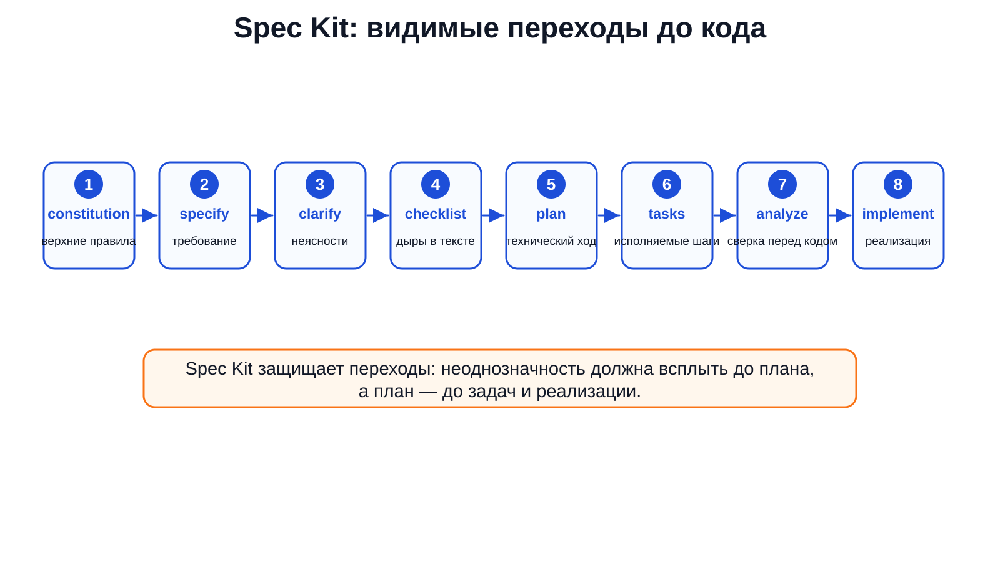
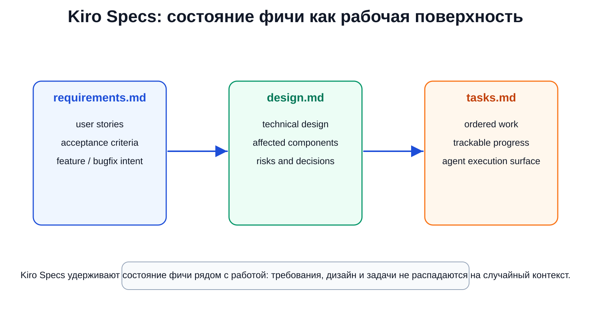
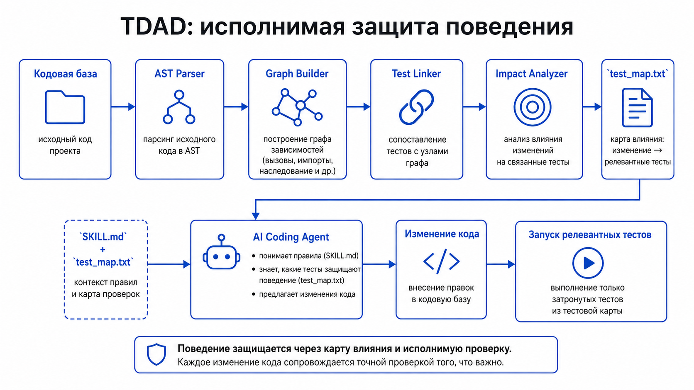
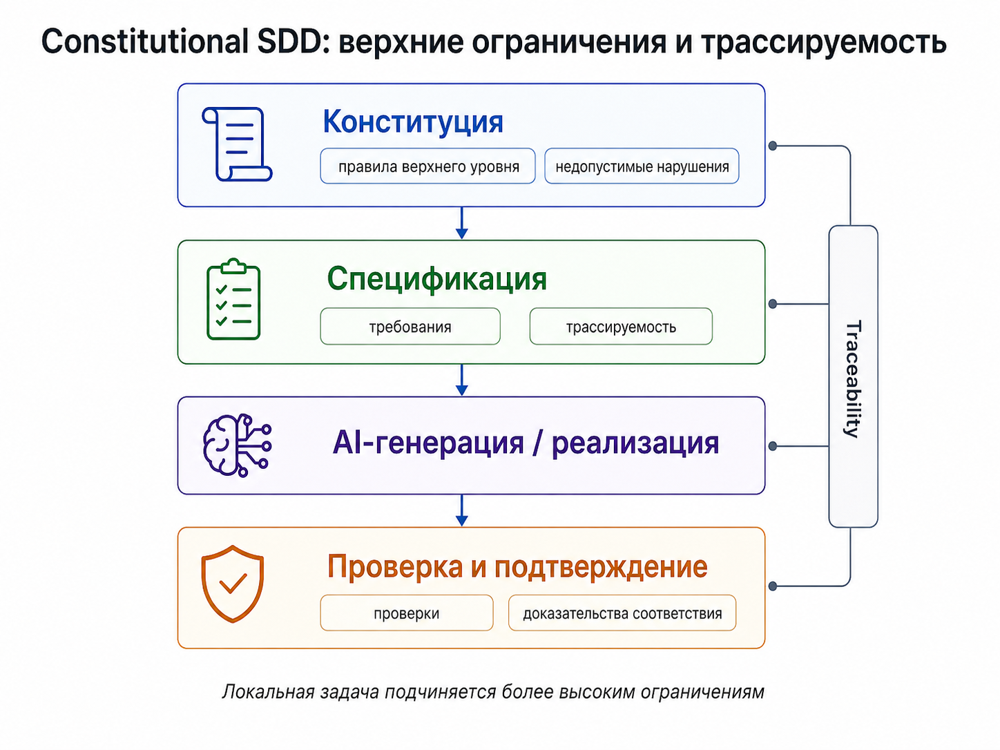
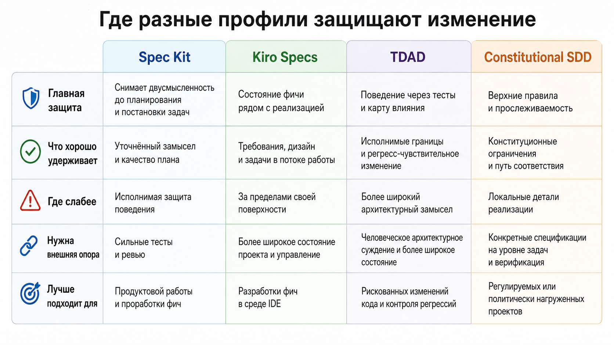

# V. Защищённые способы работы со спецификацией

## 1. Почему после SPDD нужна карта рабочих форм

В предыдущей главе SPDD был разобран как сильный вариант работы со спецификацией. Там важен не сам файл `spec.md`, а весь путь: намерение уточняется, превращается в план, раскладывается на задачи, сверяется с правилами проекта, проверяется перед реализацией и остаётся достаточно явным, чтобы к нему можно было вернуться после сессии агента.

Но из этого не следует, что у агентской разработки есть один правильный способ писать спецификацию. На практике изменения ломаются в разных местах.

Иногда агент слишком быстро прыгает от сырого пожелания к коду. Иногда требования, дизайн и задачи есть, но живут отдельно друг от друга и не удерживают текущую форму работы. Иногда важная часть требования выражена словами, хотя её давно пора превратить в проверяемое поведение. Иногда локальная задача каждый раз заново получает правила безопасности, совместимости или человеческого контроля — и агент начинает относиться к ним как к обычным пожеланиям, а не как к границам работы.

Поэтому дальше речь не о выборе лучшего инструмента. Речь о разных рабочих формах спецификации. Каждая из них защищает свою часть изменения: переход от намерения к плану, текущее состояние фичи, исполнимое поведение, правила выше отдельной задачи. Ни одна из них не обязана покрывать весь процесс. Хорошая форма должна честно отвечать на более узкий вопрос: какую ошибку она предотвращает и какие части работы оставляет другим слоям.

Это особенно важно в агентской разработке. Человек многое удерживает неформально: в памяти обсуждений, в привычках команды, в знании кода, в понимании того, «как у нас принято». Агенту это чаще приходится предъявлять явно. Если предъявить всё одним большим промптом, получится хрупкая инструкция. Если на каждую мелкую правку заводить полный набор документов, получится лишняя методология. Нормальная спецификационная форма находится между этими крайностями: она оформляет только то, что опасно оставлять неявным.

Рабочая спецификация — это не просто более длинный текст перед кодом. По ней можно вести изменение: запретить агенту лишнее действие, остановить его при неоднозначности, заранее назвать нужную проверку и сохранить эту опору для следующей итерации. Без этого `spec.md`, Canvas, список задач или тест могут выглядеть убедительно, но не менять поведение процесса.

## 2. Один пример для сравнения

Для сравнения возьмём одно конкретное изменение: в существующий SaaS добавляется годовой тариф. Через него удобно сравнить четыре способа работы со спецификацией: цепочку Spec Kit, состояние фичи в Kiro Specs, тестовое описание поведения и правила проекта верхнего уровня. Пользователь должен иметь возможность перейти с месячной оплаты на годовую. Система должна сделать пропорциональный перерасчёт уже оплаченного периода, показать понятное уведомление перед списанием, оставить аудиторскую запись и не сломать существующие интеграции, которые уже работают с месячными планами.

Снаружи это выглядит как обычная продуктовая доработка. Внутри быстро появляются вопросы.

Кому доступен годовой тариф? С какого дня начинается новый период? Как учитывать остаток уже оплаченного месяца? Что делать с промо-скидками, налогами, корпоративными контрактами? Как именно пользователь подтверждает списание? Что должно попасть в аудиторский след? Какие старые API-контракты и webhooks не имеют права измениться без миграции? Где агент может сам предложить реализацию, а где он обязан остановиться и вернуть решение человеку?

На таком изменении видно, что «спецификация» — не один объект. В одном случае нужно защитить переход от намерения к плану. В другом — удержать состояние фичи внутри среды разработки. В третьем — сделать часть требования исполнимой. В четвёртом — поднять правила безопасности и ответственности выше локального решения.

Сравнение держится на пяти вопросах.

Первый: что именно становится предметом спецификации — фича, требования, дизайн, задачи, тестируемое поведение, регрессионный маршрут, правило безопасности?

Второй: как намерение превращается в работу — через цепочку документов, через состояние внутри IDE, через тесты, через правила проекта верхнего уровня, через обязательную остановку для человека?

Третий: где процесс должен остановиться? Подтверждение требований, спорное архитектурное решение, финансовый риск, риск безопасности и обычное ревью — это разные остановки.

Четвёртый: что ограничивает генерацию — текст требований, план, задачи, тесты, проектные правила, существующий код, список затронутых проверок?

Пятый: что остаётся после агентской сессии? В хорошем процессе результатом является не только изменённый код. Должен остаться след: какие требования действовали, почему изменение сделано так, какие проверки были важны, какие решения нельзя незаметно переиграть в следующей сессии.

Эти вопросы важнее перечня инструментов. Один артефакт может хорошо удерживать требования и почти ничего не говорить о том, кто продолжает работу после обрыва. Другой точно задаёт проверяемое поведение, но не объясняет продуктовую мотивацию. Третий фиксирует правила безопасности, но не хранит состояние фичи. Поэтому сравниваются не «методики спецификации вообще», а то, на что агент должен опираться в следующем шаге.

В этом сравнении есть три общие опоры: один и тот же годовой тариф, разные места человеческой остановки и одна граница на выходе — документы могут быть готовы, но продолжение работы ещё не восстановлено. Поэтому подходы раскрываются не одинаково: один лучше показывает переход к плану, другой — состояние фичи, третий — исполнимое поведение, четвёртый — правила выше локальной задачи.

## 3. Spec Kit: не дать агенту сразу уйти в код

Первый способ — Spec Kit. Официальная документация описывает его как toolkit for Spec-Driven Development и формулирует базовую цепочку как `Spec → Plan → Tasks → Implement` (https://github.github.com/spec-kit/). Здесь существенны не количество команд и не интерфейс, а то, что Spec Kit делает подозрительным самый опасный скачок: пользователь сказал «добавь годовой тариф», агент сразу полез менять код.

Подход Spec Kit заставляет сначала превратить пожелание в явный предмет работы. Что такое годовой тариф? Для каких пользователей он доступен? Как он связан с текущими месячными планами? Какие сценарии должны остаться прежними? Какие данные появляются? Что считается успешным переходом?

После этого спецификация должна перейти в план. План уже отвечает на другой тип вопросов: какие части системы меняются, какие данные затронуты, какие API и фоновые процессы участвуют, какие риски нужно проверить. Затем план превращается в задачи. Задача — это уже не объяснение замысла, а ограниченный шаг, который агент может выполнить и который человек может проверить.

В официальном quickstart Spec Kit показан и короткий путь, и более полный путь для неоднозначных или производственных изменений: `constitution`, `specify`, `clarify`, `checklist`, `plan`, `tasks`, `analyze`, `implement` (https://github.github.com/spec-kit/quickstart.html). Существенна не сама последовательность команд, а ошибки, которые она отсекает.

В этом же месте появляется связь с правилами проекта. План не должен быть только технически правдоподобным; он должен проходить сверку с принципами, которые уже действуют в проекте. В шаблонах Spec Kit эта сверка вынесена в Constitution Check на стадии плана, до дальнейшего проектирования (https://github.com/github/spec-kit/blob/main/templates/plan-template.md). Для годового тарифа это простой, но важный барьер: даже хороший план не должен идти дальше, если он обходит аудит, совместимость или человеческое подтверждение финансового действия.

`clarify` нужен там, где агент иначе начнёт угадывать. В нашем примере нельзя молча придумать правило пропорционального перерасчёта. Если не решено, как считать переход с месячного тарифа на годовой, это надо вынести наружу до плана.

`checklist` нужен против аккуратного, но дырявого текста. Спецификация может выглядеть полной и всё равно не отвечать на важные вопросы: что делать с отменёнными подписками, как отображать годовую цену в разных валютах, где появляется аудиторская запись, какие старые контракты нельзя менять.

`plan` связывает требование с устройством системы. Для годового тарифа это может быть модель тарифного плана, расчёт счёта, пользовательский интерфейс, webhooks, админские события, отчётность.

`tasks` делают план исполнимым. Агент получает не размытую команду «сделай billing», а набор ограниченных шагов: добавить модель тарифа, изменить расчёт перехода, обновить предупреждение в интерфейсе, записать audit event, обновить проверки интеграций.

`analyze` полезен как остановка перед реализацией: не противоречат ли задачи требованиям, не исчезла ли обратная совместимость, не подменил ли план нерешённый продуктовый вопрос техническим предположением.

Рабочие цепочки важны по той же причине: документация описывает процесс, где команды, подсказки, скрипты и ручные остановки связываются в последовательность со статусом и возможностью продолжения (https://github.github.com/spec-kit/reference/workflows.html). Спецификация должна переживать не только один ответ агента, но и переход между шагами.

<figure class="image-asset" id="fig-v-speckit-workflow" data-asset-status="local_image_asset" data-repo-path="content/assets/theory-images/v-speckit-workflow.svg">
  
  <figcaption>Рисунок V-0. Spec Kit полезен тем, что делает переходы до кода явными: неоднозначность, чек-лист, план, задачи и анализ проходят как отдельные рабочие состояния, а не растворяются в одном запросе агенту. Локально синтезированная схема по документации Spec Kit.</figcaption>
</figure>

Сила этого подхода в том, что он делает переходы видимыми. Видимый переход можно остановить, проверить, переписать, передать другой сессии. Невидимый переход превращается в догадку модели.

Но Spec Kit не является всей памятью проекта. Он не хранит сам по себе историю всех решений, не заменяет архитектурный контекст, не решает, готов ли бизнес менять правила тарификации, не проводит полноценное ревью и не доказывает юридическую достаточность пользовательского уведомления. Он хорошо держит цепочку «спецификация — план — задачи — реализация». Это много, но не весь жизненный цикл изменения.

Отсюда практическое правило: подход Spec Kit особенно полезен там, где главная опасность — слишком ранняя реализация. Для маленькой обратимой правки полный путь может быть лишним. Для изменения, которое проходит через деньги, данные, интерфейс и интеграции, отсутствие такого пути быстро становится дорогим.

## 4. Kiro Specs: удержать состояние фичи рядом с работой

Второй способ похож на первый только внешне. Kiro Specs тоже работают с требованиями, дизайном и задачами. Но акцент другой: спецификация живёт как состояние фичи внутри среды разработки, а не просто как переносимая цепочка документов. В документации Kiro Specs описаны как структурированные артефакты для фич и исправлений; основными файлами названы `requirements.md` или `bugfix.md`, `design.md`, `tasks.md` (https://kiro.dev/docs/specs/).

<figure class="image-asset" id="fig-v-kiro-specs-surface" data-asset-status="local_image_asset" data-repo-path="content/assets/theory-images/v-kiro-specs-surface.svg">
  
  <figcaption>Рисунок V-0b. Kiro Specs показывают спецификацию как состояние фичи рядом с исполнением: требования, дизайн и задачи остаются связанной рабочей поверхностью, а не разрозненными фрагментами контекста. Локально синтезированная схема по документации Kiro Specs.</figcaption>
</figure>

Это важно потому, что агентская работа часто ломается не только на скачке от идеи к коду. Она ломается и на том, что текущая форма задачи распадается. Требования лежат в одном месте, дизайн — в другом, задачи — в третьем, а агент в следующем шаге работает не с целым состоянием, а с тем, что случайно попало в контекст.

Feature Specs в Kiro ведут от сбора требований к техническому дизайну и планированию реализации (https://kiro.dev/docs/specs/feature-specs/). Для годового тарифа это означает, что сначала появляется продуктовая форма задачи: пользовательские истории, критерии приёмки, ожидаемое поведение. Затем появляется дизайн: где хранится годовой план, какие компоненты меняются, как считается переход, как пишется аудит, какие интеграции остаются совместимыми. Потом это становится задачами, которые можно исполнять и отслеживать.

Bugfix Specs показывают, что такая форма нужна не только новым фичам. Документация описывает их через причину ошибки, дизайн исправления и защиту от регрессии (https://kiro.dev/docs/specs/bugfix-specs/). Представим, что после запуска годового тарифа обнаружилось: при переходе с месячного плана пользователь получает неправильный перерасчёт. Обычный агент может сразу полезть чинить формулу. Подход Bugfix Specs удерживает другой предмет работы: что именно сломалось, почему это произошло, как устроено исправление и какая проверка не даст ошибке вернуться.

Quick Plan в Kiro создаёт требования, дизайн и задачи за один проход (https://kiro.dev/docs/specs/quick-plan/). Это не обязательно плохо. Если задача давно понятна, решения приняты, риск мал, быстрый проход может быть разумным. Но для неоднозначного изменения он опасен: можно получить аккуратный план, внутри которого спрятаны выдуманные предположения. В случае годового тарифа это особенно вероятно, если не решены финансы, налоги, скидки, контракты или совместимость старых интеграций.

Analyze Requirements закрывает противоположную проблему. Документация описывает его как проверку противоречий, неоднозначностей, конфликтующих ограничений и неявных предположений до перехода к дизайну (https://kiro.dev/docs/specs/analyze-requirements/). Для нашего примера это ровно та остановка, которая должна спросить: не конфликтует ли скидка годового тарифа с корпоративными условиями; не предполагает ли интерфейс то, чего backend не умеет; не нарушает ли новый план старые webhook-контракты; не исчез ли из требований audit record.

Разница между Spec Kit и Kiro не в том, что один «про документы», а другой «про продукт». Такое противопоставление было бы слишком простым. Spec Kit здесь лучше виден как защита переходов между рабочими объектами. Kiro лучше виден как удержание состояния фичи внутри инструмента, рядом с кодом и исполнением.

Именно в этом сила подхода Kiro Specs: спецификация не лежит отдельно от работы, а сопровождает её. Но отсюда же возникает граница. Такая спецификация зависит от того, правильно ли среда понимает локальные соглашения проекта: где живут задачи, какие состояния считаются готовыми, какие документы обязательны, какие проверки нельзя пропускать. Если этот контекст неверен, требования, дизайн и задачи могут быть аккуратными и всё равно вести не туда.

Поэтому Kiro Specs не стоит смешивать со всей средой Kiro. Hooks, MCP, CLI, Web, агентские режимы и правила контекста важны, но это уже другая тема. Здесь Kiro нужен как пример того, как спецификация удерживает состояние задачи; вопрос о том, как весь проектный контекст становится интерфейсом агента, относится к следующей главе.

## 5. TDAD: сделать часть требования исполнимой

Третий способ меняет сам носитель спецификации. В Spec Kit и Kiro основная работа идёт через текстовые и структурные артефакты: требования, дизайн, план, задачи. TDAD показывает другой ход: часть требования можно превратить в исполнимое поведение.

Вокруг TDAD есть несколько разных линий. Test-Driven AI Agent Definition описывает определение агентов через behavioral specifications, visible and hidden tests, mutation testing and spec evolution (https://arxiv.org/abs/2603.08806). Другая линия, Test-Driven Agentic Development, связана с graph-based impact analysis для кодовых агентов и выбором затронутых тестов, чтобы снизить регрессии (https://arxiv.org/abs/2603.17973). Практический `tdad-skill` формулирует тот же рабочий нерв совсем коротко: найти затронутые тесты, запустить их, добавить регрессионный тест и не сдавать изменение без этого шага (https://raw.githubusercontent.com/pepealonso95/tdad-skill/main/SKILL.md).

Вопрос не в том, является ли TDAD единым зрелым методом. Для сравнения подходов важнее другое: тест может быть не только проверкой после реализации, но и носителем части спецификации.

В задаче про годовой тариф это видно лучше всего на расчётах и совместимости. Фраза «корректно пересчитать остаток оплаченного периода» почти ничего не защищает. Агент может вложить в «корректно» своё предположение. Человек может пропустить крайний случай при ревью. Следующая сессия может переписать billing logic и не понять, какой сценарий был принципиальным.

Тестовый подход делает часть смысла жёстче. Например:

- пользователь оплатил месячный тариф десять дней назад и переходит на годовой: система применяет заранее выбранное правило перерасчёта;
- у пользователя есть промо-скидка: переход не удваивает скидку и не теряет её без явного решения;
- старый webhook для monthly subscription продолжает работать после появления annual plan;
- audit event содержит старый план, новый план, момент изменения, инициатора и рассчитанную сумму;
- отмена перехода не меняет уже выставленный счёт.

Такие тесты не просто ловят баги. Они говорят агенту: вот поведение, которое нельзя свободно интерпретировать. Если оно должно измениться, нужно менять спецификацию, тест и решение, а не тихо переписывать код.

Вторая TDAD-линия добавляет ещё одну вещь: агенту нужен маршрут проверки. Для годового тарифа важны не все тесты продукта, а проверки расчёта, жизненного цикла подписки, выставления счетов, webhooks, аудиторских событий и обратной совместимости. Такой маршрут защищает от типичной ошибки: агент меняет код, запускает ближайшие unit tests и не замечает регрессию в соседнем контракте.

Но тестовый подход легко переоценить. Тесты хорошо держат наблюдаемое поведение, но плохо держат мотивировку, продуктовую рамку, юридический смысл, UX-тон, архитектурное право и политические границы решения. Тест может проверить, что audit event записан. Он не решит, достаточно ли этого аудита для реального процесса. Тест может проверить формулу. Он не ответит, должен ли бизнес вообще разрешать такой переход для конкретного сегмента пользователей.

Поэтому речь не о доказательствах качества. Тест важен здесь как форма спецификации: часть требования становится исполнимой и переживает агентскую сессию в более строгом виде, чем обычный текст. Вопросы о качестве тестов, скрытых проверках, coverage, oracle problem и доверии к результату должны быть разобраны позже, в главе о проверке.

<figure class="image-asset" id="fig-v-tdad-pipeline" data-asset-status="local_image_asset" data-repo-path="content/assets/theory-images/v-tdad-pipeline.png">
  
  <figcaption>Рисунок V-1. В линии TDAD важна не только формула “сначала тест”, а исполнимая карта влияния: изменение связывается с релевантными тестами и сопровождается точечной проверкой поведения. Локально синтезированная схема по мотивам <a href="https://arxiv.org/abs/2603.17973">Test-Driven Agentic Development</a> и <a href="https://raw.githubusercontent.com/pepealonso95/tdad-skill/main/SKILL.md">tdad-skill</a>.</figcaption>
</figure>

## 6. Constitutional SDD: правила выше локальной задачи

Четвёртый способ работает иначе. Spec Kit защищает переходы. Kiro удерживает состояние задачи. TDAD делает часть поведения исполнимой. Constitutional SDD показывает, что часть правил должна жить выше отдельной фичи: безопасность, аудит, приватность, совместимость, право человека остановить изменение или принять исключение.

Constitutional Spec-Driven Development описан как подход, в котором принципы безопасности и ограничения встраиваются в слой спецификации (https://arxiv.org/abs/2602.02584). В англоязычном названии используется слово `constitution`; в этой главе речь идёт не о политической метафоре, а о явном наборе правил проекта верхнего уровня. Статус этой линии нужно формулировать аккуратно: это не массовый промышленный стандарт, а исследовательско-демонстрационный подход. Но сама идея для агентской разработки важна.

В годовом тарифе есть решения, которые агент не должен воспринимать как обычные технические детали. Он не должен ослабить авторизацию, чтобы проще открыть endpoint смены тарифа. Он не должен убрать аудиторскую запись, потому что так быстрее. Он не должен изменить смысл пользовательского согласия на списание. Он не должен логировать платёжные данные в удобном для отладки виде. Он не должен обходить человеческое подтверждение, если изменение затрагивает финансовую политику или серьёзный регуляторный риск.

Если такие правила каждый раз находятся только в тексте задачи, они конкурируют с локальным намерением. Пользователь говорит: «добавь годовой тариф». Модель строит удобный план реализации. Всё, что мешает этому плану, начинает выглядеть как второстепенное ограничение. Подход через правила проекта верхнего уровня меняет статус таких ограничений: они стоят выше отдельной фичи.

`banking-ms-by-constitution` хорошо показывает форму: в репозитории есть `constitution.md` с security-first правилами (https://raw.githubusercontent.com/srinivasraom/banking-ms-by-constitution/001-banking-crud/.specify/memory/constitution.md), а также compliance report, связывающий правила с реализацией (https://raw.githubusercontent.com/srinivasraom/banking-ms-by-constitution/001-banking-crud/CONSTITUTION_COMPLIANCE.md). Это не доказательство зрелости метода, но хороший пример того, как правило получает отдельное место и связь с проверкой.

Для годового тарифа такой набор правил могла бы требовать:

- вся смена тарифного плана оставляет аудиторский след;
- финансовые условия явно показываются пользователю до списания;
- платёжные данные не пишутся в прикладные логи;
- изменение авторизации billing endpoints требует ручного ревью;
- публичные интеграции нельзя ломать без отдельного плана миграции;
- неоднозначность в расчёте денег не разрешается агентом молча.

Это не просто дополнительные требования. Это правила, которые ограничивают генерацию. Агент может предложить реализацию, но если реализация требует нарушить эти правила, правильное действие — остановиться и вынести конфликт наружу.

Граница здесь тоже жёсткая. Набор правил проекта легко превратить в ритуальный документ: правильные фразы есть, но никто не связывает их с задачами, кодом, тестами и ревью. Тогда появляется опасная иллюзия контроля. Само наличие файла с правилами ещё не означает, что система безопасна или действительно им следует.

Рабочим этот подход становится только при связке с трассировкой, проверками, ревью и реальными остановками. Поэтому Constitutional SDD не заменяет будущую главу о проверке и не отвечает на вопрос, кто имеет право принять спорное изменение. Он показывает более узкую вещь: некоторые правила спецификации должны стоять выше локальной задачи.

<figure class="image-asset" id="fig-v-constitutional-sdd-traceability" data-asset-status="local_image_asset" data-repo-path="content/assets/theory-images/v-constitutional-sdd-traceability.png">
  
  <figcaption>Рисунок V-2. Constitutional SDD полезен там, где локальная задача должна подчиняться более высоким ограничениям, а связь между правилами, спецификацией, реализацией и проверкой должна оставаться трассируемой. Локально синтезированная схема по мотивам <a href="https://arxiv.org/abs/2602.02584">Constitutional Spec-Driven Development</a>.</figcaption>
</figure>

Соседние материалы вроде Cisco Foundry Security Spec можно понимать как близкую тенденцию: спецификация и набор правил проекта могут быть самостоятельным результатом работы даже без кода (https://github.com/CiscoDevNet/foundry-security-spec). Этот источник подтверждает общую тенденцию, но остаётся периферийным: он не является Constitutional SDD в строгом смысле.

## 7. Где требуется решение человека

Сравнение будет неполным, если смотреть только на артефакты. В агентской разработке важно не просто вставить в процесс «ревью», а понять, какое решение человек должен принять и в какой момент.

В Spec Kit человеческая остановка стоит до того, как неопределённость превратилась в план. Человек отвечает на уточняющие вопросы, принимает или отклоняет трактовку требований, видит незакрытые пункты чек-листа и решает, можно ли переходить дальше. Если для годового тарифа не решено, как считать перерасчёт, это должно всплыть до задач и кода, а не после pull request вокруг выдуманного правила.

В подходе Kiro Specs человек принимает не только отдельный ответ, а текущую форму фичи. Пользовательские истории действительно описывают продуктовый смысл? Дизайн не противоречит ожиданиям команды? Эти задачи можно отдавать агенту? Quick Plan не слишком груб для такой доработки? Здесь проверяется не одна фраза, а то, что среда удерживает правильную форму изменения.

В подходе TDAD человек отвечает за смысл теста. Строгий тест может проверять не то. Поэтому решение не сводится к «тесты зелёные — принимаем». Нужно понять, какие сценарии действительно выражают требование, какие регрессии достаточно важны, где нужен независимый тест, а где тестовая форма слишком бедна для продуктового смысла.

В подходе через правила проекта верхнего уровня человек появляется при конфликте локальной задачи с правилом выше неё. Агент может предложить обойти старый webhook, ослабить авторизацию или сократить аудит ради простой реализации. Если это противоречит правилам проекта верхнего уровня, правильный исход — не тихий компромисс внутри кода, а явная остановка: либо меняется решение, либо человек берёт ответственность за исключение и оставляет след, почему оно допустимо.

Эти остановки стоят в разных местах. Spec Kit останавливает до плана. Kiro — на форме текущей фичи. TDAD — на смысле проверяемого поведения. Constitutional SDD — на конфликте с правилом. Если всё это назвать одним словом «ревью», различие потеряется, а сам подход будет казаться сильнее, чем он есть.

## 8. Способ работы выбирают по тому, где изменение может сломаться

Теперь видно, что четыре подхода не конкурируют напрямую.

<figure class="image-asset" id="fig-v-protected-specification-profiles-matrix" data-asset-status="local_image_asset" data-repo-path="content/assets/theory-images/v-protected-specification-profiles-matrix.png">
  
  <figcaption>Рисунок V-3. Профили защищают изменение в разных местах: один лучше снимает двусмысленность до кода, другой удерживает состояние фичи, третий делает часть поведения исполнимой, четвёртый поднимает над задачей верхние правила. Локально синтезированная сравнительная схема для главы V.</figcaption>
</figure>

Если главная опасность — ранний прыжок в код, нужен подход Spec Kit-типа. Он заставляет провести годовой тариф через явные состояния: спецификация, уточнение, чек-лист, план, задачи, анализ, реализация. Он не делает решения правильными автоматически, но показывает их до кода.

Если главная опасность — потеря текущего состояния фичи, нужен подход Kiro-типа. Он держит требования, дизайн и задачи рядом с работой. Он помогает не потерять связь между продуктовым смыслом, техническим решением и исполнением. Но он не равен всему проектному контексту.

Если главная опасность — поведение, которое нельзя оставить в прозе, нужен подход TDAD. Он переводит расчёт, совместимость, аудиторское событие и регрессионный маршрут в исполнимую форму. Но он не отвечает за весь смысл фичи.

Если главная опасность — нарушение правил выше локальной задачи, нужен подход через правила проекта верхнего уровня. Он защищает безопасность, аудит, приватность, совместимость и точки человеческого решения от растворения в текущей реализации. Но он работает только при связи с реальной проверкой и реальной ответственностью.

В одном проекте эти подходы могут сочетаться. Годовой тариф можно начать через Spec Kit-подобную цепочку, вести состояние фичи в Kiro-подобной среде, зафиксировать расчёты и совместимость тестами, а финансовые правила и правила безопасности держать в отдельном наборе правил проекта. Но сочетание не означает, что всё это нужно всегда. Для маленькой локальной и обратимой правки полный набор будет бюрократией. Для изменения, которое затрагивает деньги, данные, интеграции и долгоживущие правила, отказ от таких форм будет экономией на тормозах.

Практический контрвес к этому есть в story-материалах Matt Pocock (`content/stories/12_matt_pocock_skills_maximum_deep_reconstruction_connected.md`). Там повторяющийся сбой получает маленькую процедуру, а не превращается в общий фреймворк. Агент слишком рано пишет код — нужен уточняющий навык. Расползся доменный язык — нужен `CONTEXT.md`. Разговор пора сжать в переносимое намерение — появляется PRD. Работу нужно нарезать на проверяемые вертикальные срезы — появляется `/to-issues`. Тесты нельзя писать после реализации и подгонять под уже сделанный код — появляется `/tdd`.

Это не возражение против сильных способов работы со спецификацией, а ограничитель их применения. Маленький skill работает не потому, что он «лёгкий», а потому что ясно закрывает конкретный повторяющийся сбой. Если сбой маленький, достаточно маленькой процедуры. Если изменение затрагивает деньги, данные, интеграции и долгоживущие правила, маленькой процедуры уже недостаточно.

## 9. Что остаётся за пределами главы

Защищённый способ работы со спецификацией — полезная, но ограниченная вещь.

Он не равен persistent work graph. Он не хранит весь ход проекта, все открытые решения, все зависимости, все незавершённые ветки и весь долгосрочный контекст.

Он не равен процессу. У процесса есть роли, ритм, приёмка, восстановление после сбоя, эскалация, сопровождение.

Он не равен слою проверки. Спецификация и тест могут сказать, что должно быть проверено, но отдельно нужно понять, что именно проверено, насколько этому можно доверять и кто принимает результат.

Он не равен слою полномочий. Даже хорошая спецификация сама не отвечает, кто имеет право принять спорное изменение.

Граница такого способа работы со спецификацией такова: он помогает сделать часть изменения устойчивой. Он превращает неявное намерение в рабочий объект, но не отменяет остальные слои агентской разработки.

Самый опасный сбой на этом переходе выглядит не как отсутствие документов. Наоборот, документы могут быть на месте: `requirements.md`, `design.md`, `tasks.md`, тесты, правила проекта, чек-лист. Но после обрыва всё равно может быть непонятно, что реально готово, что ждёт человека, какая проверка уже относится к этому изменению, кто имеет право продолжать и можно ли другой сессии писать в тот же файл. Спецификация подготовила работу, но ещё не превратила её в долговечное рабочее состояние. Поэтому следующий слой не должен растягивать `spec.md` до трекера всего проекта. Ему нужен отдельный способ хранить продолжение: открытые блокировки, владельца, зависимости, след проверок, условия закрытия и короткий вход для следующего исполнителя.

Дальше начинается область, которую история HumanLayer описывает уже не как спецификацию, а как обвязку и контекст вокруг кодового агента (`content/stories/07_human_layer_agentic_harness_reconstruction_connected.md`). Спецификация говорит, что должно быть удержано в изменении. Обвязка проекта решает, как агент видит работу, инструменты, проверки, ограничения и текущее состояние.

Следующий вопрос шире: если спецификация уже есть, как агент получает рабочий контекст проекта? Какие файлы важны, какие правила действуют, где лежат решения, что считается текущим состоянием работы, как не потерять ход между сессиями? Это уже тема следующей главы.
