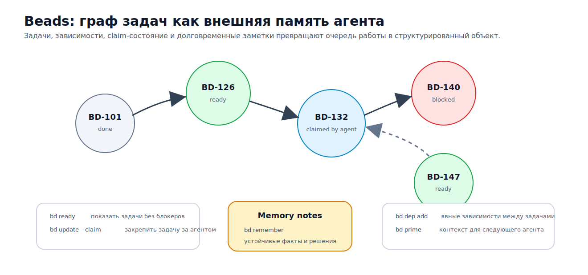

# A4. Persistent Work Graph: граница рабочего состояния

## Почему отчёт «сделано много» не является состоянием работы

Сессия оборвалась. В стенограмме осталось, что агент «сделал много», но это ещё не состояние работы. Нельзя быстро понять, что действительно завершено, что только начато, что проверено тестом или чтением источника, что заблокировано внешним событием, кто имеет право продолжать, где лежат написанные артефакты, какие источники уже перенесены в канонический текст, а где агент просто видел ссылку и ушёл дальше. В таком обрыве смешиваются разные остановки: техническая потеря контекста, незакрытое человеческое решение, ожидание ревью, CI, проверки цитаты, согласования формулировки или снятия конфликта между соседними ветками работы.

Такая проблема редко выглядит как один большой сбой. Чаще она накапливается малыми и почти незаметными нарушениями. Текст появляется раньше свидетельства. Статус `done` ставится до закрытия нужной точки ожидания. Два агента читают один источник и расходятся в перенесённом утверждении. Следующая сессия продолжает по устаревшему снимку, не зная, что соседний файл или тезис уже изменился. Человек должен принять решение, а агент подменяет это решение аккуратной формулировкой. Заметка об источнике остаётся в рабочей карте и не проходит синтез. Пока нет отдельного состояния работы, всё это выглядит как нормальная цена длинной агентной работы. Persistent Work Graph делает такие ситуации видимыми: их можно заблокировать, передать следующему исполнителю или вынести на восстановление.

## Что именно хранит PWG

PWG нужен как ответ на вопрос продолжения. Список задач отвечает на вопрос «что надо сделать?». Трекер задач показывает, что команда считает открытой работой. Среда исполнения знает, какой шаг уже прошёл. PWG отвечает иначе: что является честным продолжением этой работы после того, как текущий исполнитель исчез или потерял контекст. Поэтому его единица — не задача в отрыве, а переносимое состояние работы: адресуемое, проверяемое, зависимое от других состояний, имеющее владельца, барьеры, свидетельства, историю и компактный способ восстановления.

Этот слой расположен между разговором и организацией. Разговор хранит локальную траекторию внимания, но плохо хранит обязательства. Организация хранит роли, очереди и ответственность, но не обязана знать, какие источники агент уже открыл, какой фрагмент текста был синтезирован из каких доказательств и где возникла устаревшая зависимость. PWG удерживает середину: не весь «город» агентов, не весь репозиторий, не всю историю мышления, а минимальную проверяемую картину работы, без которой следующий агент или человек продолжает через угадывание.

Эта картина не сводится к схеме базы данных, но без явной формы она снова распадается на заметки. Узел должен отвечать на несколько практических вопросов: где границы работы, от чего она зависит, готова ли она к продолжению, кто её взял, какие ожидания ещё не сняты, какие артефакты и свидетельства уже есть, что изменилось по дороге, как передать узел и откуда его восстанавливать. В документной работе появляется ещё один вопрос — что произошло с источником. Ссылка могла быть только найдена, могла быть открыта и прочитана, могла быть использована в основном тексте, отвергнута с причиной или помечена как требующая повторного открытия. Всё это нужно не ради полноты модели, а чтобы следующий исполнитель видел, что можно делать сейчас, что делать нельзя, чем это подтверждено и кто имеет право принять следующее решение.

<figure class="image-asset" id="fig-a4-pwg-minimal-node">
  
  <figcaption>Beads даёт ближайший практический якорь для PWG: работа живёт не только в сообщении агента, а в графе задач, зависимостей, закреплений и памяти, которую можно перечитать следующей сессии.</figcaption>
</figure>

## Готовность, ожидания и владение

Чтобы эта граница не осталась абстрактной, полезно начать с привычной поверхности. Обычные трекеры задач уже содержат часть формы. GitHub позволяет помечать issue как blocked by или blocking, а Linear поддерживает отношения blocked, blocking, related и duplicate между issues ([GitHub issue dependencies](https://docs.github.com/en/issues/tracking-your-work-with-issues/using-issues/creating-issue-dependencies), [Linear issue relations](https://linear.app/docs/issue-relations)). Это важная исходная точка: зависимость перестала быть устной договорённостью. Но для PWG такой трекер остаётся внешней поверхностью. Он видит связь между работами, но обычно не знает, что именно агент прочитал, какая цитата уже перенесена, где произошло уплотнение контекста, какая передача работы достаточна для следующего исполнителя и какое ожидание является человеческим решением, а не техническим чекбоксом.

Ближе к PWG расположен Beads, но и он полезен здесь не как готовое определение, а как близкий инструментальный случай. Документация описывает его как трекер issues на Dolt для рабочих процессов программирования под наблюдением AI; среди базовых свойств названы идентификаторы на основе hash, хранилище на Dolt, выполнение с учётом зависимостей через `bd ready` и координация нескольких агентов ([Beads documentation](https://gastownhall.github.io/beads/)). Архитектурно Beads использует Dolt как единственное хранилище и источник истины, записи автоматически коммитятся в историю, а восстановление сводится к `pull` из удалённого хранилища или восстановлению резервной копии ([Beads architecture](https://gastownhall.github.io/beads/architecture)). Важна сама перестановка: состояние работы вынесено из чата в версионируемую базу, которую можно читать, синхронизировать, диагностировать и восстанавливать.

Beads при этом остаётся примером, а не границей понятия. В его основных понятиях есть `work item`, `status`, `priority`, `dependencies` и `blocking relationships`; готовая работа показывается через очередь `ready` ([Beads core concepts](https://gastownhall.github.io/beads/core-concepts)). PWG забирает отсюда не CLI-форму, а правило: готовность вычисляется из графа, а не из самооценки агента. Узел готов к продолжению только тогда, когда зависимости и ожидания это позволяют. Узел завершён только тогда, когда есть достаточное свидетельство, а не потому, что в чате появился уверенный отчёт.

<figure class="synthetic-figure" id="fig-a4-readiness-gate-owner">
  <figcaption>Готовность узла в PWG определяется не самоотчётом агента, а состоянием зависимостей, ожиданий, владения и свидетельств.</figcaption>
  <table>
    <thead><tr><th>Вопрос</th><th>Что должен знать граф</th><th>Почему одного отчёта агента мало</th></tr></thead>
    <tbody>
      <tr><td>Можно ли продолжать?</td><td>Зависимости закрыты, блокеры сняты, нужное ожидание снято.</td><td>Фраза «готово к следующему шагу» не показывает, что именно проверено.</td></tr>
      <tr><td>Кто имеет право писать?</td><td>Узел свободен, закреплён за исполнителем или ждёт передачи.</td><td>Параллельные агенты иначе легко создают дублирование и конфликтующие правки.</td></tr>
      <tr><td>Можно ли закрывать?</td><td>Есть проверяемое свидетельство: тест, diff, ревью, аудит источника или человеческое решение.</td><td>`done` без свидетельства превращает состояние работы в самооценку.</td></tr>
    </tbody>
  </table>
</figure>

Beads делает эту границу особенно явной через контрольные барьеры (`gates`): в его документации они описаны как асинхронные примитивы координации, которые блокируют продвижение шага до человеческого подтверждения, истечения таймера или внешнего события вроде GitHub PR/CI ([Beads gates](https://gastownhall.github.io/beads/workflows/gates)). В PWG это долговечная точка ожидания. Она должна хранить, чего именно ждём, кто может закрыть ожидание, как отличить тайм-аут от подтверждения, что делать при экстренном ручном обходе и какой артефакт становится допустимым после снятия ожидания. Без такого объекта агент легко имитирует прогресс: пишет следующий раздел, хотя источник не проверен, тест не прошёл или человек ещё не принял решение.

Владение защищает работу от другого класса сбоев. Beads показывает минимальную форму через pin и hook: работу можно закрепить за агентом и затем показать pinned work конкретному агенту ([Beads multi-agent coordination](https://gastownhall.github.io/beads/multi-agent)). В PWG владение нужно не для удобства распределения, а для честного параллелизма. Если узел свободен, его можно брать. Если он закреплён за исполнителем, другой агент не должен молча переписывать ту же область. Если владелец исчез, нужна передача работы или событие восстановления. Иначе параллельная работа создаёт дублирование, конфликтующие правки и необоснованную уверенность, что «кто-то этим занимается».

Вводную сводку, передачу работы и восстановление нельзя склеивать, потому что они работают в разные моменты. Компактный `prime` вводит исполнителя в текущее состояние работы. Передача работы переносит ответственность за конкретный узел: где была последняя валидная граница действия, что осталось незавершённым, какие проверки ожидаются, какие риски уже известны, на какие артефакты опираться и при каких условиях узел можно закрыть. Восстановление нужно, когда такой передачи не было или ей нельзя доверять. Оно восстанавливает состояние по истории, артефактам, точкам ожидания и свидетельствам, а затем помечает узел как устаревший, возвращённый в работу или требующий человеческого ревью. Очистка закрывает уже не «выполнение», а состояние после выполнения: переносит полезные промежуточные артефакты в постоянные места, удаляет устаревшие временные файлы, закрывает блокировки и оставляет компактный след для будущего аудита.

Beads даёт здесь полезный практический якорь: его интеграция с Claude Code устанавливает `SessionStart` hook и обновление после уплотнения контекста через `bd prime`; документация описывает, что при старте сессии `bd prime` подаёт примерно 1–2 тысячи токенов контекста, а перед уплотнением обновляет контекст рабочего процесса ([Beads Claude Code integration](https://gastownhall.github.io/beads/integrations/claude-code)). Для PWG это не обязательная реализация, а проверка качества: вводная сводка должна регулярно пересобираться из графа. Если она живёт отдельно, она быстро становится ещё одним резюме и начинает конкурировать с тем местом, где хранится состояние работы.

## Источник как часть состояния работы

Для теоретического письма это особенно важно. В программировании свидетельством часто является diff, тест или PR. В исследовательском тексте свидетельством может быть карта источников, таблица утверждений, список отвергнутых цитат, черновой фрагмент, аудит использования источников, кандидат фигуры или нерешённое напряжение. Работа об intermediate artifacts формулирует близкий общий тезис: финальные memo и аналитические тексты являются проекциями с потерями поверх предшествующего состояния, поэтому нужны долговечные, проверяемые, типизированные, версионируемые промежуточные артефакты с учётом зависимостей ([Intermediate Artifacts as First-Class Citizens](https://arxiv.org/abs/2605.12087)). PWG применяет этот тезис к рабочему состоянию: связывает такие артефакты с готовностью, владением, точками ожидания, передачей работы и восстановлением.

Источник в такой системе не может быть просто URL в заметке. «Найден» означает, что ссылка существует. «Открыт» — что документ был доступен. «Прочитан» — что содержательная часть рассмотрена. «Использован в основном тексте» — что конкретное утверждение перенесено в канонический фрагмент. «Отклонён» — что источник не подходит и указана причина. «Требует повторного открытия» — что ссылку видели, но утверждение нельзя честно удерживать без новой проверки. Такая линия снижает две типичные ошибки: агент повторно читает уже обработанное или, наоборот, пишет с уверенностью, будто источник был использован, хотя он был только найден.

<figure class="synthetic-figure" id="fig-a4-source-state-machine">
  <figcaption>Для документной работы источник должен иметь состояние, иначе ссылка начинает выглядеть убедительнее, чем заслуживает.</figcaption>
  <table>
    <thead><tr><th>Состояние источника</th><th>Что оно означает</th><th>Что можно делать дальше</th></tr></thead>
    <tbody>
      <tr><td>Найден</td><td>Ссылка или название есть, но содержательная часть ещё не проверена.</td><td>Нельзя строить утверждение как будто источник уже прочитан.</td></tr>
      <tr><td>Прочитан</td><td>Существенный фрагмент рассмотрен и может быть связан с тезисом.</td><td>Можно добавить утверждение в рабочую карту, но не считать его перенесённым.</td></tr>
      <tr><td>Использован</td><td>Конкретное утверждение попало в основной текст с указанием происхождения.</td><td>Можно проверять цитирование и дублирование.</td></tr>
      <tr><td>Отклонён или требует повторного открытия</td><td>Источник не подходит, устарел, недоступен или был открыт слишком поверхностно.</td><td>Нужно указать причину и не использовать его как подтверждение.</td></tr>
    </tbody>
  </table>
</figure>

Параллельное исследование усиливает это требование. Anthropic в описании своей multi-agent research system показывает, что исследовательские задачи хорошо распараллеливаются, когда ведущий агент делегирует subagents независимые направления и затем собирает результат; там же отмечено, что многоагентные системы расходуют примерно в 15 раз больше токенов, чем обычные чат-взаимодействия, и хуже подходят для задач с сильными зависимостями, включая многие задачи программирования ([Anthropic multi-agent research system](https://www.anthropic.com/engineering/multi-agent-research-system)). PWG добавляет к этому паттерну рабочую поверхность: срез источников, снимок чтения, пакет свидетельств, аудит цитирования, блокировку канонического текста и проход синтеза. Ведущий агент должен получать не просто текстовое резюме, а проверяемый пакет, который можно встроить без потери происхождения материала.

## Границы: трекер, исполнение, общее состояние, организация

После линии состояния источников появляется другая возможная путаница: кажется, что PWG можно заменить долговечным исполнением. Эти системы решают соседнюю задачу. LangGraph сохраняет состояние графа через checkpoints в threads и использует persistence для human-in-the-loop, памяти, возврата во времени и отказоустойчивого исполнения ([LangGraph persistence](https://docs.langchain.com/oss/python/langgraph/persistence)). Temporal показывает human-in-the-loop через signal, который доставляет человеческое решение в ожидающий workflow ([Temporal human-in-the-loop](https://docs.temporal.io/ai-cookbook/human-in-the-loop-python)). DBOS описывает восстановление workflow с последнего завершённого шага через checkpoints в Postgres ([DBOS why](https://docs.dbos.dev/why-dbos)). Restate объясняет durable execution как журналирование шагов и результатов, повторное проигрывание журнала и пропуск уже завершённых шагов при отказе ([Restate key concepts](https://docs.restate.dev/foundations/key-concepts)). Эти системы помогают продолжить выполнение функции или графа после отказа. PWG хранит другое: какая работа существует, почему она готова или заблокирована, кто её ведёт, какие артефакты доказывают состояние и где нужно внешнее суждение. Исполнение может быть долговечным, а рабочее состояние всё равно может оставаться невнятным.

Поэтому граф исполнения и граф работы могут взаимодействовать, но у них разные полномочия. Среда исполнения отвечает за порядок выполнения и повторный запуск шагов. PWG отвечает за продолжение работы. Узел исполнения знает, что workflow прошёл проверку источника. Узел PWG должен знать, что итоговая цитата ещё не перенесена в основной текст, что синтез заблокирован человеческим решением, что соседним фрагментом владеет другой агент, а очистка должна удалить временную карту после переноса.

Нижняя граница проходит через CRDT и инструменты управления состоянием. CodeCRDT предлагает паттерн координации, где агенты наблюдают общее состояние и получают детерминированную сходимость; оценка показывает компромисс: до 21.1% ускорения на одних задачах, до 39.4% замедления на других и долю семантических конфликтов 5–10% ([CodeCRDT](https://arxiv.org/abs/2510.18893)). STORM формулирует локальную согласованность состояния: запись допустима только если целевой файл и прочитанные зависимости не изменились; при устаревшей зависимости запись отклоняется, а агент повторяет попытку от текущей исходной точки ([STORM](https://arxiv.org/html/2605.20563v1)). Эти механизмы важны для общего рабочего пространства, но они не закрывают PWG. Сходимость файла не означает сходимость смысла; отсутствие устаревшей зависимости на уровне версии файла не доказывает, что источник правильно истолкован или что человеческое ожидание закрыто.

Task Master занимает промежуточное место между планированием и исполнением. Его документация описывает поля задач в `tasks.json`: id, title, status, dependencies, priority, details, testStrategy, subtasks и metadata ([Task Master task structure](https://docs.task-master.dev/capabilities/task-structure)); команда clusters находит кластеры исполнения по графу зависимостей и может запускать сессии Claude Code для параллельного выполнения задач ([Task Master clusters](https://docs.task-master.dev/capabilities/clusters)). Это полезная форма, особенно когда PRD раскладывается в задачи и подзадачи. Но для PWG её недостаточно без свидетельств, точек ожидания, состояния источников, блокировок записи, передачи работы, восстановления и правил полномочий. Иначе граф показывает план, но не гарантирует, что текущая картина работы переживёт уплотнение контекста или смену агента.

<figure class="synthetic-figure" id="fig-a4-boundary-map">
  <figcaption>PWG находится между трекером задач, средой исполнения, механизмами общего состояния и организационной средой: он не заменяет их, а хранит проверяемое состояние работы, которое должно пережить смену исполнителя.</figcaption>
  <table>
    <thead><tr><th>Соседний слой</th><th>Что он хорошо делает</th><th>Что остаётся за PWG</th></tr></thead>
    <tbody>
      <tr><td>GitHub / Linear</td><td>Видимые issues, связи, приоритеты, проектные представления.</td><td>Состояние источников, свидетельства, человеческие решения, передача работы.</td></tr>
      <tr><td>Task Master</td><td>Декомпозиция задач, зависимости, подсказка для агентного исполнения.</td><td>Проверка, что выполненная работа действительно продолжима и закрыта свидетельством.</td></tr>
      <tr><td>LangGraph / Temporal / DBOS / Restate</td><td>Возобновление исполнения, журналирование, повторный запуск шагов.</td><td>Полномочия, владение, точки ожидания, происхождение данных и граница завершения.</td></tr>
      <tr><td>CRDT / STORM-подобный посредник</td><td>Согласование файлового или редакторского состояния, защита от устаревшей записи.</td><td>Смысловая проверка: правильно ли понят источник и можно ли закрывать узел.</td></tr>
      <tr><td>Gas Town</td><td>Организация множества агентов, ролей и рабочих пространств.</td><td>Минимальный переносимый механизм состояния отдельной работы внутри такой среды.</td></tr>
    </tbody>
  </table>
</figure>

CRDT и STORM-подобные посредники уменьшают технические конфликты и заставляют агента перечитать изменившуюся исходную точку; PWG решает, подтверждено ли утверждение источником, прошёл ли фрагмент ожидание синтеза, не нарушено ли владение другого узла и можно ли закрывать работу. Gas Town находится выше: его публичный glossary описывает среду для управления несколькими экземплярами Claude Code через `gt` и `bd`, с уровнями Town/Rig и ролями вроде Mayor, Deacon, Polecat, Refinery и Witness ([Gas Town glossary](https://github.com/gastownhall/gastown/blob/main/docs/glossary.md)). PWG внутри такой среды остаётся переносимым механизмом рабочего состояния, а не расширяется до всей организации.

Эта граница защищает механизм от категориальной ошибки. Если PWG свести к трекеру задач, из него исчезают журнал источников, свидетельства завершения и восстановление после обрыва. Если свести к графу исполнения, теряются владение и полномочия. Если свести к редактору совместной работы, исчезают точки ожидания и человеческие решения. Если расширить до полной организационной среды, он разрастается до Gas Town и перестаёт быть минимальным переносимым механизмом.

## Где PWG сам может сломаться

PWG не становится полезным автоматически. Самый заметный провал — имитация графа: поля заполнены, но не управляют состояниями готовности, блокировки и закрытия. Рядом стоит устаревший граф: реальная работа изменилась, а записи остались прежними. Преждевременное закрытие появляется, когда узел закрыт без свидетельства или без снятого ожидания. Ошибка полномочий возникает, когда агент меняет поле, которое должен закрывать человек или внешний тест. Есть и более тонкая ловушка: система предотвратила конфликт файлов и тем самым создала ощущение, будто смысл тоже согласован. Для документной работы это особенно опасно: источник прочитан, но его утверждение не попало в канонический текст и осталось в промежуточной карте как будущая ошибка.

Эти риски не отменяют PWG; они показывают, что он должен быть рабочим контрактом, который читается и обновляется, а не пассивной документацией. В общей теории PWG меняет единицу агентной работы с промпта, сессии и выходного результата на долговечное состояние работы. Жизненный цикл узла поэтому выглядит не как `open → done`, а как: обнаружен и очерчен → заблокирован или готов → взят в работу → активен → ждёт контрольного барьера или ревью → завершён со свидетельством → очищен или архивирован. Конкретная реализация может отличаться, но если убрать владение, точки ожидания, свидетельства, передачу работы, восстановление или очистку, механизм возвращается к плану задач.

Сессия может оборваться, контекст может быть уплотнён, агент может быть заменён, источник может устареть, тест может стать нестабильным, человек может задержать подтверждение. Работа остаётся продолжимой только если существует граф, в котором видно, что именно продолжать, что нельзя трогать, кто владеет узлом, какие ожидания ещё не сняты, какие артефакты доказывают завершение и какая вводная сводка вводит следующего исполнителя в текущее состояние. Без этого агентная разработка и агентное письмо возвращаются к самому слабому носителю памяти — уверенной фразе в чате, что «сделано много».
