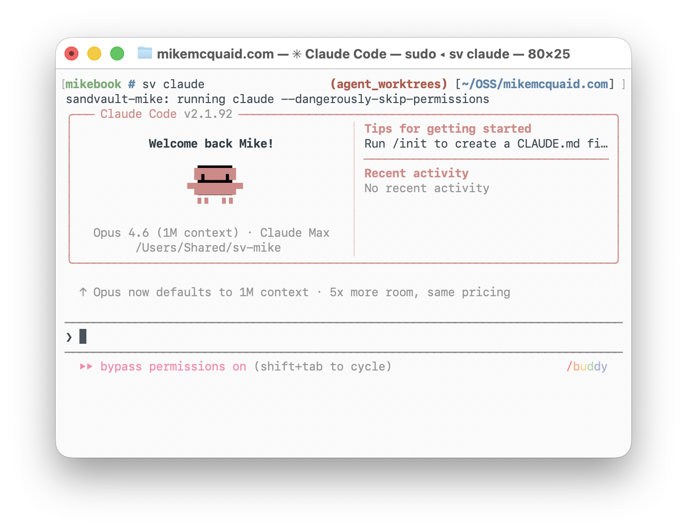
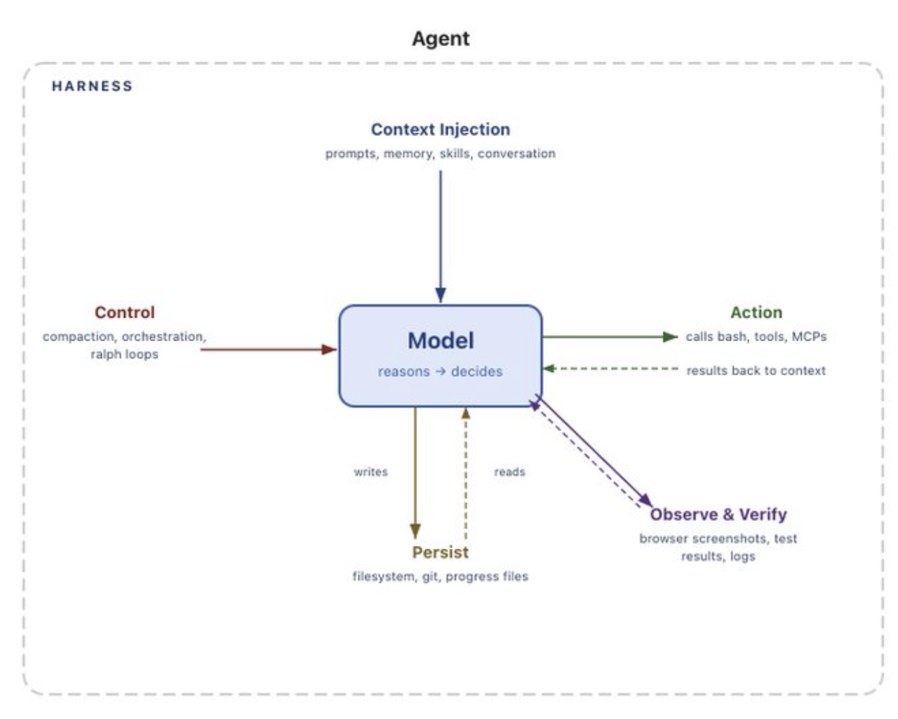

# A6. Среда исполнения агента — это несколько разных слоёв

Когда в агентской разработке говорят “среда агента”, под это слово легко попадает всё подряд: песочница, `CLAUDE.md`, MCP, браузер, логи, рабочие деревья, файлы рабочих процессов, devbox, CI и ревью. Для разговора это терпимо, но для теории опасно. Эти вещи отвечают на разные инженерные вопросы. Где агент имеет право действовать и какой ущерб заранее ограничен? Что он видит и какие действия может вызвать? Кто удерживает порядок шагов, повтор, восстановление и состояние запуска? Через какую платформенную поверхность результат попадает к людям, CI, ревью и правилам принятия? Пока всё это называется одной “средой”, легко построить один слой и ждать от него свойств другого.

<figure class="source-figure synthetic-figure" id="fig-a6-agent-environment-four-layers">
  <pre><code>граница исполнения           → где и с какими правами агент действует
инструментальная поверхность → что он видит и какие действия вызывает
движок рабочего процесса     → кто держит порядок, повтор и восстановление
платформенный агент          → как результат попадает в CI, PR, ревью и правила принятия</code></pre>
  <figcaption>Четыре разные обязанности, которые часто смешивают под словом “среда”. Один пример может занимать несколько слоёв, поэтому механизм нужно оценивать по вопросу, который он решает.</figcaption>
</figure>

## Граница исполнения: где агент имеет право действовать

Сначала нужно отделить границу исполнения. Она не делает агента умнее и не задаёт рабочий процесс; она ограничивает место и права действия. У Mike McQuaid Sandvault запускает агентов в отдельной учётной записи macOS и дополнительно ограничивает их через `sandbox-exec`. Его модель безопасности разводит доступную для записи общую рабочую область `/Users/Shared/sv-$USER`, домашнюю директорию пользователя песочницы, системные директории только для чтения и запрет доступа к домашней директории основного пользователя, системным файлам и смонтированным дискам ([Mike McQuaid, “Sandboxes and Worktrees”](https://mikemcquaid.com/sandboxed-agent-worktrees-my-coding-and-ai-setup-in-2026/), [Sandvault repository](https://github.com/webcoyote/sandvault)). Claude Code и Codex показывают соседний вариант той же границы: Git worktree отделяет параллельную запись в файлы, а Codex Handoff переносит работу через Git-операции между локальным контекстом переднего плана и фоновым рабочим деревом ([Git worktree documentation](https://git-scm.com/docs/git-worktree), [Claude Code worktrees](https://code.claude.com/docs/en/worktrees), [Codex Worktrees](https://developers.openai.com/codex/app/worktrees)).

Рабочее дерево полезно именно как граница, но из него нельзя вывести порядок работы. Оно помогает получить изолированный diff, однако не решает, какой план достаточен, какие тесты относятся к изменению, где заканчивается исследование и кто имеет право принять результат. Новое рабочее дерево само нужно поднять: `.env`, неотслеживаемые файлы, зависимости и сервер разработки часто живут вне Git, поэтому проверка иногда возвращается через Handoff в локальный контекст. Devbox в Stripe похожа на ту же идею в более тяжёлом масштабе. Курируемая публичная стенограмма доклада Mark Doyle описывает удалённые среды разработки для Minions как машины с оболочкой, файловой системой, инструментами, 64–128 GB RAM и собственным изолированным местом работы в большом монорепозитории ([AI Engineer Singapore, Mark Doyle / Stripe transcript](https://aie-sg-day1.vercel.app/)). Но devbox, как и рабочее дерево, отвечает прежде всего на вопрос “где и с какими правами действует агент”. Она не превращает сырой сигнал из Slack в корректный PR.

<figure class="image-asset" id="fig-a6-sandvault-separate-user-worktrees">
  
  <figcaption>Sandvault показывает границу исполнения как практический механизм: отдельный пользователь, sandbox и wrapper ограничивают права агентского запуска до того, как начинается вопрос качества результата.</figcaption>
</figure>

## Инструментальная поверхность: что агент видит и вызывает

После границы исполнения идёт инструментальная и наблюдательная поверхность: командная строка, логи, браузер, база данных, MCP, локальные скрипты, поиск по коду и вывод тестов. Здесь важен уже не адрес, где агент работает, а качество его контакта с системой. HumanLayer формулирует это как `coding agent = AI model(s) + harness`: результат зависит не только от модели, но и от контекстных файлов, навыков, MCP-серверов, подагентов, хуков и обратного давления ([HumanLayer, “Skill Issue”](https://www.humanlayer.dev/blog/skill-issue-harness-engineering-for-coding-agents)). У Armin Ronacher та же мысль превращается в простые рабочие требования: `make dev` должен дать агенту понятный сигнал, `make tail-log` — доступ к логам, ссылку из отладочного письма можно вывести в `stdout`, а временный Playwright-скрипт помогает завершить браузерный сценарий без ручной пересылки ссылки ([Ronacher, “Agentic Coding Recommendations”](https://lucumr.pocoo.org/2025/6/12/agentic-coding/)). Sandvault показывает, что такая поверхность может проходить через границу песочницы: браузер и iOS Simulator остаются на стороне хоста, а изолированный агент обращается к ним через `SV_BROWSER_ENDPOINT` и `SV_IOS_SIMULATOR_ENDPOINT` ([Sandvault repository](https://github.com/webcoyote/sandvault)).

Наблюдение всё равно не равно завершению. Лог сообщает, что произошло, но не доказывает правильность изменения. Браузер даёт картинку поведения, но не закрывает приёмку. MCP расширяет доступ, но вместе с доступом добавляет текст и команды, которым агент вынужден доверять. HumanLayer предупреждает, что описания MCP-инструментов попадают в системный контекст и могут стать каналом внедрения инструкций; Quix приводит практический замер, где описания MCP-инструментов занимали 34% контекста Claude Code ещё до начала работы ([HumanLayer, “Skill Issue”](https://www.humanlayer.dev/blog/skill-issue-harness-engineering-for-coding-agents), [Quix, “Claude Code wouldn’t behave…”](https://quix.io/blog/claude-code-wouldnt-behave-so-i-built-a-workflow-engine-to-tame-it)). Поэтому Ronacher часто предпочитает обычный программируемый интерфейс — оболочку, `jq`, маленький Python-скрипт или код, который агент может прочитать и починить, — большому каталогу MCP-инструментов ([Ronacher, “Your MCP Doesn’t Need 30 Tools”](https://lucumr.pocoo.org/2025/8/18/code-mcps/)). Pi продолжает ту же линию в минимальной локальной обвязке: цикл агента, расширения, дерево сессий и документы сжатия остаются управляемой поверхностью разработчика, а не корпоративной платформой ([Ronacher, “Pi: The Minimal Agent Within OpenClaw”](https://lucumr.pocoo.org/2026/1/31/pi/), [Pi README](https://github.com/earendil-works/pi), [Pi compaction docs](https://github.com/earendil-works/pi/blob/main/packages/coding-agent/docs/compaction.md)).

<figure class="image-asset" id="fig-a6-humanlayer-harness-components">
  
  <figcaption>HumanLayer показывает harness как набор компонентов вокруг модели: контекст, инструменты, проверки, подагенты и обратное давление. Это инструментальная среда работы агента, а не доказательство, что изменение уже можно принять.</figcaption>
</figure>

## Движок рабочего процесса: порядок, повтор и восстановление

Третий слой появляется тогда, когда порядок действий уже нельзя держать в надежде, что модель “помнит процесс”. Нужен исполняемый рабочий процесс: структурированный запуск, повтор, повторное воспроизведение, возобновление, наблюдаемость и восстановление. Shopify Roast хорошо показывает эту границу. Shopify описывает Roast как структурированные ИИ-рабочие процессы, где недетерминированные ИИ-шаги перемежаются с обычным кодом и проверками; внутренний Boba сначала детерминированно чистит код и запускает Sorbet autocorrect, а затем отдаёт остаточные ошибки `CodingAgent` ([Shopify Engineering, “Introducing Roast”](https://shopify.engineering/introducing-roast)). Текущий README выражает ту же идею через Ruby DSL из узлов cogs: `cmd(:recent_changes)` получает список файлов из `git diff`, `agent(:review)` делает ревью, `chat(:summary)` пересказывает результат, рядом стоят `ruby`, `map`, `repeat`, `call`, а `agent` запускает локальные CLI-провайдеры агентов — по умолчанию `:claude`, но также `:pi` ([Shopify/roast README](https://github.com/Shopify/roast/blob/main/README.md)). В такой конструкции `agent` — один узел исполняемого процесса, а не вся система. Механика `repeat`, `break!`, `next!`, `outputs` и повторного воспроизведения сессии показывает, что повтор и восстановление становятся управляющим потоком, а не ещё одной репликой в чате ([Roast iterative workflows tutorial](https://github.com/Shopify/roast/blob/main/tutorial/08_iterative_workflows/README.md)).

Quix / Klaus Kode даёт тот же урок на интеграционной задаче. Claude Code хорошо решал локальные фрагменты, но путал порядок: документация, выбор коннектора, генерация файлов, переменные окружения и зависимости, загрузка в облачную песочницу, запуск, логи, диагностика и развёртывание должны идти в заранее известной последовательности. Ответом стал не более длинный запрос и не расширенный набор MCP-инструментов, а Python-слой, который вызывает Claude Code через SDK для узкой задачи, затем сам загружает код, переменные и зависимости в песочницу, запускает приложение и забирает логи. Разные фазы могут использовать свежие сессии Claude без длинной истории ([Quix, “Claude Code wouldn’t behave…”](https://quix.io/blog/claude-code-wouldnt-behave-so-i-built-a-workflow-engine-to-tame-it)). Публичный репозиторий подтверждает это как структуру: `WorkflowFactory` регистрирует фазы Source, Sink, Diagnose, Deployment и Monitoring, а `WorkflowContext` разнесён на контексты `workspace`, `technology`, `schema`, `code_generation`, `deployment` и `credentials` с JSON-сериализацией ([workflow_factory.py](https://github.com/quixio/klaus-kode-agentic-integrator/blob/main/workflow_tools/workflow_factory.py), [contexts.py](https://github.com/quixio/klaus-kode-agentic-integrator/blob/main/workflow_tools/contexts.py)). Сам автор ограничивает пример конкретным сценарием применения и платформой запуска кода, поэтому в A6 он остаётся машиной состояний вокруг агента, а не корпоративной платформой.

Движок рабочего процесса делает порядок шагов исполняемым, ограничивает повторы, сохраняет состояние запуска и позволяет восстановиться после сбоя. Но он не присваивает себе право принять изменение. Roast может собрать отчёт, пройти `repeat`, сохранить сессию и показать вывод; Klaus Kode может довести интеграционный рабочий процесс до запуска в песочнице и отладки. После этого всё равно нужен внешний слой, который решает, достаточно ли результата как продуктовой работы, PR, миграции или эксплуатационного изменения.

<figure class="source-figure synthetic-figure" id="fig-a6-agent-as-node-not-system">
  <pre><code>Roast workflow
`cmd` → `agent(:claude | :pi)` → `chat` → `repeat`

Quix / Klaus Kode
Source / Sink / Diagnose → узкая задача для Claude Code → загрузка / запуск / логи

Stripe Minion
анализ контекста → devbox → кодирование → проверки / судья / диагностика → PR-кандидат</code></pre>
  <figcaption>В этих примерах агентский шаг находится внутри более широкой машины работы. Он пишет, проверяет или диагностирует, но не совпадает со всем процессом и не получает право сам принять результат.</figcaption>
</figure>

## Платформенный агент: путь результата к компании

Этот внешний слой удобнее называть платформенным агентом. Здесь агент встраивается в платформу разработки компании: канал Slack, devbox, анализатор контекста, внутренний поиск, правила с областью действия, проверки, PR-шаблоны, владение кодом и ревью. Stripe Minions поэтому плохо описываются как “ещё одна обвязка Claude Code”. В публичном описании Minion производит PR за один проход, но этот режим держится на devbox, blueprint-описании, контексте и инструментах с заданной областью действия, проверках, диагностической обратной связи и человеческом ревью ([Stripe Minions Part 1](https://stripe.dev/blog/minions-stripes-one-shot-end-to-end-coding-agents), [Stripe Minions Part 2](https://stripe.dev/blog/minions-stripes-one-shot-end-to-end-coding-agents-part-2)). В докладе Doyle платформа становится явной: анализатор собирает поток Slack, тикет, PR или иной исходный контекст; devbox даёт файловую систему и оболочку; цикл запускает агента, который пишет код, затем lint, тесты и проверку типов, затем LLM-судью с исходным запросом и текущим diff; при сбое диагностический агент возвращает короткий контекст в цикл, а при успехе создаётся PR и в Slack возвращаются краткое резюме и ссылка на изменения ([AI Engineer Singapore, Mark Doyle / Stripe transcript](https://aie-sg-day1.vercel.app/)).

У платформенного агента главный вопрос уже не в том, может ли модель выполнить команду. Важнее, какой пакет получает человек на выходе: diff, PR-описание, статус проверок, способ войти в devbox, чтобы перехватить работу, и коммуникационный канал, через который инженер возвращается к задаче. Цикл не завершается только потому, что рабочий агент сказал “готово”; неудача уходит в диагностическую ветку или к человеку. Из доступных публичных материалов о Minions и доклада Doyle видно, как выбранная задача доходит до PR и ревью. Для другого вывода эти источники слабее: по ним нельзя построить устойчивую картину отбраковки, времени ревью и дефектов после слияния ([Stripe Minions Part 1](https://stripe.dev/blog/minions-stripes-one-shot-end-to-end-coding-agents), [Stripe Minions Part 2](https://stripe.dev/blog/minions-stripes-one-shot-end-to-end-coding-agents-part-2), [AI Engineer Singapore, Mark Doyle / Stripe transcript](https://aie-sg-day1.vercel.app/), [Stripe Sessions Developer Keynote](https://stripe.com/sessions/2026/developer-keynote)). Поэтому Stripe в A6 работает как пример платформенного слоя, а не как оценка качества автономии. Платформенный агент снижает цену запуска и доводит выбранные задачи до PR; он не превращает PR в автоматическое доказательство правильности.

## Одна история может жить в разных слоях

Одна и та же история-якорь может оказаться в разных местах этой схемы. Stripe devbox внизу — граница исполнения, а вверху — часть платформенного пути к PR и ревью. Sandvault как отдельный пользователь и `sandbox-exec` — граница прав, а конечные точки для браузера и iOS — сенсоры внутри этой границы. У Ronacher `make tail-log` и Playwright относятся к наблюдательной поверхности, а Pi с `Read`/`Write`/`Edit`/`Bash`, расширениями и деревьями сессий — к минимальной локальной обвязке, не к платформе компании. Roast `repeat`, Boba, `CodingAgent` и повторное воспроизведение сессии — механика рабочего процесса, а не право принять результат. История не является категорией; категорию задаёт вопрос, который решает механизм. Поэтому A6 не является шкалой зрелости или каталогом продуктов. Это способ проверить, какую обязанность несёт конкретный механизм в агентской работе.

<figure class="source-figure synthetic-figure" id="fig-a6-same-story-different-layer-matrix">
  <pre><code>история / пример   граница исполнения        инструменты и наблюдение       рабочий процесс             платформа
Stripe Minions    devbox / удалённая среда   проверки, diff, контекст судьи  диагностический цикл      PR + ревью
Sandvault         macOS user + sandbox       browser/iOS-точки доступа       локальная командная обвязка  передача работы
Ronacher / Pi     локальная обвязка          логи, скрипты, extensions     дерево сессий / сжатие    рабочий процесс разработчика
Shopify Roast     место провайдера          cmd/agent/chat/ruby cogs      повтор / replay / batch    отчёт или материал для PR</code></pre>
  <figcaption>Одна история может поддерживать разные слои, если в каждом месте ясно, какой вопрос решает механизм.</figcaption>
</figure>

## Проверка слоя вместо списка инструментов

Практический вывод для SDLC с ИИ-агентами лучше формулировать не как список инструментов, а как проверку слоя. Риск доступа к файлам и секретам требует границы исполнения: песочницы, отдельного пользователя, devbox, рабочего дерева, прав и подтверждений. Слепота агента к системе требует инструментальной и наблюдательной поверхности: логов, команд, браузера, MCP, локальных скриптов и контекстных файлов. Потеря порядка требует движка рабочего процесса или внешней машины состояний: шагов, повторов, повторного воспроизведения, восстановления и ограниченных циклов. Когда задача должна попасть в рабочий контур компании, нужен платформенный слой: владение кодом, CI, ревью, очереди, правила и человеческие полномочия.

## Граница с Persistent Work Graph

Эти слои можно соединять, но нельзя взаимозаменять. Среда исполнения способна выполнить шаг; Persistent Work Graph нужен для другого: хранить существование работы, контрольные барьеры, право продолжения, проверяемый пакет, передачу работы и завершающую очистку. Рабочее дерево может изолировать запись, но не хранит смысл задачи. Лог и браузер могут дать наблюдение, но сами по себе не являются проверяемым пакетом. Движок рабочего процесса может воспроизвести процесс, но не решает вопрос полномочий. Платформенный агент может встроиться в компанию, но наследует чужую инфраструктуру владения, проверки и ревью. Именно на этой границе A6 передаёт ход дальше: выполнение делает действие возможным, а долговечный граф работы удерживает, почему это действие вообще должно продолжаться и что нужно закрыть после результата.

<figure class="source-figure synthetic-figure" id="fig-a6-runtime-vs-pwg-boundary">
  <pre><code>среда исполнения / движок рабочего процесса
├─ шаг
├─ повтор
├─ логи
└─ восстановление

Persistent Work Graph
├─ элемент работы
├─ владелец
├─ контрольный барьер
├─ состояние источника
├─ проверяемый пакет
└─ очистка / архивирование

результат запуска → переход состояния в PWG только после проверки и явного владения</code></pre>
  <figcaption>Среда исполнения выполняет шаг; Persistent Work Graph решает, можно ли продолжать работу и что должно быть закрыто после результата.</figcaption>
</figure>
