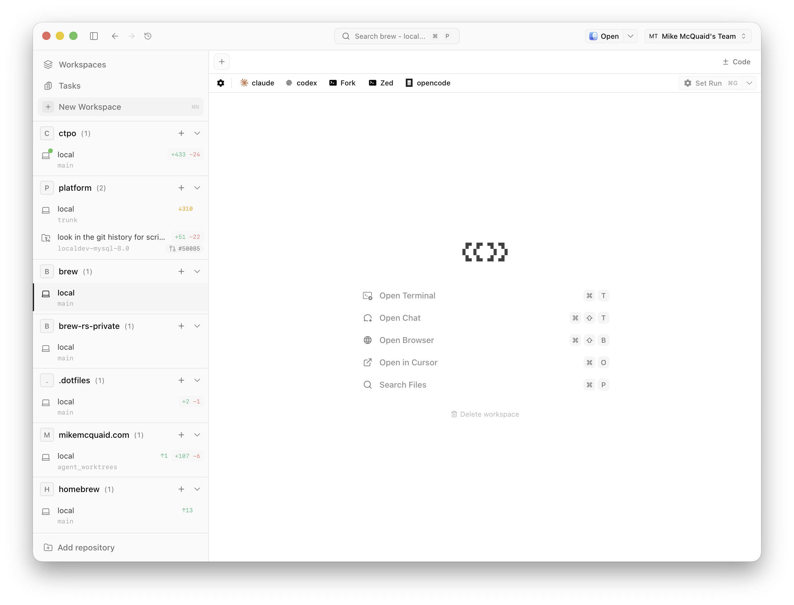

# A8. Право действовать и право признать изменение принятым

Агенту легко дать действие. Ему можно открыть `shell`, рабочее дерево, прогретый `devbox`, `workflow runner`, право создать pull request, перезапустить тесты и обновить задачу. Но всё это отвечает только на вопрос: может ли система совершить следующий шаг. В разработке есть второй вопрос: кто вправе признать изменение принятым. Когда эти вопросы смешиваются, технический сигнал начинает выглядеть как решение: `checks_passed`, `pr_opened`, `policy_compliant`, `agent_reported_done` или `gate_satisfied` читаются как `accepted`. Автоматическая проверка применяет заранее заданное правило: блокирует движение или допускает следующий шаг. Она не становится владельцем смысла изменения, если организация явно не делегировала ей такое право и не записала границы этой делегации.

<figure class="source-figure synthetic-figure" id="fig-a8-action-vs-acceptance-boundary">
  <pre><code>разрешение на действие                      право признать изменение принятым
may_read / may_write / may_run_tests        may_accept_adr / may_approve_owned_code
may_open_pr / may_fix_ci_failure      →      may_merge / may_release / may_close_outcome

переход требует: свидетельства → явной проверки → владельца решения</code></pre>
  <figcaption>Разрешение на действие двигает работу до следующего проверяемого состояния, но не переносит на агента право архитектурного, продуктового, security или merge-принятия.</figcaption>
</figure>

## Владение кодом и статус ADR

Обычная инфраструктура ревью уже устроена по этому принципу. GitHub описывает CODEOWNERS как файл, который задаёт людей или команды, ответственные за участки кода; при изменении файлов с владельцами эти владельцы автоматически запрашиваются на ревью, а защита ветки может требовать одобрение code owner перед merge ([GitHub Docs, About code owners](https://docs.github.com/en/repositories/managing-your-repositorys-settings-and-features/customizing-your-repository/about-code-owners)). В этой механике важно, где живёт право: владельцы должны иметь право записи, запросы ревью берутся из CODEOWNERS на базовой ветке PR, одного одобрения от указанного code owner достаточно для этого правила, а сам CODEOWNERS рекомендуется защищать отдельным правилом владения. Агент может записать diff в ветку и открыть PR, но защищённая ветка ждёт владельца, который берёт ответственность за свой участок кода. Способность находится в рабочем дереве; принятие — в контуре владения.

В архитектурных решениях та же граница проходит через статус. Майкл Найгард фиксирует минимальные разделы ADR — context, decision, status, consequences — и отдельно называет proposed, accepted, deprecated и superseded ([Documenting Architecture Decisions](https://cognitect.com/blog/2011/11/15/documenting-architecture-decisions)). AWS описывает похожий переход как процедуру ревью: ADR в статусе Proposed готов к рассмотрению; команда может оставить его Proposed с пунктами доработки, отклонить, либо после одобрения владелец добавляет метку времени, версию и список заинтересованных участников и переводит статус в Accepted; дальше принятые ADR используются в ревью кода и архитектуры, где ревьюер может попросить автора исправить изменение кода, нарушающее ADR ([AWS Prescriptive Guidance, ADR process](https://docs.aws.amazon.com/prescriptive-guidance/latest/architectural-decision-records/adr-process.html)). Агент может подготовить ADR, найти последствия и даже обнаружить нарушение. Архитектурный текст, сгенерированный агентом, всё равно остаётся предложением, пока процесс принятия не изменил его статус.

## CI, PR и агентная платформа доводят работу до кандидата

Отсюда следует жёсткое правило для CI: `passing CI` не должно превращаться в `accepted`. Тесты проверяют выбранные свойства изменения. Они не владеют всей областью последствий. CI говорит, что конкретные проверки прошли; защищённая ветка может сделать это обязательным gate. Без него нельзя идти дальше, с ним можно перейти к следующей проверке. Но он не говорит, что владелец продукта согласен с поведением, что архитектурное исключение допустимо, что риск для безопасности принят, что изменение стоит ревью-нагрузки, или что проект хочет именно такого вклада. Зелёный CI — сильное свидетельство в пакете доказательств, но не право закрыть вопрос.

<figure class="source-figure synthetic-figure" id="fig-a8-pr-as-candidate">
  <pre><code>agent runtime → worktree / devbox → patch → checks → PR opened
                                                    ↓
                CODEOWNERS / ADR / security / product review
                                                    ↓
                         accepted | rejected | superseded | needs changes</code></pre>
  <figcaption>PR делает работу видимой и проверяемой, но остаётся кандидатом на принятие, а не завершённой задачей.</figcaption>
</figure>

На этом фоне автономные платформы не отменяют правило, а делают его заметнее. Stripe Minions хорошо показывает эту границу. Публичное описание Minions связывает систему с pull request как формой результата: агент берёт задачу, пишет код, проходит проверки, готовит ветку, а если результат выглядит пригодным, инженер открывает PR и запрашивает ревью у другого инженера; Stripe отдельно подчёркивает, что такие PR human-reviewed, даже когда в них нет человечески написанного кода ([Stripe, Minions: Stripe’s one-shot, end-to-end coding agents](https://stripe.dev/blog/minions-stripes-one-shot-end-to-end-coding-agents); [Part 2](https://stripe.dev/blog/minions-stripes-one-shot-end-to-end-coding-agents-part-2)). Для этого узла не нужно доказывать тезис числом PR в неделю. Важнее форма результата: ветка, проверки, CI и шаблон PR делают работу агента артефактом для ревью. Платформа удешевляет путь от задачи к проверяемому кандидату. Она не делает агента владельцем права на merge.

Если Stripe показывает производственный контур, то у Jökull Sólberg та же граница видна на малом участке — внутри сопровождения PR. `/babysit-pr` ждёт CI и Greptile, запускает `codex review --base main`, классифицирует замечания как Fix, Dismiss или Escalate, исправляет валидные пункты, запускает линтер, делает commit/push и повторяет цикл до зелёного CI и отсутствия нерешённых замечаний, но с лимитом в три итерации ([Babysitting PRs](https://www.solberg.is/babysit-pr)). Escalate означает `needs human judgment`, то есть требует человеческой оценки. Даже когда после такого цикла автоматизация репозитория ставит auto-merge в очередь, это граница процесса, заранее настроенная владельцами репозитория, а не право, которое агент получил из факта успешного цикла. Агент забирает ожидание, диспетчеризацию и рутинные исправления. Спорное суждение выходит из автоматического цикла к человеку.

## Локальная изоляция не снимает ответственности автора

Отдельно от PR-конвейера стоит локальная изоляция. Она уменьшает риск действия, но не меняет контур владения. Mike McQuaid описывает Sandvault как альтернативу режимам bypass/YOLO: macOS sandboxing и отдельный пользователь без админ-прав позволяют запускать агента через `sv claude`, `sv codex` или `sv shell`; git worktrees дают параллельные ветки одного репозитория в отдельных директориях ([Sandboxed Agent Worktrees: My Coding & AI Setup in 2026](https://mikemcquaid.com/sandboxed-agent-worktrees-my-coding-and-ai-setup-in-2026/); [Sandvault](https://github.com/webcoyote/sandvault)). Такой sandbox хорошо описывает право на действие: агенту можно дать больше самостоятельности и ограничить ущерб от неверного шага. Дальше McQuaid всё равно делает локальное ревью перед тем, как поделиться работой агента: читает diff, правит вручную, запускает проверочные тесты, использует ревью другой AI-системой и смотрит сбои CI, выбирая глубину проверки по критичности и защитным механизмам.

<figure class="source-figure real-asset-figure" id="fig-a8-local-sandbox-action-boundary">
  
  <figcaption>Worktrees и sandboxed agent surfaces помогают действовать безопаснее и параллельнее, но находятся до локального ревью, внешнего ревью и окончательного принятия.</figcaption>
</figure>

Homebrew закрепляет ту же границу как политику: AI/LLM contribution требует раскрыть инструмент и модель, проверить весь сгенерированный материал автором, уметь отвечать на комментарии вручную и для участников без статуса maintainer не держать больше одного `AI-assisted/generated` PR одновременно ([Homebrew CONTRIBUTING](https://github.com/Homebrew/brew/blob/main/CONTRIBUTING.md)). Sandbox даёт безопасное действие; участие в проекте требует ответственного автора.

## Политики участия защищают ревью и происхождение вклада

В open-source добавляется ещё один слой: проект может оценивать не только diff, но и способ участия. Zig — строгий край этого спектра, а не отдельная этическая глава. Его Code of Conduct ограничивает конкретные пространства проекта — ziglang organization на Codeberg, `#zig` IRC и Zig project development Zulip — и запрещает там код или прозу, сгенерированные LLM, перефразирование, редактирование, перевод, brainstorming с переносом результата, поиск багов и обсуждение chatbot/LLM-сервисов ([Zig Code of Conduct](https://ziglang.org/code-of-conduct/)). Loris Cro объясняет это через «contributor poker»: ревью maintainer часто стоит дороже самостоятельной реализации изменения, но проект инвестирует в новых участников ради будущей ответственности и доверия; вклад, произведённый AI, ломает этот расчёт, когда автор приносит не своё понимание, а ответы модели: галлюцинированные drive-by PR, огромные первые PR и внешне приемлемые submissions, где последующее обсуждение показывает пересказ ошибочных ответов LLM ([Contributor Poker and AI](https://kristoff.it/blog/contributor-poker-and-ai/)). Здесь принятие зависит не только от diff. Оно зависит от проверяемого участия человека, который способен объяснять, исправлять и сопровождать изменение.

Другие open-source политики проводят линию иначе, но не отменяют её. Linux kernel требует, чтобы AI coding assistants следовали обычному процессу внесения изменений, а человеческий отправитель проверял AI-generated code, ставил собственный `Signed-off-by` и брал ответственность за вклад. LLVM требует прозрачности для материала, существенно созданного инструментом, запрещает агентам действовать в рабочих пространствах без человеческого одобрения и описывает непроверенный вывод LLM как перенос работы на ревью мейнтейнеров. tiangolo/FastAPI разрешает инструменты, включая AI, но требует meaningful human intervention, judgement и context; PR не стоит отправлять, если человеческая работа автора меньше работы, которая потребуется ревьюерам. QEMU выбирает более жёсткую позицию: текущая политика отклоняет contributions, которые, как считается, включают или выводятся из AI-generated content, потому что DCO/provenance-риски не имеют ясного решения ([Linux kernel, Coding Assistance](https://docs.kernel.org/process/coding-assistants.html); [LLVM AI Tool Policy](https://llvm.org/docs/AIToolPolicy.html); [tiangolo.com, Automated Code and AI](https://tiangolo.com/open-source/contributing/#automated-code-and-ai); [QEMU Code Provenance](https://www.qemu.org/docs/master/devel/code-provenance.html)). Политики разные, но инвариант один: способность произвести diff не переносит на генератор право участия, подтверждения происхождения, расходования ревью-ёмкости или принятия.

<figure class="source-figure synthetic-figure" id="fig-a8-contribution-policy-boundaries">
  <pre><code>Linux / DCO       → человеческий отправитель проверяет вклад и подписывается сам
LLVM / Homebrew   → раскрытие AI-использования, человеческое одобрение, защита ревью-нагрузки
FastAPI           → meaningful human intervention и запрет переносить работу на ревьюеров
QEMU              → жёсткая граница provenance/DCO для AI-generated/derived content
Zig               → запрет LLM-generated work в рабочих пространствах проекта

общий инвариант: возможность подать diff не даёт права расходовать ревью-ёмкость проекта</code></pre>
  <figcaption>Open-source политики проводят границу разными механизмами: ответственностью отправителя, раскрытием AI-использования, происхождением вклада, нагрузкой на ревьюеров и допустимым способом участия.</figcaption>
</figure>

## Принятие как состояние рабочего графа

В Persistent Work Graph это различие должно быть объектом модели. Если в графе есть только `done`, агент будет присваивать завершение по последнему успешному вызову инструмента. Нужны состояния вроде `patched`, `checks_passed`, `ready_for_review`, `waiting_for_code_owner`, `waiting_for_architecture_decision`, `accepted`, `rejected`, `superseded`. Beads `bd gate` полезен как практический ориентир: он моделирует ожидания как устойчивые gate-объекты, включая human, timer, GitHub run, GitHub PR и зависимости от других beads ([Beads CLI reference: bd gate](https://gastownhall.github.io/beads/cli-reference/gate)). Человеческое ревью и PR approval в такой схеме не должны превращаться в одну фразу в промпте. Автоматический gate записывает `gate_satisfied` или `blocked`; если принятие действительно делегировано автоматике, граф хранит источник делегирования, область действия и владельца, который отвечает за это правило.

<figure class="source-figure synthetic-figure" id="fig-a8-pwg-acceptance-state-machine">
  <pre><code>patched
  → checks_passed
  → ready_for_review
  → waiting_for_code_owner
  → accepted

side transitions
ready_for_review → waiting_for_architecture_decision
waiting_for_code_owner → needs_changes
waiting_for_architecture_decision → superseded / rejected / accepted</code></pre>
  <figcaption>PWG должен хранить принятие как отдельное состояние, а не как переименование последнего успешного технического сигнала.</figcaption>
</figure>

## Что должна возвращать агентная платформа

Следствие для среды исполнения агента простое: права на действие должны быть разнесены с правами принятия. В первом наборе находятся `may_read`, `may_write`, `may_run_tests`, `may_fix_ci_failure`, `may_open_pr`, `may_update_task`, `may_request_review`. Во втором — `may_accept_adr`, `may_approve_owned_code`, `may_merge`, `may_release`, `may_mark_business_outcome_complete`, `may_close_contribution_as_unacceptable`. Эти права могут иногда принадлежать одному человеку или одной системе, но их нельзя выводить друг из друга. Shell-доступ не даёт права на merge. Worktree не даёт права считать diff согласованным. Workflow runner не даёт права признать бизнес-результат достигнутым. Открытый PR не является закрытой задачей.

Хорошая агентная платформа поэтому должна возвращать не «я завершил», а «я довёл работу до следующего проверяемого состояния». В сообщении агента должны быть diff, тесты, журналы, затронутые зоны владения, открытые вопросы, нужный владелец, нарушенные или подтверждённые ADR, явно названная проверка и точный статус: `ready_for_review`, `waiting_for_owner`, `blocked_by_policy`, `needs_human_judgment`, но не обобщающее `done`. Тогда человек или другой уполномоченный контур принимает решение, не восстанавливая весь путь из чата. Агент действует внутри среды исполнения; право принятия живёт в графе управления. Между ними нужен протокол передачи свидетельств, а не доверие к последней строке ответа модели.
